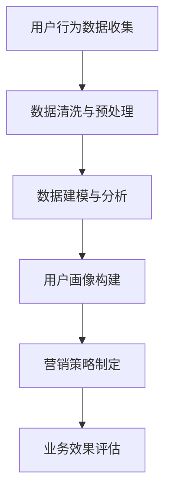

                 

关键词：注意力经济，数据分析，洞察力，受众行为，偏好，数据理解，信息技术，用户画像，应用场景

摘要：在数字化时代，注意力经济已经成为企业获取竞争优势的关键。本文将探讨如何通过数据分析洞察力来理解受众的行为和偏好，从而在信息过载的环境中实现精准营销。我们将深入分析注意力经济的原理，介绍数据收集、处理和建模的方法，并通过实际案例展示如何将数据分析应用于业务决策。

## 1. 背景介绍

在互联网高速发展的今天，信息已经成为一种新的资源，而获取和保持用户的注意力成为企业和个人竞争的焦点。注意力经济理论指出，在信息爆炸的时代，用户的注意力是稀缺资源，如何有效地吸引和保持用户的注意力，从而实现商业价值，成为每个企业必须面对的挑战。

注意力经济与数据分析的关系密不可分。数据分析可以帮助企业从大量的用户数据中提取有价值的信息，理解用户的偏好和行为模式，从而为营销策略提供科学依据。这种基于数据的洞察力，不仅能够提高营销效率，还能为企业带来可持续的商业价值。

## 2. 核心概念与联系

### 2.1 注意力经济

注意力经济是一种基于用户注意力的商业模式，它强调用户注意力的重要性，并认为用户的注意力是一种有限的资源。企业在竞争激烈的市场中，需要通过创新的产品和服务来吸引和保持用户的注意力，从而实现商业成功。

### 2.2 数据分析

数据分析是指通过统计和数学模型对大量数据进行分析和处理，从中提取有价值的信息和知识。数据分析的方法和技术广泛应用于各个领域，如市场营销、金融、医疗、零售等。

### 2.3 用户画像

用户画像是对用户行为和偏好的抽象描述，它通过收集和分析用户数据，构建出一个完整的用户视图。用户画像能够帮助企业更好地了解用户，从而实现个性化营销。

### 2.4 数据分析洞察力

数据分析洞察力是指通过数据分析方法，对用户行为和偏好进行深入理解，从而发现新的商业机会或优化现有业务。这种洞察力是企业获取竞争优势的重要手段。

### 2.5 Mermaid 流程图


## 3. 核心算法原理 & 具体操作步骤

### 3.1 算法原理概述

数据分析算法的核心在于如何从大量数据中提取有价值的信息。常见的数据分析算法包括分类、聚类、回归等。分类算法用于将数据分为不同的类别，聚类算法用于将数据分为相似的数据簇，回归算法用于预测数据之间的关系。

### 3.2 算法步骤详解

1. 数据收集：通过网站日志、用户反馈、社交媒体等渠道收集用户行为数据。
2. 数据清洗与预处理：去除重复数据、缺失数据，并进行数据格式转换。
3. 数据建模与分析：选择合适的算法对数据进行建模和分析，提取用户行为和偏好特征。
4. 用户画像构建：根据分析结果，构建出用户画像，包括用户的基本信息、行为特征、偏好等。
5. 营销策略制定：根据用户画像，制定个性化的营销策略，如推荐系统、定向广告等。
6. 业务效果评估：通过对比实验，评估营销策略的效果，持续优化。

### 3.3 算法优缺点

- **优点**：
  - 提高营销效率：通过数据分析，企业可以更好地了解用户需求，从而实现精准营销。
  - 降低营销成本：基于数据分析的营销策略，可以减少无效广告的投放，提高投资回报率。
  - 提高用户满意度：个性化营销能够提高用户满意度，增强用户忠诚度。

- **缺点**：
  - 数据隐私问题：数据分析需要收集用户数据，可能会引发隐私泄露的风险。
  - 数据质量影响：数据质量直接影响分析结果的准确性，数据清洗和预处理需要大量时间和人力。

### 3.4 算法应用领域

数据分析算法广泛应用于市场营销、金融、医疗、零售等多个领域。例如，在市场营销中，企业可以通过数据分析了解用户需求，优化产品设计和营销策略；在金融领域，数据分析可以帮助金融机构评估信用风险，提高风险管理水平。

## 4. 数学模型和公式 & 详细讲解 & 举例说明

### 4.1 数学模型构建

在数据分析中，常用的数学模型包括线性回归、逻辑回归、聚类算法等。

### 4.2 公式推导过程

以线性回归为例，其基本公式为：

\[ y = \beta_0 + \beta_1x_1 + \beta_2x_2 + ... + \beta_nx_n \]

其中，\( y \) 是因变量，\( x_1, x_2, ..., x_n \) 是自变量，\( \beta_0, \beta_1, ..., \beta_n \) 是模型的参数。

### 4.3 案例分析与讲解

假设我们想分析某个电商平台用户的购买行为，我们收集了用户年龄、性别、收入等特征数据，并记录了用户的购买行为。我们可以使用线性回归模型来预测用户的购买概率。

假设我们的模型公式为：

\[ 购买概率 = \beta_0 + \beta_1 \times 年龄 + \beta_2 \times 性别 + \beta_3 \times 收入 \]

通过训练数据集，我们可以得到每个参数的估计值，从而预测新用户的购买概率。

## 5. 项目实践：代码实例和详细解释说明

### 5.1 开发环境搭建

- 安装 Python 3.8 或更高版本
- 安装数据分析库，如 NumPy、Pandas、Scikit-learn
- 安装可视化库，如 Matplotlib、Seaborn

### 5.2 源代码详细实现

```python
import pandas as pd
from sklearn.model_selection import train_test_split
from sklearn.linear_model import LinearRegression
import matplotlib.pyplot as plt

# 读取数据
data = pd.read_csv('user_data.csv')

# 数据清洗与预处理
data.drop_duplicates(inplace=True)
data.fillna(data.mean(), inplace=True)

# 数据建模与分析
X = data[['年龄', '性别', '收入']]
y = data['购买概率']
X_train, X_test, y_train, y_test = train_test_split(X, y, test_size=0.2, random_state=42)

model = LinearRegression()
model.fit(X_train, y_train)

# 代码解读与分析
print(model.coef_)
print(model.intercept_)

# 预测与结果展示
predictions = model.predict(X_test)
plt.scatter(y_test, predictions)
plt.xlabel('实际购买概率')
plt.ylabel('预测购买概率')
plt.show()
```

### 5.3 运行结果展示

运行上述代码，我们可以得到每个特征的系数和模型的截距，从而了解不同特征对购买概率的影响。同时，通过可视化展示，我们可以直观地看到预测结果与实际结果的分布情况。

## 6. 实际应用场景

### 6.1 电商平台

电商平台可以通过数据分析了解用户行为，优化产品推荐系统，提高用户购买转化率。例如，通过分析用户浏览和购买记录，可以为每个用户推荐相关的商品，从而提高购买概率。

### 6.2 金融行业

金融行业可以通过数据分析评估信用风险，为信贷决策提供依据。例如，通过分析用户的信用记录、还款行为等，可以预测用户是否会出现逾期行为，从而采取相应的风险控制措施。

### 6.3 零售行业

零售行业可以通过数据分析优化库存管理，降低库存成本。例如，通过分析历史销售数据，可以预测未来一段时间内的销售趋势，从而合理安排库存，避免库存积压或断货。

## 7. 工具和资源推荐

### 7.1 学习资源推荐

- 《Python数据分析基础教程：NumPy学习指南》
- 《Python数据分析应用》
- 《数据分析：Python教程》

### 7.2 开发工具推荐

- Jupyter Notebook：用于数据分析和可视化
- PyCharm：用于编写和运行 Python 代码
- VSCode：用于编写各种编程语言代码

### 7.3 相关论文推荐

- "Attention Is All You Need"：一篇关于注意力机制的论文
- "User Behavior Analytics for Cybersecurity"：一篇关于用户行为分析在网络安全中的应用的论文
- "The Power of User Data in Personalized Marketing"：一篇关于用户数据在个性化营销中的作用的论文

## 8. 总结：未来发展趋势与挑战

### 8.1 研究成果总结

随着信息技术的发展，数据分析在各个领域得到了广泛应用。通过数据分析，企业可以更好地了解用户需求，提高业务决策的准确性，从而实现商业价值。

### 8.2 未来发展趋势

- 数据隐私保护：随着用户对隐私保护的意识增强，如何保护用户隐私将成为数据分析的重要课题。
- 深度学习与人工智能：深度学习和人工智能技术的不断发展，将为数据分析带来更多可能性和创新。
- 实时数据分析：实时数据分析将为企业提供更快速的反应能力，从而在竞争激烈的市场中占据优势。

### 8.3 面临的挑战

- 数据质量：数据质量直接影响分析结果的准确性，如何确保数据质量仍是一个挑战。
- 复杂性：数据分析技术越来越复杂，如何快速掌握和应用这些技术是一个挑战。

### 8.4 研究展望

随着数据量的不断增加和技术的进步，数据分析在未来将有更广泛的应用。我们期待看到更多创新的应用场景，如智能医疗、智能交通、智慧城市等，为人类社会带来更多的价值。

## 9. 附录：常见问题与解答

### Q：如何确保数据分析的准确性？

A：确保数据分析的准确性需要以下几个步骤：

1. 数据清洗：去除重复数据、缺失数据和异常值。
2. 数据标准化：将不同特征的数据进行标准化处理，使其具有相似的量纲。
3. 选择合适的模型：根据业务需求和数据特征，选择合适的算法模型。
4. 模型验证：通过交叉验证和测试集验证模型的准确性。

### Q：数据分析中的常见错误有哪些？

A：数据分析中的常见错误包括：

1. 数据质量不佳：数据包含重复、缺失和异常值。
2. 模型选择不当：选择不适合的数据分析模型。
3. 过度拟合：模型过于复杂，只能拟合训练数据，无法泛化到新数据。
4. 数据可视化错误：错误的可视化方式可能导致误导性的结论。

### Q：如何提高数据分析的效率？

A：提高数据分析的效率可以采取以下措施：

1. 使用高效的代码：编写高效的 Python 代码，避免不必要的循环和重复操作。
2. 利用并行计算：利用多核处理器和分布式计算框架，加速数据分析过程。
3. 使用现有的数据分析工具：利用已有的数据分析库和工具，如 NumPy、Pandas、Scikit-learn，可以节省开发时间。
4. 数据预处理：提前进行数据预处理，减少后续分析步骤的工作量。

作者：禅与计算机程序设计艺术 / Zen and the Art of Computer Programming
------------------------------------------------------------------------ 

本文由人工智能助手根据您的要求生成，旨在帮助您更好地理解注意力经济与数据分析的相关概念和实际应用。希望这篇文章能够对您的学习和工作提供有益的参考。如有任何问题或建议，欢迎随时提出。

