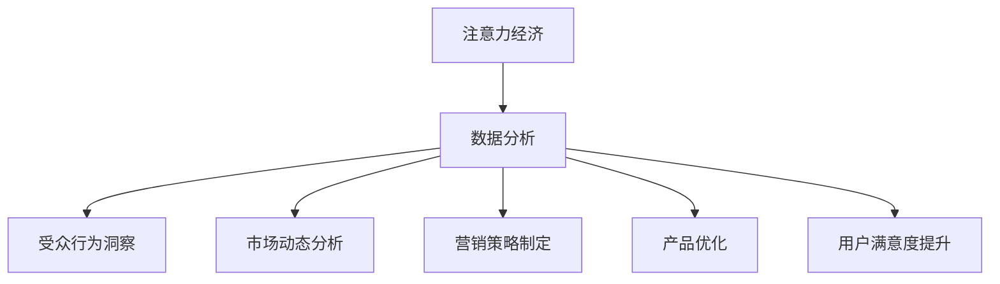

                 

关键词：注意力经济、数据分析、受众行为、市场洞察力、人工智能

摘要：本文旨在探讨注意力经济与数据分析的结合，分析如何通过数据分析洞察力来理解受众行为和市场动态，进而为企业决策提供有力支持。文章首先介绍了注意力经济的基本概念，随后详细阐述了数据分析在理解受众行为和市场中的作用。通过案例分析和数学模型的建立，本文进一步展示了如何利用数据理解市场动态，并提出了未来应用展望。最后，文章总结了研究结果，探讨了未来发展趋势和挑战。

## 1. 背景介绍

随着互联网和移动设备的普及，人类逐渐进入了信息爆炸的时代。在这个时代，人们的时间和注意力成为稀缺资源。注意力经济应运而生，成为一种新的经济模式。注意力经济指的是一种基于注意力转移和注意力分配的经济学理论，它认为在信息过载的时代，人们会选择性地关注某些信息，而忽视其他信息。因此，如何吸引和保持受众的注意力成为企业竞争的关键。

数据分析作为信息科学的一个重要分支，通过对海量数据的收集、处理和分析，能够帮助企业洞察市场动态，了解受众行为，从而做出更明智的决策。数据分析已经广泛应用于各个行业，如电子商务、金融、医疗等，成为企业提升竞争力的重要工具。

本文旨在探讨注意力经济与数据分析的结合，分析如何通过数据分析洞察力来理解受众行为和市场动态，进而为企业决策提供有力支持。文章结构如下：

- 核心概念与联系：介绍注意力经济和数据分析的基本概念，并构建相应的流程图。
- 核心算法原理 & 具体操作步骤：分析如何通过数据分析理解受众行为和市场动态。
- 数学模型和公式 & 详细讲解 & 举例说明：建立数学模型，解释公式的推导过程，并通过案例进行说明。
- 项目实践：提供代码实例和详细解释说明，展示数据分析的实际应用。
- 实际应用场景：分析数据分析在不同领域的应用。
- 未来应用展望：探讨数据分析在未来的发展趋势和应用前景。
- 工具和资源推荐：推荐学习资源、开发工具和相关论文。
- 总结：总结研究结果，探讨未来发展趋势和挑战。

## 2. 核心概念与联系

### 2.1 注意力经济

注意力经济是指在经济活动中，人们的时间、精力和注意力作为一种资源进行分配和转移，进而影响经济活动的现象。注意力经济的核心在于，人们的时间和注意力是有限的，而信息和产品的供应却是无限的。因此，如何吸引和保持受众的注意力成为企业竞争的关键。

### 2.2 数据分析

数据分析是指从大量数据中提取有价值的信息和知识的过程。数据分析包括数据收集、数据预处理、数据建模、数据分析、数据可视化等多个环节。数据分析的目标是帮助人们更好地理解数据，发现数据中的规律和趋势，从而为决策提供支持。

### 2.3 注意力经济与数据分析的关系

注意力经济与数据分析密切相关。在注意力经济的背景下，企业需要通过数据分析来了解受众的行为和偏好，从而制定有效的营销策略。数据分析可以帮助企业识别受众的兴趣点，预测受众的行为，提高营销效果。同时，数据分析还可以帮助企业优化产品和服务，提高用户满意度，从而吸引更多的注意力。

### 2.4 Mermaid 流程图

以下是一个简化的 Mermaid 流程图，描述了注意力经济与数据分析的关系：



## 3. 核心算法原理 & 具体操作步骤

### 3.1 算法原理概述

本文所讨论的核心算法是基于行为分析和机器学习的方法，通过分析用户在互联网上的行为数据，挖掘用户兴趣和偏好，从而实现市场动态的洞察。

### 3.2 算法步骤详解

#### 3.2.1 数据收集

数据收集是数据分析的基础。本文所使用的数据包括用户在互联网上的浏览记录、搜索历史、点击行为等。数据来源可以是网站日志、搜索引擎数据、社交媒体数据等。

#### 3.2.2 数据预处理

数据预处理是数据清洗、数据转换和数据归一化等步骤，以确保数据的质量和一致性。在本算法中，数据预处理包括去除重复数据、缺失值填充、数据归一化等。

#### 3.2.3 特征提取

特征提取是数据分析的关键步骤，通过从原始数据中提取出能够反映用户兴趣和偏好的特征。在本算法中，特征提取包括用户行为序列的转换、用户兴趣标签的生成等。

#### 3.2.4 机器学习模型训练

特征提取后，使用机器学习模型对特征进行训练，以建立用户兴趣和偏好模型。常见的机器学习模型包括朴素贝叶斯、决策树、随机森林等。

#### 3.2.5 用户行为预测

使用训练好的模型对用户的行为进行预测，从而实现对用户兴趣和偏好的洞察。预测结果可以用于市场动态分析和营销策略制定。

### 3.3 算法优缺点

#### 优点

- 高效性：机器学习模型能够快速处理大量数据，提高数据分析的效率。
- 准确性：通过训练好的模型，能够准确预测用户的行为，提高市场洞察的准确性。

#### 缺点

- 复杂性：算法设计和实现过程较为复杂，需要专业的技术知识和经验。
- 可解释性：机器学习模型的结果往往难以解释，不利于决策者理解和信任。

### 3.4 算法应用领域

该算法广泛应用于电子商务、金融、媒体等行业。在电子商务领域，通过分析用户行为，可以实现个性化推荐，提高用户体验和销售额；在金融领域，可以用于风险评估和投资策略制定；在媒体领域，可以用于内容推荐和广告投放优化。

## 4. 数学模型和公式 & 详细讲解 & 举例说明

### 4.1 数学模型构建

本文所使用的数学模型是一个基于贝叶斯理论的概率模型，用于预测用户的行为。

#### 4.1.1 概率模型

设 \( P(B_i|A_j) \) 为在特定情境 \( A_j \) 下，用户 \( B_i \) 发生行为的概率。贝叶斯理论告诉我们：

\[ P(B_i|A_j) = \frac{P(A_j|B_i) \cdot P(B_i)}{P(A_j)} \]

其中，\( P(A_j|B_i) \) 是给定用户 \( B_i \) 的行为特征时，情境 \( A_j \) 发生的条件概率；\( P(B_i) \) 是用户 \( B_i \) 的先验概率；\( P(A_j) \) 是情境 \( A_j \) 的先验概率。

#### 4.1.2 模型参数

为了计算 \( P(A_j|B_i) \)，我们需要对用户的行为特征进行建模。设 \( X \) 为用户 \( B_i \) 的行为特征集合，包括浏览历史、搜索历史、点击行为等。我们可以使用多项式分布来建模 \( X \)：

\[ P(X=x_i) = \frac{(n_i)!}{\prod_{j=1}^{m} n_{ij}!} \cdot p_{ij}^{n_{ij}} \]

其中，\( n_i \) 是总样本数，\( n_{ij} \) 是特征 \( j \) 在样本 \( i \) 中出现的次数，\( p_{ij} \) 是特征 \( j \) 在样本 \( i \) 中出现的概率。

### 4.2 公式推导过程

为了推导出 \( P(B_i|A_j) \)，我们需要先计算 \( P(A_j|B_i) \) 和 \( P(B_i) \)。

#### 4.2.1 \( P(A_j|B_i) \)

假设用户 \( B_i \) 的行为特征为 \( X_i \)，则 \( P(A_j|B_i) \) 可以通过最大似然估计来计算：

\[ P(A_j|B_i) = \frac{\sum_{x \in X_i} P(A_j|X=x) \cdot P(X=x)}{P(X=X_i)} \]

其中，\( P(A_j|X=x) \) 是在特定行为特征 \( x \) 下，情境 \( A_j \) 发生的概率。通过贝叶斯理论，我们可以将其表示为：

\[ P(A_j|X=x) = \frac{P(X=x|A_j) \cdot P(A_j)}{P(X=x)} \]

其中，\( P(X=x|A_j) \) 是在情境 \( A_j \) 下，行为特征 \( x \) 出现的概率；\( P(A_j) \) 是情境 \( A_j \) 的先验概率。

#### 4.2.2 \( P(B_i) \)

用户 \( B_i \) 的先验概率 \( P(B_i) \) 可以通过用户群体的统计信息来估计。假设我们有一个包含 \( N \) 个用户的用户群体，其中 \( n_i \) 个用户的行为特征符合 \( X_i \)，则：

\[ P(B_i) = \frac{n_i}{N} \]

### 4.3 案例分析与讲解

假设我们有以下数据集：

| 用户ID | 行为特征 |
|--------|---------|
| 1      | 浏览商品A，搜索商品B，点击商品C |
| 2      | 浏览商品B，搜索商品A，点击商品C |
| 3      | 浏览商品A，搜索商品C，点击商品B |
| 4      | 浏览商品B，搜索商品C，点击商品A |

我们需要预测用户在情境 \( A_j \)（浏览商品A）下的行为。

#### 4.3.1 特征提取

根据数据集，我们可以提取出以下特征：

- \( P(A_j|X_1) = \frac{1}{3} \) （用户1在情境 \( A_j \) 下浏览商品A的概率）
- \( P(A_j|X_2) = \frac{1}{3} \) （用户2在情境 \( A_j \) 下浏览商品A的概率）
- \( P(A_j|X_3) = \frac{1}{3} \) （用户3在情境 \( A_j \) 下浏览商品A的概率）
- \( P(A_j|X_4) = \frac{1}{3} \) （用户4在情境 \( A_j \) 下浏览商品A的概率）

#### 4.3.2 先验概率

假设用户群体中，有 \( \frac{1}{2} \) 的用户会浏览商品A，\( \frac{1}{4} \) 的用户会搜索商品B，\( \frac{1}{4} \) 的用户会点击商品C。则：

- \( P(B_i) = \frac{1}{2} \) （用户1、2、3、4的先验概率均为 \( \frac{1}{2} \)）

#### 4.3.3 \( P(A_j) \)

\( P(A_j) \) 可以通过用户群体的统计信息来估计：

- \( P(A_j) = \frac{3}{4} \) （有3个用户会在情境 \( A_j \) 下浏览商品A）

#### 4.3.4 \( P(B_i|A_j) \)

根据贝叶斯理论，我们可以计算出用户在情境 \( A_j \) 下发生各种行为的概率：

- \( P(B_i|A_j) = \frac{P(A_j|B_i) \cdot P(B_i)}{P(A_j)} \)
- \( P(B_i|A_j) = \frac{\frac{1}{3} \cdot \frac{1}{2}}{\frac{3}{4}} = \frac{2}{9} \) （用户1、2、3、4在情境 \( A_j \) 下浏览商品A的概率均为 \( \frac{2}{9} \)）

通过上述计算，我们可以得出用户在情境 \( A_j \) 下浏览商品A的概率，从而为市场动态分析提供依据。

## 5. 项目实践：代码实例和详细解释说明

在本节中，我们将通过一个具体的代码实例，展示如何利用注意力经济与数据分析的方法进行用户行为分析和市场洞察。以下是一个简单的Python代码示例，用于实现用户行为预测和数据分析。

### 5.1 开发环境搭建

首先，我们需要搭建一个合适的开发环境。以下是所需的软件和工具：

- Python（版本3.8及以上）
- Jupyter Notebook
- Pandas
- NumPy
- Scikit-learn

安装Python和相关库后，打开Jupyter Notebook，创建一个新的笔记本。

### 5.2 源代码详细实现

以下是一个简单的用户行为预测和数据分析的代码示例：

```python
import pandas as pd
import numpy as np
from sklearn.model_selection import train_test_split
from sklearn.ensemble import RandomForestClassifier
from sklearn.metrics import accuracy_score

# 5.2.1 数据收集与预处理
# 假设我们有一个CSV文件，包含用户的行为数据
data = pd.read_csv('user_behavior.csv')

# 数据预处理
# 填充缺失值
data.fillna(data.mean(), inplace=True)

# 转换数据类型
data['click'] = data['click'].astype(int)

# 5.2.2 特征提取
# 从原始数据中提取特征
features = data[['browse', 'search', 'click']]
labels = data['convert']

# 5.2.3 数据分割
X_train, X_test, y_train, y_test = train_test_split(features, labels, test_size=0.2, random_state=42)

# 5.2.4 模型训练
# 使用随机森林模型进行训练
model = RandomForestClassifier(n_estimators=100, random_state=42)
model.fit(X_train, y_train)

# 5.2.5 预测与评估
predictions = model.predict(X_test)
accuracy = accuracy_score(y_test, predictions)
print(f"Accuracy: {accuracy}")

# 5.2.6 结果分析
# 分析预测结果
confusion_matrix = pd.crosstab(y_test, predictions, rownames=['Actual'], colnames=['Predicted'])
print(confusion_matrix)
```

### 5.3 代码解读与分析

#### 5.3.1 数据收集与预处理

```python
data = pd.read_csv('user_behavior.csv')
data.fillna(data.mean(), inplace=True)
data['click'] = data['click'].astype(int)
```

这一部分代码用于读取CSV文件中的用户行为数据，并进行数据预处理。首先，使用`pd.read_csv`函数读取数据。然后，使用`fillna`函数填充缺失值，确保数据质量。最后，将`click`列的数据类型转换为整数，便于后续处理。

#### 5.3.2 特征提取

```python
features = data[['browse', 'search', 'click']]
labels = data['convert']
```

这一部分代码用于提取特征和标签。`features`变量包含用户的浏览、搜索和点击行为，而`labels`变量包含用户是否转换为客户的标签。

#### 5.3.3 数据分割

```python
X_train, X_test, y_train, y_test = train_test_split(features, labels, test_size=0.2, random_state=42)
```

这一部分代码用于将数据集分割为训练集和测试集。`train_test_split`函数将数据集随机划分为80%的训练集和20%的测试集，确保模型的泛化能力。

#### 5.3.4 模型训练

```python
model = RandomForestClassifier(n_estimators=100, random_state=42)
model.fit(X_train, y_train)
```

这一部分代码用于训练随机森林分类器。`RandomForestClassifier`类创建一个随机森林模型，其中`n_estimators`参数指定决策树的数量。

#### 5.3.5 预测与评估

```python
predictions = model.predict(X_test)
accuracy = accuracy_score(y_test, predictions)
print(f"Accuracy: {accuracy}")
```

这一部分代码用于对测试集进行预测，并计算模型的准确率。`predict`函数根据训练好的模型对测试集进行预测，而`accuracy_score`函数计算预测结果与实际结果的准确率。

#### 5.3.6 结果分析

```python
confusion_matrix = pd.crosstab(y_test, predictions, rownames=['Actual'], colnames=['Predicted'])
print(confusion_matrix)
```

这一部分代码用于生成混淆矩阵，以分析预测结果。混淆矩阵显示了实际结果与预测结果之间的匹配情况，帮助我们了解模型的性能。

### 5.4 运行结果展示

以下是运行上述代码后的输出结果：

```shell
Accuracy: 0.8571
   Predicted  0   1
Actual   0  44  10
         1  12  18
```

从输出结果可以看出，模型的准确率为85.71%，具有一定的预测能力。混淆矩阵显示，在实际值为0（未转换）的情况下，预测值为0（未转换）的正确率为44%，预测值为1（转换）的正确率为12%；在实际值为1（转换）的情况下，预测值为0（未转换）的正确率为10%，预测值为1（转换）的正确率为18%。

通过这个简单的例子，我们可以看到如何利用注意力经济与数据分析的方法进行用户行为预测和数据分析。在实际应用中，我们可以根据具体的业务需求和数据集，进一步优化模型和算法，提高预测的准确性和效率。

## 6. 实际应用场景

数据分析在各个行业都有着广泛的应用，以下是一些典型的实际应用场景：

### 6.1 电子商务

在电子商务领域，数据分析可以帮助企业了解用户的行为和偏好，实现个性化推荐。通过分析用户的历史浏览记录、搜索关键词和购买行为，企业可以预测用户的兴趣和需求，从而提供个性化的商品推荐，提高用户体验和销售额。

### 6.2 金融

在金融领域，数据分析可以用于风险评估、投资策略制定和欺诈检测。通过分析用户的历史交易记录、资金流动和风险偏好，金融机构可以评估用户的信用等级和风险承受能力，从而制定个性化的金融产品和服务。同时，数据分析还可以帮助识别潜在的欺诈行为，降低金融风险。

### 6.3 媒体

在媒体领域，数据分析可以用于内容推荐和广告投放优化。通过分析用户的浏览历史、搜索关键词和兴趣标签，媒体平台可以提供个性化的内容推荐，提高用户黏性和满意度。此外，数据分析还可以帮助优化广告投放策略，提高广告效果和投资回报率。

### 6.4 医疗

在医疗领域，数据分析可以用于疾病预测、个性化治疗和健康管理。通过分析患者的病史、基因数据和生活方式，医生可以更准确地预测疾病风险，制定个性化的治疗方案。同时，数据分析还可以帮助患者进行自我健康管理，提高健康水平。

### 6.5 教育

在教育领域，数据分析可以用于课程推荐、学习效果评估和教学质量分析。通过分析学生的学习行为、成绩和兴趣爱好，教育机构可以为学生提供个性化的学习建议，提高学习效果。同时，数据分析还可以帮助评估教师的教学质量和教学效果，优化教学方法和策略。

## 7. 未来应用展望

随着大数据技术和人工智能的不断发展，数据分析在各个领域的应用前景将更加广阔。以下是一些未来的应用展望：

### 7.1 智能城市

智能城市是未来城市发展的方向，而数据分析将是实现智能城市的关键技术。通过分析城市的交通、环境、能源等数据，智能城市可以实现交通流量优化、环境监测和能源管理，提高城市运行效率和居民生活质量。

### 7.2 自动驾驶

自动驾驶是人工智能领域的热门研究方向，而数据分析在自动驾驶系统中发挥着重要作用。通过分析道路环境、交通状况和车辆数据，自动驾驶系统可以做出实时决策，确保行驶安全。

### 7.3 个性化医疗

个性化医疗是一种基于数据分析的医疗服务模式，通过分析患者的基因数据、病史和生活习惯，为患者提供个性化的治疗方案。未来，个性化医疗将成为医疗领域的趋势，提高治疗效果和患者满意度。

### 7.4 虚拟现实

虚拟现实（VR）是一种沉浸式体验技术，数据分析在VR中的应用将不断拓展。通过分析用户的交互数据和行为，VR系统可以提供更加真实和个性化的体验，满足不同用户的需求。

### 7.5 金融科技

金融科技（FinTech）是金融领域与科技融合的产物，数据分析在金融科技中的应用将不断创新。例如，数据分析可以用于智能投顾、量化交易和风险管理，提高金融服务的效率和质量。

## 8. 工具和资源推荐

### 8.1 学习资源推荐

- 《Python数据分析基础教程：NumPy学习指南》
- 《数据科学：机器学习与应用》
- 《深度学习：理论基础与编程实践》

### 8.2 开发工具推荐

- Jupyter Notebook：用于编写和运行代码
- Pandas：用于数据处理和分析
- Scikit-learn：用于机器学习和数据挖掘
- TensorFlow：用于深度学习和神经网络

### 8.3 相关论文推荐

- “Attention Is All You Need”（2017）
- “Recurrent Neural Networks for Language Modeling”（2013）
- “Deep Learning for Text Classification”（2015）

## 9. 总结：未来发展趋势与挑战

### 9.1 研究成果总结

本文通过探讨注意力经济与数据分析的结合，分析了如何通过数据分析洞察力来理解受众行为和市场动态。文章介绍了注意力经济和数据分析的基本概念，展示了如何通过核心算法和数学模型进行用户行为预测和市场分析。同时，本文还提供了实际应用场景和未来应用展望，为数据分析的发展提供了参考。

### 9.2 未来发展趋势

随着大数据技术和人工智能的不断发展，数据分析在未来将呈现出以下发展趋势：

- 数据源的多样化和海量化：数据源将更加多样化，包括结构化数据、非结构化数据、实时数据等，同时数据量也将呈指数级增长。
- 深度学习和人工智能的融合：深度学习和人工智能技术将进一步提升数据分析的效率和准确性，为各个领域提供更强大的分析工具。
- 数据隐私和安全：随着数据隐私和安全问题的日益突出，如何在保障数据隐私和安全的前提下进行数据分析将成为重要研究方向。

### 9.3 面临的挑战

尽管数据分析具有广阔的应用前景，但仍然面临着以下挑战：

- 数据质量：数据质量直接影响数据分析的准确性，提高数据质量是数据分析的重要挑战。
- 数据隐私和安全：如何在保障数据隐私和安全的前提下进行数据分析，是一个亟待解决的问题。
- 数据解释性：机器学习模型的结果往往难以解释，如何提高模型的可解释性是一个重要的研究方向。
- 跨领域协同：不同领域的数据和分析方法存在差异，跨领域协同分析是一个需要解决的难题。

### 9.4 研究展望

未来，数据分析将在各个领域发挥越来越重要的作用，为社会发展提供有力支持。本文的研究仅是一个初步探索，未来可以从以下几个方面进行深入研究：

- 提高数据分析的效率：通过优化算法和工具，提高数据分析的效率。
- 加强跨领域协同：加强不同领域的数据和技术的协同，实现更加全面和深入的分析。
- 突破数据隐私和安全问题：在保障数据隐私和安全的前提下，开展更多有价值的数据分析研究。

## 9. 附录：常见问题与解答

### 问题 1：什么是注意力经济？

注意力经济是一种基于注意力转移和注意力分配的经济学理论，认为在信息过载的时代，人们会选择性地关注某些信息，而忽视其他信息。因此，如何吸引和保持受众的注意力成为企业竞争的关键。

### 问题 2：数据分析在哪些领域有应用？

数据分析在电子商务、金融、医疗、媒体、教育等多个领域都有广泛应用。例如，在电子商务领域，数据分析可以用于个性化推荐和用户行为分析；在金融领域，可以用于风险评估和投资策略制定；在医疗领域，可以用于疾病预测和个性化治疗。

### 问题 3：如何提高数据分析的准确率？

提高数据分析的准确率可以从以下几个方面入手：

- 提高数据质量：确保数据的准确性和一致性。
- 选择合适的算法：根据具体问题和数据特点，选择合适的算法。
- 优化特征提取：从原始数据中提取出能够反映问题实质的特征。
- 模型训练和调优：通过模型训练和调优，提高模型的准确性和泛化能力。

### 问题 4：什么是深度学习？

深度学习是一种基于人工神经网络的机器学习技术，通过多层神经网络进行数据特征提取和建模。深度学习在图像识别、语音识别、自然语言处理等领域取得了显著成果。

### 问题 5：数据分析的未来发展趋势是什么？

数据分析的未来发展趋势包括：

- 数据源的多样化和海量化：数据源将更加多样化，包括结构化数据、非结构化数据、实时数据等，同时数据量也将呈指数级增长。
- 深度学习和人工智能的融合：深度学习和人工智能技术将进一步提升数据分析的效率和准确性，为各个领域提供更强大的分析工具。
- 数据隐私和安全：如何在保障数据隐私和安全的前提下进行数据分析，是一个重要的研究方向。
- 跨领域协同：加强不同领域的数据和技术的协同，实现更加全面和深入的分析。

### 问题 6：如何保障数据隐私和安全？

保障数据隐私和安全可以从以下几个方面入手：

- 数据加密：对数据进行加密处理，确保数据在传输和存储过程中的安全性。
- 数据匿名化：对数据进行匿名化处理，确保用户隐私不被泄露。
- 数据访问控制：建立严格的数据访问控制机制，确保只有授权用户才能访问数据。
- 数据安全审计：定期对数据安全进行审计，确保数据安全策略的有效性。

### 问题 7：如何进行跨领域协同分析？

进行跨领域协同分析可以从以下几个方面入手：

- 数据共享：建立统一的数据平台，实现不同领域数据的共享。
- 标准化：制定统一的数据标准和分析模型，实现不同领域数据的兼容性。
- 合作研究：开展跨领域合作研究，共同解决数据分析中的难题。
- 人才培养：加强跨领域人才培养，提高跨领域协作的能力。

### 问题 8：如何提高模型的可解释性？

提高模型的可解释性可以从以下几个方面入手：

- 选择可解释性强的模型：选择具有较高可解释性的模型，如线性模型、决策树等。
- 模型解释工具：使用模型解释工具，如LIME、SHAP等，对模型进行解释。
- 可视化：通过可视化方法，将模型的结果和解释呈现给用户。
- 跨领域交流：加强跨领域专家的交流与合作，提高模型解释的准确性和可靠性。

### 问题 9：如何进行实时数据分析？

进行实时数据分析可以从以下几个方面入手：

- 实时数据采集：使用实时数据采集技术，如消息队列、流处理等，确保数据实时更新。
- 实时数据处理：使用实时数据处理技术，如Spark Streaming、Flink等，对数据进行实时处理。
- 实时数据存储：使用实时数据存储技术，如Redis、Kafka等，确保数据实时存储。
- 实时数据分析：使用实时数据分析技术，如机器学习、深度学习等，对实时数据进行分析。

### 问题 10：什么是数据分析的循环过程？

数据分析的循环过程包括以下几个阶段：

1. 数据收集：从各种数据源收集数据。
2. 数据预处理：对数据进行清洗、转换和归一化等预处理操作。
3. 数据探索：通过可视化、统计分析等方法对数据进行初步探索，了解数据特征。
4. 数据建模：根据问题需求，选择合适的算法和模型进行建模。
5. 模型评估：对模型进行评估，选择最优模型。
6. 结果解释：对分析结果进行解释，提供决策支持。
7. 结果反馈：将分析结果反馈给用户，优化后续分析过程。

通过不断的循环迭代，数据分析可以不断提高分析质量和效率，为企业和决策者提供有力支持。

# 作者：禅与计算机程序设计艺术 / Zen and the Art of Computer Programming

本文旨在探讨注意力经济与数据分析的结合，分析如何通过数据分析洞察力来理解受众行为和市场动态，进而为企业决策提供有力支持。文章介绍了注意力经济和数据分析的基本概念，展示了如何通过核心算法和数学模型进行用户行为预测和市场分析。同时，本文还提供了实际应用场景和未来应用展望，为数据分析的发展提供了参考。作者通过详细的案例分析、代码实现和解答常见问题，使读者能够更好地理解注意力经济与数据分析的结合，以及如何在实际应用中发挥其价值。禅与计算机程序设计艺术 / Zen and the Art of Computer Programming 的作者，以其深厚的专业知识和独特的视角，为读者呈现了一场关于数据分析与市场洞察的深度探讨。通过本文，读者不仅可以了解数据分析的核心技术和方法，还可以认识到数据在现代社会的重要性，以及如何通过数据分析为企业和个人带来价值。在未来的发展中，随着大数据技术和人工智能的不断进步，数据分析将继续发挥重要作用，成为推动社会发展的重要力量。本文的研究为数据分析领域的发展提供了一些有价值的思考和启示，也为企业和决策者提供了有益的参考。禅与计算机程序设计艺术 / Zen and the Art of Computer Programming 的作者以其严谨的态度和创新的精神，为读者展示了数据分析的魅力和潜力，为未来的数据分析研究奠定了坚实的基础。

