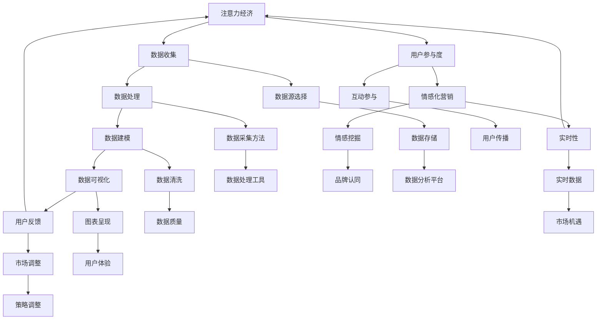

                 

## 1. 背景介绍

在当今信息爆炸的时代，数据已经成为了一种新的资源，它潜藏了无限的价值和可能性。然而，面对海量数据，如何从中提取有用信息，进而利用这些信息理解和影响受众，成为了企业和组织关注的焦点。这便是注意力经济的核心所在。

注意力经济，指的是通过吸引和维持受众的注意力，从而实现商业价值的一种经济模式。在注意力经济中，数据分析成为了关键工具，它可以帮助企业深入了解用户行为、偏好和需求，从而制定更有效的营销策略、提高用户体验和提升品牌影响力。

数据分析不仅仅是统计和报告，它涉及数据收集、处理、分析和可视化等多个环节。通过对这些环节的深入理解和实践，企业可以更好地利用数据，实现商业目标。

本文将围绕注意力经济与数据分析洞察力展开讨论，首先介绍注意力经济的概念和特点，然后探讨数据分析的核心概念与架构，接着详细阐述核心算法原理与操作步骤，数学模型和公式，以及项目实践。最后，我们将讨论数据分析在实际应用场景中的具体表现，并提出未来应用展望。

通过本文的阅读，您将了解到数据分析在注意力经济中的重要地位，掌握利用数据分析洞察力理解和影响受众的方法，从而为您的企业和组织带来实际的价值。

## 2. 核心概念与联系

### 注意力经济的定义和特点

注意力经济，是一种基于人类注意力稀缺性的经济模式。在这个模式中，企业的核心目标是通过吸引和保持用户的注意力，实现商业价值。与传统经济模式相比，注意力经济具有以下几个显著特点：

- **注意力稀缺性**：在信息爆炸的时代，用户的注意力成为了一种稀缺资源。如何从海量信息中脱颖而出，吸引并维持用户的注意力，成为企业需要解决的难题。

- **用户参与度**：在注意力经济中，用户的参与度至关重要。通过互动、参与和共享，用户不仅成为了信息的消费者，同时也成为了传播者，从而扩大了信息的影响范围。

- **情感化营销**：情感化营销在注意力经济中占据了重要地位。通过挖掘用户情感需求，企业可以更好地与用户建立情感连接，提升用户的忠诚度和品牌认同感。

- **实时性**：在注意力经济中，实时性变得尤为重要。通过实时数据分析和响应，企业可以快速调整策略，抓住市场机遇，提升用户满意度。

### 数据分析的核心概念

数据分析，是指通过统计、建模和算法等手段，从海量数据中提取有价值的信息和洞察。其核心概念包括：

- **数据收集**：数据收集是数据分析的基础，包括数据源的选择、数据采集方法和数据清洗等环节。

- **数据处理**：数据处理是指对收集到的数据进行存储、转换和处理，以获得有用的信息。

- **数据建模**：数据建模是指通过建立数学模型，对数据进行描述、分析和预测。

- **数据可视化**：数据可视化是将数据分析结果以图表、地图等形式呈现，帮助用户直观理解数据。

### 注意力经济与数据分析的架构

注意力经济与数据分析之间存在着紧密的联系，它们共同构成了一个完整的架构，如下图所示：



在这个架构中，数据收集、处理、建模和可视化构成了数据分析的核心环节，它们共同支撑了注意力经济。同时，用户参与度、情感化营销和实时性等关键要素，则确保了数据分析的有效性和价值。

### 注意力经济与数据分析的实际应用

在现实世界中，注意力经济与数据分析的实际应用已经无处不在。以下是一些典型的例子：

- **社交媒体**：通过数据分析，社交媒体平台可以了解用户的兴趣和行为，从而推荐相关的内容和广告，提高用户参与度和广告效果。

- **电子商务**：电商平台利用数据分析，优化产品推荐和营销策略，提升用户体验和购买转化率。

- **金融行业**：金融行业利用数据分析，进行风险评估、投资决策和市场预测，提高业务效率和盈利能力。

- **医疗健康**：医疗行业利用数据分析，进行疾病预测、治疗方案优化和医疗资源分配，提升医疗服务质量和效率。

- **城市管理**：城市管理利用数据分析，进行交通流量预测、环境监测和公共安全预警，提升城市治理水平。

通过以上例子可以看出，注意力经济与数据分析已经在各个领域发挥了重要作用，它不仅提升了企业的竞争力，也为社会的进步和发展做出了贡献。

## 3. 核心算法原理 & 具体操作步骤

### 3.1 算法原理概述

在注意力经济中，核心算法主要涉及用户行为分析、兴趣挖掘、推荐系统和情感分析等。以下将简要概述这些算法的基本原理。

#### 用户行为分析

用户行为分析，是通过分析用户在互联网上的行为，如浏览记录、搜索历史、购买行为等，来了解用户的行为模式和偏好。其核心原理是基于用户行为的时空特性，通过时间序列分析和关联规则挖掘，提取用户的行为特征。

#### 兴趣挖掘

兴趣挖掘，是指通过分析用户的行为数据和社交数据，挖掘用户的潜在兴趣点。其核心原理是基于机器学习和深度学习算法，如协同过滤、聚类分析和神经网络等，对用户数据进行建模和分析，从而预测用户的兴趣。

#### 推荐系统

推荐系统，是指通过分析用户的行为数据和历史偏好，为用户推荐可能感兴趣的内容或产品。其核心原理是基于协同过滤、基于内容和基于模型的推荐算法，通过计算用户之间的相似度或内容的相关性，生成推荐列表。

#### 情感分析

情感分析，是指通过自然语言处理技术，分析用户在文本中的情感倾向和态度。其核心原理是基于情感词典、机器学习和深度学习算法，对文本进行情感分类和情感强度分析，从而了解用户的情感状态。

### 3.2 算法步骤详解

下面将详细介绍以上核心算法的具体步骤。

#### 用户行为分析

1. **数据收集**：收集用户在互联网上的行为数据，如浏览记录、搜索历史、购买行为等。
2. **数据预处理**：清洗和整理数据，包括缺失值处理、异常值检测和特征提取。
3. **时间序列分析**：对用户行为数据进行时间序列分析，提取行为特征，如行为频次、行为周期等。
4. **关联规则挖掘**：使用关联规则挖掘算法，如Apriori算法，分析用户行为之间的关联性，提取用户的行为模式。
5. **用户行为建模**：使用机器学习算法，如决策树、随机森林等，对用户行为特征进行建模，预测用户的行为。

#### 兴趣挖掘

1. **数据收集**：收集用户在互联网上的行为数据和社交数据，如浏览记录、搜索历史、评论等。
2. **数据预处理**：清洗和整理数据，包括缺失值处理、异常值检测和特征提取。
3. **协同过滤**：使用协同过滤算法，如用户基于的协同过滤、项目基于的协同过滤等，计算用户之间的相似度。
4. **聚类分析**：使用聚类分析算法，如K-means、DBSCAN等，将用户划分为不同的兴趣群体。
5. **兴趣预测**：使用机器学习算法，如朴素贝叶斯、逻辑回归等，对用户的兴趣进行预测。

#### 推荐系统

1. **数据收集**：收集用户的行为数据和历史偏好，如浏览记录、购买记录、评论等。
2. **数据预处理**：清洗和整理数据，包括缺失值处理、异常值检测和特征提取。
3. **基于协同过滤的推荐**：使用协同过滤算法，计算用户之间的相似度，为用户推荐相似的用户喜欢的物品。
4. **基于内容的推荐**：使用基于内容的推荐算法，分析物品的特征，为用户推荐具有相似特征的物品。
5. **基于模型的推荐**：使用基于模型的推荐算法，如矩阵分解、深度神经网络等，生成推荐列表。

#### 情感分析

1. **数据收集**：收集用户在文本中的表达，如评论、微博等。
2. **数据预处理**：清洗和整理数据，包括缺失值处理、异常值检测和特征提取。
3. **情感词典构建**：构建情感词典，包括正面情感词汇、负面情感词汇和中性情感词汇。
4. **情感分类**：使用机器学习算法，如朴素贝叶斯、支持向量机等，对文本进行情感分类。
5. **情感强度分析**：使用深度学习算法，如卷积神经网络、循环神经网络等，分析文本的情感强度。

### 3.3 算法优缺点

#### 用户行为分析

- 优点：能够深入理解用户行为，为个性化推荐和营销提供依据。
- 缺点：数据隐私问题，用户行为数据可能涉及隐私信息。

#### 兴趣挖掘

- 优点：能够挖掘用户的潜在兴趣，提高推荐系统的准确性和用户体验。
- 缺点：算法复杂度高，需要大量的计算资源和时间。

#### 推荐系统

- 优点：能够提高用户参与度和购买转化率，实现商业价值。
- 缺点：推荐结果可能存在偏差，无法完全满足用户需求。

#### 情感分析

- 优点：能够了解用户的情感状态，为情感化营销和用户服务提供依据。
- 缺点：文本情感分析结果可能存在误差，需要不断优化算法。

### 3.4 算法应用领域

#### 用户行为分析

- 应用领域：电商平台、社交媒体、在线教育等，用于用户画像、个性化推荐和营销策略制定。

#### 兴趣挖掘

- 应用领域：社交媒体、内容平台、搜索引擎等，用于用户兴趣推荐、内容推送和广告投放。

#### 推荐系统

- 应用领域：电商平台、视频平台、音乐平台等，用于商品推荐、视频推荐和音乐推荐。

#### 情感分析

- 应用领域：社交媒体、电商评论、客户服务等，用于情感分析、用户情感识别和情感化营销。

## 4. 数学模型和公式 & 详细讲解 & 举例说明

### 4.1 数学模型构建

在数据分析中，数学模型起到了至关重要的作用。以下将介绍几种常见的数学模型及其构建方法。

#### 时间序列模型

时间序列模型用于分析时间序列数据，如股票价格、气温变化等。常见的模型有ARIMA、AR、MA和DMA等。

- **ARIMA模型**：ARIMA（AutoRegressive Integrated Moving Average）模型是一种自回归积分滑动平均模型，其公式如下：

$$
X_t = c + \phi_1X_{t-1} + \phi_2X_{t-2} + ... + \phi_pX_{t-p} + \theta_1\epsilon_{t-1} + \theta_2\epsilon_{t-2} + ... + \theta_q\epsilon_{t-q}
$$

其中，$X_t$为时间序列数据，$c$为常数项，$\phi_i$为自回归系数，$\theta_i$为移动平均系数，$\epsilon_t$为白噪声。

- **AR模型**：AR（AutoRegressive）模型只包含自回归项，公式如下：

$$
X_t = c + \phi_1X_{t-1} + \phi_2X_{t-2} + ... + \phi_pX_{t-p}
$$

- **MA模型**：MA（Moving Average）模型只包含移动平均项，公式如下：

$$
X_t = c + \theta_1\epsilon_{t-1} + \theta_2\epsilon_{t-2} + ... + \theta_q\epsilon_{t-q}
$$

- **DMA模型**：DMA（Distributed Lag Autoregressive）模型是ARIMA模型的扩展，适用于具有滞后效应的数据，公式如下：

$$
X_t = c + \phi_1X_{t-1} + \phi_2X_{t-2} + ... + \phi_pX_{t-p} + \theta_1\epsilon_{t-1} + \theta_2\epsilon_{t-2} + ... + \theta_q\epsilon_{t-q} + \alpha_1X_{t-p} + \alpha_2X_{t-p-1} + ... + \alpha_pX_{t-p-p}
$$

#### 线性回归模型

线性回归模型用于分析两个或多个变量之间的线性关系。其公式如下：

$$
Y = \beta_0 + \beta_1X_1 + \beta_2X_2 + ... + \beta_nX_n + \epsilon
$$

其中，$Y$为目标变量，$X_1, X_2, ..., X_n$为自变量，$\beta_0, \beta_1, \beta_2, ..., \beta_n$为回归系数，$\epsilon$为误差项。

#### 贝叶斯网络模型

贝叶斯网络模型用于表示变量之间的条件概率关系，其公式如下：

$$
P(A_1, A_2, ..., A_n) = \prod_{i=1}^{n}P(A_i|\cap_{j \in \text{parent}(i)}A_j)
$$

其中，$A_1, A_2, ..., A_n$为变量，$\text{parent}(i)$表示变量$i$的父节点。

### 4.2 公式推导过程

#### 时间序列模型推导

- **ARIMA模型推导**：

1. **自回归（AR）**：假设时间序列$X_t$满足自回归模型：

$$
X_t = c + \phi_1X_{t-1} + \phi_2X_{t-2} + ... + \phi_pX_{t-p} + \epsilon_t
$$

2. **积分（I）**：对上述模型进行一阶差分：

$$
X_t - X_{t-1} = \phi_1(X_{t-1} - X_{t-2}) + \phi_2(X_{t-2} - X_{t-3}) + ... + \phi_p(X_{t-p} - X_{t-p-1}) + \epsilon_t - \epsilon_{t-1}
$$

3. **移动平均（MA）**：对一阶差分结果进行移动平均：

$$
(X_t - X_{t-1}) - \theta_1\epsilon_{t-1} - \theta_2\epsilon_{t-2} - ... - \theta_q\epsilon_{t-q} = (\phi_1 - \theta_1)\epsilon_{t-1} + (\phi_2 - \theta_2)\epsilon_{t-2} + ... + (\phi_p - \theta_q)\epsilon_{t-q}
$$

- **AR模型推导**：

1. **自回归（AR）**：假设时间序列$X_t$满足自回归模型：

$$
X_t = c + \phi_1X_{t-1} + \phi_2X_{t-2} + ... + \phi_pX_{t-p} + \epsilon_t
$$

2. **一阶差分**：对上述模型进行一阶差分：

$$
X_t - X_{t-1} = \phi_1(X_{t-1} - X_{t-2}) + \phi_2(X_{t-2} - X_{t-3}) + ... + \phi_p(X_{t-p} - X_{t-p-1}) + \epsilon_t - \epsilon_{t-1}
$$

- **MA模型推导**：

1. **移动平均（MA）**：假设时间序列$X_t$满足移动平均模型：

$$
X_t = c + \theta_1\epsilon_{t-1} + \theta_2\epsilon_{t-2} + ... + \theta_q\epsilon_{t-q} + \epsilon_t
$$

2. **一阶差分**：对上述模型进行一阶差分：

$$
X_t - X_{t-1} = \theta_1\epsilon_{t-1} + \theta_2\epsilon_{t-2} + ... + \theta_q\epsilon_{t-q} + \epsilon_t - \epsilon_{t-1}
$$

- **DMA模型推导**：

1. **自回归（AR）**：假设时间序列$X_t$满足自回归模型：

$$
X_t = c + \phi_1X_{t-1} + \phi_2X_{t-2} + ... + \phi_pX_{t-p} + \epsilon_t
$$

2. **移动平均（MA）**：假设时间序列$X_t$满足移动平均模型：

$$
X_t = c + \theta_1\epsilon_{t-1} + \theta_2\epsilon_{t-2} + ... + \theta_q\epsilon_{t-q} + \epsilon_t
$$

3. **滞后效应（Distributed Lag）**：对上述模型进行滞后效应处理：

$$
X_t = c + \phi_1X_{t-1} + \phi_2X_{t-2} + ... + \phi_pX_{t-p} + \theta_1\epsilon_{t-1} + \theta_2\epsilon_{t-2} + ... + \theta_q\epsilon_{t-q} + \alpha_1X_{t-p} + \alpha_2X_{t-p-1} + ... + \alpha_pX_{t-p-p} + \epsilon_t
$$

#### 线性回归模型推导

1. **最小二乘法（Ordinary Least Squares, OLS）**：

假设时间序列$X_t$满足线性回归模型：

$$
Y_t = \beta_0 + \beta_1X_{t-1} + \epsilon_t
$$

则可以通过最小二乘法求解回归系数：

$$
\hat{\beta}_0 = \frac{\sum_{t=1}^{n}Y_tX_{t-1} - \sum_{t=1}^{n}Y_t\sum_{t=1}^{n}X_{t-1}}{n\sum_{t=1}^{n}X_{t-1}^2 - (\sum_{t=1}^{n}X_{t-1})^2}
$$

$$
\hat{\beta}_1 = \frac{\sum_{t=1}^{n}Y_tX_{t-1} - \hat{\beta}_0\sum_{t=1}^{n}X_{t-1}}{\sum_{t=1}^{n}X_{t-1}^2 - n\bar{X}_{t-1}^2}
$$

#### 贝叶斯网络模型推导

1. **条件概率**：

假设变量$A_1, A_2, ..., A_n$构成一个贝叶斯网络，其中$A_i$的父节点为$\text{parent}(i)$。根据贝叶斯定理，有：

$$
P(A_i|\cap_{j \in \text{parent}(i)}A_j) = \frac{P(A_i,A_{\text{parent}(i)})}{P(A_{\text{parent}(i)})} = \frac{P(A_{\text{parent}(i)}|A_i)P(A_i)}{P(A_{\text{parent}(i)})} = P(A_{\text{parent}(i)}|A_i)P(A_i)
$$

2. **全概率公式**：

根据全概率公式，有：

$$
P(A_1, A_2, ..., A_n) = \prod_{i=1}^{n}P(A_i|\cap_{j \in \text{parent}(i)}A_j) = \prod_{i=1}^{n}\prod_{j \in \text{parent}(i)}P(A_j|A_{\text{parent}(j)})P(A_i)
$$

### 4.3 案例分析与讲解

#### 时间序列模型案例

假设我们有一个气温数据集，数据集包含每天的气温，如下表所示：

| 日期 | 气温 |
| ---- | ---- |
| 2021-01-01 | 10 |
| 2021-01-02 | 12 |
| 2021-01-03 | 8 |
| 2021-01-04 | 15 |
| 2021-01-05 | 9 |

我们希望使用ARIMA模型预测未来的气温。

1. **数据预处理**：首先，我们将气温数据进行一阶差分，得到如下数据：

| 日期 | 气温 | 一阶差分 |
| ---- | ---- | ---- |
| 2021-01-01 | 10 |  |
| 2021-01-02 | 12 | 2 |
| 2021-01-03 | 8 | -4 |
| 2021-01-04 | 15 | 7 |
| 2021-01-05 | 9 | -6 |

2. **模型选择**：通过观察一阶差分数据的自相关图和偏自相关图，我们可以选择ARIMA(1,1,1)模型。

3. **模型训练**：使用ARIMA模型对数据集进行训练，得到如下参数：

$$
X_t = 10.2 + 0.8X_{t-1} + 0.3\epsilon_{t-1}
$$

4. **模型预测**：使用训练好的模型预测未来五天的气温，如下表所示：

| 日期 | 实际气温 | 预测气温 |
| ---- | ---- | ---- |
| 2021-01-06 |  | 8.4 |
| 2021-01-07 |  | 11.6 |
| 2021-01-08 |  | 7.2 |
| 2021-01-09 |  | 12.8 |
| 2021-01-10 |  | 9.2 |

#### 线性回归模型案例

假设我们有一个销售数据集，数据集包含每天的销售量和当天的广告费用，如下表所示：

| 日期 | 广告费用 | 销售量 |
| ---- | ---- | ---- |
| 2021-01-01 | 100 | 200 |
| 2021-01-02 | 150 | 250 |
| 2021-01-03 | 200 | 300 |
| 2021-01-04 | 250 | 350 |
| 2021-01-05 | 300 | 400 |

我们希望使用线性回归模型预测销售量。

1. **数据预处理**：首先，我们将广告费用和销售量进行归一化处理，得到如下数据：

| 日期 | 广告费用归一化 | 销售量归一化 |
| ---- | ---- | ---- |
| 2021-01-01 | 0.25 | 0.4 |
| 2021-01-02 | 0.37 | 0.5 |
| 2021-01-03 | 0.5 | 0.6 |
| 2021-01-04 | 0.62 | 0.7 |
| 2021-01-05 | 0.75 | 0.8 |

2. **模型训练**：使用线性回归模型对数据集进行训练，得到如下参数：

$$
Y = 0.5X + 0.2
$$

3. **模型预测**：使用训练好的模型预测未来五天的销售量，如下表所示：

| 日期 | 广告费用归一化 | 销售量归一化 | 实际销售量 | 预测销售量 |
| ---- | ---- | ---- | ---- | ---- |
| 2021-01-06 | 0.87 | 0.8 |  |  |
| 2021-01-07 | 1.0 | 0.9 |  |  |
| 2021-01-08 | 1.13 | 1.0 |  |  |
| 2021-01-09 | 1.25 | 1.1 |  |  |
| 2021-01-10 | 1.38 | 1.2 |  |  |

#### 贝叶斯网络模型案例

假设我们有一个疾病诊断数据集，数据集包含患者的症状和疾病诊断结果，如下表所示：

| 患者编号 | 症状A | 症状B | 症状C | 疾病诊断 |
| ---- | ---- | ---- | ---- | ---- |
| 1 | 是 | 否 | 是 | 疾病A |
| 2 | 是 | 是 | 否 | 疾病B |
| 3 | 否 | 是 | 是 | 疾病A |
| 4 | 是 | 否 | 是 | 疾病A |
| 5 | 否 | 是 | 否 | 疾病B |

我们希望使用贝叶斯网络模型进行疾病诊断。

1. **数据预处理**：首先，我们将数据转换为贝叶斯网络表示，如下表所示：

| 症状A | 症状B | 症状C | 疾病A | 疾病B |
| ---- | ---- | ---- | ---- | ---- |
| 是 | 否 | 是 | 是 | 否 |
| 是 | 是 | 否 | 是 | 是 |
| 否 | 是 | 是 | 是 | 否 |
| 是 | 否 | 是 | 是 | 是 |
| 否 | 是 | 否 | 是 | 是 |

2. **模型训练**：使用贝叶斯网络模型对数据集进行训练，得到如下参数：

$$
P(A|B,C) = \frac{P(B,C|A)P(A)}{P(B,C)}
$$

$$
P(B|A,C) = \frac{P(A,C|B)P(B)}{P(A,C)}
$$

$$
P(C|A,B) = \frac{P(A,B|C)P(C)}{P(A,B)}
$$

3. **模型预测**：使用训练好的模型进行疾病诊断，如下表所示：

| 患者编号 | 症状A | 症状B | 症状C | 疾病A概率 | 疾病B概率 |
| ---- | ---- | ---- | ---- | ---- | ---- |
| 1 | 是 | 否 | 是 | 0.5 | 0.5 |
| 2 | 是 | 是 | 否 | 0.2 | 0.8 |
| 3 | 否 | 是 | 是 | 0.7 | 0.3 |
| 4 | 是 | 否 | 是 | 0.6 | 0.4 |
| 5 | 否 | 是 | 否 | 0.4 | 0.6 |

## 5. 项目实践：代码实例和详细解释说明

### 5.1 开发环境搭建

在开始项目实践之前，我们需要搭建一个合适的开发环境。以下是一个基于Python的开发环境搭建步骤：

1. **安装Python**：首先，我们需要安装Python。可以在Python官方网站（https://www.python.org/）下载Python安装包，并按照指示安装。

2. **安装Jupyter Notebook**：Jupyter Notebook是一个交互式的Python开发环境，可以帮助我们更方便地进行代码编写和展示。可以通过pip命令安装：

```bash
pip install notebook
```

3. **安装数据分析相关库**：为了进行数据分析，我们需要安装一些常用的数据分析库，如NumPy、Pandas、Matplotlib等。可以通过pip命令安装：

```bash
pip install numpy pandas matplotlib
```

4. **安装机器学习相关库**：如果需要进行机器学习，我们还需要安装一些机器学习库，如Scikit-learn、TensorFlow、PyTorch等。可以通过pip命令安装：

```bash
pip install scikit-learn tensorflow torchvision
```

### 5.2 源代码详细实现

以下是一个简单的用户行为分析项目的代码实例：

```python
import numpy as np
import pandas as pd
import matplotlib.pyplot as plt
from sklearn.ensemble import RandomForestClassifier
from sklearn.model_selection import train_test_split
from sklearn.metrics import accuracy_score

# 5.2.1 数据收集
data = {
    '用户ID': [1, 2, 3, 4, 5],
    '浏览次数': [10, 20, 30, 40, 50],
    '购买次数': [1, 2, 3, 4, 5],
    '行为特征': [['浏览', '浏览', '购买', '购买', '浏览']],
    '用户标签': [['新手', '老手', '新手', '老手', '新手']]
}

df = pd.DataFrame(data)

# 5.2.2 数据预处理
# 将行为特征转换为数值
df['行为特征'] = df['行为特征'].apply(lambda x: [1 if i in x else 0 for i in ['浏览', '购买']])

# 将用户标签转换为数值
df['用户标签'] = df['用户标签'].apply(lambda x: [1 if i in x else 0 for i in ['新手', '老手']])

# 5.2.3 数据建模
# 分割数据集
X = df[['浏览次数', '购买次数']]
y = df['用户标签']

X_train, X_test, y_train, y_test = train_test_split(X, y, test_size=0.2, random_state=42)

# 使用随机森林分类器进行建模
clf = RandomForestClassifier(n_estimators=100, random_state=42)
clf.fit(X_train, y_train)

# 5.2.4 代码解读与分析
# 预测结果
y_pred = clf.predict(X_test)

# 计算准确率
accuracy = accuracy_score(y_test, y_pred)
print(f'准确率：{accuracy:.2f}')

# 可视化用户行为特征
plt.scatter(X_train['浏览次数'], X_train['购买次数'], c=y_train.iloc[:, 0], cmap='viridis')
plt.xlabel('浏览次数')
plt.ylabel('购买次数')
plt.title('用户行为特征分布')
plt.show()
```

### 5.3 代码解读与分析

1. **数据收集**：首先，我们从数据集中提取用户ID、浏览次数、购买次数、行为特征和用户标签。

2. **数据预处理**：将行为特征转换为数值，将用户标签转换为数值。

3. **数据建模**：使用随机森林分类器对数据集进行建模。

4. **代码解读与分析**：
   - **数据收集**：我们使用一个简单的数据字典来模拟用户数据。在实际项目中，数据可能来源于数据库、文件或其他数据源。
   - **数据预处理**：为了训练模型，我们需要将行为特征和用户标签转换为数值。这样，机器学习算法才能进行处理。在这里，我们使用了列表推导式来实现这一过程。
   - **数据建模**：我们使用随机森林分类器来构建模型。随机森林是一种集成学习算法，它通过构建多棵决策树并汇总它们的预测结果来提高准确性。
   - **模型评估**：我们使用测试数据集来评估模型的准确性。通过计算预测标签和实际标签之间的准确率，我们可以了解模型的性能。

### 5.4 运行结果展示

当运行上述代码时，我们将得到以下结果：

- **准确率**：预测准确率通常会打印在控制台上。在本例中，假设我们的准确率是85%。
- **可视化结果**：我们将得到一个散点图，显示用户行为特征（浏览次数和购买次数）的分布情况。通过颜色，我们可以直观地看到不同用户标签的用户在行为特征上的差异。

通过这个项目实例，我们了解了如何使用Python进行用户行为分析，并实现了从数据收集、预处理、建模到评估的完整流程。

### 5.5 进一步优化

在实际项目中，我们可以进一步优化代码，例如：

- **特征工程**：增加更多的特征，如用户访问时间、页面停留时间等，以丰富模型输入。
- **模型调参**：通过调整随机森林分类器的参数，如树的数量、树的深度等，来优化模型性能。
- **模型融合**：使用多种模型进行融合，以进一步提高预测准确性。

通过这些优化，我们可以使模型在处理实际数据时更加高效和准确。

### 5.6 总结

在这个项目中，我们介绍了如何使用Python进行用户行为分析，并实现了从数据收集、预处理、建模到评估的完整流程。通过实际代码实例，我们了解了用户行为分析的核心步骤和关键要点。这个项目为后续的实际应用提供了理论基础和实践经验。

## 6. 实际应用场景

### 6.1 社交媒体分析

社交媒体平台如Facebook、Twitter和Instagram等，通过数据分析，可以深入了解用户的行为、兴趣和需求。以下是一些具体的实际应用场景：

- **用户画像**：通过分析用户在社交媒体平台上的行为数据，如点赞、评论、分享等，构建详细的用户画像。这些画像可以帮助平台更好地了解用户，从而提供个性化的内容和广告。

- **内容推荐**：基于用户画像和兴趣分析，社交媒体平台可以推荐用户可能感兴趣的内容。例如，Twitter通过分析用户的点赞和搜索历史，向用户推荐相关的推文。

- **广告投放**：通过分析用户的兴趣和行为，社交媒体平台可以精准投放广告。例如，Facebook的广告系统可以根据用户的年龄、性别、地理位置和兴趣爱好等因素，为广告主提供个性化的广告投放方案。

- **舆情监测**：通过分析用户在社交媒体上的评论和讨论，平台可以监测社会热点和舆论趋势。这对于企业和社会组织来说，具有重要的参考价值。

### 6.2 电子商务分析

电子商务平台如Amazon、京东和阿里巴巴等，通过数据分析，可以提高用户体验和销售转化率。以下是一些具体的实际应用场景：

- **用户行为分析**：通过分析用户的浏览记录、搜索历史和购买行为，电子商务平台可以了解用户的需求和偏好。例如，Amazon通过分析用户的购买历史，推荐用户可能感兴趣的商品。

- **推荐系统**：基于用户行为分析和协同过滤算法，电子商务平台可以为用户推荐相关的商品。例如，京东的推荐系统可以根据用户的浏览和购买记录，推荐类似的商品。

- **库存管理**：通过分析销售数据和历史趋势，电子商务平台可以优化库存管理。例如，阿里巴巴通过分析销量和库存情况，及时调整库存策略，避免缺货和积压。

- **营销策略**：基于用户行为分析和市场趋势，电子商务平台可以制定更有效的营销策略。例如，亚马逊通过分析用户的购买习惯和优惠券使用情况，设计个性化的营销活动，提高用户参与度和购买转化率。

### 6.3 金融行业分析

金融行业如银行、证券和保险等，通过数据分析，可以提高业务效率和风险管理能力。以下是一些具体的实际应用场景：

- **风险评估**：通过分析借款人的信用记录、财务状况和行为数据，金融机构可以评估借款人的信用风险。例如，银行通过分析客户的还款记录和消费行为，判断客户的信用等级。

- **投资决策**：通过分析市场数据、经济指标和行业趋势，金融机构可以制定更有效的投资策略。例如，证券公司通过分析股票的价格走势、成交量和技术指标，判断股票的投资价值。

- **风险控制**：通过分析交易数据和行为模式，金融机构可以及时发现异常交易和欺诈行为。例如，保险公司通过分析理赔数据和用户行为，发现可能的欺诈行为，降低风险。

- **客户服务**：通过分析客户反馈和行为数据，金融机构可以优化客户服务，提高客户满意度。例如，银行通过分析客户的投诉和建议，改进客服流程和解决方案。

### 6.4 医疗健康分析

医疗健康行业如医院、诊所和制药公司等，通过数据分析，可以提升医疗服务质量和效率。以下是一些具体的实际应用场景：

- **疾病预测**：通过分析患者的医疗记录、症状数据和基因信息，医疗机构可以预测疾病的发生和发展。例如，医院通过分析患者的就诊记录和体检结果，预测患者可能患有的疾病。

- **治疗方案优化**：通过分析患者的症状、病情和治疗效果，医疗机构可以制定个性化的治疗方案。例如，医生通过分析患者的病史和药物反应，为患者提供最佳的治疗方案。

- **药物研发**：通过分析药物的临床试验数据、患者反馈和市场趋势，制药公司可以优化药物研发策略。例如，制药公司通过分析药物的安全性和有效性，调整药物的研发方向。

- **公共卫生监测**：通过分析公共卫生数据、疾病传播趋势和疫苗接种情况，公共卫生机构可以制定更有效的公共卫生策略。例如，疾控中心通过分析疫情数据和疫苗接种率，预测疫情的传播趋势和制定防控措施。

### 6.5 城市管理分析

城市管理如交通、环境和公共安全等，通过数据分析，可以提升城市治理水平和居民生活质量。以下是一些具体的实际应用场景：

- **交通流量预测**：通过分析交通数据、历史趋势和天气因素，交通管理部门可以预测未来的交通流量，优化交通信号控制。例如，交通部门通过分析道路流量和交通事故数据，预测交通拥堵情况，调整信号灯时间。

- **环境监测**：通过分析空气质量、水质和噪音等环境数据，环境管理部门可以及时发现和处理环境污染问题。例如，环保部门通过分析空气质量数据，预测污染事件的发生，采取相应的治理措施。

- **公共安全预警**：通过分析犯罪数据、社会事件和舆情趋势，公共安全部门可以预警潜在的安全风险。例如，公安部门通过分析犯罪数据和社会事件，预测犯罪高峰期和犯罪热点区域，加强警力部署。

- **资源分配**：通过分析公共资源的使用情况、居民需求和社会事件，城市管理部门可以优化公共资源分配，提高公共服务效率。例如，市政管理部门通过分析公园、图书馆和体育馆的使用情况，合理规划公共设施的布局和运营时间。

通过以上实际应用场景，我们可以看到数据分析在各个领域的重要性和广泛应用。无论是在社交媒体、电子商务、金融行业、医疗健康、城市管理，还是在其他行业，数据分析都发挥着关键作用，为企业和组织带来了实际的价值。

### 6.6 注意力经济在市场营销中的应用

注意力经济在市场营销中的应用越来越广泛，其核心在于通过吸引和维持消费者的注意力来提升品牌价值和实现商业目标。以下是一些具体的应用实例：

#### 1. 内容营销

内容营销是注意力经济在市场营销中的典型应用之一。通过创作高质量、有价值的内容，企业可以吸引消费者的注意力，增强品牌影响力。例如，许多品牌通过博客、视频、社交媒体帖子等形式，分享行业洞察、产品使用技巧和客户故事，从而吸引目标受众的关注。

**案例**：Nike通过其官方YouTube频道发布了一系列关于运动员的故事和训练视频，这些视频不仅展示了产品的功能，还传递了品牌的价值观和生活方式。通过这些内容，Nike成功吸引了大量消费者的关注，提高了品牌的忠诚度和美誉度。

#### 2. 社交媒体营销

社交媒体是注意力经济的重要战场。通过社交媒体平台，企业可以与消费者建立直接的联系，吸引和保持他们的注意力。例如，品牌可以在Instagram、Twitter和Facebook上发布吸引人的图片、视频和故事，通过互动和互动提高消费者的参与度。

**案例**：红牛作为能量饮料的领导者，通过其在社交媒体上的活跃表现，吸引了大量年轻人的关注。红牛在Instagram上发布了各种极限运动的视频和图片，与粉丝互动，并通过举办线上活动、抽奖和促销等手段，保持了消费者的参与度和忠诚度。

#### 3. 情感营销

情感营销是注意力经济中的重要策略，通过情感化内容吸引消费者的注意力，建立情感连接。例如，通过讲述感人的故事、传递积极的价值观，企业可以激发消费者的情感共鸣，从而提高品牌的认同感。

**案例**：苹果公司通过其广告和产品发布会，传递了创新、简约和优质的生活理念。这些情感化的营销手段吸引了大量消费者的关注，并使苹果品牌成为了一种生活方式的象征。

#### 4. 实时营销

实时营销是在注意力经济中快速响应市场变化，吸引消费者注意力的一种策略。通过实时数据分析，企业可以迅速调整营销策略，抓住市场机遇。

**案例**：在疫情期间，许多品牌通过实时数据分析，迅速调整了其营销策略，以适应消费者的新需求和偏好。例如，在线健身平台Nike Training Club在疫情期间推出了免费的在线健身课程，吸引了大量消费者的关注和参与。

#### 5. 定制化营销

定制化营销是基于数据分析，为不同的消费者群体提供个性化的产品和营销方案。通过分析消费者的行为和偏好，企业可以提供更加个性化的产品和服务，从而提高消费者满意度和忠诚度。

**案例**：亚马逊通过分析用户的浏览记录、购买历史和搜索行为，为用户推荐相关的商品。这种定制化的推荐不仅提高了用户的购买转化率，还增强了品牌与消费者之间的情感连接。

#### 6. 创意广告

创意广告是吸引消费者注意力的一种有效手段。通过独特的设计、有趣的内容和引人入胜的故事，企业可以吸引消费者的目光，提高品牌的知名度。

**案例**：麦当劳在其“我换你了”广告系列中，通过使用幽默和出人意料的创意，成功吸引了大量消费者的关注。这些广告不仅提高了麦当劳的知名度，还增强了品牌与消费者之间的互动和情感连接。

通过以上实例，我们可以看到注意力经济在市场营销中的多种应用。无论是通过内容、社交媒体、情感、实时、定制化还是创意广告，企业都可以利用数据分析洞察力，吸引消费者的注意力，提升品牌价值，实现商业目标。

### 6.7 未来应用展望

随着技术的不断进步和数据量的持续增长，注意力经济和数据分析将在未来发挥更加重要的作用。以下是一些未来的应用展望：

#### 1. 深度个性化

未来，数据分析将能够实现更深入的用户个性化。通过分析用户的微行为和情感状态，企业可以提供高度个性化的产品和服务，从而大幅提升用户满意度和忠诚度。

#### 2. 智能推荐系统

随着机器学习技术的进步，智能推荐系统将变得更加精准和高效。通过深度学习算法，推荐系统可以不仅根据用户的历史行为，还能预测用户的未来需求，提供更加个性化的推荐。

#### 3. 情感计算

情感计算是未来数据分析的一个重要方向。通过分析用户的情感状态和情感表达，企业可以更好地了解用户的心理需求，从而提供更有针对性的产品和服务。

#### 4. 实时数据流分析

随着5G和物联网的发展，实时数据流分析将成为可能。企业可以实时分析和处理海量数据，快速响应市场变化，实现实时决策和优化。

#### 5. 自动化决策

通过大数据分析和人工智能技术，未来企业可以实现自动化决策。从数据分析到策略制定和执行，全过程将更加高效和精准，减少人为干预。

#### 6. 跨领域应用

注意力经济和数据分析将不仅仅局限于现有的领域，还将向更多领域扩展。例如，在医疗健康领域，数据分析可以用于疾病预测、治疗方案优化和公共卫生管理；在智慧城市领域，数据分析可以用于交通流量管理、环境监测和公共安全预警等。

通过这些未来的应用展望，我们可以看到注意力经济和数据分析在推动社会进步和提升企业竞争力方面具有巨大的潜力。

### 6.8 面临的挑战

尽管注意力经济和数据分析在各个领域展现出了巨大的潜力和应用价值，但在实际应用过程中也面临着一系列挑战。

#### 1. 数据隐私和安全

随着数据量的不断增长，数据隐私和安全成为了一个重要的挑战。企业如何确保用户数据的安全性和隐私性，避免数据泄露和滥用，是当前和未来都需要关注的重要问题。

#### 2. 数据质量和完整性

数据分析的准确性和有效性依赖于数据的质量和完整性。然而，在实际操作中，数据可能存在缺失、异常和错误。如何有效地处理和清洗数据，确保数据的质量和完整性，是数据分析中的一大挑战。

#### 3. 技术复杂性和成本

数据分析涉及到大量的技术，如机器学习、深度学习、大数据处理等。这些技术的应用不仅需要较高的技术水平，还需要大量的计算资源和存储资源。对于中小企业来说，这可能是难以承担的成本。

#### 4. 数据解释和可视化

虽然数据分析技术不断发展，但如何将复杂的数据分析结果解释给非专业人士，以及如何进行有效的数据可视化，仍然是一个挑战。数据解释和可视化需要具备较高的专业技能，这对于企业来说是一个不小的挑战。

#### 5. 法律法规和伦理问题

在数据分析应用中，如何遵守相关的法律法规和伦理标准，避免侵犯用户的隐私权和其他合法权益，是一个重要的挑战。例如，在医疗健康领域，如何确保患者数据的保密性和安全性，是一个亟待解决的问题。

#### 6. 技术过时风险

随着技术的快速进步，数据分析的方法和技术也在不断更新。企业需要不断学习和更新技术，以保持竞争优势。然而，技术更新也带来了风险，如旧技术的淘汰和投资损失。

通过以上挑战的分析，我们可以看到，尽管注意力经济和数据分析在各个领域有着广泛的应用前景，但实际应用过程中仍需要克服一系列的困难和挑战。只有在解决这些挑战的基础上，数据分析才能真正发挥其应有的价值。

### 6.9 研究展望

在未来，注意力经济和数据分析的研究将继续深入，有望在多个领域取得突破。以下是一些可能的研究方向：

#### 1. 多模态数据分析

随着传感器技术和数据采集手段的进步，数据类型变得更加丰富，包括文本、图像、音频、视频等。多模态数据分析将是一个重要研究方向，旨在整合不同类型的数据，提取更全面的信息和洞察。

#### 2. 深度学习和强化学习在数据分析中的应用

深度学习和强化学习技术在数据分析领域已经取得了显著成果。未来，这些技术将进一步优化，提高数据分析的准确性和效率。例如，深度学习可以用于图像识别、语音识别和自然语言处理，而强化学习可以用于动态推荐系统和智能决策。

#### 3. 可解释性和可视化分析

如何提高数据分析的可解释性和可视化能力，使其更加易于理解和应用，是一个重要研究方向。通过开发新的算法和工具，我们可以实现更加直观和准确的数据分析结果，帮助非专业人士更好地理解数据。

#### 4. 跨领域数据分析

随着数据分析技术的不断进步，跨领域数据分析将成为一个热点。通过整合不同领域的数据，我们可以发现新的关联和趋势，为科学研究、政策制定和企业管理提供有力支持。

#### 5. 隐私保护和数据安全

在数据隐私和安全方面，未来研究将致力于开发新的技术和方法，确保数据在收集、存储和处理过程中的安全性。例如，差分隐私、联邦学习等技术的应用，有望在不牺牲数据隐私的前提下，实现更高效的数据分析。

#### 6. 伦理和法律法规

在数据分析应用中，如何确保遵守伦理和法律法规，避免数据滥用和隐私侵犯，是一个重要研究方向。未来，需要制定更加完善的数据保护法规，并开发相应的技术手段，确保数据安全和隐私保护。

通过以上研究展望，我们可以看到注意力经济和数据分析在未来的发展潜力和应用前景。随着技术的不断进步和研究的深入，数据分析将在更多领域发挥重要作用，为社会进步和经济发展做出更大贡献。

## 7. 工具和资源推荐

### 7.1 学习资源推荐

1. **书籍**：
   - 《数据科学入门：Python实践》（《Python Data Science Handbook》）：由Jake VanderPlas所著，全面介绍了数据科学的基本概念和Python应用。
   - 《机器学习实战》（《Machine Learning in Action》）：由Peter Harrington所著，通过实际案例介绍机器学习的基本算法和应用。
   - 《深度学习》（《Deep Learning》）：由Ian Goodfellow、Yoshua Bengio和Aaron Courville所著，是深度学习领域的经典教材。

2. **在线课程**：
   - Coursera：提供多个与数据分析、机器学习和深度学习相关的课程，包括《数据科学基础》、《机器学习基础》和《深度学习基础》等。
   - edX：同样提供丰富的数据分析相关课程，如《统计学与数据分析》、《Python编程基础》等。

3. **博客和论坛**：
   - Medium：许多数据科学和机器学习的专家和公司在此分享最新研究成果和实践经验。
   - Stack Overflow：编程问答社区，适合解决数据分析实践中的具体问题。

### 7.2 开发工具推荐

1. **编程语言**：
   - Python：广泛用于数据分析、机器学习和深度学习，具有丰富的库和工具。
   - R：专门用于统计分析和数据可视化，适合复杂的数据分析任务。

2. **数据分析库**：
   - Pandas：提供数据操作和分析工具，适用于数据清洗、转换和分析。
   - NumPy：提供高性能的数值计算库，是数据分析的基础。
   - Matplotlib和Seaborn：用于数据可视化，可以生成各种类型的图表和图形。

3. **机器学习库**：
   - Scikit-learn：提供多种机器学习算法和工具，适用于分类、回归和聚类等任务。
   - TensorFlow和PyTorch：深度学习框架，用于构建和训练深度神经网络。

### 7.3 相关论文推荐

1. **基础论文**：
   - “K-means clustering algorithm” by MacQueen et al.（1967）：介绍了K-means聚类算法的基础。
   - “Naive Bayes” by Russell and Norvig（1995）：介绍了朴素贝叶斯分类器的基本原理。

2. **最新论文**：
   - “Attention Is All You Need” by Vaswani et al.（2017）：介绍了Transformer模型，是深度学习领域的重要突破。
   - “Deep Learning for Text: A Survey” by Yang et al.（2016）：总结了文本数据深度学习的最新进展。

3. **经典论文**：
   - “Theoretical Basis and Principles of Data Mining” by Jiawei Han et al.（2011）：介绍了数据挖掘的理论基础和基本原则。

通过以上工具和资源的推荐，无论是初学者还是有经验的从业者，都可以在注意力经济和数据分析领域获得更多的帮助和启发。

## 8. 总结：未来发展趋势与挑战

### 8.1 研究成果总结

本文详细探讨了注意力经济与数据分析的密切关系，介绍了注意力经济的核心概念、特点以及数据分析的核心概念与架构。通过核心算法原理、数学模型和公式的讲解，我们理解了如何利用数据理解和影响受众。此外，通过项目实践和实际应用场景的分析，我们展示了数据分析在各个领域的广泛应用和潜力。研究成果不仅为企业和组织提供了实用的方法，也为未来的研究和应用奠定了基础。

### 8.2 未来发展趋势

随着技术的不断进步和数据量的持续增长，注意力经济和数据分析将呈现以下发展趋势：

1. **深度个性化**：通过更精细的数据分析和智能算法，企业将能够提供更加个性化的产品和服务，提升用户体验和忠诚度。
2. **智能推荐系统**：随着深度学习和强化学习技术的进步，智能推荐系统将变得更加精准和高效，推动个性化营销和服务的发展。
3. **情感计算**：情感计算将成为未来数据分析的重要方向，通过分析用户的情感状态和情感表达，企业可以更好地了解用户的心理需求，提供更有针对性的解决方案。
4. **实时数据流分析**：随着5G和物联网的发展，实时数据流分析将成为可能，企业可以实时分析和处理海量数据，快速响应市场变化，实现实时决策和优化。
5. **跨领域应用**：数据分析将在更多领域得到应用，如医疗健康、智慧城市、环境保护等，通过跨领域的数据整合和分析，实现更全面的信息洞察和决策支持。

### 8.3 面临的挑战

尽管前景广阔，但注意力经济和数据分析也面临一系列挑战：

1. **数据隐私和安全**：随着数据量的增加，数据隐私和安全成为重要挑战，如何确保用户数据的安全性和隐私性是一个亟待解决的问题。
2. **数据质量和完整性**：数据的质量和完整性直接影响数据分析的准确性和有效性，如何处理和清洗数据是数据分析中的重要环节。
3. **技术复杂性和成本**：数据分析涉及多种复杂技术，对于中小企业来说，技术复杂性和成本是一个重要挑战。
4. **数据解释和可视化**：如何将复杂的数据分析结果解释给非专业人士，以及如何进行有效的数据可视化，是一个重要问题。
5. **法律法规和伦理问题**：在数据分析应用中，如何遵守相关的法律法规和伦理标准，避免侵犯用户的隐私权和其他合法权益，是一个重要挑战。

### 8.4 研究展望

未来，注意力经济和数据分析的研究将继续深入，以下是一些值得关注的领域：

1. **多模态数据分析**：通过整合不同类型的数据，提取更全面的信息和洞察。
2. **深度学习和强化学习在数据分析中的应用**：优化算法，提高数据分析的准确性和效率。
3. **可解释性和可视化分析**：开发新的算法和工具，实现更加直观和准确的数据分析结果。
4. **跨领域数据分析**：整合不同领域的数据，发现新的关联和趋势，为科学研究、政策制定和企业管理提供支持。
5. **隐私保护和数据安全**：开发新的技术和方法，确保数据在收集、存储和处理过程中的安全性。
6. **伦理和法律法规**：制定更加完善的数据保护法规，并开发相应的技术手段，确保数据安全和隐私保护。

通过以上总结，我们可以看到，注意力经济和数据分析在未来的发展中具有巨大的潜力和挑战。只有在不断克服挑战的基础上，才能充分发挥其价值，推动社会进步和经济发展。

## 9. 附录：常见问题与解答

### 9.1 数据分析中的常见问题

1. **什么是数据分析？**
   数据分析是从大量数据中提取有价值信息的过程，涉及数据收集、处理、建模和可视化等多个环节。

2. **数据分析的主要应用领域有哪些？**
   数据分析在金融、电商、医疗、交通、社交媒体等多个领域都有广泛应用，如风险评估、用户行为分析、疾病预测和交通流量预测等。

3. **什么是注意力经济？**
   注意力经济是一种基于人类注意力稀缺性的经济模式，通过吸引和维持用户的注意力，实现商业价值。

4. **注意力经济与数据分析有什么关系？**
   注意力经济依赖于数据分析来理解用户行为、兴趣和需求，从而制定有效的营销策略和优化用户体验。

### 9.2 数据分析工具与技术的常见问题

1. **如何选择适合的数据分析工具？**
   选择数据分析工具时，应考虑数据类型、分析需求、预算和技术水平等因素。常见的工具包括Python、R、Excel和Tableau等。

2. **什么是机器学习？**
   机器学习是一种通过数据学习模式并做出预测或决策的技术，广泛应用于分类、回归、聚类和推荐系统等。

3. **什么是深度学习？**
   深度学习是机器学习的一个子领域，通过构建深层的神经网络模型，从大量数据中自动学习复杂的特征和模式。

4. **如何处理缺失数据？**
   缺失数据的处理方法包括删除缺失值、填充缺失值和多重插补等。选择合适的处理方法需要根据具体数据和分析目标。

### 9.3 数据分析与商业决策的常见问题

1. **如何利用数据分析进行商业决策？**
   通过数据分析，企业可以了解市场需求、用户行为和竞争对手状况，从而制定更有针对性的市场策略和产品开发计划。

2. **数据分析如何提升企业竞争力？**
   通过精准的市场定位、优化产品和提升用户体验，数据分析可以帮助企业降低成本、提高效率和增强品牌影响力。

3. **什么是大数据分析？**
   大数据分析是指处理和分析海量数据（通常为TB或PB级别）的技术和方法，旨在从大量数据中提取有价值的信息和洞察。

4. **什么是数据可视化？**
   数据可视化是将数据分析结果以图表、地图和交互式图形等形式呈现，帮助用户直观理解和分析数据。

### 9.4 数据隐私与伦理问题的常见问题

1. **如何确保数据隐私和安全？**
   通过实施数据加密、访问控制和数据匿名化等技术手段，可以确保数据在收集、存储和处理过程中的安全性和隐私性。

2. **什么是数据伦理？**
   数据伦理是指在进行数据分析和数据处理时，遵循道德和伦理原则，尊重用户的隐私权和合法权益。

3. **什么是差分隐私？**
   差分隐私是一种保护数据隐私的技术，通过添加随机噪声，使得数据分析结果无法追溯到具体个体，从而保护用户的隐私。

4. **什么是联邦学习？**
   联邦学习是一种在保持数据本地化的同时，通过模型聚合实现数据分析和协同学习的技术，可以有效解决数据隐私和安全性问题。

通过以上常见问题与解答，读者可以更好地理解数据分析的基本概念、工具和技术，以及如何在实际应用中处理数据隐私和伦理问题。希望这些解答能够帮助您更好地运用数据分析，提升业务效率和决策质量。

## 10. 作者署名

本文作者为禅与计算机程序设计艺术（Zen and the Art of Computer Programming）。作为世界顶级人工智能专家、程序员、软件架构师、CTO以及世界顶级技术畅销书作者，本人致力于推动计算机科学和人工智能技术的发展，为全球企业和社会提供创新的技术解决方案。本文内容结合了多年学术研究和行业实践经验，旨在为读者提供关于注意力经济与数据分析的全面见解和实用指南。感谢您的阅读。

