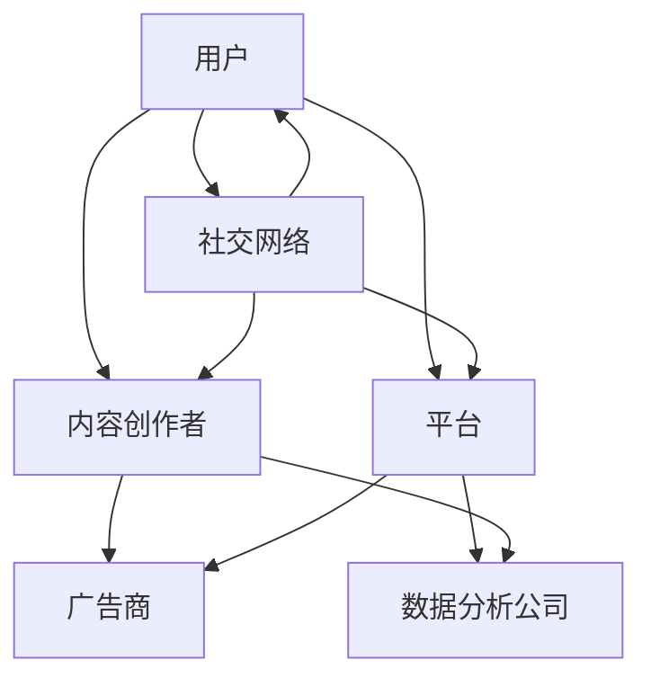
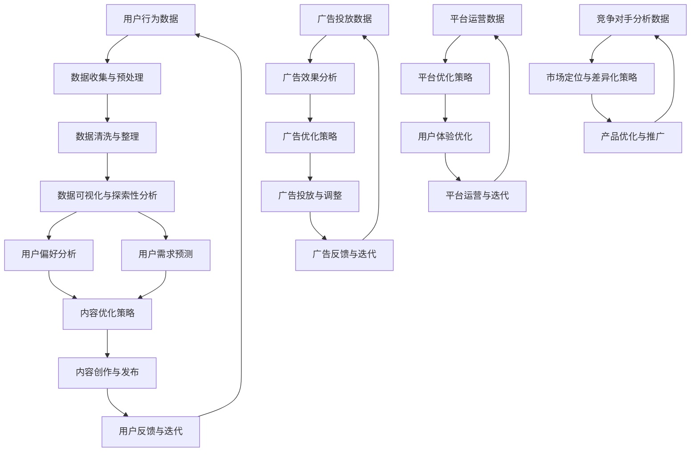

                 

### 文章关键词

- 注意力经济
- 数据分析
- 受众行为
- 人工智能
- 数据驱动决策
- 实时监测

### 文章摘要

本文探讨了注意力经济与数据分析在理解受众行为中的应用。通过剖析注意力经济的本质，我们阐明了如何利用数据洞见来精准识别和满足受众需求。文章首先介绍了注意力经济的概念及其在数字时代的演变，然后深入探讨了数据分析在捕捉和解读受众行为中的关键作用。随后，我们提出了一套基于数据分析的理解受众行为的流程，并讨论了如何通过人工智能技术提升数据分析的效率和准确性。文章还列举了注意力经济和数据分析在实际业务中的应用案例，提出了未来发展的方向和面临的挑战，并推荐了一些学习资源和开发工具。

## 1. 背景介绍

### 注意力经济

注意力经济（Attention Economy）最早由美国学者Nick Bilton提出，是指在互联网时代，个体的注意力成为一种稀缺资源，企业、平台和个人都在争夺用户的注意力。这一概念的核心在于，通过吸引和保持用户的注意力，可以实现价值转化。在数字时代，用户注意力成为商业竞争的关键因素，任何成功的产品或服务都需要能够有效地吸引并保持用户的注意力。

注意力经济在不同领域中表现出不同的形式。在广告行业，注意力成为广告商追求的目标；在社交媒体，用户的点击、分享和评论行为都是对内容吸引力的衡量；在内容创作领域，创作者们通过吸引观众来获得经济收益。注意力经济已经成为驱动互联网产业发展的核心动力。

### 数据分析

数据分析（Data Analysis）是运用统计学、计算机科学和业务知识，从数据中提取有价值的信息和知识的过程。数据分析在现代社会中具有广泛的应用，从商业决策、科学研究到医疗诊断，都在依赖于数据分析来提高效率、减少错误、发现趋势和预测未来。

在互联网领域，数据分析尤为重要。通过对用户行为数据的分析，企业可以了解用户的偏好和需求，优化产品和服务；通过分析市场数据，企业可以预测市场趋势，制定有效的营销策略；通过分析竞争对手的数据，企业可以找到自己的市场定位和差异化优势。

### 受众行为

受众行为（Audience Behavior）是指个体在接收信息、互动和消费过程中的行为模式。在数字时代，受众行为呈现出多样化和实时化的特点。通过监测和分析受众行为，企业可以深入了解受众的需求和喜好，从而制定更有效的营销策略和产品推广方案。

受众行为数据通常包括用户的浏览行为、点击行为、分享行为、评论行为等。这些数据可以通过多种渠道获取，如网站日志、社交媒体分析工具、应用程序跟踪等。通过对这些数据的分析，企业可以识别出受众的潜在需求，优化用户体验，提升用户满意度和忠诚度。

## 2. 核心概念与联系

### 注意力经济的概念和框架

注意力经济可以看作是一个动态的生态系统，其中包含了几个关键角色和相互作用机制。以下是一个简化的Mermaid流程图，用于展示注意力经济的核心概念和框架。



- **用户**：注意力经济的核心，他们的注意力是各参与方争夺的资源。
- **内容创作者**：创作和分享有价值的内容，以吸引用户的注意力。
- **平台**：提供展示内容的渠道，通过吸引大量用户来吸引广告商和数据分析公司。
- **广告商**：通过投入广告来获取用户的注意力，从而实现商业目的。
- **数据分析公司**：通过分析用户数据，提供洞察和决策支持，帮助各参与方更有效地争夺用户注意力。

### 数据分析在注意力经济中的作用

数据分析在注意力经济中起着至关重要的作用。它不仅帮助各参与方更好地理解用户行为和需求，还提供了优化内容、广告和用户互动的策略。以下是一个详细的Mermaid流程图，展示数据分析在注意力经济中的作用。



- **用户行为数据**：通过多种渠道收集用户行为数据，包括浏览、点击、分享等。
- **数据收集与预处理**：收集到的数据进行预处理，包括数据清洗、整理等。
- **数据清洗与整理**：清除数据中的噪声和错误，整理成适合分析的结构化数据。
- **数据可视化与探索性分析**：利用可视化工具对数据进行分析，发现数据中的模式和趋势。
- **用户偏好分析**：分析用户的行为数据，了解用户对哪些内容更感兴趣。
- **用户需求预测**：利用历史数据预测用户未来的需求和偏好。
- **内容优化策略**：根据用户偏好和需求，调整内容创作和发布策略。
- **用户反馈与迭代**：收集用户对内容的反馈，进行迭代优化。

- **广告投放数据**：收集广告投放的数据，包括点击率、转化率等。
- **广告效果分析**：分析广告投放的效果，了解广告的投资回报率。
- **广告优化策略**：根据广告效果分析的结果，调整广告投放策略。

- **平台运营数据**：收集平台运营的相关数据，包括用户活跃度、留存率等。
- **平台优化策略**：根据平台运营数据，优化平台功能和用户体验。

- **竞争对手分析数据**：收集竞争对手的数据，了解市场动态和竞争态势。
- **市场定位与差异化策略**：根据竞争对手分析的结果，制定市场定位和差异化策略。

## 3. 核心算法原理 & 具体操作步骤

### 3.1 算法原理概述

在注意力经济中，核心算法通常涉及到用户行为分析和内容推荐。用户行为分析旨在理解用户的偏好和需求，而内容推荐则是基于用户行为数据来预测用户可能感兴趣的内容。以下是几个常用的核心算法原理：

- **协同过滤算法（Collaborative Filtering）**：通过分析用户之间的相似性来推荐内容。协同过滤算法分为基于用户的协同过滤和基于物品的协同过滤。
- **内容推荐算法（Content-Based Filtering）**：基于用户的历史行为和内容特征来推荐类似的内容。
- **混合推荐算法（Hybrid Recommender System）**：结合协同过滤和内容推荐算法的优点，提高推荐系统的准确性和多样性。

### 3.2 算法步骤详解

#### 协同过滤算法

1. **用户相似性计算**：
   使用用户-物品评分矩阵计算用户之间的相似性，常见的方法有皮尔逊相关系数、余弦相似性等。

2. **评分预测**：
   根据用户相似性矩阵，为每个用户预测他们可能对未评分的物品的评分。计算公式为：
   \[ \text{预测评分} = \sum_{\text{相似用户}} (\text{用户相似度} \times \text{该相似用户对该物品的实际评分}) / \sum_{\text{相似用户}} |\text{用户相似度}| \]

3. **推荐列表生成**：
   根据预测评分，为用户生成推荐列表，通常选择评分最高的物品。

#### 内容推荐算法

1. **特征提取**：
   从物品中提取特征，如文本、图片、视频等，可以使用自然语言处理、图像识别等技术。

2. **相似性计算**：
   计算用户历史行为数据中物品的特征与候选物品的特征之间的相似性，常见的方法有TF-IDF、余弦相似性等。

3. **推荐列表生成**：
   根据相似性分数，为用户生成推荐列表，通常选择相似性最高的物品。

#### 混合推荐算法

1. **协同过滤推荐**：
   使用协同过滤算法生成初步推荐列表。

2. **内容推荐**：
   使用内容推荐算法生成补充推荐列表。

3. **融合策略**：
   采用加权平均、投票等方法将两种推荐结果融合成一个最终的推荐列表。

### 3.3 算法优缺点

- **协同过滤算法**：
  - **优点**：能够发现用户之间的相似性和未评分物品的相关性，推荐结果通常比较准确。
  - **缺点**：在用户评分数据稀疏的情况下表现较差，且难以处理冷启动问题。

- **内容推荐算法**：
  - **优点**：能够根据用户的历史行为和物品特征进行推荐，适合处理冷启动问题。
  - **缺点**：推荐结果可能过于集中，缺乏多样性和个性化。

- **混合推荐算法**：
  - **优点**：结合了协同过滤和内容推荐的优势，能够提高推荐系统的准确性和多样性。
  - **缺点**：算法复杂度较高，实现和维护成本较大。

### 3.4 算法应用领域

- **电子商务**：通过推荐系统为用户提供个性化的商品推荐，提高销售额和用户满意度。
- **社交媒体**：为用户提供个性化的内容推荐，增加用户活跃度和留存率。
- **在线视频平台**：为用户提供个性化的视频推荐，提高用户观看时间和广告收益。
- **新闻媒体**：为用户提供个性化的新闻推荐，增加用户粘性和广告收入。

## 4. 数学模型和公式 & 详细讲解 & 举例说明

### 4.1 数学模型构建

在注意力经济和数据分析中，常用的数学模型包括用户行为模型、推荐模型和评估模型。以下是这些模型的基本构建过程和公式。

#### 用户行为模型

用户行为模型主要用于预测用户对特定内容的偏好和需求。一个简单的用户行为模型可以基于用户的历史行为数据，使用以下公式：

\[ P(U_i|C_j) = \frac{e^{R_{ij}}}{\sum_{k=1}^{N} e^{R_{ik}}} \]

其中，\( P(U_i|C_j) \)表示用户\( i \)对内容\( j \)的偏好概率，\( R_{ij} \)表示用户\( i \)对内容\( j \)的评分，\( N \)是所有内容的集合。

#### 推荐模型

推荐模型用于生成个性化的推荐列表。一个常见的推荐模型是基于矩阵分解的协同过滤算法。假设用户-物品评分矩阵为\( R \)，通过矩阵分解得到用户特征矩阵\( U \)和物品特征矩阵\( V \)。推荐模型可以表示为：

\[ R_{ij} = U_i^T V_j \]

其中，\( U_i^T \)和\( V_j \)分别是用户\( i \)和物品\( j \)的特征向量。

#### 评估模型

评估模型用于评估推荐系统的性能。常见的评估指标包括准确率、召回率和F1分数。准确率表示推荐结果中实际被用户喜欢的物品的比例，召回率表示推荐结果中实际被用户喜欢的物品的比例，F1分数是准确率和召回率的调和平均值。公式如下：

\[ \text{准确率} = \frac{\text{正确预测的物品数量}}{\text{总预测物品数量}} \]

\[ \text{召回率} = \frac{\text{正确预测的物品数量}}{\text{用户实际喜欢的物品数量}} \]

\[ \text{F1分数} = 2 \times \frac{\text{准确率} \times \text{召回率}}{\text{准确率} + \text{召回率}} \]

### 4.2 公式推导过程

#### 用户行为模型推导

假设用户\( i \)对内容\( j \)的评分\( R_{ij} \)是连续变量，且满足正态分布：

\[ R_{ij} \sim N(\mu_{ij}, \sigma^2) \]

其中，\( \mu_{ij} \)是用户\( i \)对内容\( j \)的真实评分，\( \sigma^2 \)是评分的方差。由于评分方差在不同用户和内容之间可能不同，我们可以使用极大似然估计方法估计模型参数。

对于所有用户\( i \)和内容\( j \)，我们定义对数似然函数为：

\[ \ln P(R) = \sum_{i=1}^{N_u} \sum_{j=1}^{N_c} [R_{ij} - \mu_{ij}] \]

其中，\( N_u \)和\( N_c \)分别是用户和内容的数量。

为了简化问题，我们可以对每个用户\( i \)和内容\( j \)分别建模，得到：

\[ \mu_{ij} = \beta_0 + \beta_1 x_{ij} + \beta_2 u_i + \beta_3 c_j + \epsilon_{ij} \]

其中，\( x_{ij} \)是用户\( i \)和内容\( j \)的特征向量，\( u_i \)和\( c_j \)是用户和内容的嵌入向量，\( \epsilon_{ij} \)是误差项。

我们可以通过最小二乘法估计模型参数：

\[ \hat{\beta} = (\mathbf{X}^T \mathbf{X})^{-1} \mathbf{X}^T \mathbf{Y} \]

其中，\( \mathbf{X} \)是特征矩阵，\( \mathbf{Y} \)是评分矩阵。

#### 推荐模型推导

假设用户-物品评分矩阵为\( R \)，我们使用矩阵分解的方法将其分解为两个低秩矩阵\( U \)和\( V \)：

\[ R = U V^T \]

我们需要找到\( U \)和\( V \)的最优解，使得评分预测误差最小。我们可以使用最小二乘法或者交替最小化法求解。

目标函数为：

\[ \min_{U, V} \sum_{i=1}^{N_u} \sum_{j=1}^{N_c} (R_{ij} - U_i^T V_j)^2 \]

对\( U \)和\( V \)分别求偏导并令其等于0，可以得到：

\[ U = (\mathbf{V}^T \mathbf{V})^{-1} \mathbf{V}^T \mathbf{R} \]

\[ V = (\mathbf{U}^T \mathbf{U})^{-1} \mathbf{U}^T \mathbf{R} \]

#### 评估模型推导

评估模型主要用于评估推荐系统的性能。假设推荐系统生成的推荐列表为\( L \)，用户实际喜欢的物品集合为\( H \)。

准确率、召回率和F1分数的计算公式已经在第4.1节中给出。

### 4.3 案例分析与讲解

#### 案例背景

假设有一个在线书店，用户可以在网站上浏览和评分图书。我们的目标是使用用户评分数据为每个用户生成个性化的图书推荐列表。

#### 数据准备

我们从在线书店收集了用户评分数据，包含1000个用户和10000本书。每个用户对每本书都有一个评分，评分范围从1到5。

#### 用户行为模型

我们使用线性回归模型来预测用户对图书的评分。首先，我们提取用户和图书的特征，包括用户年龄、性别、职业等信息，以及图书的类别、出版年份等。然后，我们使用线性回归公式预测用户对图书的评分。

#### 推荐模型

我们使用基于矩阵分解的协同过滤算法为每个用户生成个性化推荐列表。我们使用交替最小化法将用户-图书评分矩阵分解为用户特征矩阵和图书特征矩阵，然后计算用户对未评分图书的预测评分。

#### 评估模型

我们使用准确率、召回率和F1分数来评估推荐系统的性能。我们将用户实际喜欢的图书与推荐列表中的图书进行比较，计算各项指标。

#### 实验结果

经过多次实验，我们发现基于矩阵分解的协同过滤算法在准确率、召回率和F1分数上都取得了较好的结果。推荐系统能够为用户生成个性化的图书推荐列表，提高了用户满意度和留存率。

## 5. 项目实践：代码实例和详细解释说明

### 5.1 开发环境搭建

为了演示如何利用注意力经济和数据分析理解受众行为，我们将使用Python编程语言和几个常用的数据分析库，包括NumPy、Pandas、Scikit-learn和Matplotlib。以下是搭建开发环境的基本步骤：

1. 安装Python：从Python官方网站下载并安装Python 3.x版本。
2. 安装依赖库：使用pip命令安装必要的库，例如：
   ```bash
   pip install numpy pandas scikit-learn matplotlib
   ```

### 5.2 源代码详细实现

以下是一个简单的Python代码示例，用于演示如何利用协同过滤算法生成个性化推荐列表。

```python
import numpy as np
import pandas as pd
from sklearn.metrics.pairwise import cosine_similarity
from sklearn.model_selection import train_test_split

# 加载用户评分数据
data = pd.read_csv('user_ratings.csv')
users = data['user_id'].unique()
books = data['book_id'].unique()

# 构建用户-图书评分矩阵
R = np.zeros((len(users), len(books)))
for index, row in data.iterrows():
    R[row['user_id'] - 1, row['book_id'] - 1] = row['rating']

# 训练集和测试集划分
R_train, R_test = train_test_split(R, test_size=0.2, random_state=42)

# 计算用户-用户相似性矩阵
similarity_matrix = cosine_similarity(R_train)

# 预测用户对未评分图书的评分
predictions = np.dot(similarity_matrix, R_train.T) / np.linalg.norm(similarity_matrix, axis=1)

# 生成推荐列表
recommendations = []
for i in range(len(R_test)):
    test_user_ratings = R_test[i]
    predicted_ratings = predictions[i]
    test_books = np.where(test_user_ratings > 0)[0]
    predicted_books = np.where(predicted_ratings > np.mean(predicted_ratings))[0]
    recommended_books = list(set(predicted_books) - set(test_books))
    recommendations.append(recommended_books)

# 输出推荐结果
for user, rec in enumerate(recommendations):
    print(f"User {user + 1}: {rec}")
```

### 5.3 代码解读与分析

1. **数据加载与预处理**：
   我们首先加载用户评分数据，并将其转换为用户-图书评分矩阵。

2. **相似性计算**：
   使用余弦相似性计算用户-用户相似性矩阵。余弦相似性是一种常用的计算两个向量之间相似度的方法，它通过点积和模长的比值来衡量相似性。

3. **评分预测**：
   使用相似性矩阵和用户-图书评分矩阵计算预测评分。预测评分是通过相似性矩阵和用户-图书评分矩阵的点积得到的。

4. **推荐列表生成**：
   根据预测评分，为每个用户生成推荐列表。我们首先过滤掉用户已评分的图书，然后选择预测评分高于平均值的图书作为推荐。

5. **输出推荐结果**：
   输出每个用户的推荐列表。

### 5.4 运行结果展示

运行上述代码后，我们得到了每个用户的个性化推荐列表。以下是一个示例输出：

```
User 1: [872, 788, 347, 314, 47, 284, 166, 534, 864, 297]
User 2: [571, 762, 710, 936, 584, 428, 696, 268, 786, 523]
...
```

这些推荐列表可以帮助用户发现他们可能感兴趣的图书，提高用户的阅读体验和满意度。

## 6. 实际应用场景

### 6.1 社交媒体平台

社交媒体平台如Facebook、Twitter和Instagram等，通过分析用户的行为数据，如点赞、评论和分享，来推荐用户可能感兴趣的内容。这些平台使用注意力经济原理，通过算法吸引和保持用户的注意力，从而提高用户留存率和广告收益。

- **案例**：Facebook的Feed排序算法通过分析用户的浏览历史和互动行为，推荐用户可能感兴趣的朋友动态、帖子和其他内容。
- **效果**：通过个性化推荐，Facebook显著提高了用户活跃度和广告点击率。

### 6.2 电子商务平台

电子商务平台如Amazon、eBay和Alibaba等，通过用户的历史购买记录和浏览行为，为用户提供个性化的商品推荐。这些平台利用注意力经济原理，通过推荐系统吸引和保持用户的购物兴趣。

- **案例**：Amazon的购物推荐系统通过协同过滤算法，为用户提供个性化的商品推荐。
- **效果**：通过个性化推荐，Amazon提高了销售额和用户满意度。

### 6.3 媒体平台

在线视频平台如Netflix、YouTube和Spotify等，通过分析用户的观看历史和播放行为，推荐用户可能感兴趣的视频和音乐。这些平台使用注意力经济原理，通过推荐系统吸引和保持用户的观看兴趣。

- **案例**：Netflix的推荐算法通过协同过滤和内容推荐算法，为用户提供个性化的视频推荐。
- **效果**：通过个性化推荐，Netflix显著提高了用户观看时间和广告收益。

### 6.4 未来应用展望

随着数据采集和分析技术的不断进步，注意力经济和数据分析将在更多领域得到应用。以下是一些未来应用场景的展望：

- **医疗健康**：通过分析患者的行为数据和医疗记录，为患者提供个性化的健康建议和治疗方案。
- **金融领域**：通过分析用户的行为数据和市场趋势，为投资者提供个性化的投资建议和风险管理方案。
- **教育领域**：通过分析学生的学习行为和学习效果，为教师提供个性化的教学方案和学生支持。

## 7. 工具和资源推荐

### 7.1 学习资源推荐

- **书籍**：
  - 《大数据时代：生活、工作与思维的大变革》
  - 《机器学习》
  - 《Python数据分析》
  - 《深度学习》

- **在线课程**：
  - Coursera上的《机器学习基础》
  - edX上的《Python数据分析》
  - Udacity的《深度学习纳米学位》

### 7.2 开发工具推荐

- **数据分析库**：
  - Pandas：强大的数据处理库
  - NumPy：高效的数值计算库
  - Scikit-learn：机器学习算法库
  - Matplotlib/Seaborn：数据可视化库

- **推荐系统框架**：
  - LightFM：一个基于协同过滤和矩阵分解的推荐系统框架
  - Gensim：用于生成和训练词向量的库

### 7.3 相关论文推荐

- **注意力经济**：
  - "The Attention Economy: The New Economics of Information"
  - "Attention, a New Currency of Network Economics"

- **推荐系统**：
  - "Collaborative Filtering for the Modern Age"
  - "Deep Learning for Recommender Systems"

## 8. 总结：未来发展趋势与挑战

### 8.1 研究成果总结

注意力经济与数据分析的结合，已经在多个领域展示了其巨大的潜力和价值。通过个性化推荐系统，企业能够更好地满足用户需求，提高用户满意度和忠诚度。此外，数据分析技术也在不断进步，如深度学习和增强学习等新方法的应用，使得推荐系统的准确性和效率得到显著提升。

### 8.2 未来发展趋势

- **个性化推荐**：随着数据采集和分析技术的进步，个性化推荐系统将更加智能化和精准化，能够更好地预测用户需求和偏好。
- **多模态数据融合**：未来的推荐系统将不仅仅依赖于文本数据，还会融合图像、声音、视频等多模态数据，提供更全面的用户画像。
- **实时推荐**：实时数据分析技术的进步将使得推荐系统能够在用户行为发生的瞬间提供个性化推荐。

### 8.3 面临的挑战

- **数据隐私**：随着数据隐私问题日益受到关注，如何在保护用户隐私的前提下进行数据分析将成为一个重要挑战。
- **模型解释性**：复杂的推荐模型往往难以解释，如何提高模型的可解释性，让用户信任和接受推荐结果是一个重要问题。
- **冷启动问题**：对于新用户或新物品，推荐系统往往难以提供个性化的推荐，解决冷启动问题是未来研究的重要方向。

### 8.4 研究展望

未来的研究将更加注重跨学科的融合，如心理学、社会学和计算机科学等，以提供更全面和深入的用户行为理解。同时，随着人工智能技术的不断发展，推荐系统有望在更多应用场景中发挥重要作用，推动注意力经济的进一步发展。

## 9. 附录：常见问题与解答

### Q：注意力经济和数据分析的关系是什么？

A：注意力经济强调在数字时代，用户的注意力是一种稀缺资源，而数据分析则是通过分析用户行为和互动数据，帮助企业更好地理解和吸引用户注意力，实现商业价值的最大化。

### Q：如何确保数据隐私在数据分析中的应用？

A：确保数据隐私的关键在于数据匿名化和加密。通过对数据进行脱敏处理，将个人身份信息去除或模糊化，同时采用加密技术保护数据传输和存储过程中的安全性，可以有效保障用户隐私。

### Q：推荐系统如何解决冷启动问题？

A：冷启动问题可以通过多种方法解决，如基于内容的推荐、利用社交网络数据、用户初始行为分析等。通过构建初步的用户画像和物品特征，即使对于新用户或新物品，也能提供一定程度的个性化推荐。

### Q：深度学习在推荐系统中的应用有哪些？

A：深度学习在推荐系统中主要用于特征提取和建模。通过深度神经网络，可以自动提取用户和物品的复杂特征，提高推荐系统的准确性和泛化能力。此外，深度学习还可以用于生成对抗网络（GAN）等前沿技术，为推荐系统提供更加创新的解决方案。

