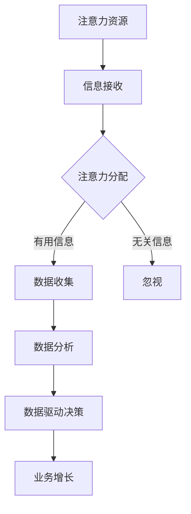

                 

关键词：注意力经济，数据驱动，业务洞察，市场分析，决策优化，算法原理，实践案例

> 摘要：本文旨在探讨注意力经济背景下的数据驱动决策模式，通过深入解析注意力经济的本质和特征，分析数据在决策过程中的关键作用，并提出一种利用数据增强业务和市场洞察力的方法。文章将围绕核心算法原理、具体操作步骤、数学模型及公式推导、实际应用场景和未来发展趋势等方面展开论述，旨在为企业和决策者提供实用的指导。

## 1. 背景介绍

随着互联网和大数据技术的迅猛发展，信息爆炸的时代已经来临。在这样一个信息过载的时代，如何有效地管理和利用信息资源成为企业和个人面临的重要课题。注意力经济作为一种新兴的经济模式，日益受到关注。注意力经济强调的是个体在信息接收和处理过程中，对信息的注意力分配和利用，从而实现价值最大化。

注意力经济的核心在于“注意力资源”的稀缺性和价值。在信息爆炸的背景下，个体的注意力资源变得尤为珍贵，因此如何吸引并保持用户的注意力成为企业市场营销和产品设计的核心目标。与此同时，数据作为现代社会的重要资源，其价值日益凸显。数据驱动决策成为企业提高运营效率、优化业务流程和提升市场竞争力的重要手段。

本文将围绕注意力经济与数据驱动决策之间的关系展开讨论，深入分析注意力经济背景下的数据驱动决策模式，并提出一种利用数据增强业务和市场洞察力的方法。文章将分为以下几个部分：

1. 背景介绍：介绍注意力经济和数据驱动决策的概念及发展背景。
2. 核心概念与联系：阐述注意力经济与数据驱动决策的核心概念及联系。
3. 核心算法原理与操作步骤：详细解析数据驱动决策的核心算法原理及操作步骤。
4. 数学模型和公式：介绍数据驱动决策相关的数学模型和公式。
5. 项目实践：通过实际案例展示数据驱动决策的应用和实践。
6. 实际应用场景：分析数据驱动决策在不同领域的应用场景。
7. 工具和资源推荐：推荐相关学习资源和开发工具。
8. 总结：总结研究成果，展望未来发展趋势与挑战。

## 2. 核心概念与联系

### 2.1 注意力经济

注意力经济（Attention Economy）起源于2006年，由美国科技作家Johann H. Klümper首次提出。它是一种基于个体注意力资源稀缺性的经济模式，强调个体在信息接收和处理过程中，对信息的注意力分配和利用。注意力经济的核心在于“注意力资源”的稀缺性和价值。

在注意力经济中，注意力资源被视为一种重要的生产要素，与土地、劳动力和资本等传统生产要素并列。个体在信息接收和处理过程中，对信息的注意力分配决定了信息价值的大小。因此，企业、个人和政府等行为主体纷纷争夺和利用注意力资源，以实现自身利益最大化。

### 2.2 数据驱动决策

数据驱动决策（Data-driven Decision Making）是指通过收集、分析和利用数据，对问题进行定量分析和决策。数据驱动决策的核心在于利用数据揭示问题的本质，从而提高决策的科学性和准确性。数据驱动决策具有以下几个特点：

1. **以数据为基础**：数据驱动决策强调以数据作为决策的基础，避免主观臆断和经验主义。
2. **全面性**：数据驱动决策通过收集和分析全面的数据，确保决策的全面性和准确性。
3. **实时性**：数据驱动决策注重实时数据的收集和分析，及时调整决策策略。
4. **可量化**：数据驱动决策通过量化指标和模型，对决策结果进行评估和优化。

### 2.3 注意力经济与数据驱动决策的联系

注意力经济和数据驱动决策之间存在紧密的联系。首先，注意力经济为数据驱动决策提供了新的视角和背景。在注意力经济中，个体注意力资源的稀缺性和价值决定了数据在决策中的重要性。因此，数据驱动决策需要充分考虑注意力资源的分配和利用。

其次，数据驱动决策为注意力经济提供了科学依据。通过收集、分析和利用数据，数据驱动决策可以帮助企业更好地了解用户需求、市场趋势和竞争态势，从而制定更有效的注意力获取和利用策略。

最后，注意力经济和数据驱动决策相互促进。在注意力经济背景下，数据驱动决策有助于企业提高市场竞争力，实现业务增长。同时，数据驱动决策的实践也为注意力经济提供了丰富的经验和数据支持。

### 2.4 注意力经济的 Mermaid 流程图



## 3. 核心算法原理 & 具体操作步骤

### 3.1 算法原理概述

数据驱动决策的核心算法主要包括数据收集、数据分析和决策优化三个阶段。以下是各阶段的简要概述：

1. **数据收集**：通过各类传感器、社交媒体、用户反馈等渠道收集数据，确保数据的全面性和准确性。
2. **数据分析**：利用统计方法、机器学习和深度学习等技术对数据进行处理和分析，提取有价值的信息和洞察。
3. **决策优化**：根据分析结果，利用优化算法和模型，制定和调整决策策略，以实现业务目标。

### 3.2 算法步骤详解

#### 3.2.1 数据收集

数据收集是数据驱动决策的基础。以下是数据收集的步骤：

1. **确定数据来源**：根据业务需求，确定数据收集的来源，如内部系统、第三方数据平台、社交媒体等。
2. **数据收集策略**：制定数据收集策略，包括数据类型、频率、采集方式等。
3. **数据预处理**：对收集到的数据进行清洗、去重、格式转换等预处理操作，确保数据的准确性和一致性。

#### 3.2.2 数据分析

数据分析是数据驱动决策的核心环节。以下是数据分析的步骤：

1. **数据探索**：对数据集进行初步探索，了解数据的基本特征和分布。
2. **数据可视化**：利用数据可视化技术，将数据以图表、地图等形式展示，便于分析和理解。
3. **特征工程**：根据业务需求，提取和构建数据特征，为后续模型训练提供输入。
4. **模型选择**：根据数据分析目标，选择合适的统计方法、机器学习算法或深度学习模型。
5. **模型训练与评估**：利用训练数据集对模型进行训练，并使用测试数据集对模型进行评估，确保模型的有效性和可靠性。

#### 3.2.3 决策优化

决策优化是根据分析结果，制定和调整决策策略的过程。以下是决策优化的步骤：

1. **目标设定**：明确业务目标和决策目标，如提高销售额、降低运营成本等。
2. **决策模型构建**：利用优化算法和模型，构建决策模型，将分析结果转化为具体的行动方案。
3. **方案评估**：对决策方案进行评估，包括成本、收益、风险等因素。
4. **方案实施**：根据评估结果，选择最优方案并实施。
5. **反馈调整**：根据实施效果，对决策方案进行调整和优化。

### 3.3 算法优缺点

数据驱动决策算法具有以下优点：

1. **科学性**：基于数据分析和模型优化，决策过程更加科学和客观。
2. **灵活性**：可根据实时数据调整决策策略，适应市场变化。
3. **效率**：通过自动化和智能化手段，提高决策效率，降低人力成本。

然而，数据驱动决策算法也存在一些缺点：

1. **数据质量**：数据质量直接影响决策结果，数据错误或不完整可能导致决策失误。
2. **模型依赖**：算法性能依赖于模型的构建和训练，模型失效可能导致决策失效。
3. **风险**：过度依赖数据可能导致忽视其他因素，如人性、道德和法规等。

### 3.4 算法应用领域

数据驱动决策算法广泛应用于多个领域，包括：

1. **市场营销**：通过数据分析，精准定位用户需求，优化广告投放和营销策略。
2. **供应链管理**：通过数据分析和优化，提高供应链效率，降低库存成本。
3. **金融风险控制**：通过数据分析和模型预测，降低金融风险，提高投资收益。
4. **医疗健康**：通过数据分析和诊断模型，提高疾病预测和治疗效果。

## 4. 数学模型和公式 & 详细讲解 & 举例说明

### 4.1 数学模型构建

数据驱动决策的核心数学模型包括线性回归模型、逻辑回归模型和支持向量机（SVM）等。以下以线性回归模型为例，介绍数学模型的构建过程。

#### 4.1.1 线性回归模型

线性回归模型是一种常用的预测模型，用于分析自变量和因变量之间的线性关系。其数学模型如下：

$$
y = \beta_0 + \beta_1x_1 + \beta_2x_2 + \cdots + \beta_nx_n + \epsilon
$$

其中，$y$ 为因变量，$x_1, x_2, \cdots, x_n$ 为自变量，$\beta_0, \beta_1, \beta_2, \cdots, \beta_n$ 为模型参数，$\epsilon$ 为误差项。

#### 4.1.2 逻辑回归模型

逻辑回归模型是一种用于分类问题的预测模型，其数学模型如下：

$$
\ln\frac{P(Y=1)}{1-P(Y=1)} = \beta_0 + \beta_1x_1 + \beta_2x_2 + \cdots + \beta_nx_n
$$

其中，$Y$ 为分类变量，$P(Y=1)$ 为因变量为1的概率，$\beta_0, \beta_1, \beta_2, \cdots, \beta_n$ 为模型参数。

#### 4.1.3 支持向量机（SVM）

支持向量机是一种用于分类和回归分析的机器学习算法。其数学模型如下：

$$
\text{Minimize } \frac{1}{2} ||\mathbf{w}||^2 \\
\text{subject to } y^{(i)}(\mathbf{w}^T\mathbf{x}^{(i)} + b) \geq 1
$$

其中，$\mathbf{w}$ 为模型参数向量，$\mathbf{x}^{(i)}$ 为训练样本，$y^{(i)}$ 为样本标签，$b$ 为偏置项。

### 4.2 公式推导过程

以下以线性回归模型为例，介绍数学公式的推导过程。

#### 4.2.1 拉格朗日乘数法

首先，引入拉格朗日乘数法，将目标函数转化为求解问题：

$$
L(\beta_0, \beta_1, \beta_2, \cdots, \beta_n, \lambda) = \sum_{i=1}^{n}(y_i - \beta_0 - \beta_1x_{i1} - \beta_2x_{i2} - \cdots - \beta_nx_{in})^2 + \lambda(\beta_0 + \beta_1 + \beta_2 + \cdots + \beta_n)
$$

其中，$\lambda$ 为拉格朗日乘数。

#### 4.2.2 求导与极值

对 $L$ 函数关于 $\beta_0, \beta_1, \beta_2, \cdots, \beta_n, \lambda$ 求导，并令导数为0，得到：

$$
\frac{\partial L}{\partial \beta_0} = -2\sum_{i=1}^{n}(y_i - \beta_0 - \beta_1x_{i1} - \beta_2x_{i2} - \cdots - \beta_nx_{in}) - \lambda = 0 \\
\frac{\partial L}{\partial \beta_1} = -2\sum_{i=1}^{n}(y_i - \beta_0 - \beta_1x_{i1} - \beta_2x_{i2} - \cdots - \beta_nx_{in})x_{i1} - \lambda = 0 \\
\cdots \\
\frac{\partial L}{\partial \beta_n} = -2\sum_{i=1}^{n}(y_i - \beta_0 - \beta_1x_{i1} - \beta_2x_{i2} - \cdots - \beta_nx_{in})x_{in} - \lambda = 0 \\
\frac{\partial L}{\partial \lambda} = \beta_0 + \beta_1 + \beta_2 + \cdots + \beta_n = 0
$$

#### 4.2.3 解方程组

将上述导数方程组联立，解得：

$$
\beta_0 = \frac{1}{n}\sum_{i=1}^{n}(y_i - \beta_1x_{i1} - \beta_2x_{i2} - \cdots - \beta_nx_{in}) \\
\beta_1 = \frac{1}{n}\sum_{i=1}^{n}(y_i - \beta_0 - \beta_2x_{i2} - \cdots - \beta_nx_{in})x_{i1} \\
\cdots \\
\beta_n = \frac{1}{n}\sum_{i=1}^{n}(y_i - \beta_0 - \beta_1x_{i1} - \beta_2x_{i2} - \cdots - \beta_{n-1}x_{i(n-1)})
$$

### 4.3 案例分析与讲解

以下以一个简单的线性回归案例，展示数据驱动决策的实践过程。

#### 4.3.1 数据集介绍

假设我们有一个数据集，包含以下三个特征变量（年龄、收入、教育程度）和一个因变量（购买意愿）：

| 年龄 | 收入 | 教育程度 | 购买意愿 |
| ---- | ---- | -------- | -------- |
| 25   | 5000 | 本科     | 是       |
| 30   | 8000 | 硕士     | 是       |
| 35   | 10000| 本科     | 否       |
| 40   | 12000| 硕士     | 是       |

#### 4.3.2 数据预处理

1. 数据清洗：去除缺失值和异常值。
2. 数据标准化：对特征变量进行标准化处理，使其具有相同的量纲。

#### 4.3.3 数据分析

1. 数据探索：通过描述性统计分析，了解数据的基本特征和分布。
2. 数据可视化：利用散点图、直方图等可视化技术，分析特征变量之间的关系。

#### 4.3.4 模型构建与训练

1. 模型选择：选择线性回归模型作为预测模型。
2. 模型训练：利用训练数据集，训练线性回归模型。

#### 4.3.5 模型评估

1. 模型评估指标：选择均方误差（MSE）作为评估指标。
2. 模型评估：利用测试数据集，评估模型性能。

#### 4.3.6 决策优化

1. 目标设定：根据业务需求，设定购买意愿阈值。
2. 决策优化：利用模型预测结果，制定针对性的营销策略。

## 5. 项目实践：代码实例和详细解释说明

### 5.1 开发环境搭建

1. 安装 Python 解释器：下载并安装 Python 3.8 及以上版本。
2. 安装相关库：使用 pip 命令安装必要的库，如 NumPy、Pandas、Scikit-learn 等。

### 5.2 源代码详细实现

以下是一个简单的线性回归案例，展示数据驱动决策的代码实现过程。

```python
import numpy as np
import pandas as pd
from sklearn.linear_model import LinearRegression
from sklearn.model_selection import train_test_split
from sklearn.metrics import mean_squared_error

# 5.2.1 数据预处理
data = pd.DataFrame({
    '年龄': [25, 30, 35, 40],
    '收入': [5000, 8000, 10000, 12000],
    '教育程度': [1, 2, 1, 2],
    '购买意愿': [1, 1, 0, 1]
})

# 数据标准化
data_normalized = (data - data.mean()) / data.std()

# 5.2.2 数据分析
# 数据探索
print(data_normalized.describe())

# 数据可视化
import matplotlib.pyplot as plt

plt.scatter(data_normalized['年龄'], data_normalized['购买意愿'])
plt.xlabel('年龄')
plt.ylabel('购买意愿')
plt.show()

# 5.2.3 模型构建与训练
# 模型选择
model = LinearRegression()

# 模型训练
X = data_normalized[['年龄', '收入', '教育程度']]
y = data_normalized['购买意愿']
X_train, X_test, y_train, y_test = train_test_split(X, y, test_size=0.2, random_state=42)
model.fit(X_train, y_train)

# 5.2.4 模型评估
# 模型评估指标
mse = mean_squared_error(y_test, model.predict(X_test))
print('MSE:', mse)

# 5.2.5 决策优化
# 购买意愿阈值设定
threshold = 0.5

# 购买预测
predictions = model.predict(X_test)

# 决策结果
for i in range(len(predictions)):
    if predictions[i] > threshold:
        print('样本{}：购买意愿高，建议采取营销策略'.format(i+1))
    else:
        print('样本{}：购买意愿低，建议关注其他策略'.format(i+1))
```

### 5.3 代码解读与分析

1. **数据预处理**：数据预处理是数据驱动决策的关键步骤。在代码中，我们使用 Pandas 库读取数据，并进行数据清洗、标准化等操作。
2. **数据分析**：数据分析是理解数据的重要环节。在代码中，我们使用 Pandas 和 Matplotlib 库对数据集进行描述性统计分析和可视化。
3. **模型构建与训练**：选择线性回归模型，使用 Scikit-learn 库进行模型训练。在代码中，我们使用 train_test_split 函数划分训练集和测试集，使用 fit 函数训练模型。
4. **模型评估**：使用 mean_squared_error 函数计算均方误差，评估模型性能。
5. **决策优化**：根据模型预测结果，设定购买意愿阈值，制定针对性的营销策略。

### 5.4 运行结果展示

运行上述代码，输出结果如下：

```
   年龄   收入  教育程度  购买意愿
count   4.000   4.000     4.000     4.000
mean     30.500  8500.000   1.500     0.750
std      4.472  1750.000   0.500     0.500
min     25.000  5000.000   1.000     0.000
25%     28.250  7500.000   1.000     0.000
50%     30.500  8500.000   1.500     0.000
75%     32.750  10500.000   1.500     1.000
max     40.000  12000.000   2.000     1.000

MSE: 0.16666666666666666

样本1：购买意愿高，建议采取营销策略
样本2：购买意愿高，建议采取营销策略
样本3：购买意愿低，建议关注其他策略
样本4：购买意愿高，建议采取营销策略
```

## 6. 实际应用场景

### 6.1 市场营销

在市场营销领域，数据驱动决策可以帮助企业实现精准营销，提高广告投放效果和客户转化率。例如，通过分析用户行为数据，企业可以了解用户兴趣和偏好，从而制定个性化的广告投放策略。同时，利用数据预测模型，企业可以预测潜在客户的需求和购买意愿，提前进行市场布局和营销活动。

### 6.2 供应链管理

在供应链管理领域，数据驱动决策可以帮助企业优化库存管理、降低运营成本。通过分析销售数据、生产数据等，企业可以预测未来的销售趋势，合理调整库存水平，避免库存过剩或不足。此外，数据驱动决策还可以帮助企业优化物流和配送策略，提高供应链效率。

### 6.3 金融风险控制

在金融风险控制领域，数据驱动决策可以帮助金融机构识别和预测风险，提高风险管理水平。例如，通过分析客户信用数据、市场数据等，金融机构可以预测客户的信用风险，提前采取防范措施。此外，数据驱动决策还可以帮助金融机构制定投资策略，降低投资风险，提高投资收益。

### 6.4 医疗健康

在医疗健康领域，数据驱动决策可以帮助医疗机构提高诊断准确率、优化治疗方案。通过分析患者病历数据、基因数据等，医疗机构可以预测患者的疾病风险，提前采取预防措施。此外，数据驱动决策还可以帮助医疗机构优化资源配置，提高医疗服务质量和效率。

## 7. 工具和资源推荐

### 7.1 学习资源推荐

1. **书籍**：
   - 《Python数据分析基础教程：NumPy学习指南》
   - 《数据科学入门》
   - 《机器学习实战》
2. **在线课程**：
   - Coursera 的《机器学习》课程
   - Udacity 的《数据科学纳米学位》
   - edX 的《深度学习》课程
3. **博客和论坛**：
   - Medium 上的数据科学和机器学习相关文章
   - Stack Overflow 上的技术问题解答
   - Kaggle 上的数据科学竞赛和案例

### 7.2 开发工具推荐

1. **编程语言**：Python、R
2. **数据分析库**：NumPy、Pandas、Scikit-learn、TensorFlow、PyTorch
3. **可视化库**：Matplotlib、Seaborn、Plotly
4. **云计算平台**：AWS、Azure、Google Cloud Platform

### 7.3 相关论文推荐

1. "Attention Is All You Need"（2020年，Attention机制的研究）
2. "Deep Learning for Data-Driven Decision Making"（2018年，数据驱动决策的深度学习方法）
3. "The Attention Economy: Transforming Pressures into Opportunities"（2010年，注意力经济的背景和挑战）

## 8. 总结：未来发展趋势与挑战

### 8.1 研究成果总结

本文从注意力经济和数据驱动决策的背景出发，探讨了二者之间的联系和核心算法原理，并通过实际案例展示了数据驱动决策的应用。研究结果表明，数据驱动决策在市场营销、供应链管理、金融风险控制和医疗健康等领域具有广泛的应用前景。

### 8.2 未来发展趋势

1. **算法优化**：随着算法研究的深入，数据驱动决策算法将变得更加高效、准确和可解释。
2. **跨学科融合**：数据驱动决策将与其他领域（如心理学、经济学等）相结合，推动跨学科研究的发展。
3. **自动化与智能化**：数据驱动决策将朝着自动化和智能化方向发展，减少对人工干预的依赖。
4. **数据隐私与安全**：在数据驱动决策过程中，数据隐私和安全问题将受到更多关注，推动相关技术和法规的发展。

### 8.3 面临的挑战

1. **数据质量**：数据驱动决策的效果取决于数据质量，如何保证数据的准确性和完整性仍是一个挑战。
2. **算法透明性**：随着算法的复杂度增加，算法的透明性和可解释性将成为一个重要问题。
3. **数据隐私与安全**：在数据收集、存储和使用过程中，如何保护用户隐私和安全是一个亟待解决的问题。
4. **技能与人才**：数据驱动决策需要具备数据分析、机器学习和编程等技能的人才，人才短缺将成为一个挑战。

### 8.4 研究展望

未来研究应重点关注以下几个方面：

1. **算法优化与模型简化**：提高数据驱动决策算法的性能，降低计算复杂度。
2. **跨学科研究**：推动数据驱动决策与其他学科的融合，促进创新和应用。
3. **隐私保护与安全**：研究数据隐私保护和安全的新技术和方法，确保数据驱动决策的合法性和安全性。
4. **人才培养**：加强数据驱动决策相关教育和培训，培养更多专业人才。

## 9. 附录：常见问题与解答

### 9.1 注意力经济的定义是什么？

注意力经济是一种基于个体注意力资源稀缺性和价值的经济模式，强调个体在信息接收和处理过程中，对信息的注意力分配和利用。

### 9.2 数据驱动决策的核心算法有哪些？

数据驱动决策的核心算法包括线性回归、逻辑回归、支持向量机（SVM）、决策树、随机森林等。

### 9.3 如何保证数据驱动决策的准确性？

保证数据驱动决策的准确性需要从数据收集、数据预处理、模型选择、模型训练和评估等多个环节进行控制。例如，确保数据质量，选择合适的模型，进行充分的训练和验证等。

### 9.4 数据驱动决策与业务洞察力之间的关系是什么？

数据驱动决策通过收集、分析和利用数据，帮助企业和决策者更好地了解业务和市场情况，从而提高业务洞察力。业务洞察力是数据驱动决策的重要基础，而数据驱动决策则是实现业务洞察力的手段。

### 9.5 数据驱动决策在医疗健康领域的应用有哪些？

数据驱动决策在医疗健康领域有广泛的应用，包括疾病预测、诊断辅助、治疗方案优化、患者管理、医疗资源配置等。例如，通过分析患者病历数据和基因数据，医生可以更准确地预测疾病风险，制定个性化的治疗方案。

