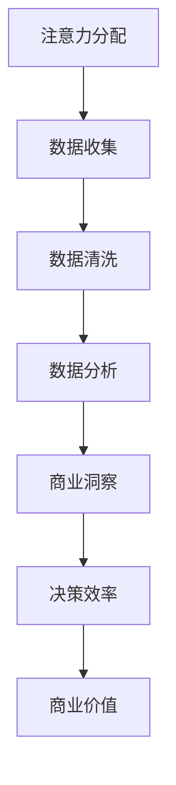

                 

关键词：注意力经济，数据驱动，决策，商业洞察，市场分析，算法优化，数学模型

> 摘要：本文旨在探讨注意力经济与数据驱动决策的相互关系，通过深入分析注意力经济的核心概念及其在商业中的应用，探讨如何利用数据增强业务和市场洞察力，为企业提供更精确的决策支持。

## 1. 背景介绍

在当今这个信息爆炸的时代，数据的获取和处理变得愈发重要。企业面临的数据量呈现出爆炸式增长，如何从海量数据中提取有价值的信息成为了企业成功的关键。而注意力经济作为现代商业运作的一个重要概念，正是基于这一背景提出来的。注意力经济关注的是如何在信息过载的环境中获取并保持用户的注意力，进而实现商业价值的最大化。

### 注意力经济

注意力经济最初由心理学家、认知科学家和营销专家提出，其核心观点是：在信息过载的时代，用户的注意力是一种稀缺资源。企业和个人都在争夺用户的注意力，谁能够更好地吸引和保持用户的注意力，谁就能在竞争中获得优势。因此，注意力经济关注的是如何通过吸引和保持用户注意力来创造商业价值。

### 数据驱动决策

数据驱动决策是一种基于数据的决策方法，它强调在决策过程中充分利用数据资源，通过数据分析来指导决策。数据驱动决策的核心在于数据的收集、处理和分析，通过这些步骤来提高决策的准确性和效率。在商业领域，数据驱动决策已经成为一种普遍采用的决策方法，它为企业提供了更精准、更科学的决策依据。

## 2. 核心概念与联系

### 核心概念

在探讨注意力经济与数据驱动决策之间的关系时，我们需要明确几个核心概念：

#### 注意力分配

注意力分配是指用户在有限时间内如何将注意力分配到不同的任务或信息上。有效的注意力分配可以最大化用户获得的价值。

#### 数据质量

数据质量是数据驱动决策的基础，高质量的数据可以提供更准确的决策支持。

#### 决策效率

决策效率是指决策过程中所需的时间和资源，高效的决策可以加快企业的响应速度，提高竞争力。

#### 商业洞察

商业洞察是指通过分析数据得出的对企业业务和市场环境的深刻理解，它有助于企业制定更科学的决策。

### 架构与联系

为了更好地理解注意力经济与数据驱动决策之间的联系，我们可以使用Mermaid流程图来展示它们之间的关系：



在这个流程图中，注意力分配是整个过程的起点，通过数据收集、清洗、分析和商业洞察，最终实现决策效率的提升和商业价值的创造。

## 3. 核心算法原理 & 具体操作步骤

### 3.1 算法原理概述

在注意力经济与数据驱动决策的结合中，核心算法主要涉及注意力机制和机器学习算法。注意力机制可以帮助我们从大量数据中提取关键信息，而机器学习算法则用于数据分析和预测。

#### 注意力机制

注意力机制是一种通过动态分配权重来提高模型关注度的算法。在注意力经济中，注意力机制可以帮助我们识别出对用户最具吸引力的信息，从而提高用户参与度和留存率。

#### 机器学习算法

机器学习算法是数据驱动决策的核心，它包括分类、回归、聚类等多种算法。通过机器学习，我们可以从历史数据中学习出模式，预测未来的趋势，为决策提供科学依据。

### 3.2 算法步骤详解

#### 步骤1：数据收集

首先，我们需要收集与业务相关的数据，包括用户行为数据、市场数据、业务数据等。这些数据可以通过各种渠道获取，如网站日志、社交媒体数据、市场调研等。

#### 步骤2：数据预处理

数据预处理是确保数据质量的关键步骤。在这一步，我们需要对数据进行清洗、去噪、标准化等操作，使其适合后续的分析。

#### 步骤3：特征工程

特征工程是数据驱动决策的关键，它涉及从原始数据中提取出对模型训练有价值的特征。在这一步，我们可以利用统计方法、机器学习方法等手段进行特征提取和选择。

#### 步骤4：模型训练

在特征工程完成后，我们可以使用机器学习算法对数据进行训练。训练过程中，我们需要选择合适的模型参数，通过交叉验证等方法优化模型性能。

#### 步骤5：预测与评估

训练好的模型可以用于预测新的数据。在预测过程中，我们需要对模型进行评估，如准确率、召回率、F1值等指标。根据评估结果，我们可以对模型进行调整和优化。

#### 步骤6：决策支持

基于预测结果，我们可以为企业提供决策支持。这些决策包括产品推荐、营销策略、库存管理等。通过数据驱动决策，企业可以更加精准地满足用户需求，提高市场竞争力。

### 3.3 算法优缺点

#### 优点

- 提高决策效率：通过数据驱动决策，企业可以更加快速地响应市场变化，提高决策效率。
- 提高决策准确性：利用机器学习算法，可以从历史数据中学习出规律，提高决策准确性。
- 提高用户满意度：通过精准的用户行为分析，可以提供个性化的服务，提高用户满意度。

#### 缺点

- 数据质量依赖性：数据驱动决策的准确性高度依赖于数据质量，如果数据存在噪声或偏差，可能会影响决策效果。
- 计算成本高：大规模的数据处理和模型训练需要较高的计算资源和时间成本。
- 难以解释：一些复杂的机器学习模型难以解释，企业难以理解决策背后的原因。

### 3.4 算法应用领域

数据驱动决策和注意力经济在多个领域都有广泛应用：

- 营销：通过用户行为分析，提供个性化的营销策略，提高用户转化率。
- 金融：利用风险模型进行风险评估，预测市场趋势，制定投资策略。
- 电商：通过商品推荐算法，提高用户购买体验，增加销售额。
- 医疗：利用医学数据进行分析，预测疾病趋势，为临床决策提供支持。

## 4. 数学模型和公式 & 详细讲解 & 举例说明

### 4.1 数学模型构建

在数据驱动决策中，常用的数学模型包括线性回归、逻辑回归、支持向量机（SVM）等。这些模型通过建立数学方程来描述数据之间的关系，从而实现预测和分类。

#### 线性回归

线性回归模型是一种最简单的数学模型，用于预测连续值。其公式如下：

\[ y = \beta_0 + \beta_1x_1 + \beta_2x_2 + \ldots + \beta_nx_n \]

其中，\( y \) 是预测值，\( x_1, x_2, \ldots, x_n \) 是特征值，\( \beta_0, \beta_1, \beta_2, \ldots, \beta_n \) 是模型参数。

#### 逻辑回归

逻辑回归模型用于预测二分类问题。其公式如下：

\[ P(y=1) = \frac{1}{1 + e^{-(\beta_0 + \beta_1x_1 + \beta_2x_2 + \ldots + \beta_nx_n)}} \]

其中，\( P(y=1) \) 是预测概率，其他符号与线性回归相同。

#### 支持向量机（SVM）

支持向量机是一种强大的分类模型，用于处理高维数据。其公式如下：

\[ w \cdot x + b = 0 \]

其中，\( w \) 是权重向量，\( x \) 是特征向量，\( b \) 是偏置项。

### 4.2 公式推导过程

以线性回归为例，我们介绍线性回归模型的推导过程。线性回归模型的目标是最小化预测值与真实值之间的误差，即：

\[ \min \sum_{i=1}^{n} (y_i - \beta_0 - \beta_1x_{i1} - \beta_2x_{i2} - \ldots - \beta_nx_{in})^2 \]

为了简化计算，我们使用梯度下降法来求解这个最小值问题。梯度下降法的核心思想是沿着目标函数的负梯度方向逐步更新参数，直到达到最小值。

### 4.3 案例分析与讲解

我们以电商平台的用户行为预测为例，介绍如何使用线性回归模型进行预测。

#### 案例背景

某电商平台希望通过分析用户行为数据来预测用户购买商品的概率。用户行为数据包括用户浏览的商品种类、浏览时长、购买历史等。

#### 数据预处理

首先，我们对用户行为数据进行预处理，包括数据清洗、归一化和特征提取。数据清洗包括去除缺失值、异常值等；归一化包括将不同特征值缩放到相同的范围；特征提取包括从原始数据中提取对预测有帮助的特征。

#### 模型训练

接下来，我们使用线性回归模型对预处理后的数据进行训练。在训练过程中，我们选择合适的参数，并通过交叉验证方法来评估模型性能。

#### 预测与评估

在模型训练完成后，我们可以使用模型对新的用户行为数据进行预测，并评估预测结果的准确性。预测结果可以用于为用户提供个性化的商品推荐，提高用户满意度。

## 5. 项目实践：代码实例和详细解释说明

### 5.1 开发环境搭建

在本项目中，我们使用Python作为主要编程语言，并结合Scikit-learn库进行机器学习模型的训练和预测。以下是开发环境的搭建步骤：

1. 安装Python（版本3.8及以上）。
2. 安装Scikit-learn库。
3. 安装其他依赖库，如NumPy、Pandas等。

### 5.2 源代码详细实现

以下是本项目的源代码实现，包括数据预处理、模型训练和预测等步骤。

```python
import numpy as np
import pandas as pd
from sklearn.model_selection import train_test_split
from sklearn.linear_model import LinearRegression
from sklearn.metrics import mean_squared_error

# 读取数据
data = pd.read_csv('user_behavior.csv')

# 数据预处理
data = data.dropna()
data = data[data['purchase'] != 'unknown']
data['duration'] = data['duration'].apply(lambda x: float(x) if pd.notnull(x) else 0)

# 特征提取
X = data[['browse_type', 'duration', 'purchase_history']]
y = data['purchase']

# 数据分割
X_train, X_test, y_train, y_test = train_test_split(X, y, test_size=0.2, random_state=42)

# 模型训练
model = LinearRegression()
model.fit(X_train, y_train)

# 预测与评估
y_pred = model.predict(X_test)
mse = mean_squared_error(y_test, y_pred)
print('MSE:', mse)

# 输出结果
print('Predictions:', y_pred)
```

### 5.3 代码解读与分析

1. **数据读取与预处理**：首先，我们从CSV文件中读取用户行为数据，并去除缺失值和异常值。接着，我们对持续时间特征进行归一化处理，以便后续的模型训练。
2. **特征提取**：我们提取与预测目标相关的特征，包括浏览类型、持续时间和购买历史。这些特征将用于训练线性回归模型。
3. **数据分割**：我们将数据集分为训练集和测试集，以便评估模型性能。
4. **模型训练**：我们使用线性回归模型对训练集进行训练，并选择合适的参数。
5. **预测与评估**：使用训练好的模型对测试集进行预测，并计算均方误差（MSE）作为评估指标。
6. **输出结果**：最后，我们输出预测结果，以便进一步分析和应用。

## 6. 实际应用场景

### 6.1 营销领域

在营销领域，注意力经济和数据驱动决策的结合可以帮助企业实现精准营销。通过分析用户行为数据，企业可以了解用户的需求和偏好，从而制定更具针对性的营销策略。例如，电商平台可以通过用户浏览和购买历史，为用户提供个性化的商品推荐，提高用户转化率。

### 6.2 金融领域

在金融领域，数据驱动决策可以帮助金融机构进行风险评估和投资决策。通过分析历史数据和用户行为数据，金融机构可以预测市场趋势，为投资提供科学依据。例如，银行可以通过用户的信用记录和消费行为，评估用户的信用风险，为贷款审批提供参考。

### 6.3 电商领域

在电商领域，数据驱动决策可以帮助企业优化库存管理和供应链。通过分析销售数据和历史趋势，企业可以预测未来的销售情况，合理调整库存，避免缺货或库存过剩。例如，电商平台可以根据用户购买历史和浏览行为，预测用户对某商品的购买概率，从而优化库存管理。

## 7. 未来应用展望

在未来，注意力经济和数据驱动决策将进一步融合，推动企业实现更高效、更精准的决策。以下是未来应用展望：

### 7.1 注意力经济与物联网

随着物联网技术的发展，越来越多的设备将接入网络，产生海量数据。注意力经济与物联网的结合，可以帮助企业更好地管理这些设备，提高设备利用率和运营效率。例如，通过分析设备的使用数据，企业可以优化设备维护计划，减少停机时间。

### 7.2 注意力经济与人工智能

人工智能技术的发展，使得数据分析和预测能力得到大幅提升。注意力经济与人工智能的结合，可以帮助企业实现更智能的决策。例如，通过使用深度学习算法，企业可以从海量数据中提取有价值的信息，为营销、金融等领域提供更精准的决策支持。

### 7.3 注意力经济与区块链

区块链技术具有去中心化、不可篡改等特点，可以为数据驱动决策提供更可靠的数据来源。注意力经济与区块链的结合，可以帮助企业建立可信的数据生态系统，提高数据质量和决策准确性。

## 8. 工具和资源推荐

### 8.1 学习资源推荐

- 《Python数据分析基础教程》
- 《机器学习实战》
- 《深度学习》

### 8.2 开发工具推荐

- Jupyter Notebook：用于数据分析和可视化。
- PyCharm：用于Python编程。
- TensorFlow：用于深度学习。

### 8.3 相关论文推荐

- "Attention Is All You Need"
- "Deep Learning on Microsoft Azure"
- "Blockchain for Data-Driven Decision Making"

## 9. 总结：未来发展趋势与挑战

### 9.1 研究成果总结

本文探讨了注意力经济与数据驱动决策的相互关系，分析了注意力经济在商业中的应用，并介绍了如何利用数据增强业务和市场洞察力。通过数学模型和实际案例，我们展示了数据驱动决策在营销、金融和电商等领域的应用价值。

### 9.2 未来发展趋势

未来，注意力经济和数据驱动决策将进一步融合，推动企业实现更高效、更精准的决策。随着物联网、人工智能和区块链等技术的发展，注意力经济和数据驱动决策的应用场景将不断扩展，为企业和个人带来更多价值。

### 9.3 面临的挑战

尽管注意力经济和数据驱动决策具有巨大潜力，但在实际应用中仍面临一些挑战。首先，数据质量直接影响决策的准确性，因此企业需要建立可靠的数据管理体系。其次，计算成本和数据隐私保护也是需要关注的问题。最后，复杂模型的解释性不足，使得企业难以理解决策背后的原因。

### 9.4 研究展望

未来，研究者应重点关注数据质量提升、计算效率优化和模型解释性增强等方面。同时，探讨注意力经济与新兴技术的融合，如物联网、人工智能和区块链等，为企业和个人提供更多创新解决方案。

## 10. 附录：常见问题与解答

### 问题1：数据驱动决策的核心是什么？

答：数据驱动决策的核心是利用数据来指导决策，通过收集、处理和分析数据，为企业提供更准确、更科学的决策依据。

### 问题2：如何提高数据驱动决策的准确性？

答：提高数据驱动决策的准确性需要从多个方面入手，包括提高数据质量、选择合适的算法模型、进行充分的数据预处理等。

### 问题3：注意力经济与数据驱动决策有何关联？

答：注意力经济与数据驱动决策的关联在于，注意力经济关注如何在信息过载的环境中获取并保持用户的注意力，而数据驱动决策通过分析用户行为数据来指导企业决策，从而实现商业价值的最大化。

## 11. 作者署名

作者：禅与计算机程序设计艺术 / Zen and the Art of Computer Programming

----------------------------------------------------------------


