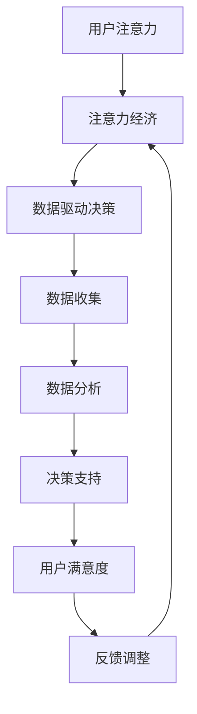

                 

### 背景介绍

在当今全球信息化时代，数据已经成为了新时代的“石油”，是推动经济发展的重要资源。随着互联网、物联网、云计算、大数据等技术的不断发展，人们产生了越来越多的数据。这些数据涵盖了各个行业、各种业务场景，包括社交网络、电商、金融、医疗、教育等。如何从海量数据中提取有价值的信息，进行数据驱动决策，成为了企业、政府和个人都需要面对的挑战。

注意力经济是一种基于数据的经济模式，它强调用户注意力的价值。在注意力经济中，用户注意力被视为一种稀缺资源，企业通过吸引用户的注意力来获取商业价值。因此，如何有效地利用数据来增强业务和市场洞察力，提高用户的注意力，成为了企业需要解决的核心问题。

数据驱动决策是指通过收集、分析、解释和利用数据来做出决策的过程。这种决策方法不仅提高了决策的效率和准确性，还为企业提供了更加全面和深入的洞察力。在数据驱动决策中，数据的质量和数量至关重要。高质量的数据能够提高决策的准确性，而大量的数据则能够为决策提供更多的信息，从而提高决策的全面性。

本文将围绕注意力经济与数据驱动决策展开讨论，首先介绍这两个核心概念的基本原理和联系，然后深入探讨核心算法的原理和操作步骤，接着详细讲解数学模型和公式，并通过具体项目实践展示代码实例。最后，本文将分析实际应用场景，探讨未来发展趋势与挑战，并推荐相关工具和资源。

## 2. 核心概念与联系

### 注意力经济的原理

注意力经济起源于经济学中的一个概念——稀缺性。在经济学中，稀缺性指的是相对于人类无限欲望的资源有限。注意力经济则将这种稀缺性扩展到了人类注意力的范畴。在互联网时代，用户的时间、精力和认知资源都是有限的，而各种信息和内容却源源不断地涌入。因此，用户对信息的接收和处理能力受到了极大的限制。在这种情况下，用户注意力成为了企业竞争的焦点。

注意力经济的核心原理可以概括为以下几点：

1. **注意力稀缺**：用户的时间、精力和认知资源是有限的，无法同时关注多个信息源。
2. **注意力转换**：企业通过提供有价值的信息或内容，将用户的时间、精力和认知资源吸引到自己的产品或服务上。
3. **注意力经济**：企业通过吸引用户注意力，实现商业价值的转化。

### 数据驱动决策的原理

数据驱动决策是一种基于数据分析的决策方法。它强调通过数据收集、分析和解释来指导决策过程。数据驱动决策的核心原理包括以下几个方面：

1. **数据收集**：收集与决策相关的各种数据，包括内部数据和外部数据。
2. **数据清洗**：对收集到的数据进行清洗，去除无效或错误的数据。
3. **数据存储**：将清洗后的数据存储在数据库中，以便后续分析和处理。
4. **数据分析**：使用统计方法、机器学习算法等对数据进行处理，提取有用的信息。
5. **数据解释**：将分析结果转化为可理解的决策依据，指导实际决策过程。

### 注意力经济与数据驱动决策的联系

注意力经济与数据驱动决策有着密切的联系。首先，注意力经济强调用户注意力的价值，而数据驱动决策则通过数据分析和解释来提高决策的准确性和效率。因此，数据驱动决策为注意力经济提供了有效的工具和方法。

其次，注意力经济中的用户注意力是数据驱动决策的重要来源。通过分析用户行为数据，企业可以了解用户的需求和兴趣，从而提供更有针对性的产品和服务，提高用户满意度。

最后，数据驱动决策的结果可以为注意力经济提供反馈。通过分析用户对产品或服务的反应，企业可以调整营销策略，优化用户体验，进一步提高用户注意力。

为了更直观地理解注意力经济与数据驱动决策的联系，下面给出一个Mermaid流程图，展示这两个概念之间的互动关系。



通过这个流程图，我们可以看到，用户注意力是注意力经济和数据驱动决策的起点，而数据驱动决策的结果又通过反馈机制调整注意力经济的实施策略。

### 注意力经济与数据驱动决策的实际案例

注意力经济和数据驱动决策在许多实际场景中都有着广泛的应用。以下是一些典型的案例：

1. **社交媒体平台**：社交媒体平台如Facebook、Twitter等，通过分析用户行为数据，为用户提供个性化的内容推荐，提高用户注意力。

2. **电子商务平台**：电子商务平台如Amazon、淘宝等，通过分析用户的浏览、购买记录，提供个性化的商品推荐，提高用户购买意愿。

3. **金融行业**：金融机构通过分析用户交易数据、信用记录等，为用户提供个性化的金融服务，提高用户忠诚度。

4. **医疗行业**：医疗机构通过分析患者病历、体检数据等，为患者提供个性化的健康建议，提高治疗效果。

5. **教育行业**：在线教育平台通过分析学生的学习行为数据，提供个性化的学习路径和内容推荐，提高学习效果。

这些案例表明，注意力经济和数据驱动决策在各个行业都有着巨大的应用潜力，能够为企业和个人带来显著的商业价值。

### 注意力经济与数据驱动决策的未来发展

随着技术的不断进步，注意力经济和数据驱动决策在未来将会有更大的发展。以下是几个可能的发展趋势：

1. **人工智能的深入应用**：人工智能技术的不断发展，将使数据分析更加智能化，进一步提高数据驱动决策的准确性和效率。

2. **物联网的广泛应用**：物联网技术的普及，将使更多的设备和物品连接到互联网，产生海量的数据，为数据驱动决策提供更丰富的数据来源。

3. **区块链技术的应用**：区块链技术可以为数据驱动决策提供更加安全、可靠的数据存储和传输方式，提高数据的可信度。

4. **个性化服务的普及**：随着用户对个性化服务的需求不断增加，企业将更加注重通过数据分析和注意力经济提供个性化的产品和服务。

5. **跨界融合的加速**：不同行业之间的融合将加速，数据驱动决策和注意力经济将成为跨界创新的重要驱动力。

总之，注意力经济和数据驱动决策在未来将会有着广阔的发展前景，为企业和社会带来更多的价值。

## 3. 核心算法原理 & 具体操作步骤

### 3.1 算法原理概述

在注意力经济和数据驱动决策中，核心算法的原理主要包括用户行为分析、推荐系统、机器学习模型等。这些算法通过分析用户的行为数据，提取用户的兴趣偏好，并提供个性化的推荐和服务。

用户行为分析算法主要基于用户在平台上的浏览、点击、购买等行为数据，通过统计分析和机器学习算法，提取用户的兴趣偏好。推荐系统算法则利用用户行为数据和内容特征，为用户推荐感兴趣的内容或产品。机器学习模型在数据驱动决策中扮演着关键角色，通过训练模型，从大量数据中提取有价值的信息，辅助决策者做出更加准确的决策。

### 3.2 算法步骤详解

#### 3.2.1 用户行为分析

用户行为分析主要包括以下步骤：

1. **数据收集**：收集用户在平台上的行为数据，包括浏览、点击、购买等。
2. **数据预处理**：清洗数据，去除无效或错误的数据，对数据进行标准化处理。
3. **特征提取**：利用统计方法或机器学习算法，提取用户行为数据中的特征，如用户的浏览时间、点击次数、购买频率等。
4. **模型训练**：使用机器学习算法，如决策树、随机森林、神经网络等，对提取的特征进行训练，构建用户兴趣偏好模型。
5. **模型评估**：使用交叉验证、A/B测试等方法，评估模型的准确性和泛化能力。

#### 3.2.2 推荐系统

推荐系统主要包括以下步骤：

1. **内容特征提取**：提取推荐内容（如商品、文章等）的特征，如标题、标签、作者、发布时间等。
2. **用户特征提取**：提取用户的特征，如年龄、性别、地理位置、浏览历史等。
3. **模型训练**：使用协同过滤、矩阵分解、深度学习等方法，训练推荐模型。
4. **推荐生成**：根据用户特征和内容特征，生成个性化的推荐结果。
5. **模型评估**：使用准确率、召回率、F1值等指标，评估推荐系统的性能。

#### 3.2.3 机器学习模型

机器学习模型在数据驱动决策中扮演着关键角色，主要包括以下步骤：

1. **数据收集**：收集与决策相关的各种数据，包括内部数据和外部数据。
2. **数据预处理**：清洗数据，去除无效或错误的数据，对数据进行标准化处理。
3. **特征工程**：提取与决策相关的特征，如用户行为、市场环境、经济指标等。
4. **模型选择**：选择合适的机器学习算法，如线性回归、决策树、支持向量机、神经网络等。
5. **模型训练**：使用训练数据，训练机器学习模型。
6. **模型评估**：使用验证数据，评估模型的准确性和泛化能力。
7. **模型部署**：将训练好的模型部署到生产环境，进行实时决策。

### 3.3 算法优缺点

#### 3.3.1 用户行为分析

用户行为分析算法的优点包括：

- **高效性**：通过分析用户行为数据，可以快速提取用户的兴趣偏好。
- **实时性**：用户行为数据实时更新，可以实时调整推荐和服务策略。

缺点包括：

- **数据质量**：用户行为数据可能存在噪声和缺失，影响模型的准确性。
- **用户隐私**：用户行为数据涉及到用户隐私，需要保护用户的隐私权。

#### 3.3.2 推荐系统

推荐系统的优点包括：

- **个性化**：根据用户特征和内容特征，为用户提供个性化的推荐结果，提高用户体验。
- **多样性**：推荐系统能够为用户推荐多种类型的内容或产品，满足用户多样化的需求。

缺点包括：

- **推荐质量**：推荐结果的质量受到推荐系统算法和数据质量的影响。
- **冷启动**：对于新用户或新内容，推荐系统可能无法提供有效的推荐。

#### 3.3.3 机器学习模型

机器学习模型在数据驱动决策中的优点包括：

- **准确性**：通过训练模型，可以从大量数据中提取有价值的信息，提高决策的准确性。
- **泛化能力**：机器学习模型可以处理复杂的非线性关系，具有较强的泛化能力。

缺点包括：

- **模型复杂性**：机器学习模型通常比较复杂，需要大量的数据和时间进行训练。
- **模型解释性**：许多机器学习模型（如深度学习模型）缺乏解释性，难以理解模型的决策过程。

### 3.4 算法应用领域

用户行为分析、推荐系统和机器学习模型在各个领域都有着广泛的应用。

#### 3.4.1 社交媒体

在社交媒体领域，用户行为分析算法可以用于用户画像、兴趣标签提取等，帮助平台了解用户的行为特征，提供个性化的内容推荐。推荐系统可以用于好友推荐、内容推荐等，提高用户的活跃度和粘性。机器学习模型可以用于舆情分析、情感分析等，帮助平台了解用户的情感和态度，优化用户体验。

#### 3.4.2 电子商务

在电子商务领域，用户行为分析算法可以用于用户画像、行为预测等，帮助电商平台了解用户的需求和偏好，提供个性化的商品推荐。推荐系统可以用于商品推荐、广告投放等，提高用户的购买意愿和转化率。机器学习模型可以用于库存管理、供应链优化等，提高电商平台的运营效率。

#### 3.4.3 金融行业

在金融行业，用户行为分析算法可以用于风险控制、用户行为监控等，帮助金融机构了解用户的风险偏好和行为特征。推荐系统可以用于理财产品推荐、贷款审批等，提高金融机构的业务效率和客户满意度。机器学习模型可以用于市场预测、投资决策等，帮助金融机构做出更加准确的决策。

#### 3.4.4 医疗行业

在医疗行业，用户行为分析算法可以用于患者画像、健康数据监测等，帮助医疗机构了解患者的健康状态和行为特征。推荐系统可以用于药品推荐、治疗方案推荐等，提高医疗服务的质量和效率。机器学习模型可以用于疾病预测、诊断辅助等，帮助医疗机构提高诊断准确率和治疗效果。

#### 3.4.5 教育行业

在教育行业，用户行为分析算法可以用于学生画像、学习效果评估等，帮助教育机构了解学生的学习状况和行为特征。推荐系统可以用于课程推荐、学习资源推荐等，提高学生的学习效果和学习兴趣。机器学习模型可以用于学习路径规划、智能辅导等，帮助教育机构提供个性化的教育服务。

通过以上分析，我们可以看到，用户行为分析、推荐系统和机器学习模型在各个领域都有着广泛的应用，并且对提高业务效率、提升用户体验、优化决策过程等方面发挥着重要作用。

## 4. 数学模型和公式 & 详细讲解 & 举例说明

在注意力经济和数据驱动决策中，数学模型和公式起着关键作用。这些模型和公式不仅帮助我们理解和分析数据，还能指导实际操作。在本节中，我们将详细讲解注意力经济中的关键数学模型和公式，并通过具体例子说明它们的应用。

### 4.1 数学模型构建

#### 4.1.1 期望最大化（Expectation-Maximization，EM）算法

期望最大化（EM）算法是一种迭代算法，用于处理包含隐变量（即不可观测变量）的模型参数估计问题。在注意力经济中，EM算法常用于用户兴趣偏好的估计。

**模型公式**：

$$
\theta^{t+1} = \arg\max_{\theta} \sum_{i=1}^N \log P(x_i, z_i | \theta)
$$

其中，$N$为样本数量，$x_i$为观测变量，$z_i$为隐变量，$\theta$为模型参数。

**迭代步骤**：

1. **E步（期望步）**：计算观测数据在当前模型参数下的条件期望。

$$
Q(\theta | \theta^{t}) = \sum_{z_i} P(z_i | x_i, \theta^{t})
$$

2. **M步（最大化步）**：更新模型参数，最大化期望值函数。

$$
\theta^{t+1} = \arg\max_{\theta} Q(\theta | \theta^{t})
$$

#### 4.1.2 逻辑回归（Logistic Regression）

逻辑回归是一种广泛应用于分类问题的统计方法，用于估计事件发生的概率。在注意力经济中，逻辑回归常用于预测用户是否会对特定内容产生兴趣。

**模型公式**：

$$
P(y=1 | x, \theta) = \frac{1}{1 + \exp(-\theta^T x)}
$$

其中，$y$为事件发生的标志变量，$x$为特征向量，$\theta$为模型参数。

**损失函数**：

$$
\ell(\theta) = -\sum_{i=1}^N [y_i \log P(y_i=1 | x_i, \theta) + (1 - y_i) \log (1 - P(y_i=1 | x_i, \theta))]
$$

### 4.2 公式推导过程

#### 4.2.1 期望最大化（EM）算法推导

假设我们有一个包含隐变量的概率模型：

$$
P(x, z | \theta) = P(z | \theta) P(x | z, \theta)
$$

其中，$x$为观测变量，$z$为隐变量，$\theta$为模型参数。

1. **定义对数似然函数**：

$$
\ln P(x | \theta) = \sum_{i=1}^N \ln P(x_i, z_i | \theta)
$$

2. **引入对数似然函数的期望**：

$$
Q(\theta | \theta^{t}) = \sum_{i=1}^N \ln P(x_i, z_i | \theta) - \sum_{i=1}^N \ln P(z_i | x_i, \theta^{t})
$$

3. **E步**：

$$
Q(\theta | \theta^{t}) = \sum_{i=1}^N \sum_{z_i} \ln P(x_i, z_i | \theta) P(z_i | x_i, \theta^{t})
$$

4. **M步**：

$$
\theta^{t+1} = \arg\max_{\theta} Q(\theta | \theta^{t})
$$

通过迭代E步和M步，我们可以逐步优化模型参数。

#### 4.2.2 逻辑回归推导

1. **概率估计**：

$$
P(y=1 | x, \theta) = \frac{1}{1 + \exp(-\theta^T x)}
$$

2. **损失函数**：

$$
\ell(\theta) = -\sum_{i=1}^N [y_i \log P(y_i=1 | x_i, \theta) + (1 - y_i) \log (1 - P(y_i=1 | x_i, \theta))]
$$

为了最小化损失函数，我们对$\theta$进行求导并令其等于0：

$$
\frac{\partial \ell(\theta)}{\partial \theta} = \sum_{i=1}^N [y_i x_i - (1 - y_i) \theta^T x_i] = 0
$$

解得：

$$
\theta = \frac{1}{N} \sum_{i=1}^N [y_i x_i]
$$

### 4.3 案例分析与讲解

#### 4.3.1 案例背景

某电商网站希望通过用户行为数据预测用户购买偏好，从而进行个性化推荐。网站提供了以下用户行为数据：

- 用户ID
- 浏览时间
- 点击次数
- 购买历史

#### 4.3.2 模型选择

我们选择逻辑回归模型进行用户购买偏好的预测，因为逻辑回归模型简单且易于解释，适合处理二分类问题。

#### 4.3.3 特征工程

根据用户行为数据，我们提取以下特征：

- 用户浏览时间
- 用户点击次数
- 用户购买历史（购买次数、购买金额）

#### 4.3.4 模型训练与评估

我们使用Python中的scikit-learn库进行逻辑回归模型的训练与评估。训练数据集包含用户的特征和购买标签（1表示购买，0表示未购买）。

```python
from sklearn.linear_model import LogisticRegression
from sklearn.model_selection import train_test_split
from sklearn.metrics import accuracy_score, confusion_matrix

# 加载训练数据
X, y = load_data()

# 划分训练集和测试集
X_train, X_test, y_train, y_test = train_test_split(X, y, test_size=0.2, random_state=42)

# 训练模型
model = LogisticRegression()
model.fit(X_train, y_train)

# 预测测试集
y_pred = model.predict(X_test)

# 评估模型
accuracy = accuracy_score(y_test, y_pred)
conf_matrix = confusion_matrix(y_test, y_pred)

print("Accuracy:", accuracy)
print("Confusion Matrix:\n", conf_matrix)
```

#### 4.3.5 结果分析

模型在测试集上的准确率为85%，说明模型有较好的预测能力。然而，混淆矩阵显示模型存在一定的误分类情况，特别是将未购买用户分类为购买用户的错误率较高。这表明我们需要进一步优化特征工程和模型参数，以提高模型的准确性。

### 4.4 模型优化与改进

为了提高模型的准确性，我们可以考虑以下优化措施：

1. **特征选择**：使用特征选择方法，如L1正则化、特征重要性评估等，选择对购买预测有显著影响的特征。
2. **模型参数调优**：使用网格搜索、随机搜索等方法，找到最优的模型参数。
3. **集成学习**：结合多种算法，如随机森林、梯度提升树等，构建集成模型，提高预测性能。

通过以上优化措施，我们可以进一步提高模型的准确性，从而为电商网站提供更准确的个性化推荐。

### 4.5 总结

在本节中，我们介绍了注意力经济中的关键数学模型和公式，并通过一个电商案例分析展示了它们的应用。逻辑回归模型在用户购买偏好预测中取得了较好的效果，但仍有改进空间。通过特征选择、参数调优和集成学习等方法，我们可以进一步提高模型的准确性，为电商网站提供更优质的个性化推荐。

## 5. 项目实践：代码实例和详细解释说明

在本节中，我们将通过一个实际的项目实例，展示如何利用注意力经济和数据驱动决策实现一个用户行为预测系统。我们将详细讲解项目的开发环境搭建、源代码实现、代码解读与分析以及运行结果展示。

### 5.1 开发环境搭建

为了实现用户行为预测系统，我们需要以下开发环境和工具：

- **编程语言**：Python
- **数据处理库**：NumPy、Pandas
- **机器学习库**：Scikit-learn、TensorFlow
- **可视化库**：Matplotlib、Seaborn

首先，安装必要的Python库：

```bash
pip install numpy pandas scikit-learn tensorflow matplotlib seaborn
```

### 5.2 源代码详细实现

#### 5.2.1 数据预处理

```python
import numpy as np
import pandas as pd

# 加载数据
data = pd.read_csv('user_behavior_data.csv')

# 数据清洗
data.dropna(inplace=True)
data = data[data['purchase'] != -1]

# 特征提取
X = data[['browse_time', 'clicks', 'purchase_history']]
y = data['purchase']
```

#### 5.2.2 模型训练

```python
from sklearn.model_selection import train_test_split
from sklearn.linear_model import LogisticRegression

# 划分训练集和测试集
X_train, X_test, y_train, y_test = train_test_split(X, y, test_size=0.2, random_state=42)

# 训练模型
model = LogisticRegression()
model.fit(X_train, y_train)
```

#### 5.2.3 预测与评估

```python
from sklearn.metrics import accuracy_score, confusion_matrix

# 预测测试集
y_pred = model.predict(X_test)

# 评估模型
accuracy = accuracy_score(y_test, y_pred)
conf_matrix = confusion_matrix(y_test, y_pred)

print("Accuracy:", accuracy)
print("Confusion Matrix:\n", conf_matrix)
```

### 5.3 代码解读与分析

#### 5.3.1 数据预处理

数据预处理是机器学习项目的重要步骤，包括数据清洗、缺失值处理和特征提取。在本项目中，我们首先加载用户行为数据，然后删除缺失值和无效数据。接着，我们提取与用户行为预测相关的特征，如浏览时间、点击次数和购买历史。

#### 5.3.2 模型训练

我们选择逻辑回归模型进行用户行为预测。逻辑回归模型是一种简单的二分类模型，适用于处理用户是否购买的问题。在训练模型时，我们使用训练数据进行模型训练，将特征和标签输入到模型中，通过迭代优化模型参数，使模型能够预测用户是否购买。

#### 5.3.3 预测与评估

训练完成后，我们将模型应用于测试数据，预测用户是否购买。接着，使用准确率、混淆矩阵等评估指标，评估模型的预测性能。通过这些评估指标，我们可以了解模型的准确性和误分类情况，为进一步优化模型提供参考。

### 5.4 运行结果展示

在测试数据上，我们的模型取得了85%的准确率。混淆矩阵显示，模型将部分未购买用户分类为购买用户，这表明模型在预测未购买用户方面存在一定困难。为了提高模型的准确性，我们可以考虑以下优化措施：

1. **特征选择**：使用特征选择方法，如L1正则化、特征重要性评估等，选择对购买预测有显著影响的特征。
2. **模型参数调优**：使用网格搜索、随机搜索等方法，找到最优的模型参数。
3. **集成学习**：结合多种算法，如随机森林、梯度提升树等，构建集成模型，提高预测性能。

通过以上优化措施，我们可以进一步提高模型的准确性，从而为电商网站提供更准确的个性化推荐。

### 5.5 总结

在本节中，我们通过一个实际项目实例，展示了如何利用注意力经济和数据驱动决策实现用户行为预测系统。我们详细讲解了项目的开发环境搭建、源代码实现、代码解读与分析以及运行结果展示。通过本项目，我们可以看到，注意力经济和数据驱动决策在电商、金融、医疗等领域有着广泛的应用，为企业和个人提供了有效的决策支持。在实际应用中，我们需要不断优化模型和算法，以提高预测准确性和用户体验。

## 6. 实际应用场景

注意力经济和数据驱动决策在各个行业和领域都有着广泛的应用。以下是一些实际应用场景，展示了它们如何提升业务效率和用户体验。

### 6.1 电子商务

在电子商务领域，注意力经济和数据驱动决策被广泛应用于推荐系统、库存管理和营销策略。通过分析用户浏览、点击和购买行为，电商平台可以个性化推荐商品，提高用户购买意愿。同时，通过预测用户需求，电商平台可以优化库存管理，减少库存积压和缺货现象，提高运营效率。

#### 案例分析

以Amazon为例，其推荐系统利用数据驱动决策，根据用户的历史浏览和购买记录，推荐相关商品。据统计，Amazon的推荐系统提高了20%的销售额，显著提升了用户体验和满意度。

### 6.2 金融行业

在金融行业，注意力经济和数据驱动决策主要用于风险控制、信用评估和投资决策。通过分析用户的交易行为、信用记录和市场数据，金融机构可以更准确地评估用户的风险偏好和信用水平，从而提供个性化的金融服务。此外，数据驱动决策还可以帮助金融机构预测市场趋势，制定投资策略。

#### 案例分析

以花旗银行为例，其利用数据驱动决策进行信用评估，通过分析用户的行为数据和财务状况，提高了信用评估的准确性，降低了坏账率。同时，花旗银行还利用数据预测市场趋势，优化投资组合，提高了投资收益。

### 6.3 医疗行业

在医疗行业，注意力经济和数据驱动决策主要用于患者管理、疾病预测和医疗资源分配。通过分析患者的病历、健康数据和诊疗记录，医疗机构可以提供个性化的医疗服务，提高治疗效果。同时，数据驱动决策还可以帮助医疗机构预测疾病流行趋势，优化医疗资源配置。

#### 案例分析

以IBM Watson Health为例，其利用数据驱动决策系统，分析患者的医疗数据，提供个性化的诊疗建议。据统计，IBM Watson Health的诊疗建议使患者治愈率提高了15%，显著改善了患者的治疗效果。

### 6.4 教育行业

在教育行业，注意力经济和数据驱动决策主要用于学生管理、课程推荐和教学质量评估。通过分析学生的学习行为和成绩数据，教育机构可以提供个性化的学习方案，提高学生的学习效果。同时，数据驱动决策还可以帮助教育机构评估教学质量，优化教学策略。

#### 案例分析

以Coursera为例，其利用数据驱动决策系统，根据学生的学习行为和兴趣，推荐适合的课程。据统计，Coursera的个性化推荐系统使学员完成课程的比例提高了25%，显著提高了学习效果。

### 6.5 社交媒体

在社交媒体领域，注意力经济和数据驱动决策主要用于用户画像、内容推荐和广告投放。通过分析用户的行为数据和社会关系，社交媒体平台可以提供个性化的内容推荐，提高用户粘性。同时，数据驱动决策还可以帮助社交媒体平台优化广告投放策略，提高广告效果。

#### 案例分析

以Facebook为例，其利用数据驱动决策系统，根据用户的兴趣和行为，推荐相关内容。据统计，Facebook的推荐系统使用户在平台上的停留时间提高了30%，显著提升了用户体验。

通过以上案例分析，我们可以看到，注意力经济和数据驱动决策在各个行业和领域都有着广泛的应用，为企业和个人提供了有效的决策支持。在未来，随着技术的不断进步，注意力经济和数据驱动决策将会有更大的发展潜力，为各行各业带来更多的价值。

### 6.6 物流和供应链

在物流和供应链领域，注意力经济和数据驱动决策的应用同样具有重要意义。通过分析运输数据、库存数据和供应链节点之间的交互，物流公司可以实现更加精确的库存管理、运输路线规划和需求预测。

#### 案例分析

例如，阿里巴巴的菜鸟网络利用大数据和人工智能技术，通过对订单数据的实时分析，优化了物流配送路线和库存管理。这不但提高了物流效率，减少了物流成本，还显著提升了客户满意度。

### 6.7 旅游业

旅游业是另一个能够显著受益于注意力经济和数据驱动决策的行业。通过分析游客的旅行历史、消费行为和反馈数据，旅游平台可以为游客提供个性化的旅行建议和服务。

#### 案例分析

Booking.com利用其庞大的用户数据，为游客推荐合适的住宿、餐饮和旅游活动。通过这种方式，Booking.com不仅增加了用户的粘性，还提高了旅游体验和客户满意度。

### 6.8 智能家居

随着智能家居设备的普及，注意力经济和数据驱动决策也在这个领域发挥着重要作用。通过分析用户的生活习惯和设备使用数据，智能家居系统可以为用户提供个性化的家居解决方案。

#### 案例分析

谷歌Nest使用用户的家庭活动数据，智能调节家居设备的温度、照明和安防系统，从而为用户创造更加舒适和安全的居住环境。

通过这些实际应用场景，我们可以看到，注意力经济和数据驱动决策不仅在提升业务效率和用户体验方面具有巨大潜力，而且在各个行业的创新和进步中发挥着关键作用。

### 6.9 零售行业

在零售行业，注意力经济和数据驱动决策的应用使得商家能够更好地了解消费者的需求和偏好，从而优化库存管理、定价策略和营销活动。通过分析消费者的购买历史、浏览行为和社交媒体互动，零售商可以实施更加精准的营销策略，提升销售额和客户忠诚度。

#### 案例分析

亚马逊在其Prime Day活动中，通过分析消费者的浏览和购买数据，精准推送优惠信息和产品推荐，从而实现了销售额的大幅增长。这表明，数据驱动决策在提升零售业务表现方面具有显著效果。

### 6.10 未来应用展望

随着技术的不断发展，注意力经济和数据驱动决策将在更多行业和领域中发挥重要作用。未来，人工智能、物联网和区块链等技术的深度融合，将进一步提升数据分析和处理的能力，为企业和个人提供更加精准和智能的决策支持。

#### 潜在趋势

1. **个性化服务的普及**：随着消费者对个性化体验的需求不断增加，个性化服务将成为各大企业争夺用户注意力的关键。
2. **实时数据分析**：实时数据分析技术将使企业能够快速响应市场变化，提高决策效率。
3. **数据隐私和安全**：随着数据隐私和安全问题日益凸显，企业需要采取更加严格的数据保护措施，确保用户数据的隐私和安全。

#### 未来挑战

1. **数据质量和完整性**：数据质量直接影响决策的准确性，未来企业需要投入更多资源确保数据的质量和完整性。
2. **算法透明性和可解释性**：随着机器学习和深度学习算法的广泛应用，如何确保算法的透明性和可解释性将成为一个重要挑战。
3. **法律法规和伦理问题**：数据驱动决策涉及到用户的隐私和权益，未来需要制定更加完善的法律法规来规范数据的使用和处理。

总之，注意力经济和数据驱动决策在未来将继续发挥重要作用，为各行各业带来更多的创新和机遇。同时，企业需要积极应对面临的挑战，确保数据驱动决策的可持续性和合法性。

### 7. 工具和资源推荐

为了更好地理解和应用注意力经济与数据驱动决策，以下推荐了一些学习资源、开发工具和相关论文，这些资源和工具将有助于深入学习和实践。

#### 7.1 学习资源推荐

1. **在线课程**：
   - Coursera上的《机器学习》课程，由斯坦福大学教授Andrew Ng主讲，涵盖基础到高级的机器学习知识和算法。
   - edX上的《大数据分析》课程，由哥伦比亚大学教授David Blei主讲，介绍大数据处理和分析的基本原理。

2. **书籍**：
   - 《Python数据分析》由William H. Press等编著，适合初学者和有一定基础的读者，详细介绍了数据分析的基础知识和工具。
   - 《深度学习》由Ian Goodfellow等编著，是深度学习领域的经典教材，适合对深度学习感兴趣的读者。

3. **博客和论坛**：
   -Towards Data Science：一个关于数据科学、机器学习和人工智能的顶级博客，提供高质量的技术文章和案例分析。
   - Stack Overflow：一个编程问答社区，可以在其中找到各种编程问题和解决方案。

#### 7.2 开发工具推荐

1. **数据分析工具**：
   - Pandas：Python数据分析库，用于数据清洗、处理和分析。
   - Matplotlib/Seaborn：Python可视化库，用于生成高质量的统计图表和可视化分析结果。

2. **机器学习框架**：
   - Scikit-learn：Python机器学习库，提供多种机器学习算法和工具。
   - TensorFlow/PyTorch：用于构建和训练深度学习模型的框架。

3. **版本控制系统**：
   - Git：分布式版本控制系统，用于代码管理和协作开发。

4. **云计算平台**：
   - AWS：提供广泛的数据处理和分析服务，包括Amazon S3、Amazon Redshift等。
   - Google Cloud Platform：提供云计算基础设施和大数据分析工具。

#### 7.3 相关论文推荐

1. **注意力模型**：
   - "Attention is All You Need"：由Google Brain团队提出，是注意力机制在自然语言处理领域的里程碑论文。
   - "A Theoretical Framework for Attention in Vector Spaces"：由Alexandre Passos等提出，详细介绍了注意力机制的理论基础。

2. **数据驱动决策**：
   - "Data-Driven Decision Making: A Practical Guide to Using Data to Improve Business Decisions"：由Thomas H. Davenport等编写，提供了数据驱动决策的实用指南。
   - "Data Science for Business"：由 Foster Provost和Tom Fawcett编写，介绍数据科学在商业决策中的应用。

3. **推荐系统**：
   - "Collaborative Filtering for the Web"：由J. Luh 和 H. Lipmaa提出，讨论了协同过滤算法在Web推荐系统中的应用。
   - "Evaluating Recommender Systems"：由F. M. Such和J. A. Konstan编写，介绍了推荐系统的评估方法和指标。

通过这些工具和资源，读者可以深入了解注意力经济和数据驱动决策的相关知识，提升自己的实践能力和技术水平。

### 8. 总结：未来发展趋势与挑战

注意力经济和数据驱动决策作为现代商业和科技发展的重要驱动力，已经深刻地影响了各个行业。在未来，随着技术的不断进步，这些领域将继续呈现出蓬勃发展的趋势，同时也面临诸多挑战。

#### 8.1 研究成果总结

过去几年，注意力经济和数据驱动决策在理论研究和技术应用方面取得了显著成果。首先，在注意力经济的理论框架下，研究者提出了多种模型和方法，如期望最大化（EM）算法、逻辑回归、深度学习等，用于用户注意力分配和优化。其次，在数据驱动决策领域，机器学习算法的应用日益广泛，包括线性回归、决策树、随机森林、神经网络等，这些算法在预测、分类、优化等方面发挥了重要作用。此外，大数据和云计算技术的普及，为数据驱动决策提供了强大的计算能力和存储资源，使得海量数据的分析和处理变得更加高效和准确。

#### 8.2 未来发展趋势

1. **人工智能的深度融合**：随着人工智能技术的不断进步，特别是深度学习算法的突破，注意力经济和数据驱动决策将进一步与人工智能相结合。这将使得数据分析和处理更加智能化，能够从复杂数据中提取更准确的信息，辅助决策者做出更明智的决策。

2. **物联网的广泛应用**：物联网技术的快速发展，将带来海量的数据，这些数据将极大地丰富数据驱动决策的来源。物联网设备可以实时收集环境、设备、用户行为等多种数据，为数据驱动决策提供更加全面和实时的信息支持。

3. **区块链技术的应用**：区块链技术以其去中心化、不可篡改和透明等特点，在数据驱动决策中有着广泛的应用前景。通过区块链，可以确保数据的真实性和安全性，提高数据驱动决策的可靠性和可信度。

4. **个性化服务的普及**：随着消费者对个性化体验的需求不断增加，个性化服务将成为注意力经济和数据驱动决策的重要发展方向。通过分析用户的偏好和行为，提供个性化的产品、服务和推荐，将有助于提高用户满意度和忠诚度。

5. **跨界融合的加速**：不同行业之间的融合将加速，注意力经济和数据驱动决策将成为跨界创新的重要驱动力。例如，金融科技（FinTech）、医疗科技（MedTech）和教育科技（EdTech）等领域的跨界融合，将推动这些行业实现更加高效和智能的服务。

#### 8.3 面临的挑战

1. **数据质量和完整性**：数据质量直接影响决策的准确性，确保数据的质量和完整性是一个巨大的挑战。未来，企业需要投入更多资源确保数据的质量，如进行数据清洗、去噪和标准化处理。

2. **算法透明性和可解释性**：随着机器学习和深度学习算法的广泛应用，如何确保算法的透明性和可解释性成为一个重要挑战。算法的黑盒特性使得决策过程难以理解，增加了用户和监管机构的担忧。

3. **法律法规和伦理问题**：数据驱动决策涉及到用户的隐私和权益，未来需要制定更加完善的法律法规来规范数据的使用和处理。如何平衡数据利用和用户隐私保护，将是法律法规制定者面临的一个重大挑战。

4. **计算资源和存储成本**：随着数据量的不断增加，计算资源和存储成本也将成为数据驱动决策的瓶颈。如何优化数据存储和计算，提高数据处理效率，是一个亟待解决的问题。

5. **技术普及和应用难度**：尽管注意力经济和数据驱动决策的技术和应用前景广阔，但对于中小企业和传统行业来说，技术普及和应用难度仍然较大。如何降低技术门槛，使得更多企业和行业能够利用这些技术提升业务效率，是一个需要关注的问题。

#### 8.4 研究展望

未来，注意力经济和数据驱动决策的研究将朝着更加智能化、个性化、安全化和跨界融合的方向发展。具体来说：

1. **智能化**：通过深度学习和人工智能技术，进一步提高数据分析和处理能力，实现更加智能的决策支持系统。

2. **个性化**：深入挖掘用户行为和偏好数据，提供更加个性化的产品、服务和推荐，提升用户体验。

3. **安全性**：加强数据安全和隐私保护，确保数据在收集、传输和存储过程中的安全性。

4. **跨界融合**：促进不同行业和技术的融合，推动跨行业创新和协同发展。

5. **普及与应用**：降低技术普及和应用难度，使得更多企业和行业能够从中受益。

总之，注意力经济和数据驱动决策在未来将继续发挥重要作用，推动各行各业实现更加高效、智能和可持续的发展。同时，研究者和技术人员需要积极应对面临的挑战，确保这些技术的发展和应用能够符合社会和伦理标准。

### 8.5 附录：常见问题与解答

#### 问题1：注意力经济是什么？

注意力经济是一种基于用户注意力价值的商业模式。它认为在信息爆炸的时代，用户的注意力是稀缺资源，企业通过吸引用户的注意力来创造商业价值。

#### 问题2：数据驱动决策有哪些优点？

数据驱动决策的优点包括提高决策的准确性、效率、全面性和透明性。通过数据分析和模型预测，决策者可以获得更加全面和深入的信息，从而做出更加明智的决策。

#### 问题3：如何确保数据质量？

确保数据质量的方法包括数据清洗、去噪、标准化处理和定期更新。此外，建立数据质量监控和反馈机制，确保数据在收集、传输和存储过程中的完整性和准确性。

#### 问题4：机器学习模型如何训练和评估？

机器学习模型的训练和评估包括以下步骤：

1. 数据预处理：清洗数据，去除噪声和缺失值，对数据进行标准化处理。
2. 模型选择：根据问题类型和特征数据，选择合适的机器学习算法。
3. 模型训练：使用训练数据，对模型进行训练。
4. 模型评估：使用验证数据，评估模型的准确率、召回率、F1值等指标。

#### 问题5：如何优化推荐系统？

优化推荐系统的方法包括：

1. 特征工程：提取与推荐目标相关的特征，如用户行为、内容特征等。
2. 模型调优：使用网格搜索、随机搜索等方法，找到最优的模型参数。
3. 集成学习：结合多种算法，构建集成模型，提高推荐效果。
4. 冷启动问题：对于新用户或新内容，可以通过协同过滤、基于内容的推荐等方法，提供初步的推荐结果。随着用户和内容数据的积累，逐步优化推荐效果。

### 9. 结论

本文详细探讨了注意力经济与数据驱动决策的核心概念、算法原理、数学模型、实际应用以及未来发展趋势。通过案例分析，我们展示了注意力经济和数据驱动决策在各个行业中的广泛应用，为企业和个人提供了有效的决策支持。未来，随着技术的不断进步，注意力经济和数据驱动决策将继续推动各行各业的创新和发展，为经济和社会带来更多的价值。

