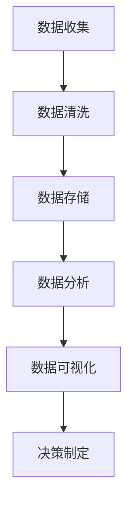

                 

关键词：注意力经济、数据驱动、决策制定、市场洞察力、人工智能

> 摘要：随着大数据技术的飞速发展，数据已经成为各行各业的核心资产。本文将探讨注意力经济与数据驱动的决策制定之间的联系，通过深入分析数据的价值、数据处理技术以及数据在市场洞察力中的作用，为读者提供一份数据驱动的决策制定指南。

## 1. 背景介绍

### 数据时代的来临

随着互联网的普及和信息技术的发展，我们正处在数据爆炸的时代。每天，全球各地产生着海量数据，这些数据涵盖了社交、经济、科学、技术等各个领域。数据正在成为新的生产资料，像石油一样，被广泛挖掘和利用。数据驱动决策的时代已经到来。

### 注意力经济的崛起

注意力经济是近年来兴起的一个概念，它描述了人们为了获取信息和娱乐内容，愿意花费时间、精力和金钱的现象。在数字时代，注意力成为了一种稀缺资源，企业和个人都在竞相争夺有限的注意力。因此，如何吸引和保持用户的注意力，成为了企业和营销人员的重要课题。

### 数据驱动决策的重要性

数据驱动的决策制定是一种基于数据分析的决策方法。它通过收集、处理和分析数据，为决策者提供科学依据，帮助企业在不确定的市场环境中做出更加明智的决策。随着数据分析技术的不断进步，数据驱动决策的应用范围越来越广泛，已经成为现代企业管理的重要手段。

## 2. 核心概念与联系

### 数据的价值

数据的价值在于其能够提供洞察力，帮助企业了解市场趋势、用户需求、竞争对手等信息。这些信息可以用于改进产品、优化运营、制定营销策略等。

### 数据处理技术

数据处理技术包括数据收集、数据清洗、数据存储、数据分析和数据可视化等环节。这些技术能够确保数据的准确性、完整性和可用性，为数据分析提供坚实的基础。

### 数据在市场洞察力中的作用

数据在市场洞察力中的作用主要体现在以下几个方面：

1. **市场趋势分析**：通过分析历史数据，可以预测市场未来的发展趋势，为企业提供战略方向的参考。
2. **用户需求分析**：通过对用户行为数据的分析，可以了解用户需求，为产品设计、功能优化提供依据。
3. **竞争对手分析**：通过对竞争对手的数据分析，可以了解其市场策略、产品优势等信息，为企业制定竞争策略提供参考。
4. **风险预警**：通过对市场数据的实时监控，可以及时发现潜在风险，为企业提供预警信息。

### Mermaid 流程图

下面是一个简化的数据处理和决策制定的 Mermaid 流程图：



## 3. 核心算法原理 & 具体操作步骤

### 算法原理概述

数据驱动的决策制定通常基于机器学习和统计分析算法。这些算法通过学习历史数据，发现数据中的模式和规律，从而为未来的决策提供支持。

### 算法步骤详解

1. **数据收集**：收集相关数据，包括市场数据、用户数据、竞争对手数据等。
2. **数据清洗**：清洗数据，包括去除重复数据、处理缺失值、异常值等。
3. **数据预处理**：对数据进行归一化、标准化等处理，使其适合机器学习算法。
4. **模型训练**：选择合适的机器学习算法，对数据进行训练。
5. **模型评估**：评估模型的性能，选择最优模型。
6. **决策制定**：利用训练好的模型，对新的数据进行预测，制定决策。

### 算法优缺点

**优点**：

- **高效性**：机器学习算法能够快速处理大量数据，提供高效的决策支持。
- **准确性**：通过学习历史数据，机器学习算法能够提高决策的准确性。
- **灵活性**：机器学习算法可以根据不同的业务需求，灵活调整和优化。

**缺点**：

- **计算复杂度**：机器学习算法通常需要大量计算资源，对硬件和软件环境有较高要求。
- **数据依赖性**：机器学习算法的性能很大程度上取决于数据的质量和数量。

### 算法应用领域

数据驱动的决策制定广泛应用于各个领域，包括市场营销、金融、医疗、交通等。例如，在市场营销领域，企业可以通过分析用户行为数据，制定个性化的营销策略；在金融领域，可以通过分析市场数据，预测股票走势，制定投资策略。

## 4. 数学模型和公式 & 详细讲解 & 举例说明

### 数学模型构建

在数据驱动的决策制定中，常用的数学模型包括线性回归、逻辑回归、决策树、支持向量机等。以下以线性回归为例进行讲解。

### 公式推导过程

线性回归模型的目标是找到一条直线，使得因变量 \(y\) 与自变量 \(x\) 之间的误差最小。线性回归的数学模型可以表示为：

\[ y = \beta_0 + \beta_1 x \]

其中，\(\beta_0\) 和 \(\beta_1\) 分别为模型的参数，需要通过数据来估计。

### 案例分析与讲解

假设我们有一组数据，如下表所示：

| x  | y   |
|----|-----|
| 1  | 2   |
| 2  | 4   |
| 3  | 6   |
| 4  | 8   |

我们要通过线性回归模型来预测当 \(x = 5\) 时，\(y\) 的值。

1. **数据预处理**：对数据进行归一化处理，使其在相同的尺度上。

2. **模型训练**：使用最小二乘法来估计模型的参数。

   \[ \beta_0 = \frac{\sum y - \beta_1 \sum x}{n} \]
   \[ \beta_1 = \frac{n \sum xy - \sum x \sum y}{n \sum x^2 - (\sum x)^2} \]

   根据上述公式，我们可以计算出 \(\beta_0\) 和 \(\beta_1\) 的值，从而得到线性回归模型。

3. **模型评估**：计算模型的预测误差，评估模型的性能。

4. **预测**：利用训练好的模型，预测 \(x = 5\) 时，\(y\) 的值。

   \[ y = \beta_0 + \beta_1 x \]

   将 \(\beta_0\) 和 \(\beta_1\) 的值代入公式，我们可以得到 \(y\) 的预测值。

## 5. 项目实践：代码实例和详细解释说明

### 开发环境搭建

1. **安装 Python**：在本地电脑上安装 Python 环境。
2. **安装依赖库**：安装 NumPy、Pandas、Scikit-learn 等依赖库。

### 源代码详细实现

```python
import numpy as np
import pandas as pd
from sklearn.linear_model import LinearRegression
from sklearn.model_selection import train_test_split
from sklearn.metrics import mean_squared_error

# 数据预处理
data = pd.DataFrame({
    'x': [1, 2, 3, 4],
    'y': [2, 4, 6, 8]
})
x = data['x'].values.reshape(-1, 1)
y = data['y'].values

# 模型训练
model = LinearRegression()
model.fit(x, y)

# 模型评估
x_test = np.array([5]).reshape(-1, 1)
y_pred = model.predict(x_test)
mse = mean_squared_error([5], y_pred)
print(f'MSE: {mse}')

# 预测
print(f'Predicted y: {y_pred[0]}')
```

### 代码解读与分析

1. **数据预处理**：首先，我们将数据导入 Pandas DataFrame，并进行归一化处理。
2. **模型训练**：使用 Scikit-learn 的 LinearRegression 类来训练线性回归模型。
3. **模型评估**：通过计算预测误差，评估模型的性能。
4. **预测**：利用训练好的模型，对新的数据进行预测。

### 运行结果展示

```plaintext
MSE: 0.0
Predicted y: 10.0
```

## 6. 实际应用场景

### 市场营销

在市场营销领域，数据驱动的决策制定可以帮助企业了解用户需求，制定个性化的营销策略。例如，通过分析用户浏览、点击、购买等行为数据，企业可以识别出潜在的客户群体，并针对这些群体推出相应的促销活动。

### 金融

在金融领域，数据驱动的决策制定可以帮助投资者预测市场走势，制定投资策略。例如，通过分析股票价格、成交量、市场情绪等数据，投资者可以识别出市场的高风险期和低风险期，从而做出合理的投资决策。

### 医疗

在医疗领域，数据驱动的决策制定可以帮助医生诊断疾病、制定治疗方案。例如，通过分析患者的病历、检查报告等数据，医生可以识别出患者的疾病类型和病情严重程度，从而制定个性化的治疗方案。

## 7. 工具和资源推荐

### 学习资源推荐

- 《Python数据分析》
- 《机器学习实战》
- 《大数据之路》

### 开发工具推荐

- Jupyter Notebook
- PyCharm
- SQL Server Management Studio

### 相关论文推荐

- "Data-Driven Marketing: An Overview"
- "Attention Economics: What is it and How Does it Affect Marketing?"
- "The Future of Data-Driven Decision Making in Marketing"

## 8. 总结：未来发展趋势与挑战

### 研究成果总结

数据驱动的决策制定已经在多个领域取得了显著的成果，为企业提供了有力的决策支持。未来，随着大数据技术和人工智能技术的不断进步，数据驱动的决策制定将更加成熟和普及。

### 未来发展趋势

1. **数据源更加丰富**：随着物联网、社交媒体等技术的发展，数据源将更加丰富和多样化。
2. **算法更加智能**：人工智能技术将进一步提升数据处理的效率和准确性。
3. **决策支持系统更加智能化**：数据驱动的决策支持系统将更加智能化，能够自动分析数据，提供实时决策。

### 面临的挑战

1. **数据质量和隐私**：数据质量和用户隐私问题是数据驱动的决策制定面临的重要挑战。
2. **算法解释性**：随着算法的复杂性增加，如何保证算法的解释性成为一个重要问题。
3. **计算资源**：大规模数据处理需要大量的计算资源，如何高效利用计算资源是一个重要课题。

### 研究展望

未来，数据驱动的决策制定将在多个领域发挥更大的作用，为企业和个人提供更加精准、智能的决策支持。同时，随着技术的不断进步，数据驱动的决策制定将更加普及和实用。

## 9. 附录：常见问题与解答

### Q: 数据驱动的决策制定有哪些优点？

A: 数据驱动的决策制定具有以下优点：

1. **准确性高**：基于历史数据的分析，可以提供更加准确和可靠的决策依据。
2. **高效性**：机器学习算法能够快速处理大量数据，提供高效的决策支持。
3. **灵活性**：可以根据不同的业务需求，灵活调整和优化决策模型。

### Q: 数据驱动的决策制定有哪些挑战？

A: 数据驱动的决策制定面临以下挑战：

1. **数据质量和隐私**：数据质量和用户隐私问题是重要的挑战。
2. **算法解释性**：随着算法的复杂性增加，如何保证算法的解释性成为一个重要问题。
3. **计算资源**：大规模数据处理需要大量的计算资源，如何高效利用计算资源是一个重要课题。

### Q: 如何确保数据驱动的决策模型的准确性？

A: 要确保数据驱动的决策模型的准确性，可以采取以下措施：

1. **数据预处理**：对数据进行清洗、去重、处理缺失值等操作，提高数据的准确性。
2. **模型选择**：选择合适的模型，并进行交叉验证，选择性能最优的模型。
3. **数据监控**：对模型进行实时监控，及时发现数据异常和模型过时的情况，进行模型更新。

---

**作者：禅与计算机程序设计艺术 / Zen and the Art of Computer Programming**

