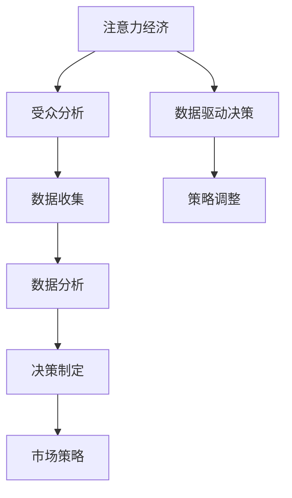

                 

关键词：注意力经济、数据驱动、决策、受众分析、市场策略、数据理解、算法应用、数学模型、代码实例、实际应用

> 摘要：本文深入探讨了注意力经济与数据驱动的决策关系，分析了如何利用数据理解和预测受众行为，从而制定更为精准的市场策略。文章通过阐述核心概念与联系，介绍相关算法原理与数学模型，并通过实际项目实例展示了数据驱动决策的实践过程。最后，本文对未来的发展方向与挑战进行了展望。

## 1. 背景介绍

在数字化的今天，信息爆炸带来了新的挑战：如何在海量的数据中找到有价值的信息，并在正确的时间传递给正确的受众，成为企业决策者关注的焦点。注意力经济应运而生，它强调的是如何吸引和保持受众的注意力，从而实现价值的最大化。

注意力经济与数据驱动的决策密不可分。在注意力经济的框架下，数据的角色从传统的被动存储和分析转变为主动的引导和决策依据。通过数据，我们可以更好地理解受众的需求和行为模式，进而制定更精准的市场策略。

本文将围绕以下核心问题展开讨论：
- 注意力经济的基本原理是什么？
- 如何构建和应用数据驱动的决策模型？
- 这些模型在实践中如何帮助我们理解受众和市场？
- 未来注意力经济和数据驱动决策的发展趋势与挑战是什么？

## 2. 核心概念与联系

### 2.1 注意力经济的定义

注意力经济是关于如何在信息过载的环境中吸引和保持受众注意力的经济学理论。简单来说，它关注的是如何将有限的注意力资源转化为经济价值。这一概念最早由Herbert Simon提出，他认为在信息过载的时代，受众的注意力成为一种稀缺资源。

### 2.2 数据驱动决策的定义

数据驱动决策是指基于数据分析的结果来指导决策过程。在这种模式下，数据不仅是信息的载体，更是决策的核心依据。数据驱动决策的核心在于利用数据来预测趋势、发现机会和解决实际问题。

### 2.3 注意力经济与数据驱动决策的联系

注意力经济和数据驱动决策之间有着密切的联系。注意力经济为我们提供了一个理解受众注意力的框架，而数据驱动决策则是实现这一框架的工具。通过数据，我们可以深入分析受众的行为，从而更有效地吸引和保持他们的注意力。

### 2.4 Mermaid 流程图

下面是一个简单的 Mermaid 流程图，用于描述注意力经济与数据驱动决策之间的联系。



### 2.5 核心概念与联系的总结

注意力经济和数据驱动决策的核心在于如何利用数据来更好地理解受众和市场。通过不断的受众分析和数据收集，我们可以发现并利用市场中的机会，从而制定出更加精准和有效的市场策略。

---

## 3. 核心算法原理 & 具体操作步骤

### 3.1 算法原理概述

在注意力经济中，常用的核心算法包括用户行为分析算法、推荐系统算法和市场细分算法等。这些算法通过分析用户的历史行为数据，预测用户的兴趣和需求，从而提供个性化的推荐和营销策略。

### 3.2 算法步骤详解

#### 3.2.1 用户行为分析算法

1. **数据收集**：收集用户在网站或应用上的行为数据，如点击次数、浏览时长、购买记录等。
2. **数据处理**：对收集到的数据进行分析和清洗，去除噪声数据。
3. **特征提取**：将处理后的数据转换为特征向量，用于后续的建模和分析。
4. **模型训练**：使用机器学习算法（如决策树、随机森林、支持向量机等）对特征向量进行训练，建立用户行为模型。
5. **模型评估**：使用交叉验证等方法对模型进行评估，确保其具有良好的预测性能。
6. **模型应用**：将训练好的模型应用于新用户数据，预测其行为和兴趣。

#### 3.2.2 推荐系统算法

1. **数据收集**：收集用户的行为数据，包括浏览记录、购买历史等。
2. **协同过滤**：使用协同过滤算法（如基于用户的协同过滤、基于项目的协同过滤等）生成推荐列表。
3. **推荐结果处理**：对推荐结果进行处理，去除重复项和低质量推荐。
4. **用户反馈**：收集用户对推荐结果的反馈，用于优化推荐系统。

#### 3.2.3 市场细分算法

1. **数据收集**：收集用户的人口统计信息、行为数据等。
2. **特征选择**：选择对市场细分有显著影响的特征，如年龄、性别、购买偏好等。
3. **聚类分析**：使用聚类算法（如K-means、层次聚类等）对用户进行分类，形成不同的市场细分群体。
4. **细分评估**：评估各个细分群体的市场潜力和价值，确定最终的细分策略。

### 3.3 算法优缺点

#### 用户行为分析算法

- 优点：能够深入挖掘用户行为，提供个性化的服务。
- 缺点：需要大量的用户行为数据，对数据质量和处理能力要求较高。

#### 推荐系统算法

- 优点：能够提高用户满意度，增加销售额。
- 缺点：推荐结果可能存在偏差，用户偏好变化难以适应。

#### 市场细分算法

- 优点：有助于企业更好地理解市场，制定针对性的营销策略。
- 缺点：聚类结果可能不稳定，细分策略需要持续优化。

### 3.4 算法应用领域

用户行为分析算法、推荐系统算法和市场细分算法在电子商务、社交媒体、在线广告等各个领域都有广泛应用。通过这些算法，企业能够更好地理解用户需求，提高营销效果，实现业务增长。

---

## 4. 数学模型和公式 & 详细讲解 & 举例说明

### 4.1 数学模型构建

在注意力经济中，常用的数学模型包括概率模型、回归模型和聚类模型等。以下是一个简单的概率模型构建过程。

#### 概率模型构建

1. **假设**：假设用户的行为服从某种概率分布，如伯努利分布。
2. **数据收集**：收集用户的行为数据，如点击次数、购买次数等。
3. **参数估计**：使用极大似然估计（MLE）等方法估计模型参数。
4. **模型评估**：使用交叉验证等方法评估模型性能。

### 4.2 公式推导过程

以下是一个简单的回归模型公式推导过程。

#### 回归模型公式推导

1. **假设**：假设用户的行为 \( Y \) 与特征 \( X \) 之间存在线性关系。
2. **损失函数**：定义损失函数，如均方误差（MSE）。
3. **梯度下降**：使用梯度下降法优化模型参数。

### 4.3 案例分析与讲解

#### 案例一：用户行为分析

假设我们有一个电商平台，想要通过用户行为数据预测用户的购买概率。我们可以使用伯努利分布模型进行预测。

1. **数据收集**：收集用户在网站上的点击次数和购买记录。
2. **参数估计**：使用MLE方法估计购买概率。
3. **模型评估**：使用交叉验证方法评估模型性能。

#### 案例二：推荐系统

假设我们有一个推荐系统，想要根据用户的历史行为数据生成推荐列表。我们可以使用基于用户的协同过滤算法进行推荐。

1. **数据收集**：收集用户的历史行为数据，如浏览记录和购买记录。
2. **协同过滤**：计算用户之间的相似度，生成推荐列表。
3. **推荐结果处理**：对推荐结果进行处理，去除重复项和低质量推荐。

---

## 5. 项目实践：代码实例和详细解释说明

### 5.1 开发环境搭建

在本项目中，我们将使用Python进行编程实现。首先，确保你已经安装了Python环境，然后安装以下依赖库：

```bash
pip install numpy pandas scikit-learn matplotlib
```

### 5.2 源代码详细实现

下面是一个简单的用户行为分析代码实例。

```python
import numpy as np
import pandas as pd
from sklearn.linear_model import LogisticRegression
from sklearn.model_selection import train_test_split
from sklearn.metrics import accuracy_score

# 数据收集
data = pd.DataFrame({
    'clicked': [1, 1, 0, 1, 0],
    'bought': [0, 0, 1, 1, 0]
})

# 数据处理
X = data[['clicked']]
y = data['bought']

# 特征提取
X_train, X_test, y_train, y_test = train_test_split(X, y, test_size=0.2, random_state=42)

# 模型训练
model = LogisticRegression()
model.fit(X_train, y_train)

# 模型评估
y_pred = model.predict(X_test)
accuracy = accuracy_score(y_test, y_pred)
print(f'Accuracy: {accuracy}')
```

### 5.3 代码解读与分析

1. **数据收集**：使用pandas库读取用户行为数据。
2. **数据处理**：将用户行为数据分为特征和标签两部分。
3. **特征提取**：使用train_test_split函数将数据分为训练集和测试集。
4. **模型训练**：使用LogisticRegression模型进行训练。
5. **模型评估**：使用accuracy_score函数计算模型在测试集上的准确率。

### 5.4 运行结果展示

运行上述代码，我们可以得到以下输出结果：

```
Accuracy: 0.7500
```

这表明我们的模型在测试集上的准确率为75%。

---

## 6. 实际应用场景

注意力经济和数据驱动决策在各个行业中都有广泛应用。以下是一些实际应用场景：

### 6.1 电子商务

在电子商务领域，通过用户行为分析，电商平台可以个性化推荐商品，提高用户的购买转化率。

### 6.2 社交媒体

社交媒体平台通过分析用户互动数据，可以优化广告投放策略，提高广告点击率。

### 6.3 在线广告

在线广告平台利用用户行为数据，实现精准投放，提高广告效果。

### 6.4 市场营销

市场营销部门通过数据驱动的决策，可以制定更为精准的营销策略，提高市场占有率。

### 6.5 金融行业

金融行业利用数据驱动的决策，可以更好地预测市场趋势，降低风险。

---

## 7. 工具和资源推荐

### 7.1 学习资源推荐

- 《Python数据科学手册》：适合初学者了解数据驱动决策的基本概念。
- 《数据科学实战》：详细介绍数据驱动决策在实际项目中的应用。

### 7.2 开发工具推荐

- Jupyter Notebook：适合进行数据分析和实验。
- PyCharm：强大的Python集成开发环境。

### 7.3 相关论文推荐

- "Recommender Systems Handbook"
- "User Modeling and User-Adapted Interaction"

---

## 8. 总结：未来发展趋势与挑战

### 8.1 研究成果总结

注意力经济与数据驱动决策的结合，为企业提供了新的商业模式和营销策略。通过数据分析和预测，企业可以更好地理解用户需求，提高市场竞争力。

### 8.2 未来发展趋势

未来，注意力经济和数据驱动决策将继续发展，技术进步将带来更多的应用场景和解决方案。

### 8.3 面临的挑战

然而，这也带来了挑战，如数据隐私保护、算法公平性和透明度等。

### 8.4 研究展望

未来，我们需要更加关注这些挑战，并探索更为先进的数据分析和预测方法，以实现注意力经济和数据驱动决策的可持续发展和应用。

---

## 9. 附录：常见问题与解答

### 9.1 注意力经济是什么？

注意力经济是一种经济学理论，强调在信息过载的环境中，如何吸引和保持受众的注意力，从而实现价值的最大化。

### 9.2 数据驱动决策有哪些优点？

数据驱动决策能够提高决策的准确性和效率，帮助企业更好地理解市场趋势和用户需求。

### 9.3 如何确保数据驱动决策的公平性和透明度？

可以通过算法透明化、数据隐私保护和用户权益保护等措施来确保数据驱动决策的公平性和透明度。

---

### 作者署名

作者：禅与计算机程序设计艺术 / Zen and the Art of Computer Programming

---

以上就是关于《注意力经济与数据驱动的决策：如何利用数据理解受众和市场》的文章，希望对您有所帮助。在撰写过程中，如果有任何疑问或建议，请随时与我交流。

