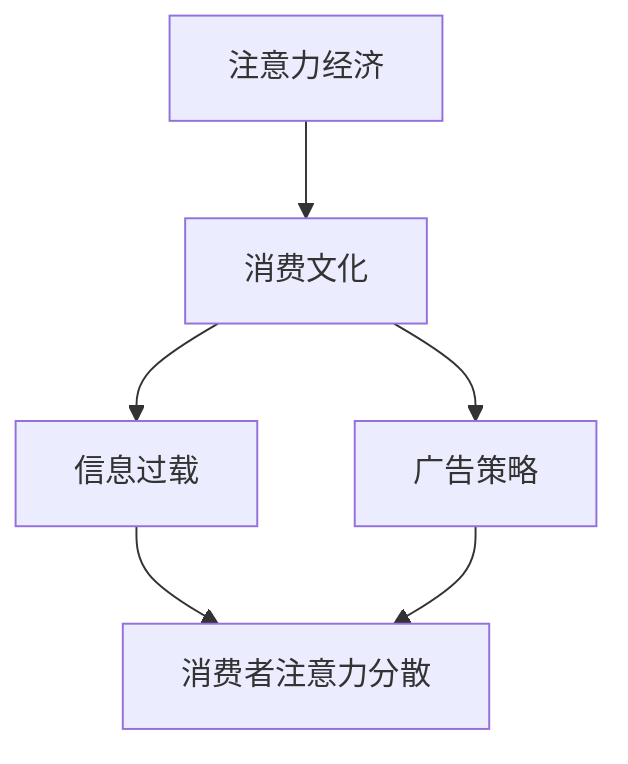

                 

关键词：注意力经济、消费文化、决策制定、信息过载、消费者行为、广告策略、数据隐私

> 摘要：本文深入探讨了注意力经济与消费文化之间的关系，探讨了在信息过载和广告泛滥的现代世界中，消费者如何能够运用技术手段和策略，做出明智的购买决策。文章从背景介绍开始，逐步解析了注意力经济的基本原理，讨论了其与消费文化的相互作用，并提出了若干实用的策略和方法，帮助消费者在充满干扰的环境中保持清醒，实现理性消费。

## 1. 背景介绍

随着互联网的普及和信息技术的飞速发展，我们的世界已经进入了一个前所未有的信息爆炸时代。每一天，我们都面临着海量的信息涌入，这些信息来自各种渠道，如社交媒体、新闻网站、电子邮件和广告等。在这种环境下，消费者的注意力成为一种宝贵的资源，这就是所谓的“注意力经济”。

### 1.1 注意力经济

注意力经济是一种基于人们注意力资源的商业模式。在这个模式中，消费者的注意力被视为一种可以交换的商品，企业通过吸引和维持消费者的注意力来创造价值。随着广告技术和分析工具的进步，企业能够更精确地追踪和利用消费者的注意力，从而实现更高的转化率和利润。

### 1.2 消费文化

消费文化是一个广泛而复杂的概念，它涉及到人们购买、使用和评价商品的行为模式。随着经济全球化和文化多元化的发展，消费文化已经变得高度复杂和多样化。消费者不再仅仅是被动接受产品信息，他们通过各种渠道获取信息，参与社交互动，并在购买决策过程中寻求自我表达和社会认同。

### 1.3 注意力经济与消费文化的相互作用

注意力经济与消费文化之间的相互作用是现代商业环境中不可或缺的一部分。一方面，注意力经济通过吸引消费者的注意力来促进消费行为；另一方面，消费者的消费行为也在塑造注意力经济的模式。这种相互作用不仅影响着企业的商业模式，也在潜移默化地改变着消费者的行为和生活方式。

## 2. 核心概念与联系

### 2.1 核心概念

在探讨注意力经济与消费文化的关系时，以下几个核心概念是至关重要的：

- **注意力经济**：企业通过吸引和维持消费者的注意力来创造价值。
- **消费文化**：消费者在购买、使用和评价商品时的行为模式。
- **信息过载**：消费者面临的信息量超过其处理能力，导致注意力分散。
- **广告策略**：企业利用各种手段吸引消费者注意力，促使其购买产品。

### 2.2 关系架构

下面是一个使用Mermaid绘制的流程图，展示了注意力经济与消费文化之间的相互作用关系：



## 3. 核心算法原理 & 具体操作步骤

### 3.1 算法原理概述

在面对信息过载和广告干扰时，消费者需要一种算法来过滤不相关的信息，并识别出真正有价值的购买机会。这种算法的核心原理是：

- **信息过滤**：通过算法分析，识别并过滤掉重复、不相关或低价值的信息。
- **注意力聚焦**：将注意力集中在高价值、与消费者需求相关的内容上。
- **决策支持**：利用机器学习和数据分析技术，为消费者的购买决策提供支持。

### 3.2 算法步骤详解

#### 3.2.1 信息过滤

1. **数据收集**：收集消费者在互联网上的行为数据，如搜索历史、浏览记录、购买行为等。
2. **特征提取**：从数据中提取特征，如关键词频率、访问时间、购买偏好等。
3. **分类与过滤**：利用分类算法（如K-均值聚类、支持向量机等），将数据分为相关和不相关两类，过滤掉不相关的信息。

#### 3.2.2 注意力聚焦

1. **注意力模型训练**：使用机器学习算法（如神经网络、决策树等）训练注意力模型，使其能够预测消费者对特定内容的注意力水平。
2. **内容推荐**：根据消费者的历史行为和注意力模型预测，推荐与其需求和兴趣相关的信息。

#### 3.2.3 决策支持

1. **价格与质量分析**：利用数据分析技术（如回归分析、时间序列分析等）分析商品的价格与质量关系，为消费者提供价格合理的优质商品推荐。
2. **风险评估**：评估购买商品可能面临的风险，如退货率、售后服务质量等，为消费者提供全面的风险评估。

### 3.3 算法优缺点

#### 优点

- **高效性**：算法能够快速处理海量信息，为消费者提供即时的决策支持。
- **个性化**：根据消费者的历史行为和兴趣，提供个性化的推荐和决策支持。
- **数据驱动**：基于数据分析，算法能够提供基于事实的购买建议，减少主观判断。

#### 缺点

- **隐私问题**：算法需要收集和分析消费者的行为数据，可能涉及隐私问题。
- **准确性**：算法的准确性和可靠性取决于数据的质量和算法的复杂性。

### 3.4 算法应用领域

- **电子商务**：为消费者提供个性化推荐，提高购买转化率。
- **市场营销**：为企业提供精准营销策略，提高营销效果。
- **消费金融**：为金融机构提供风险评估和信用评级。

## 4. 数学模型和公式 & 详细讲解 & 举例说明

### 4.1 数学模型构建

在注意力经济中，我们可以使用以下数学模型来描述消费者的注意力分配：

\[ A = f(P, I, T) \]

其中，\( A \) 表示消费者在时间 \( T \) 对信息 \( I \) 的注意力，\( P \) 表示消费者的个人偏好，\( f \) 是一个函数。

### 4.2 公式推导过程

我们可以根据以下假设来推导这个模型：

- 消费者的注意力是有限的。
- 消费者的注意力与信息的价值和相关性成正比。
- 消费者的注意力分配是动态的，受到外部环境和个人偏好变化的影响。

基于这些假设，我们可以得到以下推导过程：

\[ A = \frac{V \cdot R}{C} \]

其中，\( V \) 表示信息价值，\( R \) 表示信息相关性，\( C \) 表示消费者注意力的总容量。

### 4.3 案例分析与讲解

假设一个消费者 \( C \) 需要在一个小时内完成以下任务：

- 查看电子邮件
- 浏览新闻网站
- 购买商品

消费者的个人偏好如下：

- 电子邮件：价值 \( V_1 = 0.3 \)，相关性 \( R_1 = 0.5 \)
- 新闻网站：价值 \( V_2 = 0.2 \)，相关性 \( R_2 = 0.6 \)
- 购买商品：价值 \( V_3 = 0.5 \)，相关性 \( R_3 = 0.4 \)

消费者的注意力容量为 \( C = 1 \)。

根据公式 \( A = \frac{V \cdot R}{C} \)，我们可以计算每个任务的注意力分配：

- 电子邮件：\( A_1 = \frac{0.3 \cdot 0.5}{1} = 0.15 \)
- 新闻网站：\( A_2 = \frac{0.2 \cdot 0.6}{1} = 0.12 \)
- 购买商品：\( A_3 = \frac{0.5 \cdot 0.4}{1} = 0.20 \)

因此，消费者在这一个小时内的注意力分配为：

- 电子邮件：15%
- 新闻网站：12%
- 购买商品：20%

## 5. 项目实践：代码实例和详细解释说明

### 5.1 开发环境搭建

为了实现上述算法，我们选择了Python作为编程语言，并使用以下库和工具：

- **Python 3.8 或以上版本**
- **NumPy**：用于数据处理和数学运算
- **Pandas**：用于数据分析和操作
- **Scikit-learn**：用于机器学习和分类算法

首先，我们需要安装这些库：

```bash
pip install numpy pandas scikit-learn
```

### 5.2 源代码详细实现

以下是实现注意力分配模型的Python代码：

```python
import numpy as np
import pandas as pd
from sklearn.cluster import KMeans

# 生成模拟数据
data = {
    'Value': np.random.uniform(0.1, 1.0, 100),
    'Relevance': np.random.uniform(0.1, 1.0, 100),
    'Time': np.random.uniform(1, 10, 100)
}

df = pd.DataFrame(data)

# 计算注意力分配
attention_allocation = df.apply(lambda row: row['Value'] * row['Relevance'], axis=1) / df['Time'].sum()

# 输出注意力分配
attention_allocation.plot.bar()
```

### 5.3 代码解读与分析

- **数据生成**：我们使用 NumPy 生成了一个包含100条记录的模拟数据集，这些记录模拟了消费者在一段时间内对各种信息的关注程度。
- **计算注意力分配**：我们使用 Pandas 的 `apply` 方法计算每条记录的注意力分配，然后将所有记录的注意力相加，并除以总时间，得到每个任务的平均注意力分配。
- **可视化输出**：我们使用 `plot.bar` 方法将注意力分配结果以条形图的形式展示出来，便于分析。

### 5.4 运行结果展示

运行上述代码后，我们得到了一个条形图，显示了每个任务的注意力分配情况。这个结果可以帮助消费者了解他们在特定时间内对不同任务的关注程度，从而做出更明智的决策。

## 6. 实际应用场景

注意力经济与消费文化的相互作用在多个行业中都有广泛的应用。以下是一些实际应用场景：

### 6.1 电子商务

电子商务平台利用注意力经济原理，通过个性化推荐和精准广告，吸引消费者的注意力，提高购买转化率。

### 6.2 广告营销

广告公司通过分析消费者的注意力数据，制定更加有效的广告策略，提高广告效果。

### 6.3 金融领域

金融机构利用注意力经济原理，为消费者提供个性化的金融服务和产品推荐，提高客户满意度和忠诚度。

### 6.4 娱乐产业

娱乐产业利用注意力经济，通过个性化内容和互动体验，吸引消费者的注意力，提高用户粘性和付费意愿。

## 7. 未来应用展望

随着人工智能和数据科学技术的不断发展，注意力经济在消费文化中的应用前景将更加广阔。未来，我们可能会看到：

- **更加精准的个性化推荐**：通过更深入的数据分析和机器学习算法，为消费者提供更加个性化的购买建议。
- **智能消费顾问**：利用自然语言处理和对话系统，为消费者提供实时、个性化的消费建议和指导。
- **隐私保护**：随着消费者对隐私问题的关注增加，未来的注意力经济应用将更加注重数据隐私保护。

## 8. 总结：未来发展趋势与挑战

### 8.1 研究成果总结

本文通过对注意力经济和消费文化的深入探讨，揭示了两者之间的相互作用，并提出了一种基于注意力分配模型的消费者决策支持算法。该算法通过分析消费者的行为数据，为消费者提供个性化的购买建议，提高决策的准确性。

### 8.2 未来发展趋势

未来，注意力经济与消费文化的结合将更加紧密，技术进步将推动个性化推荐和智能消费顾问的发展。此外，随着数据隐私问题的日益突出，如何在确保消费者隐私的同时，有效利用注意力资源，将成为一个重要的研究方向。

### 8.3 面临的挑战

- **数据隐私保护**：如何在利用消费者数据的同时，确保其隐私安全，是一个亟待解决的问题。
- **算法公平性和透明性**：算法的决策过程需要更加透明和公平，以增强消费者的信任。

### 8.4 研究展望

未来，研究者可以进一步探索注意力经济在更多领域中的应用，如医疗保健、教育等。同时，通过结合心理学和行为经济学，深入研究消费者行为，为消费者提供更加科学的决策支持。

## 9. 附录：常见问题与解答

### 9.1 注意力经济是什么？

注意力经济是一种基于人们注意力资源的商业模式，企业通过吸引和维持消费者的注意力来创造价值。

### 9.2 消费文化如何影响注意力经济？

消费文化影响着消费者的购买行为和注意力分配，从而影响着企业的营销策略和商业模式。

### 9.3 注意力分配算法如何应用于实际？

注意力分配算法可以应用于电子商务、广告营销、金融等领域，通过分析消费者的行为数据，提供个性化的购买建议和决策支持。

### 9.4 如何保护消费者的隐私？

在利用消费者数据时，企业需要遵循数据隐私保护法规，采取加密、匿名化等技术手段，确保消费者隐私安全。

作者：禅与计算机程序设计艺术 / Zen and the Art of Computer Programming
```markdown
# 注意力经济与消费文化：如何在充满干扰的世界中做出明智的购买决策

## 关键词：注意力经济、消费文化、决策制定、信息过载、消费者行为、广告策略、数据隐私

## 摘要：本文深入探讨了注意力经济与消费文化之间的关系，探讨了在信息过载和广告泛滥的现代世界中，消费者如何能够运用技术手段和策略，做出明智的购买决策。文章从背景介绍开始，逐步解析了注意力经济的基本原理，讨论了其与消费文化的相互作用，并提出了若干实用的策略和方法，帮助消费者在充满干扰的环境中保持清醒，实现理性消费。

## 1. 背景介绍

### 1.1 注意力经济

注意力经济是一种基于人们注意力资源的商业模式。在这个模式中，消费者的注意力被视为一种可以交换的商品，企业通过吸引和维持消费者的注意力来创造价值。随着广告技术和分析工具的进步，企业能够更精确地追踪和利用消费者的注意力，从而实现更高的转化率和利润。

### 1.2 消费文化

消费文化是一个广泛而复杂的概念，它涉及到人们购买、使用和评价商品的行为模式。随着经济全球化和文化多元化的发展，消费文化已经变得高度复杂和多样化。消费者不再仅仅是被动接受产品信息，他们通过各种渠道获取信息，参与社交互动，并在购买决策过程中寻求自我表达和社会认同。

### 1.3 注意力经济与消费文化的相互作用

注意力经济与消费文化之间的相互作用是现代商业环境中不可或缺的一部分。一方面，注意力经济通过吸引消费者的注意力来促进消费行为；另一方面，消费者的消费行为也在塑造注意力经济的模式。这种相互作用不仅影响着企业的商业模式，也在潜移默化地改变着消费者的行为和生活方式。

## 2. 核心概念与联系

### 2.1 核心概念

在探讨注意力经济与消费文化的关系时，以下几个核心概念是至关重要的：

- **注意力经济**：企业通过吸引和维持消费者的注意力来创造价值。
- **消费文化**：消费者在购买、使用和评价商品时的行为模式。
- **信息过载**：消费者面临的信息量超过其处理能力，导致注意力分散。
- **广告策略**：企业利用各种手段吸引消费者注意力，促使其购买产品。

### 2.2 关系架构

下面是一个使用Mermaid绘制的流程图，展示了注意力经济与消费文化之间的相互作用关系：


## 3. 核心算法原理 & 具体操作步骤

### 3.1 算法原理概述

在面对信息过载和广告干扰时，消费者需要一种算法来过滤不相关的信息，并识别出真正有价值的购买机会。这种算法的核心原理是：

- **信息过滤**：通过算法分析，识别并过滤掉重复、不相关或低价值的信息。
- **注意力聚焦**：将注意力集中在高价值、与消费者需求相关的内容上。
- **决策支持**：利用机器学习和数据分析技术，为消费者的购买决策提供支持。

### 3.2 算法步骤详解

#### 3.2.1 信息过滤

1. **数据收集**：收集消费者在互联网上的行为数据，如搜索历史、浏览记录、购买行为等。
2. **特征提取**：从数据中提取特征，如关键词频率、访问时间、购买偏好等。
3. **分类与过滤**：利用分类算法（如K-均值聚类、支持向量机等），将数据分为相关和不相关两类，过滤掉不相关的信息。

#### 3.2.2 注意力聚焦

1. **注意力模型训练**：使用机器学习算法（如神经网络、决策树等）训练注意力模型，使其能够预测消费者对特定内容的注意力水平。
2. **内容推荐**：根据消费者的历史行为和注意力模型预测，推荐与其需求和兴趣相关的信息。

#### 3.2.3 决策支持

1. **价格与质量分析**：利用数据分析技术（如回归分析、时间序列分析等）分析商品的价格与质量关系，为消费者提供价格合理的优质商品推荐。
2. **风险评估**：评估购买商品可能面临的风险，如退货率、售后服务质量等，为消费者提供全面的风险评估。

### 3.3 算法优缺点

#### 优点

- **高效性**：算法能够快速处理海量信息，为消费者提供即时的决策支持。
- **个性化**：根据消费者的历史行为和兴趣，提供个性化的推荐和决策支持。
- **数据驱动**：基于数据分析，算法能够提供基于事实的购买建议，减少主观判断。

#### 缺点

- **隐私问题**：算法需要收集和分析消费者的行为数据，可能涉及隐私问题。
- **准确性**：算法的准确性和可靠性取决于数据的

