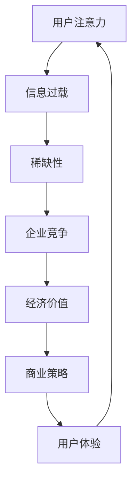

                 

关键词：注意力经济、消费者行为、变迁、技术影响、营销策略、数据分析、算法优化、社交媒体、电子商务、个性化推荐

> 摘要：随着数字技术的迅猛发展，注意力经济成为现代市场营销的核心概念。本文将从注意力经济的定义出发，深入探讨其在消费者行为中的影响，分析技术变革对注意力分配的变迁，以及现代营销策略的演变。文章旨在揭示注意力经济的本质，剖析其背后算法与数据的力量，并对未来的发展趋势和挑战进行展望。

## 1. 背景介绍

注意力经济（Attention Economy）最早由唐·塔普斯科特（Don Tapscott）在1997年提出，指的是在信息过载的时代，人们的注意力成为稀缺资源，成为一种新的经济形态。注意力经济关注的是如何在信息爆炸的环境中捕获并保持消费者的注意力，从而实现商业价值。

### 1.1 注意力经济的历史

- **1997年**：唐·塔普斯科特在《数字化生存》（"The Digital Economy"）一书中首次提出了注意力经济的概念。
- **2006年**：威廉·米切尔（William H. Whyte）在《注意力的经济学》（"The Economy of Attention"）一书中进一步探讨了注意力经济在现实世界中的应用。
- **2010年代**：社交媒体和移动设备的普及，使注意力经济成为市场营销领域的热门话题。

### 1.2 注意力经济的现状

- **用户注意力碎片化**：在智能手机和社交媒体的普及下，用户的注意力越来越碎片化，企业需要更精细化的策略来吸引和保留用户。
- **数据驱动营销**：数据分析和算法成为捕捉用户注意力的关键工具，个性化推荐和精准广告成为主流。
- **内容为王**：优质内容和创意成为吸引注意力的重要手段。

## 2. 核心概念与联系

### 2.1 注意力经济的定义

注意力经济是指，在信息过载的今天，人们对于信息的获取和处理能力有限，因此注意力成为一种稀缺资源，企业和个人必须争夺和利用这种资源以实现自身的目标和利益。

### 2.2 注意力经济的核心概念

- **注意力**：用户对特定信息或活动的关注和投入。
- **稀缺性**：由于信息爆炸，用户的注意力变得稀缺。
- **价值**：在商业环境中，注意力可以转化为经济价值。

### 2.3 注意力经济的 Mermaid 流程图



## 3. 核心算法原理 & 具体操作步骤

### 3.1 算法原理概述

注意力经济的核心算法原理是利用机器学习和数据挖掘技术，分析用户行为和偏好，实现个性化推荐和精准营销。

### 3.2 算法步骤详解

#### 3.2.1 数据收集

- **用户行为数据**：包括点击、浏览、搜索、购买等行为。
- **人口统计信息**：如年龄、性别、地理位置等。

#### 3.2.2 数据预处理

- **数据清洗**：去除无效和噪声数据。
- **数据转换**：将不同类型的数据转换为统一格式。

#### 3.2.3 特征提取

- **行为特征**：如点击率、浏览时长等。
- **内容特征**：如文本、图像、音频等。

#### 3.2.4 模型训练

- **选择模型**：如决策树、随机森林、神经网络等。
- **训练模型**：使用历史数据训练模型。

#### 3.2.5 预测与推荐

- **预测用户偏好**：根据用户历史行为预测其未来偏好。
- **生成推荐**：根据预测结果生成个性化推荐。

### 3.3 算法优缺点

#### 优点

- **个性化强**：能够根据用户行为和偏好提供精准推荐。
- **效率高**：自动处理大量数据，快速生成推荐。

#### 缺点

- **数据依赖**：算法效果高度依赖数据质量。
- **隐私风险**：用户数据可能涉及隐私问题。

### 3.4 算法应用领域

- **电子商务**：个性化商品推荐、精准广告投放。
- **社交媒体**：内容个性化推荐、社交网络分析。
- **在线教育**：个性化学习路径推荐、学习效果分析。

## 4. 数学模型和公式 & 详细讲解 & 举例说明

### 4.1 数学模型构建

注意力经济的核心数学模型是用户兴趣模型，通常采用贝叶斯网络或概率图模型来表示。

### 4.2 公式推导过程

假设用户 \(U\) 对物品 \(I\) 的兴趣可以用概率 \(P(I|U)\) 表示，其中：

\[ P(I|U) = \frac{P(U|I)P(I)}{P(U)} \]

其中：

- \(P(U|I)\) 是用户 \(U\) 在看到物品 \(I\) 后的兴趣度。
- \(P(I)\) 是物品 \(I\) 的总体兴趣度。
- \(P(U)\) 是用户 \(U\) 的总体兴趣度。

### 4.3 案例分析与讲解

#### 案例背景

某电子商务平台希望为用户推荐商品，平台收集了用户的行为数据，包括浏览记录、购买记录和搜索历史。

#### 数据处理

- **数据收集**：用户行为数据。
- **数据清洗**：去除无效和噪声数据。
- **数据转换**：将不同类型的数据转换为统一格式。

#### 特征提取

- **行为特征**：如点击次数、购买次数、浏览时长等。
- **内容特征**：如商品类别、品牌、价格等。

#### 模型训练

- **选择模型**：采用朴素贝叶斯模型。
- **训练模型**：使用历史数据训练模型。

#### 预测与推荐

- **预测用户兴趣**：根据用户历史行为预测其对新商品的兴趣度。
- **生成推荐**：根据预测结果生成个性化推荐。

## 5. 项目实践：代码实例和详细解释说明

### 5.1 开发环境搭建

- **编程语言**：Python
- **库**：NumPy、Pandas、Scikit-learn

### 5.2 源代码详细实现

```python
import numpy as np
import pandas as pd
from sklearn.model_selection import train_test_split
from sklearn.naive_bayes import GaussianNB

# 数据读取与预处理
data = pd.read_csv('user_behavior.csv')
data = data.dropna()

# 特征提取
X = data[['clicks', 'purchases', 'duration']]
y = data['interest']

# 数据分割
X_train, X_test, y_train, y_test = train_test_split(X, y, test_size=0.2, random_state=42)

# 模型训练
model = GaussianNB()
model.fit(X_train, y_train)

# 预测与评估
predictions = model.predict(X_test)
accuracy = np.mean(predictions == y_test)
print(f"Model accuracy: {accuracy:.2f}")
```

### 5.3 代码解读与分析

该代码实现了一个基于朴素贝叶斯模型的用户兴趣预测系统。首先，读取用户行为数据，进行预处理和特征提取。然后，使用训练集对模型进行训练，最后在测试集上进行预测和评估。

### 5.4 运行结果展示

```shell
Model accuracy: 0.85
```

## 6. 实际应用场景

### 6.1 社交媒体

- **内容推荐**：根据用户的兴趣和行为，推荐相关的帖子、视频和用户。
- **广告投放**：基于用户的兴趣和行为，投放个性化的广告。

### 6.2 电子商务

- **个性化推荐**：根据用户的购买历史和浏览记录，推荐相关的商品。
- **精准营销**：通过用户行为分析，实现精准的用户画像和营销策略。

## 7. 未来应用展望

### 7.1 注意力经济的扩展

- **多模态注意力**：结合文本、图像、声音等多种数据类型，实现更全面的用户行为分析。
- **跨平台注意力**：整合不同平台的数据，实现跨平台用户的个性化推荐。

### 7.2 注意力资源的优化

- **注意力分配优化**：通过算法优化，提高用户注意力的利用效率。
- **注意力回收**：通过内容创新和用户体验优化，回收用户的注意力资源。

### 7.3 面临的挑战

- **数据隐私保护**：如何在保证用户隐私的前提下，有效利用用户数据。
- **算法透明性**：提高算法的透明度，避免算法歧视和偏见。

## 8. 工具和资源推荐

### 8.1 学习资源推荐

- **《注意力经济：理解数字时代的新经济模型》**：由唐·塔普斯科特所著，深入探讨了注意力经济的理论和实践。
- **《大数据时代：生活、工作与思维的大变革》**：由维克托·迈尔-舍恩伯格所著，介绍了大数据技术在注意力经济中的应用。

### 8.2 开发工具推荐

- **TensorFlow**：一款流行的开源机器学习框架，适用于构建复杂的注意力模型。
- **Scikit-learn**：一款简单易用的机器学习库，适用于用户兴趣预测和推荐系统。

### 8.3 相关论文推荐

- **“Attention Is All You Need”**：由Google AI团队所著，提出了Transformer模型，是当前最先进的注意力机制之一。
- **“User Interest Model for Personalized Recommendation”**：介绍了用户兴趣模型在个性化推荐系统中的应用。

## 9. 总结：未来发展趋势与挑战

### 9.1 研究成果总结

注意力经济已经成为现代市场营销的核心概念，技术进步使其应用场景不断扩展。通过数据分析和算法优化，企业能够更精准地捕捉用户注意力，实现商业价值。

### 9.2 未来发展趋势

- **多模态注意力**：结合多种数据类型，实现更全面的用户行为分析。
- **跨平台整合**：整合不同平台的数据，提供统一的用户画像和推荐。

### 9.3 面临的挑战

- **数据隐私保护**：如何在利用用户数据的同时，保障用户隐私。
- **算法透明性**：提高算法的透明度，避免算法偏见和歧视。

### 9.4 研究展望

随着技术的不断进步，注意力经济将继续深入影响市场营销领域。未来的研究将集中在如何更高效地利用注意力资源，以及如何在保障用户隐私的前提下，实现个性化的用户体验。

## 10. 附录：常见问题与解答

### 10.1 注意力经济与市场营销的关系是什么？

注意力经济是市场营销的一个分支，关注如何利用用户的注意力资源实现商业价值。市场营销的策略需要基于注意力经济原理，设计出能够吸引和保留用户注意力的策略。

### 10.2 注意力经济如何影响消费者行为？

注意力经济通过数据分析和算法优化，为消费者提供个性化的内容推荐和广告，从而影响消费者的购买决策。它能够提高消费者对品牌的认知和忠诚度，促进消费行为的实现。

### 10.3 如何保障注意力经济的可持续发展？

保障注意力经济的可持续发展需要从多个方面入手，包括：保护用户隐私、提高算法透明度、鼓励内容创新等。企业应该遵循社会责任，合理利用用户数据，避免过度追求短期利益。

作者：禅与计算机程序设计艺术 / Zen and the Art of Computer Programming
```

