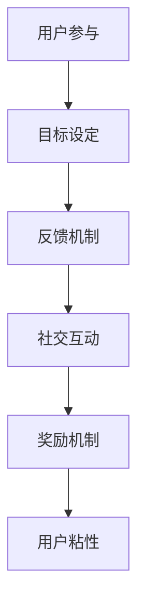

                 

关键词：注意力经济、游戏化、用户参与、激励机制、用户粘性、心理学原理

> 摘要：随着数字时代的到来，互联网内容激增，获取受众的注意力成为了一项挑战。本文探讨了注意力经济与游戏化的概念，通过分析心理学原理和实际案例，探讨了如何运用游戏机制吸引并留住受众，提高用户参与度和品牌忠诚度。

## 1. 背景介绍

### 1.1 注意力经济的兴起

注意力经济最早由美国经济学家托夫勒（Alvin Toffler）提出，指的是在信息时代，个人和企业的核心资源不再是物质财富，而是人们的注意力。随着互联网的普及，注意力经济成为了现代商业和社会运作的重要驱动力。

### 1.2 游戏化的定义与发展

游戏化（Gamification）是指将游戏设计的元素和机制应用到非游戏的场景中，以增加用户参与度和提高用户体验。近年来，游戏化在市场营销、教育、健康等领域取得了显著成效。

## 2. 核心概念与联系

### 2.1 注意力经济与游戏化的关系

注意力经济和游戏化有着紧密的联系。游戏化利用了人类对竞争、成就、社交等心理需求的认知，通过设计游戏化的机制来吸引和留住受众。

### 2.2 游戏化机制的核心要素

- **目标设定**：为用户设定明确的目标，如完成任务、达到等级。
- **反馈机制**：及时给予用户正面反馈，如积分、勋章。
- **社交互动**：鼓励用户之间的互动，如排行榜、社区论坛。
- **奖励机制**：提供奖励，如虚拟货币、实物奖励。

### 2.3 Mermaid 流程图

## 3. 核心算法原理 & 具体操作步骤

### 3.1 算法原理概述

游戏化机制的实现主要依赖于用户行为分析、激励机制设计和用户体验优化。

### 3.2 算法步骤详解

1. **需求分析**：了解目标受众的需求和期望。
2. **设计目标**：设定具体、可衡量的目标。
3. **制定规则**：设计游戏的规则和激励机制。
4. **测试与优化**：根据用户反馈不断调整和优化。

### 3.3 算法优缺点

**优点**：
- 提高用户参与度和粘性。
- 增强用户对品牌的认知和忠诚度。
- 创造更积极、互动的用户社区。

**缺点**：
- 可能导致用户过度沉迷。
- 如果设计不当，可能会适得其反。

### 3.4 算法应用领域

- **市场营销**：通过游戏化吸引潜在客户，提高转化率。
- **教育**：利用游戏化提高学生的学习兴趣和成绩。
- **健康**：通过游戏化鼓励用户保持健康生活方式。

## 4. 数学模型和公式 & 详细讲解 & 举例说明

### 4.1 数学模型构建

- **用户参与度模型**：利用用户行为数据构建参与度模型。
- **激励机制模型**：基于心理学原理设计激励机制。

### 4.2 公式推导过程

- **用户参与度公式**：\( U = f(B, R, S) \)
  - \( U \)：用户参与度
  - \( B \)：目标设定
  - \( R \)：反馈机制
  - \( S \)：社交互动

- **激励机制公式**：\( M = f(R, P, A) \)
  - \( M \)：激励机制
  - \( R \)：奖励机制
  - \( P \)：惩罚机制
  - \( A \)：实际应用场景

### 4.3 案例分析与讲解

以某电商平台为例，通过游戏化机制提高用户购物体验和参与度。分析其用户参与度模型和激励机制模型，并给出具体推导和实施步骤。

## 5. 项目实践：代码实例和详细解释说明

### 5.1 开发环境搭建

- 使用 Python 编写游戏化应用。
- 选择适当的框架，如 Flask 或 Django。

### 5.2 源代码详细实现

- 设计用户界面。
- 实现用户行为分析。
- 设计激励机制。

### 5.3 代码解读与分析

- 分析代码结构和功能模块。
- 讨论如何优化代码和提升性能。

### 5.4 运行结果展示

- 展示用户参与度和激励机制的效果。
- 分析用户行为数据，优化游戏化机制。

## 6. 实际应用场景

### 6.1 市场营销

- 利用游戏化吸引潜在客户，提高品牌知名度。
- 通过互动和奖励机制增强用户粘性。

### 6.2 教育

- 利用游戏化提高学生的学习兴趣和成绩。
- 通过竞争和协作机制增强学生的团队意识。

### 6.3 健康

- 利用游戏化鼓励用户保持健康生活方式。
- 通过监测和奖励机制促进健康行为。

## 7. 工具和资源推荐

### 7.1 学习资源推荐

- **书籍**：《游戏化思维》、《注意力经济学》。
- **在线课程**：Coursera、edX 上的游戏化相关课程。

### 7.2 开发工具推荐

- **框架**：Flask、Django。
- **数据分析工具**：Python 的 Pandas、Scikit-learn。

### 7.3 相关论文推荐

- **论文 1**：Xu, B., Wang, Y., & Tan, B. (2016). A Survey on Gamification. **Information Systems Frontiers**, 18(3), 389-409.
- **论文 2**：Deterding, S., Khaled, R., & Nacke, L. (2011). Gamification: Communication, Affordances, and Incentives. **CHI'11 Extended Abstracts on Human Factors in Computing Systems**, 267-276.

## 8. 总结：未来发展趋势与挑战

### 8.1 研究成果总结

- 游戏化已成为吸引和留住用户的重要手段。
- 注意力经济和心理学原理在游戏化中的应用取得了显著成果。

### 8.2 未来发展趋势

- 游戏化将更加智能化和个性化。
- 注意力经济与区块链等新兴技术的结合将带来更多创新。

### 8.3 面临的挑战

- 如何设计平衡的激励机制。
- 如何避免游戏化带来的负面影响。

### 8.4 研究展望

- 探索游戏化在不同领域的应用。
- 深入研究注意力经济的机制和模型。

## 9. 附录：常见问题与解答

### 9.1 问题 1

**问题**：游戏化是否适用于所有行业？

**解答**：游戏化适用于多种行业，但需要根据具体行业和用户需求进行调整。

### 9.2 问题 2

**问题**：如何避免用户过度沉迷于游戏化应用？

**解答**：通过合理设计激励机制和提供退出机制，可以帮助用户平衡游戏和现实生活。

### 9.3 问题 3

**问题**：游戏化是否会影响用户的真实体验？

**解答**：合理设计的游戏化机制可以提高用户的体验，但需要关注用户的心理和实际需求。

### 9.4 问题 4

**问题**：如何评估游戏化的效果？

**解答**：可以通过用户参与度、转化率等指标来评估游戏化的效果。

### 9.5 问题 5

**问题**：游戏化是否适合长期应用？

**解答**：游戏化适用于长期应用，但需要不断优化和调整，以适应用户需求和市场变化。

---

作者：禅与计算机程序设计艺术 / Zen and the Art of Computer Programming

感谢您的阅读，希望本文能为您在游戏化和注意力经济领域的研究和实践提供有价值的参考。如果您有任何问题或建议，欢迎在评论区留言。让我们一起探讨和分享，为创造更美好的数字世界而努力！
----------------------------------------------------------------

