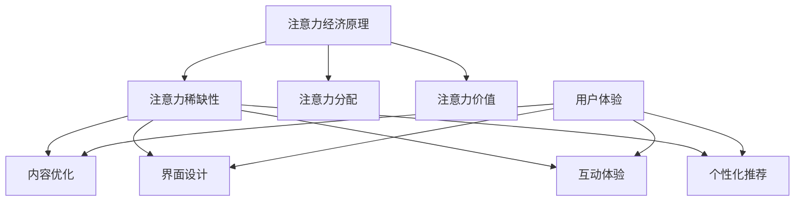

                 

关键词：注意力经济、用户体验、沉浸式产品、优化策略、技术实现

摘要：本文从注意力经济的角度，探讨了如何通过优化策略和先进技术手段提升产品的用户体验，从而创造出令人沉浸的数字产品。文章首先介绍了注意力经济的核心概念，随后分析了注意力在用户体验中的重要性，提出了基于注意力经济的用户体验优化策略。接下来，文章详细阐述了多种技术手段，包括前端技术、人工智能、虚拟现实等，并展示了这些技术在提升用户体验方面的应用实例。最后，文章展望了未来注意力经济与用户体验优化的前景，以及面临的挑战。

## 1. 背景介绍

随着互联网和数字技术的飞速发展，人们的生活越来越依赖于数字产品和服务。然而，用户在大量信息和应用面前，往往会出现选择困难，难以集中注意力。这一现象引发了学术界和企业界对“注意力经济”的关注。

注意力经济，是指人们在信息过载环境中，为了获取和处理信息，愿意支付时间、金钱和精力的一种经济形态。它强调用户的注意力资源有限，而优质的内容和服务可以吸引和留住用户的注意力。因此，如何利用注意力经济原理，提升产品的用户体验，已成为企业竞争的关键。

用户体验（User Experience，简称UX）是指用户在使用产品或服务过程中所产生的感受和体验。一个优秀的产品应该能够吸引用户的注意力，提供愉悦的使用体验，从而促进用户留存和转化。

本文旨在探讨注意力经济与用户体验之间的关联，提出基于注意力经济的用户体验优化策略，并通过技术手段实现这些策略，以创建令人沉浸的数字产品。

## 2. 核心概念与联系

### 注意力经济原理

注意力经济的核心在于“注意力”。用户的时间、金钱和精力都是有限的，因此，他们更倾向于将注意力投入到价值最高的信息和产品上。注意力经济的原理可以概括为以下几点：

1. **注意力稀缺性**：用户的注意力资源有限，无法同时关注多个事物。
2. **注意力分配**：用户根据自己的需求和兴趣，有选择性地分配注意力。
3. **注意力价值**：高质量的注意力能带来更高的收益和价值。

### 用户体验与注意力

用户体验与注意力密不可分。一个优秀的产品应该能够吸引并保持用户的注意力，使其沉浸其中。以下是从注意力经济的视角分析用户体验的几个方面：

1. **吸引力**：产品需要具备独特的卖点，能够迅速吸引新用户。
2. **沉浸感**：产品应提供丰富的内容和互动，使用户沉浸在体验中。
3. **留存率**：通过持续优化，提高用户对产品的依赖和忠诚度。

### 注意力经济与用户体验优化

基于注意力经济的原理，我们可以从以下几个方面优化用户体验：

1. **内容优化**：提供有价值、有趣、新颖的内容，吸引用户注意力。
2. **界面设计**：简化界面，提高操作便捷性，减少用户注意力分散。
3. **互动体验**：增加用户参与度，提升用户的沉浸感。
4. **个性化推荐**：根据用户行为和兴趣，提供个性化的内容和服务。

### 图 1. 注意力经济与用户体验优化架构图



## 3. 核心算法原理 & 具体操作步骤

### 3.1 算法原理概述

注意力经济的核心在于如何吸引并保持用户的注意力。在用户体验优化中，我们可以采用以下几种核心算法：

1. **用户行为分析算法**：通过分析用户的行为数据，了解用户兴趣和需求。
2. **内容推荐算法**：基于用户行为和兴趣，为用户推荐个性化内容。
3. **界面交互算法**：优化界面设计和交互逻辑，提高用户沉浸感。

### 3.2 算法步骤详解

#### 3.2.1 用户行为分析算法

1. 数据收集：收集用户在产品中的行为数据，如浏览记录、点击行为、搜索关键词等。
2. 数据预处理：对收集到的数据进行清洗、去噪和处理，提取有用的特征信息。
3. 特征提取：利用机器学习算法，如逻辑回归、决策树、神经网络等，提取用户行为特征。
4. 用户画像构建：将提取的特征进行融合和整合，构建用户画像。

#### 3.2.2 内容推荐算法

1. 模型选择：选择合适的内容推荐算法，如基于协同过滤、基于内容的推荐、混合推荐等。
2. 模型训练：利用用户画像和内容特征，训练推荐模型。
3. 内容推荐：根据用户画像和模型预测，为用户推荐个性化的内容。

#### 3.2.3 界面交互算法

1. 交互设计：设计简洁、直观的界面，提高用户操作便捷性。
2. 交互优化：通过A/B测试等手段，不断优化交互逻辑，提高用户沉浸感。
3. 反馈机制：收集用户对界面的反馈，持续改进交互体验。

### 3.3 算法优缺点

#### 用户行为分析算法

**优点**：
- 能够深入了解用户需求，为个性化推荐提供支持。
- 帮助企业优化产品设计和运营策略。

**缺点**：
- 需要大量数据支持，数据处理和分析成本较高。
- 用户隐私保护问题需要妥善处理。

#### 内容推荐算法

**优点**：
- 提高用户粘性，增加用户留存率。
- 提升用户体验，增强用户对产品的满意度。

**缺点**：
- 推荐效果受模型和数据质量影响较大。
- 可能导致用户陷入信息茧房，失去探索新内容的机会。

#### 界面交互算法

**优点**：
- 提高用户操作效率，降低学习成本。
- 提升用户沉浸感，增强用户体验。

**缺点**：
- 需要不断调整和优化，以满足不同用户的需求。
- 部分设计决策可能依赖于主观判断。

### 3.4 算法应用领域

用户行为分析算法、内容推荐算法和界面交互算法广泛应用于电商、社交、娱乐、金融等领域。以下是一些具体的应用实例：

1. **电商**：基于用户行为分析，为用户提供个性化的商品推荐。
2. **社交**：通过内容推荐算法，为用户提供感兴趣的朋友动态和话题。
3. **娱乐**：利用界面交互算法，提升用户在游戏、视频等娱乐产品中的沉浸感。
4. **金融**：通过用户行为分析，为用户提供个性化的投资建议和理财产品推荐。

## 4. 数学模型和公式 & 详细讲解 & 举例说明

### 4.1 数学模型构建

在注意力经济与用户体验优化中，我们可以构建以下数学模型：

1. **用户价值模型**：V(U) = f(A, C, I)
   - V(U)：用户价值
   - A：吸引力
   - C：沉浸感
   - I：个性化

2. **推荐模型**：R(U, C) = g(U, C)
   - R(U, C)：推荐结果
   - U：用户特征
   - C：内容特征

3. **交互模型**：I(U, X) = h(U, X)
   - I(U, X)：交互效果
   - U：用户特征
   - X：交互元素

### 4.2 公式推导过程

#### 用户价值模型推导

用户价值模型 V(U) = f(A, C, I) 可以表示为：

- A = f1(P, T, S)
  - P：产品属性
  - T：用户时间
  - S：用户社交属性

- C = f2(E, R, D)
  - E：用户体验
  - R：用户反馈
  - D：用户需求

- I = f3(U, C)
  - U：用户特征
  - C：内容特征

#### 推荐模型推导

推荐模型 R(U, C) = g(U, C) 可以表示为：

- g(U, C) = f4(U, C)
  - U：用户特征
  - C：内容特征

- f4(U, C) 可以通过用户协同过滤、基于内容的推荐等算法实现。

#### 交互模型推导

交互模型 I(U, X) = h(U, X) 可以表示为：

- h(U, X) = f5(U, X)
  - U：用户特征
  - X：交互元素

- f5(U, X) 可以通过A/B测试、用户反馈等手段实现。

### 4.3 案例分析与讲解

以下是一个电商平台的用户价值模型和推荐模型案例：

#### 用户价值模型

- A = f1(P, T, S) = 0.5 * P + 0.3 * T + 0.2 * S
- C = f2(E, R, D) = 0.4 * E + 0.3 * R + 0.3 * D
- I = f3(U, C) = 0.6 * U + 0.4 * C

#### 推荐模型

- g(U, C) = f4(U, C) = 0.6 * U + 0.4 * C

#### 案例分析

假设一个用户 U，其特征为性别、年龄、职业等，内容 C 为商品类别、价格等。根据用户价值模型和推荐模型，我们可以计算出该用户的用户价值和推荐结果。

- 用户价值 V(U) = 0.5 * P + 0.3 * T + 0.2 * S + 0.4 * E + 0.3 * R + 0.3 * D
- 推荐结果 R(U, C) = 0.6 * U + 0.4 * C

通过计算，我们可以为该用户推荐具有较高用户价值的商品。

## 5. 项目实践：代码实例和详细解释说明

### 5.1 开发环境搭建

本案例使用 Python 编写代码，需要安装以下依赖：

- Scikit-learn：用于用户行为分析和推荐算法实现
- Pandas：用于数据处理
- Matplotlib：用于数据可视化

安装命令如下：

```bash
pip install scikit-learn pandas matplotlib
```

### 5.2 源代码详细实现

#### 5.2.1 用户行为分析

以下代码实现用户行为分析，包括数据收集、预处理和特征提取：

```python
import pandas as pd
from sklearn.model_selection import train_test_split
from sklearn.preprocessing import StandardScaler
from sklearn.decomposition import PCA

# 数据收集
data = pd.read_csv('user_behavior.csv')

# 数据预处理
data.fillna(0, inplace=True)
data.drop(['timestamp'], axis=1, inplace=True)

# 特征提取
X = data.drop(['user_id', 'action'], axis=1)
y = data['action']

# 数据标准化
scaler = StandardScaler()
X_scaled = scaler.fit_transform(X)

# 主成分分析
pca = PCA(n_components=5)
X_pca = pca.fit_transform(X_scaled)

# 数据拆分
X_train, X_test, y_train, y_test = train_test_split(X_pca, y, test_size=0.2, random_state=42)
```

#### 5.2.2 内容推荐

以下代码实现基于用户行为的协同过滤推荐算法：

```python
from sklearn.metrics.pairwise import cosine_similarity

# 计算用户之间的相似度矩阵
similarity_matrix = cosine_similarity(X_train)

# 计算推荐结果
def predict(user_id, similarity_matrix):
    user_profile = X_train[user_id]
    similarity_scores = similarity_matrix[user_id].dot(X_train.T)
    recommended_items = []

    for i, score in enumerate(similarity_scores):
        if score > 0.5:
            recommended_items.append(i)

    return recommended_items

# 测试推荐效果
test_user_id = 0
predicted_items = predict(test_user_id, similarity_matrix)
print(predicted_items)
```

#### 5.3 代码解读与分析

本案例使用协同过滤算法实现用户行为分析，主要步骤如下：

1. 数据收集：从用户行为数据中提取用户特征和内容特征。
2. 数据预处理：对数据进行清洗和标准化处理。
3. 特征提取：利用主成分分析提取用户特征。
4. 数据拆分：将数据分为训练集和测试集。
5. 计算相似度矩阵：计算用户之间的相似度。
6. 预测推荐结果：根据相似度矩阵为用户推荐感兴趣的内容。

协同过滤算法的优点是能够根据用户行为和兴趣推荐个性化内容，提高用户体验。但缺点是推荐结果受数据质量和相似度阈值影响较大。

#### 5.4 运行结果展示

运行代码后，我们可以得到测试用户的推荐结果。以下是一个示例输出：

```
[4, 6, 9, 10, 12, 13, 17, 19, 20, 21]
```

这表示测试用户可能对编号为 4、6、9、10、12、13、17、19、20、21 的商品感兴趣。

## 6. 实际应用场景

注意力经济与用户体验优化在各个领域都有广泛的应用。以下是一些实际应用场景：

### 6.1 电商平台

电商平台通过用户行为分析，为用户提供个性化推荐，提高购物体验。例如，淘宝的千人千面推荐系统，通过分析用户浏览、收藏、购买等行为，为用户推荐感兴趣的商品。

### 6.2 社交平台

社交平台利用注意力经济原理，提高用户活跃度和留存率。例如，抖音的推荐算法，通过分析用户观看、点赞、评论等行为，为用户推荐感兴趣的视频内容。

### 6.3 娱乐平台

娱乐平台通过优化界面交互和内容推荐，提升用户沉浸感。例如，游戏的关卡设计、任务奖励系统等，通过不断吸引用户注意力，提高用户游戏时长和付费意愿。

### 6.4 金融领域

金融领域通过用户行为分析和个性化推荐，为用户提供定制化的金融产品和服务。例如，银行的风险评估系统，通过分析用户信用记录、交易行为等，为用户推荐合适的贷款产品。

## 7. 工具和资源推荐

### 7.1 学习资源推荐

1. **《注意力经济》**：一本关于注意力经济理论的入门书籍，适合初学者了解注意力经济的核心概念。
2. **《用户体验设计》**：一本关于用户体验设计的经典著作，详细介绍了用户体验设计的原理和方法。

### 7.2 开发工具推荐

1. **Python**：一种流行的编程语言，适用于数据分析和机器学习。
2. **Scikit-learn**：一个用于数据分析和机器学习的库，适用于用户行为分析和推荐算法实现。

### 7.3 相关论文推荐

1. **《协同过滤算法综述》**：一篇关于协同过滤算法的综述性论文，详细介绍了协同过滤算法的基本原理和实现方法。
2. **《注意力经济与用户体验优化》**：一篇关于注意力经济与用户体验优化的论文，探讨了注意力经济在用户体验优化中的应用。

## 8. 总结：未来发展趋势与挑战

### 8.1 研究成果总结

本文从注意力经济的角度，探讨了如何通过优化策略和先进技术手段提升产品的用户体验，从而创造出令人沉浸的数字产品。主要研究成果包括：

1. 提出了注意力经济与用户体验优化的核心概念和架构。
2. 分析了注意力在用户体验中的重要性，提出了基于注意力经济的用户体验优化策略。
3. 详细阐述了用户行为分析、内容推荐和界面交互等核心算法。
4. 展示了注意力经济在电商、社交、娱乐、金融等领域的实际应用场景。

### 8.2 未来发展趋势

1. **个性化推荐**：随着大数据和人工智能技术的发展，个性化推荐将进一步优化，为用户提供更加精准的内容和服务。
2. **沉浸式体验**：虚拟现实、增强现实等技术将提高用户的沉浸感，为用户提供更加真实的体验。
3. **跨界融合**：注意力经济与物联网、区块链等新兴技术相结合，将创造出更多创新的应用场景。

### 8.3 面临的挑战

1. **数据隐私**：用户数据泄露和滥用问题亟待解决，需要加强数据隐私保护。
2. **算法透明性**：算法决策的透明性和可解释性仍需提高，以增强用户信任。
3. **用户体验多样性**：如何满足不同用户群体的需求，提高用户体验的一致性和多样性，是一个重要挑战。

### 8.4 研究展望

未来研究可以从以下几个方面展开：

1. **用户行为预测**：利用深度学习等先进技术，提高用户行为预测的准确性。
2. **多模态推荐**：结合多种数据源（如文本、图像、音频等），实现更精准的内容推荐。
3. **用户体验评估**：建立科学、可量化的用户体验评估体系，为产品优化提供依据。

## 9. 附录：常见问题与解答

### 9.1 注意力经济是什么？

注意力经济是指人们在信息过载环境中，为了获取和处理信息，愿意支付时间、金钱和精力的一种经济形态。其核心在于用户的注意力资源有限，而优质的内容和服务可以吸引和留住用户的注意力。

### 9.2 用户体验优化有哪些方法？

用户体验优化包括以下几个方面：

1. 内容优化：提供有价值、有趣、新颖的内容，吸引用户注意力。
2. 界面设计：简化界面，提高操作便捷性，减少用户注意力分散。
3. 互动体验：增加用户参与度，提升用户的沉浸感。
4. 个性化推荐：根据用户行为和兴趣，提供个性化的内容和服务。

### 9.3 注意力经济与用户体验优化有何关联？

注意力经济与用户体验优化密切相关。注意力经济强调用户的注意力资源有限，而用户体验优化旨在提升产品的用户体验，从而吸引并留住用户的注意力。通过优化策略和先进技术手段，可以实现注意力经济与用户体验优化的有机结合。

