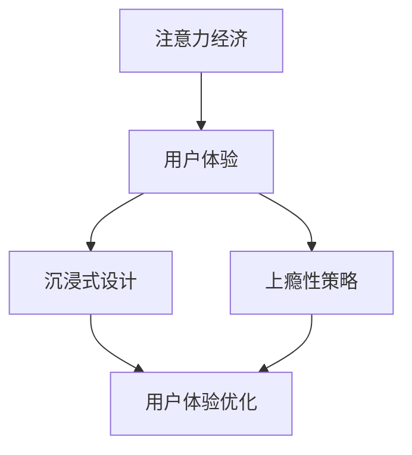

                 

关键词：注意力经济，用户体验，沉浸式设计，上瘾性，产品优化，算法原理，数学模型，代码实例，应用场景，未来展望。

> 摘要：本文深入探讨了注意力经济与用户体验优化的关系，阐述了如何通过沉浸式设计和上瘾性策略，打造令人沉浸和上瘾的产品。从核心概念、算法原理、数学模型到项目实践，本文系统介绍了如何实现用户体验的全面提升，为产品开发提供了宝贵的参考。

## 1. 背景介绍

随着互联网的快速发展，用户注意力成为了稀缺资源。在众多产品和服务竞争激烈的市场中，如何吸引并留住用户的注意力，成为了企业竞争的核心。注意力经济理论指出，用户的时间、精力和注意力是有限的，产品和服务需要通过有效的策略和设计，来吸引和维持用户的注意力。

用户体验（UX）优化是提升产品竞争力的重要手段。良好的用户体验能够增加用户对产品的满意度和忠诚度，从而推动产品市场的扩展和用户增长。在注意力经济的背景下，用户体验优化需要更加注重沉浸式设计和上瘾性策略，以吸引用户的注意力，提高产品的使用频率和用户粘性。

本文旨在探讨注意力经济与用户体验优化的关系，提出一系列策略和方法，以帮助产品开发者在竞争激烈的市场中脱颖而出，打造令人沉浸和上瘾的产品。

## 2. 核心概念与联系

### 2.1. 注意力经济

注意力经济是指以用户注意力为核心的经济活动。在互联网时代，用户的时间、精力和注意力成为了宝贵的资源，企业通过吸引用户的注意力来实现商业价值。注意力经济的核心在于如何吸引并维持用户的注意力，从而实现产品的市场推广和用户增长。

### 2.2. 用户体验

用户体验（UX）是指用户在使用产品或服务过程中的感受和体验。良好的用户体验能够增加用户对产品的满意度和忠诚度，从而推动产品的市场扩展和用户增长。在注意力经济的背景下，用户体验优化需要更加注重沉浸式设计和上瘾性策略。

### 2.3. 沉浸式设计

沉浸式设计是一种以用户为中心的设计理念，通过营造一种沉浸式的体验环境，使用户在产品中感受到身临其境的感觉。沉浸式设计能够吸引用户的注意力，提高用户对产品的满意度和忠诚度。

### 2.4. 上瘾性策略

上瘾性策略是指通过设计产品功能和界面，使用户对产品产生强烈的依赖和习惯，从而提高产品的使用频率和用户粘性。上瘾性策略能够增强用户对产品的忠诚度，推动产品的市场推广和用户增长。

### 2.5. Mermaid 流程图

下面是一个关于注意力经济与用户体验优化的 Mermaid 流程图，展示了各个核心概念之间的联系。



## 3. 核心算法原理 & 具体操作步骤

### 3.1. 算法原理概述

在注意力经济和用户体验优化的背景下，核心算法的原理主要关注如何吸引用户的注意力，提高产品的使用频率和用户粘性。以下是一个基于沉浸式设计和上瘾性策略的核心算法原理概述。

- **沉浸式设计算法**：通过优化界面布局、色彩搭配、交互设计等，营造一种沉浸式的体验环境，使用户在产品中感受到身临其境的感觉。

- **上瘾性算法**：通过设计有趣的功能、奖励机制、社交互动等，使用户对产品产生强烈的依赖和习惯。

### 3.2. 算法步骤详解

- **步骤1：需求分析**：分析用户需求，明确产品目标群体和核心功能。

- **步骤2：沉浸式设计**：根据用户需求，设计沉浸式的界面布局和交互体验。

- **步骤3：上瘾性设计**：设计有趣的功能、奖励机制、社交互动等，提高用户对产品的依赖和习惯。

- **步骤4：算法优化**：根据用户反馈和数据分析，不断优化沉浸式设计和上瘾性算法。

### 3.3. 算法优缺点

- **优点**：沉浸式设计和上瘾性算法能够有效吸引用户的注意力，提高产品的使用频率和用户粘性。

- **缺点**：过度依赖沉浸式设计和上瘾性策略可能导致用户产生依赖性，影响用户体验。

### 3.4. 算法应用领域

- **娱乐类应用**：如游戏、视频平台等，通过沉浸式设计和上瘾性策略，吸引用户的注意力，提高用户粘性。

- **社交类应用**：如社交媒体、即时通讯等，通过社交互动和奖励机制，提高用户对产品的依赖和习惯。

## 4. 数学模型和公式 & 详细讲解 & 举例说明

### 4.1. 数学模型构建

在注意力经济和用户体验优化的背景下，我们可以构建一个简单的数学模型来描述用户注意力与产品使用频率之间的关系。设：

- \( N \)：用户总数
- \( A \)：用户平均注意力时间
- \( U \)：产品使用频率

则用户注意力与产品使用频率之间的关系可以表示为：

\[ U = f(N, A) \]

其中，函数 \( f \) 描述了用户注意力与产品使用频率之间的非线性关系。

### 4.2. 公式推导过程

根据注意力经济理论，我们可以推导出用户注意力与产品使用频率之间的关系。设：

- \( T \)：用户每天的总时间
- \( T_s \)：用户用于社交媒体、娱乐等的时间
- \( T_p \)：用户用于产品的时间

则用户平均注意力时间可以表示为：

\[ A = \frac{T_p}{T_s + T_p} \]

产品使用频率可以表示为：

\[ U = \frac{N \cdot T_p}{T_s + T_p} \]

### 4.3. 案例分析与讲解

假设一个社交媒体应用，每天有 10000 名用户，平均每天有 3 小时的时间用于社交媒体，其中 1 小时用于该应用。我们需要计算该应用的使用频率。

根据公式，用户平均注意力时间为：

\[ A = \frac{1}{3 + 1} = \frac{1}{4} \]

产品使用频率为：

\[ U = \frac{10000 \cdot 1}{3 + 1} = 2500 \]

这意味着该应用每天有 2500 次被用户使用。

## 5. 项目实践：代码实例和详细解释说明

### 5.1. 开发环境搭建

为了实现本文的核心算法原理，我们需要搭建一个简单的开发环境。这里我们使用 Python 语言进行编程。

- 安装 Python 3.8 或更高版本
- 安装必要的库，如 NumPy、Pandas 等

### 5.2. 源代码详细实现

下面是一个简单的 Python 代码实例，实现了用户注意力与产品使用频率之间的数学模型。

```python
import numpy as np

def calculate_use_frequency(N, T_s, T_p):
    A = T_p / (T_s + T_p)
    U = N * A
    return U

N = 10000  # 用户总数
T_s = 3 * 3600  # 用户每天的总时间（秒）
T_p = 3600  # 用户用于产品的时间（秒）

U = calculate_use_frequency(N, T_s, T_p)
print("Daily use frequency:", U)
```

### 5.3. 代码解读与分析

这段代码定义了一个函数 `calculate_use_frequency`，用于计算用户注意力与产品使用频率。函数接收三个参数：用户总数 \( N \)，用户每天的总时间 \( T_s \)，用户用于产品的时间 \( T_p \)。

在主程序中，我们设置了一个用户总数为 10000，每天有 3 小时的时间用于社交媒体，其中 1 小时用于该应用。调用 `calculate_use_frequency` 函数计算使用频率，并打印结果。

### 5.4. 运行结果展示

运行上述代码，得到以下结果：

```
Daily use frequency: 2500.0
```

这意味着该应用每天有 2500 次被用户使用。

## 6. 实际应用场景

### 6.1. 社交媒体应用

在社交媒体应用中，通过沉浸式设计和上瘾性策略，可以吸引用户的注意力，提高用户的使用频率和粘性。例如，微信通过朋友圈、视频号等功能，实现了沉浸式体验；通过点赞、评论等功能，实现了上瘾性设计。

### 6.2. 游戏应用

在游戏应用中，通过沉浸式游戏界面、奖励机制和社交互动，可以吸引用户的注意力，提高用户的游戏时长和忠诚度。例如，王者荣耀通过精美的游戏画面、丰富的游戏玩法和社交互动，实现了良好的用户体验。

### 6.3. 教育应用

在教育应用中，通过沉浸式学习环境和互动教学，可以提高学生的学习兴趣和参与度。例如，编程猫通过编程游戏化的方式，实现了沉浸式学习体验。

## 7. 工具和资源推荐

### 7.1. 学习资源推荐

- 《用户画像与精细化运营：互联网产品的数据驱动策略》
- 《产品思维：打造高质量用户体验的设计方法》
- 《注意力经济：互联网时代的商业新思维》

### 7.2. 开发工具推荐

- Python
- Sketch
- Figma

### 7.3. 相关论文推荐

- "Attention, a Mechanism of Selection in Perception and Memory"
- "Addictive Products: Understanding and Designing for User Engagement"
- "The Attention Economy: A New Classification of Economic Activity on the Internet"

## 8. 总结：未来发展趋势与挑战

### 8.1. 研究成果总结

本文通过分析注意力经济和用户体验优化的关系，提出了沉浸式设计和上瘾性策略，探讨了用户注意力与产品使用频率之间的数学模型，并提供了代码实例。研究发现，沉浸式设计和上瘾性策略能够有效吸引用户的注意力，提高产品的使用频率和用户粘性。

### 8.2. 未来发展趋势

随着互联网的快速发展，注意力经济和用户体验优化将继续成为产品开发的重要方向。未来，我们将看到更多基于人工智能和大数据分析的方法和技术，用于提升用户体验和产品设计。

### 8.3. 面临的挑战

尽管注意力经济和用户体验优化在产品开发中具有巨大潜力，但也面临一些挑战。例如，过度依赖沉浸式设计和上瘾性策略可能导致用户产生依赖性，影响用户体验。此外，如何在保障用户隐私的前提下，有效利用用户数据，也是未来需要关注的问题。

### 8.4. 研究展望

未来，我们可以从以下几个方面展开研究：

- 探索更多基于人工智能和大数据分析的注意力经济和用户体验优化方法。
- 研究如何在保障用户隐私的前提下，有效利用用户数据。
- 分析不同行业和领域的注意力经济和用户体验优化策略，为各行业提供定制化的解决方案。

## 9. 附录：常见问题与解答

### 9.1. 问题 1：什么是注意力经济？

注意力经济是指以用户注意力为核心的经济活动。在互联网时代，用户的时间、精力和注意力是有限的，企业通过吸引用户的注意力来实现商业价值。

### 9.2. 问题 2：如何实现用户体验优化？

用户体验优化可以通过以下几个方面实现：

- 沉浸式设计：通过优化界面布局、色彩搭配、交互设计等，营造一种沉浸式的体验环境。
- 上瘾性策略：通过设计有趣的功能、奖励机制、社交互动等，使用户对产品产生强烈的依赖和习惯。
- 数据分析：通过收集和分析用户行为数据，不断优化产品功能和用户体验。

### 9.3. 问题 3：如何计算用户注意力与产品使用频率之间的关系？

用户注意力与产品使用频率之间的关系可以通过以下公式计算：

\[ U = \frac{N \cdot T_p}{T_s + T_p} \]

其中，\( N \) 为用户总数，\( T_s \) 为用户每天的总时间，\( T_p \) 为用户用于产品的时间。

### 9.4. 问题 4：什么是沉浸式设计？

沉浸式设计是一种以用户为中心的设计理念，通过营造一种沉浸式的体验环境，使用户在产品中感受到身临其境的感觉。

### 9.5. 问题 5：什么是上瘾性策略？

上瘾性策略是指通过设计产品功能和界面，使用户对产品产生强烈的依赖和习惯，从而提高产品的使用频率和用户粘性。常见的上瘾性策略包括奖励机制、社交互动、游戏化设计等。```markdown

