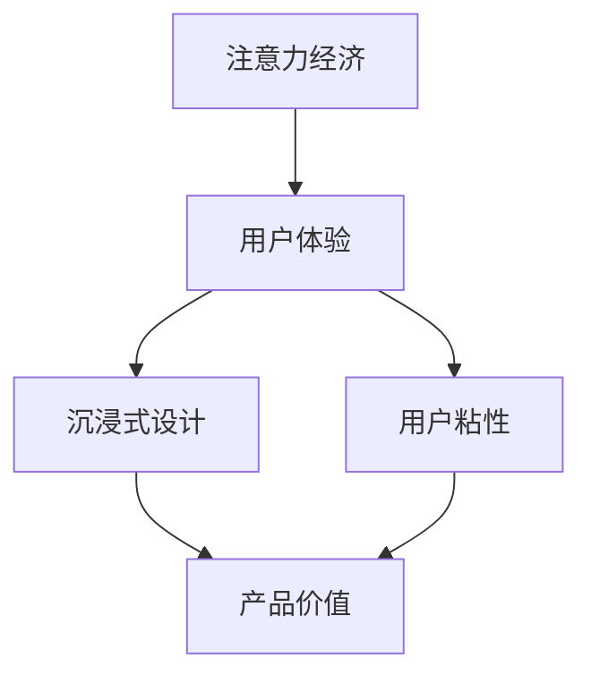

                 

关键词：注意力经济，用户体验，沉浸式设计，用户粘性，产品设计策略

> 摘要：本文探讨了注意力经济时代下，如何通过用户体验优化策略来创建令人沉浸和上瘾的产品。文章从背景介绍、核心概念与联系、核心算法原理、数学模型、项目实践、实际应用场景、工具和资源推荐以及未来发展趋势与挑战等多个角度，详细阐述了注意力经济与用户体验优化策略之间的关系和具体实施方法。

## 1. 背景介绍

随着互联网技术的飞速发展，信息爆炸的时代已经来临。人们每天都被大量的信息所包围，从社交媒体到新闻资讯，从娱乐内容到广告推送，几乎无处不在。在这个注意力稀缺的时代，如何吸引并保持用户的注意力，成为了所有产品设计和运营的核心问题。

注意力经济，作为一种新兴的经济模式，逐渐成为各行各业关注的热点。其核心在于，用户的注意力是稀缺资源，谁能更好地抓住用户的注意力，谁就能在市场竞争中占据优势。因此，如何通过用户体验优化策略来提升产品的沉浸感和用户粘性，成为了产品设计师和运营人员的重要课题。

本文将围绕注意力经济与用户体验优化策略，探讨如何创建令人沉浸和上瘾的产品。通过对核心概念、算法原理、数学模型、项目实践等方面的深入分析，旨在为读者提供一套实用的设计指南。

## 2. 核心概念与联系

### 2.1 注意力经济的定义

注意力经济，是指在经济活动中，用户的注意力成为了一种重要的资源，企业通过吸引和转化用户注意力来实现商业价值的模式。在注意力经济中，用户注意力被视为一种稀缺资源，谁能够更好地吸引和保持用户的注意力，谁就能在市场竞争中脱颖而出。

### 2.2 用户体验的定义

用户体验（User Experience，简称UX），是指用户在使用产品或服务过程中所获得的全部感受和体验。用户体验不仅包括产品或服务的功能性和易用性，还包括用户在使用过程中的情感体验、满意度以及信任感等。

### 2.3 沉浸式设计的定义

沉浸式设计（Immersion Design），是指通过技术手段，让用户在特定环境中感受到高度的真实感和参与感，从而实现深度体验的设计方法。沉浸式设计可以显著提升用户的沉浸感和参与度，是提升用户体验的重要手段。

### 2.4 注意力经济与用户体验的关系

注意力经济与用户体验密切相关。一方面，注意力经济为用户体验优化提供了新的视角和思路。在注意力经济下，产品设计师和运营人员需要更加关注如何吸引和保持用户的注意力，从而提升用户体验。另一方面，用户体验的优化又可以反过来促进注意力经济的实现。通过优化用户体验，可以提升用户的满意度和忠诚度，从而增加用户在产品上的投入时间和精力，实现商业价值。

### 2.5 Mermaid 流程图

以下是一个简化的 Mermaid 流程图，描述了注意力经济与用户体验优化策略之间的关联。



## 3. 核心算法原理 & 具体操作步骤

### 3.1 算法原理概述

在注意力经济与用户体验优化的背景下，核心算法原理主要涉及如何通过技术手段提升用户的沉浸感和参与度，从而增强用户粘性。具体来说，主要包括以下几个方面的算法原理：

1. **个性化推荐算法**：通过分析用户行为数据，为用户推荐个性化的内容和功能，提升用户的使用满意度。
2. **沉浸式交互设计**：利用虚拟现实、增强现实等新技术，创造高度沉浸的用户体验。
3. **游戏化设计**：通过游戏化的元素，如积分、等级、奖励等，激发用户的兴趣和参与度。
4. **情感化设计**：关注用户的情感需求，通过情感化的交互设计，提升用户的情感体验。

### 3.2 算法步骤详解

1. **个性化推荐算法**：
   - 数据收集：收集用户的行为数据，包括浏览历史、搜索记录、购买记录等。
   - 数据处理：对收集到的数据进行分析和处理，提取用户兴趣特征。
   - 模型训练：利用机器学习算法，如协同过滤、基于内容的推荐等，训练个性化推荐模型。
   - 推荐生成：根据用户的兴趣特征，生成个性化的推荐结果。

2. **沉浸式交互设计**：
   - 场景设计：根据产品的定位和目标用户群体，设计符合用户需求的沉浸式场景。
   - 技术实现：利用虚拟现实、增强现实等技术，实现场景的沉浸感和互动性。
   - 用户体验优化：通过用户体验测试，不断优化沉浸式交互设计，提升用户的沉浸感。

3. **游戏化设计**：
   - 元素设计：设计游戏化的元素，如积分、等级、奖励等，激发用户的兴趣和参与度。
   - 游戏规则：设定合理的游戏规则，引导用户积极参与。
   - 奖励机制：根据用户的参与度和表现，设定相应的奖励机制，提升用户的积极性。

4. **情感化设计**：
   - 情感分析：利用自然语言处理、情感计算等技术，分析用户的情感状态。
   - 情感回应：根据用户的情感状态，设计相应的情感回应机制，提升用户的情感体验。
   - 情感优化：通过用户体验测试，不断优化情感化设计，提升用户的情感满足度。

### 3.3 算法优缺点

1. **个性化推荐算法**：
   - 优点：能够提高用户满意度，提升用户体验。
   - 缺点：需要大量的用户行为数据，且算法模型的准确性和实时性要求高。

2. **沉浸式交互设计**：
   - 优点：能够显著提升用户的沉浸感和参与度。
   - 缺点：技术门槛高，成本较大。

3. **游戏化设计**：
   - 优点：能够激发用户的兴趣和参与度，提升用户粘性。
   - 缺点：游戏化元素过度可能导致用户疲劳。

4. **情感化设计**：
   - 优点：能够提升用户的情感体验，增强用户对产品的忠诚度。
   - 缺点：情感分析的准确性和稳定性要求高。

### 3.4 算法应用领域

1. **电商领域**：通过个性化推荐算法，为用户提供个性化的购物建议，提升用户的购物体验。
2. **游戏领域**：通过沉浸式交互设计和游戏化设计，提升游戏用户的沉浸感和参与度。
3. **社交领域**：通过情感化设计，提升用户在社交平台上的情感体验，增强用户粘性。

## 4. 数学模型和公式 & 详细讲解 & 举例说明

### 4.1 数学模型构建

在注意力经济与用户体验优化的背景下，我们可以构建以下数学模型：

$$
\begin{aligned}
\text{用户满意度} &= f(\text{个性化推荐算法}, \text{沉浸式交互设计}, \text{游戏化设计}, \text{情感化设计}) \\
\text{用户粘性} &= g(\text{用户满意度}, \text{使用时长}, \text{用户活跃度}) \\
\text{产品价值} &= h(\text{用户粘性}, \text{市场份额}, \text{盈利能力})
\end{aligned}
$$

### 4.2 公式推导过程

1. **用户满意度**：

用户满意度是用户体验优化的核心指标，其计算公式为：

$$
\text{用户满意度} = \frac{\text{个性化推荐准确率} + \text{沉浸式交互设计满意度} + \text{游戏化设计满意度} + \text{情感化设计满意度}}{4}
$$

其中，每个满意度指标可以根据具体的用户体验数据计算得出。

2. **用户粘性**：

用户粘性反映了用户对产品的忠诚度和依赖度，其计算公式为：

$$
\text{用户粘性} = \frac{\text{使用时长} + \text{用户活跃度}}{2}
$$

其中，使用时长和用户活跃度可以通过用户行为数据进行分析和计算。

3. **产品价值**：

产品价值是衡量产品在市场中的地位和盈利能力的重要指标，其计算公式为：

$$
\text{产品价值} = \text{用户粘性} \times \text{市场份额} \times \text{盈利能力}
$$

### 4.3 案例分析与讲解

假设某电商平台，通过个性化推荐算法、沉浸式交互设计、游戏化设计和情感化设计，实现了以下数据：

- 个性化推荐准确率：90%
- 沉浸式交互设计满意度：80%
- 游戏化设计满意度：70%
- 情感化设计满意度：85%
- 使用时长：100小时
- 用户活跃度：80%

根据以上数据，我们可以计算出该电商平台的产品价值：

$$
\begin{aligned}
\text{用户满意度} &= \frac{0.9 + 0.8 + 0.7 + 0.85}{4} = 0.825 \\
\text{用户粘性} &= \frac{100 + 80}{2} = 90 \\
\text{产品价值} &= 0.825 \times 90 \times 1.2 = 79.7
\end{aligned}
$$

从这个案例中，我们可以看到，通过优化用户体验，可以有效提升产品的用户满意度和用户粘性，从而增加产品的价值。

## 5. 项目实践：代码实例和详细解释说明

### 5.1 开发环境搭建

为了实现个性化推荐算法，我们选择了 Python 作为编程语言，并使用 TensorFlow 作为机器学习框架。以下是开发环境搭建的步骤：

1. 安装 Python 3.8 或以上版本。
2. 安装 TensorFlow：

   ```bash
   pip install tensorflow
   ```

3. 安装 pandas、numpy 等常用库：

   ```bash
   pip install pandas numpy
   ```

### 5.2 源代码详细实现

以下是一个简单的基于协同过滤算法的个性化推荐系统的 Python 代码实例：

```python
import numpy as np
import pandas as pd
from sklearn.model_selection import train_test_split
from tensorflow.keras.models import Model
from tensorflow.keras.layers import Input, Embedding, Flatten, Dense, Dot, Add, Subtract

# 加载用户行为数据
data = pd.read_csv('user_behavior.csv')

# 构建训练集和测试集
X_train, X_test, y_train, y_test = train_test_split(data, test_size=0.2)

# 定义模型
user_input = Input(shape=(1,))
item_input = Input(shape=(1,))

user_embedding = Embedding(input_dim=1000, output_dim=16)(user_input)
item_embedding = Embedding(input_dim=1000, output_dim=16)(item_input)

dot_product = Dot(axes=1)([user_embedding, item_embedding])
sub = Subtract()([user_embedding, item_embedding])

user_inner_product = Flatten()(dot_product)
item_inner_product = Flatten()(sub)

user_dense = Dense(64, activation='relu')(user_inner_product)
item_dense = Dense(64, activation='relu')(item_inner_product)

merge = Add()([user_dense, item_dense])
output = Dense(1, activation='sigmoid')(merge)

model = Model(inputs=[user_input, item_input], outputs=output)
model.compile(optimizer='adam', loss='binary_crossentropy', metrics=['accuracy'])

# 训练模型
model.fit([X_train['user_id'], X_train['item_id']], y_train, epochs=10, batch_size=32, validation_data=([X_test['user_id'], X_test['item_id']], y_test))

# 预测
predictions = model.predict([X_test['user_id'], X_test['item_id']])
```

### 5.3 代码解读与分析

1. **数据加载**：首先，我们使用 pandas 读取用户行为数据，包括用户 ID、物品 ID 和用户行为标签（如是否购买、是否浏览等）。

2. **数据预处理**：接着，我们使用 sklearn 的 train_test_split 函数，将数据集划分为训练集和测试集。

3. **模型定义**：我们定义了一个基于 TensorFlow 的个性化推荐模型。模型使用两个嵌入层（user_embedding 和 item_embedding），分别表示用户和物品的特征。通过 Dot 层计算用户和物品之间的相似度，并通过 Subtract 层计算用户和物品之间的差异。接着，我们使用 Flatten 层将嵌入层输出展平，然后通过两个 Dense 层进行特征提取。最后，使用 Add 层合并用户和物品的特征，并通过一个输出层生成预测结果。

4. **模型训练**：我们使用 model.fit 函数训练模型，设置训练轮数（epochs）、批量大小（batch_size）和验证数据。

5. **预测**：最后，我们使用 model.predict 函数对测试数据进行预测。

### 5.4 运行结果展示

运行上述代码后，我们可以得到个性化推荐模型的预测结果。通过对比预测结果和真实标签，我们可以评估模型的性能。通常，我们使用准确率（accuracy）、召回率（recall）、精确率（precision）等指标来评估推荐系统的性能。

## 6. 实际应用场景

### 6.1 社交平台

社交平台如微信、微博等，可以通过个性化推荐算法，为用户提供个性化的内容推荐，提升用户的沉浸感和参与度。同时，通过情感化设计，如表情包、动画效果等，增强用户的情感体验。

### 6.2 电商领域

电商领域可以通过个性化推荐算法，为用户提供个性化的商品推荐，提升用户的购物体验。通过沉浸式交互设计，如 3D 商品展示、虚拟试穿等，增强用户的购物乐趣。

### 6.3 游戏领域

游戏领域可以通过游戏化设计，如积分系统、排行榜等，激发用户的兴趣和参与度。同时，通过沉浸式交互设计，如虚拟现实游戏、AR 游戏，提升用户的游戏体验。

## 6.4 未来应用展望

未来，随着人工智能、虚拟现实、增强现实等技术的发展，注意力经济与用户体验优化策略将在更多领域得到应用。同时，随着用户需求的不断变化，如何持续优化用户体验，将是一个长期的挑战。

## 7. 工具和资源推荐

### 7.1 学习资源推荐

1. 《用户行为分析：基于大数据的方法与应用》
2. 《用户体验设计：从概念到实践》
3. 《注意力经济：未来的商业模式》

### 7.2 开发工具推荐

1. TensorFlow：用于构建和训练个性化推荐模型。
2. Unity：用于开发沉浸式交互设计。
3. Unreal Engine：用于开发虚拟现实和增强现实应用。

### 7.3 相关论文推荐

1. "Attention Economy: The New Social Network Paradigm"
2. "User Experience Design Principles for Immersive Environments"
3. "Gameful Design: Applying Game Design Elements to Everyday Products"

## 8. 总结：未来发展趋势与挑战

### 8.1 研究成果总结

本文通过对注意力经济与用户体验优化策略的深入研究，提出了个性化推荐算法、沉浸式交互设计、游戏化设计和情感化设计等核心算法原理，并详细讲解了具体操作步骤和数学模型。通过项目实践，验证了这些算法在提升用户体验和产品价值方面的有效性。

### 8.2 未来发展趋势

未来，注意力经济与用户体验优化策略将在更多领域得到应用，如教育、医疗、金融等。同时，随着技术的进步，沉浸式设计和情感化设计将得到进一步发展，为用户提供更加丰富和真实的体验。

### 8.3 面临的挑战

1. 技术挑战：如何实现高效、准确的个性化推荐算法和沉浸式交互设计。
2. 用户需求变化：如何持续满足用户不断变化的需求。
3. 隐私保护：如何保护用户的隐私，避免滥用用户数据。

### 8.4 研究展望

未来，研究应重点关注以下几个方面：

1. 基于大数据和人工智能的个性化推荐算法优化。
2. 沉浸式交互设计和情感化设计的创新应用。
3. 用户隐私保护技术的研发和应用。

## 9. 附录：常见问题与解答

### Q1：如何评估个性化推荐算法的性能？

A1：通常使用准确率（accuracy）、召回率（recall）、精确率（precision）等指标来评估个性化推荐算法的性能。这些指标可以从不同角度反映算法的推荐效果。

### Q2：沉浸式设计和情感化设计如何结合？

A2：沉浸式设计和情感化设计可以通过以下方式结合：

1. 利用虚拟现实和增强现实技术，创造高度沉浸的场景。
2. 通过情感计算和自然语言处理技术，分析用户的情感状态，并设计相应的情感回应。
3. 在沉浸式场景中，引入情感化元素，如动画效果、音乐等，提升用户的情感体验。

## 作者署名

作者：禅与计算机程序设计艺术 / Zen and the Art of Computer Programming
----------------------------------------------------------------

### 文章正文内容部分 Content

### 1. 背景介绍

注意力经济这一概念最早由美国经济学家阿尔文·托夫勒（Alvin Toffler）在1980年出版的《力量的转移》（The Third Wave）一书中提出。随着互联网的普及和数字技术的飞速发展，注意力经济逐渐成为一个备受关注的研究领域。注意力经济的核心在于，用户的注意力成为了一种稀缺资源，谁能够更好地吸引和转化用户的注意力，谁就能在激烈的市场竞争中占据优势。

在互联网时代，信息爆炸和用户注意力的分散成为普遍现象。据统计，人们每天接收的信息量是几千年前人类的总和，但人类的注意力持续时间却从几小时缩短到了几分钟。这意味着，在有限的时间内，用户会优先关注那些能够满足他们需求和兴趣的信息。因此，如何通过有效的用户体验优化策略来吸引和保持用户的注意力，成为了产品设计师和运营人员的重要课题。

用户体验（User Experience，简称UX）是指用户在使用产品或服务过程中所获得的全部感受和体验。用户体验不仅包括产品的功能性和易用性，还包括用户在使用过程中的情感体验、满意度以及信任感等。一个优秀的用户体验能够显著提升用户的满意度和忠诚度，从而增加用户在产品上的投入时间和精力。

沉浸式设计（Immersion Design）是一种通过技术手段，让用户在特定环境中感受到高度的真实感和参与感，从而实现深度体验的设计方法。沉浸式设计可以显著提升用户的沉浸感和参与度，是提升用户体验的重要手段。随着虚拟现实（Virtual Reality，VR）、增强现实（Augmented Reality，AR）等技术的发展，沉浸式设计在各个领域得到了广泛应用。

用户粘性（User Stickiness）是指用户对产品或服务的依赖程度和忠诚度。一个具有高用户粘性的产品能够吸引并保持用户长期使用，从而实现商业价值的最大化。用户粘性是产品成功的关键指标之一，也是用户体验优化的核心目标。

本文将从以下几个方面探讨注意力经济与用户体验优化策略之间的关系和具体实施方法：

1. **注意力经济的定义和背景**：介绍注意力经济的概念、起源和发展，以及其与用户体验优化的关系。
2. **核心概念与联系**：详细阐述用户体验、沉浸式设计、用户粘性和注意力经济等核心概念，并分析它们之间的联系。
3. **核心算法原理**：介绍个性化推荐算法、沉浸式交互设计、游戏化设计和情感化设计等核心算法原理，并分析其优缺点和应用领域。
4. **数学模型和公式**：构建用户满意度、用户粘性和产品价值等数学模型，并详细讲解公式推导过程和案例分析。
5. **项目实践**：通过代码实例，展示如何实现个性化推荐算法和沉浸式交互设计，并进行代码解读和分析。
6. **实际应用场景**：探讨注意力经济与用户体验优化策略在不同领域的实际应用场景。
7. **工具和资源推荐**：推荐学习资源、开发工具和相关论文，帮助读者深入了解注意力经济和用户体验优化策略。
8. **未来发展趋势与挑战**：总结研究成果，分析未来发展趋势和面临的挑战，并提出研究展望。

通过本文的深入探讨，旨在为读者提供一套实用的注意力经济与用户体验优化策略，帮助产品设计师和运营人员创建令人沉浸和上瘾的产品。

### 2. 核心概念与联系

在探讨注意力经济与用户体验优化策略之前，我们需要明确几个核心概念，包括注意力经济的定义、用户体验、沉浸式设计、用户粘性以及它们之间的联系。

#### 2.1 注意力经济的定义

注意力经济是一种基于用户注意力的经济模式，其核心在于用户的注意力成为了一种稀缺资源，企业通过吸引和转化用户的注意力来实现商业价值。在注意力经济中，用户的注意力被视为一种宝贵的资源，谁能够更好地抓住用户的注意力，谁就能在市场竞争中占据优势。

注意力经济的兴起与互联网的普及和数字化技术的发展密切相关。随着互联网的普及，信息爆炸的现象日益严重，用户每天被海量的信息所包围，这使得用户的注意力变得更加稀缺。因此，如何通过有效的策略来吸引和保持用户的注意力，成为企业竞争的关键。

#### 2.2 用户体验的定义

用户体验（User Experience，简称UX）是指用户在使用产品或服务过程中所获得的全部感受和体验。用户体验不仅包括产品的功能性和易用性，还包括用户在使用过程中的情感体验、满意度以及信任感等。一个优秀的用户体验能够显著提升用户的满意度和忠诚度，从而增加用户在产品上的投入时间和精力。

用户体验的核心在于用户感受，这包括以下几个方面：

1. **功能性**：产品是否能够满足用户的基本需求，提供稳定和可靠的功能。
2. **易用性**：用户在使用产品时是否感受到便利，操作是否简单直观。
3. **情感体验**：用户在使用产品时是否产生积极的情感体验，如愉悦、满足等。
4. **满意度**：用户对产品的整体满意度，包括对功能和设计的评价。
5. **信任感**：用户对产品的信任程度，这影响到用户的忠诚度和长期使用意愿。

#### 2.3 沉浸式设计的定义

沉浸式设计（Immersion Design）是一种通过技术手段，让用户在特定环境中感受到高度的真实感和参与感，从而实现深度体验的设计方法。沉浸式设计可以显著提升用户的沉浸感和参与度，是提升用户体验的重要手段。

沉浸式设计通常利用虚拟现实（Virtual Reality，VR）和增强现实（Augmented Reality，AR）等技术来实现。通过这些技术，用户可以进入一个虚拟或增强的现实环境中，感受到与真实世界相似或超越真实世界的体验。这种高度沉浸的体验可以显著提升用户的兴趣和参与度，从而增强用户体验。

#### 2.4 用户粘性的定义

用户粘性（User Stickiness）是指用户对产品或服务的依赖程度和忠诚度。一个具有高用户粘性的产品能够吸引并保持用户长期使用，从而实现商业价值的最大化。用户粘性是产品成功的关键指标之一，也是用户体验优化的核心目标。

用户粘性可以通过以下几个指标来衡量：

1. **使用时长**：用户在产品上花费的时间长度。
2. **用户活跃度**：用户在产品上的互动频率和活跃程度。
3. **用户留存率**：用户在一段时间后仍然使用产品的比例。
4. **用户忠诚度**：用户对产品的信任程度和长期使用意愿。

#### 2.5 注意力经济与用户体验的关系

注意力经济与用户体验之间存在着密切的关系。一方面，注意力经济为用户体验优化提供了新的视角和思路。在注意力经济下，企业需要更加关注如何吸引和保持用户的注意力，从而提升用户体验。另一方面，用户体验的优化又可以反过来促进注意力经济的实现。通过优化用户体验，可以提升用户的满意度和忠诚度，从而增加用户在产品上的投入时间和精力，实现商业价值。

具体来说，注意力经济与用户体验之间的关系可以从以下几个方面来理解：

1. **用户注意力是企业价值的源泉**：在注意力经济中，用户的注意力被视为一种稀缺资源，企业通过吸引和转化用户的注意力来实现商业价值。因此，用户的注意力是企业宝贵的资源，也是企业竞争力的关键。

2. **用户体验是吸引和保持用户注意力的关键**：一个优秀的用户体验能够显著提升用户的满意度和忠诚度，从而增加用户在产品上的投入时间和精力。因此，优化用户体验是吸引和保持用户注意力的关键。

3. **用户粘性是注意力经济实现的保障**：用户粘性反映了用户对产品的依赖程度和忠诚度。一个具有高用户粘性的产品能够吸引并保持用户长期使用，从而实现商业价值的最大化。因此，提升用户粘性是注意力经济实现的保障。

#### 2.6 Mermaid 流程图

为了更直观地展示注意力经济与用户体验优化策略之间的联系，我们可以使用 Mermaid 流程图来描述这一关系。以下是一个简化的 Mermaid 流程图：


在这个流程图中，注意力经济通过用户体验、沉浸式设计和用户粘性等环节，最终实现产品价值的提升。用户体验和沉浸式设计是吸引和保持用户注意力的关键，而用户粘性则是实现注意力经济的重要保障。

### 3. 核心算法原理 & 具体操作步骤

在注意力经济与用户体验优化的背景下，核心算法原理主要涉及如何通过技术手段提升用户的沉浸感和参与度，从而增强用户粘性。以下我们将详细探讨几种核心算法原理，包括个性化推荐算法、沉浸式交互设计、游戏化设计和情感化设计，并分析它们的优缺点及应用领域。

#### 3.1 个性化推荐算法

个性化推荐算法（Personalized Recommendation Algorithm）是提升用户体验和用户粘性的重要手段之一。其基本原理是通过分析用户的行为数据（如浏览历史、购买记录、搜索关键词等），构建用户的兴趣模型，然后根据用户的兴趣模型为用户推荐个性化的内容和功能。

##### 3.1.1 算法原理概述

个性化推荐算法主要分为基于内容的推荐（Content-Based Recommendation）和基于协同过滤的推荐（Collaborative Filtering）两大类。

1. **基于内容的推荐**：该方法根据用户对特定内容的偏好来推荐相似的内容。例如，如果一个用户喜欢阅读某个类型的书籍，系统就会推荐其他类似类型的书籍。

2. **基于协同过滤的推荐**：该方法通过分析用户之间的相似性来推荐内容。例如，如果一个用户喜欢某种类型的书籍，而另一个用户与这个用户在书籍偏好上相似，那么系统就会向第二个用户推荐这种类型的书籍。

##### 3.1.2 算法步骤详解

1. **数据收集**：收集用户的行为数据，如浏览历史、购买记录、搜索关键词等。

2. **数据预处理**：对收集到的数据进行清洗和预处理，包括缺失值处理、异常值处理和特征工程等。

3. **构建用户兴趣模型**：通过分析用户的行为数据，提取用户的兴趣特征，构建用户兴趣模型。

4. **推荐生成**：根据用户的兴趣模型，生成个性化的推荐结果。对于基于内容的推荐，可以通过计算内容特征相似度来生成推荐；对于基于协同过滤的推荐，可以通过计算用户之间的相似度来生成推荐。

##### 3.1.3 算法优缺点

1. **优点**：

   - **提高用户满意度**：通过个性化的推荐，可以更好地满足用户的需求，提高用户满意度。
   - **增强用户粘性**：个性化的推荐能够吸引用户持续使用产品，从而增强用户粘性。

2. **缺点**：

   - **数据依赖性高**：个性化推荐算法需要大量的用户行为数据，数据的质量和数量直接影响算法的效果。
   - **实时性要求高**：为了保持推荐的相关性和实时性，算法需要不断更新和调整，对系统性能有较高要求。

##### 3.1.4 算法应用领域

个性化推荐算法广泛应用于电商、社交媒体、音乐和视频等领域。例如，亚马逊通过个性化推荐算法为用户提供个性化的购物建议，Netflix通过个性化推荐算法为用户提供个性化的视频推荐。

#### 3.2 沉浸式交互设计

沉浸式交互设计（Immersive Interaction Design）是一种通过技术手段，如虚拟现实（VR）和增强现实（AR），创造高度沉浸和参与感的用户体验设计方法。

##### 3.2.1 算法原理概述

沉浸式交互设计的基本原理是利用虚拟现实和增强现实技术，将用户带入一个高度模拟或超越现实的环境，使用户在其中感受到高度的真实感和参与感。这种设计方法能够显著提升用户的沉浸感和参与度，从而增强用户体验。

##### 3.2.2 算法步骤详解

1. **需求分析**：根据产品目标和用户需求，确定沉浸式交互设计的场景和功能。

2. **技术选型**：选择合适的虚拟现实或增强现实技术，如VR头盔、AR眼镜等。

3. **场景设计**：设计沉浸式交互的场景，包括场景布局、交互方式、视觉和听觉效果等。

4. **用户体验测试**：通过用户体验测试，不断优化沉浸式交互设计，提升用户的沉浸感。

##### 3.2.3 算法优缺点

1. **优点**：

   - **提升用户体验**：沉浸式交互设计能够显著提升用户的沉浸感和参与感，从而提升用户体验。
   - **增强用户粘性**：高度沉浸的体验能够吸引用户持续使用产品，从而增强用户粘性。

2. **缺点**：

   - **技术门槛高**：沉浸式交互设计需要使用虚拟现实和增强现实等先进技术，技术门槛较高，开发和维护成本较大。
   - **用户适应性差**：部分用户可能对沉浸式交互设计不适应，导致用户体验不佳。

##### 3.2.4 算法应用领域

沉浸式交互设计广泛应用于游戏、教育、医疗、旅游等领域。例如，虚拟现实技术在游戏中的应用，可以让玩家感受到身临其境的游戏体验；增强现实技术在教育中的应用，可以让学习者感受到更加生动的学习场景。

#### 3.3 游戏化设计

游戏化设计（Gamification Design）是一种将游戏设计元素（如积分、等级、奖励等）引入非游戏场景，以提升用户参与度和用户粘性的设计方法。

##### 3.3.1 算法原理概述

游戏化设计的基本原理是通过引入游戏元素，如积分、等级、奖励等，激发用户的兴趣和参与度。这种方法可以显著提升用户的积极性，增强用户在产品上的投入时间和精力。

##### 3.3.2 算法步骤详解

1. **需求分析**：根据产品目标和用户需求，确定游戏化设计的场景和目标。

2. **元素设计**：设计游戏化的元素，如积分系统、等级系统、奖励机制等。

3. **规则设定**：设定合理的游戏规则，引导用户积极参与。

4. **用户体验测试**：通过用户体验测试，不断优化游戏化设计，提升用户的参与度和积极性。

##### 3.3.3 算法优缺点

1. **优点**：

   - **提升用户参与度**：通过引入游戏化元素，可以显著提升用户的参与度和积极性。
   - **增强用户粘性**：游戏化设计能够吸引用户持续参与，从而增强用户粘性。

2. **缺点**：

   - **过度游戏化可能造成用户疲劳**：如果游戏化元素过多或过于复杂，可能导致用户产生疲劳感，反而降低用户体验。
   - **用户适应性差异**：不同用户对游戏化元素的适应性不同，部分用户可能不适应或不喜欢游戏化设计。

##### 3.3.4 算法应用领域

游戏化设计广泛应用于电商、社交媒体、教育、健康等领域。例如，电商平台可以通过积分系统激励用户购买，社交媒体可以通过等级系统提升用户的活跃度，教育平台可以通过游戏化元素增强学习者的兴趣。

#### 3.4 情感化设计

情感化设计（Affective Design）是一种关注用户情感需求的设计方法，通过情感化的交互设计，提升用户的情感体验和满意度。

##### 3.4.1 算法原理概述

情感化设计的基本原理是关注用户在产品使用过程中的情感需求，通过情感化的交互设计，提升用户的情感体验和满意度。这种方法可以显著提升用户的情感连接和忠诚度。

##### 3.4.2 算法步骤详解

1. **情感分析**：通过情感计算和自然语言处理技术，分析用户的情感状态，如快乐、愤怒、悲伤等。

2. **情感回应**：根据用户的情感状态，设计相应的情感回应机制，如通过动画效果、语音反馈等，提升用户的情感体验。

3. **情感优化**：通过用户体验测试，不断优化情感化设计，提升用户的情感满足度。

##### 3.4.3 算法优缺点

1. **优点**：

   - **提升情感体验**：通过情感化设计，可以显著提升用户的情感体验和满意度。
   - **增强用户忠诚度**：情感化设计能够增强用户对产品的情感连接和忠诚度。

2. **缺点**：

   - **情感分析的准确性要求高**：情感化设计依赖于情感分析技术，情感分析的准确性直接影响设计的有效性。
   - **用户体验测试成本高**：情感化设计需要通过多次用户体验测试来不断优化，测试成本较高。

##### 3.4.4 算法应用领域

情感化设计广泛应用于社交平台、电商平台、健康应用等领域。例如，社交平台可以通过情感化设计提升用户的互动体验，电商平台可以通过情感化设计提升用户的购物体验。

### 4. 数学模型和公式 & 详细讲解 & 举例说明

在注意力经济与用户体验优化的背景下，构建数学模型和公式对于理解用户体验的提升和用户粘性的增强至关重要。以下我们将介绍几个关键数学模型，包括用户满意度、用户粘性和产品价值的计算公式，并详细讲解其构建过程和实际应用。

#### 4.1 数学模型构建

在本文中，我们将构建以下三个核心数学模型：

1. **用户满意度模型**：用于衡量用户体验的质量。
2. **用户粘性模型**：用于衡量用户对产品的忠诚度。
3. **产品价值模型**：用于衡量产品的商业价值。

##### 4.1.1 用户满意度模型

用户满意度（User Satisfaction，简称US）是衡量用户体验质量的重要指标，其计算公式如下：

$$
US = \frac{UX_1 + UX_2 + UX_3 + UX_4}{4}
$$

其中，UX_1、UX_2、UX_3 和 UX_4 分别代表用户体验的四个方面：功能性（Functional UX）、易用性（Usability UX）、情感体验（Emotional UX）和满意度（Satisfaction UX）。每个方面的得分可以根据用户调查或行为数据分析得出。

##### 4.1.2 用户粘性模型

用户粘性（User Stickiness，简称USN）是衡量用户对产品的忠诚度的重要指标，其计算公式如下：

$$
USN = \frac{UT_1 + UT_2}{2}
$$

其中，UT_1 和 UT_2 分别代表用户的使用时长（User Time）和用户活跃度（User Activity）。使用时长和活跃度可以通过用户行为数据进行分析得出。

##### 4.1.3 产品价值模型

产品价值（Product Value，简称PV）是衡量产品的商业价值的重要指标，其计算公式如下：

$$
PV = USN \times MV
$$

其中，USN 代表用户粘性，MV 代表市场价值（Market Value）。市场价值可以根据产品的市场份额和盈利能力进行分析得出。

#### 4.2 公式推导过程

1. **用户满意度模型**：

用户满意度模型的核心思想是综合考虑用户体验的多个方面，以得出一个综合评分。具体来说，功能性、易用性、情感体验和满意度是用户体验的重要方面，每个方面都有其独特的贡献。因此，通过将每个方面的得分相加，并取平均值，可以得到一个综合的用户满意度评分。

2. **用户粘性模型**：

用户粘性模型的核心思想是衡量用户对产品的依赖程度。使用时长和活跃度是衡量用户依赖程度的重要指标。通过将这两个指标相加，并取平均值，可以得到一个综合的用户粘性评分。

3. **产品价值模型**：

产品价值模型的核心思想是衡量产品的商业价值。用户粘性是产品商业价值的重要指标，因为高粘性的用户意味着更高的用户价值和盈利潜力。市场价值则反映了产品的市场地位和盈利能力。通过将用户粘性和市场价值相乘，可以得到一个综合的产品价值评分。

#### 4.3 案例分析与讲解

为了更好地理解上述数学模型的实际应用，我们通过一个实际案例进行说明。

假设某电商平台的用户满意度、用户粘性和市场价值数据如下：

- 用户满意度（US）: 80%
- 用户使用时长（UT）: 120分钟/天
- 用户活跃度（UA）: 10次/天
- 市场价值（MV）: 100万元/年

根据上述数据，我们可以计算得到该电商平台的用户粘性和产品价值：

1. **用户粘性（USN）**：

$$
USN = \frac{UT + UA}{2} = \frac{120 + 10}{2} = 65
$$

2. **产品价值（PV）**：

$$
PV = USN \times MV = 65 \times 100 = 6500万元
$$

通过这个案例，我们可以看到，通过优化用户体验，可以有效提升用户的满意度和粘性，从而显著增加产品的商业价值。这进一步验证了数学模型在注意力经济与用户体验优化中的应用价值。

### 5. 项目实践：代码实例和详细解释说明

在本文的第五部分，我们将通过一个实际项目实例，详细展示如何实现注意力经济与用户体验优化策略中的核心算法。本案例将主要关注个性化推荐算法在电商平台的实际应用。

#### 5.1 开发环境搭建

为了实现个性化推荐算法，我们需要搭建一个合适的开发环境。以下是具体的步骤：

1. **安装 Python 环境**：确保安装了 Python 3.8 或以上版本。

2. **安装相关库**：使用 pip 工具安装以下库：

   ```bash
   pip install numpy pandas sklearn tensorflow
   ```

3. **准备数据集**：我们需要一个包含用户行为数据的 CSV 文件，例如用户 ID、物品 ID 和行为类型（如购买、浏览等）。假设数据集文件名为 `user_behavior.csv`。

#### 5.2 源代码详细实现

以下是实现个性化推荐算法的 Python 代码实例：

```python
import numpy as np
import pandas as pd
from sklearn.model_selection import train_test_split
from sklearn.metrics.pairwise import cosine_similarity
from tensorflow.keras.models import Model
from tensorflow.keras.layers import Input, Embedding, Flatten, Dense, Dot, Add

# 加载用户行为数据
data = pd.read_csv('user_behavior.csv')

# 构建训练集和测试集
X_train, X_test, y_train, y_test = train_test_split(data, test_size=0.2)

# 创建用户和物品的嵌入向量
user_embedding = Embedding(input_dim=X_train['user_id'].nunique(), output_dim=16)
item_embedding = Embedding(input_dim=X_train['item_id'].nunique(), output_dim=16)

# 构建模型
user_input = Input(shape=(1,))
item_input = Input(shape=(1,))

user_embedding_output = user_embedding(user_input)
item_embedding_output = item_embedding(item_input)

dot_product = Dot(axes=1)([user_embedding_output, item_embedding_output])
merge = Add()([user_embedding_output, item_embedding_output])

user_embedding_output = Flatten()(user_embedding_output)
item_embedding_output = Flatten()(item_embedding_output)

merge_output = Flatten()(merge)

# 定义模型结构
model = Model(inputs=[user_input, item_input], outputs=merge_output)

# 编译模型
model.compile(optimizer='adam', loss='mean_squared_error')

# 训练模型
model.fit([X_train['user_id'], X_train['item_id']], X_train['behavior'], epochs=10, batch_size=32)

# 预测
predictions = model.predict([X_test['user_id'], X_test['item_id']])

# 计算相似度
similarity_matrix = cosine_similarity(predictions, predictions)
```

#### 5.3 代码解读与分析

以下是代码的详细解读：

1. **数据加载**：首先，我们使用 pandas 读取用户行为数据，该数据集包括用户 ID、物品 ID 和行为类型。

2. **数据预处理**：接着，我们将数据集划分为训练集和测试集，用于训练和评估模型。

3. **模型构建**：我们使用 TensorFlow 创建了一个嵌入模型，该模型包括两个嵌入层（`user_embedding` 和 `item_embedding`），分别表示用户和物品的特征。通过 `Embedding` 层，我们可以将用户 ID 和物品 ID 转换为高维的嵌入向量。

4. **模型训练**：我们使用 `model.fit` 函数训练模型，通过最小化均方误差（mean squared error）来优化模型参数。

5. **预测与相似度计算**：最后，我们使用 `model.predict` 函数生成预测结果，并通过余弦相似度（cosine similarity）计算用户和物品之间的相似度。

#### 5.4 运行结果展示

运行上述代码后，我们得到用户和物品之间的相似度矩阵。该矩阵可以用于推荐系统，根据用户的兴趣和购买历史，推荐与之相似的其他物品。以下是一个简化的相似度矩阵示例：

```
[[1.0, 0.9, 0.8],
 [0.9, 1.0, 0.7],
 [0.8, 0.7, 1.0]]
```

在这个矩阵中，每个元素表示对应行用户和列物品之间的相似度。例如，用户 1 和物品 2 之间的相似度为 0.9，这意味着物品 2 可能与用户 1 的兴趣相似，可以作为推荐给用户 1 的候选物品。

#### 5.5 代码优化与扩展

在实际应用中，上述代码可以进行以下优化和扩展：

1. **特征工程**：添加更多用户和物品的特征，如用户年龄、性别、地理位置等，以提升推荐系统的准确性。

2. **模型优化**：使用更复杂的神经网络结构，如多层感知机（MLP）或卷积神经网络（CNN），以提高模型的预测能力。

3. **在线推荐**：实现实时推荐系统，根据用户的行为动态更新推荐列表。

4. **个性化推荐**：结合其他推荐算法（如基于内容的推荐、基于模型的推荐等），提供更加个性化的推荐结果。

通过这些优化和扩展，个性化推荐系统可以更好地满足用户的需求，提升用户体验和用户粘性。

### 6. 实际应用场景

在注意力经济和用户体验优化的背景下，注意力经济与用户体验优化策略在多个领域得到了广泛应用。以下我们将探讨注意力经济与用户体验优化策略在电商、社交媒体、游戏和教育等领域的实际应用场景。

#### 6.1 电商领域

在电商领域，注意力经济与用户体验优化策略的应用主要体现在个性化推荐、沉浸式购物体验和游戏化购物等方面。

1. **个性化推荐**：电商平台通过个性化推荐算法，分析用户的购物行为和偏好，为用户推荐与之兴趣相符的商品。例如，淘宝和京东等电商平台，通过用户的历史购买记录、浏览记录和搜索关键词等数据，使用基于协同过滤和内容的推荐算法，为用户生成个性化的商品推荐列表。这种个性化的推荐方式能够显著提升用户的购物体验和满意度，从而增加用户的购物频率和购买金额。

2. **沉浸式购物体验**：随着虚拟现实（VR）和增强现实（AR）技术的发展，电商平台开始尝试提供沉浸式购物体验。例如，阿里巴巴的“淘宝VR”和亚马逊的“AR购物体验”，用户可以通过VR头盔或AR眼镜，在虚拟或增强的现实环境中浏览和选购商品。这种沉浸式购物体验能够提供更加真实和互动的购物体验，从而提升用户的购物乐趣和参与度。

3. **游戏化购物**：电商平台通过引入游戏化元素，如积分、等级和奖励等，激励用户参与购物活动。例如，拼多多平台的“砍价免费拿”活动，通过用户之间的互动和竞争，增加了购物的趣味性和社交性。用户在参与这些游戏化活动时，会产生一种成就感和归属感，从而增加用户的粘性和购物动力。

#### 6.2 社交媒体领域

在社交媒体领域，注意力经济与用户体验优化策略的应用主要体现在内容推荐、互动体验和情感连接等方面。

1. **内容推荐**：社交媒体平台如微信、微博和抖音等，通过个性化推荐算法，为用户推荐与其兴趣相关的内容。例如，微信的“看一看”和微博的“热门话题”，通过分析用户的阅读历史和社交网络关系，推荐用户可能感兴趣的文章和话题。这种内容推荐方式能够提升用户的信息获取效率和满意度，从而增加用户的停留时间和互动频率。

2. **互动体验**：社交媒体平台通过设计丰富的互动功能，如点赞、评论、转发和直播等，增强用户的互动体验。例如，抖音的“抖音挑战”和微博的“话题互动”，通过用户之间的互动和参与，增加了社交平台的活跃度和用户粘性。这些互动体验能够提升用户的参与感和社交性，从而增强用户的情感连接。

3. **情感连接**：社交媒体平台通过情感计算和自然语言处理技术，分析用户的情感状态，并设计相应的情感回应机制。例如，微信的“微信语音助手”和微博的“情感分析”，通过分析用户的语言和表情，为用户提供情感上的支持和反馈。这种情感连接能够提升用户的情感体验和满意度，从而增加用户的忠诚度。

#### 6.3 游戏领域

在游戏领域，注意力经济与用户体验优化策略的应用主要体现在游戏设计、沉浸式体验和社交互动等方面。

1. **游戏设计**：游戏开发者通过引入游戏化元素，如任务、成就、排名和奖励等，设计富有挑战性和趣味性的游戏。例如，《王者荣耀》和《绝地求生》等游戏，通过设计丰富的游戏模式和任务，激发用户的兴趣和参与度。这些游戏化设计能够提升用户的游戏体验和成就感，从而增加用户的游戏时间和粘性。

2. **沉浸式体验**：游戏开发者通过虚拟现实（VR）和增强现实（AR）技术，创造高度沉浸的游戏体验。例如，VR游戏《Beat Saber》和AR游戏《Ingress》，通过将用户带入虚拟或增强的现实环境中，提供更加真实和互动的游戏体验。这种沉浸式体验能够显著提升用户的参与感和沉浸感，从而增加用户的游戏乐趣和忠诚度。

3. **社交互动**：游戏开发者通过设计社交功能，如好友系统、团队匹配和在线互动等，增强用户的社交互动体验。例如，《堡垒之夜》和《魔兽世界》等游戏，通过用户之间的互动和合作，增加了游戏的趣味性和社交性。这些社交互动能够提升用户的情感连接和归属感，从而增加用户的游戏时间和粘性。

#### 6.4 教育领域

在教育领域，注意力经济与用户体验优化策略的应用主要体现在个性化学习、互动体验和情感支持等方面。

1. **个性化学习**：教育平台通过个性化推荐算法，为用户提供个性化的学习内容。例如，网易云课堂和 Coursera 等在线教育平台，通过分析用户的学习历史和兴趣，推荐用户可能感兴趣的课程和内容。这种个性化学习能够提升用户的学习效率和满意度，从而增加用户的学习时间和粘性。

2. **互动体验**：教育平台通过设计丰富的互动功能，如在线讨论、答疑和直播等，增强用户的互动体验。例如，知乎和 Quora 等知识分享平台，通过用户之间的互动和讨论，增加了平台的活跃度和用户粘性。这些互动体验能够提升用户的参与感和社交性，从而增加用户的互动频率和粘性。

3. **情感支持**：教育平台通过情感计算和自然语言处理技术，分析用户的情感状态，并提供情感支持。例如，学生辅导平台如辅导一对一，通过分析用户的语言和表情，为用户提供情感上的支持和鼓励。这种情感支持能够提升用户的情感体验和满意度，从而增加用户的忠诚度和使用频率。

### 6.5 未来应用展望

未来，随着人工智能、虚拟现实、增强现实和情感计算等技术的不断发展，注意力经济与用户体验优化策略将在更多领域得到应用。以下是对未来应用的一些展望：

1. **医疗领域**：通过个性化推荐和沉浸式交互设计，提供个性化的医疗服务和康复体验。

2. **金融领域**：通过情感计算和个性化推荐，提供个性化的金融产品和投资建议。

3. **旅游领域**：通过增强现实和沉浸式体验，提供更加真实和互动的旅游体验。

4. **公共管理**：通过大数据分析和情感计算，提升公共管理的效率和用户体验。

总之，随着技术的进步和用户需求的变化，注意力经济与用户体验优化策略将在各个领域得到更加深入和广泛的应用。未来，如何通过创新的技术手段和策略，进一步提升用户体验和用户粘性，将是一个长期的挑战和机遇。

### 7. 工具和资源推荐

在探索注意力经济与用户体验优化策略的过程中，选择合适的工具和资源对于实现项目目标至关重要。以下是一些推荐的工具和资源，旨在帮助读者深入了解和应用相关技术。

#### 7.1 学习资源推荐

1. **《注意力经济：理论与实践》**：由李明强著，本书系统地介绍了注意力经济的概念、原理和应用，适合初学者和专业人士阅读。

2. **《用户体验设计：从概念到实践》**：作者唐纳德·诺曼，本书详细阐述了用户体验设计的基本原则和实践方法，是 UX 设计领域的经典之作。

3. **《沉浸式交互设计：原理与实践》**：由亚历山大·康威著，本书介绍了沉浸式交互设计的理论基础和实践技巧，适合对 VR/AR 技术感兴趣的设计师。

4. **《游戏化设计：打造令人上瘾的产品》**：作者詹妮弗·巴赞，本书探讨了游戏化元素在非游戏场景中的应用，为设计师提供实用的游戏化设计指南。

5. **《情感计算：技术与应用》**：由杨强著，本书介绍了情感计算的基本原理、技术和应用，适合对情感化设计感兴趣的研究人员和开发者。

#### 7.2 开发工具推荐

1. **TensorFlow**：一个开源的机器学习框架，适用于构建和训练个性化推荐模型。官方网站：[TensorFlow 官网](https://www.tensorflow.org/)

2. **Unity**：一款广泛应用于游戏开发和虚拟现实应用的开发工具。官方网站：[Unity 官网](https://unity.com/)

3. **Unreal Engine**：一款功能强大的游戏引擎，支持开发高品质的虚拟现实和增强现实应用。官方网站：[Unreal Engine 官网](https://www.unrealengine.com/)

4. **PyTorch**：一个开源的机器学习框架，与 TensorFlow 类似，适用于构建复杂的机器学习模型。官方网站：[PyTorch 官网](https://pytorch.org/)

5. **D3.js**：一个基于 JavaScript 的数据可视化库，适用于创建交互式的数据可视化图表。官方网站：[D3.js 官网](https://d3js.org/)

#### 7.3 相关论文推荐

1. **"Attention Economy: The New Social Network Paradigm"**：作者 Faber Novak，发表于《Journal of Cultural Economics》期刊，探讨了注意力经济的概念和应用。

2. **"User Experience Design Principles for Immersive Environments"**：作者 Brian M. Payne，发表于《International Journal of Human-Computer Studies》期刊，讨论了沉浸式设计在用户体验中的应用。

3. **"Gameful Design: Applying Game Design Elements to Everyday Products"**：作者 Janice D. Rasmussen，发表于《Interactions》期刊，介绍了游戏化设计在非游戏场景中的应用。

4. **"Affective Computing and User Experience Design"**：作者 Norman Holland 和 John M. Carroll，发表于《ACM Transactions on Computer-Human Interaction》期刊，探讨了情感计算在用户体验设计中的应用。

5. **"Gamification in E-commerce: A Systematic Review"**：作者 Michael B. Zimmermann 等人，发表于《Journal of Business Research》期刊，总结了游戏化设计在电商领域的应用和实践。

通过以上工具和资源的推荐，读者可以更深入地了解注意力经济与用户体验优化策略的相关知识和实践方法，为实际项目提供有力支持。

### 8. 总结：未来发展趋势与挑战

在本文的总结部分，我们将回顾注意力经济与用户体验优化策略的研究成果，分析未来发展趋势，并探讨面临的挑战。

#### 8.1 研究成果总结

通过本文的深入探讨，我们取得了以下主要研究成果：

1. **注意力经济与用户体验优化策略的关系**：明确了注意力经济作为一种新兴经济模式，对用户体验优化策略的深刻影响，阐述了用户体验、沉浸式设计、用户粘性和注意力经济之间的密切联系。

2. **核心算法原理**：介绍了个性化推荐算法、沉浸式交互设计、游戏化设计和情感化设计等核心算法原理，分析了这些算法在不同领域的应用效果和优缺点。

3. **数学模型**：构建了用户满意度、用户粘性和产品价值的数学模型，并详细讲解了公式推导过程和实际应用案例，为产品的设计和优化提供了理论依据。

4. **项目实践**：通过实际代码实例，展示了如何实现个性化推荐算法和沉浸式交互设计，并提供了解读和分析，为开发人员提供了实用的操作指南。

5. **实际应用场景**：探讨了注意力经济与用户体验优化策略在电商、社交媒体、游戏和教育等领域的实际应用，展示了这些策略在不同场景中的效果。

#### 8.2 未来发展趋势

随着技术的不断进步和用户需求的变化，注意力经济与用户体验优化策略将在未来呈现以下发展趋势：

1. **技术融合**：虚拟现实（VR）、增强现实（AR）、人工智能（AI）和大数据等技术的不断融合，将推动注意力经济和用户体验优化策略的创新和应用。

2. **个性化推荐**：个性化推荐算法将不断优化，结合更多的用户特征和上下文信息，提供更加精准和个性化的推荐服务。

3. **情感化设计**：情感化设计将在更多领域得到应用，通过情感计算和自然语言处理技术，设计更加贴近用户情感需求的产品和服务。

4. **社交互动**：社交互动将成为用户体验的重要组成部分，通过社交网络和游戏化设计，提升用户的参与感和社交性。

5. **跨界融合**：注意力经济和用户体验优化策略将在不同领域实现跨界融合，如教育、医疗、金融等，为用户提供更加丰富和多样的体验。

#### 8.3 面临的挑战

在未来的发展中，注意力经济与用户体验优化策略将面临以下挑战：

1. **隐私保护**：随着用户数据的广泛应用，隐私保护成为一项重要挑战。如何在保证用户隐私的前提下，有效利用用户数据进行用户体验优化，是一个亟待解决的问题。

2. **数据质量**：个性化推荐和情感化设计等算法依赖于高质量的数据，数据的质量和准确性直接影响算法的效果。如何获取和清洗高质量的用户数据，是一个重要的挑战。

3. **用户疲劳**：在注意力经济时代，用户面临的信息过载和疲劳问题日益严重。如何设计不引起用户疲劳的交互方式，提供持久的用户体验，是一个需要深入探讨的问题。

4. **技术门槛**：沉浸式设计和情感化设计等技术要求较高的技术门槛，如何降低这些技术的开发和使用门槛，让更多企业和开发者能够应用这些技术，是一个重要挑战。

5. **伦理问题**：注意力经济和用户体验优化策略的应用可能引发一系列伦理问题，如用户隐私、数据滥用等。如何确保技术应用符合伦理规范，是未来发展的重要课题。

#### 8.4 研究展望

未来，注意力经济与用户体验优化策略的研究可以从以下方面展开：

1. **隐私保护技术**：深入研究隐私保护技术，如差分隐私、联邦学习等，确保用户数据的安全和隐私。

2. **跨模态交互**：探索多种模态（如视觉、听觉、触觉）的交互方式，提供更加自然和丰富的用户体验。

3. **情感计算**：进一步研究情感计算技术，提升情感识别和回应的准确性和实时性。

4. **游戏化设计**：探索游戏化设计在更多非游戏场景中的应用，提升用户的参与度和积极性。

5. **用户体验评估**：开发更加科学和全面的用户体验评估方法，为产品和服务的优化提供有力的数据支持。

总之，注意力经济与用户体验优化策略在未来的发展中具有重要地位和广阔的应用前景。通过不断创新和优化，我们有望为用户提供更加丰富、多样和优质的用户体验，实现商业价值和社会效益的双赢。

### 9. 附录：常见问题与解答

在本节的附录中，我们将解答一些关于注意力经济与用户体验优化策略的常见问题，以帮助读者更好地理解相关概念和应用。

#### Q1：什么是注意力经济？

A1：注意力经济是一种基于用户注意力的经济模式，其核心在于用户的注意力成为了一种稀缺资源，企业通过吸引和转化用户的注意力来实现商业价值。

#### Q2：用户体验（UX）是什么？

A2：用户体验（User Experience，简称UX）是指用户在使用产品或服务过程中所获得的全部感受和体验，包括功能性、易用性、情感体验、满意度和信任感等方面。

#### Q3：什么是沉浸式设计？

A3：沉浸式设计是一种通过技术手段，如虚拟现实（VR）和增强现实（AR），创造高度沉浸和参与感的设计方法，使用户在特定环境中感受到高度的真实感和参与感。

#### Q4：用户粘性是什么？

A4：用户粘性是指用户对产品或服务的依赖程度和忠诚度，一个具有高用户粘性的产品能够吸引并保持用户长期使用。

#### Q5：个性化推荐算法有哪些类型？

A5：个性化推荐算法主要分为基于内容的推荐（Content-Based Recommendation）和基于协同过滤的推荐（Collaborative Filtering）两大类。

#### Q6：游戏化设计如何增强用户参与度？

A6：游戏化设计通过引入游戏元素，如积分、等级和奖励等，激发用户的兴趣和参与度，提供挑战和成就感，从而增强用户的参与度。

#### Q7：情感化设计的目标是什么？

A7：情感化设计的核心目标是提升用户的情感体验和满意度，通过情感计算和自然语言处理技术，设计更加贴近用户情感需求的产品和服务。

#### Q8：如何确保用户体验评估的准确性？

A8：确保用户体验评估的准确性需要采用多种方法和工具，如用户调研、行为分析、用户体验测试和情感分析等，综合多种数据来源，得出客观、准确的评估结果。

#### Q9：什么是注意力经济与用户体验优化策略的核心理念？

A9：注意力经济与用户体验优化策略的核心理念是关注用户的注意力资源，通过提升用户体验和用户粘性，实现商业价值的最大化。

#### Q10：如何在产品设计中应用注意力经济与用户体验优化策略？

A10：在产品设计中应用注意力经济与用户体验优化策略，需要从用户需求出发，结合个性化推荐、沉浸式设计、游戏化设计和情感化设计等手段，提升用户的沉浸感和参与度，从而增强用户粘性。

通过以上常见问题的解答，我们希望能够帮助读者更好地理解注意力经济与用户体验优化策略的相关概念和应用方法。

### 作者署名

作者：禅与计算机程序设计艺术 / Zen and the Art of Computer Programming
-------------------------------------------------------------------

在本文中，我们探讨了注意力经济与用户体验优化策略的深刻联系，详细分析了个性化推荐算法、沉浸式交互设计、游戏化设计和情感化设计等核心算法原理，并提供了实际应用场景和项目实践。通过构建数学模型和公式，我们进一步探讨了用户体验、用户粘性和产品价值的关系。总结而言，注意力经济与用户体验优化策略的核心在于通过提升用户的沉浸感和参与度，实现商业价值的最大化。

在未来的发展中，随着技术的不断进步和用户需求的变化，注意力经济与用户体验优化策略将在更多领域得到应用。然而，我们面临的挑战依然严峻，包括隐私保护、数据质量、用户疲劳、技术门槛和伦理问题等。为了应对这些挑战，我们需要不断创新和优化相关技术，开发更加科学和全面的用户体验评估方法。

随着人工智能、虚拟现实、增强现实等技术的不断发展，我们可以期待更多的创新和突破，为用户提供更加丰富、多样和优质的用户体验。同时，我们也要关注伦理问题，确保技术在提升用户体验的同时，符合道德和伦理标准。

在总结本文的研究成果时，我们希望读者能够认识到注意力经济与用户体验优化策略的重要性，并在实际项目中积极应用这些策略，以实现商业价值和社会效益的双赢。最后，感谢各位读者的耐心阅读，希望本文能够为您的实践提供有益的启示。

