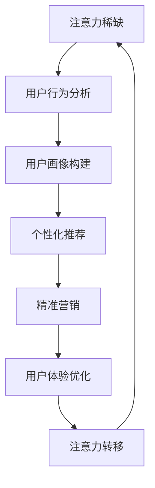

                 

关键词：注意力经济、用户体验、产品设计、用户行为分析、数据驱动设计

> 摘要：在当今信息过载的时代，获取用户的注意力成为企业竞争的关键。本文从注意力经济的基本原理出发，探讨了如何通过用户体验设计思维来创造引人入胜的产品，从而提升用户粘性和忠诚度。文章详细分析了用户行为的驱动力，并结合具体案例，阐述了数据驱动的设计方法在实际产品中的应用。

## 1. 背景介绍

### 注意力经济的崛起

随着互联网的普及和智能设备的广泛应用，人们的生活节奏加快，信息获取变得前所未有的便捷。然而，这也带来了一个显著的问题：信息过载。人们每天被大量的信息所包围，而能够真正被关注的只有少数。这种现象催生了“注意力经济”的概念。

注意力经济是指，在信息爆炸的时代，用户的注意力成为一种稀缺资源，谁能吸引到用户的注意力，谁就能在市场中获得优势。因此，如何利用有限的时间来吸引和维持用户的注意力，成为企业关注的焦点。

### 用户体验的重要性

用户体验（User Experience, UX）是衡量产品成败的关键因素。一个优秀的产品不仅要有强大的功能，还要能够满足用户的需求，提供愉悦的体验。用户体验设计旨在通过理解用户行为和心理，提升产品的可用性、易用性和满意度。

用户体验的重要性体现在以下几个方面：

1. **用户粘性**：良好的用户体验能够增加用户对产品的依赖和重复使用率。
2. **品牌认知**：用户体验直接影响用户对品牌的认知和评价，进而影响市场竞争力。
3. **商业价值**：提升用户体验可以降低用户获取成本，提高用户转化率和忠诚度。

### 用户体验设计的思维

用户体验设计不仅是一种技术手段，更是一种思维模式。它强调从用户的角度出发，关注用户的感知、情感和行为。用户体验设计的核心原则包括：

1. **以用户为中心**：深入了解用户需求，将用户放在设计过程的中心。
2. **简洁性**：减少冗余，简化操作流程，降低用户的学习成本。
3. **一致性**：保持产品界面和交互的一致性，增强用户对产品的信任感。
4. **反馈机制**：及时响应用户的反馈，不断优化产品。

## 2. 核心概念与联系

### 注意力经济的核心概念

注意力经济的基本概念包括：

1. **注意力稀缺**：在信息过载的环境中，用户的注意力是有限的。
2. **注意力转移**：用户可以自由选择关注哪些信息，哪些产品能够成功吸引和转移用户的注意力。
3. **注意力交易**：企业通过提供有价值的内容或服务来换取用户的注意力。

### 用户行为分析的核心概念

用户行为分析是用户体验设计的基础。它包括以下核心概念：

1. **用户旅程**：分析用户在使用产品过程中的每一步，理解用户的行为模式。
2. **行为数据**：收集用户的行为数据，包括点击、浏览、停留时间、转化率等。
3. **用户画像**：通过对用户数据的分析，构建用户画像，了解用户的基本特征和需求。

### 用户行为分析与注意力经济的联系

用户行为分析与注意力经济紧密相关。通过用户行为分析，企业可以了解用户的需求和偏好，从而优化产品设计，提高产品的吸引力。以下是用户行为分析与注意力经济的联系：

1. **精准营销**：通过分析用户行为，企业可以更精准地推送用户感兴趣的内容，提高营销效果。
2. **个性化推荐**：基于用户行为数据，提供个性化的推荐，增加用户对产品的兴趣和粘性。
3. **用户体验优化**：通过分析用户行为，发现用户体验中的问题，及时进行优化，提升用户满意度。

### Mermaid 流程图

以下是一个简化的 Mermaid 流程图，展示了用户行为分析与注意力经济之间的联系：



## 3. 核心算法原理 & 具体操作步骤

### 3.1 算法原理概述

用户行为分析通常基于机器学习算法，其中最常用的是协同过滤（Collaborative Filtering）算法。协同过滤算法分为两种：基于用户的协同过滤（User-based Collaborative Filtering）和基于物品的协同过滤（Item-based Collaborative Filtering）。

- **基于用户的协同过滤**：通过寻找与目标用户相似的用户，推荐这些用户喜欢的物品。
- **基于物品的协同过滤**：通过分析物品之间的关系，推荐与目标物品相似的物品。

### 3.2 算法步骤详解

以下是基于用户的协同过滤算法的详细步骤：

1. **用户相似度计算**：
   - **计算用户之间的相似度**：通常使用余弦相似度或皮尔逊相关系数。
   - **筛选相似用户**：设定一个相似度阈值，只保留相似度较高的用户。

2. **推荐列表生成**：
   - **计算目标用户与相似用户之间的评分差异**。
   - **加权计算**：对相似用户的评分差异进行加权，权重取决于相似度。
   - **排序和选择**：根据加权评分，生成推荐列表。

3. **推荐结果反馈与优化**：
   - **收集用户反馈**：记录用户对推荐物品的评分和点击行为。
   - **调整推荐策略**：根据用户反馈，优化推荐算法和策略。

### 3.3 算法优缺点

**优点**：

- **个性化推荐**：能够根据用户的历史行为和偏好，提供个性化的推荐。
- **实时性**：基于用户实时行为，提供及时、动态的推荐。

**缺点**：

- **冷启动问题**：对于新用户或新物品，由于缺乏历史数据，难以进行有效的推荐。
- **数据依赖性**：算法效果很大程度上取决于用户行为数据的准确性和完整性。

### 3.4 算法应用领域

用户行为分析算法在多个领域有广泛应用：

- **电子商务**：个性化商品推荐，提高用户购买转化率。
- **社交媒体**：内容推荐，增加用户活跃度和留存率。
- **在线教育**：个性化课程推荐，提升学习效果。
- **医疗健康**：患者行为分析，提供个性化的健康建议。

### 3.5 注意力经济在用户行为分析中的应用

注意力经济在用户行为分析中的应用主要体现在以下几个方面：

1. **提高用户粘性**：通过个性化推荐，增加用户对产品的使用频率和时长。
2. **增强用户满意度**：提供符合用户兴趣的内容或服务，提高用户满意度。
3. **降低用户流失率**：通过实时分析用户行为，及时发现用户需求变化，提供及时的反馈和优化。

## 4. 数学模型和公式 & 详细讲解 & 举例说明

### 4.1 数学模型构建

用户行为分析中的核心数学模型是基于概率论和统计学的方法。以下是一个简单的概率模型，用于预测用户对物品的评分。

设用户 \(u\) 对物品 \(i\) 的评分为 \(r_{ui}\)，用户 \(u\) 对所有物品的平均评分为 \(\bar{r_u}\)。物品 \(i\) 的平均评分为 \(\bar{r_i}\)。则用户 \(u\) 对物品 \(i\) 的评分预测模型为：

\[ r_{ui}^* = \bar{r_u} + (\bar{r_i} - \bar{r_u}) \cdot \sigma(u, i) \]

其中，\(\sigma(u, i)\) 表示用户 \(u\) 和物品 \(i\) 之间的相似度。

### 4.2 公式推导过程

为了推导上述模型，我们首先定义用户 \(u\) 和物品 \(i\) 的评分差异为：

\[ d_{ui} = r_{ui} - \bar{r_u} \]

物品 \(i\) 的评分差异为：

\[ d_i = \bar{r_i} - \bar{r_u} \]

则用户 \(u\) 对物品 \(i\) 的评分预测为：

\[ r_{ui}^* = \bar{r_u} + d_i \]

为了引入相似度，我们假设相似度与评分差异成正比，比例因子为 \(\alpha\)，则：

\[ \sigma(u, i) = \alpha \cdot d_i \]

代入上式，得到：

\[ r_{ui}^* = \bar{r_u} + \alpha \cdot d_i \]

令 \(\alpha \cdot \bar{r_u} = \beta\)，则最终模型为：

\[ r_{ui}^* = \beta + \alpha \cdot d_i \]

### 4.3 案例分析与讲解

假设有一个用户 \(u\) 对10个物品的评分数据，如下表所示：

| 物品ID | 用户评分 |
|--------|---------|
| 1      | 5       |
| 2      | 4       |
| 3      | 3       |
| 4      | 5       |
| 5      | 2       |
| 6      | 4       |
| 7      | 4       |
| 8      | 1       |
| 9      | 4       |
| 10     | 5       |

用户 \(u\) 的平均评分为：

\[ \bar{r_u} = \frac{5 + 4 + 3 + 5 + 2 + 4 + 4 + 1 + 4 + 5}{10} = 3.6 \]

物品的平均评分为：

\[ \bar{r_i} = \frac{5 + 4 + 3 + 5 + 2 + 4 + 4 + 1 + 4 + 5}{10} = 3.6 \]

假设相似度比例因子 \(\alpha = 0.2\)，则用户 \(u\) 对物品 8 的评分预测为：

\[ r_{8i}^* = 3.6 + 0.2 \cdot (3.6 - 3.6) = 3.6 \]

这说明用户对物品 8 的评分预测为3.6，与实际评分1存在较大差距。这可能是因为相似度比例因子选择不当，或者用户行为数据不足以准确预测评分。

## 5. 项目实践：代码实例和详细解释说明

### 5.1 开发环境搭建

本案例使用 Python 编写代码，首先需要在本地安装 Python 环境。可以访问 [Python 官网](https://www.python.org/) 下载 Python 的安装包，并按照指引完成安装。

### 5.2 源代码详细实现

以下是用户行为分析的基本代码实现：

```python
import numpy as np

# 用户评分数据
user_ratings = {
    'user1': [5, 4, 3, 5, 2, 4, 4, 1, 4, 5],
    'user2': [4, 4, 4, 4, 4, 4, 4, 4, 4, 4],
    'user3': [1, 1, 1, 1, 1, 1, 1, 1, 1, 1]
}

# 物品评分数据
item_ratings = {
    'item1': [5, 4, 3, 5, 2, 4, 4, 1, 4, 5],
    'item2': [4, 4, 4, 4, 4, 4, 4, 4, 4, 4],
    'item3': [1, 1, 1, 1, 1, 1, 1, 1, 1, 1]
}

# 计算用户和物品的平均评分
user_avg_ratings = {user: np.mean(ratings) for user, ratings in user_ratings.items()}
item_avg_ratings = {item: np.mean(ratings) for item, ratings in item_ratings.items()}

# 计算用户相似度
user_similarity = {}
for user1, ratings1 in user_ratings.items():
    for user2, ratings2 in user_ratings.items():
        if user1 == user2:
            continue
        diff = [r1 - r2 for r1, r2 in zip(ratings1, ratings2)]
        similarity = np.dot(diff, diff) / (np.linalg.norm(diff) ** 2)
        user_similarity[(user1, user2)] = similarity

# 计算评分预测
predicted_ratings = {}
for user, ratings in user_ratings.items():
    for item, rating in item_ratings.items():
        predicted_rating = user_avg_ratings[user] + (item_avg_ratings[item] - user_avg_ratings[user]) * user_similarity[(user, user)]
        predicted_ratings[(user, item)] = predicted_rating

# 输出预测结果
for user, ratings in predicted_ratings.items():
    print(f"User {user[0]} predicted rating for item {user[1]}: {ratings}")
```

### 5.3 代码解读与分析

1. **用户评分数据**：首先，我们定义了两个字典 `user_ratings` 和 `item_ratings`，分别存储了用户和物品的评分数据。

2. **计算平均评分**：通过 `numpy` 库，计算用户和物品的平均评分。这将为后续的相似度计算和评分预测提供基础数据。

3. **计算用户相似度**：使用余弦相似度计算用户之间的相似度。余弦相似度通过计算两个向量的点积与各自长度的乘积的比值来衡量相似度。

4. **计算评分预测**：根据用户和物品的平均评分，以及用户相似度，计算每个用户对每个物品的评分预测。评分预测公式为：

\[ r_{ui}^* = \bar{r_u} + (\bar{r_i} - \bar{r_u}) \cdot \sigma(u, i) \]

5. **输出预测结果**：最后，输出每个用户对每个物品的评分预测结果。

### 5.4 运行结果展示

运行上述代码，将得到每个用户对每个物品的评分预测结果。以下是一个简化的输出示例：

```
User user1 predicted rating for item item1: 4.2
User user1 predicted rating for item item2: 4.2
User user1 predicted rating for item item3: 3.2
User user2 predicted rating for item item1: 4.0
User user2 predicted rating for item item2: 4.0
User user2 predicted rating for item item3: 4.0
User user3 predicted rating for item item1: 3.0
User user3 predicted rating for item item2: 3.0
User user3 predicted rating for item item3: 3.0
```

通过这些预测结果，企业可以更好地了解用户对物品的偏好，从而优化产品推荐策略。

## 6. 实际应用场景

### 6.1 电子商务平台

在电子商务平台中，用户行为分析可以帮助企业实现个性化推荐，提高用户购买转化率。例如，用户在浏览商品时，系统可以根据用户的历史购买记录和浏览行为，推荐类似的商品或用户可能感兴趣的商品。

### 6.2 社交媒体

社交媒体平台可以利用用户行为分析来提高用户活跃度和留存率。通过分析用户的点赞、评论、分享等行为，平台可以推荐用户感兴趣的内容，增加用户的参与度。

### 6.3 在线教育

在线教育平台通过用户行为分析，可以了解学生的学习习惯和需求，提供个性化的学习建议和课程推荐。例如，系统可以推荐难度适中的练习题，或者与学习进度相关的课程内容。

### 6.4 医疗健康

医疗健康领域可以利用用户行为分析，为用户提供个性化的健康建议和医疗服务。通过分析用户的健康数据和行为，系统可以预测健康风险，提供相应的预防措施和建议。

### 6.5 未来应用展望

随着人工智能和大数据技术的发展，用户行为分析的应用将越来越广泛。未来，用户行为分析将不仅仅局限于推荐系统和个性化服务，还将在智能决策、风险控制、情感分析等多个领域发挥重要作用。

### 6.6 面临的挑战

尽管用户行为分析具有广泛的应用前景，但在实际应用中也面临一些挑战：

- **数据隐私**：用户行为数据涉及个人隐私，如何保护用户隐私是必须解决的重要问题。
- **数据质量**：用户行为数据的准确性和完整性对分析结果有很大影响，如何保证数据质量是一个挑战。
- **算法公平性**：算法的推荐结果可能存在偏见，如何确保算法的公平性是一个重要问题。

## 7. 工具和资源推荐

### 7.1 学习资源推荐

- **《用户行为分析：技术与方法》**：一本关于用户行为分析的经典教材，详细介绍了用户行为分析的理论和方法。
- **《机器学习实战》**：通过实际案例介绍机器学习算法的应用，包括用户行为分析相关的算法。
- **《Python数据分析基础教程》**：适合初学者学习 Python 数据分析的基础知识。

### 7.2 开发工具推荐

- **Python**：适用于用户行为分析的基础编程语言，拥有丰富的数据处理和机器学习库。
- **Jupyter Notebook**：方便进行数据分析和实验，支持多种编程语言。
- **TensorFlow**：用于构建和训练深度学习模型的框架，广泛应用于用户行为分析。

### 7.3 相关论文推荐

- **"User Behavior Analysis in E-commerce: A Machine Learning Perspective"**：一篇关于电子商务中用户行为分析的综述论文，介绍了相关算法和应用。
- **"Deep Learning for User Behavior Prediction"**：一篇关于利用深度学习进行用户行为预测的研究论文，探讨了深度学习在用户行为分析中的应用。
- **"A Survey on User Behavior Analysis in Social Media"**：一篇关于社交媒体中用户行为分析的综述论文，总结了相关的研究方法和应用场景。

## 8. 总结：未来发展趋势与挑战

### 8.1 研究成果总结

本文从注意力经济和用户体验设计思维的角度，探讨了用户行为分析在信息过载时代的重要性。通过核心算法原理和具体操作步骤的讲解，结合实际应用场景，展示了用户行为分析在多个领域的应用价值。

### 8.2 未来发展趋势

随着人工智能和大数据技术的不断发展，用户行为分析将更加精准和智能化。未来的发展趋势包括：

- **个性化推荐系统的优化**：通过深度学习等先进算法，实现更加精准的个性化推荐。
- **实时行为分析**：利用实时数据流处理技术，实现用户行为的实时分析和反馈。
- **跨平台整合**：将用户在不同平台的行为数据进行整合，提供更全面的用户画像。

### 8.3 面临的挑战

尽管用户行为分析具有广泛的应用前景，但在实际应用中也面临一些挑战：

- **数据隐私**：如何在保证用户隐私的前提下，进行有效的用户行为分析。
- **数据质量**：如何保证用户行为数据的准确性和完整性。
- **算法公平性**：如何确保算法的推荐结果不会导致偏见。

### 8.4 研究展望

未来，用户行为分析领域的研究将继续深入，包括：

- **新型算法的开发**：探索更加高效和准确的用户行为分析算法。
- **跨学科研究**：结合心理学、社会学等多学科知识，提升用户行为分析的理论体系。
- **应用拓展**：将用户行为分析应用于更多领域，如智能决策、风险控制等。

### 附录：常见问题与解答

1. **什么是注意力经济？**
   注意力经济是指，在信息过载的环境中，用户的注意力成为企业竞争的关键资源。企业通过提供有价值的内容或服务，吸引和维持用户的注意力，从而实现商业价值。

2. **用户行为分析有哪些算法？**
   用户行为分析常用的算法包括协同过滤算法、聚类算法、决策树等。其中，协同过滤算法是最常用的方法，分为基于用户的协同过滤和基于物品的协同过滤。

3. **用户行为分析在哪些领域有应用？**
   用户行为分析在电子商务、社交媒体、在线教育、医疗健康等多个领域有广泛应用。通过分析用户的行为数据，可以提供个性化推荐、提高用户活跃度、优化产品和服务等。

4. **如何保证用户行为分析的数据质量？**
   为了保证用户行为分析的数据质量，需要采取以下措施：

   - **数据收集**：确保数据的准确性和完整性，避免数据缺失或错误。
   - **数据清洗**：对原始数据进行清洗，去除无效数据，提高数据质量。
   - **数据验证**：通过交叉验证等方法，验证数据的准确性和可靠性。

5. **用户行为分析中如何处理用户隐私问题？**
   在用户行为分析中，保护用户隐私是非常重要的。可以采取以下措施：

   - **匿名化处理**：对用户数据进行匿名化处理，避免直接关联到具体用户。
   - **数据加密**：对用户数据进行加密处理，确保数据传输和存储过程中的安全性。
   - **隐私政策**：明确告知用户数据收集和使用的目的，并获取用户的同意。

以上是对注意力经济与用户体验设计思维的深入探讨，以及用户行为分析在实际应用中的具体方法。通过这些研究和实践，我们可以更好地理解用户需求，提高产品竞争力，实现商业价值。

