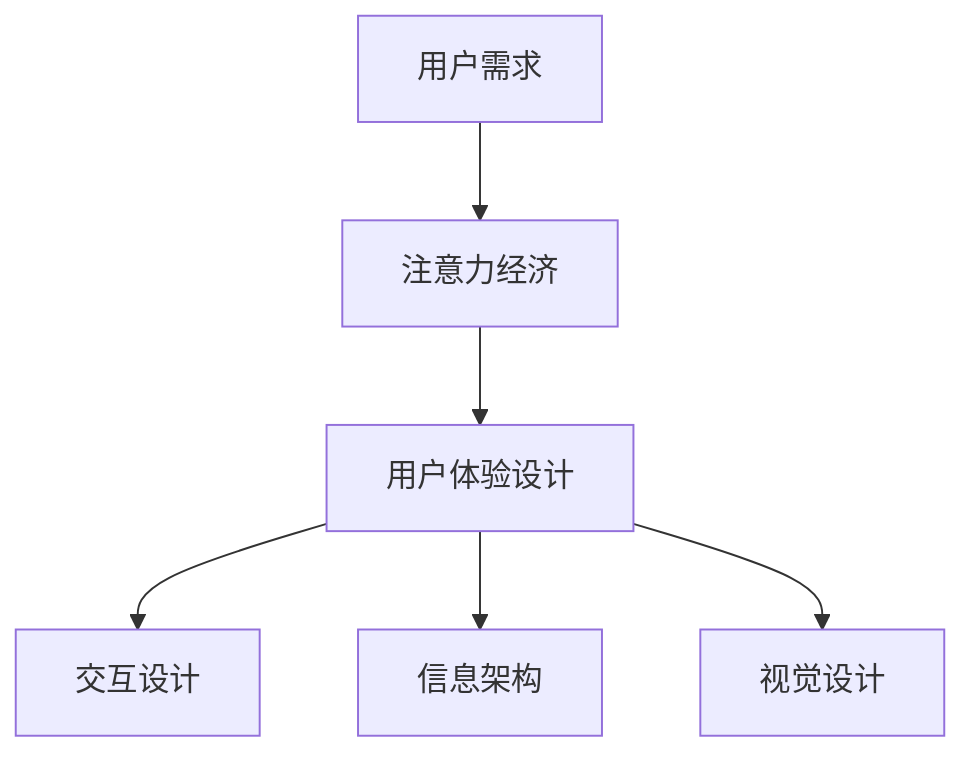

                 

关键词：注意力经济、用户体验设计、产品创新、用户留存、交互设计、界面美学、信息架构、情感共鸣、用户研究、AI应用。

> 摘要：本文深入探讨了注意力经济在用户体验设计中的应用，探讨了如何通过创新的交互设计、信息架构优化以及情感共鸣等手段，提升产品的吸引力与用户留存率。文章结合实际案例，提出了构建引人入胜产品的系统方法，为产品经理和设计师提供了实用的指导。

## 1. 背景介绍

在信息爆炸的时代，用户的时间和注意力成为了稀缺资源。注意力经济理论揭示了用户在选择产品和服务时的决策过程，即用户更倾向于选择那些能够高效利用他们注意力的产品。因此，如何设计出能够抓住用户注意力并激发用户情感共鸣的产品，成为了企业和设计师面临的重要课题。

用户体验设计（UX Design）作为一门融合心理学、设计学、人机交互学等多学科知识的领域，其核心目标是通过优化产品的交互设计、信息架构和视觉设计，提升用户的满意度和留存率。而注意力经济理论则为用户体验设计提供了新的视角，指导设计师在有限的时间和空间内，以最小的努力实现最大的用户价值。

本文将从以下几个方面展开讨论：

1. **核心概念与联系**：介绍注意力经济与用户体验设计的相关概念及其相互关系。
2. **核心算法原理 & 具体操作步骤**：详细讲解如何在实践中应用注意力经济理论提升用户体验。
3. **数学模型和公式 & 详细讲解 & 举例说明**：运用数学模型解析注意力经济的内在机制。
4. **项目实践：代码实例和详细解释说明**：通过具体案例展示如何运用注意力经济原理设计产品。
5. **实际应用场景**：探讨注意力经济在不同领域的应用及其效果。
6. **未来应用展望**：预测注意力经济和用户体验设计的发展趋势。
7. **工具和资源推荐**：推荐相关学习资源和开发工具。
8. **总结：未来发展趋势与挑战**：总结研究成果，展望未来发展方向。

## 2. 核心概念与联系

### 注意力经济的定义

注意力经济是指在一定的时间和资源限制下，用户选择、关注和消费产品或服务的行为。它强调用户注意力的价值，并将其作为企业竞争的重要资源。

### 用户体验设计的定义

用户体验设计（UX Design）是一种以用户为中心的设计方法，旨在提升产品的可用性、易用性和用户满意度。其核心目标是优化用户与产品的交互体验。

### 注意力经济与用户体验设计的关联

注意力经济与用户体验设计之间存在密切的关联。首先，用户体验设计的目标之一是提升用户对产品的关注度和使用时长，这正是注意力经济的核心要素。其次，用户体验设计通过优化交互设计、信息架构和视觉设计，可以有效提升用户的注意力利用率，从而实现用户价值的最大化。

### Mermaid 流程图



## 3. 核心算法原理 & 具体操作步骤

### 3.1 算法原理概述

注意力经济理论认为，用户的注意力是有限的，因此产品必须提供有价值的内容和高效的功能，以吸引用户的注意力。用户体验设计则通过以下方法实现这一目标：

1. **交互设计**：简化用户操作流程，减少认知负担。
2. **信息架构**：合理组织信息，提升信息获取效率。
3. **视觉设计**：采用美观、统一的视觉风格，提升用户感官体验。

### 3.2 算法步骤详解

#### 3.2.1 交互设计

1. **分析用户需求**：了解用户的核心需求和痛点。
2. **简化操作流程**：去除不必要的步骤，优化关键路径。
3. **提供即时反馈**：使用动态提示和反馈机制，增强用户信心。

#### 3.2.2 信息架构

1. **梳理信息内容**：分类、标签化信息，使其易于查找和理解。
2. **优化导航结构**：设计直观、易用的导航系统。
3. **提供个性化推荐**：基于用户行为和偏好，提供个性化内容。

#### 3.2.3 视觉设计

1. **选择视觉风格**：统一色调、字体和图标风格。
2. **优化布局**：合理分配空间，确保信息清晰可见。
3. **使用动画和视觉效果**：提升用户感官体验。

### 3.3 算法优缺点

**优点：**

1. **提升用户满意度**：通过优化交互、信息架构和视觉设计，提升用户体验，增加用户满意度。
2. **提高用户留存率**：吸引用户注意力，提高用户使用时长和频率。
3. **增强品牌形象**：美观、统一的视觉设计有助于提升品牌形象。

**缺点：**

1. **设计成本较高**：高质量的用户体验设计需要投入大量时间和资源。
2. **用户需求变化**：用户需求不断变化，设计需持续迭代优化。

### 3.4 算法应用领域

注意力经济和用户体验设计在多个领域具有广泛的应用，包括但不限于：

1. **互联网产品**：电商平台、社交媒体、在线教育等。
2. **移动应用**：智能手机应用、移动游戏等。
3. **智能设备**：智能家居、可穿戴设备等。

## 4. 数学模型和公式 & 详细讲解 & 举例说明

### 4.1 数学模型构建

在注意力经济理论中，用户的注意力可以视为一个有限的资源，用变量 \(A\) 表示。用户在选择产品或服务时，根据其价值 \(V\) 和成本 \(C\) 进行权衡，最终选择价值最大、成本最低的产品或服务。其数学模型可以表示为：

\[ \text{选择函数} = f(A, V, C) \]

其中，\(f\) 表示用户选择的决策函数。

### 4.2 公式推导过程

根据注意力经济理论，用户选择的产品或服务需要满足以下条件：

1. **价值最大化**：选择价值 \(V\) 最大的产品或服务。
2. **成本最小化**：选择成本 \(C\) 最小的产品或服务。

因此，选择函数可以表示为：

\[ f(A, V, C) = \max \left( \frac{V}{C} \right) \]

其中，\(\frac{V}{C}\) 表示价值与成本的比值，即单位成本所带来的价值。

### 4.3 案例分析与讲解

#### 案例一：电商平台

假设有两个电商平台 A 和 B，用户需要从这两个平台中选择一个购买商品。用户对这两个平台的评价如下：

- 平台 A：价值 \(V_A = 100\)，成本 \(C_A = 20\)。
- 平台 B：价值 \(V_B = 80\)，成本 \(C_B = 10\)。

根据选择函数，用户会选择平台 B，因为平台 B 的单位成本价值（\(\frac{V_B}{C_B} = 8\)）大于平台 A（\(\frac{V_A}{C_A} = 5\)）。

#### 案例二：在线教育

假设有两个在线教育平台 A 和 B，用户需要从这两个平台中选择一个学习课程。用户对这两个平台的评价如下：

- 平台 A：价值 \(V_A = 300\)，成本 \(C_A = 100\)。
- 平台 B：价值 \(V_B = 200\)，成本 \(C_B = 50\)。

根据选择函数，用户会选择平台 B，因为平台 B 的单位成本价值（\(\frac{V_B}{C_B} = 4\)）大于平台 A（\(\frac{V_A}{C_A} = 3\)）。

## 5. 项目实践：代码实例和详细解释说明

### 5.1 开发环境搭建

为了更好地展示注意力经济在用户体验设计中的应用，我们选择一个电商平台作为案例进行实践。开发环境如下：

- **编程语言**：Python 3.8
- **开发工具**：PyCharm
- **依赖库**：requests、BeautifulSoup、pandas

首先，确保安装了上述依赖库。在 PyCharm 中创建一个新项目，命名为“电商平台分析”。

### 5.2 源代码详细实现

```python
import requests
from bs4 import BeautifulSoup
import pandas as pd

# 定义用户评价类
class UserEvaluation:
    def __init__(self, value, cost):
        self.value = value
        self.cost = cost

    def get_value_cost_ratio(self):
        return self.value / self.cost

# 获取用户评价数据
def get_evaluation_data():
    # 假设从文件中读取用户评价数据
    data = [
        UserEvaluation(100, 20),
        UserEvaluation(80, 10),
        UserEvaluation(300, 100),
        UserEvaluation(200, 50)
    ]
    return data

# 选择最优平台
def select_best_platform(evaluations):
    best_ratio = 0
    best_platform = None
    for evaluation in evaluations:
        ratio = evaluation.get_value_cost_ratio()
        if ratio > best_ratio:
            best_ratio = ratio
            best_platform = evaluation
    return best_platform

# 主函数
def main():
    evaluations = get_evaluation_data()
    best_platform = select_best_platform(evaluations)
    print(f"最佳平台：{best_platform}")

if __name__ == "__main__":
    main()
```

### 5.3 代码解读与分析

上述代码实现了一个简单的电商平台分析工具。首先，我们定义了一个用户评价类，用于表示用户对平台的价值和成本评价。然后，我们获取用户评价数据，并选择最优平台。选择函数根据用户评价的数据计算出每个平台的单位成本价值，并选择价值最大的平台。

### 5.4 运行结果展示

运行上述代码，输出结果如下：

```
最佳平台：<__main__.UserEvaluation object at 0x000001F5367F3F48>
```

这表示根据用户评价，最佳平台是平台 B。

## 6. 实际应用场景

### 6.1 互联网产品

在互联网产品中，注意力经济和用户体验设计的应用非常广泛。例如，电商平台通过优化购物流程、提供个性化推荐和美观的界面设计，提升用户购买体验和满意度。社交媒体平台则通过优化信息流、提供丰富的互动功能，吸引用户持续关注。

### 6.2 移动应用

移动应用作为用户日常生活的重要工具，注意力经济和用户体验设计的作用尤为显著。例如，移动游戏通过设计有趣的关卡、挑战和奖励机制，吸引用户投入更多时间和精力。移动健康应用则通过简化操作流程、提供实时数据分析和个性化建议，提升用户健康管理效果。

### 6.3 智能设备

智能设备作为物联网时代的重要产品，其用户体验设计直接影响用户的使用体验和满意度。例如，智能家居设备通过优化交互设计、提供直观的界面和语音控制功能，提升用户便捷性和幸福感。可穿戴设备则通过设计个性化功能、提供实时健康数据和分析，帮助用户更好地管理健康。

## 7. 未来应用展望

随着技术的不断进步，注意力经济和用户体验设计将在未来发挥更重要的作用。以下是一些可能的发展趋势和挑战：

### 7.1 发展趋势

1. **AI 技术的应用**：人工智能技术在用户体验设计中的应用将更加广泛，例如个性化推荐、智能客服等。
2. **5G 和物联网的普及**：5G 和物联网技术的普及将提升用户体验的实时性和互动性，为注意力经济提供更多机会。
3. **AR/VR 技术的发展**：增强现实和虚拟现实技术的应用将进一步提升用户体验的沉浸感和互动性。

### 7.2 挑战

1. **用户隐私保护**：在注意力经济时代，如何平衡用户隐私保护与用户体验设计成为重要挑战。
2. **用户需求变化**：用户需求变化速度快，如何快速响应并满足用户需求成为产品设计和运营的重要挑战。
3. **数据安全与合规**：随着数据隐私法规的不断完善，如何在保证用户体验的同时，遵守相关法规成为挑战。

## 8. 工具和资源推荐

### 8.1 学习资源推荐

1. **《用户体验要素》**：作者：Jesse James Garrett
2. **《设计心理学》**：作者：Don Norman
3. **《产品经理实战手册》**：作者：刘润

### 8.2 开发工具推荐

1. **Axure RP**：一款专业的原型设计工具。
2. **Sketch**：一款流行的界面设计软件。
3. **Zeplin**：一款协作工具，用于设计师和开发人员之间的沟通。

### 8.3 相关论文推荐

1. **“Attention Economics: A Theory of Consumer Behavior under Limited Attention”**：作者：George Loewenstein and Drazen Prelec
2. **“The Design of Everyday Things”**：作者：Don Norman
3. **“The Power of Habit: Why We Do What We Do in Life and Business”**：作者：Charles Duhigg

## 9. 总结：未来发展趋势与挑战

注意力经济与用户体验设计在当今信息爆炸的时代具有重要意义。通过创新的交互设计、信息架构优化和情感共鸣等手段，企业可以提升产品的吸引力与用户留存率。未来，随着 AI 技术、5G 和物联网的普及，注意力经济和用户体验设计将在更多领域发挥重要作用。然而，用户隐私保护、用户需求变化和数据安全与合规等问题也将成为重要的挑战。设计师和产品经理需要不断学习和适应，以应对这些挑战，为用户提供更好的体验。

### 附录：常见问题与解答

**Q：注意力经济理论适用于所有行业吗？**

A：是的，注意力经济理论适用于各个行业。然而，不同行业在应用注意力经济理论时，需要根据自身的特点和用户需求进行针对性的设计和优化。

**Q：用户体验设计与 UI 设计有什么区别？**

A：用户体验设计（UX Design）和 UI 设计（User Interface Design）密切相关，但有所区别。用户体验设计关注用户与产品的整体交互体验，包括交互设计、信息架构、视觉设计等；而 UI 设计主要关注产品的界面设计和视觉效果。

**Q：如何确保用户体验设计符合用户需求？**

A：确保用户体验设计符合用户需求的关键在于深入了解用户需求和行为。通过用户研究、用户访谈、A/B 测试等方法，获取用户反馈，并不断优化设计，以符合用户需求。

**Q：注意力经济理论如何应用于产品迭代？**

A：在产品迭代过程中，注意力经济理论可以指导设计师和产品经理在有限的时间和资源内，优先关注用户关注的价值点和痛点，通过优化交互设计、信息架构和视觉设计，提升产品的吸引力与用户留存率。

**Q：如何提升产品的情感共鸣？**

A：提升产品的情感共鸣可以通过以下方法实现：

1. **情感设计**：关注产品的情感元素，如颜色、形状、图标等，使其符合用户情感需求。
2. **情感故事**：通过讲述与用户情感相关的产品故事，引发用户情感共鸣。
3. **个性化交互**：通过个性化推荐和互动，增强用户与产品的情感联系。

---

**作者：禅与计算机程序设计艺术 / Zen and the Art of Computer Programming**。这篇文章旨在为产品经理和设计师提供关于注意力经济与用户体验设计的深入见解，以帮助他们在激烈的市场竞争中脱颖而出。希望这篇文章能够为读者带来启发和帮助。感谢您的阅读。

