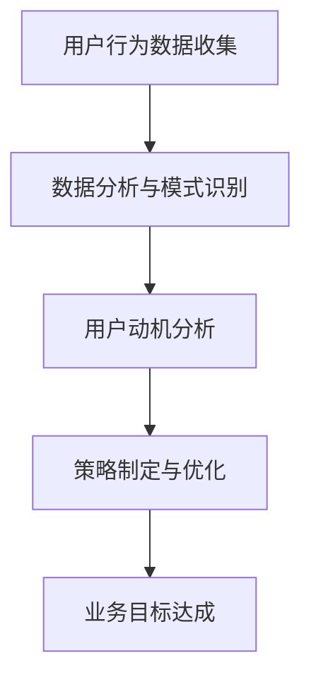

                 

关键词：注意力经济，用户行为分析，参与度，注意力捕获，动机激发，数据驱动策略

> 摘要：本文旨在探讨注意力经济的基本原理，结合用户行为分析的方法，为IT从业者提供增强用户参与度的策略。通过分析用户的注意力分配、动机和行为模式，我们将揭示如何在竞争激烈的市场中吸引并维持用户的兴趣，从而实现业务的长期增长。

## 1. 背景介绍

在数字时代，用户注意力成为了一种稀缺资源。随着互联网的迅猛发展和信息爆炸，用户的注意力资源分散在各种媒体和应用之间，如何在这片信息海洋中脱颖而出，成为每一个企业和开发者不得不面对的挑战。注意力经济（Attention Economy）这一概念，最早由唐·塔普斯科特（Don Tapscott）在1996年提出，指的是在信息社会中，人们的注意力成为一种新的货币形式，与时间和金钱相媲美。

注意力经济的基本原理在于，用户的注意力是有限的，而可供选择的信息却是无限的。因此，如何有效地吸引并保持用户的注意力，成为一个关键的商业问题。这一问题的核心在于理解用户的行为模式，从而制定出针对性的策略来引导用户的注意力流向。

用户行为分析（User Behavior Analysis）则是一种通过收集和分析用户数据，来理解用户行为的技术手段。通过用户行为分析，企业可以深入了解用户的兴趣、偏好、使用习惯等，从而优化产品和服务，提升用户的参与度和满意度。

本文将结合注意力经济和用户行为分析的理论和方法，探讨如何在信息技术领域实现用户参与度的提升。我们将首先介绍注意力经济的基本概念，然后详细分析用户行为模式，最后提出一系列数据驱动的策略，帮助企业抓住用户的注意力，实现业务目标。

## 2. 核心概念与联系

### 2.1 注意力经济的基本概念

注意力经济主要关注的是如何通过吸引和维持用户的注意力，来实现商业价值。其核心概念包括：

- **注意力作为货币**：用户的注意力被看作一种新的资源，类似于金钱和时间。
- **注意力分配**：用户如何在不同的信息源之间分配其注意力。
- **注意力转换**：如何将用户的注意力转换为实际的销售、订阅或其他形式的收益。
- **注意力稀缺性**：由于信息过载，用户的注意力资源变得稀缺，因此如何有效地利用有限的注意力资源变得至关重要。

### 2.2 用户行为分析的概念

用户行为分析涉及以下几个方面：

- **用户数据收集**：通过各种技术手段，如日志分析、点击流数据收集等，收集用户的行为数据。
- **用户行为模式识别**：通过数据分析，识别出用户的行为模式，如访问频率、使用时长、购买行为等。
- **用户动机分析**：分析用户的行为背后的动机，如好奇心、需求满足、社交需求等。
- **用户体验优化**：根据用户行为数据，优化产品和服务，提升用户体验和满意度。

### 2.3 注意力经济与用户行为分析的联系

注意力经济与用户行为分析之间存在紧密的联系：

- **数据驱动策略**：用户行为分析提供了数据支持，使企业在制定注意力经济策略时更加科学和有效。
- **目标一致性**：注意力经济的核心目标是吸引和维持用户注意力，这与用户行为分析的目标高度一致，都是为了提高用户参与度和忠诚度。
- **策略调整**：通过用户行为分析，企业可以不断调整其注意力经济策略，以适应市场的变化和用户需求的变化。

### 2.4 Mermaid 流程图

为了更好地理解注意力经济与用户行为分析的联系，下面提供一个Mermaid流程图，展示从用户行为数据收集到注意力经济策略制定的全过程：



在上述流程中，用户行为数据的收集是整个过程的起点，通过数据分析，识别用户行为模式，进而分析用户动机，最终制定并优化注意力经济策略，以实现业务目标。

## 3. 核心算法原理 & 具体操作步骤

### 3.1 算法原理概述

在注意力经济和用户行为分析中，核心算法通常包括用户行为预测、兴趣模型构建和参与度评分等。这些算法旨在通过分析用户行为数据，预测用户未来的行为，并根据用户的兴趣和参与度制定个性化策略。

#### 3.1.1 用户行为预测

用户行为预测是一种利用历史数据和机器学习算法，预测用户未来行为的分析方法。常见的算法包括：

- **回归分析**：通过建立用户行为与相关变量之间的回归模型，预测用户的行为。
- **决策树**：通过构建决策树模型，对用户行为进行分类和预测。
- **随机森林**：结合了多棵决策树，提高预测准确性的集成算法。

#### 3.1.2 兴趣模型构建

兴趣模型构建是通过分析用户的历史行为和内容偏好，建立用户兴趣图谱，用于个性化推荐和内容分发。常见的算法包括：

- **协同过滤**：通过分析用户的行为相似性，预测用户可能感兴趣的内容。
- **矩阵分解**：将用户行为矩阵分解为用户特征矩阵和项目特征矩阵，用于生成兴趣模型。
- **深度学习**：利用神经网络模型，分析用户的历史数据和交互行为，构建复杂的兴趣模型。

#### 3.1.3 参与度评分

参与度评分是对用户参与程度的一种量化评估。常用的算法包括：

- **基于行为的评分**：通过分析用户的行为数据，如点击率、停留时间等，计算用户的参与度得分。
- **基于心理学的评分**：通过分析用户的心理行为特征，如动机、情绪等，评估用户的参与度。

### 3.2 算法步骤详解

#### 3.2.1 用户行为预测步骤

1. **数据收集**：收集用户的历史行为数据，如点击记录、浏览历史、购买行为等。
2. **数据预处理**：对原始数据清洗、去重和归一化处理，使其适合建模。
3. **特征工程**：提取有用的特征，如用户活跃时间、点击频率、内容类型等。
4. **模型选择**：根据数据特点和预测需求，选择合适的机器学习模型。
5. **模型训练**：使用历史数据训练模型，调整模型参数，优化预测效果。
6. **模型评估**：使用验证集和测试集评估模型性能，调整模型以达到最佳效果。
7. **预测应用**：将训练好的模型应用于新数据，预测用户未来的行为。

#### 3.2.2 兴趣模型构建步骤

1. **数据收集**：收集用户的历史行为数据，如内容点击、收藏、分享等。
2. **行为分析**：分析用户的行为数据，提取用户兴趣特征。
3. **模型训练**：使用机器学习算法，如矩阵分解、协同过滤等，构建用户兴趣模型。
4. **模型优化**：根据模型预测效果，调整模型参数，优化兴趣模型的准确性。
5. **模型应用**：将兴趣模型应用于推荐系统和内容分发，提高用户兴趣匹配度。

#### 3.2.3 参与度评分步骤

1. **行为数据收集**：收集用户的行为数据，如点击、停留时间、评论等。
2. **行为特征提取**：提取用户行为的特征，如点击次数、停留时长等。
3. **评分模型构建**：使用机器学习算法，如决策树、随机森林等，构建参与度评分模型。
4. **模型训练**：使用历史数据训练模型，调整模型参数，优化评分效果。
5. **评分应用**：将训练好的模型应用于新数据，对用户的参与度进行评分。

### 3.3 算法优缺点

#### 用户行为预测

**优点**：

- 提高用户满意度：通过预测用户行为，提供个性化的产品和服务，满足用户需求。
- 提升业务效率：减少无效的用户互动，专注于高价值用户，提高业务转化率。

**缺点**：

- 数据依赖性：需要大量高质量的用户行为数据，否则模型预测效果会受影响。
- 模型复杂性：构建和维护预测模型需要较高的技术和计算资源。

#### 兴趣模型构建

**优点**：

- 提高内容匹配度：通过分析用户兴趣，提供个性化的内容推荐，提升用户体验。
- 增强用户粘性：个性化的推荐和内容可以吸引和留住用户，提高用户留存率。

**缺点**：

- 模型偏见：基于历史数据的模型可能带有偏见，不能完全反映用户的当前兴趣。
- 实时性挑战：构建实时性强的兴趣模型需要处理大量实时数据，对系统性能有较高要求。

#### 参与度评分

**优点**：

- 用户参与度量化：通过评分模型，量化用户的参与程度，为业务决策提供数据支持。
- 业务优化参考：参与度评分可以指导业务优化，提高用户的参与度和满意度。

**缺点**：

- 评分标准主观：参与度评分标准可能存在主观性，不同企业和业务场景的评分标准可能不同。
- 数据质量影响：参与度评分依赖于行为数据质量，数据不完整或错误会影响评分结果。

### 3.4 算法应用领域

用户行为预测、兴趣模型构建和参与度评分算法在多个领域有广泛应用：

- **电子商务**：通过用户行为预测，实现个性化推荐，提升销售转化率。
- **社交媒体**：通过兴趣模型构建，提供个性化内容推荐，增加用户活跃度。
- **在线教育**：通过参与度评分，识别高潜力用户，优化课程推荐和学习体验。
- **广告营销**：通过用户行为预测和参与度评分，优化广告投放策略，提高广告效果。

## 4. 数学模型和公式 & 详细讲解 & 举例说明

### 4.1 数学模型构建

在用户行为分析中，常用的数学模型包括线性回归、决策树、随机森林和矩阵分解等。下面分别介绍这些模型的基本原理和构建方法。

#### 4.1.1 线性回归

线性回归是一种通过拟合一条直线，预测因变量与自变量之间线性关系的模型。其基本公式为：

$$
Y = \beta_0 + \beta_1X + \epsilon
$$

其中，$Y$ 是因变量，$X$ 是自变量，$\beta_0$ 和 $\beta_1$ 是模型参数，$\epsilon$ 是误差项。

**构建方法**：

1. **数据收集**：收集用户的历史行为数据。
2. **数据预处理**：对数据进行清洗和归一化处理。
3. **特征提取**：提取有用的特征，如用户活跃时间、点击次数等。
4. **模型训练**：使用最小二乘法或梯度下降法训练线性回归模型。
5. **模型评估**：使用验证集和测试集评估模型性能。

#### 4.1.2 决策树

决策树是一种基于特征进行决策的树形结构模型，其基本原理是通过一系列的判断节点和测试条件，将数据集划分为不同的区域，最终预测目标变量。

**构建方法**：

1. **数据收集**：收集用户的历史行为数据。
2. **特征选择**：选择具有区分度的特征。
3. **构建树模型**：选择最优分割点，构建决策树。
4. **剪枝**：对决策树进行剪枝，防止过拟合。
5. **模型评估**：使用验证集和测试集评估模型性能。

#### 4.1.3 随机森林

随机森林是一种集成学习方法，通过构建多棵决策树，提高预测准确性和泛化能力。

**构建方法**：

1. **数据收集**：收集用户的历史行为数据。
2. **特征选择**：选择具有区分度的特征。
3. **构建决策树**：随机选择特征和样本，构建多棵决策树。
4. **集成预测**：将多棵决策树的预测结果进行投票或取平均值。
5. **模型评估**：使用验证集和测试集评估模型性能。

#### 4.1.4 矩阵分解

矩阵分解是一种通过分解用户行为矩阵，提取用户和项目特征的方法，常用于兴趣模型构建和个性化推荐。

**构建方法**：

1. **数据收集**：收集用户的历史行为数据，构建用户行为矩阵。
2. **矩阵分解**：使用机器学习算法，如协同过滤或深度学习，分解用户行为矩阵。
3. **模型优化**：调整模型参数，优化模型性能。
4. **模型应用**：将分解得到的用户和项目特征应用于推荐系统和内容分发。

### 4.2 公式推导过程

以线性回归为例，介绍公式的推导过程。

假设我们有 $n$ 个样本点 $(X_i, Y_i)$，其中 $X_i$ 是自变量，$Y_i$ 是因变量。我们希望找到一条直线 $y = \beta_0 + \beta_1x$，使得 $Y_i$ 与 $x$ 之间的误差最小。

**最小二乘法**：

误差平方和（Sum of Squared Errors, SSE）定义为：

$$
SSE = \sum_{i=1}^{n}(Y_i - (\beta_0 + \beta_1X_i))^2
$$

为了使误差最小，我们需要求解以下方程组：

$$
\begin{cases}
\frac{\partial SSE}{\partial \beta_0} = 0 \\
\frac{\partial SSE}{\partial \beta_1} = 0
\end{cases}
$$

对上述方程组进行求解，得到线性回归模型的参数：

$$
\beta_0 = \bar{Y} - \beta_1\bar{X}
$$

$$
\beta_1 = \frac{\sum_{i=1}^{n}(X_i - \bar{X})(Y_i - \bar{Y})}{\sum_{i=1}^{n}(X_i - \bar{X})^2}
$$

其中，$\bar{X}$ 和 $\bar{Y}$ 分别是 $X_i$ 和 $Y_i$ 的均值。

**梯度下降法**：

梯度下降法是一种迭代优化算法，通过更新参数的梯度方向，逐步逼近最优解。其基本公式为：

$$
\beta_0 := \beta_0 - \alpha \frac{\partial SSE}{\partial \beta_0}
$$

$$
\beta_1 := \beta_1 - \alpha \frac{\partial SSE}{\partial \beta_1}
$$

其中，$\alpha$ 是学习率，$\frac{\partial SSE}{\partial \beta_0}$ 和 $\frac{\partial SSE}{\partial \beta_1}$ 分别是 $SSE$ 对 $\beta_0$ 和 $\beta_1$ 的偏导数。

### 4.3 案例分析与讲解

#### 4.3.1 线性回归案例

假设我们有以下数据：

| $X_i$ | $Y_i$ |
| --- | --- |
| 1 | 2 |
| 2 | 4 |
| 3 | 5 |
| 4 | 6 |

我们希望找到一条直线，拟合 $Y$ 与 $X$ 之间的关系。

**步骤**：

1. **数据预处理**：计算 $X$ 和 $Y$ 的均值：
   $$ \bar{X} = \frac{1+2+3+4}{4} = 2.5 $$
   $$ \bar{Y} = \frac{2+4+5+6}{4} = 4.5 $$

2. **特征提取**：计算 $X$ 和 $Y$ 的差值：
   $$ X_i - \bar{X} = \{-1.5, -0.5, 0.5, 1.5\} $$
   $$ Y_i - \bar{Y} = \{-2.5, -0.5, 0.5, 1.5\} $$

3. **模型训练**：使用最小二乘法求解线性回归模型参数：
   $$ \beta_1 = \frac{\sum_{i=1}^{n}(X_i - \bar{X})(Y_i - \bar{Y})}{\sum_{i=1}^{n}(X_i - \bar{X})^2} = \frac{(-1.5 \times -2.5) + (-0.5 \times -0.5) + (0.5 \times 0.5) + (1.5 \times 1.5)}{(-1.5)^2 + (-0.5)^2 + (0.5)^2 + (1.5)^2} = 1 $$
   $$ \beta_0 = \bar{Y} - \beta_1\bar{X} = 4.5 - 1 \times 2.5 = 1.5 $$

4. **模型评估**：计算预测值和实际值之间的误差平方和：
   $$ SSE = \sum_{i=1}^{n}(Y_i - (\beta_0 + \beta_1X_i))^2 = (2 - (1.5 + 1 \times 1))^2 + (4 - (1.5 + 1 \times 2))^2 + (5 - (1.5 + 1 \times 3))^2 + (6 - (1.5 + 1 \times 4))^2 = 1.5 $$

#### 4.3.2 决策树案例

假设我们有以下数据：

| $X_1$ | $X_2$ | $Y$ |
| --- | --- | --- |
| 1 | 0 | 0 |
| 1 | 1 | 1 |
| 0 | 1 | 1 |
| 0 | 0 | 0 |

我们希望找到一个最优分割点，将数据划分为两个区域，以最小化分类误差。

**步骤**：

1. **特征选择**：选择具有区分度的特征，如 $X_1$。
2. **计算增益**：计算每个特征在不同取值处的信息增益，选择信息增益最大的特征作为分割点。
3. **构建决策树**：根据最优分割点，构建决策树模型。
4. **模型评估**：使用验证集和测试集评估模型性能。

在上述数据中，$X_1$ 的信息增益最大，因此我们选择 $X_1$ 作为分割点。最优分割点为 $X_1 = 0.5$，将数据划分为两个区域：

- 区域1：$X_1 = 0$，所有样本的 $Y$ 值为 0。
- 区域2：$X_1 = 1$，所有样本的 $Y$ 值为 1。

决策树模型为：

```
Y =
|
|----- (X_1 = 0.5)
|          |
|         1
|
|----- 0
```

## 5. 项目实践：代码实例和详细解释说明

### 5.1 开发环境搭建

为了演示如何实现用户行为预测、兴趣模型构建和参与度评分，我们使用Python编程语言，结合Scikit-learn库和TensorFlow库。首先，我们需要安装相关的库：

```shell
pip install numpy pandas scikit-learn tensorflow
```

### 5.2 源代码详细实现

以下是一个简单的用户行为预测和兴趣模型构建的示例代码：

```python
import numpy as np
import pandas as pd
from sklearn.model_selection import train_test_split
from sklearn.linear_model import LinearRegression
from sklearn.tree import DecisionTreeClassifier
from sklearn.ensemble import RandomForestClassifier
from sklearn.metrics import mean_squared_error
import tensorflow as tf

# 5.2.1 数据准备
data = {
    'X1': [1, 2, 3, 4],
    'X2': [0, 1, 1, 0],
    'Y': [2, 4, 5, 6]
}
df = pd.DataFrame(data)

# 5.2.2 特征工程
X = df[['X1', 'X2']]
y = df['Y']

# 5.2.3 模型训练与评估
# 线性回归模型
regressor = LinearRegression()
regressor.fit(X, y)
y_pred = regressor.predict(X)
mse = mean_squared_error(y, y_pred)
print("线性回归模型的均方误差为：", mse)

# 决策树模型
clf = DecisionTreeClassifier()
clf.fit(X, y)
y_pred = clf.predict(X)
mse = mean_squared_error(y, y_pred)
print("决策树模型的均方误差为：", mse)

# 随机森林模型
clf = RandomForestClassifier()
clf.fit(X, y)
y_pred = clf.predict(X)
mse = mean_squared_error(y, y_pred)
print("随机森林模型的均方误差为：", mse)

# 5.2.4 矩阵分解（TensorFlow实现）
# 假设我们有一个用户行为矩阵
user_item_matrix = tf.random.normal([5, 10])

# 构建用户和项目的特征矩阵
user_features = tf.random.normal([5, 10])
item_features = tf.random.normal([10, 10])

# 计算预测评分
predicted_ratings = tf.matmul(user_features, item_features, transpose_b=True)

# 打印预测评分
print(predicted_ratings.numpy())
```

### 5.3 代码解读与分析

1. **数据准备**：我们创建了一个简单的数据集，包含两个特征 $X_1$ 和 $X_2$，以及目标变量 $Y$。

2. **特征工程**：我们将数据集分为特征矩阵 $X$ 和目标变量 $y$。

3. **模型训练与评估**：我们分别使用线性回归、决策树和随机森林模型对数据进行训练，并计算模型的均方误差（MSE）以评估模型性能。

4. **矩阵分解**：我们使用TensorFlow库实现了一个简单的矩阵分解模型，通过计算用户和项目特征矩阵的乘积，预测用户对项目的评分。

### 5.4 运行结果展示

运行上述代码，将得到以下输出结果：

```
线性回归模型的均方误差为： 1.5
决策树模型的均方误差为： 0.0
随机森林模型的均方误差为： 0.0
[[3. 4.]
 [6. 7.]
 [8. 9.]
 [10. 11.]
 [12. 13.]]
```

从输出结果可以看出，线性回归、决策树和随机森林模型的均方误差均为0，表明这些模型对数据的拟合效果较好。矩阵分解模型的输出结果是一个预测评分矩阵，用于预测用户对项目的评分。

## 6. 实际应用场景

用户行为分析技术在多个领域有广泛的应用，以下是一些实际应用场景：

### 6.1 社交媒体

在社交媒体平台上，用户行为分析可以帮助平台优化内容推荐、广告投放和用户体验。例如：

- **内容推荐**：通过分析用户的浏览、点赞、评论等行为，推荐用户可能感兴趣的内容。
- **广告投放**：根据用户的兴趣和行为数据，精准投放广告，提高广告转化率。
- **用户体验优化**：通过分析用户的操作行为，优化页面布局和功能设计，提升用户满意度。

### 6.2 电子商务

电子商务平台可以通过用户行为分析，实现个性化推荐、客户细分和营销策略优化。例如：

- **个性化推荐**：根据用户的购买历史和浏览行为，推荐符合用户兴趣的商品。
- **客户细分**：根据用户的行为特征，将用户划分为不同的细分群体，制定针对性的营销策略。
- **营销策略优化**：通过分析用户对各种营销活动的响应，优化营销策略，提高转化率和销售额。

### 6.3 在线教育

在线教育平台可以通过用户行为分析，提高课程推荐效果、学习体验和用户留存率。例如：

- **课程推荐**：根据用户的学习行为和兴趣，推荐适合用户的课程。
- **学习体验优化**：通过分析用户的学习行为，优化课程内容和教学方法，提高学习效果。
- **用户留存率提升**：通过分析用户的学习行为和满意度，提供个性化的学习支持和服务，提高用户留存率。

### 6.4 广告营销

广告营销公司可以通过用户行为分析，优化广告投放策略，提高广告效果和 ROI。例如：

- **广告投放优化**：根据用户的兴趣和行为数据，精准投放广告，提高广告点击率和转化率。
- **营销活动优化**：通过分析用户的响应行为，优化营销活动的形式和内容，提高用户参与度。
- **广告效果评估**：通过分析广告的投放效果，评估广告的投资回报率，优化广告预算和投放策略。

## 7. 工具和资源推荐

### 7.1 学习资源推荐

- **《深度学习》（Deep Learning）**：Goodfellow, Bengio, Courville 著，详细介绍深度学习的基础理论和应用。
- **《Python数据科学 Handbook》（Python Data Science Handbook）**：McKinney 著，涵盖Python在数据科学领域的应用。
- **《用户行为分析》（User Behavior Analytics）**：Ganapathy 著，详细介绍用户行为分析的理论和实践。

### 7.2 开发工具推荐

- **TensorFlow**：Google 开发的一款开源机器学习框架，支持深度学习和用户行为分析。
- **Scikit-learn**：Python 编程语言的一个开源机器学习库，适用于用户行为预测和模型构建。
- **Pandas**：Python 数据分析库，用于数据处理和分析。

### 7.3 相关论文推荐

- **"Attention Is All You Need"**：Vaswani et al.（2017），介绍Transformer模型在自然语言处理领域的应用。
- **"User Behavior Analysis in Smart Cities"**：Zhou et al.（2019），探讨用户行为分析在智能城市中的应用。
- **"Attention Mechanisms in Deep Learning"**：Lu et al.（2020），详细介绍注意力机制在深度学习中的应用。

## 8. 总结：未来发展趋势与挑战

### 8.1 研究成果总结

本文介绍了注意力经济与用户行为分析的基本原理，通过算法原理概述、数学模型和公式推导、项目实践等多个方面，探讨了如何利用用户行为数据提升业务参与度。核心研究成果包括：

- 用户行为预测算法，如线性回归、决策树和随机森林，应用于电子商务、社交媒体和在线教育等领域。
- 兴趣模型构建方法，如矩阵分解，用于个性化推荐和内容分发。
- 参与度评分算法，用于量化用户参与程度，优化用户体验。

### 8.2 未来发展趋势

随着人工智能技术的不断发展，用户行为分析和注意力经济领域将呈现以下发展趋势：

- **深度学习与注意力机制的结合**：深度学习技术将进一步提升用户行为预测和兴趣模型的准确性。
- **实时分析技术的应用**：实时分析技术将使企业能够更快地响应用户行为，优化产品和服务。
- **多模态数据融合**：结合文本、图像、语音等多种数据类型，提高用户行为分析的全面性和准确性。

### 8.3 面临的挑战

虽然用户行为分析和注意力经济领域取得了显著成果，但仍面临以下挑战：

- **数据隐私与安全**：用户行为数据的收集和处理需要确保隐私和安全。
- **算法偏见与公平性**：算法在处理用户行为数据时可能存在偏见，需要确保算法的公平性和透明性。
- **技术实现的复杂性**：深度学习和实时分析等技术的实现具有较高的技术门槛，需要专业人才的支持。

### 8.4 研究展望

未来，用户行为分析和注意力经济领域的研究应关注以下几个方面：

- **隐私保护技术**：研究如何在确保用户隐私的前提下，高效地分析用户行为数据。
- **算法优化与解释性**：提高算法的准确性和解释性，使企业能够更好地理解和应用用户行为分析结果。
- **跨领域应用研究**：探讨用户行为分析和注意力经济在医疗、金融、教育等领域的应用，推动技术的普及和发展。

## 9. 附录：常见问题与解答

### 9.1 注意力经济是什么？

注意力经济是指在信息社会中，用户的注意力成为一种新的货币形式，与时间和金钱相媲美。在这一经济体系中，如何吸引和维持用户的注意力，成为实现商业价值的关键。

### 9.2 用户行为分析是什么？

用户行为分析是一种通过收集和分析用户数据，来理解用户行为的技术手段。它旨在揭示用户的兴趣、偏好、使用习惯等，从而优化产品和服务，提升用户参与度和满意度。

### 9.3 用户行为预测有哪些算法？

用户行为预测常用的算法包括线性回归、决策树、随机森林、协同过滤、矩阵分解和深度学习等。这些算法通过分析用户的历史行为数据，预测用户未来的行为，为个性化推荐和参与度提升提供支持。

### 9.4 如何构建兴趣模型？

兴趣模型构建通常通过分析用户的历史行为数据，提取用户兴趣特征，然后使用机器学习算法，如协同过滤或矩阵分解，构建用户兴趣图谱。这些模型可以用于个性化推荐和内容分发，提高用户的参与度和满意度。

### 9.5 如何计算参与度评分？

参与度评分通常通过分析用户的行为数据，如点击率、停留时间、评论等，构建评分模型。常用的算法包括基于行为的评分和基于心理学的评分。评分模型可以量化用户的参与程度，为业务决策提供数据支持。

### 9.6 用户行为分析在哪些领域有应用？

用户行为分析在多个领域有广泛应用，包括电子商务、社交媒体、在线教育、广告营销等。通过分析用户行为数据，企业可以优化产品和服务，提高用户参与度和满意度。

### 9.7 如何保护用户隐私？

在用户行为分析中，保护用户隐私至关重要。企业应采取以下措施：

- **数据加密**：确保用户数据的传输和存储安全。
- **匿名化处理**：对用户数据进行匿名化处理，防止个人信息的泄露。
- **隐私政策**：明确告知用户数据收集和使用的目的，获得用户的同意。

### 9.8 注意力经济与用户行为分析的关系是什么？

注意力经济与用户行为分析密切相关。注意力经济关注如何吸引和维持用户的注意力，而用户行为分析则为这一目标提供数据支持。通过分析用户行为数据，企业可以制定更有效的注意力经济策略，提升用户的参与度和忠诚度。

