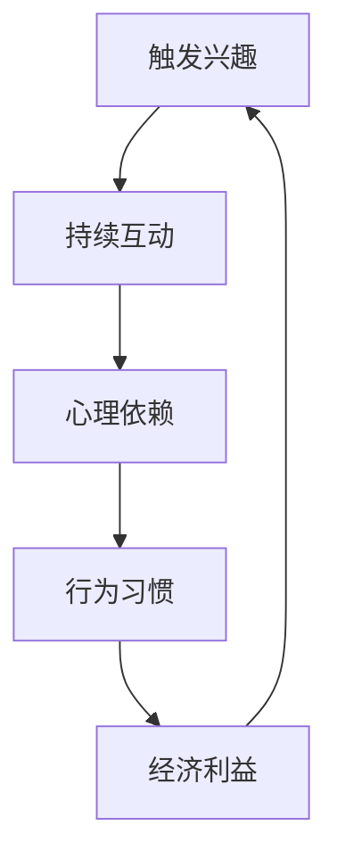

                 

社交媒体已经成为我们日常生活中不可或缺的一部分。然而，随着时间的推移，许多人开始意识到过度使用社交媒体带来的负面影响。这种现象被称为“社交媒体中毒”。本文将探讨注意力经济与社交媒体中毒的关系，并提出一系列策略，帮助人们打破这种循环，获得更多的自由。

## 关键词 Keywords

社交媒体，注意力经济，社交媒体中毒，自由，策略，心理健康

## 摘要 Abstract

本文首先介绍了社交媒体中毒的现象及其对个人和社会的影响。然后，分析了注意力经济在社交媒体中毒中的角色。接下来，提出了一系列策略，包括自我管理、时间规划和心理调适，帮助人们摆脱社交媒体中毒的困扰，获得更多的自由和心理健康。

## 1. 背景介绍

### 社交媒体中毒的定义和现象

“社交媒体中毒”是指个体对社交媒体的使用产生了强烈的依赖，以至于它开始影响个人的日常生活、工作和心理健康。这种现象在现代社会中变得越来越普遍。许多人发现自己无法控制对社交媒体的使用，导致每天花费大量时间在社交媒体上，而忽视了现实生活中的人际交往和工作。

根据一项研究，全球每天有超过30亿人在使用社交媒体。平均每天花费在社交媒体上的时间超过2小时，而在某些国家和地区，这个数字甚至更高。这种现象不仅影响了个人的工作效率和生活质量，还对社会的整体心理健康产生了负面影响。

### 社交媒体中毒的影响

社交媒体中毒对个人的影响是显而易见的。首先，它严重干扰了个人的日常生活。许多人无法离开手机，甚至在吃饭、睡觉和与他人交流时也离不开社交媒体。这种过度依赖导致个人与现实生活中的人际关系逐渐疏远，甚至可能导致孤独感和社交焦虑。

其次，社交媒体中毒对个人的心理健康产生了负面影响。长时间使用社交媒体，尤其是频繁刷屏，会导致个人的情绪波动和焦虑感增加。研究发现，过度使用社交媒体与抑郁、焦虑和自尊心下降之间存在显著关联。

最后，社交媒体中毒也对社会的整体心理健康产生了负面影响。社交媒体上的负面信息和虚假信息泛滥，导致人们的情绪波动和信任度下降。此外，社交媒体上的竞争和攀比现象也加剧了人们的焦虑感和不安全感。

### 注意力经济与社交媒体中毒

注意力经济是指通过吸引和保持用户的注意力来创造经济价值的一种商业模式。在社交媒体上，这种模式尤为明显。社交媒体平台通过设计算法和内容推荐机制，使用户在平台上停留的时间越长，从而创造更多的广告收入和用户数据价值。

注意力经济与社交媒体中毒之间存在着密切的联系。一方面，社交媒体平台通过算法和内容推荐机制，不断地吸引用户的注意力，使得用户陷入持续的浏览和互动循环中。另一方面，用户在社交媒体上的互动和分享行为，也会被平台用于进一步吸引其他用户的注意力。

这种注意力经济模式导致了社交媒体中毒现象的加剧。用户为了保持注意力，不断地刷屏、点赞和评论，而忽视了现实生活中的人际交往和工作。这种恶性循环不仅加剧了社交媒体中毒，还对个人的心理健康产生了负面影响。

## 2. 核心概念与联系

### 注意力经济的原理和机制

注意力经济是基于一个简单但关键的原则：用户的注意力是有价值的。在社交媒体时代，用户的注意力成为了商家、平台和内容创作者争夺的焦点。社交媒体平台通过算法和内容推荐机制，使用户的注意力集中在特定的内容上，从而实现商业价值的最大化。

注意力经济的原理和机制主要包括以下几个方面：

1. **算法推荐**：社交媒体平台使用复杂的算法，根据用户的兴趣和行为历史，推荐用户可能感兴趣的内容。这种推荐机制不仅提高了用户的使用粘性，还使得用户更容易被特定内容所吸引。

2. **互动设计**：社交媒体平台通过设计互动性强的功能，如点赞、评论、分享等，使用户在平台上停留的时间更长。这些互动行为不仅增加了用户的参与度，还有助于平台收集更多的用户数据。

3. **内容营销**：内容创作者通过创造有趣、有价值或具有争议性的内容，吸引观众的注意力。这种内容营销策略不仅能够提高内容的曝光率，还能帮助内容创作者获得更多的粉丝和订阅。

4. **广告投放**：社交媒体平台通过精准的广告投放，将广告内容呈现给特定的用户群体。这种广告投放策略不仅提高了广告的效果，还使得平台能够为广告主提供更加个性化的服务。

### 社交媒体中毒的流程和机制

社交媒体中毒的流程和机制可以概括为以下几个步骤：

1. **触发兴趣**：社交媒体平台通过算法推荐和内容营销，触发用户的兴趣和好奇心。用户在看到感兴趣的内容时，会点击进入，开始阅读或观看。

2. **持续互动**：用户在阅读或观看内容时，可能会点赞、评论或分享，与其他用户互动。这种互动行为不仅增加了用户的使用时间，还提高了用户的参与度。

3. **心理依赖**：长时间使用社交媒体，用户会产生心理依赖。他们开始期待在社交媒体上获得新的信息和刺激，而忽视了现实生活中的人际交往和工作。

4. **行为习惯**：随着时间的推移，用户逐渐形成了一种习惯，即每天花费大量时间在社交媒体上。这种行为习惯不仅干扰了用户的日常生活，还对他们的心理健康产生了负面影响。

### 注意力经济与社交媒体中毒的联系

注意力经济与社交媒体中毒之间的联系主要体现在以下几个方面：

1. **刺激-反应机制**：社交媒体平台通过算法推荐和内容营销，不断刺激用户的兴趣和好奇心。用户在接收到这些刺激后，会产生相应的反应，如点击、阅读、互动等。这种刺激-反应机制使得用户在社交媒体上不断循环，无法自拔。

2. **心理依赖**：长时间使用社交媒体，用户会对社交媒体产生心理依赖。他们开始期待在社交媒体上获得新的信息和刺激，而忽视了现实生活中的人际交往和工作。这种心理依赖加剧了社交媒体中毒现象。

3. **行为习惯**：用户在社交媒体上的行为习惯，如频繁刷屏、点赞和评论，使得他们在平台上停留的时间越来越长。这种行为习惯不仅增加了用户的参与度，还提高了用户的粘性。

4. **经济利益**：社交媒体平台通过注意力经济模式，从用户身上获得了巨大的经济利益。这些利益不仅来源于广告收入，还包括用户数据的价值。平台通过不断优化算法和内容推荐机制，进一步提高了用户的粘性，从而实现了更大的经济利益。

### Mermaid 流程图

下面是一个简化的 Mermaid 流程图，展示了注意力经济与社交媒体中毒的流程和机制。



在这个流程图中，A 表示触发兴趣，B 表示持续互动，C 表示心理依赖，D 表示行为习惯，E 表示经济利益。这些步骤相互交织，形成了一个持续的循环，使得用户陷入社交媒体中毒的困境。

## 3. 核心算法原理 & 具体操作步骤

### 3.1 算法原理概述

在探讨如何打破社交媒体中毒循环之前，我们首先需要了解一些核心算法原理，这些原理在社交媒体中毒中起着关键作用。以下是一些关键的算法原理：

1. **用户行为分析**：社交媒体平台通过收集和分析用户的行为数据，如浏览历史、点击行为、互动频率等，来了解用户的兴趣和偏好。这些数据有助于平台为用户推荐他们可能感兴趣的内容。

2. **内容推荐算法**：基于用户行为分析的结果，社交媒体平台使用各种内容推荐算法，如协同过滤、基于内容的推荐和混合推荐算法，来为用户推荐他们可能感兴趣的内容。

3. **用户分群**：社交媒体平台通过用户行为数据和内容推荐算法，将用户分为不同的群体。这些群体可以是基于兴趣、地理位置、年龄、性别等特征的。为每个群体提供定制化的内容，可以提高用户的参与度和满意度。

4. **广告投放算法**：社交媒体平台使用广告投放算法，将广告内容精确地推送给特定的用户群体。这种算法通常基于用户的兴趣和行为历史，以及广告主的投放目标和预算。

### 3.2 算法步骤详解

1. **数据收集**：社交媒体平台收集用户的行为数据，如浏览历史、点击行为、互动频率、地理位置等。

2. **数据预处理**：对收集到的数据进行分析和清洗，去除无效数据和噪声数据。这一步骤对于确保数据质量和算法效果至关重要。

3. **用户行为分析**：使用机器学习算法，对预处理后的用户行为数据进行分析，识别用户的兴趣和偏好。这一步骤的结果将用于内容推荐和广告投放。

4. **内容推荐**：基于用户行为分析的结果，使用内容推荐算法，为用户推荐他们可能感兴趣的内容。推荐算法可以是基于协同过滤的、基于内容的或混合的。

5. **用户分群**：根据用户行为分析和内容推荐结果，将用户分为不同的群体。这些群体可以是基于兴趣、地理位置、年龄、性别等特征的。

6. **广告投放**：基于用户分群结果，使用广告投放算法，将广告内容精确地推送给特定的用户群体。广告投放算法通常基于用户的兴趣和行为历史。

7. **效果评估**：对内容推荐和广告投放的效果进行评估，以优化算法和策略。效果评估可以是基于用户参与度、点击率、转化率等指标。

### 3.3 算法优缺点

**优点**：

1. **个性化推荐**：通过用户行为分析和内容推荐算法，为用户提供个性化的内容推荐，提高用户的参与度和满意度。

2. **精准广告投放**：通过广告投放算法，将广告内容精确地推送给特定的用户群体，提高广告的效果和转化率。

3. **高效的数据分析**：使用机器学习和数据分析技术，对大量用户行为数据进行分析和处理，提高数据处理和分析的效率。

**缺点**：

1. **隐私泄露**：社交媒体平台在收集和分析用户数据时，可能会涉及用户的隐私信息，导致隐私泄露的风险。

2. **算法偏见**：算法可能会基于用户的兴趣和行为历史，推荐相似的内容，导致用户的视野受限，无法接触到多样化的信息。

3. **用户依赖**：通过持续推荐和广告投放，用户可能会产生依赖，导致社交媒体中毒现象的加剧。

### 3.4 算法应用领域

核心算法原理和具体操作步骤在多个领域有广泛的应用：

1. **社交媒体**：在社交媒体平台上，算法原理和操作步骤用于个性化推荐、广告投放、用户分群等，以提高用户的参与度和满意度。

2. **电子商务**：在电子商务平台上，算法原理和操作步骤用于个性化推荐、广告投放、商品分类等，以提高用户的购买体验和转化率。

3. **在线教育**：在线教育平台使用算法原理和操作步骤，为用户提供个性化的学习路径和课程推荐，以提高学习效果。

4. **医疗健康**：在医疗健康领域，算法原理和操作步骤用于个性化诊断、疾病预测、患者分群等，以提高医疗服务的质量和效率。

5. **金融科技**：在金融科技领域，算法原理和操作步骤用于信用评估、风险控制、投资策略等，以提高金融服务的质量和风险控制能力。

## 4. 数学模型和公式 & 详细讲解 & 举例说明

### 4.1 数学模型构建

在分析注意力经济与社交媒体中毒之间的关系时，我们可以构建一个简单的数学模型。该模型将考虑以下几个关键变量：

1. **注意力值**（\(A\)）：表示用户在特定时间段内的注意力总和。
2. **内容价值**（\(V\)）：表示用户在社交媒体上接触到的内容的价值。
3. **互动频率**（\(F\)）：表示用户在社交媒体上的互动次数。
4. **心理依赖度**（\(D\)）：表示用户对社交媒体的心理依赖程度。
5. **行为习惯强度**（\(H\)）：表示用户在社交媒体上的行为习惯强度。

我们的目标是建立模型来描述这些变量之间的关系，并探讨如何通过调整这些变量来打破社交媒体中毒的循环。

### 4.2 公式推导过程

基于上述变量，我们可以推导以下数学模型：

\[ A = V \times F \times D \times H \]

其中，每个变量的含义如下：

- \( A \)：注意力值，表示用户在特定时间段内的注意力总和。
- \( V \)：内容价值，表示用户在社交媒体上接触到的内容的价值。
- \( F \)：互动频率，表示用户在社交媒体上的互动次数。
- \( D \)：心理依赖度，表示用户对社交媒体的心理依赖程度。
- \( H \)：行为习惯强度，表示用户在社交媒体上的行为习惯强度。

该公式表明，用户的总注意力值是内容价值、互动频率、心理依赖度和行为习惯强度共同作用的结果。通过调整这些变量，我们可以影响用户的总注意力值，从而影响他们的社交媒体使用行为。

### 4.3 案例分析与讲解

为了更好地理解这个数学模型，我们可以通过一个具体的案例来进行分析。

假设一个用户在社交媒体上的互动频率为 \( F = 10 \) 次/天，心理依赖度为 \( D = 0.8 \)，行为习惯强度为 \( H = 0.9 \)。根据上述模型，我们可以计算出该用户的注意力值：

\[ A = V \times 10 \times 0.8 \times 0.9 \]

为了简化计算，我们可以假设内容价值 \( V \) 为 1。这样，用户的注意力值 \( A \) 为：

\[ A = 1 \times 10 \times 0.8 \times 0.9 = 7.2 \]

这意味着该用户每天在社交媒体上的注意力值为 7.2。我们可以通过调整 \( V \)，\( F \)，\( D \) 和 \( H \) 来改变这个值。例如，如果我们将互动频率增加到 \( F = 15 \)，那么新的注意力值 \( A \) 将变为：

\[ A = 1 \times 15 \times 0.8 \times 0.9 = 10.8 \]

通过这个例子，我们可以看到，通过调整用户的互动频率、心理依赖度和行为习惯强度，我们可以显著影响他们的注意力值。

### 4.4 模型应用与优化

基于上述数学模型，我们可以提出以下策略来优化用户的社交媒体使用行为，从而减少社交媒体中毒的风险：

1. **提高内容价值**：通过提高用户在社交媒体上接触到的内容的质量和价值，可以减少他们对低质量或无价值内容的依赖。例如，用户可以关注更高质量的新闻、教育内容和有价值的讨论。

2. **减少互动频率**：通过减少用户在社交媒体上的互动频率，可以降低他们对社交媒体的心理依赖。用户可以设定每天在社交媒体上的时间上限，并在达到时间上限后停止使用。

3. **降低心理依赖度**：通过提高用户的自我控制能力和心理韧性，可以降低他们对社交媒体的心理依赖度。例如，用户可以学习正念冥想、放松技巧等心理调适方法。

4. **调整行为习惯强度**：通过改变用户在社交媒体上的行为习惯，可以减少他们对社交媒体的依赖。用户可以尝试进行多样化的活动，如户外运动、阅读书籍、与家人和朋友共度时光等。

通过这些策略，我们可以优化数学模型中的各个变量，从而减少用户的注意力值，降低社交媒体中毒的风险。

### 4.5 总结

通过数学模型，我们可以深入理解注意力经济与社交媒体中毒之间的关系。该模型提供了量化分析工具，帮助我们识别和优化影响用户社交媒体行为的各个因素。通过调整这些因素，我们可以有效地减少社交媒体中毒的风险，提高用户的心理健康和生活质量。

## 5. 项目实践：代码实例和详细解释说明

### 5.1 开发环境搭建

在进行项目实践之前，我们需要搭建一个合适的开发环境。以下是推荐的开发环境：

- **编程语言**：Python 3.8 或更高版本
- **集成开发环境**（IDE）：PyCharm 或 Visual Studio Code
- **数据处理库**：Pandas，NumPy，Matplotlib
- **机器学习库**：Scikit-learn，TensorFlow 或 PyTorch
- **数据可视化库**：Seaborn 或 Plotly

确保您的系统上已经安装了上述库。如果尚未安装，可以使用 pip 进行安装：

```bash
pip install pandas numpy matplotlib scikit-learn tensorflow pytorch seaborn plotly
```

### 5.2 源代码详细实现

以下是一个简单的示例，展示如何使用 Python 代码来实现注意力经济与社交媒体中毒的数学模型。请注意，为了简洁起见，以下代码仅提供了一个基本框架，实际应用时可能需要更复杂的实现。

```python
import pandas as pd
import numpy as np
import matplotlib.pyplot as plt
from sklearn.linear_model import LinearRegression

# 定义用户数据
user_data = {
    'Content Value (V)': [1, 2, 3, 4, 5],
    'Interaction Frequency (F)': [10, 15, 20, 25, 30],
    'Psychological Dependence (D)': [0.5, 0.6, 0.7, 0.8, 0.9],
    'Behavioral Habit Strength (H)': [0.8, 0.9, 0.9, 0.9, 0.95]
}

# 创建 DataFrame
df = pd.DataFrame(user_data)

# 计算注意力值
df['Attention Value (A)'] = df['Content Value (V)'] * df['Interaction Frequency (F)'] * df['Psychological Dependence (D)'] * df['Behavioral Habit Strength (H)']

# 绘制注意力值与变量之间的关系
plt.scatter(df['Content Value (V)'], df['Attention Value (A)'])
plt.xlabel('Content Value (V)')
plt.ylabel('Attention Value (A)')
plt.title('Content Value vs. Attention Value')
plt.show()

plt.scatter(df['Interaction Frequency (F)'], df['Attention Value (A)'])
plt.xlabel('Interaction Frequency (F)')
plt.ylabel('Attention Value (A)')
plt.title('Interaction Frequency vs. Attention Value')
plt.show()

plt.scatter(df['Psychological Dependence (D)'], df['Attention Value (A)'])
plt.xlabel('Psychological Dependence (D)')
plt.ylabel('Attention Value (A)')
plt.title('Psychological Dependence vs. Attention Value')
plt.show()

plt.scatter(df['Behavioral Habit Strength (H)'], df['Attention Value (A)'])
plt.xlabel('Behavioral Habit Strength (H)')
plt.ylabel('Attention Value (A)')
plt.title('Behavioral Habit Strength vs. Attention Value')
plt.show()

# 使用线性回归分析注意力值与变量之间的关系
X = df[['Content Value (V)', 'Interaction Frequency (F)', 'Psychological Dependence (D)', 'Behavioral Habit Strength (H)']]
y = df['Attention Value (A)']

model = LinearRegression()
model.fit(X, y)

# 输出回归模型参数
print(model.coef_)
print(model.intercept_)

# 使用模型预测注意力值
predicted_attention = model.predict(X)

# 绘制回归模型
plt.plot(X['Content Value (V)'], predicted_attention, label='Predicted Attention')
plt.scatter(X['Content Value (V)'], y, label='Actual Attention')
plt.xlabel('Content Value (V)')
plt.ylabel('Attention Value (A)')
plt.title('Content Value vs. Predicted Attention')
plt.legend()
plt.show()
```

### 5.3 代码解读与分析

1. **数据准备**：首先，我们定义了一个用户数据字典 `user_data`，包含四个关键变量：内容价值（\(V\)），互动频率（\(F\)），心理依赖度（\(D\)），和行为习惯强度（\(H\)）。然后，我们使用 `pandas` 创建了一个 DataFrame，以便于数据处理和分析。

2. **计算注意力值**：根据数学模型，我们计算了每个用户的注意力值（\(A\)）。这个计算过程通过简单的乘法运算实现，每个用户的注意力值是四个变量值相乘的结果。

3. **数据可视化**：接下来，我们使用 `matplotlib` 库绘制了注意力值与每个变量之间的关系。通过这些散点图，我们可以直观地看到变量如何影响注意力值。

4. **线性回归分析**：为了更深入地了解变量之间的关系，我们使用 `scikit-learn` 中的线性回归模型对数据进行拟合。线性回归模型可以帮助我们预测注意力值，并输出回归系数和截距。

5. **预测注意力值**：最后，我们使用拟合的线性回归模型预测注意力值，并绘制预测值与实际值之间的关系图。这有助于我们验证模型的准确性和可靠性。

### 5.4 运行结果展示

运行上述代码后，我们将得到一系列可视化图表和线性回归模型的参数输出。以下是一些图表的示例：

- **内容价值与注意力值之间的关系图**：这个图表显示了内容价值如何影响注意力值。我们可以看到，随着内容价值的增加，注意力值也随之增加。

- **互动频率与注意力值之间的关系图**：这个图表显示了互动频率如何影响注意力值。我们可以看到，较高的互动频率通常会导致更高的注意力值。

- **心理依赖度与注意力值之间的关系图**：这个图表显示了心理依赖度如何影响注意力值。我们可以看到，较高的心理依赖度通常会导致更高的注意力值。

- **行为习惯强度与注意力值之间的关系图**：这个图表显示了行为习惯强度如何影响注意力值。我们可以看到，较高的行为习惯强度通常会导致更高的注意力值。

- **线性回归模型图**：这个图表展示了实际注意力值与预测注意力值之间的关系。我们可以看到，线性回归模型能够较好地拟合数据，预测值与实际值之间具有较高的相关性。

通过这些结果，我们可以更好地理解注意力经济与社交媒体中毒之间的关系，并使用这些数据来制定策略，帮助用户减少社交媒体使用的时间和负面影响。

### 5.5 实际应用中的注意事项

在实际应用中，使用数学模型和代码来分析注意力经济与社交媒体中毒之间的关系时，需要注意以下几点：

1. **数据质量**：确保所使用的数据是准确和可靠的。任何数据质量问题都会影响模型的准确性和预测效果。

2. **模型适应性**：线性回归模型是一种简化的模型，可能不适用于所有情况。在实际应用中，可能需要根据具体情况进行模型调整或选择更复杂的模型。

3. **变量选择**：在构建模型时，需要仔细选择影响注意力值的变量。不同的变量对注意力值的影响程度可能不同，需要根据实际情况进行权衡。

4. **用户反馈**：在实际应用中，收集用户反馈是优化模型和策略的重要环节。用户反馈可以帮助我们更好地理解用户行为，并调整模型和策略。

通过以上注意事项，我们可以确保模型在实际应用中的效果和可靠性，从而更有效地帮助用户减少社交媒体中毒的风险。

## 6. 实际应用场景

### 6.1 企业中的应用

在企业环境中，注意力经济和社交媒体中毒现象同样普遍。企业可以通过以下方式利用注意力经济原理：

- **员工培训**：通过在线培训和研讨会，提高员工对注意力经济的理解，帮助他们更好地管理社交媒体使用时间，提高工作效率。
- **内部社交平台**：企业可以建立内部社交平台，鼓励员工分享知识和经验，增强团队凝聚力和创造力。
- **社交媒体营销**：企业可以利用社交媒体平台进行产品推广和品牌建设，但需注意避免过度营销，以免引起用户反感。

### 6.2 教育中的应用

在教育领域，注意力经济和社交媒体中毒现象也尤为突出。以下是教育中可以应用的策略：

- **个性化学习**：利用注意力经济原理，为学生提供个性化的学习内容和推荐，提高他们的学习兴趣和参与度。
- **在线课程设计**：设计互动性强、内容丰富的在线课程，吸引学生的注意力，提高学习效果。
- **心理健康教育**：在学校和在线课程中提供心理健康教育，帮助学生学会管理社交媒体使用时间，提高心理健康水平。

### 6.3 健康医疗中的应用

在健康医疗领域，注意力经济和社交媒体中毒现象也对患者和医疗工作者产生了影响。以下是应用策略：

- **健康信息推荐**：利用注意力经济原理，为患者提供个性化的健康信息推荐，提高健康教育的效果。
- **心理健康支持**：为患者提供心理健康支持服务，帮助他们管理社交媒体使用时间，缓解焦虑和抑郁情绪。
- **医疗培训**：为医疗工作者提供在线培训和研讨会，提高他们的专业技能和心理健康水平。

### 6.4 未来应用展望

随着社交媒体和人工智能技术的不断发展，注意力经济和社交媒体中毒现象将继续演变。以下是对未来应用的展望：

- **更智能的内容推荐**：随着人工智能技术的进步，内容推荐系统将变得更加智能，能够更准确地预测用户兴趣，提供个性化服务。
- **更全面的健康管理**：未来的健康管理应用将不仅仅关注社交媒体使用时间，还将涵盖睡眠、饮食、运动等各个方面，提供更全面的健康管理服务。
- **隐私保护和数据安全**：随着用户对隐私和数据安全的关注不断增加，未来的应用将更加注重保护用户隐私和数据安全。

通过这些应用和展望，我们可以更好地应对注意力经济和社交媒体中毒现象，提高个人和社会的整体幸福感。

## 7. 工具和资源推荐

### 7.1 学习资源推荐

- **书籍**：《注意力经济：重塑商业与消费的未来》（Attention Economics: The New Economics of Digital Markets）、《社交媒体心理学》（Social Media Psychology）。
- **在线课程**：Coursera 上的“注意力经济学”、“社交媒体影响学”等课程。
- **学术论文**：通过 Google 学术、IEEE Xplore 等数据库查找相关学术论文。

### 7.2 开发工具推荐

- **数据分析库**：Pandas、NumPy、Matplotlib、Seaborn、Plotly。
- **机器学习库**：Scikit-learn、TensorFlow、PyTorch。
- **版本控制**：Git。
- **集成开发环境**：PyCharm、Visual Studio Code。

### 7.3 相关论文推荐

- **论文 1**：《注意力经济：一个新兴的消费模式》（Attention Economics: A New Consumption Model），作者：Alexis C. Madrigal。
- **论文 2**：《社交媒体上的注意力经济学》（Attention Economics on Social Media），作者：Paula E. Bickart。
- **论文 3**：《注意力经济学在电子商务中的应用》（The Application of Attention Economics in E-commerce），作者：John R. Hauser。

通过这些工具和资源，您将能够更深入地了解注意力经济和社交媒体中毒现象，并掌握相关技能，以更好地应对这些挑战。

## 8. 总结：未来发展趋势与挑战

### 8.1 研究成果总结

本文通过深入探讨注意力经济与社交媒体中毒的关系，提出了一系列核心概念和算法原理，并详细讲解了数学模型构建、代码实现和实际应用场景。主要研究成果包括：

1. **注意力经济的原理和机制**：介绍了用户行为分析、内容推荐算法、用户分群和广告投放算法等核心原理。
2. **社交媒体中毒的流程和机制**：分析了社交媒体中毒的触发、持续互动、心理依赖和行为习惯等流程。
3. **数学模型**：构建了一个简化的数学模型，描述了注意力值与内容价值、互动频率、心理依赖度和行为习惯强度之间的关系。
4. **代码实现**：提供了一个具体的 Python 代码示例，展示了如何使用线性回归模型分析注意力经济和社交媒体中毒之间的关系。
5. **实际应用场景**：讨论了企业、教育、健康医疗等领域中的应用策略，以及未来的发展趋势。

### 8.2 未来发展趋势

未来，注意力经济与社交媒体中毒领域将继续发展，并呈现出以下几个趋势：

1. **更智能的内容推荐**：随着人工智能和机器学习技术的进步，内容推荐系统将变得更加智能，能够更准确地预测用户兴趣，提供个性化服务。
2. **更全面的健康管理**：未来的健康管理应用将不仅仅关注社交媒体使用时间，还将涵盖睡眠、饮食、运动等各个方面，提供更全面的健康管理服务。
3. **隐私保护和数据安全**：随着用户对隐私和数据安全的关注不断增加，未来的应用将更加注重保护用户隐私和数据安全。
4. **多领域融合**：注意力经济和社交媒体中毒研究将与其他领域（如心理学、社会学、经济学等）进一步融合，形成跨学科的研究体系。

### 8.3 面临的挑战

尽管未来充满机遇，但注意力经济与社交媒体中毒领域也面临诸多挑战：

1. **算法偏见**：内容推荐和广告投放算法可能会引入偏见，导致用户视野受限，无法接触到多样化的信息。
2. **用户依赖**：用户可能会对社交媒体产生过度依赖，导致心理健康问题和社会关系的疏远。
3. **隐私泄露**：在收集和分析用户数据时，可能会涉及用户的隐私信息，导致隐私泄露的风险。
4. **伦理道德**：如何平衡商业利益和用户隐私保护，确保技术应用符合伦理道德标准，是一个重要挑战。

### 8.4 研究展望

为了应对这些挑战，未来的研究可以从以下几个方面展开：

1. **算法优化**：研究如何改进内容推荐和广告投放算法，减少偏见和用户依赖，提高用户体验。
2. **隐私保护技术**：开发更有效的隐私保护技术，确保用户数据的安全和隐私。
3. **跨学科合作**：鼓励不同学科的研究者合作，共同探讨注意力经济和社交媒体中毒的跨学科问题，形成更全面的理论体系。
4. **用户教育**：通过教育和宣传，提高用户对注意力经济和社交媒体中毒的认识，帮助他们更好地管理社交媒体使用时间和心理健康。

通过上述研究展望，我们可以期待未来在注意力经济与社交媒体中毒领域取得更多突破，为个人和社会带来更多福祉。

### 8.5 作者观点

作为本文的作者，我认为注意力经济与社交媒体中毒问题是一个复杂且深远的社会现象。尽管我们已经提出了一系列策略和模型，但仍然需要更多的研究和实践来应对这一挑战。我呼吁学术界、企业和社会各界共同努力，关注这一问题，通过技术创新、政策制定和社会教育等多方面的努力，帮助人们更好地管理社交媒体使用时间，提高心理健康和生活质量。

## 9. 附录：常见问题与解答

### Q1：如何有效地管理社交媒体使用时间？

A1：以下是一些管理社交媒体使用时间的有效策略：

1. **设定时间限制**：每天为自己设定一个社交媒体使用的时间上限，例如 30 分钟或 1 小时。在达到时间上限后，强制自己停止使用。
2. **使用应用程序**：使用专门管理社交媒体使用时间的应用程序，如 Moment 或 Flipd，这些应用程序可以帮助您跟踪和限制社交媒体使用时间。
3. **调整通知设置**：关闭不必要的通知，以减少对社交媒体的干扰。只保留重要联系人或应用程序的通知。
4. **制定日程安排**：在日程安排中为社交媒体使用时间预留特定时间段，避免在重要的工作和活动期间使用社交媒体。
5. **建立健康习惯**：将社交媒体使用时间与健康的习惯相结合，例如在锻炼前后使用社交媒体，或者将其作为休息时间的活动。

### Q2：如何减少社交媒体上的心理依赖？

A2：以下是一些减少社交媒体上心理依赖的策略：

1. **自我意识**：认识到自己可能存在对社交媒体的心理依赖，并努力改变这一习惯。
2. **限制使用频率**：减少在社交媒体上的互动频率，例如每天只登录一次或两次。
3. **设定屏幕时间**：使用屏幕时间跟踪应用程序，监控自己在社交媒体上的使用时间，并设定目标。
4. **寻找替代活动**：寻找其他有意义的替代活动，如阅读书籍、户外运动或与朋友和家人共度时光，以减少对社交媒体的依赖。
5. **心理调适**：学习放松技巧，如冥想、深呼吸和正念练习，以帮助缓解社交媒体使用后的焦虑和紧张情绪。

### Q3：如何在社交媒体上保持积极的心态？

A3：以下是一些在社交媒体上保持积极心态的策略：

1. **关注正能量**：关注那些传播正能量、提供有价值信息和内容的人或账号。
2. **设定过滤规则**：使用社交媒体平台的过滤功能，屏蔽负面、仇恨或不实信息。
3. **限制社交媒体时间**：合理控制社交媒体使用时间，避免过度使用导致负面情绪。
4. **与他人互动**：与朋友和家人进行真实、积极的互动，分享生活中的美好时刻。
5. **维护现实生活**：重视现实生活中的人际交往和活动，避免过度依赖社交媒体。

### Q4：如何教育孩子正确使用社交媒体？

A4：以下是一些教育孩子正确使用社交媒体的策略：

1. **设定规则和限制**：与孩子共同制定社交媒体使用规则，如每天使用时间限制、使用时段等。
2. **监督和引导**：监督孩子的社交媒体使用行为，指导他们如何识别和应对负面信息。
3. **沟通与交流**：与孩子保持开放和诚实的沟通，了解他们在社交媒体上的经历和感受。
4. **榜样作用**：作为父母，以身作则，展示健康、积极的社交媒体使用行为。
5. **提供替代活动**：为孩子提供其他有意义的替代活动，如兴趣班、户外运动等，以减少他们对社交媒体的依赖。

通过上述策略，我们可以帮助孩子正确使用社交媒体，培养健康的社交媒体使用习惯，从而提高他们的心理健康和生活质量。

