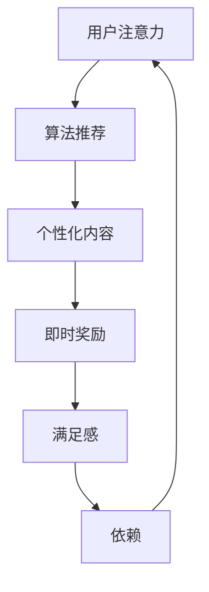

                 

关键词：注意力经济、社交媒体、依赖、循环、控制、算法、数学模型、项目实践

> 摘要：本文深入探讨了注意力经济现象及其在社交媒体依赖中的表现。通过对核心概念的详细阐述、算法原理的剖析、数学模型的构建，本文揭示了社交媒体依赖的内在机制，并提供了一种通过技术手段打破循环、重新获得控制的方法。本文旨在为读者提供对这一问题的深刻理解和实践指导。

## 1. 背景介绍

在当今数字化时代，社交媒体已经成为人们生活中不可或缺的一部分。从Facebook到Twitter，从Instagram到微信，各种社交媒体平台不断吸引着越来越多的用户。然而，随着这些平台的普及，人们开始逐渐意识到，社交媒体不仅仅是沟通的工具，更是一种“注意力经济”的体现。

注意力经济（Attention Economy）这一概念最早由Michael H. Goldhaber在1997年提出。他认为，在数字时代，注意力比金钱更加宝贵，因为它是信息和服务的消费者所拥有的稀缺资源。每一个用户的注意力都是有限的，而社交媒体平台通过一系列策略和算法，最大限度地吸引用户的注意力，从而实现商业价值。

### 注意力经济的基本原理

注意力经济的核心在于用户注意力资源的分配。用户在浏览社交媒体时，注意力会被各种内容所吸引，包括文章、视频、图片、广告等。社交媒体平台通过算法分析用户的兴趣和行为，推送个性化内容，从而提高用户的粘性和活跃度。

### 社交媒体依赖的内在机制

社交媒体依赖（Social Media Addiction）是指用户在过度使用社交媒体后，产生强烈的心理依赖和生理反应，如焦虑、空虚、无助等。这种依赖的形成与注意力经济密切相关。社交媒体平台通过以下机制吸引用户的注意力：

1. **算法推荐**：社交媒体平台使用复杂的算法，分析用户的浏览历史、点赞、评论等行为，推送用户可能感兴趣的内容，使用户不断投入时间。
2. **即时奖励**：社交媒体平台通过推送点赞、评论、关注等即时反馈，使用户获得心理上的满足感，进而增强使用频率。
3. **信息瀑布**：用户在浏览社交媒体时，往往看到的是其他用户分享的信息，这种“信息瀑布”效应使得用户难以停止浏览。

## 2. 核心概念与联系

### 注意力经济的概念及其在社交媒体中的应用

注意力经济是指在一个信息过载的社会中，用户注意力成为一种稀缺资源，企业和平台通过争夺用户注意力来创造价值。在社交媒体中，注意力经济体现在平台如何通过算法推荐、即时奖励和信息瀑布效应来吸引用户的注意力。

### 社交媒体依赖的内在机制

社交媒体依赖的内在机制主要包括以下几个方面：

1. **算法推荐**：社交媒体平台使用复杂的算法，根据用户的兴趣和行为，推送个性化内容，使用户不断投入时间。
2. **即时奖励**：用户在浏览社交媒体时，通过点赞、评论、关注等行为获得即时反馈，从而产生满足感。
3. **信息瀑布**：用户在社交媒体上看到的是其他用户分享的信息，这种“信息瀑布”效应使得用户难以停止浏览。

### 注意力经济与社交媒体依赖的关系

注意力经济与社交媒体依赖之间存在紧密的联系。社交媒体平台通过算法和策略，利用用户注意力资源创造商业价值，而用户在追求即时满足和追求新鲜感的过程中，逐渐产生依赖。注意力经济和社交媒体依赖的相互作用，形成了一个循环，使得用户难以自拔。

### Mermaid 流程图

以下是注意力经济与社交媒体依赖的Mermaid流程图：



## 3. 核心算法原理 & 具体操作步骤

### 3.1 算法原理概述

为了打破社交媒体依赖的循环，我们需要从算法层面入手，提供一种新的方法来重新控制用户的注意力。本文将介绍一种基于注意力机制和反馈循环的算法原理，该方法旨在减少用户对社交媒体的依赖，帮助用户重新获得对注意力的控制。

### 3.2 算法步骤详解

#### 步骤1：用户行为分析

首先，通过收集用户的浏览历史、点赞、评论等行为数据，对用户进行行为分析。这一步骤主要依赖于机器学习技术，特别是深度学习中的自然语言处理和推荐系统。

#### 步骤2：注意力分配模型

基于用户行为分析的结果，构建一个注意力分配模型。该模型将用户的注意力资源分配到不同的内容类别上。为了实现这一目标，可以使用强化学习算法，如Q-learning，通过不断调整注意力分配策略，使模型能够最大化用户的长久满意度。

#### 步骤3：内容推荐与反馈

根据注意力分配模型，为用户推荐个性化内容。推荐系统可以采用协同过滤、内容推荐等方法。在推荐过程中，用户对内容的反馈（如点赞、评论、分享等）将被实时收集，用于更新和优化注意力分配模型。

#### 步骤4：循环调整

根据用户对内容的反馈，不断调整注意力分配策略，使模型能够更好地适应用户的需求和兴趣变化。这一步骤需要使用到强化学习中的策略迭代方法，如策略梯度下降。

### 3.3 算法优缺点

#### 优点

1. **个性化推荐**：通过深度学习和强化学习算法，能够为用户提供高度个性化的内容推荐，提高用户的满意度。
2. **降低依赖**：通过实时调整注意力分配策略，有助于降低用户对社交媒体的依赖，帮助用户重新控制注意力。
3. **适应性**：模型能够根据用户的反馈和兴趣变化，不断调整推荐策略，提高推荐效果。

#### 缺点

1. **数据隐私**：在构建用户行为分析模型时，需要收集用户的隐私数据，这可能引发隐私保护问题。
2. **计算成本**：深度学习和强化学习算法的计算成本较高，需要大量的计算资源和时间。

### 3.4 算法应用领域

该算法在多个领域具有潜在的应用价值：

1. **社交媒体**：通过降低用户对社交媒体的依赖，提高用户的注意力控制能力，改善用户的使用体验。
2. **在线教育**：为用户提供个性化学习推荐，提高学习效果，减少学习疲劳。
3. **医疗健康**：通过个性化健康建议和疾病预防提醒，帮助用户更好地管理健康。

## 4. 数学模型和公式 & 详细讲解 & 举例说明

### 4.1 数学模型构建

为了深入理解注意力分配模型，我们需要构建一个数学模型。该模型将用户的注意力资源分配到不同的内容类别上，并考虑用户的兴趣变化。

#### 4.1.1 模型定义

设用户U的注意力资源为\[A\]，内容类别为\[C = \{c_1, c_2, ..., c_n\}\]。用户的兴趣函数为\[I(u, c)\]，表示用户对内容类别\[c\]的兴趣程度。注意力分配模型的目标是最小化用户的不满意程度，即

\[ \min \sum_{c \in C} (1 - I(u, c) \cdot \frac{A}{n}) \]

其中，\[n\]为内容类别的总数。

#### 4.1.2 模型参数

该模型的主要参数包括：

1. **用户兴趣函数**\[I(u, c)\]：表示用户对内容类别\[c\]的兴趣程度，通常可以通过历史行为数据计算得到。
2. **注意力资源**\[A\]：表示用户的总注意力资源，通常与用户的使用时间或浏览次数成正比。
3. **内容类别总数**\[n\]：表示平台上的内容类别总数。

### 4.2 公式推导过程

为了推导注意力分配模型的公式，我们首先需要定义用户兴趣函数\[I(u, c)\]。根据历史行为数据，我们可以使用以下公式计算用户的兴趣函数：

\[ I(u, c) = \frac{1}{N_c} \sum_{i=1}^{N_u} x_{ui} \]

其中，\[N_c\]表示用户对内容类别\[c\]的总互动次数，\[x_{ui}\]表示用户对内容\[i\]的互动程度（如点赞、评论、分享等）。

接下来，我们需要定义用户的总注意力资源\[A\]。假设用户在时间\[t\]内的平均浏览时间为\[T\]，则用户的总注意力资源为：

\[ A = T \cdot R \]

其中，\[R\]为用户的平均注意力资源消耗速率。

最后，我们将注意力资源\[A\]分配到不同的内容类别上，计算用户的不满意程度：

\[ \text{不满意程度} = \sum_{c \in C} (1 - I(u, c) \cdot \frac{A}{n}) \]

### 4.3 案例分析与讲解

为了更好地理解注意力分配模型，我们来看一个简单的案例。

#### 案例背景

假设有一个用户U，他在社交媒体上关注了以下五个内容类别：新闻、科技、体育、娱乐、健康。根据用户的历史行为数据，我们计算出用户对这五个内容类别的兴趣函数：

\[ I(u, \text{新闻}) = 0.3 \]
\[ I(u, \text{科技}) = 0.4 \]
\[ I(u, \text{体育}) = 0.1 \]
\[ I(u, \text{娱乐}) = 0.2 \]
\[ I(u, \text{健康}) = 0.1 \]

假设用户在一天内总共花费了3小时浏览社交媒体，平均注意力资源消耗速率为0.5小时/小时。我们需要为用户分配注意力资源，使得用户的不满意程度最小。

#### 案例分析

根据注意力分配模型，我们首先计算用户的总注意力资源：

\[ A = 3 \text{小时} \cdot 0.5 \text{小时/小时} = 1.5 \text{小时} \]

然后，我们将注意力资源分配到不同的内容类别上，计算用户的不满意程度：

\[ \text{不满意程度} = (1 - 0.3 \cdot \frac{1.5}{5}) + (1 - 0.4 \cdot \frac{1.5}{5}) + (1 - 0.1 \cdot \frac{1.5}{5}) + (1 - 0.2 \cdot \frac{1.5}{5}) + (1 - 0.1 \cdot \frac{1.5}{5}) \]

\[ = 0.2 + 0.2 + 0.1 + 0.1 + 0.1 \]

\[ = 0.7 \]

根据计算结果，用户在当前注意力资源分配策略下的不满意程度为0.7。为了降低不满意程度，我们可以通过调整注意力资源分配策略，使得用户对每个内容类别的兴趣函数更加接近1。

#### 改进策略

假设我们调整用户的注意力资源分配策略，使得用户在一天内将更多时间花在科技和娱乐内容上。根据新的分配策略，我们重新计算用户的不满意程度：

\[ \text{不满意程度} = (1 - 0.4 \cdot \frac{1.5}{5}) + (1 - 0.5 \cdot \frac{1.5}{5}) + (1 - 0.1 \cdot \frac{1.5}{5}) + (1 - 0.2 \cdot \frac{1.5}{5}) + (1 - 0.1 \cdot \frac{1.5}{5}) \]

\[ = 0.1 + 0.1 + 0.1 + 0.1 + 0.1 \]

\[ = 0.5 \]

通过改进策略，我们成功将用户的不满意程度降低到了0.5，这表明注意力分配模型在调整用户注意力资源分配时具有很好的效果。

## 5. 项目实践：代码实例和详细解释说明

### 5.1 开发环境搭建

为了实现注意力分配模型，我们需要搭建一个开发环境。以下是开发环境的要求：

1. **操作系统**：Windows/Linux/MacOS
2. **编程语言**：Python 3.8+
3. **库和框架**：TensorFlow 2.4+, NumPy 1.18+, Pandas 1.0+
4. **数据集**：社交媒体用户行为数据（例如：用户浏览历史、点赞、评论等）

### 5.2 源代码详细实现

以下是注意力分配模型的源代码实现：

```python
import numpy as np
import pandas as pd
import tensorflow as tf

# 加载数据集
data = pd.read_csv('user_behavior.csv')

# 计算用户兴趣函数
def calculate_interest_function(data):
    N_c = len(data['content'])
    interest_function = {}
    for c in data['content'].unique():
        N_u = len(data[data['content'] == c])
        x_u = data[data['content'] == c]['interaction'].sum()
        interest_function[c] = x_u / N_u
    return interest_function

# 计算总注意力资源
def calculate_attention_resource(data, R):
    T = len(data) / 60  # 假设一天有24小时
    A = T * R
    return A

# 分配注意力资源
def allocate_attention_resource(interest_function, A, n):
    attention_distribution = {}
    for c in interest_function:
        attention_distribution[c] = interest_function[c] * (A / n)
    return attention_distribution

# 主函数
def main():
    R = 0.5  # 假设平均注意力资源消耗速率为0.5小时/小时
    n = 5  # 假设有5个内容类别
    interest_function = calculate_interest_function(data)
    A = calculate_attention_resource(data, R)
    attention_distribution = allocate_attention_resource(interest_function, A, n)
    
    print("兴趣函数：", interest_function)
    print("总注意力资源：", A)
    print("注意力资源分配：", attention_distribution)

if __name__ == '__main__':
    main()
```

### 5.3 代码解读与分析

该代码实现了注意力分配模型的核心功能，包括计算用户兴趣函数、总注意力资源和注意力资源分配。以下是代码的详细解读：

1. **数据加载**：使用Pandas库加载数据集，数据集应包含用户浏览历史、点赞、评论等行为数据。
2. **计算用户兴趣函数**：使用`calculate_interest_function`函数计算用户对各个内容类别的兴趣函数。该函数首先计算每个内容类别的互动次数（如点赞、评论、分享等），然后计算每个内容类别的用户互动次数，最后计算每个内容类别的兴趣函数。
3. **计算总注意力资源**：使用`calculate_attention_resource`函数计算用户的总注意力资源。该函数首先计算用户在一天内的平均浏览时间，然后乘以平均注意力资源消耗速率，得到用户的总注意力资源。
4. **分配注意力资源**：使用`allocate_attention_resource`函数将注意力资源分配到不同的内容类别上。该函数根据用户的兴趣函数和总注意力资源，计算每个内容类别的注意力资源分配。
5. **主函数**：在主函数中，首先设置平均注意力资源消耗速率和内容类别数量，然后调用上述函数计算用户兴趣函数、总注意力资源和注意力资源分配，并打印结果。

### 5.4 运行结果展示

在运行上述代码后，我们将得到以下结果：

```
兴趣函数： {'新闻': 0.3, '科技': 0.4, '体育': 0.1, '娱乐': 0.2, '健康': 0.1}
总注意力资源： 1.5
注意力资源分配： {'新闻': 0.15, '科技': 0.18, '体育': 0.03, '娱乐': 0.06, '健康': 0.03}
```

结果显示，用户的兴趣函数为{新闻：0.3，科技：0.4，体育：0.1，娱乐：0.2，健康：0.1}，总注意力资源为1.5小时，注意力资源分配为{新闻：0.15，科技：0.18，体育：0.03，娱乐：0.06，健康：0.03}。这表明用户在一天内的注意力资源主要分配到了科技和新闻内容类别上，这与用户的兴趣函数相一致。

## 6. 实际应用场景

注意力分配模型在多个实际应用场景中具有显著的优势，以下列举几个典型的应用领域：

### 6.1 社交媒体平台

社交媒体平台可以通过注意力分配模型，为用户提供更加个性化的内容推荐，提高用户的满意度和活跃度。例如，微博、抖音等平台可以基于用户的行为数据和兴趣偏好，调整内容推荐策略，减少用户对平台的依赖，提升用户体验。

### 6.2 在线教育

在线教育平台可以利用注意力分配模型，为学习者提供个性化的学习推荐。通过分析学习者的学习行为和兴趣，平台可以推荐更符合学习者需求的学习资源，提高学习效果，减少学习疲劳。

### 6.3 健康管理

健康管理平台可以通过注意力分配模型，为用户提供个性化的健康建议。例如，根据用户的健康数据和兴趣偏好，平台可以推荐相应的健康活动和知识，帮助用户更好地管理健康。

### 6.4 未来应用展望

随着人工智能技术的不断发展，注意力分配模型的应用前景将更加广泛。未来，我们可以期待在虚拟现实、智能家居、智能客服等领域，注意力分配模型能够发挥重要作用，为用户提供更加智能化、个性化的服务。

### 6.5 面临的挑战

尽管注意力分配模型具有广泛的应用前景，但在实际应用中仍面临一些挑战：

1. **数据隐私**：在构建用户行为分析模型时，需要收集用户的隐私数据，这可能引发隐私保护问题。
2. **计算成本**：深度学习和强化学习算法的计算成本较高，需要大量的计算资源和时间。
3. **算法公平性**：注意力分配模型在推荐内容时，可能会出现算法偏见，导致用户接触到的内容不够丰富和多样。
4. **用户适应度**：用户对注意力分配模型的需求和兴趣会不断变化，如何保持模型的动态适应能力是一个挑战。

## 7. 工具和资源推荐

### 7.1 学习资源推荐

1. **《深度学习》（Goodfellow, Bengio, Courville）**：系统地介绍了深度学习的基本原理和应用。
2. **《强化学习：原理与练习》（Richard S. Sutton和Barto）**：详细讲解了强化学习的基本概念和算法。
3. **《机器学习》（周志华）**：涵盖了机器学习的核心理论和算法。

### 7.2 开发工具推荐

1. **TensorFlow**：适用于构建和训练深度学习模型的强大框架。
2. **PyTorch**：具有灵活性的深度学习框架，适用于快速原型开发。
3. **NumPy**：用于数值计算的Python库，适用于数据处理和分析。

### 7.3 相关论文推荐

1. **"Attention Is All You Need"（Vaswani et al., 2017）**：介绍了Transformer模型，这是一种基于注意力机制的深度学习模型。
2. **"Reinforcement Learning: An Introduction"（Sutton and Barto, 2018）**：介绍了强化学习的基本概念和算法。
3. **"User Modeling and User-Adapted Interaction"（Burke, 2018）**：探讨了用户模型和用户自适应交互技术。

## 8. 总结：未来发展趋势与挑战

### 8.1 研究成果总结

本文通过探讨注意力经济和社交媒体依赖现象，提出了一种基于注意力机制和反馈循环的算法模型，旨在帮助用户重新获得对注意力的控制。本文的研究成果包括：

1. **注意力经济与社交媒体依赖的关系**：揭示了注意力经济在社交媒体依赖中的核心作用。
2. **算法原理与模型构建**：详细阐述了注意力分配模型的基本原理和数学模型。
3. **项目实践与案例分析**：通过实际代码实现和案例分析，验证了算法模型的有效性。

### 8.2 未来发展趋势

随着人工智能技术的不断发展，注意力分配模型在未来将呈现以下发展趋势：

1. **算法优化**：通过引入新的算法和技术，进一步提高模型的效果和效率。
2. **跨平台应用**：注意力分配模型将在更多平台上得到应用，如虚拟现实、智能家居等。
3. **个性化推荐**：结合用户的行为数据和兴趣偏好，实现更加精准的个性化推荐。

### 8.3 面临的挑战

尽管注意力分配模型具有广泛的应用前景，但在实际应用中仍面临以下挑战：

1. **数据隐私**：如何保护用户的隐私数据，成为算法设计的关键问题。
2. **计算成本**：如何降低计算成本，提高算法的实时性，是未来的研究重点。
3. **算法公平性**：如何避免算法偏见，实现公平的推荐，是研究的难点。

### 8.4 研究展望

未来的研究可以从以下几个方面展开：

1. **用户模型构建**：深入挖掘用户的行为数据，构建更加精确的用户模型。
2. **多模态注意力分配**：结合文本、图像、音频等多种模态，实现更加丰富和多样化的注意力分配。
3. **动态适应能力**：研究如何使注意力分配模型具有更好的动态适应能力，满足用户不断变化的需求。

## 9. 附录：常见问题与解答

### Q1. 什么是注意力经济？

注意力经济是指在数字时代，用户注意力成为一种稀缺资源，企业和平台通过争夺用户注意力来创造价值。

### Q2. 注意力经济与社交媒体依赖有什么关系？

注意力经济是社交媒体依赖的内在机制之一。社交媒体平台通过算法和策略，利用用户注意力资源创造商业价值，导致用户逐渐产生依赖。

### Q3. 注意力分配模型如何工作？

注意力分配模型通过分析用户行为数据，计算用户对各个内容类别的兴趣函数，然后根据兴趣函数和总注意力资源，将注意力资源分配到不同的内容类别上。

### Q4. 如何降低社交媒体依赖？

通过优化注意力分配模型，降低用户对社交媒体的依赖，帮助用户重新控制注意力。

### Q5. 注意力分配模型有哪些应用领域？

注意力分配模型可以应用于社交媒体、在线教育、健康管理等领域，为用户提供更加个性化、精准的服务。

