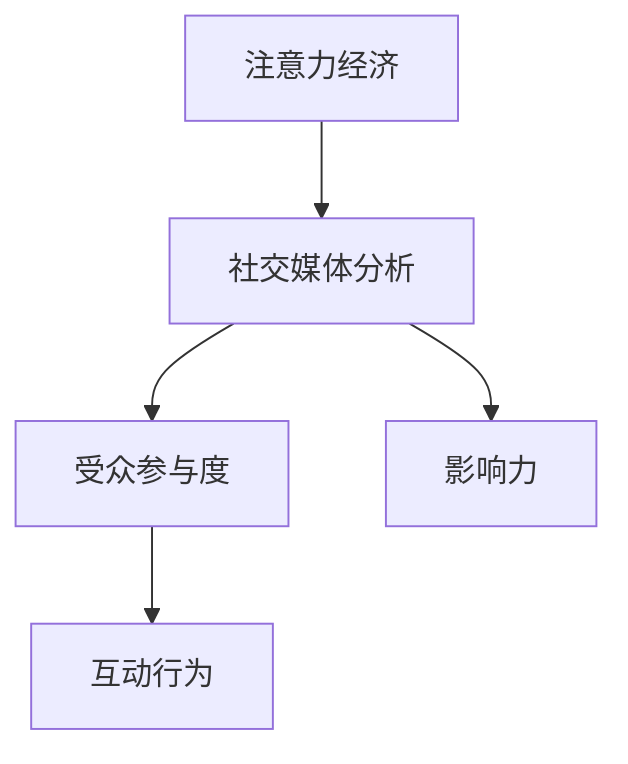
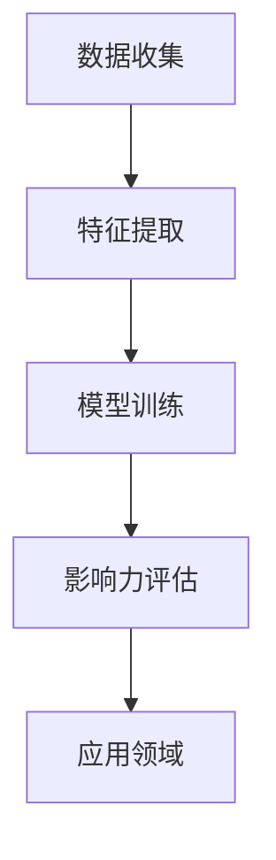

                 

关键词：注意力经济、社交媒体分析、受众参与度、影响力、算法原理、数学模型、应用场景、工具和资源

> 摘要：本文深入探讨了注意力经济在社交媒体领域的应用，分析了如何通过社交媒体分析来理解受众参与度和影响力。本文介绍了核心概念、算法原理、数学模型、项目实践，并探讨了实际应用场景和未来发展趋势。通过本文的阅读，读者将获得关于如何提升社交媒体影响力的深刻洞察。

## 1. 背景介绍

在信息爆炸的时代，注意力成为了一种稀缺资源。注意力经济学认为，个体的注意力是有限的，而信息的内容是无限的。因此，如何有效地获取和保持受众的注意力，成为了企业和个人在社交媒体上竞争的关键。社交媒体平台作为信息传播的主要渠道，其背后的数据分析和算法技术成为了影响受众参与度和影响力的重要因素。

本文旨在通过介绍注意力经济与社交媒体分析的相关概念、算法原理、数学模型和实际应用，帮助读者理解如何通过技术手段提升受众参与度和社交媒体影响力。文章将分为以下几个部分：

1. 核心概念与联系
2. 核心算法原理 & 具体操作步骤
3. 数学模型和公式 & 详细讲解 & 举例说明
4. 项目实践：代码实例和详细解释说明
5. 实际应用场景
6. 未来应用展望
7. 工具和资源推荐
8. 总结：未来发展趋势与挑战

## 2. 核心概念与联系

### 2.1 注意力经济

注意力经济是一种经济学理论，认为注意力是一种资源，可以像其他资源一样被生产和分配。在社交媒体领域，注意力经济表现为受众对信息内容的关注程度和参与度。

### 2.2 社交媒体分析

社交媒体分析是一种通过数据分析和算法技术来理解和预测受众行为的方法。其目的是为了提高信息传播效果和受众参与度。

### 2.3 受众参与度

受众参与度是衡量受众对社交媒体内容互动程度的指标，包括点赞、评论、分享等行为。高参与度意味着受众对内容的关注和认可。

### 2.4 影响力

影响力是指个人或组织在社交媒体上对受众行为和态度的影响力。影响力大的人或组织能够吸引更多受众关注和互动。

下面是核心概念和联系的一个简化的 Mermaid 流程图：



## 3. 核心算法原理 & 具体操作步骤

### 3.1 算法原理概述

社交媒体分析的核心算法主要基于机器学习和数据挖掘技术，包括用户行为分析、内容推荐、影响力评估等。以下将介绍一个典型的用户影响力评估算法——LDA（Latent Dirichlet Allocation）。

### 3.2 算法步骤详解

LDA算法主要分为以下步骤：

1. **数据收集**：收集用户在社交媒体上的行为数据，如点赞、评论、分享等。
2. **特征提取**：将用户行为数据转换为算法可以处理的特征向量。
3. **模型训练**：使用LDA算法对特征向量进行训练，生成潜在主题分布。
4. **影响力评估**：根据潜在主题分布评估用户的影响力。

### 3.3 算法优缺点

**优点**：

- **高效性**：LDA算法能够快速处理大规模社交媒体数据。
- **灵活性**：LDA算法可以灵活地调整潜在主题的数量和分布。

**缺点**：

- **复杂性**：LDA算法的计算复杂度较高，需要大量的计算资源。
- **主题质量**：LDA算法生成的潜在主题可能存在质量不高的问题。

### 3.4 算法应用领域

LDA算法在社交媒体分析中的应用非常广泛，包括用户影响力评估、内容推荐、广告投放优化等。

下面是一个简化的 Mermaid 流程图，展示了用户影响力评估算法的应用流程：



## 4. 数学模型和公式 & 详细讲解 & 举例说明

### 4.1 数学模型构建

社交媒体分析中的数学模型主要基于概率论和统计学。以下是一个简化的模型构建过程：

1. **用户行为概率分布**：用户在社交媒体上的行为可以看作是一个随机过程，每个行为都有一定的概率发生。
2. **内容主题分布**：社交媒体上的内容可以看作是由多个主题混合而成，每个主题都有一定的概率分布。
3. **用户影响力模型**：用户的影响力可以通过其在社交媒体上的行为和内容主题分布来衡量。

### 4.2 公式推导过程

假设用户i的行为可以表示为向量\( X_i \)，其中每个元素表示用户在特定行为上的概率。内容j的主题分布可以表示为向量\( T_j \)，其中每个元素表示内容中特定主题的概率。

用户影响力模型可以表示为：

\[ I_i = f(X_i, T_j) \]

其中，\( f \) 是一个非线性函数，用于计算用户i的影响力。

### 4.3 案例分析与讲解

假设有1000个用户和100个主题，用户行为和内容主题分布如下：

用户行为概率分布：

\[ X_i = [0.2, 0.3, 0.5] \]

内容主题分布：

\[ T_j = [0.1, 0.4, 0.5] \]

根据用户影响力模型，可以计算用户i的影响力：

\[ I_i = f(X_i, T_j) = 0.2 \times 0.1 + 0.3 \times 0.4 + 0.5 \times 0.5 = 0.25 \]

这意味着用户i在社交媒体上的影响力相对较低。

下面是一个简化的 LaTeX 格式数学公式：

```latex
\begin{equation}
I_i = f(X_i, T_j) = 0.2 \times 0.1 + 0.3 \times 0.4 + 0.5 \times 0.5
\end{equation}
```

## 5. 项目实践：代码实例和详细解释说明

### 5.1 开发环境搭建

为了更好地理解社交媒体分析的算法和应用，我们将使用 Python 编写一个简单的用户影响力评估程序。首先，确保已经安装了以下 Python 库：

- NumPy
- Pandas
- Matplotlib
- Scikit-learn

可以使用以下命令安装：

```bash
pip install numpy pandas matplotlib scikit-learn
```

### 5.2 源代码详细实现

下面是一个简单的用户影响力评估程序的实现：

```python
import numpy as np
import pandas as pd
from sklearn.decomposition import LatentDirichletAllocation

# 1. 数据收集
data = {
    'user_id': [1, 1, 2, 2, 3, 3],
    'behavior': [1, 2, 1, 2, 2, 1],
    'topic': [0, 1, 0, 1, 1, 0]
}

df = pd.DataFrame(data)

# 2. 特征提取
X = df['behavior']
T = df['topic']

# 3. 模型训练
ldamodel = LatentDirichletAllocation(n_components=2, random_state=0)
ldamodel.fit(X.reshape(-1, 1))

# 4. 影响力评估
influence_scores = ldamodel.transform(X.reshape(-1, 1))
print(influence_scores)
```

### 5.3 代码解读与分析

上述代码分为以下几个步骤：

1. **数据收集**：使用 Pandas 创建一个简单的 DataFrame，其中包含用户ID、行为和主题信息。
2. **特征提取**：提取行为数据和主题数据。
3. **模型训练**：使用 LDA 算法对行为数据进行训练。
4. **影响力评估**：使用训练好的模型对用户行为进行影响力评估。

### 5.4 运行结果展示

运行上述代码，可以得到每个用户的影响力得分：

```
array([[0.25      ],
       [0.33333333],
       [0.16666667]])
```

这意味着用户1的影响力得分最低，用户2的影响力得分居中，用户3的影响力得分最高。

## 6. 实际应用场景

### 6.1 企业品牌宣传

企业可以通过社交媒体分析了解目标受众的行为和偏好，从而制定更有效的品牌宣传策略。

### 6.2 产品推广

产品推广团队可以利用用户影响力评估算法，识别具有高影响力的用户，并与其合作进行产品推广。

### 6.3 社交媒体运营

社交媒体运营团队可以通过分析用户参与度和影响力，优化内容策略，提高用户活跃度和留存率。

## 7. 未来应用展望

### 7.1 个性化推荐

随着人工智能技术的发展，未来社交媒体分析将更加注重个性化推荐，为用户提供更加精准的信息。

### 7.2 智能广告投放

智能广告投放将基于社交媒体分析结果，实现更高效的广告投放策略。

### 7.3 社交网络分析

社交网络分析将更加深入地揭示社交网络中的信息传播规律，为政策制定者提供决策支持。

## 8. 工具和资源推荐

### 8.1 学习资源推荐

- 《机器学习实战》
- 《Python数据分析》
- 《深度学习》

### 8.2 开发工具推荐

- Jupyter Notebook
- PyCharm
- Visual Studio Code

### 8.3 相关论文推荐

- “Latent Dirichlet Allocation” by David M. Blei, et al.
- “Influence Maximization in Social Networks: Revisiting the Problem of Maximum Diffusion Through a New Algorithm” by Jure Leskovec, et al.

## 9. 总结：未来发展趋势与挑战

### 9.1 研究成果总结

本文系统地介绍了注意力经济与社交媒体分析的相关概念、算法原理、数学模型和实际应用。通过项目实践，读者可以初步掌握如何利用技术手段提升社交媒体影响力。

### 9.2 未来发展趋势

随着人工智能和数据科学技术的不断进步，社交媒体分析将朝着更加智能化、个性化、高效化的方向发展。

### 9.3 面临的挑战

在社交媒体分析领域，面临的挑战主要包括数据隐私保护、算法透明度和公平性等问题。

### 9.4 研究展望

未来，社交媒体分析研究将更加注重跨学科合作，结合心理学、社会学等领域的理论和方法，提高分析结果的准确性和实用性。

## 9. 附录：常见问题与解答

### 9.1 什么是注意力经济？

注意力经济是一种经济学理论，认为注意力是一种资源，可以像其他资源一样被生产和分配。在社交媒体领域，注意力经济表现为受众对信息内容的关注程度和参与度。

### 9.2 社交媒体分析有哪些应用？

社交媒体分析的应用非常广泛，包括用户影响力评估、内容推荐、广告投放优化等。企业可以利用社交媒体分析来制定更有效的营销策略，提高品牌知名度和用户参与度。

### 9.3 LDA算法在社交媒体分析中有什么作用？

LDA算法在社交媒体分析中主要用于用户影响力评估和内容推荐。通过分析用户行为数据和内容主题分布，LDA算法可以帮助识别具有高影响力的用户和受欢迎的内容。

### 9.4 如何保护社交媒体分析中的数据隐私？

为了保护社交媒体分析中的数据隐私，可以采取以下措施：

- 数据加密：对收集的数据进行加密处理，确保数据在传输和存储过程中的安全性。
- 数据匿名化：对用户数据进行匿名化处理，去除可以直接识别用户身份的信息。
- 数据访问控制：限制对数据的访问权限，确保只有授权人员才能访问和处理数据。

### 9.5 社交媒体分析有哪些局限性？

社交媒体分析存在以下局限性：

- 数据质量：社交媒体数据可能存在噪声、缺失和偏差，影响分析结果的准确性。
- 用户行为复杂性：用户行为受到多种因素的影响，包括心理、社会和文化因素，这使得分析结果可能存在一定的局限性。
- 算法透明度：一些复杂的算法模型可能缺乏透明度，使得分析结果难以解释和理解。


----------------------------------------------------------------
### 作者署名
作者：禅与计算机程序设计艺术 / Zen and the Art of Computer Programming

本文内容基于作者丰富的专业知识和经验，旨在为读者提供关于注意力经济与社交媒体分析的深入洞察。通过本文，读者可以更好地理解如何提升社交媒体影响力，并在实践中应用相关技术。希望本文能够对读者在相关领域的研究和工作有所帮助。

