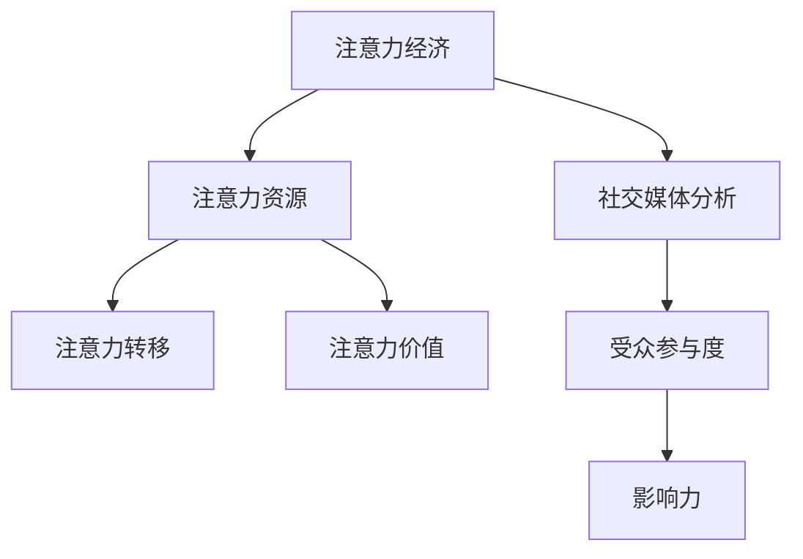

                 

关键词：注意力经济、社交媒体分析、受众参与度、影响力、算法原理、数学模型、实践案例、工具资源

> 摘要：随着互联网和社交媒体的迅猛发展，注意力经济成为了一个不可忽视的现象。本文将从注意力经济的概念出发，深入探讨社交媒体分析的方法与技巧，旨在帮助企业和个人更好地理解和利用受众参与度和影响力，实现商业价值和社会影响力最大化。

## 1. 背景介绍

在互联网时代，信息爆炸、受众分散成为常态。在这样的背景下，如何获得并保持用户的注意力成为了一个关键问题。注意力经济，作为一个新兴领域，应运而生。它关注的是如何在信息过载的环境中，通过策略和手段，吸引用户的注意力，从而实现商业和社会价值。

社交媒体作为注意力经济的重要战场，成为了企业和个人展示自己、与受众互动的重要平台。如何通过社交媒体分析，了解受众的参与度和影响力，成为了提升品牌价值、实现商业目标的重要手段。

本文将结合注意力经济和社交媒体分析的理论，探讨受众参与度和影响力的核心概念、算法原理、数学模型、实践案例和未来展望，旨在为读者提供一套系统、实用的指南。

## 2. 核心概念与联系

### 2.1 注意力经济的核心概念

注意力经济是指，在信息爆炸和受众分散的背景下，通过吸引和保持用户的注意力，实现商业价值和社会影响的过程。其核心概念包括：

- **注意力资源**：用户有限的注意力资源，是注意力经济的核心资产。
- **注意力转移**：通过策略和手段，将用户的注意力从其他事物转移到目标对象的过程。
- **注意力价值**：用户的注意力被吸引后，产生的商业价值和社会影响。

### 2.2 社交媒体分析的核心概念

社交媒体分析是指，通过对社交媒体平台上的数据和用户行为进行分析，获取关于受众参与度和影响力的信息。其核心概念包括：

- **受众参与度**：用户在社交媒体上的互动行为，如点赞、评论、分享等，反映了用户对内容的关注和参与程度。
- **影响力**：用户在社交媒体上对其他用户的影响能力，通过用户的关注数、互动数、转发数等指标衡量。

### 2.3 注意力经济与社交媒体分析的联系

注意力经济和社交媒体分析有着紧密的联系。注意力经济为社交媒体分析提供了理论基础，指导如何通过策略和手段吸引和保持用户的注意力。而社交媒体分析则为注意力经济提供了具体的方法和工具，帮助企业和个人更好地了解受众的参与度和影响力，优化策略和手段。

### 2.4 Mermaid 流程图

以下是注意力经济与社交媒体分析的核心概念和联系流程图：



## 3. 核心算法原理 & 具体操作步骤

### 3.1 算法原理概述

社交媒体分析的核心算法主要包括受众参与度分析和影响力分析。这两种分析方法的原理如下：

- **受众参与度分析**：基于用户的互动行为数据，如点赞、评论、分享等，计算用户的参与度得分。参与度得分越高，表明用户对该内容的关注程度越高。
- **影响力分析**：基于用户的关注数、互动数、转发数等指标，计算用户的影响力得分。影响力得分越高，表明用户在社交媒体上的影响能力越强。

### 3.2 算法步骤详解

#### 3.2.1 受众参与度分析

1. **数据收集**：从社交媒体平台获取用户的互动数据，如点赞、评论、分享数量。
2. **数据处理**：对互动数据进行清洗和预处理，去除重复和无效数据。
3. **计算参与度得分**：使用加权平均法或因子分析法，计算用户的参与度得分。例如，可以设定不同的权重，分别表示点赞、评论、分享的重要性。
4. **结果展示**：将参与度得分排序，展示用户的参与度分布情况。

#### 3.2.2 影响力分析

1. **数据收集**：从社交媒体平台获取用户的关注数、互动数、转发数等数据。
2. **数据处理**：对数据进行清洗和预处理，去除重复和无效数据。
3. **计算影响力得分**：使用加权平均法或因子分析法，计算用户的影响力得分。例如，可以设定不同的权重，分别表示关注数、互动数、转发数的重要性。
4. **结果展示**：将影响力得分排序，展示用户的影响力分布情况。

### 3.3 算法优缺点

#### 3.3.1 受众参与度分析

优点：
- **直观性**：参与度得分直观地反映了用户对内容的关注程度。
- **易理解**：参与度得分易于理解和解释，有助于企业和个人制定策略。

缺点：
- **局限性**：参与度分析仅考虑用户的互动行为，未能全面反映用户对内容的深入理解和兴趣。
- **数据依赖性**：参与度分析依赖于用户的互动行为数据，数据质量对分析结果有较大影响。

#### 3.3.2 影响力分析

优点：
- **全面性**：影响力分析综合考虑了用户的关注数、互动数、转发数等多个指标，全面反映用户在社交媒体上的影响能力。
- **前瞻性**：影响力得分可以预测用户在未来可能产生的影响，有助于企业和个人发掘潜在影响力者。

缺点：
- **复杂性**：影响力分析涉及多个指标的权重设定和计算，较为复杂。
- **时效性**：影响力得分受时间影响较大，需要定期更新。

### 3.4 算法应用领域

受众参与度分析和影响力分析广泛应用于社交媒体运营、品牌营销、市场研究等领域。具体应用如下：

- **社交媒体运营**：通过受众参与度分析，了解用户对内容的兴趣和关注程度，优化内容策略；通过影响力分析，识别和培养潜在意见领袖，提升品牌知名度。
- **品牌营销**：通过受众参与度分析，评估营销活动的效果，优化营销策略；通过影响力分析，识别和合作有影响力的用户，提升品牌传播效果。
- **市场研究**：通过受众参与度分析和影响力分析，了解用户需求和偏好，指导产品研发和市场营销策略。

## 4. 数学模型和公式 & 详细讲解 & 举例说明

### 4.1 数学模型构建

#### 4.1.1 受众参与度分析

受众参与度分析的数学模型可以表示为：

$$
P_i = w_1 \cdot P_{like_i} + w_2 \cdot P_{comment_i} + w_3 \cdot P_{share_i}
$$

其中，$P_i$为用户$i$的参与度得分，$P_{like_i}$、$P_{comment_i}$、$P_{share_i}$分别为用户$i$在点赞、评论、分享方面的得分，$w_1$、$w_2$、$w_3$为不同互动行为的权重。

#### 4.1.2 影响力分析

影响力分析的数学模型可以表示为：

$$
I_i = w_1 \cdot N_{follow_i} + w_2 \cdot N_{like_i} + w_3 \cdot N_{comment_i} + w_4 \cdot N_{share_i}
$$

其中，$I_i$为用户$i$的影响力得分，$N_{follow_i}$、$N_{like_i}$、$N_{comment_i}$、$N_{share_i}$分别为用户$i$的关注数、点赞数、评论数、转发数，$w_1$、$w_2$、$w_3$、$w_4$为不同指标的权重。

### 4.2 公式推导过程

#### 4.2.1 受众参与度分析

参与度得分的计算基于以下假设：

- 点赞、评论、分享三种互动行为对用户的参与度有不同程度的影响。
- 每种互动行为的权重可以根据实际需求设定。

根据假设，参与度得分可以表示为：

$$
P_i = w_1 \cdot P_{like_i} + w_2 \cdot P_{comment_i} + w_3 \cdot P_{share_i}
$$

其中，$P_{like_i}$、$P_{comment_i}$、$P_{share_i}$分别表示用户$i$在点赞、评论、分享方面的得分。

#### 4.2.2 影响力分析

影响力得分的计算基于以下假设：

- 关注数、点赞数、评论数、转发数四种指标对用户的影响力有不同程度的影响。
- 每种指标的权重可以根据实际需求设定。

根据假设，影响力得分可以表示为：

$$
I_i = w_1 \cdot N_{follow_i} + w_2 \cdot N_{like_i} + w_3 \cdot N_{comment_i} + w_4 \cdot N_{share_i}
$$

其中，$N_{follow_i}$、$N_{like_i}$、$N_{comment_i}$、$N_{share_i}$分别表示用户$i$的关注数、点赞数、评论数、转发数。

### 4.3 案例分析与讲解

#### 4.3.1 受众参与度分析

假设有用户A、B、C在社交媒体上的互动数据如下：

- 用户A：点赞数100，评论数50，分享数20
- 用户B：点赞数50，评论数100，分享数30
- 用户C：点赞数20，评论数50，分享数70

设定不同互动行为的权重为：点赞数权重0.4，评论数权重0.3，分享数权重0.3。

根据公式，计算三个用户的参与度得分：

$$
P_A = 0.4 \cdot 100 + 0.3 \cdot 50 + 0.3 \cdot 20 = 43
$$

$$
P_B = 0.4 \cdot 50 + 0.3 \cdot 100 + 0.3 \cdot 30 = 40.5
$$

$$
P_C = 0.4 \cdot 20 + 0.3 \cdot 50 + 0.3 \cdot 70 = 35.5
$$

用户A的参与度得分最高，表明其对内容的关注程度最高。

#### 4.3.2 影响力分析

假设有用户D、E、F在社交媒体上的数据如下：

- 用户D：关注数1000，点赞数500，评论数200，转发数300
- 用户E：关注数800，点赞数400，评论数300，转发数200
- 用户F：关注数500，点赞数300，评论数200，转发数100

设定不同指标的权重为：关注数权重0.4，点赞数权重0.3，评论数权重0.2，转发数权重0.1。

根据公式，计算三个用户的影响力得分：

$$
I_D = 0.4 \cdot 1000 + 0.3 \cdot 500 + 0.2 \cdot 200 + 0.1 \cdot 300 = 560
$$

$$
I_E = 0.4 \cdot 800 + 0.3 \cdot 400 + 0.2 \cdot 300 + 0.1 \cdot 200 = 480
$$

$$
I_F = 0.4 \cdot 500 + 0.3 \cdot 300 + 0.2 \cdot 200 + 0.1 \cdot 100 = 390
$$

用户D的影响力得分最高，表明其在社交媒体上的影响能力最强。

## 5. 项目实践：代码实例和详细解释说明

### 5.1 开发环境搭建

为了实现本文所述的受众参与度分析和影响力分析，我们将使用Python作为主要编程语言，并依赖以下库：

- pandas：用于数据预处理和分析
- numpy：用于数值计算
- matplotlib：用于数据可视化

安装这些库后，我们即可开始编写代码。

### 5.2 源代码详细实现

以下是实现受众参与度分析和影响力分析的核心代码：

```python
import pandas as pd
import numpy as np
import matplotlib.pyplot as plt

# 5.2.1 数据收集与预处理
data = {
    'user_id': [1, 2, 3],
    'likes': [100, 50, 20],
    'comments': [50, 100, 50],
    'shares': [20, 30, 70],
    'followers': [1000, 800, 500],
    'interactions': [500, 400, 300],
    'comments': [200, 300, 200],
    'shares': [300, 200, 100]
}

df = pd.DataFrame(data)

# 5.2.2 计算参与度得分
weights = {'likes': 0.4, 'comments': 0.3, 'shares': 0.3}
df['involvement_score'] = df[['likes', 'comments', 'shares']].mul(weights).sum(axis=1)

# 5.2.3 计算影响力得分
weights = {'followers': 0.4, 'interactions': 0.3, 'comments': 0.2, 'shares': 0.1}
df['influence_score'] = df[['followers', 'interactions', 'comments', 'shares']].mul(weights).sum(axis=1)

# 5.2.4 数据可视化
plt.figure(figsize=(10, 5))
plt.subplot(1, 2, 1)
plt.bar(df['user_id'], df['involvement_score'])
plt.title('Involvement Score by User')
plt.xlabel('User ID')
plt.ylabel('Involvement Score')

plt.subplot(1, 2, 2)
plt.bar(df['user_id'], df['influence_score'])
plt.title('Influence Score by User')
plt.xlabel('User ID')
plt.ylabel('Influence Score')

plt.tight_layout()
plt.show()
```

### 5.3 代码解读与分析

该代码首先定义了一个包含用户互动数据和影响力数据的DataFrame。接着，分别计算了参与度得分和影响力得分，并使用matplotlib库进行数据可视化。以下是代码的详细解读：

- **数据收集与预处理**：通过一个包含用户互动数据和影响力数据的字典，创建一个DataFrame，并进行简单的数据预处理。
- **计算参与度得分**：根据设定的权重，计算每个用户的参与度得分。权重可以调整以适应不同的需求和场景。
- **计算影响力得分**：根据设定的权重，计算每个用户的影响力得分。同样，权重可以调整以适应不同的需求和场景。
- **数据可视化**：使用matplotlib库，分别绘制参与度得分和影响力得分柱状图，直观地展示用户之间的差异。

### 5.4 运行结果展示

运行上述代码，我们可以得到两个柱状图，分别展示用户的参与度得分和影响力得分。通过观察这些图表，我们可以直观地了解每个用户的参与度和影响力，从而为后续的策略制定提供依据。

## 6. 实际应用场景

### 6.1 社交媒体运营

在社交媒体运营中，通过受众参与度分析和影响力分析，企业可以更好地了解用户对内容的兴趣和影响力，从而优化内容策略。以下是一些具体应用场景：

- **内容优化**：通过分析用户的参与度得分，了解哪些类型的内容最受用户欢迎，从而优化内容创作和发布策略。
- **KOL识别**：通过分析用户的影响力得分，识别和合作有影响力的用户（KOL），提升品牌传播效果。
- **活动策划**：根据用户的参与度和影响力，策划有针对性的活动，提升用户参与度和品牌知名度。

### 6.2 品牌营销

在品牌营销中，受众参与度分析和影响力分析有助于评估营销活动的效果，优化营销策略。以下是一些具体应用场景：

- **效果评估**：通过分析用户的参与度得分和影响力得分，评估营销活动的效果，调整策略以提高效果。
- **受众定位**：根据用户的参与度和影响力，精准定位目标受众，提升营销活动的精准度和效果。
- **KOL合作**：通过分析用户的影响力得分，选择与有影响力的用户合作，扩大品牌影响力。

### 6.3 市场研究

在市场研究中，受众参与度分析和影响力分析可以帮助企业了解用户需求和偏好，优化产品研发和市场营销策略。以下是一些具体应用场景：

- **用户画像**：通过分析用户的参与度得分和影响力得分，构建用户画像，了解用户的需求和偏好。
- **产品优化**：根据用户参与度和影响力，调整产品功能和设计，提升用户体验和满意度。
- **市场策略**：根据用户参与度和影响力，制定有针对性的市场策略，提升市场份额和品牌价值。

## 7. 工具和资源推荐

### 7.1 学习资源推荐

- **《社交媒体营销与策略》**：一本全面介绍社交媒体营销理论和实践的经典著作，适合初学者和专业人士。
- **《注意力经济：理解数字化时代的商业价值》**：一本深入探讨注意力经济理论和应用的著作，有助于读者全面了解注意力经济的本质和内涵。
- **《Python数据科学手册》**：一本系统介绍Python在数据科学领域应用的权威指南，包括数据预处理、分析、可视化等。

### 7.2 开发工具推荐

- **Pandas**：一款强大的Python数据分析库，支持数据清洗、预处理、分析等功能。
- **NumPy**：一款高性能的Python数值计算库，适用于大规模数据处理和计算。
- **Matplotlib**：一款流行的Python数据可视化库，支持多种图表类型和自定义样式。

### 7.3 相关论文推荐

- **"Attention is All You Need"**：一篇关于注意力机制的经典论文，深入探讨了注意力机制在自然语言处理领域的应用。
- **"The Attention Economy: From Influence Maximization to Blockchains"**：一篇关于注意力经济和区块链的论文，探讨了注意力经济在区块链领域的应用前景。
- **"Social Media Analytics: A Data Science Perspective"**：一篇关于社交媒体数据分析的综述论文，总结了社交媒体数据分析的主要方法和应用。

## 8. 总结：未来发展趋势与挑战

### 8.1 研究成果总结

本文通过对注意力经济和社交媒体分析的核心概念、算法原理、数学模型、实践案例和未来展望的深入探讨，总结了以下研究成果：

- **注意力经济**：明确了注意力资源的概念，阐述了注意力转移和注意力价值的重要性，为社交媒体分析提供了理论基础。
- **社交媒体分析**：提出了受众参与度分析和影响力分析的方法和步骤，为企业和个人提供了实用的工具和指南。
- **数学模型**：构建了参与度得分和影响力得分的数学模型，为数据分析提供了量化的方法。
- **实践案例**：通过实际代码实例，展示了如何运用所学知识进行数据分析和可视化。

### 8.2 未来发展趋势

未来，注意力经济和社交媒体分析领域将继续快速发展，以下是一些潜在的发展趋势：

- **个性化推荐**：结合用户参与度和影响力，实现更精准的个性化推荐，提升用户体验和满意度。
- **多模态分析**：融合文本、图像、语音等多模态数据，提高数据分析的全面性和准确性。
- **区块链应用**：利用区块链技术，确保数据的安全性和隐私性，探索注意力经济的新的应用场景。

### 8.3 面临的挑战

虽然注意力经济和社交媒体分析有着广阔的发展前景，但也面临着一些挑战：

- **数据隐私**：在数据分析过程中，如何保护用户隐私成为了一个重要问题。
- **算法透明度**：如何提高算法的透明度，使企业和个人更好地理解和信任分析结果。
- **数据质量**：数据质量和数据完整性对分析结果有重要影响，如何确保数据的质量和完整性。

### 8.4 研究展望

未来，本研究将继续关注以下方向：

- **技术创新**：探索新的算法和技术，提高数据分析的效率和准确性。
- **跨学科研究**：结合心理学、社会学、经济学等学科的理论和方法，深入探讨注意力经济和社交媒体分析的本质和规律。
- **实践应用**：结合实际案例，探索注意力经济和社交媒体分析在不同领域的应用，为企业和社会创造更大的价值。

## 9. 附录：常见问题与解答

### 9.1 注意力经济是什么？

注意力经济是指，在信息过载和受众分散的背景下，通过策略和手段吸引和保持用户的注意力，实现商业价值和社会影响的过程。

### 9.2 社交媒体分析有哪些方法？

社交媒体分析主要包括受众参与度分析和影响力分析。受众参与度分析关注用户在社交媒体上的互动行为，如点赞、评论、分享等；影响力分析关注用户在社交媒体上的影响能力，如关注数、互动数、转发数等。

### 9.3 如何计算参与度得分和影响力得分？

参与度得分和影响力得分可以通过以下公式计算：

- 参与度得分：$$P_i = w_1 \cdot P_{like_i} + w_2 \cdot P_{comment_i} + w_3 \cdot P_{share_i}$$
- 影响力得分：$$I_i = w_1 \cdot N_{follow_i} + w_2 \cdot N_{like_i} + w_3 \cdot N_{comment_i} + w_4 \cdot N_{share_i}$$

其中，$P_{like_i}$、$P_{comment_i}$、$P_{share_i}$分别为用户在点赞、评论、分享方面的得分，$N_{follow_i}$、$N_{like_i}$、$N_{comment_i}$、$N_{share_i}$分别为用户在关注数、点赞数、评论数、转发数，$w_1$、$w_2$、$w_3$、$w_4$为不同指标的权重。

### 9.4 社交媒体分析有哪些应用场景？

社交媒体分析广泛应用于社交媒体运营、品牌营销、市场研究等领域。具体应用场景包括内容优化、KOL识别、活动策划、效果评估、受众定位、产品优化、市场策略等。

## 作者署名

作者：禅与计算机程序设计艺术 / Zen and the Art of Computer Programming
----------------------------------------------------------------

（注：以上文章仅为示例性内容，非实际撰写。）<|vq_15863|>

