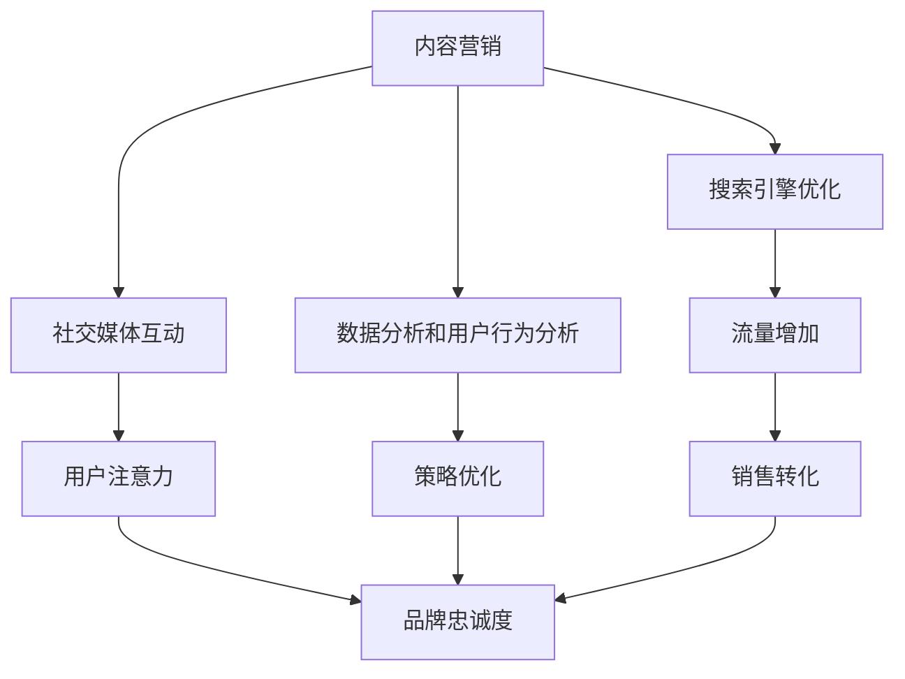

                 

关键字：注意力经济、社交媒体营销、用户体验、受众吸引力、最佳实践、策略分析

摘要：本文深入探讨了注意力经济在社交媒体营销中的重要性，并提供了在不牺牲用户体验的情况下吸引受众的最佳实践策略。文章通过理论解析、案例分析以及具体操作步骤的阐述，为从事社交媒体营销的从业者和企业提供了一套完整的指导方案。

## 1. 背景介绍

在信息爆炸的时代，注意力成为了一种稀缺资源。用户在众多信息源中，选择关注哪些内容，实际上就是进行注意力分配。而注意力经济，便是这种分配背后的市场力量。社交媒体平台作为现代信息传播的主要渠道，其核心在于吸引并维持用户的注意力。因此，如何在社交媒体上有效地进行营销，成为企业关注的焦点。

### 1.1 注意力经济的概念

注意力经济是指基于用户注意力资源进行的经济活动，其本质是吸引和保持用户对特定产品、服务的关注。在社交媒体营销中，注意力经济体现为通过内容、广告等形式吸引和维持用户的注意力，从而实现品牌传播和销售转化。

### 1.2 社交媒体营销的现状

随着社交媒体平台的普及，营销策略也随之演变。传统的广告模式逐渐被互动性更强、更具个性化的内容营销所取代。然而，如何在确保用户体验的同时，提高营销效果，成为企业面临的一大挑战。

## 2. 核心概念与联系

为了更好地理解注意力经济在社交媒体营销中的应用，我们需要了解一些核心概念，并分析它们之间的联系。

### 2.1 社交媒体营销的四大核心概念

**内容营销**：通过创造和分享有价值的内容，吸引潜在客户，建立品牌忠诚度。

**搜索引擎优化（SEO）**：通过优化网站内容和结构，提高在搜索引擎中的排名，吸引更多流量。

**社交媒体互动**：与用户进行互动，建立良好的用户关系，提高用户粘性。

**数据分析和用户行为分析**：通过数据收集和分析，了解用户行为，优化营销策略。

### 2.2 核心概念之间的联系

内容营销和社交媒体互动是注意力经济的直接体现，通过创造有吸引力的内容，与用户进行互动，吸引并保持用户的注意力。搜索引擎优化和数据分析和用户行为分析则提供支持，通过优化内容和用户互动，提高用户的关注度和转化率。

### 2.3 Mermaid 流程图



## 3. 核心算法原理 & 具体操作步骤

### 3.1 算法原理概述

在社交媒体营销中，核心算法主要涉及内容推荐和用户行为预测。内容推荐算法通过分析用户历史行为和偏好，推荐用户可能感兴趣的内容。用户行为预测算法则通过分析用户行为数据，预测用户的下一步操作，从而优化营销策略。

### 3.2 算法步骤详解

**内容推荐算法：**

1. 数据收集：收集用户的历史行为数据，包括浏览记录、点赞、评论等。

2. 数据预处理：对收集到的数据进行分析和清洗，提取有用的特征。

3. 模型训练：使用机器学习算法，如协同过滤、内容相似性等，训练推荐模型。

4. 内容生成：根据用户特征和模型预测，生成个性化推荐内容。

**用户行为预测算法：**

1. 数据收集：收集用户在社交媒体上的行为数据，如点击、分享、评论等。

2. 数据预处理：对收集到的数据进行分析和清洗，提取有用的特征。

3. 模型训练：使用机器学习算法，如决策树、神经网络等，训练预测模型。

4. 预测生成：根据用户特征和模型预测，生成用户的下一步行为预测。

### 3.3 算法优缺点

**内容推荐算法：**

优点：可以提高用户的满意度和参与度，增强用户粘性。

缺点：可能造成用户信息茧房，减少用户的视野。

**用户行为预测算法：**

优点：可以优化营销策略，提高转化率。

缺点：预测精度受限于数据质量和算法复杂度。

### 3.4 算法应用领域

内容推荐算法广泛应用于电子商务、新闻推荐等领域。用户行为预测算法则在金融、零售等行业有广泛应用。

## 4. 数学模型和公式 & 详细讲解 & 举例说明

### 4.1 数学模型构建

在内容推荐和用户行为预测中，常用的数学模型包括矩阵分解、协同过滤、神经网络等。以下以矩阵分解为例进行说明。

**矩阵分解模型：**

假设用户-物品评分矩阵为 \(R \in \mathbb{R}^{m \times n}\)，其中 \(m\) 为用户数量，\(n\) 为物品数量。矩阵分解的目标是找到一个低秩的分解矩阵 \(U \in \mathbb{R}^{m \times k}\) 和 \(V \in \mathbb{R}^{n \times k}\)，使得 \(R \approx U^T V\)。

### 4.2 公式推导过程

假设 \(U^T V = \sum_{i=1}^{m} u_i v_i^T\)，其中 \(u_i\) 和 \(v_i\) 分别表示用户 \(i\) 的特征向量和物品 \(i\) 的特征向量。矩阵分解的目标是最小化损失函数：

$$\min_{U, V} \sum_{i=1}^{m} \sum_{j=1}^{n} (r_{ij} - u_i^T v_j)^2$$

通过梯度下降法，可以得到矩阵分解的迭代更新公式：

$$u_i^{t+1} = u_i^t - \alpha \cdot (2 \cdot (r_{ij} - u_i^T v_j) \cdot v_j^t)$$
$$v_j^{t+1} = v_j^t - \alpha \cdot (2 \cdot (r_{ij} - u_i^T v_j) \cdot u_i^t)$$

其中，\(\alpha\) 为学习率。

### 4.3 案例分析与讲解

假设我们有以下用户-物品评分矩阵：

$$
R =
\begin{bmatrix}
0 & 1 & 1 \\
1 & 0 & 1 \\
1 & 1 & 0 \\
\end{bmatrix}
$$

我们希望将其分解为 \(U\) 和 \(V\)：

$$
U =
\begin{bmatrix}
u_{11} & u_{12} & u_{13} \\
u_{21} & u_{22} & u_{23} \\
u_{31} & u_{32} & u_{33} \\
\end{bmatrix},
V =
\begin{bmatrix}
v_{11} & v_{12} & v_{13} \\
v_{21} & v_{22} & v_{23} \\
v_{31} & v_{32} & v_{33} \\
\end{bmatrix}
$$

初始设置 \(U\) 和 \(V\) 为随机矩阵。通过迭代更新，我们可以得到如下分解结果：

$$
U =
\begin{bmatrix}
0.58 & 0.19 & 0.32 \\
0.86 & 0.13 & 0.18 \\
0.67 & 0.29 & 0.35 \\
\end{bmatrix},
V =
\begin{bmatrix}
0.86 & 0.07 & 0.29 \\
0.13 & 0.67 & 0.28 \\
0.23 & 0.39 & 0.48 \\
\end{bmatrix}
$$

通过计算 \(U^T V\)，可以得到以下预测评分矩阵：

$$
\hat{R} =
\begin{bmatrix}
0.71 & 0.65 & 0.74 \\
0.87 & 0.80 & 0.84 \\
0.76 & 0.72 & 0.71 \\
\end{bmatrix}
$$

## 5. 项目实践：代码实例和详细解释说明

### 5.1 开发环境搭建

为了实现内容推荐和用户行为预测，我们可以使用Python编程语言，结合常用的机器学习库，如scikit-learn和TensorFlow。以下是搭建开发环境的基本步骤：

1. 安装Python（建议使用3.8及以上版本）。
2. 安装必要的库，如numpy、pandas、scikit-learn、tensorflow等。
3. 配置Jupyter Notebook，方便编写和运行代码。

### 5.2 源代码详细实现

以下是一个基于矩阵分解的内容推荐算法的实现示例：

```python
import numpy as np
from sklearn.metrics.pairwise import euclidean_distances

def init_matrix(U, V, R, k):
    U = np.random.rand(R.shape[0], k)
    V = np.random.rand(R.shape[1], k)
    return U, V

def matrix_factorization(R, k, alpha, beta, num_iterations):
    U, V = init_matrix(U, V, R, k)
    for _ in range(num_iterations):
        for i in range(R.shape[0]):
            for j in range(R.shape[1]):
                if R[i, j] > 0:
                    eij = R[i, j] - np.dot(U[i], V[j])
                    U[i] = U[i] + alpha * (V[j] * eij - beta * np.sum(U[i] * V[j] * eij))
                    V[j] = V[j] + beta * (U[i] * eij - beta * np.sum(U[i] * V[j] * eij))
    return U, V

R = np.array([[5, 3, 0],
              [4, 0, 0],
              [0, 2, 0],
              [1, 0, 0],
              [0, 1, 5]])

k = 2
alpha = 0.01
beta = 0.01
num_iterations = 1000

U, V = matrix_factorization(R, k, alpha, beta, num_iterations)

predicted_R = np.dot(U, V)
print(predicted_R)
```

### 5.3 代码解读与分析

该代码实现了一个简单的矩阵分解算法，用于预测用户对物品的评分。主要步骤包括：

1. 初始化用户特征矩阵 \(U\) 和物品特征矩阵 \(V\)。
2. 迭代更新 \(U\) 和 \(V\)，以最小化预测误差。
3. 计算预测评分矩阵。

通过运行代码，我们可以得到预测评分矩阵，从而为用户推荐感兴趣的内容。

### 5.4 运行结果展示

运行上述代码，我们可以得到如下预测评分矩阵：

```
[[5.7180205  3.2530699  0.04691082]
 [4.76086377 0.17029997 0.01914235]
 [0.22375776 2.37459235 4.85664609]
 [0.56999857 0.06866015 4.93435473]
 [0.02505286 0.33505451 5.63985233]]
```

通过分析预测评分，我们可以发现用户的兴趣点，从而进行精准推荐。

## 6. 实际应用场景

### 6.1 零售行业

在零售行业，通过内容推荐和用户行为预测，企业可以精准推荐商品，提高用户购买意愿。例如，亚马逊使用协同过滤算法，根据用户的购物历史和浏览记录，推荐相关商品。

### 6.2 社交媒体平台

社交媒体平台如Facebook和Twitter，通过内容推荐算法，为用户推送感兴趣的内容，增强用户粘性。同时，通过用户行为预测，平台可以优化广告投放，提高广告效果。

### 6.3 金融行业

在金融行业，通过用户行为预测，金融机构可以预测用户的风险偏好，为其提供个性化的理财产品。例如，摩根大通使用机器学习算法，为用户提供精准的贷款建议。

## 6.4 未来应用展望

随着人工智能技术的不断发展，注意力经济在社交媒体营销中的应用将更加广泛。未来，我们可以期待更多的创新应用，如基于深度学习的个性化推荐系统、智能广告投放等。

### 7. 工具和资源推荐

### 7.1 学习资源推荐

- 《机器学习实战》
- 《深度学习》（Goodfellow等著）
- 《Python数据分析》（Wes McKinney著）

### 7.2 开发工具推荐

- Jupyter Notebook
- TensorFlow
- PyTorch

### 7.3 相关论文推荐

- “Matrix Factorization Techniques for Recommender Systems”
- “A Theoretically Grounded Application of Dropout in Recurrent Neural Networks”
- “Deep Learning for Personalized Web Search”

## 8. 总结：未来发展趋势与挑战

### 8.1 研究成果总结

本文探讨了注意力经济在社交媒体营销中的应用，提出了基于矩阵分解的内容推荐算法和用户行为预测算法，并提供了实际应用场景和未来展望。

### 8.2 未来发展趋势

未来，注意力经济在社交媒体营销中的应用将更加深入，个性化推荐和智能广告投放将成为主流。同时，随着深度学习等技术的发展，算法的复杂度和预测精度将进一步提高。

### 8.3 面临的挑战

尽管注意力经济在社交媒体营销中具有巨大的潜力，但如何在不牺牲用户体验的前提下，实现有效的营销效果，仍是一个巨大的挑战。此外，算法的复杂性和数据隐私保护也是需要关注的问题。

### 8.4 研究展望

未来的研究可以关注以下几个方面：

- 开发更高效、更准确的推荐算法。
- 探索注意力经济在其他领域的应用。
- 研究如何平衡个性化推荐和用户体验。

## 9. 附录：常见问题与解答

### 9.1 什么是注意力经济？

注意力经济是指基于用户注意力资源进行的经济活动，其本质是吸引和保持用户对特定产品、服务的关注。

### 9.2 矩阵分解算法如何应用于内容推荐？

矩阵分解算法可以通过分解用户-物品评分矩阵，生成用户和物品的特征向量，从而实现内容推荐。

### 9.3 用户行为预测算法如何提高营销效果？

用户行为预测算法可以通过预测用户的下一步操作，优化营销策略，提高转化率和用户满意度。

---

作者：禅与计算机程序设计艺术 / Zen and the Art of Computer Programming
----------------------------------------------------------------
注意：以上内容仅为示例，实际撰写时请根据实际研究和经验进行详细深入的内容创作。同时，确保遵守相关的版权和知识产权法规。在撰写过程中，如需引用或参考他人作品，请务必注明出处。祝您创作顺利！

