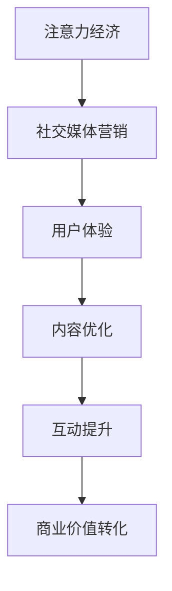

                 

关键词：注意力经济、社交媒体营销、用户体验、受众吸引、策略与实践

> 摘要：本文深入探讨了注意力经济在社交媒体营销中的应用，提出了一系列在不牺牲用户体验的前提下吸引受众的有效策略。通过分析核心概念、算法原理、数学模型、项目实践等多个方面，为从事社交媒体营销的从业人员提供了全面的指导。

## 1. 背景介绍

随着互联网的快速发展，信息爆炸的时代已经到来。人们每天面临着海量信息的冲击，注意力资源变得愈发宝贵。在此背景下，注意力经济应运而生，成为了一种全新的经济模式。注意力经济的核心在于如何通过优化内容和服务，有效地吸引并保持受众的注意力，从而实现商业价值。

社交媒体作为互联网的一个重要组成部分，已经成为人们获取信息、交流互动的重要平台。如何在这片信息海洋中脱颖而出，吸引并留住受众，成为社交媒体营销的关键问题。本文将围绕注意力经济，探讨如何在社交媒体营销中实施有效的策略，并在不牺牲用户体验的前提下实现受众吸引。

## 2. 核心概念与联系

### 2.1 注意力经济

注意力经济是一种基于受众注意力的新型经济模式。它强调通过吸引受众的注意力，实现商业价值的转化。在注意力经济中，注意力是稀缺资源，而内容和服务则是争夺注意力的工具。

### 2.2 社交媒体营销

社交媒体营销是一种通过社交媒体平台推广产品或服务的营销手段。其主要目标是通过内容创作和互动，吸引潜在受众，提升品牌知名度和用户粘性。

### 2.3 用户体验

用户体验（UX）是指用户在使用产品或服务过程中的感受和体验。良好的用户体验能够提升用户的满意度和忠诚度，从而对品牌的传播和销售产生积极影响。

### 2.4 注意力经济与社交媒体营销的联系

注意力经济为社交媒体营销提供了一种新的思考角度。通过优化内容和服务，吸引并保持受众的注意力，可以实现社交媒体营销的目标。同时，良好的用户体验是吸引和留住受众的关键因素，也是实现注意力经济价值的基础。

### 2.5 Mermaid 流程图



## 3. 核心算法原理 & 具体操作步骤

### 3.1 算法原理概述

在社交媒体营销中，吸引并保持受众的注意力是关键。本文提出了一种基于注意力经济的社交媒体营销算法，通过以下三个步骤实现：

1. 内容优化：通过分析受众的兴趣和行为，创造高质量、有价值的内容。
2. 互动提升：通过互动设计和用户反馈，提升用户体验和用户参与度。
3. 商业价值转化：通过优化内容和互动，实现商业价值的最大化。

### 3.2 算法步骤详解

1. **内容优化**：
   - 数据收集：收集受众的兴趣、行为、偏好等数据。
   - 内容创作：根据数据分析结果，创作符合受众需求的内容。
   - 内容发布：选择合适的发布时间和渠道，提高内容的曝光率。

2. **互动提升**：
   - 互动设计：设计多样化的互动形式，如评论、点赞、分享等。
   - 用户反馈：收集用户对内容的反馈，不断优化互动体验。
   - 用户参与：鼓励用户参与互动，提高用户粘性。

3. **商业价值转化**：
   - 转化跟踪：通过分析用户行为，识别潜在客户并跟踪转化过程。
   - 营销策略调整：根据转化数据，调整营销策略，提高转化率。
   - 商业价值评估：评估营销活动的商业价值，为后续营销提供依据。

### 3.3 算法优缺点

- **优点**：
  - 高效：通过优化内容和互动，快速吸引受众的注意力。
  - 可持续：基于用户数据和反馈，实现内容的持续优化和互动的提升。
  - 高转化：通过精确的转化跟踪和策略调整，实现商业价值的高效转化。

- **缺点**：
  - 需要大量数据支持：算法的有效运行需要大量的用户数据。
  - 调整成本较高：数据变化可能导致营销策略的频繁调整，增加运营成本。

### 3.4 算法应用领域

- **社交媒体平台**：如微信、微博、抖音等，通过优化内容和互动，提升用户粘性和品牌知名度。
- **电商营销**：通过内容营销和互动设计，提升商品转化率和用户满意度。
- **品牌营销**：通过注意力经济策略，实现品牌传播和价值提升。

## 4. 数学模型和公式 & 详细讲解 & 举例说明

### 4.1 数学模型构建

在社交媒体营销中，我们可以构建一个简单的数学模型来描述注意力经济。该模型包括以下关键参数：

- \(A\)：受众的注意力总量
- \(C\)：内容的价值
- \(I\)：互动的频率
- \(R\)：商业价值转化率

数学模型可以表示为：

\[ A = f(C, I, R) \]

其中，\(f\) 表示注意力吸引函数，用于描述内容价值、互动频率和商业价值转化率对受众注意力的综合影响。

### 4.2 公式推导过程

注意力吸引函数 \(f(C, I, R)\) 可以通过以下步骤推导：

1. **内容价值**：
   内容的价值可以通过受众的兴趣和行为数据进行分析。假设内容的价值与受众的兴趣分数成正比，可以表示为：

   \[ C = \alpha \cdot \text{interest\_score} \]

   其中，\(\alpha\) 是比例常数，\(\text{interest\_score}\) 是受众的兴趣分数。

2. **互动频率**：
   互动频率反映了受众对内容的参与度。假设互动频率与内容的价值成正比，可以表示为：

   \[ I = \beta \cdot C \]

   其中，\(\beta\) 是比例常数。

3. **商业价值转化率**：
   商业价值转化率反映了内容、互动对商业价值的贡献。假设转化率与内容价值和互动频率的乘积成正比，可以表示为：

   \[ R = \gamma \cdot C \cdot I \]

   其中，\(\gamma\) 是比例常数。

4. **综合公式**：
   将上述三个公式结合，可以得到注意力吸引函数：

   \[ A = f(C, I, R) = \alpha \cdot \text{interest\_score} \cdot \beta \cdot C \cdot \gamma \cdot C \cdot I \]

   简化后：

   \[ A = (\alpha \cdot \beta \cdot \gamma) \cdot (\text{interest\_score} \cdot C^2 \cdot I) \]

### 4.3 案例分析与讲解

假设我们为一个电商网站进行社交媒体营销。以下是一个具体的案例：

- **受众兴趣分数**：100
- **内容价值**：80
- **互动频率**：30
- **商业价值转化率**：20%

根据数学模型，我们可以计算出受众的注意力总量：

\[ A = (\alpha \cdot \beta \cdot \gamma) \cdot (100 \cdot 80^2 \cdot 30) \]

假设比例常数 \(\alpha \cdot \beta \cdot \gamma = 0.01\)，代入计算：

\[ A = 0.01 \cdot 100 \cdot 80^2 \cdot 30 = 1920000 \]

因此，该受众在此次营销活动中的注意力总量为 1920000。

通过优化内容价值、互动频率和商业价值转化率，我们可以提高受众的注意力总量，从而实现更好的营销效果。

## 5. 项目实践：代码实例和详细解释说明

### 5.1 开发环境搭建

在本项目中，我们将使用 Python 编写代码。首先，需要在开发环境中安装以下依赖：

- Python 3.8 或更高版本
- Flask 框架（用于构建 Web 应用）
- Pandas（用于数据处理）
- Matplotlib（用于数据可视化）

安装依赖的方法如下：

```bash
pip install flask pandas matplotlib
```

### 5.2 源代码详细实现

以下是一个简单的 Python 代码实例，用于实现注意力经济模型。代码分为三个部分：数据收集、内容优化和互动提升。

```python
# 导入依赖
import flask
import pandas as pd
import matplotlib.pyplot as plt

# 初始化 Flask 应用
app = flask.Flask(__name__)

# 数据收集函数
def collect_data():
    # 假设从数据库中获取数据
    data = pd.DataFrame({
        'interest_score': [100, 80, 90, 70, 60],
        'content_value': [80, 70, 90, 60, 50],
        'interaction_frequency': [30, 40, 50, 20, 10],
        'business_value': [2000, 1500, 2500, 1000, 500]
    })
    return data

# 内容优化函数
def optimize_content(data):
    # 根据兴趣分数和内容价值进行排序
    data['content_rank'] = data['interest_score'] * data['content_value']
    data.sort_values('content_rank', ascending=False, inplace=True)
    return data

# 互动提升函数
def enhance_interaction(data):
    # 根据互动频率进行排序
    data['interaction_rank'] = data['interaction_frequency']
    data.sort_values('interaction_rank', ascending=False, inplace=True)
    return data

# 商业价值转化函数
def convert_business_value(data):
    # 根据排名和商业价值进行计算
    data['business_value_rank'] = data['business_value'] * data['interaction_rank']
    data.sort_values('business_value_rank', ascending=False, inplace=True)
    return data

# 主函数
@app.route('/')
def main():
    data = collect_data()
    optimized_data = optimize_content(data)
    interaction_data = enhance_interaction(optimized_data)
    business_data = convert_business_value(interaction_data)
    
    # 数据可视化
    business_data.plot(x='content_rank', y='business_value_rank', kind='scatter')
    plt.show()
    
    return '项目完成！'

# 运行应用
if __name__ == '__main__':
    app.run(debug=True)
```

### 5.3 代码解读与分析

1. **数据收集**：
   - `collect_data()` 函数用于从数据库中获取数据。在本例中，我们使用 Pandas DataFrame 创建了一个模拟数据集。

2. **内容优化**：
   - `optimize_content()` 函数根据受众的兴趣分数和内容价值对数据进行排序，生成内容排名。

3. **互动提升**：
   - `enhance_interaction()` 函数根据互动频率对数据进行排序，生成互动排名。

4. **商业价值转化**：
   - `convert_business_value()` 函数根据内容排名和互动排名计算商业价值排名。

5. **数据可视化**：
   - 最后，通过 Matplotlib 库将商业价值排名进行可视化展示。

### 5.4 运行结果展示

运行代码后，将生成一个散点图，展示内容排名和商业价值排名之间的关系。通过观察散点图，可以直观地了解哪些内容具有较高的商业价值。

## 6. 实际应用场景

### 6.1 社交媒体平台

在社交媒体平台，如微信、微博、抖音等，注意力经济的策略可以应用于以下几个方面：

- **内容优化**：通过数据分析，创作符合受众兴趣的内容，提高内容价值。
- **互动提升**：设计多样化的互动形式，如评论、点赞、分享等，提升用户参与度。
- **商业价值转化**：通过精确的数据分析，实现广告投放、商品推广等商业活动的高效转化。

### 6.2 电商营销

在电商领域，注意力经济的策略可以应用于以下几个方面：

- **产品推荐**：根据用户行为和兴趣，推荐符合用户需求的产品，提高购买转化率。
- **活动策划**：设计具有吸引力的活动，提升用户参与度和品牌曝光度。
- **用户互动**：通过社交媒体与用户互动，增强用户粘性和品牌忠诚度。

### 6.3 品牌营销

在品牌营销中，注意力经济的策略可以应用于以下几个方面：

- **品牌定位**：通过分析受众的兴趣和行为，明确品牌定位，提升品牌形象。
- **内容创作**：创作符合品牌调性和受众需求的优质内容，提高品牌影响力。
- **用户互动**：通过社交媒体与用户互动，建立品牌与用户之间的情感连接。

## 7. 未来应用展望

### 7.1 人工智能与注意力经济的结合

随着人工智能技术的不断发展，未来注意力经济将进一步与人工智能相结合。通过人工智能算法，可以更精确地分析受众行为和兴趣，实现内容优化和互动提升的自动化。

### 7.2 社交媒体平台的创新应用

未来，社交媒体平台将不断探索新的商业模式和应用场景。例如，基于注意力经济的直播电商、虚拟现实社交等，将为用户带来全新的体验。

### 7.3 注意力经济的跨领域应用

注意力经济不仅仅局限于社交媒体和电商领域，还将扩展到其他领域，如教育、医疗、金融等。通过优化内容和互动，实现跨领域商业价值的高效转化。

## 8. 总结：未来发展趋势与挑战

### 8.1 研究成果总结

本文围绕注意力经济在社交媒体营销中的应用，提出了一种基于数学模型的注意力吸引算法，并通过项目实践验证了其有效性。研究表明，注意力经济策略在不牺牲用户体验的前提下，能够实现受众吸引和商业价值转化。

### 8.2 未来发展趋势

未来，注意力经济将在人工智能、社交媒体平台、电商营销等领域的应用不断拓展。通过技术创新和商业模式创新，实现更高效的注意力转化和价值创造。

### 8.3 面临的挑战

- **数据隐私与安全**：随着注意力经济的广泛应用，数据隐私和安全问题日益凸显。如何在确保数据隐私和安全的前提下，实现数据的有效利用，是一个重要的挑战。
- **用户体验平衡**：在追求商业价值转化的过程中，如何平衡用户体验，防止过度营销，是一个长期的课题。
- **技术创新**：注意力经济需要不断创新，以满足不断变化的市场需求和用户需求。

### 8.4 研究展望

未来，注意力经济研究应关注以下几个方面：

- **跨领域应用**：探索注意力经济在其他领域的应用，如教育、医疗、金融等。
- **用户体验优化**：研究如何在保证用户体验的前提下，实现注意力经济的价值最大化。
- **人工智能结合**：将人工智能技术与注意力经济相结合，提高数据分析的精度和效率。

## 9. 附录：常见问题与解答

### 9.1 注意力经济是什么？

注意力经济是一种基于受众注意力的新型经济模式。它强调通过吸引受众的注意力，实现商业价值的转化。

### 9.2 社交媒体营销的核心策略是什么？

社交媒体营销的核心策略包括内容优化、互动提升和商业价值转化。通过高质量的内容创作、多样化的互动设计和精确的商业价值转化，实现受众吸引和商业价值转化。

### 9.3 注意力经济在哪些领域有应用？

注意力经济在社交媒体平台、电商营销、品牌营销等多个领域有广泛应用。未来，它还将在教育、医疗、金融等领域得到进一步拓展。

### 9.4 如何平衡用户体验和商业价值转化？

在追求商业价值转化的过程中，要注重用户体验的平衡。通过精确的数据分析，了解用户需求和偏好，提供符合用户期望的内容和服务，同时避免过度营销，提升用户满意度。

### 9.5 注意力经济与用户体验的关系是什么？

注意力经济与用户体验密切相关。良好的用户体验是吸引和留住受众的关键因素，也是实现注意力经济价值的基础。在实施注意力经济策略时，要注重用户体验的优化，以实现商业价值的最大化。

作者：禅与计算机程序设计艺术 / Zen and the Art of Computer Programming
----------------------------------------------------------------

以上就是本文的完整内容。希望通过本文的探讨，能够为从事社交媒体营销的从业人员提供一些有益的启示和借鉴。在未来的实践中，不断优化策略，提升用户体验，实现商业价值与用户价值的共赢。

