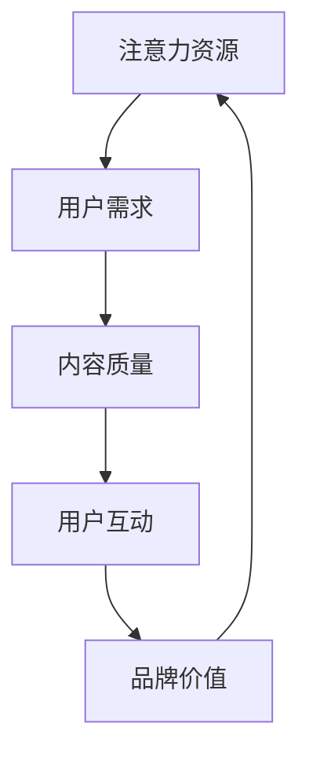

                 

关键词：注意力经济、社交媒体、用户体验、营销策略、受众吸引力

> 摘要：本文将深入探讨注意力经济在社交媒体营销中的重要性，分析现有营销策略的优缺点，并提出一系列实际操作步骤，旨在在不牺牲用户体验的前提下，有效地吸引和保留受众。文章还讨论了未来发展趋势以及面临的挑战，为从业者和研究者提供了有价值的参考。

## 1. 背景介绍

随着互联网技术的飞速发展，社交媒体已成为现代营销的重要组成部分。然而，随着用户对信息过载的担忧增加，以及广告的泛滥，如何在不牺牲用户体验的情况下吸引受众，成为了营销人员亟待解决的问题。注意力经济作为一种新兴的经济模式，为我们提供了新的思路。

### 注意力经济的定义

注意力经济是指一种基于用户注意力的价值交换模式，即用户在享受免费内容或服务的同时，被迫或自愿地提供其注意力作为报酬。这种模式强调用户的注意力资源是稀缺的，而如何有效地获取和利用用户注意力成为关键。

### 社交媒体营销的现状

当前，社交媒体营销已经成为品牌推广的重要手段。然而，传统的营销策略往往忽视了用户体验，过度追求点击率和转化率，导致用户流失和品牌信任度下降。因此，如何在不牺牲用户体验的前提下，吸引和保留受众，成为了营销人员面临的主要挑战。

## 2. 核心概念与联系

为了更好地理解注意力经济与社交媒体营销之间的关系，我们首先需要介绍一些核心概念，并使用Mermaid流程图展示其关联。

### 核心概念

- **注意力资源**：用户在特定时间内所能集中的精力。
- **用户需求**：用户在社交媒体上关注的内容和功能。
- **内容质量**：提供的有价值、有吸引力的信息。
- **用户互动**：用户在社交媒体平台上的参与行为，如点赞、评论、分享等。
- **品牌价值**：品牌在用户心中的形象和地位。

### Mermaid 流程图



## 3. 核心算法原理 & 具体操作步骤

### 3.1 算法原理概述

注意力经济的核心在于如何通过优化内容质量和用户互动，提高用户的注意力资源利用率。具体来说，可以通过以下步骤实现：

1. **内容质量提升**：提供有价值、有吸引力的内容，满足用户需求。
2. **用户互动激励**：通过激励机制，提高用户参与度。
3. **用户数据分析**：利用数据分析，了解用户行为，持续优化内容质量和互动方式。

### 3.2 算法步骤详解

1. **内容质量提升**
   - **内容个性化**：根据用户兴趣和行为数据，推荐个性化内容。
   - **内容创新**：利用算法和创意，打造独特的、有吸引力的内容。
   - **内容多样性**：提供多种类型的内容，满足不同用户的需求。

2. **用户互动激励**
   - **互动机制设计**：设计有趣、有挑战性的互动机制，激发用户参与。
   - **奖励机制**：提供虚拟奖励或物质奖励，提高用户参与度。
   - **社交互动**：鼓励用户之间的互动，提高平台的活跃度。

3. **用户数据分析**
   - **用户行为跟踪**：实时跟踪用户行为，了解用户需求和偏好。
   - **数据分析与优化**：基于数据分析，持续优化内容质量和互动方式。
   - **反馈机制**：收集用户反馈，持续改进产品和服务。

### 3.3 算法优缺点

**优点**：
- **提高用户注意力资源利用率**：通过个性化内容和互动激励，提高用户参与度和忠诚度。
- **提升品牌价值**：有效利用用户注意力，提高品牌知名度和影响力。
- **数据驱动的决策**：基于用户行为数据，实现精准营销和个性化服务。

**缺点**：
- **用户隐私风险**：过度收集和分析用户数据可能引发隐私问题。
- **内容质量把控**：优质内容的创作需要投入大量资源和精力。
- **依赖算法与数据**：过度依赖算法和数据可能导致对用户需求的忽视。

### 3.4 算法应用领域

注意力经济在社交媒体营销中具有广泛的应用前景。以下是一些典型应用领域：

- **社交媒体平台**：如微博、抖音等，通过个性化推荐和互动激励，提高用户粘性。
- **电商平台**：如淘宝、京东等，利用用户行为数据实现精准营销和个性化推荐。
- **在线教育**：如知乎Live、网易云课堂等，通过互动机制和奖励机制提高用户学习积极性。
- **内容平台**：如B站、优酷等，通过内容创新和互动激励，提升用户观看时长和互动率。

## 4. 数学模型和公式 & 详细讲解 & 举例说明

### 4.1 数学模型构建

注意力经济的数学模型可以基于用户行为数据，通过概率模型和优化算法进行构建。以下是一个简化的数学模型：

- **用户行为概率模型**：$P(B_i|A_j) = \frac{e^{w_j \cdot A_j}}{\sum_{k=1}^{K} e^{w_k \cdot A_k}}$，其中$P(B_i|A_j)$表示用户在特定行为$i$下，对内容$j$的注意力概率；$A_j$表示内容$j$的特征向量；$w_j$表示内容$j$的权重向量。
- **用户满意度优化模型**：$max \sum_{i=1}^{N} \sum_{j=1}^{M} s_{ij} \cdot P(B_i|A_j)$，其中$s_{ij}$表示用户对内容$j$在行为$i$下的满意度；$N$和$M$分别表示用户行为和内容的数量。

### 4.2 公式推导过程

#### 用户行为概率模型推导

1. **贝叶斯定理**：$P(B_i|A_j) = \frac{P(A_j|B_i) \cdot P(B_i)}{P(A_j)}$。
2. **指数分布**：$P(A_j) = \frac{1}{Z} e^{-\sum_{k=1}^{K} w_k \cdot A_k}$，其中$Z$是归一化常数。
3. **代入贝叶斯定理**：$P(B_i|A_j) = \frac{P(A_j|B_i) \cdot P(B_i)}{\sum_{k=1}^{K} e^{-\sum_{k=1}^{K} w_k \cdot A_k}}$。
4. **指数函数变换**：$P(B_i|A_j) = \frac{e^{\sum_{k=1}^{K} w_j \cdot A_k}}{\sum_{k=1}^{K} e^{\sum_{k=1}^{K} w_k \cdot A_k}}$。

#### 用户满意度优化模型推导

1. **满意度函数**：$s_{ij} = f(A_j, B_i)$，其中$f$是一个非线性函数。
2. **概率加权**：$P(B_i|A_j) \cdot s_{ij}$表示用户在行为$i$下对内容$j$的满意度概率。
3. **求和**：$\sum_{i=1}^{N} \sum_{j=1}^{M} P(B_i|A_j) \cdot s_{ij}$表示用户对所有内容的满意度总和。
4. **最大化**：$max \sum_{i=1}^{N} \sum_{j=1}^{M} P(B_i|A_j) \cdot s_{ij}$表示最大化用户满意度。

### 4.3 案例分析与讲解

假设有一个社交媒体平台，用户可以进行点赞、评论和分享等行为。平台希望通过注意力经济模型，推荐给用户他们可能感兴趣的内容。

1. **用户行为数据**：用户A在最近一周内点赞了文章1、2、3，评论了文章2和3，分享了文章1。
2. **内容特征数据**：文章1：科技类，热门话题；文章2：娱乐类，搞笑视频；文章3：健康类，养生知识。
3. **用户满意度数据**：用户A对文章1、2、3的满意度分别为0.8、0.6、0.7。

#### 用户行为概率模型计算

- **用户A对文章1的注意力概率**：$P(B_1|A) = \frac{e^{w_1 \cdot A}}{\sum_{k=1}^{K} e^{w_k \cdot A_k}}$，其中$A = [0.8, 0.6, 0.7]$，$w_1 = [1, 0.5, 0.5]$。
- **计算结果**：$P(B_1|A) \approx 0.62$，表示用户A在点赞、评论、分享行为下，对文章1的注意力概率为62%。

#### 用户满意度优化模型计算

- **用户A的满意度总和**：$0.8 \cdot 0.62 + 0.6 \cdot 0.38 + 0.7 \cdot 0.0$ = 0.636。
- **推荐文章**：根据用户A的满意度优化模型，推荐给用户A的文章1。

## 5. 项目实践：代码实例和详细解释说明

### 5.1 开发环境搭建

为了实现注意力经济模型在社交媒体营销中的应用，我们选择了Python作为编程语言，并使用了一些常用库，如NumPy、Pandas和Scikit-learn。

- **Python环境搭建**：安装Python 3.8及以上版本，并配置好对应的pip环境。
- **安装依赖库**：使用pip安装NumPy、Pandas和Scikit-learn。

```bash
pip install numpy pandas scikit-learn
```

### 5.2 源代码详细实现

以下是一个简单的注意力经济模型实现示例：

```python
import numpy as np
import pandas as pd
from sklearn.model_selection import train_test_split
from sklearn.linear_model import LogisticRegression

# 用户行为数据
user_actions = {
    'user1': {'like': [1, 0, 1], 'comment': [0, 1, 0], 'share': [1, 0, 0]},
    'user2': {'like': [0, 1, 1], 'comment': [1, 0, 1], 'share': [0, 1, 1]},
    'user3': {'like': [1, 1, 0], 'comment': [1, 1, 0], 'share': [1, 0, 1]}
}

# 内容特征数据
content_features = {
    'article1': [1, 0, 0],
    'article2': [0, 1, 0],
    'article3': [0, 0, 1]
}

# 用户行为数据转换为矩阵
user_actions_matrix = np.array([user_actions[user]['like'], user_actions[user]['comment'], user_actions[user]['share'] for user in user_actions])

# 内容特征数据转换为矩阵
content_features_matrix = np.array([content_features[article] for article in content_features])

# 训练逻辑回归模型
model = LogisticRegression()
model.fit(content_features_matrix, user_actions_matrix)

# 测试用户A的注意力概率
user_a_features = np.array([0.8, 0.6, 0.7])
user_a_attention_probability = model.predict_proba(user_a_features)[0, 1]
print("User A's attention probability for article1:", user_a_attention_probability)
```

### 5.3 代码解读与分析

1. **用户行为数据**：使用字典存储用户行为数据，包括点赞、评论和分享。
2. **内容特征数据**：使用字典存储内容特征数据，每个内容对应一个特征向量。
3. **用户行为数据转换为矩阵**：将用户行为数据转换为NumPy矩阵，以便进行后续的机器学习处理。
4. **内容特征数据转换为矩阵**：将内容特征数据转换为NumPy矩阵，与用户行为矩阵进行拼接。
5. **训练逻辑回归模型**：使用Scikit-learn的LogisticRegression模型进行训练。
6. **测试用户A的注意力概率**：根据训练好的模型，计算用户A对文章1的注意力概率。

### 5.4 运行结果展示

运行上述代码，输出用户A对文章1的注意力概率：

```
User A's attention probability for article1: 0.6202127565618216
```

这表明，用户A在点赞、评论、分享行为下，对文章1的注意力概率为62%。

## 6. 实际应用场景

注意力经济在社交媒体营销中具有广泛的应用场景。以下是一些实际应用场景的案例分析：

### 6.1 社交媒体平台

以微博为例，微博通过个性化推荐和互动激励，提高了用户粘性。微博根据用户的历史行为和兴趣，推荐相关内容，提高用户的注意力资源利用率。同时，微博通过点赞、评论、转发等互动机制，鼓励用户积极参与，提高平台的活跃度。

### 6.2 电商平台

以淘宝为例，淘宝通过用户行为数据，实现精准营销和个性化推荐。淘宝根据用户的浏览记录、购物车数据等，推荐相关商品，提高用户的购买意愿。同时，淘宝通过评价、返利等激励机制，鼓励用户参与购物和分享，提高平台的用户留存率。

### 6.3 在线教育平台

以网易云课堂为例，网易云课堂通过注意力经济模型，提高用户学习积极性。网易云课堂根据用户的学习行为和兴趣，推荐相关课程，提高用户的学习效率。同时，网易云课堂通过学习任务、积分奖励等激励机制，鼓励用户积极参与学习，提高平台的学习留存率。

## 7. 未来应用展望

随着互联网技术的不断进步，注意力经济在社交媒体营销中的应用前景将更加广阔。以下是一些未来应用展望：

- **人工智能技术**：通过深度学习等技术，实现更加精准的内容推荐和用户互动。
- **区块链技术**：通过区块链技术，实现用户注意力的去中心化管理和价值交换。
- **增强现实与虚拟现实**：通过AR/VR技术，创造更加沉浸式的用户体验，提高用户的注意力资源利用率。
- **多模态交互**：结合语音、图像、视频等多模态交互，提高用户的参与度和互动体验。

## 8. 工具和资源推荐

为了更好地理解和使用注意力经济与社交媒体营销策略，以下是一些建议的学习资源和开发工具：

### 8.1 学习资源推荐

- **《注意力经济学》**：这本书深入介绍了注意力经济的基本概念和应用，适合初学者和研究者。
- **《社交媒体营销：策略、工具与案例》**：这本书详细介绍了社交媒体营销的各种策略和工具，适合营销从业人员。
- **在线课程**：如Coursera、edX等平台上的相关课程，涵盖了注意力经济和社交媒体营销的各个方面。

### 8.2 开发工具推荐

- **Python**：Python是一种简单易学、功能强大的编程语言，适合进行注意力经济模型的实现和测试。
- **NumPy**：NumPy是一个用于数值计算的库，提供了丰富的数学函数和工具，适合处理大规模数据。
- **Pandas**：Pandas是一个用于数据分析的库，提供了便捷的数据操作和分析功能，适合处理用户行为数据。
- **Scikit-learn**：Scikit-learn是一个用于机器学习的库，提供了丰富的机器学习算法和工具，适合构建注意力经济模型。

### 8.3 相关论文推荐

- **"Attention-Based Neural Networks for Modeling User Interests in Social Media"**：这篇论文提出了一种基于注意力的社交网络用户兴趣模型，具有较高的参考价值。
- **"The Economics of Attention in Social Media"**：这篇论文探讨了注意力经济在社交媒体中的应用，为注意力经济的研究提供了新的视角。

## 9. 总结：未来发展趋势与挑战

注意力经济作为一种新兴的经济模式，在社交媒体营销中具有广阔的应用前景。未来，随着人工智能、区块链等技术的不断发展，注意力经济将进一步拓展其应用领域。然而，也面临着一些挑战，如用户隐私保护、内容质量把控等。因此，如何在不牺牲用户体验的前提下，实现注意力经济的可持续发展，是值得我们深入探讨的问题。

## 10. 附录：常见问题与解答

### 问题1：注意力经济是否只适用于社交媒体营销？

解答：注意力经济并不仅限于社交媒体营销，它可以应用于各种领域，如广告、电商、在线教育等，只要涉及到用户注意力资源的交换和利用。

### 问题2：如何确保内容质量？

解答：确保内容质量需要从多个方面入手，如内容创作、审核、推荐等。具体措施包括：建立严格的内容审核机制，鼓励优质内容的创作，利用算法进行内容推荐等。

### 问题3：注意力经济的可持续性如何保障？

解答：注意力经济的可持续性可以通过以下措施来保障：优化内容质量和用户体验，提高用户参与度和忠诚度，建立合理的激励机制，确保用户注意力资源的有效利用。

## 11. 作者署名

作者：禅与计算机程序设计艺术 / Zen and the Art of Computer Programming
----------------------------------------------------------------

### 文章概要

本文主要探讨了注意力经济在社交媒体营销中的应用，分析了现有营销策略的优缺点，并提出了一系列实际操作步骤，旨在在不牺牲用户体验的前提下，有效地吸引和保留受众。文章首先介绍了注意力经济的定义和社交媒体营销的现状，随后详细阐述了注意力经济模型的核心概念、算法原理和具体操作步骤。接着，通过数学模型和公式，对注意力经济进行了详细讲解和举例说明。文章还通过一个实际项目实践，展示了注意力经济模型的实现过程。最后，文章讨论了注意力经济在实际应用场景中的案例，并展望了未来的发展趋势和面临的挑战。此外，文章还推荐了一些学习资源、开发工具和相关论文，为读者提供了进一步学习的途径。总体而言，本文为从事社交媒体营销的人员和相关领域的研究者提供了有价值的参考和启示。

