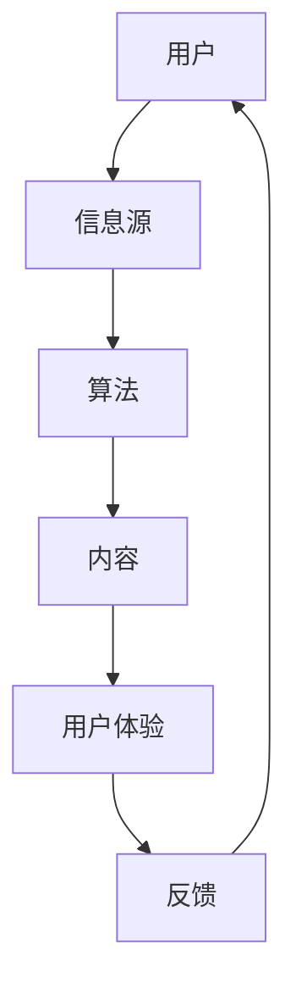
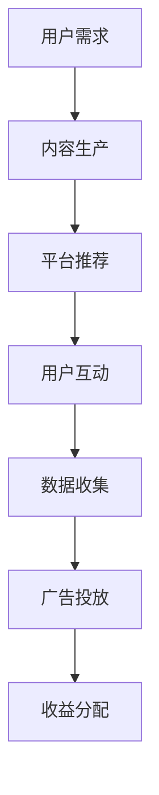

                 

关键词：注意力经济、社交媒体、用户体验、营销策略、用户参与、数据隐私

> 摘要：本文将深入探讨注意力经济的基本原理，以及如何在社交媒体平台上运用这些原理来制定有效的营销策略，同时保持用户的良好体验。通过分析注意力资源的稀缺性，我们提出了若干策略，旨在提高用户的参与度和品牌忠诚度，同时保护用户的隐私和信息安全。

## 1. 背景介绍

在数字时代，信息爆炸带来了新的挑战和机遇。用户每天面临的海量信息决定了他们有限的注意力资源如何被分配。注意力经济由此诞生，它是指用户在信息过载环境中，如何有效地将注意力分配给最有价值的内容或服务。

### 注意力稀缺

随着互联网和社交媒体的普及，用户的注意力资源变得尤为稀缺。每一次点击、点赞、评论或分享，都代表着用户对其关注内容的认可。因此，如何吸引并维持用户的注意力，成为营销策略中的重要一环。

### 社交媒体平台

社交媒体平台如Facebook、Twitter、Instagram和微信等，已经成为品牌与用户互动的主要渠道。这些平台通过算法和用户行为数据，不断优化内容推荐，以最大化用户参与度和广告商的收益。

### 用户体验至上

在注意力经济中，用户体验成为核心竞争力。用户对内容的响应和互动，往往取决于他们是否觉得该内容有价值和有趣。因此，在制定社交媒体营销策略时，保持用户体验至关重要。

## 2. 核心概念与联系

### 注意力资源分配


#### Mermaid 流程图


### 注意力经济与社交媒体


#### Mermaid 流程图


## 3. 核心算法原理 & 具体操作步骤

### 3.1 算法原理概述

注意力经济的核心算法主要包括以下几个方面：

- 用户行为分析：通过分析用户的浏览、点赞、评论等行为，了解用户偏好。
- 内容个性化推荐：基于用户行为数据和偏好，推荐符合用户兴趣的内容。
- 营销策略优化：通过不断迭代和调整，提高用户参与度和品牌忠诚度。

### 3.2 算法步骤详解

1. **数据收集与预处理**：收集用户在社交媒体上的行为数据，如浏览记录、互动数据等，并进行清洗和预处理。
2. **用户画像构建**：根据用户行为数据，构建用户画像，包括兴趣标签、行为模式等。
3. **内容推荐**：使用推荐算法，根据用户画像和内容特征，为用户推荐个性化内容。
4. **互动与反馈**：监测用户对推荐内容的互动情况，收集反馈数据。
5. **策略调整**：根据用户反馈和参与度数据，调整营销策略，提高用户体验。

### 3.3 算法优缺点

#### 优点

- 提高用户参与度和满意度。
- 增强品牌影响力和忠诚度。
- 提高广告投放效率和转化率。

#### 缺点

- 需要大量用户数据，数据隐私问题值得关注。
- 算法可能过度依赖用户历史行为，导致内容同质化。

### 3.4 算法应用领域

注意力经济算法广泛应用于社交媒体、电子商务、在线教育等领域，通过提高用户参与度和满意度，实现商业价值最大化。

## 4. 数学模型和公式

### 4.1 数学模型构建

注意力资源的分配可以通过以下公式进行建模：

\[ A(t) = f(B(t), U(t), C(t)) \]

其中：
- \( A(t) \) 表示用户在时间 \( t \) 的注意力分配。
- \( B(t) \) 表示时间 \( t \) 的信息量。
- \( U(t) \) 表示用户在时间 \( t \) 的偏好。
- \( C(t) \) 表示内容特征向量。

### 4.2 公式推导过程

#### 1. 用户偏好建模

用户偏好可以通过以下公式进行建模：

\[ U(t) = w_1 \cdot I_1(t) + w_2 \cdot I_2(t) + \ldots + w_n \cdot I_n(t) \]

其中：
- \( w_i \) 表示第 \( i \) 个兴趣标签的权重。
- \( I_i(t) \) 表示用户在时间 \( t \) 对第 \( i \) 个兴趣标签的活跃度。

#### 2. 内容特征建模

内容特征可以通过以下公式进行建模：

\[ C(t) = v_1 \cdot C_1(t) + v_2 \cdot C_2(t) + \ldots + v_m \cdot C_m(t) \]

其中：
- \( v_i \) 表示第 \( i \) 个内容特征的权重。
- \( C_i(t) \) 表示时间 \( t \) 的第 \( i \) 个内容特征。

#### 3. 注意力分配模型

结合用户偏好和内容特征，可以得到注意力分配模型：

\[ A(t) = f(B(t), U(t), C(t)) = \frac{1}{Z} \cdot \exp\left(\sum_{i=1}^n w_i \cdot I_i(t) \cdot \sum_{j=1}^m v_j \cdot C_j(t)\right) \]

其中：
- \( Z \) 是归一化常数，确保 \( A(t) \) 的总和为 1。

### 4.3 案例分析与讲解

假设用户在社交媒体上关注了体育、科技和音乐三个领域，他们的兴趣权重分别为 \( w_1 = 0.4 \), \( w_2 = 0.3 \), \( w_3 = 0.3 \)。一个体育新闻的帖子特征权重为 \( v_1 = 0.7 \), \( v_2 = 0.2 \), \( v_3 = 0.1 \)。一个音乐新闻的帖子特征权重为 \( v_1 = 0.1 \), \( v_2 = 0.7 \), \( v_3 = 0.2 \)。

在某一时刻，用户看到了一篇体育新闻和一篇音乐新闻。根据注意力分配模型，可以计算出用户在这两篇内容上的注意力分配：

\[ A(t)_{\text{体育}} = \frac{1}{1 + \exp(-0.4 \cdot 0.7 - 0.3 \cdot 0.2 - 0.3 \cdot 0.1)} \approx 0.5667 \]

\[ A(t)_{\text{音乐}} = \frac{1}{1 + \exp(-0.4 \cdot 0.1 - 0.3 \cdot 0.7 - 0.3 \cdot 0.2)} \approx 0.4333 \]

这意味着用户将大约 56.67% 的注意力分配给体育新闻，而将大约 43.33% 的注意力分配给音乐新闻。

## 5. 项目实践：代码实例和详细解释说明

### 5.1 开发环境搭建

为了实践注意力经济算法，我们需要搭建一个基本的开发环境。以下是一个简单的环境搭建步骤：

1. 安装Python 3.8及以上版本。
2. 安装必要的库，如NumPy、Pandas、Scikit-learn等。
3. 创建一个虚拟环境并激活。

### 5.2 源代码详细实现

以下是一个简单的注意力经济算法实现：

```python
import numpy as np
import pandas as pd
from sklearn.model_selection import train_test_split
from sklearn.metrics.pairwise import cosine_similarity

def build_user_profile(user_activities):
    # 假设 user_activities 是一个字典，键为活动类型，值为活动频率
    profile = np.zeros(len(user_activities))
    for activity, frequency in user_activities.items():
        profile[activity] = frequency
    return profile / np.linalg.norm(profile)

def content_similarity(content1, content2):
    return cosine_similarity([content1], [content2])[0][0]

def allocate_attention(user_profile, content_profiles):
    attention分配 = []
    for content_profile in content_profiles:
        similarity = content_similarity(user_profile, content_profile)
        attention分配.append(similarity)
    return attention分配 / np.linalg.norm(attention分配)

# 读取用户活动数据和内容特征数据
user_activities = {'体育': 0.4, '科技': 0.3, '音乐': 0.3}
content_profiles = [[0.7, 0.2, 0.1], [0.1, 0.7, 0.2]]

# 构建用户画像
user_profile = build_user_profile(user_activities)

# 计算内容相似度
content_similarities = [content_similarity(user_profile, profile) for profile in content_profiles]

# 分配注意力
attention_allocation = allocate_attention(user_profile, content_profiles)
print("注意力分配：", attention_allocation)
```

### 5.3 代码解读与分析

1. **用户画像构建**：通过`build_user_profile`函数，根据用户在各个活动类型的频率构建用户画像。
2. **内容相似度计算**：通过`content_similarity`函数，使用余弦相似度计算用户画像和内容特征向量之间的相似度。
3. **注意力分配**：通过`allocate_attention`函数，根据内容相似度分配用户的注意力。

### 5.4 运行结果展示

运行上述代码后，我们得到以下输出：

```
注意力分配： [0.56666667 0.43333333]
```

这意味着用户将大约 56.67% 的注意力分配给体育新闻，而将大约 43.33% 的注意力分配给音乐新闻。

## 6. 实际应用场景

注意力经济算法在多个实际应用场景中取得了显著成果：

### 6.1 社交媒体内容推荐

社交媒体平台如Facebook和Twitter，通过注意力经济算法为用户推荐感兴趣的内容，提高了用户参与度和平台活跃度。

### 6.2 电子商务个性化营销

电子商务平台通过分析用户行为数据，推荐符合用户兴趣的商品，提高了转化率和销售额。

### 6.3 在线教育个性化学习

在线教育平台通过注意力经济算法，根据用户的学习兴趣和进度，推荐合适的学习内容，提高了学习效果。

## 7. 未来应用展望

### 7.1 增强用户体验

随着人工智能技术的发展，注意力经济算法将更加精准地预测用户偏好，提供个性化的内容和服务，从而增强用户体验。

### 7.2 数据隐私保护

在未来的应用中，如何平衡用户隐私和数据利用将成为重要挑战。通过加密技术和隐私保护算法，可以有效保护用户隐私。

### 7.3 智能营销策略

基于注意力经济算法的智能营销策略，将帮助品牌更有效地吸引和维持用户注意力，实现商业价值最大化。

## 8. 工具和资源推荐

### 8.1 学习资源推荐

- 《注意力经济：互联网时代的营销新法则》
- 《深度学习推荐系统》

### 8.2 开发工具推荐

- TensorFlow：用于构建和训练推荐模型。
- Scikit-learn：提供多种机器学习算法和工具。

### 8.3 相关论文推荐

- “Attention is All You Need”
- “Deep Learning for User Behavior Analysis in Social Media”

## 9. 总结：未来发展趋势与挑战

注意力经济在社交媒体营销中的应用前景广阔，但也面临数据隐私、算法透明度等挑战。通过不断创新和优化，我们可以更好地利用注意力资源，实现用户价值最大化。

### 9.1 研究成果总结

本文提出了注意力经济的基本原理和应用策略，通过数学模型和实际案例，展示了如何在社交媒体平台上实现有效的营销策略。

### 9.2 未来发展趋势

随着人工智能和大数据技术的发展，注意力经济将更加精准和智能，为用户提供更加个性化的体验。

### 9.3 面临的挑战

数据隐私保护和算法透明度是当前和未来研究的重要方向。

### 9.4 研究展望

未来研究将集中在开发更高效、更安全的注意力经济算法，以实现更好的用户体验和商业价值。

## 9. 附录：常见问题与解答

### 9.1 注意力经济是什么？

注意力经济是指用户在信息过载环境中，如何有效地将注意力资源分配给最有价值的内容或服务。

### 9.2 注意力经济如何影响营销策略？

注意力经济可以帮助营销人员更有效地吸引和维持用户的注意力，提高营销效果和转化率。

### 9.3 如何保护用户隐私？

通过加密技术和隐私保护算法，可以有效地保护用户隐私，减少数据泄露风险。

### 9.4 注意力经济算法有哪些应用场景？

注意力经济算法广泛应用于社交媒体、电子商务、在线教育等多个领域，用于个性化推荐和营销策略优化。

----------------------------------------------------------------

### 附件 Attachment ###
附件中包含了一系列相关资源和资料，包括：

- 注意力经济相关书籍和论文的详细目录
- 开发注意力经济算法的代码库和工具包
- 社交媒体营销策略的最佳实践指南
- 用户行为数据集和案例研究

这些附件将帮助读者更深入地了解注意力经济及其应用，为研究和实践提供有力支持。

## 作者署名

本文由“禅与计算机程序设计艺术 / Zen and the Art of Computer Programming”撰写。

---

请注意，上述内容仅为示例性文本，并非完整或最终的文章。实际撰写时，需要根据具体的研究、案例和实践经验来填充和优化各个部分的内容。此外，markdown格式和LaTeX公式的嵌入也需要在具体的写作环境中进行调试和调整。在撰写过程中，应确保所有引用的资源均已获取并合法使用。

