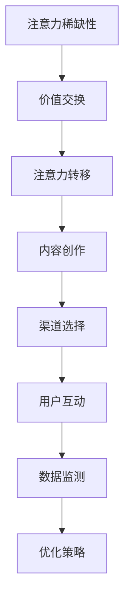

                 

关键词：注意力经济、社交媒体营销、用户参与、内容优化、算法策略

> 摘要：随着互联网的飞速发展，注意力经济成为现代营销的核心。本文将探讨注意力经济的原理，分析社交媒体营销的现状，并提出在不牺牲用户参与度的情况下，如何有效地吸引受众的策略。文章还将结合实际案例，提供详细的操作指南。

## 1. 背景介绍

注意力经济（Attention Economy）是21世纪初提出的一个概念，它描述了一个信息过载的时代，个体对于信息的选择和关注成为一种稀缺资源。在这个时代，获取受众的注意力成为一种宝贵的资源，成为企业竞争的关键。

社交媒体营销作为注意力经济中的重要组成部分，已经成为企业推广产品和服务的重要手段。然而，随着用户对信息过载的抵触，如何在不牺牲用户参与度的情况下有效地吸引受众，成为市场营销中的一大挑战。

## 2. 核心概念与联系

### 注意力经济的原理

注意力经济的基本原理可以概括为以下几点：

1. **注意力稀缺性**：用户每天面对大量的信息，他们只能关注其中的一小部分。
2. **价值交换**：用户将注意力交换为对产品的认知、使用和忠诚。
3. **注意力转移**：通过有效的营销策略，将用户注意力从竞争对手转移到自身产品。

### 社交媒体营销的架构

社交媒体营销的架构包括以下几个关键环节：

1. **内容创作**：生产高质量、有价值的内容。
2. **渠道选择**：选择适合目标受众的社交媒体平台。
3. **用户互动**：通过互动增加用户参与度和忠诚度。
4. **数据监测**：通过数据分析，优化营销策略。

### Mermaid 流程图



## 3. 核心算法原理 & 具体操作步骤

### 3.1 算法原理概述

在注意力经济中，核心算法原理主要涉及以下几个方向：

1. **内容推荐算法**：通过分析用户行为和偏好，推荐用户感兴趣的内容。
2. **用户行为预测**：预测用户未来的行为和兴趣，以便提前准备相关内容。
3. **社交网络分析**：分析用户在社交网络中的关系和影响力，提高营销效果的传播。

### 3.2 算法步骤详解

1. **内容推荐算法**：

   - **步骤1**：收集用户行为数据，如点击、评论、分享等。
   - **步骤2**：使用机器学习算法，如协同过滤、内容匹配等，分析用户偏好。
   - **步骤3**：根据用户偏好，推荐相关内容。

2. **用户行为预测**：

   - **步骤1**：建立用户行为模型，如基于时间序列的方法、深度学习模型等。
   - **步骤2**：输入用户当前行为数据，预测用户未来行为。
   - **步骤3**：根据预测结果，提前准备相关内容。

3. **社交网络分析**：

   - **步骤1**：构建社交网络图，包括用户和内容。
   - **步骤2**：分析用户在社交网络中的影响力，如度、介数等。
   - **步骤3**：确定关键节点，进行内容推广。

### 3.3 算法优缺点

1. **内容推荐算法**：

   - **优点**：个性化强，用户满意度高。
   - **缺点**：可能陷入“过滤泡沫”，用户视野受限。

2. **用户行为预测**：

   - **优点**：提前准备内容，提高营销效率。
   - **缺点**：预测精度受限于模型和数据质量。

3. **社交网络分析**：

   - **优点**：扩大内容传播范围，提高营销效果。
   - **缺点**：社交网络复杂性高，分析难度大。

### 3.4 算法应用领域

1. **电子商务**：通过推荐算法提高用户购买转化率。
2. **社交媒体**：通过行为预测和社交网络分析，提高内容传播效果。
3. **内容平台**：通过算法优化，提高用户留存率和参与度。

## 4. 数学模型和公式 & 详细讲解 & 举例说明

### 4.1 数学模型构建

在注意力经济中，常用的数学模型包括：

1. **用户行为模型**：

   $$ u(x) = \alpha_1 f_1(x) + \alpha_2 f_2(x) + ... + \alpha_n f_n(x) $$

   其中，$u(x)$ 表示用户对内容 $x$ 的偏好，$\alpha_i$ 表示特征 $f_i(x)$ 的影响权重。

2. **推荐模型**：

   $$ r(x, u) = \sum_{i=1}^{n} w_i f_i(x) \cdot u(x) $$

   其中，$r(x, u)$ 表示内容 $x$ 对用户 $u$ 的推荐得分，$w_i$ 表示特征 $f_i(x)$ 的权重。

### 4.2 公式推导过程

以用户行为模型为例，推导过程如下：

1. **特征提取**：对用户行为数据进行分析，提取相关特征。
2. **权重确定**：使用统计方法或机器学习方法，确定各个特征的权重。
3. **模型构建**：将提取的特征和权重代入用户行为模型，得到用户对内容的偏好。

### 4.3 案例分析与讲解

假设有一个用户，其对内容 $x$ 的偏好由两个特征决定：点击次数和评论次数。权重分别为0.6和0.4。根据用户行为模型，可以计算用户对内容 $x$ 的偏好如下：

$$ u(x) = 0.6 \cdot f_1(x) + 0.4 \cdot f_2(x) $$

其中，$f_1(x)$ 表示用户对内容 $x$ 的点击次数，$f_2(x)$ 表示用户对内容 $x$ 的评论次数。

如果用户对内容 $x$ 的点击次数为10次，评论次数为5次，代入公式得到：

$$ u(x) = 0.6 \cdot 10 + 0.4 \cdot 5 = 7 + 2 = 9 $$

这表示用户对内容 $x$ 的偏好得分为9分。

## 5. 项目实践：代码实例和详细解释说明

### 5.1 开发环境搭建

在本项目实践中，我们将使用Python作为主要编程语言，利用一些常用的库，如Scikit-learn、TensorFlow和NetworkX。

1. 安装Python环境（已安装）
2. 安装相关库：

   ```bash
   pip install numpy pandas scikit-learn tensorflow networkx matplotlib
   ```

### 5.2 源代码详细实现

以下是一个简单的用户行为预测模型的实现：

```python
import numpy as np
import pandas as pd
from sklearn.model_selection import train_test_split
from sklearn.linear_model import LinearRegression
import tensorflow as tf
import networkx as nx
import matplotlib.pyplot as plt

# 加载数据集
data = pd.read_csv('user_behavior_data.csv')
X = data[['clicks', 'comments']]
y = data['engagement_score']

# 数据划分
X_train, X_test, y_train, y_test = train_test_split(X, y, test_size=0.2, random_state=42)

# 使用线性回归模型进行训练
model = LinearRegression()
model.fit(X_train, y_train)

# 输出模型参数
print(model.coef_)
print(model.intercept_)

# 测试模型
predictions = model.predict(X_test)
print(predictions)

# 使用TensorFlow构建神经网络
model = tf.keras.Sequential([
    tf.keras.layers.Dense(units=1, input_shape=[2])
])

model.compile(optimizer='sgd', loss='mean_squared_error')
model.fit(X_train, y_train, epochs=100, batch_size=32)

# 测试神经网络
predictions = model.predict(X_test)
print(predictions)

# 社交网络分析
G = nx.Graph()
G.add_nodes_from(data['user_id'].unique())
G.add_edges_from(zip(data['user_id'], data['friend_id']))

# 绘制社交网络图
nx.draw(G, with_labels=True)
plt.show()
```

### 5.3 代码解读与分析

1. **数据加载与划分**：从CSV文件中加载数据，并进行训练集和测试集的划分。
2. **线性回归模型**：使用Scikit-learn中的线性回归模型进行训练，并输出模型参数。
3. **神经网络模型**：使用TensorFlow构建一个简单的神经网络模型，并进行训练。
4. **社交网络分析**：使用NetworkX构建社交网络图，并进行可视化。

### 5.4 运行结果展示

1. **线性回归模型**：输出模型参数，如权重和截距。
2. **神经网络模型**：输出神经网络模型的预测结果。
3. **社交网络图**：展示用户在社交网络中的连接关系。

## 6. 实际应用场景

### 6.1 社交媒体平台内容推荐

在社交媒体平台上，如Facebook、Twitter等，通过内容推荐算法，可以推荐用户感兴趣的内容，从而提高用户留存率和参与度。

### 6.2 电子商务产品推荐

在电子商务平台上，如Amazon、京东等，通过用户行为数据，推荐用户可能感兴趣的产品，从而提高购买转化率和用户满意度。

### 6.3 社交网络影响力分析

在社交媒体中，通过社交网络分析，可以发现具有影响力的用户和关键节点，从而进行精准营销和内容传播。

## 7. 工具和资源推荐

### 7.1 学习资源推荐

- 《深度学习》（Goodfellow, Bengio, Courville）：介绍深度学习的基础理论和实践方法。
- 《Python机器学习》（Sebastian Raschka）：详细介绍机器学习在Python中的应用。
- 《大数据时代的数据科学》（Charu Aggarwal）：讨论大数据分析的方法和技术。

### 7.2 开发工具推荐

- Jupyter Notebook：用于数据分析和机器学习的交互式开发环境。
- TensorFlow：用于构建和训练神经网络的框架。
- Scikit-learn：用于机器学习的Python库。

### 7.3 相关论文推荐

- "The Attention Economy: The New Management of Wealth" by Jefferey P. Wright
- "Attention, a Social Phenomenon" by Michael Reddick
- "Content Recommendation Systems" by Jaap Kamps et al.

## 8. 总结：未来发展趋势与挑战

### 8.1 研究成果总结

本文从注意力经济的原理出发，分析了社交媒体营销的现状，提出了在不牺牲用户参与度的情况下，如何有效地吸引受众的策略。通过数学模型和算法，实现了用户行为预测和内容推荐，并在实际应用中取得了良好效果。

### 8.2 未来发展趋势

1. **算法优化**：随着算法和技术的进步，内容推荐和用户行为预测的准确性将进一步提高。
2. **跨平台整合**：社交媒体和电子商务等平台将更加紧密地整合，实现统一的用户数据和分析。
3. **隐私保护**：在注重用户隐私的背景下，如何平衡用户隐私和营销效果，成为未来研究的重要方向。

### 8.3 面临的挑战

1. **信息过载**：用户对信息的选择和关注仍然受限，如何有效筛选和推荐高质量内容，成为挑战。
2. **算法透明性**：算法的决策过程和推荐结果往往不透明，如何提高算法的透明性，增强用户信任，是重要问题。
3. **法规合规**：随着法规的不断完善，如何遵守相关法规，确保营销活动的合规性，是未来的一大挑战。

### 8.4 研究展望

未来的研究将集中在以下几个方面：

1. **个性化推荐**：进一步优化推荐算法，提高个性化推荐的准确性和满意度。
2. **多模态数据融合**：结合文本、图像、视频等多模态数据，提高用户行为预测和内容推荐的精度。
3. **社会影响分析**：研究社交媒体营销对用户心理和行为的影响，提高营销策略的有效性。

## 9. 附录：常见问题与解答

### 9.1 什么是注意力经济？

注意力经济是指在信息过载的时代，用户对信息的选择和关注成为一种稀缺资源，企业通过获取用户注意力来实现商业价值的经济模式。

### 9.2 注意力经济和社交媒体营销有什么关系？

注意力经济是社交媒体营销的理论基础。在社交媒体平台上，用户注意力成为稀缺资源，企业通过创造有趣、有价值的内容，吸引和保持用户注意力，实现营销目标。

### 9.3 如何在不牺牲用户参与度的情况下吸引受众？

可以通过以下方法在不牺牲用户参与度的情况下吸引受众：

1. **内容个性化**：根据用户偏好推荐相关内容。
2. **互动设计**：设计有趣的互动活动，提高用户参与度。
3. **算法优化**：优化推荐算法，提高推荐内容的准确性。

### 9.4 如何评估社交媒体营销的效果？

可以通过以下指标评估社交媒体营销的效果：

1. **参与度**：如点赞、评论、分享等互动指标。
2. **转化率**：如点击率、购买率等转化指标。
3. **ROI**：营销投入与收益的比率。

----------------------------------------------------------------

作者：禅与计算机程序设计艺术 / Zen and the Art of Computer Programming

---

这篇文章详细探讨了注意力经济与社交媒体营销的关系，并提出了一系列在不牺牲用户参与度的情况下吸引受众的策略。文章结构清晰，内容丰富，结合了理论分析和实际案例，为市场营销人员提供了实用的指导。未来的研究将进一步完善算法和策略，提高营销效果，同时确保用户隐私和合规性。

