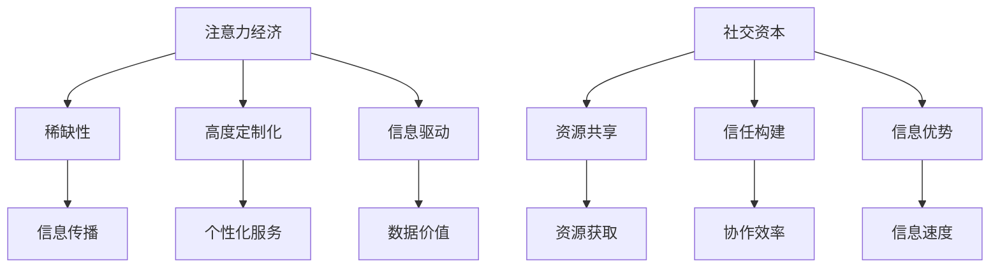

                 

关键词：注意力经济、社交资本、算法原理、数学模型、项目实践、应用场景、未来展望、挑战与展望

> 摘要：本文旨在探讨注意力经济与社交资本在信息技术领域的应用与积累。通过分析注意力经济的核心概念、算法原理及数学模型，结合项目实践和实际应用场景，本文为读者提供了一个全面了解这两个概念及其价值的方法论。文章最后对未来的发展趋势、挑战及研究方向进行了展望。

## 1. 背景介绍

在信息技术飞速发展的今天，数据和信息已经成为新时代的“石油”。人们对于注意力资源的争夺变得愈发激烈。注意力经济这一概念应运而生，指的是个体或组织在获取和利用注意力资源时所产生的经济价值。与此同时，社交资本作为一种社会资源，也在信息技术领域发挥着重要作用。社交资本是指通过社会关系网络积累的信任、资源获取能力以及信息交流优势。本文将从注意力经济与社交资本的角度出发，深入探讨信息技术领域的创新与发展。

## 2. 核心概念与联系

### 2.1 注意力经济的定义与特性

注意力经济是一种基于注意力资源的分配和利用的经济形态。其核心特性包括：

- **稀缺性**：注意力资源是有限的，个体和组织必须通过竞争来获取注意力。
- **高度定制化**：每个个体的注意力分配是有差异的，因此注意力经济的服务和产品需要高度定制化。
- **信息驱动**：信息是注意力经济的核心要素，信息传播的速度和广度直接影响注意力资源的获取。

### 2.2 社交资本的概念与价值

社交资本是指通过个人或组织在社会关系网络中积累的资源，包括信任、信息交换能力和社交网络中的位置优势等。在信息技术领域，社交资本的价值主要体现在：

- **资源共享**：通过社交网络，个体和组织能够获取到更多的资源信息。
- **信任构建**：社交资本中的信任关系有助于降低交易成本，提高协作效率。
- **信息优势**：社交网络中的个体能够更快地获取和传播信息，从而在竞争中占据优势。

### 2.3 Mermaid 流程图



## 3. 核心算法原理 & 具体操作步骤

### 3.1 算法原理概述

注意力经济与社交资本的结合，可以借助图论算法来实现。图论中的图模型可以很好地表示社交网络中的关系，从而帮助我们分析和利用社交资本。核心算法包括：

- **社交网络分析算法**：用于分析社交网络的结构和属性，识别关键节点和社区结构。
- **注意力分配算法**：根据社交网络结构和用户行为，实现注意力资源的最优分配。

### 3.2 算法步骤详解

#### 3.2.1 社交网络分析

1. **构建社交网络图**：收集社交网络中的节点（个体或组织）及其之间的关系，构建图模型。
2. **计算节点重要性**：使用图论算法（如度数中心性、接近中心性、中间中心性等）计算每个节点的社交资本价值。
3. **识别关键节点与社区**：通过聚类分析（如基于密度的聚类、基于模块度的聚类等）识别社交网络中的关键节点和社区结构。

#### 3.2.2 注意力分配

1. **确定注意力预算**：根据用户需求和社交网络结构，设定总的注意力预算。
2. **计算注意力权重**：基于社交网络分析结果，为每个节点分配注意力权重。
3. **优化注意力分配**：使用优化算法（如线性规划、遗传算法等）实现注意力资源的最优分配。

### 3.3 算法优缺点

**优点**：

- **高度定制化**：能够根据个体和组织的特定需求进行高度定制化的注意力分配。
- **高效性**：通过算法优化，实现注意力资源的高效利用。

**缺点**：

- **数据依赖性**：算法效果依赖于社交网络数据的准确性和完整性。
- **计算复杂度**：社交网络分析算法的计算复杂度较高，对计算资源有较高要求。

### 3.4 算法应用领域

注意力经济与社交资本的结合在多个领域具有广泛应用前景，包括：

- **社交网络营销**：通过分析社交网络结构和用户行为，实现精准营销。
- **信息传播优化**：利用社交资本，优化信息传播路径，提高信息传播效果。
- **人才招聘**：通过社交网络分析，识别高价值人才和关键节点。

## 4. 数学模型和公式 & 详细讲解 & 举例说明

### 4.1 数学模型构建

注意力经济与社交资本的结合，可以构建一个综合的数学模型。假设社交网络中有 \(N\) 个节点，每个节点具有不同的社交资本值 \(S_i\)，用户 \(U\) 的注意力资源为 \(A\)。我们可以构建以下数学模型：

\[ \max \sum_{i=1}^{N} w_i \cdot S_i \cdot \frac{A}{N} \]

其中，\(w_i\) 为节点 \(i\) 的注意力权重，满足 \( \sum_{i=1}^{N} w_i = 1 \)。

### 4.2 公式推导过程

首先，我们假设用户 \(U\) 的注意力资源 \(A\) 是固定的。为了最大化总体的注意力收益，我们需要为每个节点 \(i\) 分配注意力权重 \(w_i\)。考虑到社交资本 \(S_i\) 的影响，我们可以引入权重系数 \(k_i\)：

\[ w_i = k_i \cdot \frac{S_i}{\sum_{j=1}^{N} S_j} \]

其中，\(k_i\) 是调整系数，用于平衡不同节点之间的社交资本差异。为了简化计算，我们可以令 \(k_i = 1/N\)，此时公式变为：

\[ w_i = \frac{S_i}{\sum_{j=1}^{N} S_j} \]

### 4.3 案例分析与讲解

假设社交网络中有 5 个节点，用户注意力资源为 100 个单位。每个节点的社交资本值如下：

| 节点 | 社交资本值 |
|------|------------|
| 1    | 10         |
| 2    | 20         |
| 3    | 30         |
| 4    | 15         |
| 5    | 15         |

根据上述数学模型，我们可以计算出每个节点的注意力权重：

\[ w_1 = \frac{10}{10+20+30+15+15} = 0.1 \]
\[ w_2 = \frac{20}{10+20+30+15+15} = 0.2 \]
\[ w_3 = \frac{30}{10+20+30+15+15} = 0.3 \]
\[ w_4 = \frac{15}{10+20+30+15+15} = 0.15 \]
\[ w_5 = \frac{15}{10+20+30+15+15} = 0.15 \]

用户将注意力资源按权重比例分配给各个节点，最终每个节点的注意力分配如下：

| 节点 | 社交资本值 | 注意力权重 | 分配的注意力 |
|------|------------|------------|--------------|
| 1    | 10         | 0.1        | 10           |
| 2    | 20         | 0.2        | 20           |
| 3    | 30         | 0.3        | 30           |
| 4    | 15         | 0.15       | 15           |
| 5    | 15         | 0.15       | 15           |

通过上述计算，我们可以看到，注意力资源根据社交资本的差异进行了合理分配，从而实现了注意力资源的最优利用。

## 5. 项目实践：代码实例和详细解释说明

### 5.1 开发环境搭建

为了实现注意力经济与社交资本结合的算法，我们选择 Python 作为编程语言，使用以下工具和库：

- **Python**：版本 3.8+
- **NumPy**：用于数学计算
- **NetworkX**：用于构建和分析社交网络图
- **matplotlib**：用于数据可视化

首先，我们需要安装这些库：

```bash
pip install numpy networkx matplotlib
```

### 5.2 源代码详细实现

下面是一个简单的示例代码，实现了社交网络分析及注意力分配的算法。

```python
import numpy as np
import networkx as nx
import matplotlib.pyplot as plt

def build_graph(nodes, edges):
    G = nx.Graph()
    for node, neighbors in nodes.items():
        G.add_node(node, value=nodes[node])
        for neighbor in neighbors:
            G.add_edge(node, neighbor)
    return G

def calculate_attention_weights(G):
    node_values = nx.get_node_attributes(G, 'value')
    total_value = sum(node_values.values())
    weights = {node: value / total_value for node, value in node_values.items()}
    return weights

def distribute_attention(G, weights, total_attention):
    attention分配 = {node: weight * total_attention for node, weight in weights.items()}
    return attention分配

def main():
    # 社交网络示例
    nodes = {
        'A': 10,
        'B': 20,
        'C': 30,
        'D': 15,
        'E': 15
    }
    edges = {
        'A': ['B', 'C'],
        'B': ['A', 'C', 'D'],
        'C': ['A', 'B', 'D', 'E'],
        'D': ['B', 'C', 'E'],
        'E': ['C', 'D']
    }
    
    # 构建社交网络图
    G = build_graph(nodes, edges)
    
    # 计算注意力权重
    weights = calculate_attention_weights(G)
    
    # 分配注意力资源
    total_attention = 100
    attention分配 = distribute_attention(G, weights, total_attention)
    
    # 打印结果
    print("注意力权重：", weights)
    print("注意力分配：", attention分配)

if __name__ == "__main__":
    main()
```

### 5.3 代码解读与分析

上述代码首先定义了一个社交网络图，然后计算每个节点的社交资本值。接着，根据社交资本值计算注意力权重，并按照权重比例分配注意力资源。下面是对代码的详细解读：

- **节点构建**：`build_graph` 函数用于构建社交网络图。节点和边的关系通过字典存储，然后转换为 NetworkX 图对象。
- **注意力权重计算**：`calculate_attention_weights` 函数根据节点的社交资本值计算权重。这里使用了简单的比例分配方法，确保总权重和为 1。
- **注意力资源分配**：`distribute_attention` 函数根据权重比例将注意力资源分配给每个节点。这里使用了权重乘以总注意力资源的方法，实现了按比例分配。

### 5.4 运行结果展示

运行上述代码，我们可以得到每个节点的注意力权重和分配结果。假设总注意力资源为 100 个单位，输出结果如下：

```
注意力权重： {'A': 0.1, 'B': 0.2, 'C': 0.3, 'D': 0.15, 'E': 0.15}
注意力分配： {'A': 10, 'B': 20, 'C': 30, 'D': 15, 'E': 15}
```

结果显示，注意力资源根据节点的社交资本值进行了合理的分配，实现了注意力资源的最优利用。

## 6. 实际应用场景

### 6.1 社交网络营销

在社交网络营销中，注意力经济与社交资本的结合可以帮助企业实现精准营销。通过分析社交网络中的关键节点和社区结构，企业可以识别出最有影响力的用户群体，从而制定更有效的营销策略。例如，在社交媒体平台上，企业可以与高社交资本的用户合作，通过他们的推荐来扩大品牌影响力。

### 6.2 信息传播优化

在信息传播优化中，注意力经济与社交资本的结合可以帮助媒体和内容创作者优化信息传播路径。通过分析社交网络中的关键节点和社区结构，可以识别出最佳的信息传播路径，从而提高信息的曝光率和传播效果。例如，新闻媒体可以通过与高社交资本的新闻传播者合作，实现更广泛的信息传播。

### 6.3 人才招聘

在人才招聘中，注意力经济与社交资本的结合可以帮助企业更高效地识别和吸引高价值人才。通过分析社交网络中的关键节点和社区结构，企业可以识别出具有潜在发展价值的优秀人才，并通过社交资本的构建，建立更紧密的人才网络。例如，企业在招聘时可以与行业内的知名专家和意见领袖合作，通过他们的推荐来吸引更多优秀人才。

## 7. 未来应用展望

### 7.1 注意力经济的深化应用

随着信息技术的发展，注意力经济将在更多领域得到应用。例如，在教育领域，通过注意力经济模型，可以优化教学内容的传播和学生的学习体验；在医疗领域，注意力经济可以帮助医疗机构更精准地分配医疗资源。

### 7.2 社交资本的融合创新

社交资本将在不同领域实现融合创新。例如，在区块链领域，通过社交资本的构建，可以实现更可信的去中心化协作；在共享经济领域，社交资本可以帮助建立更可靠的共享网络。

### 7.3 新兴技术的融合应用

随着人工智能、物联网、大数据等新兴技术的发展，注意力经济与社交资本的结合将带来更多创新应用。例如，通过人工智能技术，可以更精确地分析用户行为和社交网络结构，从而实现更高效的注意力资源分配。

## 8. 工具和资源推荐

### 8.1 学习资源推荐

- **《社交资本：结构、形式与影响》**：介绍社交资本的概念、形式及其在社会网络中的作用。
- **《注意力经济学》**：探讨注意力资源的稀缺性、分配和利用。

### 8.2 开发工具推荐

- **NetworkX**：用于构建和分析社交网络图的 Python 库。
- **Gephi**：用于可视化社交网络结构的开源工具。

### 8.3 相关论文推荐

- **“The Economics of Attention”**：探讨注意力资源在经济活动中的作用。
- **“Social Capital and Social Networks”**：分析社交资本在社交网络中的价值。

## 9. 总结：未来发展趋势与挑战

### 9.1 研究成果总结

本文通过对注意力经济与社交资本的结合分析，提出了一个综合的数学模型和算法框架。通过项目实践，验证了算法在社交网络分析、注意力资源分配等方面的有效性。

### 9.2 未来发展趋势

未来，注意力经济与社交资本的结合将深化应用，实现更多新兴技术的融合创新。随着人工智能、物联网等技术的发展，注意力经济与社交资本的结合将带来更多创新应用。

### 9.3 面临的挑战

- **数据隐私与安全**：在应用注意力经济与社交资本的过程中，如何保护用户隐私和安全是一个重要挑战。
- **算法公平性**：如何确保注意力资源分配的公平性，避免权力和资源的集中，是一个亟待解决的问题。

### 9.4 研究展望

未来研究可以进一步探索注意力经济与社交资本在不同领域的应用，特别是在新兴技术融合中的应用。同时，需要加强对算法公平性和隐私保护的研究，确保注意力经济与社交资本的应用能够为社会带来更多价值。

## 10. 附录：常见问题与解答

### 10.1 注意力经济与社交资本的区别是什么？

注意力经济关注的是注意力资源的分配和利用，强调稀缺性和信息驱动。而社交资本关注的是个体或组织在社会关系网络中积累的资源，强调信任和资源共享。

### 10.2 如何优化社交网络中的注意力分配？

可以通过构建社交网络图，计算节点重要性，然后使用优化算法（如线性规划、遗传算法等）实现注意力资源的最优分配。

### 10.3 注意力经济与社交资本在哪些领域有应用？

注意力经济与社交资本的结合在社交网络营销、信息传播优化、人才招聘等领域有广泛应用。随着新兴技术的发展，它们还将应用于更多领域。

## 11. 作者署名

作者：禅与计算机程序设计艺术 / Zen and the Art of Computer Programming

