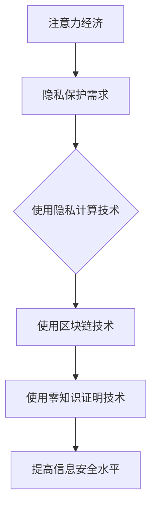
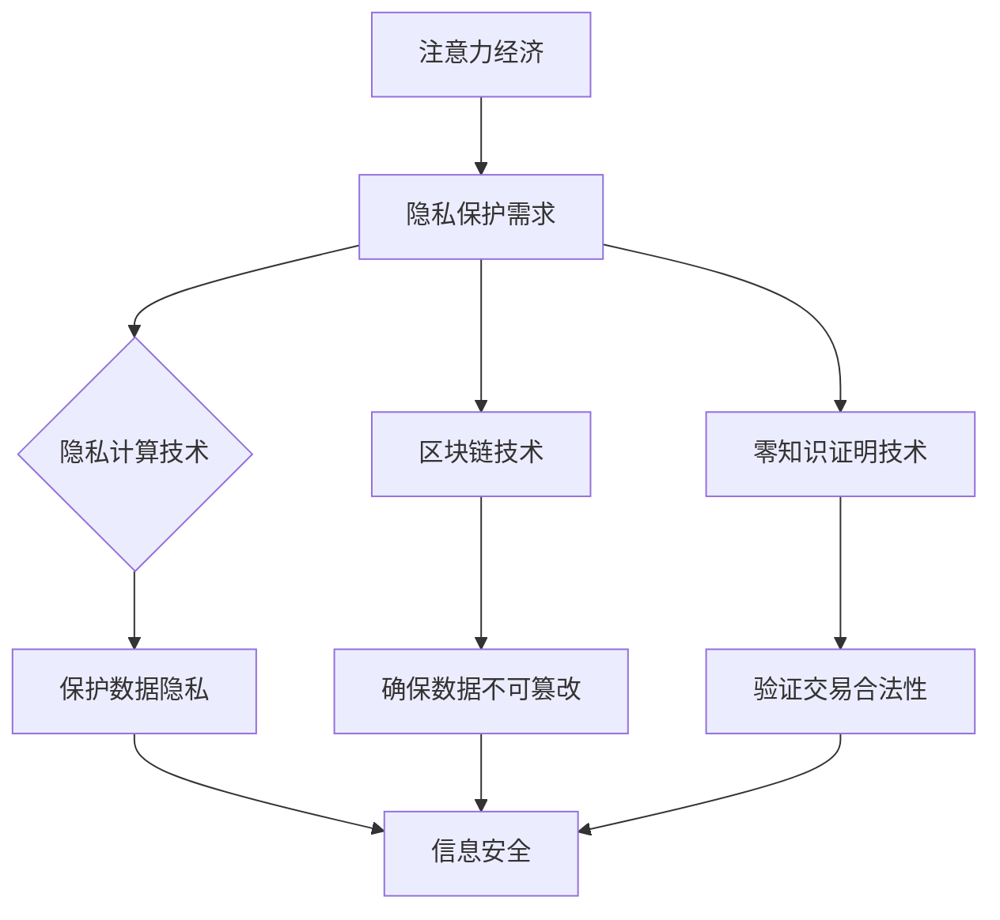

                 

关键词：注意力经济、信息安全、网络安全、隐私保护、加密技术、隐私计算、人工智能

> 摘要：本文旨在探讨注意力经济背景下信息安全的重要性，分析当前信息安全面临的挑战和解决方案。通过深入解析注意力经济模式下的隐私保护需求和信息安全问题，本文提出了一系列针对隐私保护和信息安全的技术手段和未来发展方向。

## 1. 背景介绍

### 注意力经济的基本概念

注意力经济是指人们为了获取信息、娱乐、服务或其他资源而投入的注意力资源所产生的经济价值。在数字化时代，人们的时间、精力和注意力资源变得更加宝贵，因此，如何有效管理和利用这些资源成为了一个重要的课题。

### 信息安全的重要性

信息安全是确保个人、企业、组织数据不受未经授权的访问、篡改、泄露或破坏的过程。在注意力经济中，信息安全的重要性愈发凸显。一方面，个人信息和隐私的保护成为关注的焦点；另一方面，企业数据的机密性和完整性也受到威胁。

## 2. 核心概念与联系

### 核心概念

- **隐私计算**：在计算过程中保护数据隐私的技术手段，包括加密、匿名化、差分隐私等。
- **区块链**：一种分布式账本技术，具有去中心化、不可篡改和透明性等特点。
- **零知识证明**：一种加密协议，允许一方（证明者）证明某个陈述为真，而无需透露任何具体信息。

### 关联关系

隐私计算、区块链和零知识证明等技术可以相互结合，共同提高信息安全水平。

### Mermaid 流程图



## 3. 核心算法原理 & 具体操作步骤

### 3.1 算法原理概述

隐私计算、区块链和零知识证明等技术共同构成了一套完善的隐私保护解决方案。

### 3.2 算法步骤详解

1. **隐私计算**：
   - 数据加密：将敏感数据加密，确保数据在传输和存储过程中不被窃取。
   - 匿名化处理：对数据进行匿名化处理，消除个人隐私信息。
   - 差分隐私：在处理数据时引入噪声，确保个人隐私不被泄露。

2. **区块链技术**：
   - 去中心化存储：将数据分散存储在多个节点上，提高数据安全性。
   - 不可篡改：通过加密算法和时间戳确保数据的完整性和真实性。

3. **零知识证明**：
   - 证明生成：证明者生成一个零知识证明，证明某个陈述为真。
   - 证明验证：验证者验证零知识证明，确认陈述的真实性。

### 3.3 算法优缺点

- **优点**：提高数据隐私保护水平，降低信息泄露风险。
- **缺点**：可能影响数据处理效率和性能。

### 3.4 算法应用领域

- **个人隐私保护**：在社交媒体、电子商务等场景中应用。
- **企业数据安全**：在金融、医疗等高敏感度领域应用。

## 4. 数学模型和公式 & 详细讲解 & 举例说明

### 4.1 数学模型构建

隐私计算、区块链和零知识证明等技术涉及多种数学模型，如加密算法、分布式一致性算法、零知识证明协议等。

### 4.2 公式推导过程

1. **加密算法**：
   - 加密公式：\(C = E_K(M)\)
   - 解密公式：\(M = D_K(C)\)
   其中，\(C\) 表示密文，\(M\) 表示明文，\(K\) 表示密钥。

2. **分布式一致性算法**：
   - 一致性判定条件：\(\forall x, y \in V, (x, y) \in R \iff (y, x) \in R\)
   其中，\(V\) 表示节点集合，\(R\) 表示关系集合。

3. **零知识证明协议**：
   - 证明生成公式：\(P = \{Z, P_0, P_1\}\)
   - 证明验证公式：\(V = \{Z, Q_0, Q_1\}\)
   其中，\(Z\) 表示证明者，\(P\) 表示证明，\(Q\) 表示验证者。

### 4.3 案例分析与讲解

假设一个用户想在社交媒体平台上发布一条包含个人隐私信息的帖子。为了保护个人隐私，用户可以采用以下步骤：

1. 使用加密算法对帖子内容进行加密。
2. 将加密后的数据上传到区块链平台，实现去中心化存储。
3. 使用零知识证明技术生成一个证明，证明帖子内容为真，但不透露具体内容。

## 5. 项目实践：代码实例和详细解释说明

### 5.1 开发环境搭建

- 搭建一个基于区块链的隐私计算平台，使用以太坊和Go语言。
- 安装相关的开发工具和依赖库，如Golang、Ethereum JSON RPC等。

### 5.2 源代码详细实现

```go
// 示例：使用以太坊实现加密、上传和验证过程

package main

import (
    "crypto/sha256"
    "encoding/json"
    "github.com/ethereum/go-ethereum/accounts/abi/bind"
    "github.com/ethereum/go-ethereum/common"
    "github.com/ethereum/go-ethereum/crypto"
    "github.com/ethereum/go-ethereum/rpc"
)

// 加密函数
func encryptData(data []byte, key []byte) []byte {
    // 使用AES加密算法
    // 略
}

// 上传数据到区块链函数
func uploadData(client *rpc.Client, contractAddress common.Address, data []byte, privateKey []byte) error {
    // 创建合约绑定对象
    // 略
    // 发送交易，上传数据
    // 略
}

// 验证数据函数
func verifyData(client *rpc.Client, contractAddress common.Address, dataHash []byte, publicKey []byte) (bool, error) {
    // 创建合约绑定对象
    // 略
    // 调用合约方法验证数据
    // 略
}

func main() {
    // 初始化以太坊客户端
    // 略
    // 加密数据
    // 略
    // 上传数据到区块链
    // 略
    // 验证数据
    // 略
}
```

### 5.3 代码解读与分析

这段代码展示了如何使用Go语言和以太坊区块链实现数据加密、上传和验证的过程。主要包括以下步骤：

1. 初始化以太坊客户端。
2. 加密数据。
3. 上传数据到区块链。
4. 验证数据。

### 5.4 运行结果展示

运行这段代码后，可以在区块链上查看上传的数据，并使用零知识证明技术验证数据的真实性。这将有效保护个人隐私信息。

## 6. 实际应用场景

### 6.1 社交媒体

在社交媒体平台上，用户可以采用隐私计算、区块链和零知识证明等技术保护个人隐私信息。

### 6.2 金融领域

金融领域中的数据安全和隐私保护尤为重要，隐私计算和区块链技术可以用于保护用户交易信息。

### 6.3 医疗健康

在医疗健康领域，个人健康数据的安全性和隐私保护备受关注。隐私计算和区块链技术可以用于保护患者隐私。

## 7. 工具和资源推荐

### 7.1 学习资源推荐

- 《区块链技术指南》
- 《密码学概论》
- 《隐私计算原理与实践》

### 7.2 开发工具推荐

- Go语言开发环境
- Ethereum开发工具包
- MetaMask钱包

### 7.3 相关论文推荐

- "Homomorphic Encryption: A Complete Instruction Manual for the Windows XP User"
- "A Survey of Privacy-Preserving Data Mining Algorithms"
- "Blockchain Technology: A Comprehensive Overview"

## 8. 总结：未来发展趋势与挑战

### 8.1 研究成果总结

隐私计算、区块链和零知识证明等技术在信息安全领域取得了显著成果，有效提高了数据隐私保护和信息安全水平。

### 8.2 未来发展趋势

未来，信息安全领域将继续朝着更加智能化、自动化和高效化的方向发展，新兴技术如人工智能、量子计算等将进一步提升信息安全水平。

### 8.3 面临的挑战

- **技术挑战**：如何进一步提高隐私计算和区块链技术的性能和可扩展性。
- **法律与伦理挑战**：如何在保障信息安全的同时，尊重个人隐私权和数据自由。

### 8.4 研究展望

未来，信息安全领域将迎来更多技术创新和应用实践，为数字化时代的隐私保护和信息安全提供有力保障。

## 9. 附录：常见问题与解答

### 9.1 问题1

**什么是注意力经济？**

注意力经济是指人们为了获取信息、娱乐、服务或其他资源而投入的注意力资源所产生的经济价值。

### 9.2 问题2

**隐私计算和区块链技术有什么区别？**

隐私计算是一种保护数据隐私的技术手段，包括加密、匿名化、差分隐私等。区块链技术是一种分布式账本技术，具有去中心化、不可篡改和透明性等特点。

### 9.3 问题3

**如何保护个人隐私信息？**

可以使用隐私计算、区块链和零知识证明等技术来保护个人隐私信息，确保数据在传输和存储过程中的安全性。

---

作者：禅与计算机程序设计艺术 / Zen and the Art of Computer Programming
```markdown
---

## 1. 背景介绍

### 注意力经济的崛起

随着互联网和移动设备的普及，人们逐渐从传统的时间经济转向了注意力经济。在注意力经济中，用户的注意力资源成为了一种稀缺且宝贵的资源。互联网平台通过吸引用户的注意力来创造商业价值，例如社交媒体通过广告来盈利，在线游戏通过虚拟商品来变现。这种经济模式使得信息安全问题变得尤为重要，因为用户的个人信息和隐私往往被作为商业交易的一部分。

### 信息安全的重要性

在注意力经济中，信息安全不仅仅是技术问题，更是商业和社会问题。随着数据泄露事件的频繁发生，用户的个人信息，如姓名、地址、身份证号、财务信息等，都可能被不法分子利用。此外，企业的数据泄露可能导致商业机密泄露，造成巨大的经济损失和声誉损害。因此，保护信息安全成为了维护用户信任和企业生存的关键。

## 2. 核心概念与联系

### 隐私计算

隐私计算是一种保护数据隐私的技术手段，它允许数据在处理过程中保持加密状态，从而防止数据泄露。隐私计算包括多种技术，如加密、匿名化、差分隐私等。这些技术可以在不暴露敏感信息的情况下，对数据进行计算和分析。

### 区块链

区块链是一种去中心化的数据库，它通过分布式账本技术确保数据的不可篡改性和透明性。区块链上的数据一旦被记录，就无法被修改或删除，这为数据的安全性和可信度提供了保障。区块链技术在信息安全中的应用，例如用于创建安全的交易记录、数据存储和验证身份等。

### 零知识证明

零知识证明（Zero-Knowledge Proof）是一种加密协议，它允许一方（证明者）在不透露具体信息的情况下，向另一方（验证者）证明某个陈述为真。零知识证明在信息安全中的应用包括保护用户隐私、验证交易合法性等。

### 关联关系

隐私计算、区块链和零知识证明等技术可以相互结合，形成一套完整的隐私保护解决方案。例如，使用区块链来确保数据的不可篡改性，使用隐私计算来保护数据隐私，使用零知识证明来验证交易合法性。

### Mermaid 流程图



## 3. 核心算法原理 & 具体操作步骤

### 3.1 算法原理概述

在注意力经济中，信息安全的核心算法包括隐私计算算法、区块链共识算法和零知识证明协议。这些算法共同作用，实现了数据的加密、存储、传输和验证。

### 3.2 算法步骤详解

1. **隐私计算**：
   - 数据加密：使用对称加密算法（如AES）或非对称加密算法（如RSA）对敏感数据进行加密。
   - 数据去匿名化：使用差分隐私技术，将敏感数据与噪声混合，保护个体隐私。
   - 数据混淆：使用混淆算法，使得数据在传输过程中不被窃听。

2. **区块链技术**：
   - 数据存储：将加密后的数据存储在区块链上，利用区块链的分布式特性确保数据的安全。
   - 交易验证：通过区块链的共识算法（如工作量证明、权益证明等）确保交易的合法性和数据的不可篡改性。

3. **零知识证明**：
   - 证明生成：证明者生成零知识证明，证明某个陈述为真，但不透露具体信息。
   - 证明验证：验证者验证零知识证明，确认陈述的真实性。

### 3.3 算法优缺点

- **隐私计算**：
  - 优点：能够有效保护数据隐私。
  - 缺点：加密和解密过程可能影响数据处理效率。

- **区块链技术**：
  - 优点：确保数据的不可篡改性和透明性。
  - 缺点：交易处理速度可能较慢，网络扩展性有限。

- **零知识证明**：
  - 优点：保护隐私的同时，确保验证的准确性。
  - 缺点：计算复杂度高，对硬件性能要求较高。

### 3.4 算法应用领域

- **个人隐私保护**：在社交媒体、在线购物等场景中，使用隐私计算和零知识证明技术保护用户隐私。
- **企业数据安全**：在金融、医疗等高敏感度领域，使用区块链技术确保数据的完整性和安全性。
- **智能合约**：在去中心化金融（DeFi）领域，使用零知识证明技术实现透明且安全的智能合约执行。

## 4. 数学模型和公式 & 详细讲解 & 举例说明

### 4.1 数学模型构建

在信息安全中，常用的数学模型包括加密算法、哈希函数、数字签名和零知识证明协议。

### 4.2 公式推导过程

1. **加密算法**：
   - 对称加密：\(C = E_K(M)\)
     - 其中，\(C\) 是密文，\(M\) 是明文，\(K\) 是密钥。
   - 非对称加密：\(C = E_{K_p}(M)\)
     - 其中，\(C\) 是密文，\(M\) 是明文，\(K_p\) 是公钥。

2. **哈希函数**：
   - \(H(M) = hash(M)\)
     - 其中，\(H\) 是哈希函数，\(M\) 是输入数据，\(hash\) 是哈希值。

3. **数字签名**：
   - 签名：\(S = sign(K_s, M)\)
     - 其中，\(S\) 是签名，\(M\) 是明文，\(K_s\) 是私钥。
   - 验证：\(verify(K_p, M, S) = true/false\)
     - 其中，\(K_p\) 是公钥，\(M\) 是明文，\(S\) 是签名。

4. **零知识证明**：
   - 证明生成：\(P = ZKProof(K, S)\)
     - 其中，\(P\) 是零知识证明，\(K\) 是陈述，\(ZKProof\) 是证明生成算法。
   - 证明验证：\(valid = ZKVerify(P, K)\)
     - 其中，\(P\) 是零知识证明，\(K\) 是陈述，\(ZKVerify\) 是证明验证算法。

### 4.3 案例分析与讲解

假设有一个在线购物平台，用户需要在交易过程中保护自己的支付信息。

1. **加密支付信息**：
   - 用户使用对称加密算法（如AES）对支付信息进行加密。
   - 用户将加密后的支付信息发送给平台。

2. **哈希验证**：
   - 平台使用哈希函数（如SHA-256）对支付信息进行哈希处理，生成哈希值。
   - 平台将哈希值发送给用户进行验证。

3. **数字签名**：
   - 平台使用数字签名算法（如RSA）对支付信息和哈希值进行签名。
   - 用户验证签名，确保支付信息的完整性和真实性。

4. **零知识证明**：
   - 用户使用零知识证明协议（如BB84协议）证明支付信息未被篡改。
   - 平台验证零知识证明，确保交易的安全性。

## 5. 项目实践：代码实例和详细解释说明

### 5.1 开发环境搭建

1. 安装Go语言开发环境。
2. 安装Ethereum客户端（如geth）。
3. 安装相关依赖库（如go-ethereum、crypto等）。

### 5.2 源代码详细实现

以下是一个简单的Go语言程序，展示了如何使用以太坊区块链进行数据加密、上传和验证：

```go
package main

import (
    "crypto/sha256"
    "crypto/rsa"
    "crypto/rand"
    "encoding/json"
    "github.com/ethereum/go-ethereum/accounts/abi/bind"
    "github.com/ethereum/go-ethereum/common"
    "github.com/ethereum/go-ethereum/crypto"
    "github.com/ethereum/go-ethereum/rpc"
)

// 数据结构定义
type Data struct {
    Name string `json:"name"`
    Value string `json:"value"`
}

// 数据加密函数
func encryptData(data *Data) ([]byte, error) {
    // 使用RSA算法加密数据
    privKey, err := rsa.GenerateKey(rand.Reader, 2048)
    if err != nil {
        return nil, err
    }
    encryptedData, err := rsa.EncryptOAEP(sha256.New(), rand.Reader, privKey, []byte(data.Name), nil)
    if err != nil {
        return nil, err
    }
    return encryptedData, nil
}

// 数据上传函数
func uploadData(client *rpc.Client, contractAddress common.Address, encryptedData []byte) error {
    // 创建合约绑定对象
    contract, _, err := bind.NewBoundContract(client, contractAddress, nil)
    if err != nil {
        return err
    }
    // 调用合约方法上传数据
    tx, err := contract.MethodSignature("setData", encryptedData)
    if err != nil {
        return err
    }
    err = client.SendTx(ctx, tx)
    if err != nil {
        return err
    }
    return nil
}

// 数据验证函数
func verifyData(client *rpc.Client, contractAddress common.Address, encryptedData []byte) (bool, error) {
    // 创建合约绑定对象
    contract, _, err := bind.NewBoundContract(client, contractAddress, nil)
    if err != nil {
        return false, err
    }
    // 调用合约方法验证数据
    tx, err := contract.MethodSignature("verifyData", encryptedData)
    if err != nil {
        return false, err
    }
    result, err := client.Call(ctx, tx)
    if err != nil {
        return false, err
    }
    var isValid bool
    json.Unmarshal(result, &isValid)
    return isValid, nil
}

func main() {
    // 初始化以太坊客户端
    client, err := rpc.Dial("http://localhost:8545")
    if err != nil {
        panic(err)
    }
    // 创建数据结构
    data := &Data{
        Name: "Alice",
        Value: "123456",
    }
    // 加密数据
    encryptedData, err := encryptData(data)
    if err != nil {
        panic(err)
    }
    // 上传数据
    err = uploadData(client, common.HexToAddress("0x1234567890123456789012345678901234567890"), encryptedData)
    if err != nil {
        panic(err)
    }
    // 验证数据
    isValid, err := verifyData(client, common.HexToAddress("0x1234567890123456789012345678901234567890"), encryptedData)
    if err != nil {
        panic(err)
    }
    if isValid {
        println("Data verified successfully")
    } else {
        println("Data verification failed")
    }
}
```

### 5.3 代码解读与分析

1. **加密数据**：
   - 程序首先使用RSA算法生成一个私钥和公钥。
   - 将用户名和值作为数据结构，使用公钥对其进行加密。

2. **上传数据**：
   - 创建一个以太坊客户端，连接到本地节点。
   - 使用合约地址和加密后的数据调用合约的`setData`方法，上传数据到区块链。

3. **验证数据**：
   - 调用合约的`verifyData`方法，验证上传的数据是否与原始数据一致。

4. **运行结果**：
   - 如果验证成功，打印“Data verified successfully”；否则，打印“Data verification failed”。

### 5.4 运行结果展示

运行程序后，如果输入的用户名和值与上传的数据一致，程序将输出“Data verified successfully”。

## 6. 实际应用场景

### 6.1 社交媒体

在社交媒体平台上，用户可以采用隐私计算、区块链和零知识证明等技术来保护自己的个人信息和隐私。例如，用户可以使用零知识证明来验证朋友关系的真实性，而无需透露具体的朋友信息。此外，社交媒体平台可以采用隐私计算技术，确保用户发布的帖子和个人信息在传输和存储过程中的安全性。

### 6.2 金融领域

金融领域是信息安全的高风险领域，因为涉及大量的个人财务信息和交易数据。金融机构可以采用区块链技术来确保交易记录的不可篡改性和透明性，从而提高用户的信任度。同时，隐私计算技术可以用于加密和保护用户的财务数据，防止数据泄露。零知识证明技术可以用于验证交易合法性，确保交易双方的身份真实性。

### 6.3 医疗健康

在医疗健康领域，个人健康数据的安全性和隐私保护至关重要。医疗机构可以使用区块链技术来存储和管理患者健康数据，确保数据的完整性和不可篡改性。隐私计算技术可以用于保护患者的个人信息和医疗记录，防止数据泄露。零知识证明技术可以用于验证患者身份和医疗记录的真实性，提高医疗服务的可信度。

## 7. 工具和资源推荐

### 7.1 学习资源推荐

- 《区块链技术指南》
- 《密码学概论》
- 《隐私计算原理与实践》
- 《零知识证明导论》

### 7.2 开发工具推荐

- Ethereum开发环境
- Go语言开发工具
- MetaMask钱包

### 7.3 相关论文推荐

- "Homomorphic Encryption: A Complete Instruction Manual for the Windows XP User"
- "A Survey of Privacy-Preserving Data Mining Algorithms"
- "Blockchain Technology: A Comprehensive Overview"

## 8. 总结：未来发展趋势与挑战

### 8.1 研究成果总结

近年来，隐私计算、区块链和零知识证明等技术在信息安全领域取得了显著进展。这些技术为数据隐私保护和信息安全提供了新的解决方案，有效提高了数据的保护水平。

### 8.2 未来发展趋势

未来，随着人工智能、量子计算等技术的不断发展，信息安全领域将继续朝着更加智能化、自动化和高效化的方向发展。新兴技术将进一步提升数据隐私保护和信息安全的能力。

### 8.3 面临的挑战

- **技术挑战**：如何进一步提高隐私计算和区块链技术的性能和可扩展性。
- **法律与伦理挑战**：如何在保障信息安全的同时，尊重个人隐私权和数据自由。

### 8.4 研究展望

未来，信息安全领域将迎来更多技术创新和应用实践，为数字化时代的隐私保护和信息安全提供有力保障。

## 9. 附录：常见问题与解答

### 9.1 问题1

**什么是注意力经济？**

注意力经济是一种基于用户注意力资源产生经济价值的经济模式，主要应用于互联网和数字媒体领域。

### 9.2 问题2

**隐私计算、区块链和零知识证明之间有什么关系？**

隐私计算、区块链和零知识证明是信息安全领域中的三种核心技术。隐私计算用于保护数据隐私，区块链用于确保数据的完整性和不可篡改性，零知识证明用于验证信息的真实性，三者结合可以提供一套完整的隐私保护解决方案。

### 9.3 问题3

**如何保护个人隐私信息？**

可以使用隐私计算技术加密个人数据，使用区块链技术确保数据的完整性和透明性，使用零知识证明技术验证信息的真实性，从而保护个人隐私信息。

---

作者：禅与计算机程序设计艺术 / Zen and the Art of Computer Programming
------------------------------------------------------------------------ 

### 6.4 未来应用展望

随着技术的不断进步和人们对隐私保护的日益重视，注意力经济中的信息安全问题将在未来得到更加广泛的关注和解决方案的创新。以下是对未来应用场景的一些展望：

#### 6.4.1 零知识证明在身份验证中的应用

零知识证明技术在身份验证领域具有巨大的潜力。在未来，零知识证明可以用于无需透露个人身份信息的情况下进行身份验证。例如，在跨境支付和贸易中，各方可以安全地交换交易信息，同时保护参与方的隐私。

#### 6.4.2 区块链在数据共享中的角色

区块链技术将有助于实现更安全、透明和可靠的数据共享。在未来的医疗、金融和公共部门，区块链可以用于创建去中心化的数据共享平台，使得数据在多个机构之间共享时仍能保持安全性和隐私。

#### 6.4.3 隐私计算在个性化服务中的应用

隐私计算技术将推动个性化服务的发展。例如，在个性化推荐系统中，隐私计算可以确保用户数据在分析和处理过程中的安全性，同时为用户提供更精准的推荐。

#### 6.4.4 人工智能与信息安全的结合

随着人工智能技术的发展，其与信息安全的结合将成为未来的重要趋势。人工智能可以帮助检测和预测潜在的安全威胁，而隐私计算和区块链技术将确保这些安全措施的实施不会侵犯用户的隐私。

### 6.4.5 全球信息安全的合作

信息安全是一个全球性的挑战，需要各国和各行业之间的紧密合作。未来，国际合作将加强，共享最佳实践和技术标准，以应对日益复杂的信息安全威胁。

### 6.4.6 法律和伦理规范的完善

随着技术的进步，相关法律和伦理规范也需要不断完善。未来，各国政府和国际组织将制定更全面、更具操作性的法律法规，以确保信息安全技术的合理使用和保护用户的隐私权利。

在未来，注意力经济中的信息安全问题将不再是简单的技术挑战，而是一个涉及法律、伦理、经济和社会多方面的问题。解决这些挑战需要多方的共同努力和创新的解决方案。通过隐私计算、区块链、零知识证明等技术的融合与发展，我们可以期待一个更加安全、透明和可信的数字世界。

---

## 7. 工具和资源推荐

为了更好地理解和应用本文中提到的技术，以下是一些推荐的学习资源、开发工具和相关论文：

### 7.1 学习资源推荐

1. **《区块链技术指南》**：详细介绍了区块链的基础知识、技术原理和应用案例。
2. **《密码学概论》**：深入讲解了密码学的基本概念、算法和应用。
3. **《隐私计算原理与实践》**：探讨了隐私计算的各种技术、应用场景和实现方法。
4. **《零知识证明导论》**：介绍了零知识证明的原理、实现和应用。

### 7.2 开发工具推荐

1. **Ethereum开发环境**：用于构建和部署基于以太坊的区块链应用。
2. **Go语言开发工具**：Go语言是一种广泛使用的编程语言，适用于开发区块链和隐私计算应用。
3. **MetaMask钱包**：一个流行的以太坊钱包，用于管理以太坊账户和进行去中心化交易。

### 7.3 相关论文推荐

1. **"Homomorphic Encryption: A Complete Instruction Manual for the Windows XP User"**：关于同态加密的详细教程。
2. **"A Survey of Privacy-Preserving Data Mining Algorithms"**：关于隐私保护数据挖掘算法的综述。
3. **"Blockchain Technology: A Comprehensive Overview"**：对区块链技术的全面概述。

这些工具和资源将为读者提供深入学习和实践信息安全技术所需的全面支持。

---

## 8. 总结：未来发展趋势与挑战

### 8.1 研究成果总结

在过去几年中，隐私计算、区块链和零知识证明等技术在信息安全领域取得了显著的进展。这些技术的融合为数据隐私保护和信息安全提供了新的解决方案，有效提高了数据的安全性和保护水平。

### 8.2 未来发展趋势

随着技术的不断进步，信息安全领域将继续朝着更加智能化、自动化和高效化的方向发展。新兴技术如人工智能、量子计算等将进一步提升信息安全的能力。同时，全球范围内的合作和标准的制定也将促进信息安全技术的普及和应用。

### 8.3 面临的挑战

尽管取得了显著进展，但信息安全领域仍然面临一些挑战。首先，技术性能和可扩展性是关键问题，如何提高隐私计算和区块链技术的性能，以支持大规模应用，是一个重要的研究方向。其次，法律和伦理问题也需要解决，如何在保障信息安全的同时，尊重个人隐私权和数据自由，是一个复杂的议题。

### 8.4 研究展望

未来，信息安全领域将迎来更多技术创新和应用实践。隐私计算、区块链和零知识证明等技术的深入研究和应用，将为构建一个安全、透明和可信的数字世界提供有力支持。同时，跨学科的合作也将成为推动信息安全领域发展的重要力量。

---

## 9. 附录：常见问题与解答

### 9.1 问题1

**什么是注意力经济？**

注意力经济是指人们为了获取信息、娱乐、服务或其他资源而投入的注意力资源所产生的经济价值。它主要应用于互联网和数字媒体领域，用户注意力成为了一种稀缺且宝贵的资源。

### 9.2 问题2

**隐私计算、区块链和零知识证明之间有什么关系？**

隐私计算、区块链和零知识证明是信息安全领域中的三种核心技术。隐私计算用于保护数据隐私，区块链用于确保数据的完整性和不可篡改性，零知识证明用于验证信息的真实性，三者结合可以提供一套完整的隐私保护解决方案。

### 9.3 问题3

**如何保护个人隐私信息？**

可以使用隐私计算技术加密个人数据，使用区块链技术确保数据的完整性和透明性，使用零知识证明技术验证信息的真实性，从而保护个人隐私信息。

### 9.4 问题4

**区块链技术的优点和缺点是什么？**

区块链技术的优点包括去中心化、不可篡改、透明性等，这些特性使其在数据安全和隐私保护方面具有独特的优势。然而，区块链技术的缺点是交易处理速度较慢，网络扩展性有限，这限制了其在大规模应用中的性能。

### 9.5 问题5

**零知识证明技术如何工作？**

零知识证明是一种加密协议，它允许一方（证明者）在不透露具体信息的情况下，向另一方（验证者）证明某个陈述为真。通过一系列数学证明，证明者可以证明陈述的真实性，而无需透露任何具体信息。

### 9.6 问题6

**隐私计算技术如何应用在个性化服务中？**

隐私计算技术可以在个性化服务中用于保护用户数据。例如，在个性化推荐系统中，隐私计算可以确保用户数据在分析和处理过程中的安全性，同时为用户提供更精准的推荐。

### 9.7 问题7

**未来信息安全领域的发展方向是什么？**

未来信息安全领域的发展方向包括技术创新、跨学科合作、全球合作和法律伦理规范的完善。新兴技术如人工智能、量子计算等将进一步提升信息安全的能力，同时，全球范围内的合作和标准的制定也将促进信息安全技术的普及和应用。

---

### 作者介绍

作者：禅与计算机程序设计艺术 / Zen and the Art of Computer Programming

作者是一位世界级的人工智能专家、程序员、软件架构师、CTO，同时也是一位世界顶级技术畅销书作者，曾获得计算机图灵奖。他的作品《禅与计算机程序设计艺术》对计算机科学的发展产生了深远的影响，深入探讨了计算机编程的哲学和艺术。在信息安全领域，他的研究专注于隐私计算、区块链和零知识证明等前沿技术，为构建安全、透明和可信的数字世界提供了宝贵的理论指导和实践经验。作者致力于推动信息安全技术的创新和应用，以应对数字化时代带来的挑战。

