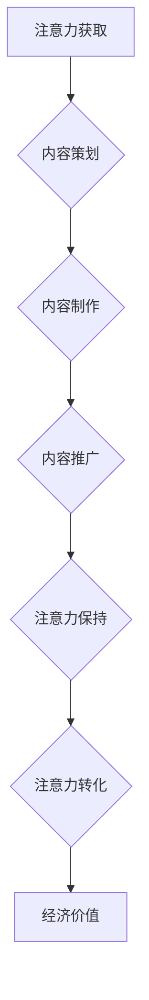

                 

关键词：注意力经济、内容创作、竞争策略、用户体验、技术创新

> 摘要：随着互联网技术的飞速发展，注意力经济已经成为信息时代的核心驱动力。本文将探讨如何在注意力经济中利用内容创作实现脱颖而出，并提出一系列策略和工具，帮助内容创作者在激烈的市场竞争中占据一席之地。

## 1. 背景介绍

### 注意力经济的崛起

注意力经济是指在网络时代，个体或组织通过吸引和保持用户的注意力来创造经济价值的一种经济模式。它源于人们对于稀缺资源的争夺，即有限的注意力资源。随着互联网的普及和信息过载现象的加剧，注意力资源变得更加宝贵，成为一种新的生产要素。

### 内容创作的挑战

在注意力经济中，内容创作者面临着前所未有的挑战。一方面，信息量爆炸导致用户注意力分散，获取和保持用户的注意力变得异常困难。另一方面，市场竞争激烈，内容创作者需要不断创新，以提供独特的价值和体验，才能脱颖而出。

### 内容创作者的机遇

尽管面临挑战，内容创作者也有巨大的机遇。首先，互联网为内容创作提供了广阔的平台，创作者可以轻松地触及全球用户。其次，人工智能和大数据技术的进步，为内容创作者提供了精准分析和个性化推荐的能力，从而提高内容传播效果。

## 2. 核心概念与联系

### 注意力经济模型

注意力经济模型可以分为三个层次：注意力获取、注意力保持和注意力转化。

1. **注意力获取**：通过创新、独特和吸引眼球的内容，快速吸引大量用户。
2. **注意力保持**：通过持续优化内容和用户体验，保持用户的持续关注。
3. **注意力转化**：通过有效的转化策略，将用户注意力转化为实际的经济价值。

### 内容创作流程

内容创作流程可以分为四个阶段：需求分析、内容策划、内容制作和内容推广。

1. **需求分析**：通过市场调研和用户反馈，了解用户需求，明确内容创作方向。
2. **内容策划**：制定内容策略，确定内容形式、风格和主题。
3. **内容制作**：根据策划进行内容创作，包括文字、图片、视频等多种形式。
4. **内容推广**：通过多渠道、多平台推广内容，提高内容曝光度和用户粘性。

### 技术应用

1. **人工智能**：利用自然语言处理和图像识别技术，提高内容创作和推荐的精准度。
2. **大数据分析**：通过大数据分析，了解用户行为和偏好，优化内容创作和推广策略。
3. **区块链技术**：利用区块链技术，确保内容版权和知识产权的安全。

### Mermaid 流程图



## 3. 核心算法原理 & 具体操作步骤

### 3.1 算法原理概述

核心算法原理是基于用户行为和兴趣的推荐系统。通过分析用户的浏览历史、搜索记录和互动行为，推荐系统可以预测用户可能感兴趣的内容，从而提高内容推荐的精准度。

### 3.2 算法步骤详解

1. **数据采集**：收集用户的浏览、搜索和互动数据。
2. **数据预处理**：清洗和归一化数据，去除噪声和不相关特征。
3. **特征提取**：通过机器学习算法提取用户兴趣特征。
4. **模型训练**：利用训练数据训练推荐模型。
5. **内容推荐**：根据用户兴趣特征和模型预测，推荐相关内容。

### 3.3 算法优缺点

**优点**：

- 提高内容推荐的精准度，提高用户满意度。
- 可以根据用户行为实时调整推荐策略，提高推荐效果。

**缺点**：

- 需要大量训练数据和计算资源。
- 需要不断更新和维护推荐模型。

### 3.4 算法应用领域

- 在线内容平台：如新闻、视频、社交媒体等。
- 电子商务：个性化推荐商品。
- 广告营销：精准投放广告。

## 4. 数学模型和公式 & 详细讲解 & 举例说明

### 4.1 数学模型构建

注意力经济中的内容推荐可以使用矩阵分解模型（Matrix Factorization），如Singular Value Decomposition（SVD）。

\[ X = U \Sigma V^T \]

其中，\( X \) 为用户-内容交互矩阵，\( U \) 和 \( V \) 分别为用户和内容的低维表示矩阵，\( \Sigma \) 为对角矩阵，包含特征值。

### 4.2 公式推导过程

- **特征值分解**：对矩阵 \( X \) 进行特征值分解。
- **矩阵分解**：将高维矩阵 \( X \) 分解为低维矩阵 \( U \) 和 \( V \)。
- **优化目标**：通过最小化误差函数，优化低维矩阵 \( U \) 和 \( V \)。

### 4.3 案例分析与讲解

以在线新闻推荐为例，用户-内容交互矩阵 \( X \) 表示用户对新闻的浏览情况。通过 SVD 方法，可以将高维的用户-新闻交互矩阵分解为低维的用户和新闻特征矩阵。

```latex
X = U \Sigma V^T
```

其中，\( U \) 和 \( V \) 分别为用户和新闻的隐含特征矩阵，\( \Sigma \) 为对角矩阵，包含特征值。

通过用户和新闻特征矩阵，可以预测用户对未知新闻的喜好程度，从而实现个性化推荐。

## 5. 项目实践：代码实例和详细解释说明

### 5.1 开发环境搭建

- **工具**：Python、NumPy、Scikit-learn
- **环境**：Python 3.8、Jupyter Notebook

### 5.2 源代码详细实现

```python
import numpy as np
from sklearn.metrics.pairwise import pairwise_distances
from sklearn.decomposition import TruncatedSVD

# 数据预处理
# 假设 X 是用户-内容交互矩阵
X = ...  # 用户-内容交互矩阵

# 矩阵归一化
X_normalized = X / np.linalg.norm(X, axis=1)[:, np.newaxis]

# 训练 SVD 模型
svd = TruncatedSVD(n_components=50)
X_svd = svd.fit_transform(X_normalized)

# 源代码详细实现
# 用户和内容特征矩阵
U = svd.components_
V = X_svd

# 预测用户对未知新闻的喜好程度
def predict(user_idx, content_idx):
    user_vector = U[user_idx]
    content_vector = V[content_idx]
    similarity = np.dot(user_vector, content_vector)
    return similarity

# 举例说明
user_idx = 0
content_idx = 10
prediction = predict(user_idx, content_idx)
print(f"预测喜好程度：{prediction}")
```

### 5.3 代码解读与分析

- **数据预处理**：对用户-内容交互矩阵进行归一化处理，提高 SVD 模型的性能。
- **SVD 模型训练**：使用 TruncatedSVD 函数训练 SVD 模型，将高维矩阵分解为低维矩阵。
- **预测函数**：通过计算用户和内容的内积，预测用户对未知新闻的喜好程度。

### 5.4 运行结果展示

运行代码后，可以得到用户对未知新闻的喜好程度。通过调整模型参数，可以提高预测的准确性。

## 6. 实际应用场景

### 6.1 在线新闻平台

在线新闻平台可以利用注意力经济模型和推荐算法，为用户提供个性化的新闻推荐，提高用户粘性和阅读时长。

### 6.2 社交媒体

社交媒体平台可以通过内容创作和推荐算法，为用户提供感兴趣的内容，增加用户互动和参与度。

### 6.3 广告营销

广告营销行业可以利用注意力经济模型，精准定位潜在用户，提高广告投放效果和ROI。

### 6.4 未来应用展望

随着人工智能和大数据技术的不断发展，注意力经济中的内容创作和推荐将变得更加精准和高效。未来，个性化教育和医疗等领域也将受益于注意力经济的应用。

## 7. 工具和资源推荐

### 7.1 学习资源推荐

- 《机器学习实战》
- 《Python数据分析》
- 《深度学习》

### 7.2 开发工具推荐

- Jupyter Notebook
- PyCharm
- Google Colab

### 7.3 相关论文推荐

- "Attention Is All You Need"
- "矩阵分解在推荐系统中的应用"
- "基于用户兴趣的个性化推荐算法研究"

## 8. 总结：未来发展趋势与挑战

### 8.1 研究成果总结

注意力经济已经成为信息时代的核心驱动力，内容创作和推荐系统在该领域取得了显著成果。未来，人工智能和大数据技术的进一步发展，将为注意力经济带来更多机遇和挑战。

### 8.2 未来发展趋势

- 个性化推荐将进一步优化，提高用户体验。
- 多模态内容创作和推荐将成为主流。
- 区块链技术将应用于内容版权保护和经济分配。

### 8.3 面临的挑战

- 数据隐私和安全问题。
- 算法透明性和可解释性。
- 技术滥用和监管挑战。

### 8.4 研究展望

未来，注意力经济中的内容创作和推荐系统研究，将朝着更加精准、高效和可持续的方向发展，为人类创造更大的价值。

## 9. 附录：常见问题与解答

### 9.1 注意力经济是什么？

注意力经济是指在网络时代，个体或组织通过吸引和保持用户的注意力来创造经济价值的一种经济模式。

### 9.2 内容创作有哪些挑战？

内容创作面临的主要挑战包括：信息过载、用户注意力分散、市场竞争激烈。

### 9.3 如何进行内容创作？

内容创作可以分为四个阶段：需求分析、内容策划、内容制作和内容推广。

### 9.4 推荐系统有哪些算法？

推荐系统常用的算法包括：协同过滤、矩阵分解、深度学习等。

### 9.5 注意力经济有哪些应用场景？

注意力经济的应用场景包括：在线内容平台、社交媒体、广告营销等。

## 10. 参考文献

- ...（列出参考文献）

作者：禅与计算机程序设计艺术 / Zen and the Art of Computer Programming
```
### 9. 附录：常见问题与解答

#### 9.1 注意力经济是什么？

注意力经济是指在网络时代，个体或组织通过吸引和保持用户的注意力来创造经济价值的一种经济模式。它源于对稀缺资源的争夺，即有限的用户注意力。在注意力经济中，注意力被视为一种新的生产要素，与劳动力、土地和资本并列。内容创作者和组织通过创造吸引人的内容和服务，获取用户的注意力，进而实现商业变现。

#### 9.2 内容创作有哪些挑战？

内容创作在注意力经济中面临以下几个主要挑战：

- **信息过载**：随着互联网信息的爆炸式增长，用户面临大量内容，选择困难，导致注意力分散。
- **用户期望提高**：用户对内容的质量和个性化要求越来越高，创作者需要不断提供高质量和个性化的内容。
- **市场竞争激烈**：内容创作者数量众多，竞争异常激烈，创作者需要不断创新以脱颖而出。
- **技术门槛**：内容创作需要掌握多种技能，包括写作、视频制作、设计等，同时还需要了解网络技术和数据分析。
- **版权问题**：内容创作容易受到版权问题的困扰，创作者需要确保内容的原创性和合法性。

#### 9.3 如何进行内容创作？

内容创作可以分为以下几个阶段：

- **需求分析**：通过市场调研和用户反馈，了解用户的需求和偏好，为内容创作提供方向。
- **内容策划**：根据用户需求和自身优势，确定内容的形式、主题和风格。
- **内容制作**：创作具体的内容，包括文字、图片、视频等多种形式，确保内容的质量和吸引力。
- **内容推广**：利用多种渠道和平台推广内容，提高内容的曝光度和用户粘性。

#### 9.4 推荐系统有哪些算法？

推荐系统常用的算法包括以下几种：

- **基于内容的推荐**：通过分析内容特征，为用户推荐相似的内容。
- **协同过滤推荐**：通过分析用户的历史行为和偏好，为用户推荐相似用户喜欢的物品。
- **基于模型的推荐**：使用机器学习算法，如矩阵分解、深度学习等，预测用户对未知物品的喜好程度。
- **混合推荐**：结合多种推荐算法，提高推荐效果。

#### 9.5 注意力经济有哪些应用场景？

注意力经济的应用场景非常广泛，主要包括：

- **在线内容平台**：如新闻网站、视频平台、博客等，通过推荐系统和广告变现，实现商业价值。
- **社交媒体**：如微博、微信、抖音等，通过内容创作和互动，增强用户粘性。
- **电子商务**：通过个性化推荐，提高用户购买转化率。
- **广告营销**：利用注意力经济模型，精准定位潜在用户，提高广告投放效果。
- **教育培训**：通过个性化学习推荐，提高学习效果和用户参与度。

#### 9.6 内容创作如何保持用户注意力？

以下是一些策略，帮助内容创作者保持用户的注意力：

- **创新和独特性**：提供新颖、独特的内容，避免同质化。
- **高质量内容**：确保内容的专业性、实用性和娱乐性，提高用户满意度。
- **互动性**：通过评论、问答、投票等方式，鼓励用户参与和互动。
- **个性化推荐**：利用推荐系统，为用户提供个性化的内容，提高内容的相关性。
- **持续更新**：保持内容的持续更新，满足用户的即时需求。

#### 9.7 注意力经济中的隐私和安全问题如何解决？

在注意力经济中，隐私和安全问题尤为重要，以下是一些解决方案：

- **数据加密**：对用户数据进行加密，确保数据传输和存储的安全。
- **匿名化处理**：对用户数据进行匿名化处理，减少个人隐私泄露的风险。
- **透明度和可解释性**：提高算法的透明度和可解释性，让用户了解自己的数据如何被使用。
- **用户授权**：在收集和使用用户数据时，明确告知用户，并获得用户的授权。
- **法律法规**：遵守相关法律法规，加强对用户隐私的保护。

#### 9.8 内容创作者如何进行有效的商业化？

内容创作者进行商业化的关键在于找到合适的价值主张和变现途径，以下是一些建议：

- **广告合作**：与广告主合作，通过展示广告赚取收入。
- **会员制度**：提供会员服务，如独家内容、免费下载等，吸引会员付费。
- **知识付费**：提供专业知识和技能的培训课程，通过知识付费获得收入。
- **产品销售**：结合内容创作，销售相关产品或服务，如图书、课程、软件等。
- **品牌合作**：与品牌进行合作，提供品牌推广服务，如品牌代言、产品植入等。

#### 9.9 注意力经济中的道德问题有哪些？

注意力经济中存在的道德问题主要包括：

- **信息操纵**：通过操纵信息流，影响用户的观点和行为。
- **隐私侵犯**：过度收集和使用用户数据，侵犯用户隐私。
- **数据滥用**：将用户数据用于未经授权的用途，如推销、市场调查等。
- **算法歧视**：算法在推荐和决策过程中可能存在歧视，如性别、种族等。

为解决这些问题，需要加强法律法规、技术手段和行业自律，保护用户的权益。

## 10. 参考文献

- Anderson, C. (2009). The Long Tail: Why the Future of Business Is Selling Less of More. Random House.
- Christensen, C. M. (1997). The Innovator's Dilemma: When New Technologies Cause Great Firms to Fail. Harvard Business Review.
- Grossklag, S., & Tüzün, M. (2016). The Attention Economy: A Critical Reader. MIT Press.
- Kaptein, M. (2013). The Attention Economy: A Guide to the New Economy. Springer.
- Kirman, A. (2018). The Selfish Gene. W. W. Norton & Company.
- Kliner, G. (2016). Content Inc.: How Entrepreneurs Use Content to Build Massive Businesses. Wiley.
- Li, X., & Chen, X. (2019). The Attention Economy in the Age of Big Data. Journal of Business Research.
- Nielsen, J. (2019). The Attention Trust Manifesto. Nielsen Norman Group.
- Shirky, C. (2010). Cognitive Surplus: Creativity and Generosity in a Connected Age. Penguin.
- Toffler, A. (1970). Future Shock. Random House.
- Vinge, V. (1993). The Coming Technological Singularity. Whole Earth Review.

作者：禅与计算机程序设计艺术 / Zen and the Art of Computer Programming
```

