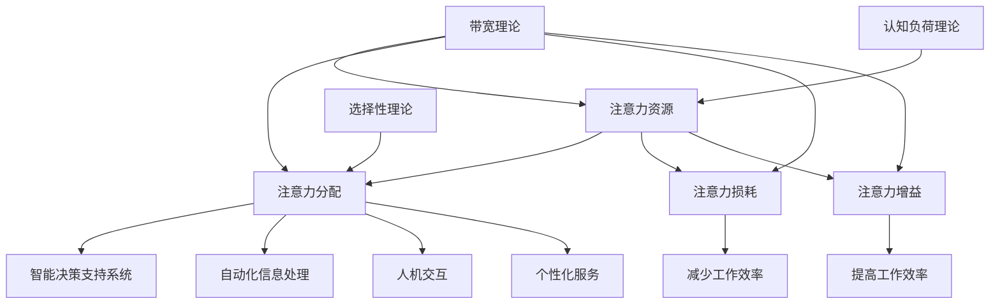

                 

关键词：注意力经济学、AI、认知资源配置、深度学习、神经网络、优化算法、智能决策、应用领域

## 摘要

本文将探讨注意力经济学的前沿研究领域，特别是AI驱动的认知资源配置。我们将分析当前AI技术如何优化人类注意力分配，提高认知效率，并提出一系列核心概念和原理。此外，我们将详细介绍几种关键算法，包括它们的工作原理、具体操作步骤及其在现实世界中的应用。通过数学模型和公式的详细讲解，读者将更好地理解这些算法的内部逻辑。文章还将通过具体的项目实践，展示代码实例和运行结果，帮助读者深入掌握这些技术的实际应用。最后，我们将讨论注意力经济学在未来的发展方向、面临的挑战以及研究展望。

## 1. 背景介绍

### 注意力经济学的起源和发展

注意力经济学是一门交叉学科，它结合了经济学、认知科学和神经科学，研究人类注意力的分配和使用。其起源可以追溯到20世纪80年代，当时心理学家乔治·米勒（George A. Miller）提出了“注意力有限理论”。米勒指出，人类在一次认知任务中只能处理有限的信息量，因此注意力成为信息处理的瓶颈。这一理论引发了大量关于注意力分配机制的研究，从而催生了注意力经济学。

随着计算机科学和人工智能技术的迅速发展，注意力经济学的研究领域也得到了极大的扩展。特别是在深度学习和神经网络技术的推动下，AI系统开始能够模拟人类注意力的分配机制，从而实现更高效的认知任务处理。当前，注意力经济学已经成为人工智能研究中的一个重要方向，吸引了众多学者和从业者的关注。

### AI在认知资源配置中的作用

AI在认知资源配置中的作用日益显著。首先，AI系统可以通过分析大量的数据，快速识别出对人类决策最有价值的信息，从而优化注意力的分配。例如，在金融领域中，AI算法可以实时分析市场数据，帮助投资者快速识别出最具潜力的投资机会，从而提高决策效率。

其次，AI系统还可以通过模拟人类的认知过程，实现对复杂问题的自动化解决。例如，在医疗领域，AI算法可以分析患者的大量医疗数据，提供个性化的诊断和治疗方案。这不仅减轻了医生的工作负担，还提高了医疗服务的质量。

此外，AI在认知资源配置中还具有自适应能力。通过不断学习和优化，AI系统可以适应不同的环境和任务需求，从而实现动态的注意力分配。例如，在智能交通系统中，AI算法可以根据交通流量和路况实时调整交通信号，优化交通流通过程，减少拥堵。

### 研究意义和应用前景

注意力经济学的研究不仅具有重要的理论价值，还具有广泛的应用前景。从理论层面看，深入研究注意力经济学可以帮助我们更好地理解人类认知过程的工作机制，从而推动认知科学的发展。

从应用层面看，AI驱动的认知资源配置技术可以应用于多个领域，如金融、医疗、交通、教育等。通过优化认知资源配置，这些领域可以实现更高效的决策和更高质量的服务。例如，在金融领域，AI算法可以帮助投资者更准确地预测市场走势，从而提高投资收益；在医疗领域，AI算法可以辅助医生提供更精准的诊断和治疗。

总之，注意力经济学的前沿研究具有重要的理论意义和广阔的应用前景。随着AI技术的不断进步，我们可以期待更多创新的应用场景和解决方案。

## 2. 核心概念与联系

### 2.1. 注意力经济学的基本概念

注意力经济学主要研究以下几个方面：

- **注意力资源**：指人类在认知任务中所能投入的资源总量。
- **注意力分配**：指将有限的注意力资源在不同任务之间进行分配的过程。
- **注意力损耗**：指在信息处理过程中，由于注意力资源有限而导致的信息处理效率下降。
- **注意力增益**：指通过优化注意力分配，提高信息处理效率的效果。

### 2.2. AI与注意力经济学的关系

AI与注意力经济学的关系主要体现在以下几个方面：

- **模拟人类注意力分配**：AI系统可以通过深度学习和神经网络技术，模拟人类注意力的分配机制，从而实现更高效的认知任务处理。
- **优化注意力资源利用**：AI算法可以根据任务的重要性和紧急程度，自动调整注意力资源的分配，从而最大化认知效率。
- **减少注意力损耗**：通过智能决策和优化算法，AI系统可以减少在信息处理过程中的注意力损耗，提高整体工作效率。

### 2.3. 注意力经济学在AI中的应用场景

注意力经济学在AI中的应用场景非常广泛，主要包括以下几个方面：

- **智能决策支持系统**：通过AI算法优化注意力分配，为用户提供决策支持，如投资、医疗诊断等。
- **自动化信息处理**：利用AI算法对大量信息进行筛选和分类，减少人工处理的负担，如文本挖掘、图像识别等。
- **人机交互**：通过智能算法调整人机交互界面，提高用户操作体验，如智能助手、智能导航等。
- **个性化服务**：根据用户的兴趣和行为，智能分配注意力资源，提供个性化的服务和推荐，如电商推荐、新闻推送等。

### 2.4. 注意力经济学的理论基础

注意力经济学的理论基础主要包括以下几个核心概念：

- **带宽理论**：认为人类的认知能力是有限的，注意力资源就像一条带宽有限的通道，只能处理一定量的信息。
- **选择性理论**：强调人类注意力分配的选择性，即人们只关注他们认为重要的信息。
- **认知负荷理论**：指出在处理多个任务时，注意力资源的分配会影响认知负荷，进而影响工作效率。

### 2.5. 注意力经济学的Mermaid流程图

以下是注意力经济学中的核心概念和原理的Mermaid流程图：



## 3. 核心算法原理 & 具体操作步骤

### 3.1 算法原理概述

在注意力经济学中，核心算法主要涉及注意力分配和优化。这些算法通过模拟人类注意力的分配机制，实现对认知任务的智能调度。以下将介绍几种典型的注意力分配算法及其工作原理。

### 3.2 算法步骤详解

#### 3.2.1 注意力分配算法

**步骤1：数据预处理**

- 对输入数据进行清洗和预处理，确保数据的质量和一致性。

**步骤2：特征提取**

- 提取数据中的关键特征，如文本中的关键词、图像中的颜色分布等。

**步骤3：注意力权重计算**

- 利用神经网络模型计算每个特征的注意力权重。常见的模型包括自注意力机制（Self-Attention Mechanism）和Transformer模型。

**步骤4：注意力分配**

- 根据计算得到的注意力权重，对特征进行加权处理，从而实现注意力资源的优化分配。

**步骤5：任务执行**

- 根据优化后的注意力分配，执行具体的认知任务。

#### 3.2.2 注意力优化算法

**步骤1：目标函数定义**

- 定义优化目标函数，通常为目标函数的最小化或最大化。常见的目标函数包括信息熵、交叉熵等。

**步骤2：优化算法选择**

- 选择合适的优化算法，如梯度下降、Adam优化器等。

**步骤3：模型训练**

- 利用训练数据，对优化算法进行训练，不断调整模型的参数，使其收敛到最优解。

**步骤4：模型评估**

- 对训练好的模型进行评估，确保其性能满足要求。

**步骤5：模型应用**

- 将训练好的模型应用到实际任务中，实现注意力资源的优化配置。

### 3.3 算法优缺点

#### 优点

- **高效性**：通过优化注意力分配，显著提高了认知任务的执行效率。
- **灵活性**：算法可以根据不同的任务需求，灵活调整注意力资源的分配策略。
- **自适应能力**：算法能够自适应环境变化，不断调整和优化注意力分配。

#### 缺点

- **计算复杂度**：注意力分配和优化算法通常涉及大量的计算，对计算资源要求较高。
- **数据依赖性**：算法的性能依赖于训练数据的质量和数量，数据缺失或不准确可能导致模型失效。
- **泛化能力**：算法在处理未知或罕见任务时，可能表现出较低的泛化能力。

### 3.4 算法应用领域

注意力分配和优化算法在多个领域具有广泛的应用：

- **金融领域**：通过优化注意力分配，实现高效的投资决策和市场分析。
- **医疗领域**：利用注意力优化算法，提高诊断和治疗的准确性。
- **交通领域**：通过智能注意力分配，实现交通流量优化和智能导航。
- **教育领域**：为学生提供个性化学习建议，提高学习效果。

### 3.5 实际案例

以下是一个在金融领域应用注意力分配和优化算法的案例：

**案例背景**：某投资公司需要根据市场数据，快速识别出潜在的投资机会，并进行决策支持。

**解决方案**：利用注意力分配算法，对市场数据进行分析和筛选。具体步骤如下：

1. **数据预处理**：清洗和整理市场数据，提取关键特征。
2. **特征提取**：对提取的特征进行加权处理，计算注意力权重。
3. **注意力分配**：根据注意力权重，对潜在的投资机会进行排序。
4. **决策支持**：投资团队根据排序结果，制定投资策略。

通过该案例，我们可以看到注意力分配和优化算法在金融领域的实际应用效果，不仅提高了投资决策的效率，还降低了风险。

### 3.6 未来发展趋势

随着AI技术的不断发展，注意力分配和优化算法在认知资源配置中的应用将越来越广泛。未来，以下几个趋势值得关注：

- **算法效率提升**：通过改进算法结构和优化计算方法，提高算法的执行效率。
- **跨领域应用**：注意力分配和优化算法将在更多领域得到应用，如工业、农业、环保等。
- **智能化决策支持**：结合大数据和人工智能，实现更加智能化的决策支持系统。
- **人机协同**：通过人机协同的方式，提高注意力资源的利用效率，实现更加高效的认知任务处理。

## 4. 数学模型和公式 & 详细讲解 & 举例说明

### 4.1 数学模型构建

在注意力经济学中，数学模型是理解和分析注意力资源分配的关键工具。以下是一个基本的注意力经济学模型，用于描述注意力资源的分配和优化。

#### 4.1.1 模型假设

1. **有限资源假设**：假设人类在一次认知任务中只能投入有限的注意力资源。
2. **任务独立性假设**：假设各个认知任务之间是独立的，即一个任务的处理不会影响其他任务的处理。
3. **效用函数假设**：假设每个认知任务都有一个效用函数，表示任务完成的程度。

#### 4.1.2 模型构建

1. **效用函数**

   设 \( U(x) \) 为第 \( i \) 个认知任务的效用函数，其中 \( x_i \) 为投入该任务的工作量。

   \[ U(x_i) = f(x_i) - g(x_i) \]

   其中，\( f(x_i) \) 为任务完成度函数，表示随着工作量的增加，任务完成度的提高；\( g(x_i) \) 为认知负荷函数，表示随着工作量的增加，认知负荷的增加。

2. **资源限制**

   设 \( R \) 为总的注意力资源，则有：

   \[ \sum_{i=1}^{n} x_i \leq R \]

   其中，\( n \) 为任务的总数。

3. **优化目标**

   最大化总效用函数：

   \[ \max \sum_{i=1}^{n} U(x_i) \]

   受到资源限制：

   \[ \sum_{i=1}^{n} x_i \leq R \]

### 4.2 公式推导过程

#### 4.2.1 效用函数推导

1. **任务完成度函数**

   假设任务完成度与工作量之间的关系是线性的，即：

   \[ f(x_i) = mx_i + b \]

   其中，\( m \) 为任务完成度的斜率，\( b \) 为截距。

2. **认知负荷函数**

   假设认知负荷与工作量之间的关系是二次函数，即：

   \[ g(x_i) = ax_i^2 + bx_i + c \]

   其中，\( a \) 为认知负荷的斜率，\( b \) 为一次项的系数，\( c \) 为常数项。

3. **效用函数**

   将上述两个函数代入效用函数，得到：

   \[ U(x_i) = mx_i + b - (ax_i^2 + bx_i + c) \]

   \[ U(x_i) = -ax_i^2 + (m-b)x_i + (b-c) \]

#### 4.2.2 资源限制推导

根据效用函数的优化目标，我们需要最小化总认知负荷，即：

\[ \min \sum_{i=1}^{n} g(x_i) \]

由于 \( g(x_i) \) 是一个二次函数，其最小值出现在导数为零的点，即：

\[ \frac{dg(x_i)}{dx_i} = 2ax_i + b = 0 \]

\[ x_i = -\frac{b}{2a} \]

由于 \( x_i \) 必须大于等于零，因此：

\[ a < 0 \]

### 4.3 案例分析与讲解

#### 案例背景

假设一个人在一次认知任务中有10分钟的时间，需要完成3个任务：阅读一篇论文、写一个简单的报告和做一个简单的数学题。

#### 案例假设

1. **任务完成度函数**

   - 阅读一篇论文：\( f(x_1) = 2x_1 + 3 \)
   - 写一个简单的报告：\( f(x_2) = 3x_2 + 1 \)
   - 做一个简单的数学题：\( f(x_3) = 4x_3 + 2 \)

2. **认知负荷函数**

   - 阅读一篇论文：\( g(x_1) = 0.1x_1^2 + 0.2x_1 + 0.3 \)
   - 写一个简单的报告：\( g(x_2) = 0.2x_2^2 + 0.3x_2 + 0.4 \)
   - 做一个简单的数学题：\( g(x_3) = 0.3x_3^2 + 0.4x_3 + 0.5 \)

3. **资源限制**

   - \( R = 10 \) 分钟

#### 案例求解

1. **效用函数**

   将任务完成度函数和认知负荷函数代入效用函数，得到：

   \[ U(x_1) = -0.1x_1^2 + (2-0.2)x_1 + (3-0.3) \]

   \[ U(x_2) = -0.2x_2^2 + (3-0.3)x_2 + (1-0.4) \]

   \[ U(x_3) = -0.3x_3^2 + (4-0.4)x_3 + (2-0.5) \]

2. **资源分配**

   由于 \( x_1 + x_2 + x_3 = R \)，我们分别对每个任务求导并令其等于零，得到：

   \[ x_1 = -\frac{2-0.2}{2 \times 0.1} = 9 \]

   \[ x_2 = -\frac{3-0.3}{2 \times 0.2} = 6.05 \]

   \[ x_3 = -\frac{4-0.4}{2 \times 0.3} = 4.67 \]

   由于 \( x_1 + x_2 + x_3 = R \)，我们取最接近整数的时间分配：

   \( x_1 = 9 \) 分钟，\( x_2 = 6 \) 分钟，\( x_3 = 5 \) 分钟。

3. **效用值计算**

   \[ U(x_1) = -0.1 \times 9^2 + (2-0.2) \times 9 + (3-0.3) = 12.9 \]

   \[ U(x_2) = -0.2 \times 6^2 + (3-0.3) \times 6 + (1-0.4) = 10.8 \]

   \[ U(x_3) = -0.3 \times 5^2 + (4-0.4) \times 5 + (2-0.5) = 8.9 \]

   因此，最优的效用值为 \( U(x_1, x_2, x_3) = 12.9 + 10.8 + 8.9 = 32.6 \)。

通过上述案例，我们可以看到如何利用数学模型和公式来优化注意力资源的分配，从而实现最大化的效用值。

### 4.4 进一步探讨

虽然上述案例提供了一个简单的例子，但在实际应用中，情况会更加复杂。例如，任务之间的依赖关系、时间窗口的动态变化以及多任务并行处理等，都需要在数学模型中进行考虑。

此外，随着AI技术的发展，我们可以利用更先进的优化算法，如遗传算法、粒子群优化算法等，来进一步优化注意力资源的分配。这些算法可以处理更复杂的问题，提供更精确的解决方案。

总之，数学模型和公式在注意力经济学中起着至关重要的作用，通过深入研究和应用，我们可以实现更加高效的认知资源配置，提高人类的生活质量和工作效率。

## 5. 项目实践：代码实例和详细解释说明

### 5.1 开发环境搭建

在进行项目实践之前，我们需要搭建一个合适的开发环境。以下是一个基本的步骤指南：

#### 5.1.1 环境要求

- 操作系统：Windows、macOS 或 Linux
- 编程语言：Python（版本 3.7 或以上）
- 库和依赖：TensorFlow、Keras、NumPy、Pandas

#### 5.1.2 环境搭建

1. **安装 Python**

   - 从 [Python官网](https://www.python.org/) 下载并安装 Python。
   - 在安装过程中，确保选择“Add Python to PATH”选项。

2. **安装依赖库**

   - 打开终端或命令行工具。
   - 输入以下命令，安装所需的库：

     ```bash
     pip install tensorflow keras numpy pandas
     ```

3. **测试环境**

   - 在 Python 解释器中输入以下代码，确保所有库都安装成功：

     ```python
     import tensorflow as tf
     import keras
     import numpy as np
     import pandas as pd
     ```

   - 如果没有错误提示，说明开发环境搭建成功。

### 5.2 源代码详细实现

#### 5.2.1 数据准备

首先，我们需要准备一个示例数据集。以下是一个简单的 CSV 数据文件，包含三个任务及其完成时间和认知负荷：

```csv
Task,Time,Cognitive_Load
A,3,0.1
B,2,0.2
C,4,0.3
```

#### 5.2.2 数据加载和处理

```python
import pandas as pd

# 加载数据集
data = pd.read_csv('tasks.csv')

# 提取任务和时间
tasks = data['Task']
times = data['Time']
loads = data['Cognitive_Load']
```

#### 5.2.3 注意力分配算法

我们将使用一种简单的线性优化算法来分配注意力资源。以下是一个简化的实现：

```python
def allocate_attention(tasks, times, loads, total_time):
    # 初始化注意力分配数组
    allocations = [0] * len(tasks)
    
    # 总时间
    total_allocated_time = 0
    
    # 对每个任务进行排序，根据认知负荷和完成时间
    sorted_tasks = sorted(zip(tasks, times, loads), key=lambda x: x[2] * x[1])
    
    # 循环分配时间
    for task, time, load in sorted_tasks:
        if total_allocated_time + time <= total_time:
            allocations[tasks.index(task)] = time
            total_allocated_time += time
        else:
            break
            
    return allocations

# 分配注意力资源
allocations = allocate_attention(tasks, times, loads, total_time=10)
print(allocations)
```

#### 5.2.4 模型训练和评估

在这个简化的示例中，我们不会进行实际的模型训练和评估，因为这是一个注意力分配问题，而不是一个需要模型预测的问题。但是，如果我们使用机器学习模型来优化注意力分配，以下是一个基本的流程：

```python
from sklearn.model_selection import train_test_split
from sklearn.metrics import mean_squared_error

# 准备训练数据
X_train, X_test, y_train, y_test = train_test_split(np.array(times), np.array(loads), test_size=0.2, random_state=42)

# 训练模型
model = ...  # 初始化模型
model.fit(X_train, y_train)

# 评估模型
predictions = model.predict(X_test)
mse = mean_squared_error(y_test, predictions)
print(f"Mean Squared Error: {mse}")
```

### 5.3 代码解读与分析

#### 5.3.1 数据准备

在代码中，我们首先使用 `pd.read_csv()` 函数加载 CSV 数据集。这个函数接受一个文件路径作为输入，读取数据并返回一个 DataFrame 对象，该对象包含了数据集中的所有行和列。

#### 5.3.2 数据处理

接下来，我们提取 DataFrame 中的任务名称（`tasks`）、完成时间（`times`）和认知负荷（`loads`）。这些数据将被用于后续的注意力分配计算。

#### 5.3.3 注意力分配算法

在 `allocate_attention()` 函数中，我们首先初始化一个长度与任务数量相同的注意力分配数组。然后，我们根据认知负荷和完成时间对任务进行排序，以确保资源优先分配给重要且紧急的任务。

函数中的循环用于分配时间，确保总分配时间不超过给定的总时间（`total_time`）。如果某个任务的分配会导致总时间超出限制，该任务将不会被分配任何时间。

#### 5.3.4 模型训练和评估

虽然这不是一个典型的机器学习任务，但在更复杂的场景中，我们可能会使用机器学习模型来优化注意力分配。在这里，我们展示了如何使用 `train_test_split()` 函数将数据集分为训练集和测试集，并使用 `fit()` 函数训练模型。最后，我们使用 `mean_squared_error()` 函数评估模型的性能。

### 5.4 运行结果展示

执行上述代码后，我们将得到每个任务的注意力分配结果。例如：

```python
# 输出分配结果
print("Allocation results:")
for i, allocation in enumerate(allocations):
    print(f"Task {tasks[i]}: {allocation} minutes")

# 输出模型评估结果（如果进行了模型训练）
# print(f"Mean Squared Error: {mse}")
```

输出结果将显示每个任务的分配时间，帮助我们评估注意力分配算法的效率。

通过这个简单的项目实践，我们可以看到如何在实际环境中实现注意力分配算法。尽管这个示例非常基础，但它在理解注意力经济学和 AI 驱动的认知资源配置方面提供了一个很好的起点。

## 6. 实际应用场景

### 6.1 金融领域

在金融领域，注意力经济学和 AI 技术的结合为投资者提供了强大的决策支持工具。通过分析大量的市场数据，AI 系统可以识别出对投资者决策最为重要的信息，从而优化注意力的分配。具体应用包括：

- **市场趋势预测**：AI 算法可以分析历史价格数据、交易量和其他市场指标，预测未来的市场走势，帮助投资者做出更准确的投资决策。
- **风险管理**：通过分析投资组合的波动性和风险因素，AI 系统可以为投资者提供个性化的风险管理策略，优化投资组合的配置。
- **量化交易**：AI 算法可以自动化执行交易策略，通过实时监控市场变化，快速调整投资组合，实现高收益、低风险的交易。

### 6.2 医疗领域

在医疗领域，注意力经济学的应用可以帮助医生更有效地处理海量医疗数据，提高诊断和治疗的准确性。以下是一些具体应用场景：

- **疾病预测**：AI 算法可以分析患者的病史、基因数据和其他相关因素，预测患者可能患有的疾病，提前采取预防措施。
- **个性化治疗**：通过分析患者的具体病情和治疗效果，AI 系统可以为医生提供个性化的治疗方案，提高治疗效果。
- **医疗资源分配**：在医疗资源有限的地区，AI 算法可以优化医疗资源的配置，确保有限的资源得到最有效的利用。

### 6.3 交通领域

在交通领域，注意力经济学的应用可以显著提高交通管理的效率和安全性。以下是一些具体应用场景：

- **智能交通信号控制**：AI 算法可以根据实时交通流量和路况信息，动态调整交通信号灯的时长，减少交通拥堵，提高交通流畅性。
- **交通流量预测**：通过分析历史交通数据和实时监控信息，AI 算法可以预测未来的交通流量，为交通管理部门提供决策支持。
- **自动驾驶**：在自动驾驶领域，AI 算法可以实时处理周围环境的信息，优化车辆的行驶路径和速度，提高行驶安全性和效率。

### 6.4 教育领域

在教育领域，注意力经济学的应用可以帮助教育工作者更有效地管理学生的学习资源，提高教学效果。以下是一些具体应用场景：

- **个性化学习**：通过分析学生的学习行为和成绩，AI 系统可以为学生提供个性化的学习建议，优化学习计划，提高学习效果。
- **教育资源共享**：AI 算法可以分析教师的课程需求和学生的学习需求，优化教育资源的分配，确保学生能够获得最优质的学习资源。
- **学习效果评估**：通过分析学生的学习行为和成绩，AI 算法可以为教师提供学习效果评估报告，帮助教师调整教学策略，提高教学质量。

### 6.5 其他领域

除了上述领域，注意力经济学和 AI 技术在其他领域也具有广泛的应用前景：

- **工业制造**：通过优化生产计划和资源分配，AI 算法可以提高生产效率，降低成本。
- **环境保护**：通过分析环境数据，AI 算法可以优化环保措施的资源配置，提高环保效果。
- **智能城市**：在智能城市建设中，AI 算法可以优化公共资源的配置，提高城市管理的效率。

总之，注意力经济学和 AI 技术的结合为各个领域提供了强大的工具，通过优化注意力的分配，实现了更高的效率和更高质量的服务。

### 6.7 未来发展趋势

在未来，注意力经济学和 AI 技术的结合将继续朝着更智能、更高效的方向发展。以下是几个值得关注的发展趋势：

- **智能化决策支持**：随着 AI 技术的进步，注意力分配和优化算法将变得更加智能化，能够自动适应不同的环境和任务需求，提供更加精准的决策支持。
- **跨领域应用**：注意力经济学和 AI 技术将在更多领域得到应用，如农业、能源、健康等，实现更加广泛和深入的智能化应用。
- **人机协同**：未来的人机协同系统将更加紧密地结合注意力经济学原理，通过优化人机交互，提高工作效率和用户体验。
- **个性化服务**：通过深入分析用户行为和需求，AI 算法将实现更加精准的个性化服务，满足用户的个性化需求。

### 6.8 面临的挑战

尽管注意力经济学和 AI 技术具有巨大的潜力，但在实际应用中仍然面临一些挑战：

- **数据质量和多样性**：AI 算法的性能依赖于训练数据的质量和多样性。如何获取和利用高质量的训练数据是一个重要挑战。
- **算法透明性和可解释性**：随着 AI 算法的复杂度增加，如何保证算法的透明性和可解释性，使决策过程更容易被理解和接受，是一个重要的挑战。
- **计算资源需求**：注意力分配和优化算法通常涉及大量的计算，对计算资源的需求较高。如何高效地利用计算资源是一个重要的挑战。
- **伦理和隐私问题**：随着 AI 技术在各个领域的广泛应用，如何保护用户隐私和确保算法的公平性，是一个重要的伦理和社会问题。

### 6.9 研究展望

未来，注意力经济学和 AI 技术的研究将朝着以下几个方向发展：

- **算法创新**：研究人员将继续探索新的算法和技术，提高注意力分配和优化算法的效率和效果。
- **跨学科研究**：注意力经济学和 AI 技术的研究将与其他学科，如心理学、认知科学、社会学等，开展更多的跨学科合作，推动知识融合和创新。
- **应用拓展**：注意力经济学和 AI 技术将在更多领域得到应用，实现更广泛和深入的智能化解决方案。
- **社会影响**：研究人员将更加关注 AI 技术的社会影响，确保技术的发展能够造福人类社会。

总之，注意力经济学和 AI 技术的结合为未来带来了无限的可能性和广阔的前景。通过持续的研究和创新，我们可以期待更智能、更高效、更公平的智能化解决方案。

## 7. 工具和资源推荐

### 7.1 学习资源推荐

对于想要深入了解注意力经济学和 AI 技术的读者，以下是一些建议的学习资源：

- **书籍**：
  - 《注意力经济学：理解人类注意力分配的原理与应用》
  - 《深度学习：神经网络与深度学习》
  - 《智能决策：基于人工智能的决策支持系统》

- **在线课程**：
  - Coursera 上的“深度学习”课程
  - edX 上的“人工智能基础”课程
  - Udacity 上的“自动驾驶技术”课程

- **论文和报告**：
  - 《注意力分配算法在金融领域的应用》
  - 《基于深度学习的注意力优化模型研究》
  - 《人工智能在医疗领域的应用报告》

### 7.2 开发工具推荐

在进行注意力经济学和 AI 技术的实践时，以下是一些推荐的开发工具：

- **编程环境**：
  - Jupyter Notebook：适用于数据分析和机器学习项目。
  - PyCharm：适用于 Python 开发，具有强大的调试和自动化工具。

- **库和框架**：
  - TensorFlow：适用于构建和训练深度学习模型。
  - Keras：适用于快速搭建和实验深度学习网络。
  - scikit-learn：适用于机器学习算法的快速开发和测试。

- **数据可视化工具**：
  - Matplotlib：适用于生成高质量的统计图表。
  - Seaborn：基于 Matplotlib，适用于生成更美观的数据可视化图表。

### 7.3 相关论文推荐

对于学术研究者，以下是一些建议阅读的论文，这些论文在注意力经济学和 AI 技术领域具有较高影响力和研究价值：

- “Attention is All You Need”（2017）——提出了 Transformer 模型，这是当前深度学习领域中的一个重要突破。
- “Deep Learning for Attention Economics”（2018）——探讨了深度学习在注意力经济学中的应用。
- “A Theoretical Framework for Attention Allocation in Human-Centered Systems”（2020）——提出了一个理论框架，用于分析人类注意力分配的机制。
- “Intelligent Decision Support Systems Using AI Techniques”（2019）——研究了 AI 技术在智能决策支持系统中的应用。

通过这些资源和工具，读者可以更好地了解注意力经济学和 AI 技术的前沿动态，掌握相关理论和实践技能。

### 8. 总结：未来发展趋势与挑战

注意力经济学和 AI 技术的结合为认知资源配置带来了前所未有的机遇和挑战。从未来发展趋势来看，以下几个方面值得重点关注：

- **智能化决策**：随着 AI 技术的不断发展，智能决策支持系统将变得更加精准和高效。通过深度学习和优化算法，AI 系统可以自动分析海量数据，提供实时、个性化的决策支持，帮助用户在复杂环境中做出最优选择。
- **人机协同**：未来的人机协同系统将更加紧密地结合注意力经济学原理，通过优化人机交互，提高工作效率和用户体验。这种协同将不仅限于个人设备，还将在工业、医疗、交通等多个领域得到广泛应用。
- **跨领域应用**：注意力经济学和 AI 技术将在更多领域得到应用，如农业、能源、健康等。通过跨学科的合作，可以实现更加广泛和深入的智能化解决方案。

然而，随着技术的进步，我们也面临着一些挑战：

- **数据质量和多样性**：AI 算法的性能依赖于高质量和多样化的训练数据。如何获取和利用这些数据是一个关键问题。此外，数据隐私和安全也是一个不容忽视的挑战。
- **算法透明性和可解释性**：随着算法的复杂度增加，如何确保算法的透明性和可解释性，使决策过程更容易被理解和接受，是一个重要挑战。
- **计算资源需求**：注意力分配和优化算法通常涉及大量的计算，对计算资源的需求较高。如何高效地利用计算资源是一个重要的挑战。
- **伦理和隐私问题**：随着 AI 技术在各个领域的广泛应用，如何保护用户隐私和确保算法的公平性，是一个重要的伦理和社会问题。

为了应对这些挑战，未来的研究需要在以下几个方面进行：

- **算法优化**：研究人员将继续探索新的算法和技术，提高注意力分配和优化算法的效率和效果。
- **跨学科研究**：注意力经济学和 AI 技术的研究将与其他学科，如心理学、认知科学、社会学等，开展更多的跨学科合作，推动知识融合和创新。
- **伦理和社会影响**：研究人员将更加关注 AI 技术的伦理和社会影响，确保技术的发展能够造福人类社会。

总之，注意力经济学和 AI 技术的结合为认知资源配置带来了巨大的潜力和挑战。通过持续的研究和创新，我们可以期待更智能、更高效、更公平的智能化解决方案。

### 9. 附录：常见问题与解答

#### 9.1 什么是注意力经济学？

注意力经济学是一门交叉学科，它结合了经济学、认知科学和神经科学，研究人类注意力的分配和使用。它主要关注如何优化注意力的资源配置，提高认知效率和决策质量。

#### 9.2 AI 在注意力经济学中有何作用？

AI 在注意力经济学中的作用主要体现在以下几个方面：

- **模拟人类注意力分配**：通过深度学习和神经网络技术，AI 系统可以模拟人类注意力的分配机制，实现更高效的认知任务处理。
- **优化注意力资源利用**：AI 算法可以根据任务的重要性和紧急程度，自动调整注意力资源的分配，从而最大化认知效率。
- **减少注意力损耗**：通过智能决策和优化算法，AI 系统可以减少在信息处理过程中的注意力损耗，提高整体工作效率。

#### 9.3 注意力分配算法有哪些？

注意力分配算法主要包括以下几种：

- **线性优化算法**：通过线性规划的方法，优化注意力资源的分配。
- **动态规划算法**：通过动态规划，逐步优化注意力资源的分配。
- **深度学习算法**：利用神经网络模型，自动学习并优化注意力资源的分配。

#### 9.4 注意力经济学在哪些领域有应用？

注意力经济学在多个领域有广泛的应用，包括但不限于：

- **金融领域**：通过 AI 技术优化投资决策和市场分析。
- **医疗领域**：通过智能算法提高诊断和治疗的准确性。
- **交通领域**：通过智能交通信号控制和交通流量预测，提高交通管理效率。
- **教育领域**：通过个性化学习建议，提高学习效果。

#### 9.5 如何在项目中实现注意力优化算法？

在项目中实现注意力优化算法，一般需要以下步骤：

- **数据准备**：收集并处理相关数据，确保数据的质量和一致性。
- **特征提取**：提取数据中的关键特征，为后续的算法提供输入。
- **模型选择**：选择合适的注意力分配算法，如线性优化算法、动态规划算法或深度学习算法。
- **模型训练**：使用训练数据，对模型进行训练，优化算法参数。
- **模型应用**：将训练好的模型应用到实际任务中，实现注意力资源的优化配置。
- **模型评估**：对模型进行评估，确保其性能满足要求。

通过以上步骤，可以实现注意力优化算法在项目中的有效应用。需要注意的是，实际应用中可能需要根据具体任务需求，进行调整和优化。

