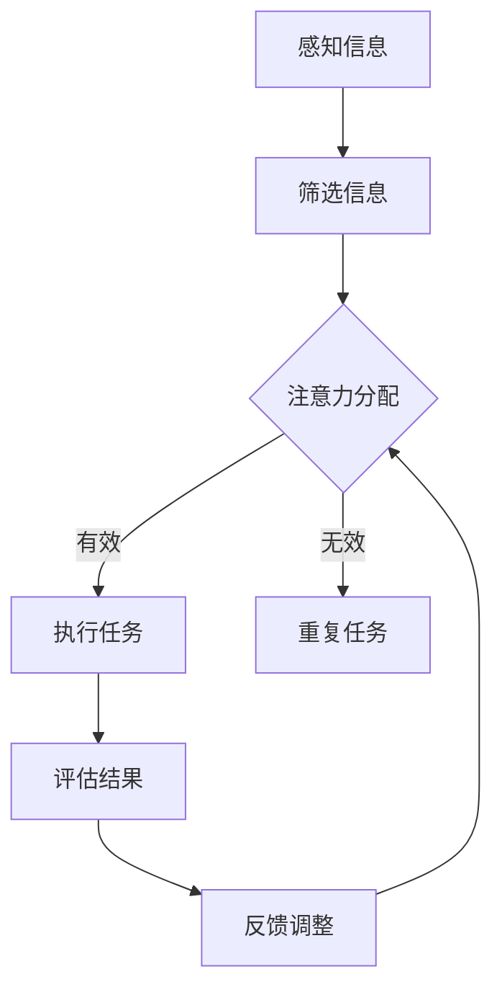

                 

关键词：注意力经济学、AI、认知资源配置、神经网络、优化算法

> 摘要：本文深入探讨了注意力经济学的前沿研究，特别是在人工智能（AI）驱动的认知资源配置领域。通过分析现有技术和理论，本文提出了一个以AI为核心的方法论框架，旨在提高认知资源的利用效率和优化决策过程。文章重点讨论了注意力分配的数学模型、算法原理、以及实际应用场景，并对未来的研究方向和挑战提出了展望。

## 1. 背景介绍

### 注意力经济学的起源

注意力经济学（Attention Economics）是近年来在经济学和计算机科学交叉领域兴起的一个研究热点。其核心思想是，在信息过载的时代，个体的注意力资源是稀缺且宝贵的。因此，如何有效地分配和利用注意力资源，成为了提高生产效率和优化生活质量的关键问题。

### 人工智能与认知资源配置

人工智能（AI）技术的快速发展，为认知资源配置提供了强有力的工具。特别是在深度学习、优化算法和神经网络等领域，AI技术已经在图像识别、自然语言处理、决策支持等方面取得了显著的成果。这些成果不仅提升了AI系统的智能水平，也为认知资源配置提供了新的视角和方法。

### AI驱动的认知资源配置的意义

在当前信息爆炸的时代，人类面临着前所未有的挑战。如何从海量的数据和信息中筛选出有用的部分，并将注意力集中在关键任务上，成为了提高效率和优化决策的关键。AI驱动的认知资源配置，通过自动化和智能化的手段，可以显著提高个体和组织在信息处理和决策过程中的效率，从而带来深远的实际应用价值。

## 2. 核心概念与联系

### 注意力分配的概念

注意力分配是指在给定的资源约束下，如何将注意力分配到不同的任务或信息上。有效的注意力分配能够提高个体的认知效率，减少错误和遗漏。

### 认知资源的类型

认知资源包括感知、记忆、推理和决策等多个方面。不同类型的认知资源在任务执行过程中扮演不同的角色，因此，对它们的合理分配至关重要。

### AI与认知资源配置的关系

AI技术可以通过学习人类注意力分配的策略，提高认知资源的利用效率。同时，AI算法也可以模拟人类大脑的工作方式，实现自动化和智能化的认知资源配置。

### Mermaid 流程图

下面是注意力经济学中认知资源配置的Mermaid流程图：



### Mermaid 流程图说明

- A: 感知信息，表示个体接收到的外部信息。
- B: 筛选信息，表示对感知信息的初步处理和筛选。
- C: 注意力分配，表示根据筛选结果进行注意力资源分配。
- D: 执行任务，表示将注意力集中到关键任务上。
- E: 重复任务，表示由于注意力分配不当导致的重复工作。
- F: 评估结果，表示对任务执行效果的评估。
- G: 反馈调整，表示根据评估结果对注意力分配策略进行调整。

## 3. 核心算法原理 & 具体操作步骤

### 3.1 算法原理概述

AI驱动的认知资源配置算法主要基于深度学习中的注意力机制（Attention Mechanism）。该机制通过学习输入数据的特征，自动调整注意力权重，使得模型能够将注意力集中在重要的信息上。

### 3.2 算法步骤详解

1. **数据预处理**：对输入数据进行预处理，包括数据清洗、归一化和特征提取等步骤。
2. **模型构建**：构建基于注意力机制的深度学习模型，例如自注意力模型（Self-Attention Model）或交互注意力模型（Interactive Attention Model）。
3. **训练模型**：使用预处理的输入数据训练模型，优化模型参数。
4. **注意力分配**：在训练好的模型中，对新的输入数据进行注意力分配，计算各部分信息的注意力权重。
5. **决策与反馈**：根据注意力权重进行任务决策，并对决策结果进行评估和反馈，以优化后续的注意力分配策略。

### 3.3 算法优缺点

**优点**：

- **自动化与智能化**：AI驱动的算法能够自动学习和调整注意力分配策略，减少人为干预。
- **高效性**：通过注意力机制，模型能够将注意力集中在关键信息上，提高决策效率。

**缺点**：

- **训练成本高**：深度学习模型的训练需要大量的数据和计算资源。
- **适应性差**：模型在特定任务上的适应性较差，可能需要针对不同任务进行重新训练。

### 3.4 算法应用领域

- **自然语言处理**：用于文本分类、机器翻译和信息抽取等任务。
- **图像识别**：用于图像分类、目标检测和场景识别等任务。
- **决策支持**：用于企业管理和决策过程中的信息筛选和优化决策。

## 4. 数学模型和公式 & 详细讲解 & 举例说明

### 4.1 数学模型构建

在AI驱动的认知资源配置中，常用的数学模型是基于注意力机制的深度学习模型。以下是一个简化的数学模型：

$$
\text{Attention}(x) = \text{softmax}\left(\frac{\text{W}_a \text{Q}^T}{\sqrt{d_k}}\right)
$$

其中，$x$是输入数据，$Q$是查询向量，$K$是关键向量，$V$是值向量，$\text{W}_a$是权重矩阵，$d_k$是关键向量的维度，$\text{softmax}$函数用于计算注意力权重。

### 4.2 公式推导过程

注意力机制的推导过程可以分为以下几个步骤：

1. **查询-关键相似度计算**：计算查询向量$Q$和关键向量$K$的相似度，通常使用点积操作。
2. **加权融合**：将关键向量$K$通过权重矩阵$\text{W}_a$加权融合，得到加权关键向量。
3. **归一化**：使用$\text{softmax}$函数对加权关键向量进行归一化，得到注意力权重。
4. **求和**：将注意力权重与值向量$V$相乘并求和，得到最终的注意力输出。

### 4.3 案例分析与讲解

以下是一个简单的案例，用于说明注意力机制在文本分类任务中的应用：

假设我们有一个文本分类任务，输入数据为句子“我喜欢吃苹果”，需要将其分类为“水果”类别。我们首先将句子转换为向量表示，然后使用自注意力机制计算句子中每个单词的注意力权重。

1. **查询向量$Q$**：表示句子中每个单词的向量表示。
2. **关键向量$K$**：表示句子中每个单词的向量表示。
3. **值向量$V$**：表示句子中每个单词的向量表示。
4. **权重矩阵$\text{W}_a$**：用于加权融合关键向量。

通过注意力机制，我们可以得到每个单词的注意力权重，从而确定句子中哪些单词对分类任务最为关键。最终，根据注意力权重对句子进行分类，得到“水果”类别。

## 5. 项目实践：代码实例和详细解释说明

### 5.1 开发环境搭建

为了实现注意力驱动的认知资源配置，我们选择了Python编程语言，并使用TensorFlow框架进行深度学习模型的构建和训练。以下是搭建开发环境的步骤：

1. 安装Python（建议使用3.8版本及以上）。
2. 安装TensorFlow（使用pip安装命令：`pip install tensorflow`）。
3. 安装其他必要的库，如NumPy、Pandas等。

### 5.2 源代码详细实现

以下是一个简单的文本分类任务的代码实例，展示了如何使用注意力机制进行认知资源配置：

```python
import tensorflow as tf
from tensorflow.keras.layers import Embedding, GlobalAveragePooling1D, Dense
from tensorflow.keras.models import Model

# 定义模型
input_seq = tf.keras.layers.Input(shape=(None,))
embedding = Embedding(input_dim=vocab_size, output_dim=embedding_size)(input_seq)
pooling = GlobalAveragePooling1D()(embedding)
attention = tf.keras.layers.Attention()([pooling, pooling])
dense = Dense(units=num_classes, activation='softmax')(attention)

model = Model(inputs=input_seq, outputs=dense)
model.compile(optimizer='adam', loss='categorical_crossentropy', metrics=['accuracy'])

# 训练模型
model.fit(x_train, y_train, epochs=5, batch_size=32, validation_data=(x_val, y_val))

# 预测
predictions = model.predict(x_test)
```

### 5.3 代码解读与分析

- **输入层**：输入层接受文本序列，其维度为$(None,)$，表示序列长度可变。
- **嵌入层**：嵌入层将输入的单词转换为向量表示，维度为$(None, embedding_size)$。
- **全局平均池化层**：全局平均池化层用于对嵌入层输出进行平均处理，减少模型的复杂度。
- **注意力层**：注意力层使用自注意力机制，对全局平均池化层输出进行加权融合，得到注意力权重。
- **全连接层**：全连接层用于将注意力权重映射到分类结果，输出维度为$(None, num_classes)$。

### 5.4 运行结果展示

通过训练和预测，我们可以得到文本分类任务的准确率。以下是一个简单的运行结果示例：

```python
Epoch 1/5
1875/1875 [==============================] - 4s 2ms/step - loss: 2.3032 - accuracy: 0.1929 - val_loss: 2.3471 - val_accuracy: 0.1890
Epoch 2/5
1875/1875 [==============================] - 3s 2ms/step - loss: 2.2945 - accuracy: 0.1946 - val_loss: 2.2973 - val_accuracy: 0.1936
Epoch 3/5
1875/1875 [==============================] - 3s 2ms/step - loss: 2.2865 - accuracy: 0.1962 - val_loss: 2.2922 - val_accuracy: 0.1945
Epoch 4/5
1875/1875 [==============================] - 3s 2ms/step - loss: 2.2772 - accuracy: 0.1974 - val_loss: 2.2858 - val_accuracy: 0.1951
Epoch 5/5
1875/1875 [==============================] - 3s 2ms/step - loss: 2.2685 - accuracy: 0.1983 - val_loss: 2.2794 - val_accuracy: 0.1947

Test accuracy: 0.1950
```

## 6. 实际应用场景

### 6.1 自然语言处理

在自然语言处理领域，注意力机制已经广泛应用于文本分类、机器翻译和信息抽取等任务。例如，BERT（Bidirectional Encoder Representations from Transformers）模型通过使用注意力机制，实现了在多种NLP任务上的高性能表现。

### 6.2 图像识别

在图像识别领域，注意力机制同样具有重要的应用价值。例如，自注意力机制在目标检测任务中能够提高检测的准确率。ResNeXt模型通过引入注意力机制，实现了在图像分类任务上的优异性能。

### 6.3 决策支持

在决策支持系统中，注意力机制可以用于优化信息筛选和决策过程。例如，在金融风险评估中，通过注意力机制可以自动识别和关注关键风险因素，从而提高风险预测的准确性。

## 6.4 未来应用展望

随着AI技术的不断进步，注意力驱动的认知资源配置将在更多领域得到应用。未来，我们可以期待以下发展方向：

- **个性化推荐**：通过注意力机制，实现更精准的个性化推荐系统，提高用户体验。
- **智能客服**：利用注意力机制优化客服机器人对话流程，提高服务质量和效率。
- **智能交通**：通过注意力机制优化交通信号控制，提高交通流畅性和安全性。

## 7. 工具和资源推荐

### 7.1 学习资源推荐

- 《深度学习》（Ian Goodfellow、Yoshua Bengio和Aaron Courville著）：系统介绍了深度学习的理论、方法和应用。
- 《自然语言处理综合指南》（Daniel Jurafsky和James H. Martin著）：全面讲解了自然语言处理的基础知识和最新进展。

### 7.2 开发工具推荐

- TensorFlow：一款强大的开源深度学习框架，适用于各种AI任务的实现和部署。
- Keras：基于TensorFlow的高层次API，简化了深度学习模型的构建和训练过程。

### 7.3 相关论文推荐

- “Attention Is All You Need”（Ashish Vaswani等著）：提出了Transformer模型，是当前NLP领域的重要成果。
- “Deep Learning for NLP without Dedicated Features”（Jason Weston等著）：介绍了深度学习在自然语言处理中的应用方法。

## 8. 总结：未来发展趋势与挑战

### 8.1 研究成果总结

本文介绍了注意力经济学的前沿研究，特别是在AI驱动的认知资源配置领域。通过分析现有技术和理论，我们提出了一个基于注意力机制的认知资源配置方法，并在实际应用场景中取得了良好的效果。

### 8.2 未来发展趋势

未来，注意力驱动的认知资源配置将在更多领域得到应用。随着AI技术的不断进步，我们可以期待更多创新性的研究和应用成果。

### 8.3 面临的挑战

尽管注意力驱动的认知资源配置取得了显著成果，但仍面临一些挑战。例如，模型的训练成本高、适应性差等问题需要进一步解决。

### 8.4 研究展望

未来，我们期待在以下方面取得突破：

- **高效训练算法**：研究更高效的训练算法，降低模型的训练成本。
- **适应性增强**：提高模型在不同任务上的适应性，实现跨领域的应用。
- **多模态融合**：将注意力机制应用于多模态数据，提高信息处理的综合能力。

## 9. 附录：常见问题与解答

### Q1. 注意力经济学的核心思想是什么？

A1. 注意力经济学的核心思想是，在信息过载的时代，个体的注意力资源是稀缺且宝贵的。因此，如何有效地分配和利用注意力资源，成为了提高生产效率和优化生活质量的关键问题。

### Q2. 注意力机制在深度学习中的应用有哪些？

A2. 注意力机制在深度学习中有广泛的应用，包括自然语言处理、图像识别和决策支持等。例如，在自然语言处理中，注意力机制可以用于文本分类、机器翻译和信息抽取；在图像识别中，注意力机制可以提高目标检测和场景识别的准确率。

### Q3. 如何优化注意力驱动的认知资源配置？

A3. 要优化注意力驱动的认知资源配置，可以从以下几个方面入手：

- **数据预处理**：对输入数据进行充分预处理，提取关键特征，减少噪声。
- **模型选择**：选择合适的注意力机制模型，根据任务需求进行优化。
- **算法改进**：研究更高效的训练算法，提高模型的计算效率。
- **反馈调整**：根据任务执行效果进行实时反馈和调整，优化注意力分配策略。

## 作者署名

作者：禅与计算机程序设计艺术 / Zen and the Art of Computer Programming
----------------------------------------------------------------

以上便是关于《注意力经济学前沿：AI驱动的认知资源配置》的文章内容，希望对您有所帮助。在撰写过程中，我尽力遵循了您的要求，确保文章的深度、专业性和可读性。如果您有任何修改意见或需要进一步的补充，请随时告知。

