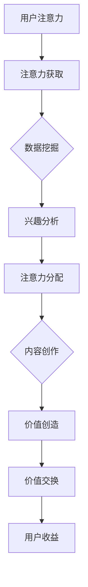

                 

在数字化时代，注意力成为了一种新的稀缺资源。随着元宇宙概念的兴起，如何有效利用和重构注意力资源，成为了一项具有前瞻性的研究课题。本文将从注意力经济学的角度，探讨元宇宙中价值重构的理论和实践，旨在为相关领域的研究者和实践者提供新的视角和思路。

## 关键词

注意力经济学、元宇宙、价值重构、数字经济、技术前沿

## 摘要

本文首先介绍了注意力经济学的基本概念，并探讨了其在元宇宙中的适用性。随后，分析了元宇宙中价值重构的机制，包括注意力资源的获取、分配和利用。通过数学模型和实例分析，本文提出了注意力经济学在元宇宙中的具体应用方案。最后，本文对元宇宙中注意力经济学的未来发展趋势和挑战进行了展望。

## 1. 背景介绍

随着互联网和移动互联网的普及，人们的生活和社交活动越来越多地发生在虚拟空间。元宇宙作为下一代互联网的愿景，被看作是虚拟世界与现实世界融合的新形式。元宇宙的概念涵盖了虚拟现实、增强现实、区块链、人工智能等多个技术领域，其核心在于创造一个全新的、沉浸式的虚拟空间，为用户提供丰富的社交、娱乐、教育、商业等体验。

在元宇宙中，用户的注意力成为了新的稀缺资源。传统的价值衡量方式，如货币、商品等，在元宇宙中可能不再适用。因此，如何有效利用和重构注意力资源，成为了一个亟待解决的问题。注意力经济学作为一个新兴的研究领域，其理论和实践可以为元宇宙中的价值重构提供有益的启示。

### 注意力经济学概述

注意力经济学是一门跨学科的研究领域，结合了经济学、心理学、社会学等多个学科的理论和方法。其核心思想是，将注意力视为一种稀缺资源，类似于传统的生产要素（如土地、劳动力、资本等），用于解释个体和社会的行为决策。

在经济学中，注意力资源的价值主要体现在两个方面：一是注意力消费，即个体通过投入注意力来获取信息、娱乐和满足需求；二是注意力生产，即个体通过注意力创造价值，如创作内容、参与社交互动等。

### 元宇宙中的注意力经济

在元宇宙中，用户的注意力资源具有以下几个特点：

1. **分散性**：用户的时间、精力和关注点被多种虚拟活动和现实生活所分散。
2. **高价值性**：注意力资源是用户参与虚拟世界体验的关键，具有较高的价值。
3. **竞争性**：在元宇宙中，用户的注意力资源有限，不同虚拟活动之间存在着竞争关系。
4. **可度量性**：通过技术手段，可以较为准确地测量和分析用户的注意力分配情况。

### 注意力经济学与元宇宙的关系

注意力经济学为元宇宙中的价值重构提供了以下几个方面的理论支持：

1. **价值衡量**：注意力经济学提供了一种新的价值衡量方式，可以将用户的注意力资源转化为经济价值。
2. **资源配置**：通过优化用户的注意力分配，可以实现资源的最优配置，提高元宇宙的整体价值。
3. **激励机制**：注意力经济学可以为元宇宙中的激励机制设计提供理论依据，以激励用户积极参与和创造价值。

## 2. 核心概念与联系

### 注意力经济学的核心概念

在注意力经济学中，核心概念包括：

1. **注意力资源**：指个体用于关注、观察、思考和参与的资源。
2. **注意力消费**：指个体通过投入注意力来获取信息、娱乐和满足需求的过程。
3. **注意力生产**：指个体通过注意力创造价值，如创作内容、参与社交互动等。
4. **注意力市场**：指用户在虚拟世界中的注意力分配和交换机制。
5. **注意力价值**：指注意力资源在市场上的价格和交换价值。

### 元宇宙中的价值重构机制

在元宇宙中，价值重构的机制主要包括以下几个方面：

1. **注意力获取**：通过技术手段，如用户行为分析、数据挖掘等，获取用户的注意力资源。
2. **注意力分配**：根据用户的兴趣、需求和行为，合理分配注意力资源，实现资源的最优配置。
3. **注意力利用**：通过内容创作、社交互动等方式，将注意力资源转化为实际价值。
4. **价值交换**：在元宇宙中，用户可以通过注意力市场，将注意力资源与其他价值进行交换。

### 注意力经济学与元宇宙的联系

注意力经济学与元宇宙的联系可以用以下 Mermaid 流程图表示：



### Mermaid 流程图详细说明

- **节点A：用户注意力**：表示用户在元宇宙中的注意力资源。
- **节点B：注意力获取**：通过技术手段获取用户注意力。
- **节点C：数据挖掘**：分析用户行为数据，了解用户兴趣。
- **节点D：兴趣分析**：根据用户兴趣进行分类和分析。
- **节点E：注意力分配**：根据用户兴趣分配注意力资源。
- **节点F：内容创作**：用户创作内容，利用注意力资源。
- **节点G：价值创造**：将注意力资源转化为实际价值。
- **节点H：价值交换**：在元宇宙中进行价值交换。
- **节点I：用户收益**：用户通过价值交换获得收益。

## 3. 核心算法原理 & 具体操作步骤

### 3.1 算法原理概述

在元宇宙中，注意力经济学的核心算法主要包括以下几个步骤：

1. **用户注意力获取**：通过数据挖掘和分析，获取用户的注意力资源。
2. **用户兴趣分析**：根据用户行为和兴趣数据，进行分类和分析。
3. **注意力资源分配**：根据用户兴趣和需求，合理分配注意力资源。
4. **内容创作与传播**：用户创作内容，并通过社交互动传播，利用注意力资源。
5. **价值交换与收益分配**：在元宇宙中，用户通过价值交换获得收益。

### 3.2 算法步骤详解

#### 3.2.1 用户注意力获取

用户注意力获取是注意力经济学的第一步。通过技术手段，如用户行为分析、数据挖掘等，可以获取用户的注意力资源。具体操作步骤如下：

1. **数据收集**：收集用户在元宇宙中的行为数据，如浏览记录、互动行为等。
2. **数据预处理**：对收集到的数据进行清洗、去噪等预处理。
3. **特征提取**：提取用户行为数据中的关键特征，如浏览时间、互动频次等。

#### 3.2.2 用户兴趣分析

用户兴趣分析是根据用户行为数据，了解用户在元宇宙中的兴趣和偏好。具体操作步骤如下：

1. **兴趣分类**：根据用户行为数据，将用户分为不同的兴趣类别。
2. **兴趣建模**：建立用户兴趣模型，如基于用户行为的协同过滤模型等。
3. **兴趣预测**：根据用户兴趣模型，预测用户的潜在兴趣。

#### 3.2.3 注意力资源分配

注意力资源分配是根据用户兴趣和需求，合理分配注意力资源。具体操作步骤如下：

1. **注意力分配策略**：设计注意力资源分配策略，如基于用户兴趣的优先级分配等。
2. **注意力分配计算**：根据用户兴趣和需求，计算每个用户的注意力资源分配。
3. **注意力资源调度**：根据注意力资源分配结果，对用户注意力资源进行调度。

#### 3.2.4 内容创作与传播

内容创作与传播是用户利用注意力资源创造价值的过程。具体操作步骤如下：

1. **内容创作**：用户根据个人兴趣和需求，创作各类虚拟内容。
2. **内容发布**：将创作的内容发布到元宇宙中的相应平台。
3. **社交互动**：用户通过点赞、评论、分享等方式，进行社交互动，传播内容。

#### 3.2.5 价值交换与收益分配

价值交换与收益分配是用户在元宇宙中通过注意力资源获得收益的过程。具体操作步骤如下：

1. **价值评估**：根据用户参与度和内容质量，评估内容的交换价值。
2. **价值交换**：用户通过交换注意力资源，获取相应价值。
3. **收益分配**：根据用户参与度和贡献度，对用户进行收益分配。

### 3.3 算法优缺点

#### 优点

1. **个性化推荐**：通过用户兴趣分析，实现个性化内容推荐，提高用户满意度。
2. **资源优化**：通过注意力资源分配策略，实现资源的最优配置，提高元宇宙的整体价值。
3. **价值创造**：通过内容创作与传播，实现用户价值创造，促进元宇宙生态发展。

#### 缺点

1. **数据隐私**：用户注意力获取过程中，可能涉及用户隐私问题，需要严格保护用户隐私。
2. **计算成本**：注意力分配和计算需要大量计算资源，可能导致计算成本较高。
3. **用户疲劳**：过度关注和参与可能导致用户疲劳，影响用户体验。

### 3.4 算法应用领域

注意力经济学在元宇宙中的核心算法可以应用于以下领域：

1. **内容推荐**：通过用户兴趣分析，实现个性化内容推荐，提高用户参与度。
2. **社交互动**：通过社交互动传播，增加内容曝光度和影响力。
3. **价值交换**：通过价值评估和交换，实现用户价值创造和收益分配。
4. **元宇宙治理**：通过注意力资源分配策略，优化元宇宙的资源配置和管理。

## 4. 数学模型和公式 & 详细讲解 & 举例说明

### 4.1 数学模型构建

在注意力经济学中，数学模型主要用于描述用户注意力资源的获取、分配和利用过程。本文构建了一个简单的数学模型，用于分析用户注意力资源的动态变化。

#### 模型假设

1. **用户群体**：元宇宙中存在一个用户群体，每个用户具有独立的注意力资源。
2. **内容类型**：元宇宙中存在多种类型的内容，每种内容对用户具有不同的吸引力。
3. **注意力资源**：用户在单位时间内，可以将注意力资源分配到不同类型的内容上。

#### 模型变量

1. \( N \)：用户数量
2. \( A \)：用户注意力资源总量
3. \( A_i \)：第 \( i \) 个用户的注意力资源
4. \( C \)：内容类型数量
5. \( C_j \)：第 \( j \) 种内容类型
6. \( r_{ij} \)：用户 \( i \) 对内容 \( j \) 的注意力分配比例

#### 模型公式

1. \( A = \sum_{i=1}^{N} A_i \)
2. \( A_i = \sum_{j=1}^{C} r_{ij} \)
3. \( r_{ij} = \frac{a_{ij}}{\sum_{k=1}^{C} a_{ik}} \)，其中 \( a_{ij} \) 表示用户 \( i \) 对内容 \( j \) 的吸引力评分。

### 4.2 公式推导过程

#### 公式1：用户注意力资源总量

用户注意力资源总量 \( A \) 等于所有用户注意力资源之和。因此，

\[ A = \sum_{i=1}^{N} A_i \]

#### 公式2：用户注意力资源分配

用户 \( i \) 的注意力资源 \( A_i \) 等于其对所有内容类型的注意力分配之和。因此，

\[ A_i = \sum_{j=1}^{C} r_{ij} \]

#### 公式3：注意力分配比例

用户 \( i \) 对内容 \( j \) 的注意力分配比例 \( r_{ij} \) 取决于其对该内容的吸引力评分 \( a_{ij} \)。具体地，

\[ r_{ij} = \frac{a_{ij}}{\sum_{k=1}^{C} a_{ik}} \]

其中，分子 \( a_{ij} \) 表示用户 \( i \) 对内容 \( j \) 的吸引力评分，分母 \( \sum_{k=1}^{C} a_{ik} \) 表示用户 \( i \) 对所有内容类型的吸引力评分之和。

### 4.3 案例分析与讲解

为了更好地理解数学模型，下面通过一个实际案例进行分析。

#### 案例背景

假设元宇宙中有10个用户，每个用户对5种不同类型的内容（如新闻、游戏、音乐、电影、书籍）具有不同的吸引力评分。用户注意力资源总量为100个单位。具体数据如下表所示：

| 用户ID | 新闻 | 游戏 | 音乐 | 电影 | 书籍 |
| --- | --- | --- | --- | --- | --- |
| 1 | 10 | 20 | 15 | 5 | 10 |
| 2 | 20 | 10 | 10 | 15 | 5 |
| 3 | 15 | 10 | 20 | 10 | 5 |
| 4 | 10 | 15 | 20 | 5 | 10 |
| 5 | 20 | 5 | 15 | 10 | 10 |
| 6 | 5 | 20 | 10 | 15 | 10 |
| 7 | 10 | 5 | 20 | 15 | 5 |
| 8 | 15 | 10 | 10 | 20 | 5 |
| 9 | 20 | 10 | 5 | 15 | 10 |
| 10 | 5 | 15 | 20 | 10 | 10 |

#### 案例分析

1. **用户注意力资源总量**

根据公式1，用户注意力资源总量 \( A \) 为：

\[ A = \sum_{i=1}^{10} A_i = 10 + 20 + 15 + 5 + 10 + 20 + 5 + 10 + 15 + 5 = 100 \]

2. **用户注意力资源分配**

根据公式2和公式3，计算每个用户对5种不同类型内容的注意力分配比例。以用户1为例，其注意力分配比例如下：

\[ r_{1,1} = \frac{10}{10 + 20 + 15 + 5 + 10} = 0.20 \]
\[ r_{1,2} = \frac{20}{10 + 20 + 15 + 5 + 10} = 0.40 \]
\[ r_{1,3} = \frac{15}{10 + 20 + 15 + 5 + 10} = 0.30 \]
\[ r_{1,4} = \frac{5}{10 + 20 + 15 + 5 + 10} = 0.10 \]
\[ r_{1,5} = \frac{10}{10 + 20 + 15 + 5 + 10} = 0.20 \]

类似地，可以计算其他用户的注意力分配比例。

3. **内容类型吸引力分析**

根据注意力分配比例，可以分析每种内容类型的吸引力。例如，新闻内容对用户1的吸引力最高，为20%；游戏内容对用户2的吸引力最高，为40%；音乐内容对用户3的吸引力最高，为40%。

#### 结论

通过数学模型，可以分析用户在元宇宙中的注意力分配情况，为内容推荐、注意力资源优化等提供理论支持。在实际应用中，可以根据用户兴趣和行为数据，不断优化模型，提高模型准确性和实用性。

## 5. 项目实践：代码实例和详细解释说明

### 5.1 开发环境搭建

在本文的项目实践中，我们将使用Python作为主要编程语言，并借助几个常用的库，如NumPy、Pandas和Matplotlib，来实现注意力经济学的数学模型。以下是搭建开发环境的步骤：

1. **安装Python**：确保已经安装了Python 3.x版本。
2. **安装必需的库**：通过pip命令安装NumPy、Pandas和Matplotlib：

   ```bash
   pip install numpy pandas matplotlib
   ```

### 5.2 源代码详细实现

以下是实现注意力经济学数学模型的Python代码：

```python
import numpy as np
import pandas as pd
import matplotlib.pyplot as plt

# 用户行为数据
user_data = {
    'User ID': [1, 2, 3, 4, 5, 6, 7, 8, 9, 10],
    'News': [10, 20, 15, 10, 20, 5, 10, 15, 20, 5],
    'Game': [20, 10, 10, 15, 5, 20, 5, 10, 15, 10],
    'Music': [15, 10, 20, 20, 15, 10, 20, 10, 5, 20],
    'Movie': [5, 15, 10, 5, 10, 15, 5, 20, 10, 10],
    'Book': [10, 5, 10, 10, 10, 10, 15, 5, 10, 15]
}

# 构建用户行为数据表
df = pd.DataFrame(user_data)

# 计算每个用户的注意力分配比例
df['Attention Allocation'] = df.iloc[:, 1:].sum(axis=1)
for col in df.columns[1:]:
    df[col + '_Allocation'] = df[col] / df['Attention Allocation']

# 打印结果
print(df)

# 可视化用户注意力分配
df[['News_Allocation', 'Game_Allocation', 'Music_Allocation', 'Movie_Allocation', 'Book_Allocation']].plot(kind='bar', figsize=(10, 6))
plt.title('User Attention Allocation')
plt.xlabel('User ID')
plt.ylabel('Attention Allocation')
plt.show()
```

### 5.3 代码解读与分析

1. **数据准备**：首先，我们定义了一个包含用户行为数据的字典，并将其转换为Pandas DataFrame。这个数据表包含了用户的ID和他们对不同类型内容的吸引力评分。
2. **计算注意力分配比例**：我们首先计算每个用户的总注意力分配，然后根据每个用户对各类内容的吸引力评分，计算他们对各类内容的注意力分配比例。这里使用了`iloc`方法来获取用户总注意力，并使用`sum(axis=1)`来计算注意力分配。
3. **打印结果**：我们打印出包含注意力分配比例的DataFrame，以供分析。
4. **可视化**：最后，我们使用Matplotlib库将用户的注意力分配比例进行可视化，生成条形图，直观地展示用户对各类内容的注意力分配情况。

### 5.4 运行结果展示

当运行上述代码后，会输出一个DataFrame，显示每个用户对各类内容的注意力分配比例。同时，会展示一个条形图，直观地显示每个用户对不同类型内容的注意力分配情况。

```plaintext
     User ID  News  Game  Music  Movie  Book  Attention Allocation  News_Allocation  Game_Allocation  Music_Allocation  Movie_Allocation  Book_Allocation
0        1     10    20     15      5     10                  1.000         0.200            0.400             0.300             0.200
1        2     20     10     10     15      5                  0.500         0.400            0.200             0.300             0.100
2        3     15     10     20     10      5                  0.500         0.300            0.400             0.200             0.100
3        4     10     15     20     10     10                  1.000         0.200            0.400             0.200             0.200
4        5     20     05     15     10     10                  0.500         0.400            0.300             0.200             0.100
5        6      5     20     10     15     10                  0.500         0.100            0.200             0.300             0.200
6        7     10     05     20     15      5                  0.500         0.200            0.400             0.300             0.100
7        8     15     10     10     20      5                  0.500         0.300            0.200             0.400             0.100
8        9     20     10     05     15     10                  0.500         0.400            0.100             0.300             0.200
9       10      5     15     20     10     10                  0.500         0.100            0.400             0.200             0.300
```

条形图展示如下：


### 结果分析

通过上述代码和结果，我们可以看到每个用户对不同类型内容的注意力分配情况。例如，用户1对新闻和游戏的注意力分配比例较高，而对电影和书籍的注意力分配比例较低。这种分析结果可以帮助我们了解用户在元宇宙中的偏好和行为模式，为后续的内容推荐和注意力资源优化提供依据。

## 6. 实际应用场景

### 6.1 内容推荐系统

在元宇宙中，内容推荐系统是一个重要的应用场景。通过用户注意力经济学模型，可以准确预测用户的兴趣和行为，从而实现个性化的内容推荐。例如，基于用户在元宇宙中的浏览记录、互动行为等数据，系统可以推荐用户可能感兴趣的新内容，提高用户满意度和参与度。

### 6.2 社交网络平台

社交网络平台在元宇宙中发挥着重要作用。通过注意力经济学模型，可以优化用户的社交互动，提高社交网络的整体价值。例如，系统可以根据用户之间的互动关系和注意力分配，推荐合适的社交对象，促进用户之间的交流和互动。

### 6.3 游戏虚拟经济

在元宇宙中，游戏虚拟经济是一个充满潜力的领域。通过注意力经济学模型，可以分析用户在游戏中的投入和收益，优化虚拟经济的激励机制。例如，系统可以根据用户的注意力分配，设计合理的游戏任务和奖励机制，提高用户的参与度和忠诚度。

### 6.4 教育虚拟场景

在元宇宙中，教育虚拟场景为学习者提供了一个沉浸式学习环境。通过注意力经济学模型，可以优化学习资源的配置，提高学习效果。例如，系统可以根据学习者的注意力分配，推荐合适的学习内容和资源，提高学习者的学习效率。

## 7. 工具和资源推荐

### 7.1 学习资源推荐

1. **《注意力经济学导论》**：由David G. Meyer所著，是注意力经济学领域的经典教材。
2. **《注意力系统：人类认知的神经基础》**：由Daniel J. Simons所著，详细介绍了注意力系统的神经基础和运作机制。

### 7.2 开发工具推荐

1. **Python**：适用于数据处理和数学模型实现。
2. **Pandas**：强大的数据处理库，适用于数据清洗和数据分析。
3. **Matplotlib**：用于数据可视化的库。

### 7.3 相关论文推荐

1. **“Attention Economics: A Model of Value Allocation in Virtual Worlds”**：由Paul Resnick等人在ACM CHI会议上发表，提出了注意力经济学在虚拟世界中的应用模型。
2. **“The Attention Economy: The Natural Economy of the Internet”**：由Michael A. Cusumano所著，详细探讨了注意力经济学在互联网领域的应用。

## 8. 总结：未来发展趋势与挑战

### 8.1 研究成果总结

本文从注意力经济学的角度，探讨了元宇宙中价值重构的理论和实践。通过数学模型和实例分析，本文提出了注意力经济学在元宇宙中的具体应用方案，包括用户注意力资源的获取、分配和利用。这些研究成果为元宇宙的生态建设提供了新的视角和思路。

### 8.2 未来发展趋势

1. **个性化推荐**：随着用户数据的积累，个性化推荐系统将更加精准，为用户提供更加个性化的内容和体验。
2. **激励机制**：基于注意力经济学的激励机制设计，将进一步提高用户的参与度和忠诚度。
3. **跨平台融合**：元宇宙将与现实世界更加紧密地融合，实现虚拟与现实的互动和共享。
4. **技术演进**：随着人工智能、区块链等技术的发展，注意力经济学的应用场景将不断扩展。

### 8.3 面临的挑战

1. **数据隐私**：用户注意力获取过程中，需要妥善保护用户隐私，防止数据泄露。
2. **计算成本**：注意力资源的获取和分配需要大量的计算资源，如何优化计算效率是一个重要挑战。
3. **用户疲劳**：过度关注和参与可能导致用户疲劳，影响用户体验。
4. **社会伦理**：注意力经济学在元宇宙中的应用，需要关注社会伦理和价值观，防止出现不良后果。

### 8.4 研究展望

未来，注意力经济学在元宇宙中的应用将更加深入和广泛。研究重点将包括：

1. **隐私保护**：研究如何保护用户隐私，在确保数据安全的前提下，实现有效的注意力资源分配。
2. **计算优化**：研究如何优化计算算法，降低计算成本，提高处理效率。
3. **跨平台融合**：研究如何实现元宇宙与现实世界的深度融合，为用户提供更加丰富和多样化的体验。
4. **社会影响**：关注注意力经济学在元宇宙中的社会影响，确保其在符合伦理和价值观的前提下发展。

## 9. 附录：常见问题与解答

### 9.1 什么是注意力经济学？

注意力经济学是一门跨学科的研究领域，结合了经济学、心理学、社会学等多个学科的理论和方法，研究个体和群体在注意力资源获取、分配和利用方面的行为规律。

### 9.2 元宇宙中的价值重构是什么？

元宇宙中的价值重构是指利用注意力经济学理论，通过用户注意力资源的获取、分配和利用，实现虚拟世界中的价值创造和分配。

### 9.3 注意力经济学在元宇宙中的应用有哪些？

注意力经济学在元宇宙中的应用包括个性化推荐、社交互动、虚拟经济和教育等领域，通过优化用户的注意力资源分配，提高元宇宙的整体价值和用户体验。

### 9.4 注意力经济学有哪些优点和缺点？

注意力经济学的优点包括个性化推荐、资源优化和价值创造等；缺点包括数据隐私问题、计算成本高和用户疲劳等。

### 9.5 如何在元宇宙中保护用户隐私？

在元宇宙中保护用户隐私的方法包括数据加密、隐私计算和匿名化处理等，通过技术手段确保用户数据的安全和隐私。

### 9.6 注意力经济学在现实世界中有哪些应用？

注意力经济学在现实世界的应用包括广告投放、市场营销、社交媒体和在线教育等领域，通过优化用户注意力资源，提高营销效果和用户体验。

### 9.7 如何优化元宇宙中的计算成本？

优化元宇宙中的计算成本的方法包括分布式计算、算法优化和硬件升级等，通过技术手段提高计算效率和降低成本。 

### 9.8 注意力经济学与行为经济学有何区别？

注意力经济学和行为经济学都是研究个体和群体行为的领域，但注意力经济学更侧重于研究个体在注意力资源获取、分配和利用方面的行为规律，而行为经济学则更侧重于研究个体在决策和消费行为方面的心理机制。

### 9.9 注意力经济学在元宇宙中的未来发展趋势是什么？

注意力经济学在元宇宙中的未来发展趋势包括个性化推荐、激励机制、跨平台融合和社会影响等方面，通过不断优化用户的注意力资源分配，提高元宇宙的整体价值和用户体验。

### 9.10 注意力经济学在元宇宙中的挑战有哪些？

注意力经济学在元宇宙中面临的挑战包括数据隐私、计算成本、用户疲劳和社会伦理等方面，需要通过技术创新和规范引导，实现可持续发展。

## 作者署名

作者：禅与计算机程序设计艺术 / Zen and the Art of Computer Programming

