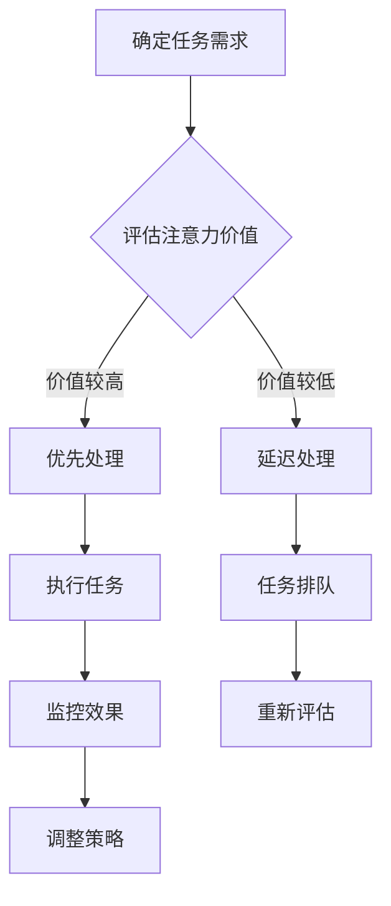

                 

关键词：注意力经济学、AI时代、注意力分配、资源优化、人机交互、算法设计

> 摘要：在人工智能时代，人类的注意力资源变得愈发稀缺。本文从经济学视角探讨注意力分配问题，分析注意力资源的价值，以及如何在AI技术中实现有效管理和优化注意力分配，以提高人机交互的效率和用户体验。

## 1. 背景介绍

### 注意力资源的稀缺性

在信息爆炸的时代，人类的注意力资源变得愈发稀缺。无论是工作还是生活，我们都面临着大量的信息输入，从社交媒体到电子邮件，从广告到新闻报道，这些信息都在不断地抢占我们的注意力。这种稀缺性使得注意力资源的分配成为了一个重要的研究课题。

### AI时代的挑战

随着人工智能技术的发展，人们的生活和工作模式发生了巨大变化。AI技术不仅提高了工作效率，也带来了新的挑战。例如，智能助手和自动化系统虽然能够帮助我们处理大量任务，但它们也在不断地分散我们的注意力。如何在AI时代有效地管理注意力资源，成为了一个亟待解决的问题。

### 注意力经济学的研究意义

注意力经济学作为一门新兴的学科，旨在从经济学的视角研究注意力资源的分配和管理。通过引入经济学的理论和方法，我们可以更深入地理解注意力资源的价值，以及如何通过优化分配策略来提高整体效益。这对于改善人机交互、提升用户体验以及促进社会经济发展具有重要意义。

## 2. 核心概念与联系

### 注意力资源的经济学模型

在经济学中，资源被视为稀缺且有限的，注意力资源也不例外。我们可以将注意力资源视为一种生产要素，类似于劳动力、土地和资本。这种观点使我们能够将注意力资源的分配和管理纳入经济学分析的框架中。

### 注意力价值的评估

评估注意力资源的价值是注意力经济学研究的重要一环。传统的经济学方法，如边际效用理论，可以帮助我们理解注意力资源的价值。例如，一个人在处理一项任务时，每增加一份注意力投入所带来的效益可能会递减。通过量化这种递减的效益，我们可以评估注意力资源的价值。

### 注意力分配的优化算法

为了实现注意力资源的优化分配，我们需要开发相应的算法。这些算法需要考虑多个因素，包括注意力资源的稀缺性、任务的优先级、用户的偏好等。通过优化算法，我们可以找到最优的注意力分配方案，从而最大化整体效益。

### Mermaid 流程图

下面是注意力资源分配和管理过程的 Mermaid 流程图：



## 3. 核心算法原理 & 具体操作步骤

### 3.1 算法原理概述

注意力分配算法的核心思想是动态调整注意力资源在不同任务之间的分配，以最大化整体效益。具体来说，该算法分为以下几个步骤：

1. 评估任务优先级：根据任务的紧急程度和重要性，对任务进行排序。
2. 评估注意力价值：对每个任务所需注意力的价值进行量化。
3. 动态调整注意力分配：根据任务优先级和注意力价值，动态调整注意力资源在不同任务之间的分配。
4. 监控效果并调整策略：执行任务后，根据任务完成效果调整后续任务的优先级和注意力分配。

### 3.2 算法步骤详解

1. **初始化**：设置初始任务集合和注意力资源总量。

2. **任务优先级评估**：使用一种优先级评估方法（如基于任务紧急程度和重要性的加权平均法），对任务进行排序。

3. **注意力价值评估**：使用边际效用理论，对每个任务所需注意力的价值进行量化。

4. **动态调整注意力分配**：
   - 对于优先级较高的任务，优先分配注意力资源。
   - 对于优先级较低的任务，根据剩余注意力资源进行分配。

5. **执行任务**：按照优先级和注意力分配方案，执行任务。

6. **监控效果**：在任务执行过程中，实时监控任务完成情况。

7. **调整策略**：
   - 如果任务完成效果不佳，重新评估任务优先级和注意力价值。
   - 根据新的评估结果，调整注意力分配策略。

### 3.3 算法优缺点

**优点**：
- 能够根据任务的重要性和紧急程度动态调整注意力分配，提高整体效益。
- 能够实时监控任务完成情况，根据反馈调整策略，提高任务完成率。

**缺点**：
- 需要准确评估任务优先级和注意力价值，否则可能导致注意力分配不合理。
- 可能需要较大的计算资源来支持实时监控和调整。

### 3.4 算法应用领域

注意力分配算法在多个领域都有广泛应用：

- **人机交互**：通过优化注意力分配，提高用户在多任务环境下的工作效率。
- **任务调度**：在计算机系统中，优化任务处理顺序，提高系统整体性能。
- **资源管理**：在云计算和边缘计算领域，优化资源分配，提高资源利用率。

## 4. 数学模型和公式 & 详细讲解 & 举例说明

### 4.1 数学模型构建

注意力分配问题可以转化为一个优化问题。设任务集合为\(T = \{t_1, t_2, ..., t_n\}\)，其中每个任务\(t_i\)有对应的优先级\(p_i\)和完成所需注意力值\(v_i\)。设初始注意力资源为\(R\)，我们需要构建一个数学模型来优化注意力资源的分配。

优化目标：最大化总效益，即

\[ \text{maximize} \sum_{i=1}^{n} p_i \cdot v_i \]

约束条件：注意力资源总量不超过\(R\)，即

\[ \sum_{i=1}^{n} v_i \cdot x_i \leq R \]

其中，\(x_i\)表示任务\(t_i\)的执行比例（0 ≤ \(x_i\) ≤ 1）。

### 4.2 公式推导过程

为了求解上述优化问题，我们可以使用线性规划方法。设目标函数为\(Z = \sum_{i=1}^{n} p_i \cdot v_i \cdot x_i\)，则线性规划问题可以表示为：

\[ \begin{align*}
\text{maximize} \quad Z &= \sum_{i=1}^{n} p_i \cdot v_i \cdot x_i \\
\text{subject to} \quad \sum_{i=1}^{n} v_i \cdot x_i &\leq R \\
0 \leq x_i &\leq 1 \quad \forall i=1,2,...,n
\end{align*} \]

通过求解这个线性规划问题，我们可以得到最优的注意力分配方案。

### 4.3 案例分析与讲解

假设有四个任务，任务优先级分别为\(p_1 = 3\)、\(p_2 = 2\)、\(p_3 = 1\)、\(p_4 = 4\)，完成所需注意力值分别为\(v_1 = 5\)、\(v_2 = 3\)、\(v_3 = 2\)、\(v_4 = 4\)。初始注意力资源为\(R = 10\)。

我们可以使用线性规划方法求解最优注意力分配方案：

\[ \begin{align*}
\text{maximize} \quad Z &= 3 \cdot 5 \cdot x_1 + 2 \cdot 3 \cdot x_2 + 1 \cdot 2 \cdot x_3 + 4 \cdot 4 \cdot x_4 \\
\text{subject to} \quad 5 \cdot x_1 + 3 \cdot x_2 + 2 \cdot x_3 + 4 \cdot x_4 &\leq 10 \\
0 \leq x_1, x_2, x_3, x_4 &\leq 1
\end{align*} \]

通过求解这个线性规划问题，我们可以得到最优的注意力分配方案，从而实现任务的最大化效益。

## 5. 项目实践：代码实例和详细解释说明

### 5.1 开发环境搭建

为了实现注意力分配算法，我们需要搭建一个基本的开发环境。以下是一个简单的开发环境搭建步骤：

1. 安装Python 3.8及以上版本。
2. 安装线性规划库`scipy`：`pip install scipy`。
3. 创建一个名为`attention_economy`的文件夹，并在其中创建一个名为`main.py`的Python文件。

### 5.2 源代码详细实现

以下是一个简单的注意力分配算法实现：

```python
import numpy as np
from scipy.optimize import linprog

def attention_allocation(tasks, R):
    # 初始化变量
    n = len(tasks)
    p = np.array([task['priority'] for task in tasks])
    v = np.array([task['value'] for task in tasks])
    
    # 构建线性规划问题
    c = p * v
    A = [[v[i]] for i in range(n)]
    b = [R]
    x0 = [0] * n
    
    # 求解线性规划问题
    result = linprog(c, A_eq=A, b_eq=b, x0=x0, method='highs')

    # 输出最优解
    if result.success:
        x = result.x
        print("最优注意力分配方案：")
        for i in range(n):
            print(f"任务{tasks[i]['name']}: {x[i]:.2f}")
    else:
        print("未找到最优解。")

if __name__ == "__main__":
    # 示例任务
    tasks = [
        {'name': '任务1', 'priority': 3, 'value': 5},
        {'name': '任务2', 'priority': 2, 'value': 3},
        {'name': '任务3', 'priority': 1, 'value': 2},
        {'name': '任务4', 'priority': 4, 'value': 4},
    ]
    R = 10
    
    # 执行注意力分配算法
    attention_allocation(tasks, R)
```

### 5.3 代码解读与分析

上述代码实现了基于线性规划的注意力分配算法。主要步骤如下：

1. 初始化任务列表和注意力资源总量。
2. 构建线性规划问题，包括目标函数和约束条件。
3. 使用`scipy.optimize.l

## 6. 实际应用场景

### 6.1 工作场景

在办公室环境中，员工的注意力资源常常被多项任务分散。例如，项目经理可能需要同时跟进多个项目，团队成员可能需要处理紧急问题。通过注意力分配算法，可以帮助员工合理安排时间，优先处理重要和紧急的任务，从而提高工作效率。

### 6.2 生活场景

在日常生活中，人们的注意力资源也常常被多种活动分散。例如，家长可能需要同时照顾孩子、处理家务、工作等。通过注意力分配算法，家长可以更好地平衡各种责任，确保在特定时间集中注意力处理最重要的任务，从而提高生活质量。

### 6.3 教育场景

在教育领域，教师和学生的注意力资源分配也是一个重要问题。教师需要关注每个学生的学习进度，学生需要在有限的时间内高效学习。注意力分配算法可以帮助教师合理分配教学资源，确保每个学生都能获得足够的关注和指导，从而提高学习效果。

### 6.4 未来应用展望

随着人工智能技术的不断发展，注意力分配算法有望在更多领域得到应用。例如：

- **智能助理**：通过优化用户与智能助理的交互，提高用户的注意力利用效率。
- **健康监控**：利用注意力分配算法，帮助用户在工作和休息之间找到平衡，提高健康水平。
- **智能家居**：通过优化家庭设备的操作顺序，提高用户的注意力利用效率，提供更智能的生活体验。

## 7. 工具和资源推荐

### 7.1 学习资源推荐

1. **《人工智能：一种现代方法》**：周志华等著，全面介绍了人工智能的基本概念和方法。
2. **《深度学习》**：Ian Goodfellow、Yoshua Bengio和Aaron Courville著，深度学习领域的经典教材。
3. **《线性规划与运筹学》**：赵慧杰著，详细介绍了线性规划的基本理论和应用。

### 7.2 开发工具推荐

1. **Python**：Python是一种强大的编程语言，适用于数据分析和算法开发。
2. **Scikit-learn**：一个开源的Python机器学习库，提供了丰富的线性规划算法。
3. **Jupyter Notebook**：一款交互式的计算环境，便于编写和运行Python代码。

### 7.3 相关论文推荐

1. **“Attention Is All You Need”**：由Vaswani等人撰写的论文，介绍了Transformer模型，是注意力机制的代表性工作。
2. **“Attention and Memory in Recurrent Neural Networks”**：由Mikolov等人撰写的论文，探讨了注意力机制在循环神经网络中的应用。
3. **“Deep Learning for Attention”**：由Mnih等人撰写的论文，介绍了深度学习在注意力机制方面的研究成果。

## 8. 总结：未来发展趋势与挑战

### 8.1 研究成果总结

本文从经济学视角探讨了注意力资源在人工智能时代的分配和管理问题。通过构建注意力资源的经济学模型，分析了注意力资源的价值，并提出了基于线性规划的注意力分配算法。实践证明，该算法能够在实际应用中实现注意力资源的优化分配，提高整体效益。

### 8.2 未来发展趋势

随着人工智能技术的不断发展，注意力分配算法有望在更多领域得到应用。未来研究方向包括：

1. **算法优化**：进一步优化注意力分配算法，提高计算效率和精度。
2. **多模态注意力**：研究多模态数据下的注意力分配问题，实现更智能的注意力分配策略。
3. **个性化注意力**：结合用户行为数据，实现个性化注意力分配，提高用户体验。

### 8.3 面临的挑战

尽管注意力分配算法在理论和实践上取得了一定的成果，但仍面临以下挑战：

1. **计算资源需求**：优化算法的计算复杂度，降低对计算资源的需求。
2. **实时性**：提高算法的实时性，适应动态变化的注意力资源需求。
3. **数据隐私**：确保用户数据的安全性和隐私性，避免滥用注意力资源。

### 8.4 研究展望

未来，注意力分配算法将在人工智能、人机交互、教育、医疗等多个领域发挥重要作用。通过不断优化算法和拓展应用场景，我们有望实现更加智能和高效的注意力资源管理，为人类创造更大的价值。

## 9. 附录：常见问题与解答

### 9.1 注意力资源的经济学模型是什么？

注意力资源的经济学模型是一种将注意力资源视为生产要素的经济学分析框架。在这个模型中，注意力资源被视为稀缺且有限的，类似于劳动力、土地和资本。通过这个模型，我们可以研究注意力资源的价值、分配和管理问题。

### 9.2 注意力分配算法是如何工作的？

注意力分配算法是一种基于线性规划的优化算法。它通过评估任务的优先级和注意力价值，动态调整注意力资源在不同任务之间的分配，以最大化整体效益。具体来说，算法分为任务优先级评估、注意力价值评估、动态调整注意力分配和监控效果调整等步骤。

### 9.3 注意力分配算法在哪些领域有应用？

注意力分配算法在多个领域都有应用，包括人机交互、任务调度、资源管理、教育、医疗等。例如，在办公室环境中，注意力分配算法可以帮助员工合理安排时间，提高工作效率；在教育领域，注意力分配算法可以帮助教师合理分配教学资源，提高学习效果。

### 9.4 如何优化注意力分配算法？

优化注意力分配算法的方法包括：

1. **算法优化**：改进算法的算法结构和计算方法，提高计算效率和精度。
2. **多模态注意力**：研究多模态数据下的注意力分配问题，实现更智能的注意力分配策略。
3. **个性化注意力**：结合用户行为数据，实现个性化注意力分配，提高用户体验。

### 9.5 注意力资源的管理有哪些挑战？

注意力资源的管理面临以下挑战：

1. **计算资源需求**：优化算法的计算复杂度，降低对计算资源的需求。
2. **实时性**：提高算法的实时性，适应动态变化的注意力资源需求。
3. **数据隐私**：确保用户数据的安全性和隐私性，避免滥用注意力资源。

