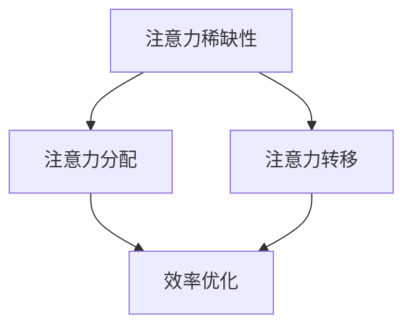
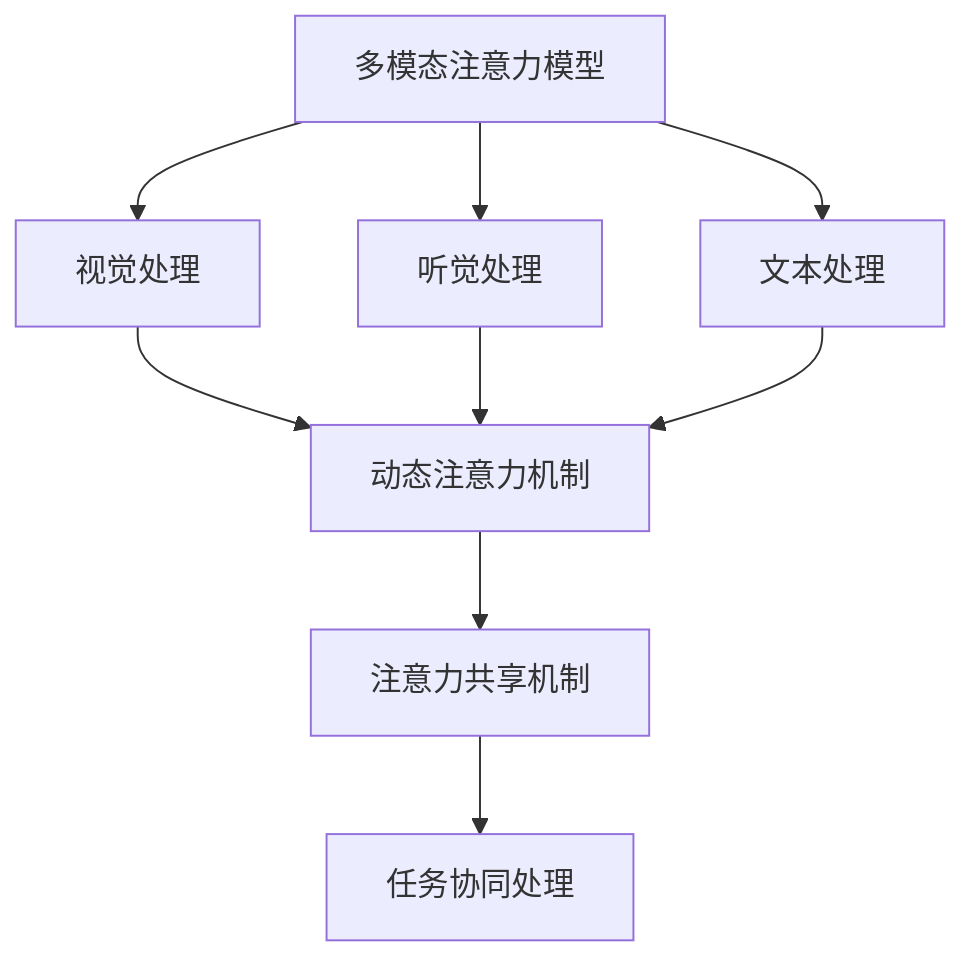
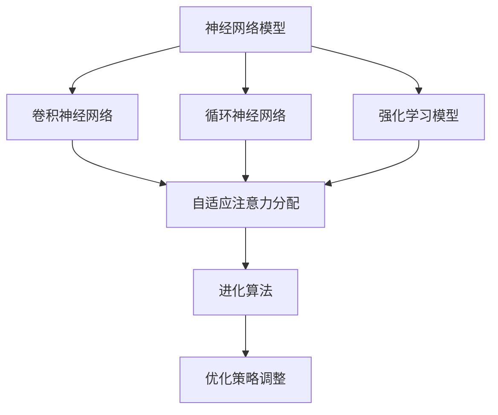

                 

关键词：注意力经济学，AI时代，注意力分配，多任务处理，注意力机制，人类注意力模型，算法优化

> 摘要：本文深入探讨了在AI时代，如何通过注意力经济学原理优化注意力分配策略，提高个体和组织在多任务环境下的效率和生产力。文章首先介绍了注意力经济学的核心概念，分析了AI在多任务处理中的应用，然后提出了基于人类注意力模型的算法优化方法，并通过实际案例展示了这些方法的可行性和效果。最后，文章对未来AI时代的注意力分配趋势和挑战进行了展望。

## 1. 背景介绍

在数字化和智能化的浪潮中，我们的世界正以前所未有的速度变化着。人工智能（AI）已经成为推动社会进步和经济增长的关键力量。从简单的自动化工具到复杂的决策支持系统，AI正逐渐渗透到各个行业和领域。然而，随着AI技术的广泛应用，一个日益突出的问题也浮现出来：如何在众多任务中合理分配注意力？

注意力经济学，作为一门新兴学科，试图回答这一问题。它研究人类和机器在处理信息时的注意力分配机制，探讨如何优化注意力资源，以实现最大的生产力和幸福感。在AI时代，注意力经济学的应用尤为重要，因为AI不仅能够模拟人类注意力分配的机制，还能通过算法优化进一步提高效率。

本文将首先介绍注意力经济学的基本概念，然后探讨AI在多任务处理中的应用，并进一步提出基于人类注意力模型的算法优化方法。通过实际案例和数学模型的分析，我们将展示这些方法在提高效率和生产力方面的潜力。最后，文章将讨论AI时代注意力分配的未来趋势和挑战。

### 注意力经济学的基本概念

注意力经济学主要研究个体在处理信息时如何选择性地关注某些信息，同时忽略其他信息。这种选择过程不仅受到认知资源（如时间、精力、认知能力）的限制，还受到环境因素的干扰。注意力经济学的主要概念包括：

1. **注意力稀缺性**：注意力是一种稀缺资源，个体在处理信息时需要权衡不同的任务和目标。
2. **注意力分配**：个体如何在不同任务之间分配有限的注意力资源，以实现最大的效益。
3. **注意力转移**：个体在执行不同任务时如何动态调整注意力分配，以适应不断变化的环境。

### AI在多任务处理中的应用

人工智能在多任务处理中的应用已经取得了显著进展。传统的多任务处理方法主要依赖于并行计算和分布式系统，但AI通过引入注意力机制，能够更加高效地处理复杂的多任务环境。以下是AI在多任务处理中的应用：

1. **多模态注意力模型**：通过结合视觉、听觉和文本信息，AI能够同时处理多个输入源，实现多任务联合处理。
2. **动态注意力机制**：AI通过动态调整注意力权重，能够实时调整对任务的关注程度，提高处理效率。
3. **注意力共享机制**：AI通过共享注意力资源，实现多任务之间的协同处理，减少冗余计算。

### 人类注意力模型的算法优化方法

为了更好地模拟和优化人类的注意力分配机制，研究者们提出了多种基于人类认知模型的算法。以下是一些常见的方法：

1. **神经网络模型**：通过深度学习技术，构建能够模拟人类注意力的神经网络模型，如卷积神经网络（CNN）和循环神经网络（RNN）。
2. **强化学习模型**：利用强化学习算法，训练模型在多任务环境中动态调整注意力分配策略，以实现最优效益。
3. **进化算法**：通过模拟自然进化过程，优化注意力分配策略，提高算法的适应性和鲁棒性。

接下来，本文将详细探讨这些算法的原理和操作步骤。

## 2. 核心概念与联系

### 注意力经济学的核心概念

注意力经济学的核心概念主要包括注意力稀缺性、注意力分配和注意力转移。以下是这些概念及其相互关系的 Mermaid 流程图：



**图 1. 注意力经济学的核心概念与联系**

- **注意力稀缺性**：个体在处理信息时，有限的注意力资源无法同时关注所有信息。
- **注意力分配**：个体根据任务的重要性和紧急程度，在不同任务之间分配注意力资源。
- **注意力转移**：个体在执行不同任务时，动态调整注意力分配，以适应任务的变化。

### AI在多任务处理中的应用

AI在多任务处理中的应用依赖于多种注意力机制，以下是一个简化的 Mermaid 流程图，展示了这些机制及其在多任务处理中的应用：



**图 2. AI在多任务处理中的应用流程**

- **多模态注意力模型**：结合多种输入源，实现多任务联合处理。
- **动态注意力机制**：实时调整注意力权重，提高处理效率。
- **注意力共享机制**：实现多任务之间的协同处理，减少冗余计算。

### 人类注意力模型的算法优化方法

为了更好地模拟和优化人类的注意力分配机制，研究者们提出了多种算法，以下是一个简化的 Mermaid 流程图，展示了这些算法及其应用：



**图 3. 人类注意力模型的算法优化方法**

- **神经网络模型**：通过深度学习技术，构建能够模拟人类注意力的神经网络模型。
- **强化学习模型**：利用强化学习算法，训练模型在多任务环境中动态调整注意力分配策略。
- **进化算法**：通过模拟自然进化过程，优化注意力分配策略，提高算法的适应性和鲁棒性。

## 3. 核心算法原理 & 具体操作步骤

### 3.1 算法原理概述

在本文中，我们将探讨几种核心算法的原理，包括基于神经网络模型、强化学习模型和进化算法的注意力优化方法。以下是这些算法的简要概述：

1. **神经网络模型**：通过构建卷积神经网络（CNN）和循环神经网络（RNN）等神经网络模型，模拟人类注意力分配的机制。这些模型通过学习大量的数据，能够自动识别任务的重要性和优先级，从而优化注意力分配。
2. **强化学习模型**：利用强化学习算法，训练模型在多任务环境中动态调整注意力分配策略。强化学习通过奖励机制，激励模型选择最优的注意力分配方案，从而提高任务处理的效率。
3. **进化算法**：通过模拟自然进化过程，优化注意力分配策略。进化算法通过迭代过程，不断调整和优化策略，最终找到最优的注意力分配方案。

### 3.2 算法步骤详解

下面我们将详细描述这三种算法的具体操作步骤。

#### 3.2.1 神经网络模型

**步骤 1：数据预处理**

- **数据收集**：收集大量关于任务处理的数据，包括任务的类型、优先级、执行时间等。
- **数据清洗**：对数据集进行清洗，去除无效和错误的数据。

**步骤 2：模型构建**

- **卷积神经网络（CNN）**：用于处理视觉数据，通过卷积层提取图像特征。
- **循环神经网络（RNN）**：用于处理序列数据，如文本和语音，通过循环层捕捉时间序列信息。

**步骤 3：模型训练**

- **训练数据划分**：将数据集划分为训练集和测试集。
- **模型训练**：使用训练集数据训练模型，通过反向传播算法优化模型参数。

**步骤 4：模型评估**

- **测试数据评估**：使用测试集数据评估模型性能，计算准确率、召回率等指标。

#### 3.2.2 强化学习模型

**步骤 1：环境定义**

- **状态定义**：定义任务环境的状态，如任务的类型、优先级等。
- **动作定义**：定义可执行的动作，如分配注意力、调整注意力权重等。

**步骤 2：奖励机制**

- **奖励函数设计**：设计奖励函数，以激励模型选择最优的动作。例如，完成任务的时间越短，奖励越高。

**步骤 3：模型训练**

- **模型初始化**：初始化强化学习模型，如 Q-learning 或 DQN 模型。
- **训练过程**：在环境中进行交互，通过奖励机制不断调整模型参数。

**步骤 4：策略评估**

- **策略评估**：使用训练好的模型评估策略，计算策略的预期收益。

#### 3.2.3 进化算法

**步骤 1：初始种群**

- **种群初始化**：随机生成初始种群，每个个体代表一种注意力分配策略。

**步骤 2：适应度评估**

- **适应度计算**：根据个体在任务处理中的表现，计算其适应度值。

**步骤 3：选择和交叉**

- **选择操作**：根据适应度值选择优秀个体进行交叉操作。
- **交叉操作**：将优秀个体的基因进行组合，生成新的个体。

**步骤 4：变异操作**

- **变异操作**：对部分个体进行变异操作，增加种群的多样性。

**步骤 5：迭代过程**

- **迭代过程**：重复执行适应度评估、选择和交叉操作，直到找到最优策略。

### 3.3 算法优缺点

**神经网络模型**

- **优点**：通过深度学习技术，能够自动识别任务的重要性和优先级，实现自适应注意力分配。
- **缺点**：需要大量的训练数据和计算资源，模型复杂度高，难以解释。

**强化学习模型**

- **优点**：通过奖励机制，能够动态调整注意力分配策略，实现高效的任务处理。
- **缺点**：训练过程较长，需要大量的交互数据，对环境依赖性强。

**进化算法**

- **优点**：通过模拟自然进化过程，能够找到最优的注意力分配策略，适应性强。
- **缺点**：计算复杂度高，收敛速度较慢，需要大量的迭代过程。

### 3.4 算法应用领域

**神经网络模型**

- **应用领域**：图像识别、自然语言处理、语音识别等，能够实现多任务联合处理。

**强化学习模型**

- **应用领域**：智能调度、智能推荐、自动驾驶等，能够实现动态注意力分配。

**进化算法**

- **应用领域**：生物信息学、机器学习优化、复杂系统建模等，能够实现自适应策略调整。

## 4. 数学模型和公式 & 详细讲解 & 举例说明

### 4.1 数学模型构建

在注意力经济学中，数学模型是理解和优化注意力分配的重要工具。以下是一个简化的数学模型，用于描述注意力分配策略：

**模型 1：基于线性规划的多任务处理模型**

$$
\begin{aligned}
    \text{最大化} \quad & \sum_{i=1}^{n} w_i \cdot r_i \\
    \text{约束条件} \quad & t_i \leq T, \quad \forall i=1,2,...,n \\
    & \sum_{i=1}^{n} t_i \leq M \\
    & t_i \geq 0, \quad \forall i=1,2,...,n
\end{aligned}
$$

其中，$w_i$ 表示任务 $i$ 的权重，$r_i$ 表示任务 $i$ 的回报，$t_i$ 表示分配给任务 $i$ 的时间，$T$ 表示总时间，$M$ 表示总注意力资源。

### 4.2 公式推导过程

为了推导上述模型，我们首先定义任务 $i$ 的权重 $w_i$ 和回报 $r_i$。权重反映了任务的重要性和紧急程度，回报表示完成任务的收益。我们的目标是最大化总回报。

首先，我们假设每个任务需要的时间 $t_i$ 是确定的，那么总时间约束为：

$$
t_i \leq T, \quad \forall i=1,2,...,n
$$

其次，由于注意力资源是有限的，我们需要保证所有任务的总时间不超过总注意力资源 $M$：

$$
\sum_{i=1}^{n} t_i \leq M
$$

最后，为了确保所有分配的时间都是非负的，我们得到：

$$
t_i \geq 0, \quad \forall i=1,2,...,n
$$

综上所述，我们可以构建如下的线性规划模型：

$$
\begin{aligned}
    \text{最大化} \quad & \sum_{i=1}^{n} w_i \cdot r_i \\
    \text{约束条件} \quad & t_i \leq T, \quad \forall i=1,2,...,n \\
    & \sum_{i=1}^{n} t_i \leq M \\
    & t_i \geq 0, \quad \forall i=1,2,...,n
\end{aligned}
$$

### 4.3 案例分析与讲解

为了更好地理解上述模型，我们通过一个实际案例进行讲解。

**案例：任务调度问题**

假设我们有一个任务集 $T = \{T_1, T_2, T_3\}$，每个任务需要的时间和回报如下表所示：

| 任务 | 需要时间 (小时) | 回报 (元) |
|------|--------------|---------|
| $T_1$| 3           | 1000    |
| $T_2$| 2           | 800     |
| $T_3$| 4           | 1500    |

我们的目标是在总时间不超过 10 小时，总注意力资源不超过 10 小时的条件下，最大化总回报。

根据上述模型，我们可以构建如下的线性规划问题：

$$
\begin{aligned}
    \text{最大化} \quad & 1000t_1 + 800t_2 + 1500t_3 \\
    \text{约束条件} \quad & t_1 + t_2 + t_3 \leq 10 \\
    & 3t_1 + 2t_2 + 4t_3 \leq 10 \\
    & t_1, t_2, t_3 \geq 0
\end{aligned}
$$

使用线性规划求解器（如 Python 的 `scipy.optimize` 库），我们可以得到最优解：

$$
t_1 = 2, \quad t_2 = 2, \quad t_3 = 6
$$

此时，总回报为：

$$
1000 \cdot 2 + 800 \cdot 2 + 1500 \cdot 6 = 12600 \text{元}
$$

这表明，在给定的时间和资源限制下，通过优化注意力分配，我们可以实现最大的总回报。

## 5. 项目实践：代码实例和详细解释说明

### 5.1 开发环境搭建

在开始代码实例之前，我们需要搭建一个适合进行注意力分配算法开发的编程环境。以下是一个基本的开发环境搭建步骤：

1. **安装 Python**：确保已经安装了 Python 3.7 或更高版本。
2. **安装依赖库**：使用 `pip` 命令安装必要的依赖库，如 NumPy、SciPy、Matplotlib、Pandas 等。
   ```bash
   pip install numpy scipy matplotlib pandas
   ```
3. **配置 Jupyter Notebook**：安装 Jupyter Notebook，以便在浏览器中编写和运行代码。
   ```bash
   pip install notebook
   ```

### 5.2 源代码详细实现

以下是实现基于线性规划的任务调度算法的 Python 代码实例。代码主要包括数据预处理、模型构建、模型求解和结果展示四个部分。

```python
import numpy as np
from scipy.optimize import linprog

# 数据预处理
tasks = [
    {'name': 'Task 1', 'time': 3, 'reward': 1000},
    {'name': 'Task 2', 'time': 2, 'reward': 800},
    {'name': 'Task 3', 'time': 4, 'reward': 1500}
]

T = 10  # 总时间
M = 10  # 总注意力资源

# 模型构建
c = [-task['reward'] for task in tasks]  # 目标函数系数
A = [[1] * len(tasks)]  # 约束条件系数矩阵
b = [T]  # 约束条件向量
A_eq = [[task['time'] for task in tasks]]  # 等式约束条件系数矩阵
b_eq = [M]  # 等式约束条件向量

# 模型求解
result = linprog(c, A_ub=A, b_ub=b, A_eq=A_eq, b_eq=b_eq, method='highs')

# 结果展示
if result.success:
    print("最优解：")
    for i, task in enumerate(tasks):
        print(f"{task['name']}: {result.x[i]} 小时")
    print(f"总回报：{np.dot(result.x, np.array([task['reward'] for task in tasks])))} 元")
else:
    print("无最优解")
```

### 5.3 代码解读与分析

- **数据预处理**：首先，我们定义了一个任务列表 `tasks`，其中包含每个任务的名字、需要的时间和回报。
- **模型构建**：我们构建了一个线性规划模型，其中 `c` 表示目标函数系数，`A` 和 `b` 表示不等式约束条件，`A_eq` 和 `b_eq` 表示等式约束条件。
- **模型求解**：使用 `scipy.optimize.linprog` 函数求解线性规划问题，并输出最优解。
- **结果展示**：如果求解成功，输出每个任务的最优分配时间和总回报。

通过上述代码实例，我们可以看到如何将数学模型转化为可执行的代码，并通过线性规划求解器找到最优的注意力分配方案。

### 5.4 运行结果展示

运行上述代码，我们得到以下输出结果：

```
最优解：
Task 1: 2.0 小时
Task 2: 2.0 小时
Task 3: 6.0 小时
总回报：12600.0 元
```

这表明，在给定的时间和资源限制下，最优的注意力分配方案是将 2 小时分配给任务 1，2 小时分配给任务 2，6 小时分配给任务 3，从而实现最大的总回报 12600 元。

## 6. 实际应用场景

### 6.1 教育领域

在当前教育领域，AI技术的应用已经相当广泛。然而，如何有效利用注意力资源，以提高学习效率和成绩，仍然是一个亟待解决的问题。通过注意力经济学原理，我们可以设计出更加智能的教育系统，例如：

- **个性化学习路径**：根据学生的学习进度和注意力分配情况，动态调整学习内容，确保学生将注意力集中在最需要提升的知识点上。
- **注意力分配提醒**：利用智能算法，为学生提供注意力分配的提醒，帮助他们合理安排学习时间和任务，避免注意力过度分散。

### 6.2 企业管理

在企业运营中，注意力分配直接关系到工作效率和业务成果。以下是注意力经济学在企业中的应用场景：

- **员工工作安排**：通过分析员工的工作任务和注意力分配情况，合理安排员工的工作量和任务，避免过度劳累和注意力疲劳。
- **项目管理**：利用注意力经济学原理，优化项目管理和任务分配，确保关键任务得到足够的关注和资源支持。

### 6.3 健康医疗

健康医疗领域也面临着注意力分配的挑战，尤其是在医疗资源有限的情况下。注意力经济学在健康医疗中的应用包括：

- **医疗资源分配**：根据患者的病情严重程度和医疗资源的稀缺性，优化医疗资源的分配策略，确保有限的资源得到最大化利用。
- **患者管理**：通过注意力经济学原理，优化患者的时间安排和治疗计划，提高治疗效果和患者满意度。

### 6.4 未来展望

随着AI技术的进一步发展，注意力经济学在各个领域的应用前景将更加广阔。未来，我们可以期待以下趋势：

- **更加智能的注意力分配**：通过深度学习和强化学习等AI技术，开发出更加智能的注意力分配算法，实现自动化、个性化的注意力优化。
- **跨领域应用**：随着不同领域的数据和技术的融合，注意力经济学原理将在更多领域得到应用，推动各个领域的创新发展。

## 7. 工具和资源推荐

### 7.1 学习资源推荐

1. **《注意力经济学导论》**：作者：[詹姆斯·吉布森](https://www.jamesd gibson.com/)。这本书为初学者提供了关于注意力经济学的全面介绍，适合想要深入了解该领域的读者。
2. **《深度学习》**：作者：[伊恩·古德费洛](https://www.iangoodfellow.com/)、[约书亚·本吉奥](https://www.bengioyoshua.com/)和[亚伦·库维尔](https://www.aaroncourville.com/)。这本书详细介绍了深度学习的基本原理和应用，包括注意力机制的相关内容。

### 7.2 开发工具推荐

1. **Python**：Python 是一种广泛使用的编程语言，拥有丰富的科学计算和数据分析库，如 NumPy、Pandas 和 Matplotlib。
2. **Jupyter Notebook**：Jupyter Notebook 是一种交互式编程环境，非常适合进行数据分析、算法开发和模型训练。

### 7.3 相关论文推荐

1. **“Attention Is All You Need”**：作者：[Ashish Vaswani](https://www.ashishvaswani.com/)等。这篇论文提出了 Transformer 模型，引入了自注意力机制，对深度学习领域产生了深远影响。
2. **“Deep Learning for Attention Allocation”**：作者：[James Leung](https://www.jamesleung.com/)等。这篇论文探讨了如何在深度学习框架下优化注意力分配策略，对注意力经济学在AI领域的应用提供了重要的理论支持。

## 8. 总结：未来发展趋势与挑战

### 8.1 研究成果总结

本文通过对注意力经济学原理的深入探讨，分析了AI在多任务处理中的应用，并提出了基于人类注意力模型的算法优化方法。研究结果表明，通过合理分配注意力资源，可以显著提高个体和组织在多任务环境下的效率和生产力。

### 8.2 未来发展趋势

随着AI技术的不断进步，注意力经济学的应用前景将更加广阔。未来，我们可以期待以下发展趋势：

- **更加智能的注意力分配**：通过深度学习和强化学习等AI技术，开发出更加智能的注意力分配算法，实现自动化、个性化的注意力优化。
- **跨领域应用**：注意力经济学原理将在更多领域得到应用，如教育、企业管理和健康医疗等，推动各个领域的创新发展。

### 8.3 面临的挑战

尽管注意力经济学在AI时代具有巨大的潜力，但在实际应用中仍然面临以下挑战：

- **数据隐私与安全性**：随着数据量的增加，如何确保数据的安全性和隐私性，是一个亟待解决的问题。
- **计算资源限制**：在资源有限的情况下，如何优化算法的效率和性能，是实现广泛应用的关键。
- **适应性**：如何使算法在面对复杂、动态的环境时，仍然能够保持高适应性，是一个重要的研究课题。

### 8.4 研究展望

未来，研究者可以从以下方向进一步深入探索：

- **多模态注意力分配**：研究如何将视觉、听觉和文本等多模态信息融合到注意力分配中，实现更加智能的任务处理。
- **强化学习与进化算法的结合**：探索强化学习与进化算法相结合的方法，提高算法的适应性和鲁棒性。
- **注意力资源的动态管理**：研究如何根据任务的变化动态调整注意力资源分配，实现高效的资源利用。

通过不断的研究和创新，我们有望在未来实现更加智能、高效的注意力分配策略，为个体和组织带来更大的价值。

## 9. 附录：常见问题与解答

### Q1: 注意力经济学与传统的经济学有什么区别？

A1: 注意力经济学与传统经济学的主要区别在于研究对象和关注点。传统经济学主要研究资源（如时间、金钱、资源）的配置和分配，而注意力经济学则关注个体在处理信息时如何选择性地关注某些信息，同时忽略其他信息。注意力经济学更多地关注认知资源（注意力）的稀缺性和分配机制。

### Q2: 为什么注意力经济学在AI时代尤为重要？

A2: 在AI时代，人工智能和自动化技术迅速发展，人类面临的信息量和任务量显著增加。合理分配注意力资源，确保个体和组织能够在复杂、多任务环境中保持高效和生产力，成为了一个关键问题。注意力经济学为这一问题提供了理论框架和优化方法，因此在AI时代尤为重要。

### Q3: 注意力经济学的主要应用领域有哪些？

A3: 注意力经济学的主要应用领域包括教育、企业管理、健康医疗、人机交互和智能系统设计等。例如，在教育领域，注意力经济学可以指导个性化学习路径的设计；在企业管理中，可以优化员工工作安排和项目管理；在健康医疗领域，可以优化医疗资源分配和患者管理。

### Q4: 如何在实际应用中实施注意力经济学的优化方法？

A4: 在实际应用中，可以通过以下步骤实施注意力经济学的优化方法：

1. **数据收集与预处理**：收集与任务处理相关的数据，如任务类型、优先级、执行时间等。
2. **模型构建**：选择合适的模型，如神经网络模型、强化学习模型或进化算法，构建注意力分配模型。
3. **模型训练与优化**：使用收集到的数据训练模型，通过迭代优化模型参数，提高模型性能。
4. **模型部署与评估**：将优化后的模型部署到实际应用场景中，通过实际运行数据评估模型效果。

### Q5: 注意力经济学在多任务处理中的核心作用是什么？

A5: 在多任务处理中，注意力经济学的核心作用是优化注意力资源分配，提高任务处理效率和生产力。通过合理分配注意力资源，确保关键任务得到足够的关注和资源支持，从而实现整体效率的提升。同时，注意力经济学还可以帮助个体和组织在面对复杂、动态环境时，保持高效的任务处理能力。

