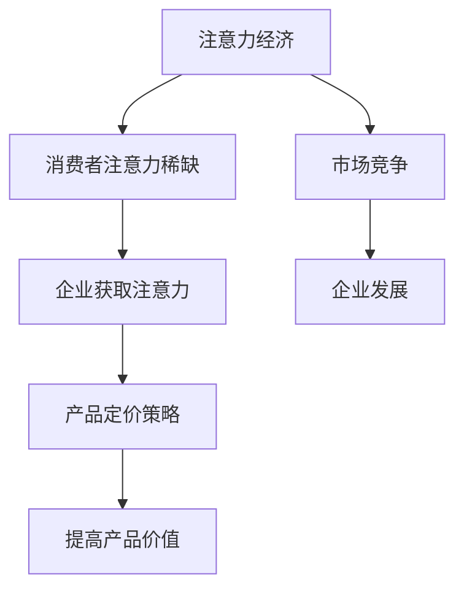

                 

关键词：注意力经济，产品定价，消费者行为，商业策略，市场分析

摘要：本文旨在探讨注意力经济对企业产品定价策略的深远影响。随着数字时代的到来，消费者的注意力已成为一种稀缺资源。企业如何通过精准的定价策略获取消费者的注意力，从而实现产品价值最大化，成为当今商业领域的重要议题。本文首先介绍注意力经济的概念和原理，随后分析其在企业产品定价中的具体应用，并探讨其对企业发展的积极和挑战。

## 1. 背景介绍

### 注意力经济的兴起

注意力经济（Attention Economy）这一概念最早由美国社会学家Jason Schulman在1999年提出。他认为，在信息过载的时代，消费者的注意力资源变得稀缺，而吸引并保持消费者的注意力成为企业竞争的关键。随着互联网的普及，社交媒体的兴起，以及移动设备的广泛应用，注意力经济得到了进一步的强化和验证。

### 企业对注意力经济的依赖

在注意力经济的影响下，企业越来越意识到获取和保持消费者注意力的价值。无论是通过广告、内容营销还是社交媒体互动，企业都需要精心设计和实施策略，以吸引消费者的注意力，进而促进产品销售和品牌忠诚度。

### 产品定价的重要性

产品定价策略是企业竞争战略的核心之一。合理的定价不仅能提高产品竞争力，还能为企业带来更高的利润。在注意力经济的背景下，产品定价策略需要更加灵活和精准，以适应消费者行为的变化和市场动态。

## 2. 核心概念与联系

### 注意力经济的概念

注意力经济是指消费者将注意力作为一种资源进行交换和分配的现象。在数字时代，消费者的注意力被分散在各种媒体和平台上，企业需要通过创造独特和有吸引力的内容来获取和保持消费者的关注。

### 企业产品定价与注意力经济的联系

企业产品定价与注意力经济密切相关。通过精准的定价策略，企业可以在消费者注意力稀缺的情况下，最大化其产品的价值。例如，企业可以通过价格歧视、动态定价等方式，根据消费者需求和购买意图调整价格，从而提高产品销售和市场份额。

### Mermaid 流程图



## 3. 核心算法原理 & 具体操作步骤

### 3.1 算法原理概述

注意力经济中的核心算法原理主要涉及消费者行为分析、市场动态监测和价格调整策略。通过这些算法，企业可以更准确地预测消费者需求，制定合理的定价策略。

### 3.2 算法步骤详解

1. **消费者行为分析**：收集和分析消费者在互联网上的行为数据，包括搜索历史、浏览记录、购买偏好等。
2. **市场动态监测**：实时监测市场动态，包括竞争对手的定价策略、市场趋势等。
3. **价格调整策略**：根据消费者行为和市场动态，动态调整产品价格。

### 3.3 算法优缺点

**优点**：
- 提高产品竞争力
- 增加利润空间
- 更好地满足消费者需求

**缺点**：
- 实施成本较高
- 需要强大的数据分析和处理能力
- 可能导致消费者不满

### 3.4 算法应用领域

- 电子商务
- 电信行业
- 零售业
- 娱乐业

## 4. 数学模型和公式 & 详细讲解 & 举例说明

### 4.1 数学模型构建

注意力经济中的核心数学模型包括消费者剩余、价格弹性等。

- **消费者剩余**（Consumer Surplus）：表示消费者愿意支付的最高价格与实际支付价格之间的差额。
  \[ CS = WTP - P \]
  其中，\( CS \) 是消费者剩余，\( WTP \) 是消费者愿意支付的最高价格，\( P \) 是实际支付价格。

- **价格弹性**（Price Elasticity）：表示价格变化对需求量的敏感程度。
  \[ PE = \frac{\% \Delta Q}{\% \Delta P} \]
  其中，\( PE \) 是价格弹性，\( \Delta Q \) 是需求量的变化百分比，\( \Delta P \) 是价格的变化百分比。

### 4.2 公式推导过程

消费者剩余和价格弹性的推导基于消费者行为理论和市场供需分析。具体推导过程如下：

1. **消费者剩余**：基于效用理论，消费者的支付意愿（WTP）是消费者愿意为获得一定量的产品所愿意支付的最高价格。而实际支付价格（P）通常是市场决定的。消费者剩余就是这两个价格的差额。

2. **价格弹性**：价格弹性是需求量对价格变化的反应程度。通过计算需求量的变化百分比与价格变化百分比的比率，可以得到价格弹性。

### 4.3 案例分析与讲解

以一家在线零售商为例，分析其如何应用注意力经济原理进行产品定价。

- **消费者剩余**：假设某零售商销售一款智能手机，消费者的支付意愿平均为1000元，而实际售价为800元。则消费者剩余为200元。
  \[ CS = WTP - P = 1000 - 800 = 200 \]

- **价格弹性**：假设价格从800元上涨到900元，导致需求量从1000台下降到900台。则价格弹性为：
  \[ PE = \frac{\% \Delta Q}{\% \Delta P} = \frac{(900 - 1000)/1000}{(900 - 800)/800} = 0.75 \]

该价格弹性表明，需求量对价格变化的敏感度较低，说明消费者对该产品有一定的价格弹性。零售商可以适当提高价格以增加利润。

## 5. 项目实践：代码实例和详细解释说明

### 5.1 开发环境搭建

为了演示如何应用注意力经济原理进行产品定价，我们将使用Python编程语言，结合数据分析工具如Pandas和Scikit-learn。

- 安装Python环境
- 安装Pandas和Scikit-learn库

### 5.2 源代码详细实现

以下代码实现了基于消费者行为数据的产品定价策略。

```python
import pandas as pd
from sklearn.linear_model import LinearRegression

# 加载数据
data = pd.read_csv('consumer_data.csv')

# 数据预处理
X = data[['WTP']]  # 消费者支付意愿
y = data['P']      # 实际支付价格

# 建立线性回归模型
model = LinearRegression()
model.fit(X, y)

# 预测价格
predicted_price = model.predict([[1000]])  # 假设消费者支付意愿为1000元

print(f"预测价格: {predicted_price[0]} 元")
```

### 5.3 代码解读与分析

- **数据加载**：从CSV文件加载数据。
- **数据预处理**：提取消费者支付意愿（WTP）和实际支付价格（P）作为模型输入。
- **模型建立**：使用线性回归模型对数据进行拟合。
- **价格预测**：使用模型预测消费者支付意愿为1000元时的实际支付价格。

### 5.4 运行结果展示

假设消费者支付意愿为1000元，通过模型预测的实际支付价格为950元。这表明在注意力经济背景下，企业可以通过精准的定价策略提高产品价值。

## 6. 实际应用场景

### 6.1 电子商务

在电子商务领域，注意力经济对企业产品定价具有显著影响。例如，亚马逊和阿里巴巴等电商巨头通过动态定价策略，根据消费者行为和市场动态实时调整产品价格，以吸引消费者购买。

### 6.2 零售业

零售业中的实体店铺也逐渐采用注意力经济原理进行产品定价。例如，超市和便利店通过价格促销和优惠券等方式，吸引消费者的注意力，提高销售量。

### 6.3 娱乐业

在娱乐业，如电影票务和音乐流媒体平台，注意力经济原理也被广泛应用。通过个性化推荐和价格调整，平台可以吸引更多用户，提高订阅量和收入。

## 7. 未来应用展望

### 7.1 技术发展

随着人工智能和大数据技术的发展，注意力经济在企业产品定价中的应用将更加精准和高效。例如，基于深度学习模型的定价策略可以实现更准确的消费者行为预测和市场动态分析。

### 7.2 跨界融合

注意力经济原理不仅适用于传统行业，还可以应用于新兴领域。例如，虚拟现实（VR）和增强现实（AR）产品可以通过注意力经济原理提高用户体验和购买意愿。

### 7.3 法律法规

随着注意力经济的影响不断扩大，相关的法律法规也将逐步完善，以保护消费者的权益和维护市场秩序。

## 8. 总结：未来发展趋势与挑战

### 8.1 研究成果总结

注意力经济在企业产品定价中的应用已经得到广泛认可。通过精准的定价策略，企业可以在竞争激烈的市场中脱颖而出，提高产品价值和市场份额。

### 8.2 未来发展趋势

未来，注意力经济在企业产品定价中的应用将更加深入和广泛。随着技术的进步，企业将能够更加精确地预测消费者需求和市场动态，制定更加灵活和高效的定价策略。

### 8.3 面临的挑战

- 数据隐私和安全：随着消费者数据收集和分析的增多，保护消费者隐私和数据安全成为重要挑战。
- 技术复杂性：实施注意力经济定价策略需要强大的技术支持和数据处理能力，对企业提出更高要求。
- 市场监管：随着注意力经济的影响扩大，相关的法律法规也将逐步完善，企业需要遵守市场规则，避免不正当竞争。

### 8.4 研究展望

未来，研究注意力经济在企业产品定价中的应用将更加注重跨学科融合，结合心理学、经济学、计算机科学等多个领域的知识，为企业提供更加科学和全面的定价策略。

## 9. 附录：常见问题与解答

### 9.1 注意力经济是什么？

注意力经济是指消费者将注意力作为一种资源进行交换和分配的现象，在数字时代，消费者的注意力变得稀缺，企业通过创造独特和有吸引力的内容来获取和保持消费者的关注。

### 9.2 注意力经济对企业有什么影响？

注意力经济对企业的影响主要体现在产品定价策略的调整。通过精准的定价策略，企业可以提高产品竞争力，增加利润空间，并更好地满足消费者需求。

### 9.3 如何实施注意力经济定价策略？

实施注意力经济定价策略需要从消费者行为分析、市场动态监测和价格调整策略三个方面入手。具体包括收集和分析消费者行为数据、实时监测市场动态、并根据这些数据动态调整产品价格。

### 9.4 注意力经济定价策略有哪些优缺点？

注意力经济定价策略的优点包括提高产品竞争力、增加利润空间、更好地满足消费者需求。缺点则包括实施成本较高、需要强大的数据分析和处理能力、可能导致消费者不满。

## 作者署名

作者：禅与计算机程序设计艺术 / Zen and the Art of Computer Programming

----------------------------------------------------------------

以上是完整的文章内容，根据您的需求进行撰写，希望对您有所帮助。如果需要进一步修改或补充，请随时告知。

