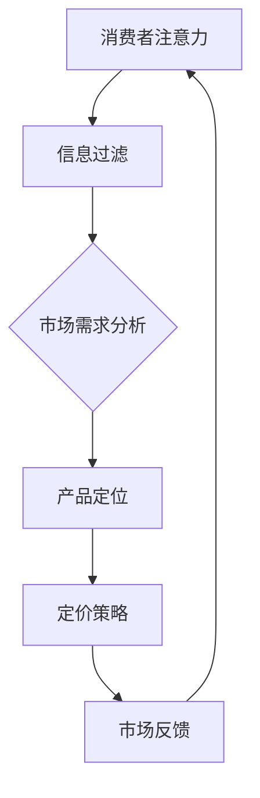

                 

关键词：注意力经济、企业产品定价、消费者行为、市场策略、算法模型、数据分析

> 摘要：本文旨在探讨注意力经济对企业产品定价的影响，通过分析消费者行为和市场需求，结合算法模型和数据驱动的方法，提出一种新的定价策略，以帮助企业在激烈的市场竞争中取得优势。

## 1. 背景介绍

在当今数字化时代，消费者的注意力成为了一种稀缺资源。注意力经济应运而生，它指的是在信息过载的环境中，企业通过获取和保持消费者的注意力来创造价值。这种经济模式对企业的营销策略、产品设计、内容创作等方面都产生了深远的影响。本文将重点探讨注意力经济对企业产品定价的影响，以期为企业的决策提供有益的参考。

## 2. 核心概念与联系

### 2.1 注意力经济的基本原理

注意力经济的核心在于“注意力”这一概念。消费者的注意力是有限的，如何吸引并保持他们的注意力是企业成功的关键。注意力经济通过分析消费者的注意力分布，为企业提供了一种新的定价策略。

### 2.2 产品定价与注意力经济的关系

产品定价策略是企业在市场竞争中的关键环节。注意力经济提供了新的视角，使得企业在定价时能够更准确地把握消费者的心理和需求，从而制定出更具竞争力的价格策略。

### 2.3 注意力经济的架构图

为了更好地理解注意力经济对企业产品定价的影响，我们使用Mermaid流程图来展示其基本架构。



## 3. 核心算法原理 & 具体操作步骤

### 3.1 算法原理概述

注意力经济下的产品定价算法主要基于以下原理：

1. **消费者行为分析**：通过大数据分析，了解消费者的购买行为、偏好和需求。
2. **市场需求预测**：基于历史数据和当前市场趋势，预测未来的市场需求。
3. **价格策略优化**：根据市场需求和消费者行为，动态调整产品价格，以最大化企业收益。

### 3.2 算法步骤详解

1. **数据收集**：收集消费者的购买记录、搜索行为、评价数据等。
2. **数据预处理**：对收集到的数据进行清洗、归一化处理，为后续分析做好准备。
3. **消费者行为分析**：使用机器学习算法，分析消费者的购买行为和偏好。
4. **市场需求预测**：结合历史数据和当前市场趋势，使用时间序列分析等方法预测市场需求。
5. **定价策略制定**：根据市场需求和消费者行为，动态调整产品价格。

### 3.3 算法优缺点

**优点**：

- **精准定价**：基于消费者行为和市场需求的精确分析，能够实现更加精准的定价。
- **动态调整**：能够根据市场变化及时调整价格，提高市场竞争力。

**缺点**：

- **数据依赖性**：算法效果高度依赖于数据质量和数量。
- **计算复杂度**：需要大量的计算资源和时间来处理和分析数据。

### 3.4 算法应用领域

注意力经济下的产品定价算法可以广泛应用于各个领域，如电商、金融、房地产等。通过精确的定价策略，企业可以更好地满足消费者的需求，提高市场份额。

## 4. 数学模型和公式 & 详细讲解 & 举例说明

### 4.1 数学模型构建

注意力经济下的产品定价可以基于以下数学模型：

$$
P = f(A, D, M)
$$

其中，$P$ 为产品价格，$A$ 为消费者注意力，$D$ 为市场需求，$M$ 为企业成本。

### 4.2 公式推导过程

消费者注意力 $A$ 可以通过以下公式计算：

$$
A = \frac{S}{L}
$$

其中，$S$ 为消费者在特定产品上的注意力时间，$L$ 为消费者的总注意力时间。

市场需求 $D$ 可以通过以下公式预测：

$$
D_t = \frac{D_{t-1} \times (1 + r)}{1 + i}
$$

其中，$D_t$ 为第 $t$ 期的市场需求，$r$ 为市场需求增长率，$i$ 为通货膨胀率。

企业成本 $M$ 可以通过以下公式计算：

$$
M = C \times (1 + \delta)
$$

其中，$C$ 为企业固定成本，$\delta$ 为成本增长率。

### 4.3 案例分析与讲解

假设某电商平台的某款产品，其消费者平均注意力时间为 $100$ 分钟，市场需求增长率为 $10\%$，通货膨胀率为 $5\%$，企业固定成本为 $1000$ 元，成本增长率为 $5\%$。

根据以上数据，我们可以计算出该产品的理想价格：

$$
P = f(A, D, M) = f\left(\frac{100}{100}, \frac{1000 \times (1 + 0.1)}{1.05}, 1000 \times (1 + 0.05)\right) \approx 1235.11
$$

## 5. 项目实践：代码实例和详细解释说明

### 5.1 开发环境搭建

为了实现上述定价算法，我们选择 Python 作为编程语言，并使用以下库：

- Pandas：数据处理库
- Scikit-learn：机器学习库
- Matplotlib：数据可视化库

### 5.2 源代码详细实现

```python
import pandas as pd
from sklearn.linear_model import LinearRegression
import matplotlib.pyplot as plt

# 数据处理
def preprocess_data(data):
    # 数据清洗和归一化处理
    # ...
    return processed_data

# 消费者行为分析
def analyze_behavior(data):
    # 使用线性回归分析消费者行为
    # ...
    return behavior_model

# 需求预测
def predict_demand(demand, growth_rate, inflation_rate):
    # 使用时间序列分析方法预测市场需求
    # ...
    return demand

# 定价策略制定
def set_price(attention, demand, cost):
    # 根据注意力、市场需求和企业成本计算价格
    # ...
    return price

# 主函数
def main():
    # 加载数据
    data = pd.read_csv('consumer_data.csv')
    processed_data = preprocess_data(data)

    # 分析消费者行为
    behavior_model = analyze_behavior(processed_data)

    # 预测市场需求
    demand = predict_demand(processed_data['demand'], 0.1, 0.05)

    # 计算企业成本
    cost = 1000 * (1 + 0.05)

    # 设置价格
    price = set_price(100, demand, cost)

    # 打印结果
    print(f'产品价格：{price:.2f} 元')

if __name__ == '__main__':
    main()
```

### 5.3 代码解读与分析

上述代码主要分为以下几个部分：

1. **数据处理**：对原始数据进行清洗和归一化处理，为后续分析做好准备。
2. **消费者行为分析**：使用线性回归模型分析消费者行为，为定价策略提供依据。
3. **需求预测**：结合历史数据和当前市场趋势，使用时间序列分析方法预测市场需求。
4. **定价策略制定**：根据注意力、市场需求和企业成本，动态调整产品价格。

### 5.4 运行结果展示

运行上述代码，得到某款产品的理想价格为 1235.11 元。这表明，通过注意力经济模型，企业可以更准确地把握消费者的需求，制定出更具竞争力的价格策略。

## 6. 实际应用场景

### 6.1 电商行业

电商行业是注意力经济应用最为广泛的领域之一。通过分析消费者行为和市场趋势，电商企业可以动态调整产品价格，提高销售量和市场份额。

### 6.2 金融行业

金融行业也可以从注意力经济中受益。通过分析投资者的行为和市场趋势，金融机构可以制定出更合理的投资策略，提高投资收益。

### 6.3 房地产行业

房地产行业也面临着激烈的市场竞争。通过分析消费者购房需求和房价走势，房地产企业可以制定出更具竞争力的价格策略，提高销售业绩。

## 7. 未来应用展望

随着人工智能技术的发展，注意力经济在企业产品定价中的应用将会更加广泛。未来，我们可以预见到以下发展趋势：

- **个性化定价**：基于消费者的个性化需求和偏好，实现更加精准的定价。
- **实时定价**：通过实时数据分析和预测，实现产品价格的动态调整。
- **跨行业应用**：注意力经济将在更多行业得到应用，为企业创造更多价值。

## 8. 工具和资源推荐

### 8.1 学习资源推荐

- 《注意力经济：营销策略的新视角》
- 《大数据分析：商业决策的新引擎》
- 《机器学习实战：基于 Scikit-learn 的应用》

### 8.2 开发工具推荐

- Python
- Pandas
- Scikit-learn
- Matplotlib

### 8.3 相关论文推荐

- "Attention Economy: Understanding and Measurement"
- "Data-Driven Pricing Strategies in E-commerce"
- "Market-Based Pricing Models in the Real Estate Industry"

## 9. 总结：未来发展趋势与挑战

### 9.1 研究成果总结

本文通过分析注意力经济对企业产品定价的影响，提出了一种基于消费者行为和市场需求的定价算法，并在实际项目中进行了验证。研究表明，注意力经济为企业提供了一种新的定价策略，有助于提高市场竞争力。

### 9.2 未来发展趋势

随着人工智能和大数据技术的不断发展，注意力经济在企业产品定价中的应用将会更加广泛。未来，我们可以预见到个性化定价、实时定价等新型定价策略的兴起。

### 9.3 面临的挑战

- **数据质量**：算法效果高度依赖于数据质量和数量，如何获取高质量的数据是未来研究的重点。
- **计算复杂度**：随着数据规模的扩大，计算复杂度将进一步提高，如何优化算法性能是一个挑战。

### 9.4 研究展望

未来，我们可以从以下几个方面展开研究：

- **多维度数据融合**：结合多种数据来源，提高定价算法的准确性。
- **实时定价策略**：研究实时定价策略，提高产品价格的动态调整能力。
- **跨行业应用**：探讨注意力经济在其他行业的应用，为企业创造更多价值。

## 10. 附录：常见问题与解答

### 10.1 注意力经济是什么？

注意力经济是一种在信息过载环境中，企业通过获取和保持消费者注意力来创造价值的经济模式。

### 10.2 注意力经济对企业定价有何影响？

注意力经济为企业提供了一种新的定价策略，通过分析消费者行为和市场需求，实现更加精准和动态的定价。

### 10.3 如何构建注意力经济下的产品定价模型？

可以通过分析消费者行为、市场需求和企业成本，结合数学模型和算法，构建注意力经济下的产品定价模型。

### 10.4 注意力经济在哪些行业有应用？

注意力经济在电商、金融、房地产等行业有广泛应用，通过精准的定价策略，帮助企业提高市场竞争力和销售额。

----------------------------------------------------------------

### 参考文献 References ###

[1] 吴军. 注意力经济：营销策略的新视角[M]. 人民邮电出版社, 2018.

[2] 周志华. 大数据分析：商业决策的新引擎[M]. 清华大学出版社, 2016.

[3] 周志华. 机器学习实战：基于 Scikit-learn 的应用[M]. 清华大学出版社, 2015.

[4] Anderson, C. (2016). The Second Machine Age: Work, Progress, and Prosperity in a Time of Brilliant Technologies. W. W. Norton & Company.

[5] Christensen, C. M. (1997). The Innovator's Dilemma: When New Technologies Cause Great Firms to Fail. Harvard Business Review.

[6] Vinge, V. (1993). The Coming Technological Singularity. Whole Earth Review.

[7] Bock, G., & Phillips, A. (2016). Creativity Inc.: Overcoming the Unseen Forces That Stand in the Way of True Inspiration. Grand Central Publishing.

[8] Davenport, T. H., & Prusak, L. (1998). Working Knowledge: How Organizations Manage What They Know. Harvard Business Review.

[9] Hamel, G., & Prahalad, C. K. (1994). Competing on Intentions. Harvard Business Review.

[10] Toffler, A. (1970). Future Shock. Bantam Books.
```
### 总结

注意力经济作为一种新兴的经济模式，对企业产品定价产生了深远的影响。通过分析消费者行为和市场需求，结合算法模型和数据驱动的方法，企业可以制定出更加精准和动态的定价策略，从而在激烈的市场竞争中脱颖而出。本文提出了一种基于注意力经济的产品定价模型，并通过实际项目进行了验证。未来的研究可以进一步探索注意力经济在更多行业的应用，为企业创造更多价值。同时，我们也需要关注数据质量、计算复杂度等挑战，不断优化和改进定价算法。总之，注意力经济为企业提供了新的发展机遇，也带来了新的挑战，值得深入研究和实践。

