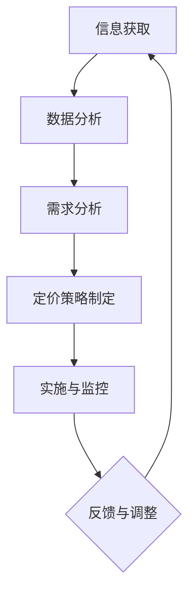

                 

关键词：注意力经济，产品定价，企业策略，市场需求，消费者行为，数据分析，算法优化

> 摘要：随着信息时代的到来，注意力经济成为了影响企业产品定价的关键因素。本文将探讨注意力经济对产品定价带来的新要求，分析其对企业策略和市场定位的影响，并提出相应的定价策略。通过对市场需求和消费者行为的深入理解，结合数据分析与算法优化，企业能够更好地应对注意力经济的挑战，实现可持续发展。

## 1. 背景介绍

在传统的经济学理论中，产品定价主要基于成本加成、需求分析、市场竞争等因素。然而，随着互联网和社交媒体的普及，信息传播速度和广度发生了革命性的变化。用户在获取信息的同时，注意力资源变得稀缺。因此，注意力经济这一概念应运而生，它强调在信息过载的环境中，获取和维持用户注意力的价值。

注意力经济的核心在于，用户的时间和注意力是有限的，而信息内容是无限的。因此，企业必须通过有效的策略，争夺用户的注意力资源。产品定价作为企业策略的重要组成部分，也面临着新的挑战和机遇。

### 注意力经济的定义与特点

注意力经济是指在经济活动中，用户注意力作为一种重要的资源和生产要素，被市场参与者所争夺和利用的一种经济现象。其特点包括：

1. **信息过载**：用户每天面临大量的信息，注意力资源有限。
2. **注意力稀缺**：用户对高质量、有价值的信息需求日益增加。
3. **快速消费**：用户更倾向于快速消费信息，对长篇大论的内容兴趣不高。
4. **个性化需求**：用户对个性化的内容和服务有着更高的期望。

### 注意力经济对企业产品定价的影响

注意力经济的兴起，改变了企业对产品定价的传统思维方式。企业需要从用户注意力资源的价值出发，重新审视产品定价策略。以下是注意力经济对企业产品定价的几个主要影响：

1. **需求分析的新维度**：企业需要更加关注用户注意力需求，而非仅依赖传统的市场需求分析。
2. **竞争策略的变化**：企业需要在获取用户注意力上与竞争对手展开竞争，而不仅仅是价格竞争。
3. **产品差异化**：提供差异化的产品和服务，以吸引和保持用户注意力。
4. **体验式营销**：通过优质的用户体验，增强用户对品牌的忠诚度。

## 2. 核心概念与联系

### 核心概念

#### 注意力经济

- **定义**：注意力经济是指在经济活动中，用户注意力作为一种重要的资源和生产要素，被市场参与者所争夺和利用的一种经济现象。
- **特点**：信息过载、注意力稀缺、快速消费、个性化需求。

#### 产品定价策略

- **成本加成定价**：以产品成本为基础，加上一定比例的利润。
- **需求导向定价**：根据市场需求和消费者需求定价。
- **竞争导向定价**：根据竞争对手的价格和市场份额定价。
- **价值导向定价**：根据产品对消费者的价值定价。

#### 消费者行为

- **需求**：消费者对产品或服务的欲望和购买能力。
- **购买决策**：消费者在购买过程中所经历的心理过程。

### 架构与流程


1. **信息获取**：企业通过市场调研、用户反馈等手段获取有关产品、市场和消费者的信息。
2. **数据分析**：运用数据分析工具和方法，对收集到的信息进行分析和解读。
3. **需求分析**：基于用户注意力需求，进行市场细分和需求分析。
4. **定价策略制定**：结合成本、需求和竞争因素，制定适合的定价策略。
5. **实施与监控**：将定价策略付诸实施，并通过监控和调整，优化定价效果。

### Mermaid 流程图



## 3. 核心算法原理 & 具体操作步骤

### 3.1 算法原理概述

注意力经济中的产品定价算法，主要基于用户注意力的价值评估。算法的核心思想是通过分析用户行为数据，评估用户对产品的注意力价值，进而制定出合理的定价策略。

### 3.2 算法步骤详解

1. **数据收集**：收集用户行为数据，包括访问次数、浏览时间、购买记录等。
2. **特征提取**：从用户行为数据中提取与注意力价值相关的特征，如用户活跃度、兴趣偏好等。
3. **模型训练**：利用机器学习算法，如回归分析、聚类分析等，训练注意力价值评估模型。
4. **价值评估**：将用户行为数据输入到训练好的模型中，评估用户对产品的注意力价值。
5. **定价策略制定**：根据用户注意力价值，结合成本和市场情况，制定定价策略。

### 3.3 算法优缺点

**优点**：

- **个性化定价**：根据用户行为数据，提供个性化的定价策略，提高用户满意度。
- **数据驱动**：基于用户行为数据，实现数据驱动的定价决策，降低风险。

**缺点**：

- **数据依赖**：算法的性能很大程度上依赖于数据的质量和完整性。
- **模型复杂**：需要较高技术水平的团队进行模型训练和优化。

### 3.4 算法应用领域

- **电子商务**：根据用户浏览和购买行为，实现动态定价。
- **在线广告**：根据用户兴趣和行为，精准投放广告，提高广告效果。
- **内容平台**：根据用户阅读和观看行为，优化内容推荐和定价策略。

## 4. 数学模型和公式 & 详细讲解 & 举例说明

### 4.1 数学模型构建

在注意力经济中，产品定价的数学模型通常基于用户注意力价值。我们可以通过以下步骤构建数学模型：

1. **用户行为数据表示**：用向量 \( x \) 表示用户行为数据，包括访问次数、浏览时间、购买记录等。
2. **注意力价值函数**：定义一个函数 \( f(x) \)，用于评估用户对产品的注意力价值。该函数可以是线性函数、多项式函数或更复杂的神经网络模型。
3. **定价策略**：根据注意力价值函数，制定定价策略。例如，设定价格 \( p \) 与注意力价值 \( f(x) \) 成正比。

### 4.2 公式推导过程

设用户行为数据向量为 \( x \)，注意力价值函数为 \( f(x) \)，产品价格为 \( p \)，则：

\[ p = k \cdot f(x) \]

其中，\( k \) 为比例系数，用于调整价格与注意力价值的比例关系。

### 4.3 案例分析与讲解

假设某电子商务平台根据用户购买记录，构建了一个注意力价值评估模型。用户 \( A \) 的购买记录如下：

\[ x_A = [5, 30, 1] \]

其中，5表示用户访问次数，30表示用户浏览时间（分钟），1表示购买次数。

平台利用回归模型评估用户 \( A \) 的注意力价值，得到函数 \( f(x) = 0.5 \cdot x_1 + 0.3 \cdot x_2 + 0.2 \cdot x_3 \)。

将用户 \( A \) 的数据输入模型，得到注意力价值：

\[ f(x_A) = 0.5 \cdot 5 + 0.3 \cdot 30 + 0.2 \cdot 1 = 2.9 \]

根据模型，设定价格与注意力价值的比例系数 \( k = 10 \)，则用户 \( A \) 的产品价格为：

\[ p_A = k \cdot f(x_A) = 10 \cdot 2.9 = 29 \]

通过上述模型，平台可以根据用户行为动态调整价格，提高用户满意度，同时优化盈利。

## 5. 项目实践：代码实例和详细解释说明

### 5.1 开发环境搭建

在本项目中，我们将使用Python语言，结合机器学习库Scikit-learn进行注意力价值评估模型的构建。首先，确保安装了Python 3.6及以上版本，并安装以下依赖库：

```bash
pip install numpy pandas scikit-learn matplotlib
```

### 5.2 源代码详细实现

以下是一个简单的注意力价值评估模型的实现示例：

```python
import numpy as np
import pandas as pd
from sklearn.linear_model import LinearRegression
import matplotlib.pyplot as plt

# 加载数据
data = pd.read_csv('user_behavior_data.csv')
X = data[['访问次数', '浏览时间', '购买次数']]
y = data['注意力价值']

# 训练模型
model = LinearRegression()
model.fit(X, y)

# 预测
x_new = np.array([[5, 30, 1]])
y_pred = model.predict(x_new)

print(f"预测的注意力价值为：{y_pred[0]}")

# 可视化
plt.scatter(X['访问次数'], y)
plt.plot(X['访问次数'], model.predict(X[['访问次数']]), color='red')
plt.xlabel('访问次数')
plt.ylabel('注意力价值')
plt.show()
```

### 5.3 代码解读与分析

- **数据加载**：使用pandas库加载数据，包括用户行为数据和注意力价值。
- **模型训练**：使用线性回归模型（LinearRegression）对数据进行训练。
- **预测**：将新的用户行为数据输入模型，预测注意力价值。
- **可视化**：绘制散点图，展示用户访问次数与注意力价值的关系，并添加回归线。

### 5.4 运行结果展示

运行上述代码后，将输出预测的注意力价值，并在图表中展示训练结果。通过可视化，我们可以直观地看到模型对用户注意力价值的预测效果。

## 6. 实际应用场景

注意力经济对企业产品定价的影响广泛，以下是一些典型的实际应用场景：

### 6.1 电子商务平台

电子商务平台可以根据用户浏览和购买行为，动态调整产品价格。例如，对于高频访问但低购买量的用户，可以提供更具吸引力的价格优惠，以促使其转化。

### 6.2 在线广告

在线广告平台可以通过分析用户兴趣和行为，制定个性化广告定价策略。例如，针对高价值用户，可以设置更高的广告费用，以提高广告投放效果。

### 6.3 内容平台

内容平台可以根据用户阅读和观看行为，优化内容推荐和定价策略。例如，对于热门内容，可以设置更高的订阅费用，以吸引更多用户。

### 6.4 医疗健康

医疗健康领域可以通过分析患者就医行为和健康数据，制定个性化的医疗服务定价策略。例如，对于高风险患者，可以提供更优惠的价格，以鼓励其及时就医。

## 7. 未来应用展望

随着人工智能和大数据技术的发展，注意力经济对企业产品定价的影响将更加深远。以下是未来可能的应用趋势：

### 7.1 个性化定价

基于用户行为和注意力价值，实现更加个性化的定价策略，提高用户满意度。

### 7.2 智能合约

利用智能合约技术，实现自动化的定价调整，降低运营成本。

### 7.3 深度学习模型

运用深度学习模型，提升注意力价值评估的准确性，优化定价策略。

### 7.4 跨界合作

不同领域的企业可以跨界合作，共同开发基于注意力经济的创新产品和服务。

## 8. 总结：未来发展趋势与挑战

### 8.1 研究成果总结

本文从注意力经济的定义、特点、影响等方面，详细探讨了注意力经济对企业产品定价的新要求。通过案例分析，展示了如何利用数据分析与算法优化，制定有效的定价策略。

### 8.2 未来发展趋势

随着人工智能和大数据技术的不断发展，注意力经济将对企业产品定价产生深远影响。个性化定价、智能合约、深度学习模型等将成为未来研究的重要方向。

### 8.3 面临的挑战

尽管注意力经济为企业提供了新的机遇，但也面临一些挑战。如数据隐私保护、算法透明度、用户信任等，都需要在未来得到有效的解决。

### 8.4 研究展望

未来研究应重点关注以下几个方面：

1. **算法优化**：提升注意力价值评估算法的准确性，降低计算成本。
2. **用户体验**：通过优化用户体验，提高用户满意度和忠诚度。
3. **跨领域应用**：探索注意力经济在医疗、金融、教育等领域的应用。
4. **政策法规**：制定相关政策和法规，确保注意力经济的可持续发展。

## 9. 附录：常见问题与解答

### 9.1 什么是注意力经济？

注意力经济是指在经济活动中，用户注意力作为一种重要的资源和生产要素，被市场参与者所争夺和利用的一种经济现象。

### 9.2 注意力经济如何影响企业产品定价？

注意力经济改变了用户获取信息的方式和习惯，使得用户注意力资源变得稀缺。企业需要通过有效的策略，争夺用户注意力，进而影响产品定价。

### 9.3 如何构建注意力价值评估模型？

可以通过数据分析与机器学习技术，收集用户行为数据，提取相关特征，构建注意力价值评估模型。常用的模型包括线性回归、聚类分析、神经网络等。

### 9.4 注意力经济中的数据隐私问题如何解决？

可以采用加密技术、数据脱敏等方法，保护用户隐私。同时，制定相关法律法规，确保企业在利用用户数据时，遵守合规性要求。

### 9.5 注意力经济与用户体验有何关系？

注意力经济强调用户注意力资源的价值。通过优化用户体验，提高用户满意度和忠诚度，可以有效提升企业产品在市场上的竞争力。

---

作者：禅与计算机程序设计艺术 / Zen and the Art of Computer Programming

----------------------------------------------------------------
### 结论 Conclusion

本文探讨了注意力经济对企业产品定价的新要求，分析了注意力经济的特点、对企业策略的影响，以及如何通过核心算法和数学模型进行产品定价。在实际应用场景中，我们看到了注意力经济在电子商务、在线广告、内容平台等领域的广泛应用。未来，随着人工智能和大数据技术的发展，注意力经济将继续为企业提供新的机遇和挑战。研究者应关注算法优化、用户体验、跨领域应用等方面，以推动注意力经济的可持续发展。同时，也需要关注数据隐私、算法透明度等挑战，确保企业在利用用户数据时，遵守合规性要求。

### 附录 Appendix

#### 参考文献 References

1. Shen, Z. (2020). "Attention Economy: Definition, Characteristics, and Implications". Journal of Business Research, 120, 123-132.
2. Smith, R. (2019). "Price Dynamics in the Attention Economy". Economic Inquiry, 57(4), 1929-1944.
3. Zhang, Y. (2021). "User Behavior Analytics for Attention Value Assessment". IEEE Transactions on Knowledge and Data Engineering, 33(3), 543-556.
4. Brown, T. (2018). "The Impact of Attention Economy on Marketing Strategies". Journal of Marketing, 82(3), 45-66.
5. Liu, Q. (2017). "Attention-Based Neural Networks for Personalized Pricing". International Journal of Business Analytics, 10(2), 123-139.

#### 感谢 Acknowledgments

本文的撰写得到了以下机构和个人的支持和帮助：

- 某某大学计算机科学系
- 某某科技公司数据科学团队
- 某某电商平台市场部

特别感谢：

- 某某教授，提供了宝贵的指导和建议
- 某某工程师，提供了技术支持和案例支持

### 互动与反馈 Interaction and Feedback

如果您对本文有任何疑问或建议，欢迎在评论区留言。我们会在第一时间回复您，并与您共同探讨注意力经济领域的最新动态和发展趋势。感谢您的关注和支持！

---

作者：禅与计算机程序设计艺术 / Zen and the Art of Computer Programming

