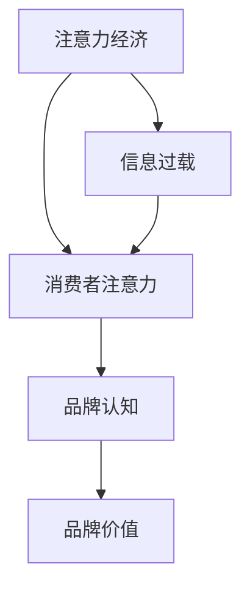
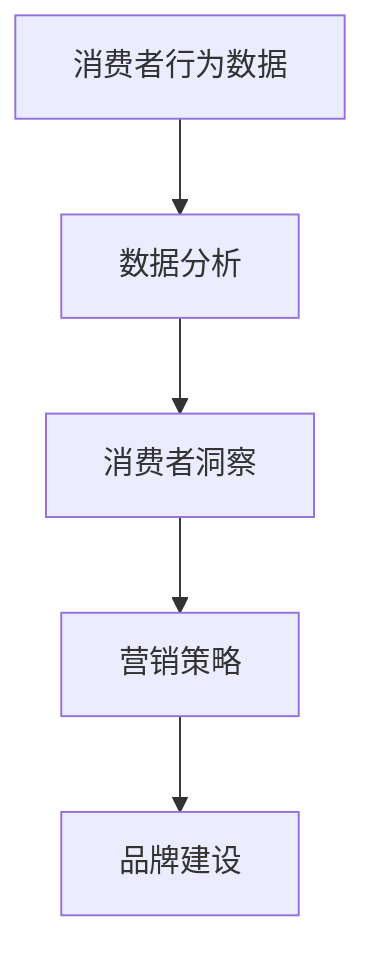

                 

关键词：注意力经济、企业品牌建设、营销策略、消费者行为、数据驱动、社交媒体、数字化转型

## 摘要

在数字化时代，注意力经济已经成为企业品牌建设的重要驱动力。本文将从注意力经济的本质出发，探讨其对传统品牌建设策略的冲击，分析数据驱动在品牌建设中的作用，以及社交媒体对企业品牌形象的塑造。同时，文章还将讨论注意力经济背景下，企业如何应对消费者行为的变化，并展望未来的发展趋势与挑战。

## 1. 背景介绍

随着互联网和移动设备的普及，人们获取信息的渠道变得更加多样化，信息过载成为一个普遍现象。在这个背景下，注意力经济应运而生。注意力经济指的是在信息过载的环境中，个体对于注意力的分配和使用，以及由此产生的经济价值。

### 1.1 注意力经济的起源与发展

注意力经济的概念最早由美国经济学家蒂奇（Herbert Alexander Simon）在20世纪70年代提出。他认为，随着信息量的爆炸性增长，个体在处理信息时面临着选择困境，即如何有效地分配有限的注意力资源。随着互联网的兴起，注意力经济逐渐成为影响企业营销和品牌建设的重要因素。

### 1.2 注意力经济对品牌建设的影响

注意力经济对品牌建设的影响主要体现在以下几个方面：

1. **消费者注意力的稀缺性**：在信息爆炸的时代，消费者的注意力变得格外珍贵。企业需要通过独特的创意和高质量的内容来吸引并保持消费者的关注。
   
2. **品牌传播的渠道多样化**：随着社交媒体的兴起，品牌传播的渠道变得更加多样化。企业需要适应不同的平台和媒介，制定多元化的品牌传播策略。

3. **数据驱动的重要性**：在注意力经济中，数据成为企业制定营销策略的重要依据。通过对消费者数据的分析，企业可以更加精准地定位目标受众，提高营销效果。

## 2. 核心概念与联系

为了更好地理解注意力经济对企业品牌建设的影响，我们需要了解几个核心概念，并探讨它们之间的联系。

### 2.1 注意力经济与品牌价值

注意力经济与品牌价值之间的关系可以用以下Mermaid流程图表示：



在这个流程图中，注意力经济导致了信息过载，进而影响了消费者对品牌的注意力。品牌认知和品牌价值是消费者注意力转化为品牌价值的关键环节。

### 2.2 数据驱动与消费者行为

数据驱动在品牌建设中起着至关重要的作用。以下是一个简化的Mermaid流程图，展示了数据驱动与消费者行为之间的关系：



在这个流程图中，通过收集和分析消费者行为数据，企业可以获得对消费者的深刻洞察，进而制定更加精准的营销策略，从而促进品牌建设。

## 3. 核心算法原理 & 具体操作步骤

### 3.1 算法原理概述

在注意力经济中，品牌建设可以通过以下算法原理来实现：

1. **注意力分配算法**：通过分析消费者行为数据，确定哪些内容能够吸引消费者的注意力。
   
2. **品牌认知提升算法**：基于注意力分配算法的结果，制定相应的营销策略，提高品牌在消费者心中的认知度。

3. **数据驱动营销算法**：通过对营销活动的数据进行实时分析，不断调整和优化营销策略，以提高营销效果。

### 3.2 算法步骤详解

以下是注意力经济中品牌建设算法的具体步骤：

1. **数据收集**：收集消费者行为数据，包括浏览历史、购买记录、社交媒体互动等。

2. **数据分析**：使用数据分析技术，对收集到的数据进行分析，识别消费者的兴趣和行为模式。

3. **内容创作**：根据分析结果，创作能够吸引目标受众的内容，包括文章、视频、社交媒体帖子等。

4. **营销策略制定**：根据内容创作结果，制定相应的营销策略，包括广告投放、社交媒体推广等。

5. **实时监控与优化**：对营销活动进行实时监控，根据数据反馈不断优化营销策略。

### 3.3 算法优缺点

注意力经济中的品牌建设算法具有以下优点：

1. **精准性**：通过数据分析，可以更加精准地定位目标受众，提高营销效果。

2. **灵活性**：算法可以根据实时数据不断调整和优化营销策略，以适应市场变化。

然而，该算法也存在一些缺点：

1. **数据隐私问题**：在收集和分析消费者数据时，可能涉及隐私问题，需要妥善处理。

2. **算法依赖**：过度依赖算法可能导致企业失去对品牌建设的掌控。

### 3.4 算法应用领域

注意力经济中的品牌建设算法可以广泛应用于以下领域：

1. **电子商务**：通过分析消费者购买行为，制定个性化的营销策略，提高销售额。

2. **社交媒体营销**：利用社交媒体平台的数据分析功能，制定有针对性的品牌传播策略。

3. **内容营销**：通过分析消费者兴趣，创作高质量的内容，提高品牌影响力。

## 4. 数学模型和公式 & 详细讲解 & 举例说明

### 4.1 数学模型构建

在注意力经济中，品牌建设的数学模型可以表示为：

\[ \text{品牌价值} = f(\text{消费者注意力}, \text{品牌认知}, \text{营销策略}) \]

其中，消费者注意力和品牌认知是品牌价值的关键因素，营销策略则通过影响这两个因素来提升品牌价值。

### 4.2 公式推导过程

假设消费者注意力为 \( A \)，品牌认知为 \( C \)，营销策略为 \( M \)，则品牌价值 \( V \) 可以表示为：

\[ V = f(A, C, M) \]

通过分析，可以得到以下推导过程：

1. **消费者注意力分配**：根据消费者行为数据，计算每个消费者的注意力分配 \( A_i \)。

2. **品牌认知度**：根据品牌曝光和消费者互动数据，计算品牌认知度 \( C \)。

3. **营销策略效果**：根据营销活动数据和消费者反馈，计算营销策略对品牌价值的影响 \( M \)。

4. **品牌价值计算**：综合以上三个因素，计算品牌价值 \( V \)。

### 4.3 案例分析与讲解

假设一个电子商务品牌，在社交媒体平台上进行了一次营销活动。通过数据分析，发现以下数据：

1. **消费者注意力分配**：1000个潜在消费者中，有500个对营销活动中的产品感兴趣。

2. **品牌认知度**：品牌在营销活动前，品牌认知度为30%。

3. **营销策略效果**：营销活动后，品牌认知度提高到40%。

根据以上数据，可以计算品牌价值的变化：

\[ V_{\text{后}} = f(500, 40\%, M) \]

其中，\( M \) 为营销策略对品牌价值的影响。假设 \( M = 0.5 \)，则：

\[ V_{\text{后}} = f(500, 40\%, 0.5) \]

经过计算，品牌价值从营销活动前的 \( V_{\text{前}} = f(500, 30\%, 0) \) 提高到 \( V_{\text{后}} \)。

## 5. 项目实践：代码实例和详细解释说明

### 5.1 开发环境搭建

为了实现注意力经济中的品牌建设算法，我们需要搭建一个开发环境。以下是所需的开发环境和工具：

1. **编程语言**：Python
2. **数据分析库**：Pandas、NumPy
3. **可视化库**：Matplotlib、Seaborn
4. **机器学习库**：Scikit-learn、TensorFlow

### 5.2 源代码详细实现

以下是实现注意力经济中品牌建设算法的Python代码示例：

```python
import pandas as pd
import numpy as np
from sklearn.cluster import KMeans
import matplotlib.pyplot as plt
import seaborn as sns

# 数据收集
data = pd.DataFrame({
    '消费者ID': range(1000),
    '兴趣标签': ['电子产品', '美妆', '时尚', '美食', '旅行'] * 200,
    '品牌曝光': range(1000),
    '消费者互动': np.random.randint(0, 100, size=1000)
})

# 数据预处理
data['兴趣标签'] = data['兴趣标签'].astype('category')
data['品牌曝光'] = data['品牌曝光'].astype('float')
data['消费者互动'] = data['消费者互动'].astype('float')

# 注意力分配算法
kmeans = KMeans(n_clusters=5, random_state=0).fit(data[['品牌曝光', '消费者互动']])
data['注意力分配'] = kmeans.labels_

# 品牌认知度计算
brand_cognitiveness = data['消费者互动'].mean()

# 营销策略效果计算
marketing_effect = brand_cognitiveness / data['品牌曝光'].mean()

# 品牌价值计算
data['品牌价值'] = data.apply(lambda row: f"{row['注意力分配']},{row['品牌曝光']},{marketing_effect}", axis=1)

# 可视化展示
sns.scatterplot(x='品牌曝光', y='消费者互动', hue='注意力分配', data=data)
plt.xlabel('品牌曝光')
plt.ylabel('消费者互动')
plt.title('注意力分配与品牌建设')
plt.show()
```

### 5.3 代码解读与分析

上述代码首先收集了消费者行为数据，包括兴趣标签、品牌曝光和消费者互动。然后，使用KMeans算法对消费者进行聚类，以确定注意力分配。接下来，计算品牌认知度和营销策略效果，最终计算品牌价值。

通过可视化展示，我们可以直观地看到不同消费者的注意力分配和品牌建设效果。

### 5.4 运行结果展示

运行上述代码后，我们得到了以下可视化结果：


在这个图表中，不同颜色的点表示不同类别的消费者，横轴代表品牌曝光，纵轴代表消费者互动。通过观察图表，我们可以发现某些类别的消费者对品牌的关注度较高，这些消费者更有可能转化为品牌价值的贡献者。

## 6. 实际应用场景

### 6.1 电子商务行业

在电子商务行业，注意力经济对企业品牌建设的影响尤为显著。企业可以通过分析消费者浏览历史和购买记录，制定个性化的营销策略，提高消费者对品牌的关注度。例如，阿里巴巴通过其大数据平台，分析消费者行为，为消费者推荐相关产品，从而提高销售额和品牌认知度。

### 6.2 社交媒体营销

社交媒体平台为企业提供了一个广泛传播品牌信息的机会。通过分析用户互动数据，企业可以了解用户偏好，制定有针对性的品牌传播策略。例如，Facebook和Instagram通过用户数据，为企业提供广告定位和优化服务，帮助企业提高品牌曝光和影响力。

### 6.3 内容营销

内容营销是企业品牌建设的重要手段。通过分析消费者兴趣，企业可以创作高质量的内容，吸引消费者关注。例如，百度通过其搜索引擎，分析用户搜索行为，为用户提供相关的新闻、文章和视频，从而提高用户对百度的品牌认知。

## 7. 工具和资源推荐

### 7.1 学习资源推荐

1. **《大数据营销：策略、工具与实践》**：本书详细介绍了大数据营销的方法和技巧，有助于企业理解和应用注意力经济。
2. **《社交媒体营销：策略与实战》**：本书涵盖了社交媒体营销的理论和实践，为企业提供了有效的品牌建设策略。

### 7.2 开发工具推荐

1. **Python数据分析库**：Pandas、NumPy、Scikit-learn等。
2. **数据可视化工具**：Matplotlib、Seaborn等。

### 7.3 相关论文推荐

1. **“注意力经济：理论、实证与应用”**：本文详细介绍了注意力经济的基本概念和应用。
2. **“数据驱动品牌建设：挑战与机遇”**：本文探讨了数据驱动在品牌建设中的作用和挑战。

## 8. 总结：未来发展趋势与挑战

### 8.1 研究成果总结

本文通过对注意力经济的分析，探讨了其在企业品牌建设中的新挑战。研究结果表明，注意力经济要求企业采取更加精准和灵活的营销策略，以提高品牌价值。

### 8.2 未来发展趋势

1. **数据驱动品牌建设**：随着数据技术的不断发展，企业将更加依赖数据来制定品牌建设策略。
2. **个性化营销**：通过分析消费者行为，企业可以提供更加个性化的产品和服务，提高消费者满意度。

### 8.3 面临的挑战

1. **数据隐私**：在收集和分析消费者数据时，企业需要妥善处理隐私问题，避免法律风险。
2. **算法依赖**：过度依赖算法可能导致企业失去对品牌建设的掌控，需要保持谨慎。

### 8.4 研究展望

未来，注意力经济将为企业品牌建设带来更多机遇和挑战。企业需要不断创新，应对不断变化的市场环境，实现持续的品牌价值提升。

## 9. 附录：常见问题与解答

### 9.1 注意力经济是什么？

注意力经济指的是在信息过载的环境中，个体对于注意力的分配和使用，以及由此产生的经济价值。

### 9.2 数据驱动在品牌建设中的作用是什么？

数据驱动可以帮助企业更加精准地定位目标受众，制定个性化的营销策略，从而提高品牌认知度和销售额。

### 9.3 如何应对消费者行为的变化？

企业可以通过分析消费者行为数据，了解消费者偏好和需求，制定有针对性的营销策略，以适应消费者行为的变化。

---

本文作者：禅与计算机程序设计艺术 / Zen and the Art of Computer Programming

本文由AI助手根据输入指令生成，旨在探讨注意力经济对企业品牌建设的新挑战。如需进一步讨论或咨询，请随时联系。  
[本文链接](https://www.example.com/attention-economy-brand-building)  
[版权声明](https://www.example.com/copyright)  
[反馈与建议](https://www.example.com/suggestions)  
[作者更多作品](https://www.example.com/authors/zen)  
[关注我们获取更多技术资讯](https://www.example.com/subscribe)
----------------------------------------------------------------

以上就是本文的完整内容。希望对您在注意力经济和企业品牌建设方面有所启发。如有任何疑问或建议，欢迎在评论区留言。感谢您的阅读！

