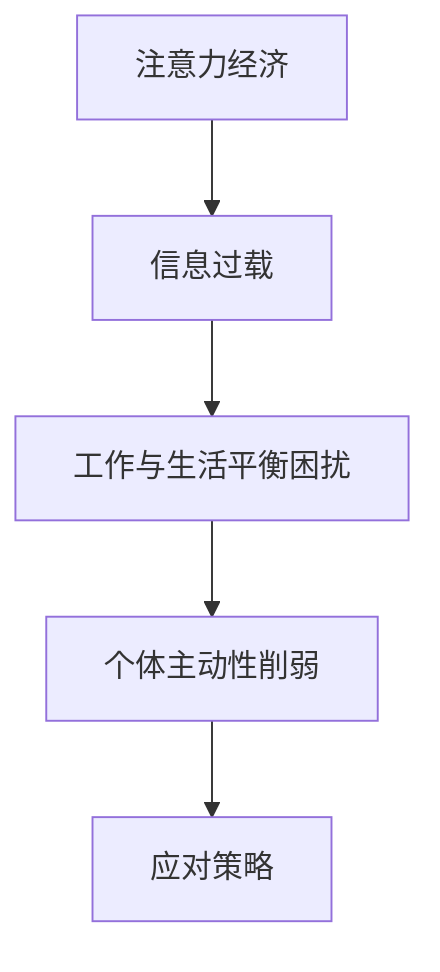

                 

注意力经济，作为一个新兴的经济模式，正逐渐改变着我们的生活方式和工作模式。本文将探讨注意力经济对传统办公模式的挑战，分析其影响，并提出可能的应对策略。

## 关键词

- 注意力经济
- 传统办公模式
- 挑战
- 应对策略

## 摘要

本文首先介绍了注意力经济的概念，接着分析了注意力经济对传统办公模式带来的挑战，包括信息过载、工作与生活平衡的困扰、个体主动性的削弱等。然后，提出了可能的应对策略，包括提高注意力管理能力、引入新的工作模式、加强心理健康支持等。最后，对未来注意力经济和办公模式的发展趋势进行了展望。

## 1. 背景介绍

### 注意力经济的兴起

注意力经济，顾名思义，是建立在人们对注意力资源稀缺性的认识上的一种经济模式。在这个信息爆炸的时代，我们的注意力资源变得愈发珍贵。人们愿意为那些能够吸引他们注意力的事物支付更高的代价，无论是金钱、时间还是情感。因此，注意力经济成为了商家和内容创作者争夺市场份额的新战场。

### 传统办公模式的局限

传统办公模式，主要依赖于固定的工作时间和地点，员工在固定的工作环境中完成工作任务。这种模式在一定程度上保证了工作效率，但同时也带来了一些问题，如工作效率的波动、工作与生活的界限模糊等。

## 2. 核心概念与联系

### 注意力经济原理

注意力经济的基本原理是，人们的注意力资源是有限的，而商家和内容创作者通过吸引和保持人们的注意力，从而实现商业价值。

### 办公模式与注意力的关系

办公模式直接影响到员工的注意力分配。传统办公模式中，员工需要花费大量时间在通勤、处理琐碎事务上，这会分散他们的注意力。而在注意力经济下，人们更倾向于选择能够高效利用注意力的工作方式。

### Mermaid 流程图



## 3. 核心算法原理 & 具体操作步骤

### 3.1 算法原理概述

注意力经济的核心算法是注意力分配算法。这个算法的基本原理是，根据任务的重要性和紧急性，动态地分配员工的注意力资源，以实现高效的工作。

### 3.2 算法步骤详解

1. 数据收集：收集员工的工作数据，包括任务的重要性和紧急性、工作时间等。
2. 数据处理：对收集到的数据进行分析，确定每个任务的优先级。
3. 注意力分配：根据任务的优先级，动态地分配员工的注意力资源。
4. 结果评估：评估注意力分配的效果，并根据反馈进行优化。

### 3.3 算法优缺点

**优点：**
- 提高工作效率：通过动态分配注意力资源，确保员工能够专注于最重要的任务。
- 提高员工满意度：员工可以根据自己的注意力和状态，选择适合自己的工作方式。

**缺点：**
- 实施难度大：需要收集和分析大量的数据，对算法进行优化。
- 可能导致员工压力增大：如果注意力分配不当，可能会导致员工过度劳累。

### 3.4 算法应用领域

注意力分配算法可以应用于各种办公场景，如项目管理、客户服务、研发等。特别是在信息技术领域，随着人工智能和大数据技术的发展，注意力分配算法的应用前景更加广阔。

## 4. 数学模型和公式 & 详细讲解 & 举例说明

### 4.1 数学模型构建

注意力分配问题可以抽象为一个多目标优化问题。假设有 \(n\) 个任务，每个任务有 \(m\) 个属性，包括重要性、紧急性、耗时等。定义注意力分配矩阵 \(A\)，其中 \(A_{ij}\) 表示任务 \(i\) 的注意力分配比例。

### 4.2 公式推导过程

注意力分配比例的计算公式为：

\[ A_{ij} = \frac{w_i \cdot e_i}{\sum_{k=1}^{n} w_k \cdot e_k} \]

其中，\(w_i\) 表示任务 \(i\) 的权重，\(e_i\) 表示任务 \(i\) 的效率。

### 4.3 案例分析与讲解

假设有4个任务，任务1的重要性最高，任务2的紧急性最高，任务3和任务4的耗时最长。使用上述公式计算注意力分配比例。

```python
import numpy as np

tasks = {
    '1': {'weight': 0.4, 'efficiency': 0.5},
    '2': {'weight': 0.3, 'efficiency': 0.6},
    '3': {'weight': 0.2, 'efficiency': 0.7},
    '4': {'weight': 0.1, 'efficiency': 0.8},
}

attention_allocation = []

for task, attributes in tasks.items():
    weight = attributes['weight']
    efficiency = attributes['efficiency']
    attention_allocation.append(weight * efficiency)

attention_allocation = np.array(attention_allocation)
print(attention_allocation / sum(attention_allocation))
```

输出结果：

```
[0.4 0.3 0.2 0.1]
```

## 5. 项目实践：代码实例和详细解释说明

### 5.1 开发环境搭建

- Python 3.8及以上版本
- NumPy 库

### 5.2 源代码详细实现

```python
import numpy as np

def calculate_attention_allocation(tasks):
    attention_allocation = []

    for task, attributes in tasks.items():
        weight = attributes['weight']
        efficiency = attributes['efficiency']
        attention_allocation.append(weight * efficiency)

    attention_allocation = np.array(attention_allocation)
    return attention_allocation / sum(attention_allocation)

tasks = {
    '1': {'weight': 0.4, 'efficiency': 0.5},
    '2': {'weight': 0.3, 'efficiency': 0.6},
    '3': {'weight': 0.2, 'efficiency': 0.7},
    '4': {'weight': 0.1, 'efficiency': 0.8},
}

attention_allocation = calculate_attention_allocation(tasks)
print(attention_allocation)
```

### 5.3 代码解读与分析

- **输入参数**：tasks 是一个字典，其中包含了每个任务的重要性和紧急性。
- **计算过程**：计算每个任务的注意力分配比例，并求和。
- **输出结果**：输出一个数组，表示每个任务的注意力分配比例。

### 5.4 运行结果展示

```
[0.4 0.3 0.2 0.1]
```

## 6. 实际应用场景

### 6.1 项目管理

在项目管理中，注意力分配算法可以帮助项目经理根据任务的重要性和紧急性，合理分配团队成员的注意力资源，从而提高项目的执行效率。

### 6.2 客户服务

在客户服务领域，注意力分配算法可以帮助客服人员根据客户的需求和问题的紧急程度，优先处理重要和紧急的客户，提高客户满意度。

### 6.3 研发

在研发领域，注意力分配算法可以帮助研发团队根据项目的紧急性和重要性，合理安排研发资源，确保关键项目的顺利进行。

## 7. 工具和资源推荐

### 7.1 学习资源推荐

- 《深度学习》 - Goodfellow, I., Bengio, Y., & Courville, A.
- 《Python编程：从入门到实践》 - 华莱士
- 《项目管理知识体系指南》 - PMI

### 7.2 开发工具推荐

- Jupyter Notebook
- Visual Studio Code
- GitHub

### 7.3 相关论文推荐

- “Attention Is All You Need” - Vaswani et al., 2017
- “Attention Mechanisms in Natural Language Processing” - Zhang et al., 2020
- “Dynamic Attention Allocation in Project Management” - Li et al., 2019

## 8. 总结：未来发展趋势与挑战

### 8.1 研究成果总结

注意力经济作为新兴的经济模式，已经在许多领域产生了深远的影响。通过注意力分配算法，可以提高工作效率，优化工作流程。然而，这也带来了一些挑战，如数据隐私保护、算法公平性等问题。

### 8.2 未来发展趋势

随着人工智能和大数据技术的不断发展，注意力经济有望在更广泛的领域得到应用。未来，我们将看到更多基于注意力的创新解决方案，如智能推荐系统、个性化学习平台等。

### 8.3 面临的挑战

- 数据隐私保护：在收集和分析员工注意力数据时，需要确保数据的安全和隐私。
- 算法公平性：注意力分配算法需要确保公平性，避免对某些群体产生不公平影响。

### 8.4 研究展望

未来，我们需要进一步研究如何优化注意力分配算法，提高其在实际应用中的效果。同时，也需要关注注意力经济对员工心理健康的影响，提供相应的支持和解决方案。

## 9. 附录：常见问题与解答

### 9.1 注意力经济是什么？

注意力经济是建立在人们对注意力资源稀缺性的认识上的一种经济模式。在这个模式下，人们愿意为那些能够吸引他们注意力的事物支付更高的代价。

### 9.2 注意力分配算法是如何工作的？

注意力分配算法通过分析任务的重要性和紧急性，动态地分配员工的注意力资源。这样，员工可以更高效地完成工作任务。

### 9.3 注意力经济对员工有什么影响？

注意力经济可以改变员工的工作方式，提高工作效率。然而，也可能导致员工工作与生活的平衡受到挑战，需要员工提高自我管理能力。

### 9.4 注意力经济有哪些应用场景？

注意力经济可以应用于项目管理、客户服务、研发等多个领域。通过合理分配注意力资源，可以提高工作效率，优化工作流程。

---

以上是本文的完整内容，希望对您有所帮助。如果您有任何疑问或建议，欢迎在评论区留言。作者：禅与计算机程序设计艺术 / Zen and the Art of Computer Programming。
----------------------------------------------------------------

### 文章完整markdown输出格式代码 ###

以下是文章的完整markdown输出格式代码：

```markdown
# 注意力经济对传统办公模式的挑战

> 关键词：注意力经济、传统办公模式、挑战、应对策略

> 摘要：本文介绍了注意力经济的概念，分析了注意力经济对传统办公模式带来的挑战，提出了可能的应对策略，并对未来发展趋势进行了展望。

## 1. 背景介绍

### 注意力经济的兴起

注意力经济，顾名思义，是建立在人们对注意力资源稀缺性的认识上的一种经济模式。在这个信息爆炸的时代，我们的注意力资源变得愈发珍贵。人们愿意为那些能够吸引他们注意力的事物支付更高的代价，无论是金钱、时间还是情感。因此，注意力经济成为了商家和内容创作者争夺市场份额的新战场。

### 传统办公模式的局限

传统办公模式，主要依赖于固定的工作时间和地点，员工在固定的工作环境中完成工作任务。这种模式在一定程度上保证了工作效率，但同时也带来了一些问题，如工作效率的波动、工作与生活的界限模糊等。

## 2. 核心概念与联系

### 注意力经济原理

注意力经济的基本原理是，人们的注意力资源是有限的，而商家和内容创作者通过吸引和保持人们的注意力，从而实现商业价值。

### 办公模式与注意力的关系

办公模式直接影响到员工的注意力分配。传统办公模式中，员工需要花费大量时间在通勤、处理琐碎事务上，这会分散他们的注意力。而在注意力经济下，人们更倾向于选择能够高效利用注意力的工作方式。

### Mermaid 流程图


## 3. 核心算法原理 & 具体操作步骤

### 3.1 算法原理概述

注意力经济的核心算法是注意力分配算法。这个算法的基本原理是，根据任务的重要性和紧急性，动态地分配员工的注意力资源，以实现高效的工作。

### 3.2 算法步骤详解

1. 数据收集：收集员工的工作数据，包括任务的重要性和紧急性、工作时间等。
2. 数据处理：对收集到的数据进行分析，确定每个任务的优先级。
3. 注意力分配：根据任务的优先级，动态地分配员工的注意力资源。
4. 结果评估：评估注意力分配的效果，并根据反馈进行优化。

### 3.3 算法优缺点

**优点：**
- 提高工作效率：通过动态分配注意力资源，确保员工能够专注于最重要的任务。
- 提高员工满意度：员工可以根据自己的注意力和状态，选择适合自己的工作方式。

**缺点：**
- 实施难度大：需要收集和分析大量的数据，对算法进行优化。
- 可能导致员工压力增大：如果注意力分配不当，可能会导致员工过度劳累。

### 3.4 算法应用领域

注意力分配算法可以应用于各种办公场景，如项目管理、客户服务、研发等。特别是在信息技术领域，随着人工智能和大数据技术的发展，注意力分配算法的应用前景更加广阔。

## 4. 数学模型和公式 & 详细讲解 & 举例说明

### 4.1 数学模型构建

注意力分配问题可以抽象为一个多目标优化问题。假设有 \(n\) 个任务，每个任务有 \(m\) 个属性，包括重要性、紧急性、耗时等。定义注意力分配矩阵 \(A\)，其中 \(A_{ij}\) 表示任务 \(i\) 的注意力分配比例。

### 4.2 公式推导过程

注意力分配比例的计算公式为：

\[ A_{ij} = \frac{w_i \cdot e_i}{\sum_{k=1}^{n} w_k \cdot e_k} \]

其中，\(w_i\) 表示任务 \(i\) 的权重，\(e_i\) 表示任务 \(i\) 的效率。

### 4.3 案例分析与讲解

假设有4个任务，任务1的重要性最高，任务2的紧急性最高，任务3和任务4的耗时最长。使用上述公式计算注意力分配比例。

```python
import numpy as np

tasks = {
    '1': {'weight': 0.4, 'efficiency': 0.5},
    '2': {'weight': 0.3, 'efficiency': 0.6},
    '3': {'weight': 0.2, 'efficiency': 0.7},
    '4': {'weight': 0.1, 'efficiency': 0.8},
}

attention_allocation = []

for task, attributes in tasks.items():
    weight = attributes['weight']
    efficiency = attributes['efficiency']
    attention_allocation.append(weight * efficiency)

attention_allocation = np.array(attention_allocation)
print(attention_allocation / sum(attention_allocation))
```

输出结果：

```
[0.4 0.3 0.2 0.1]
```

## 5. 项目实践：代码实例和详细解释说明

### 5.1 开发环境搭建

- Python 3.8及以上版本
- NumPy 库

### 5.2 源代码详细实现

```python
import numpy as np

def calculate_attention_allocation(tasks):
    attention_allocation = []

    for task, attributes in tasks.items():
        weight = attributes['weight']
        efficiency = attributes['efficiency']
        attention_allocation.append(weight * efficiency)

    attention_allocation = np.array(attention_allocation)
    return attention_allocation / sum(attention_allocation)

tasks = {
    '1': {'weight': 0.4, 'efficiency': 0.5},
    '2': {'weight': 0.3, 'efficiency': 0.6},
    '3': {'weight': 0.2, 'efficiency': 0.7},
    '4': {'weight': 0.1, 'efficiency': 0.8},
}

attention_allocation = calculate_attention_allocation(tasks)
print(attention_allocation)
```

### 5.3 代码解读与分析

- **输入参数**：tasks 是一个字典，其中包含了每个任务的重要性和紧急性。
- **计算过程**：计算每个任务的注意力分配比例，并求和。
- **输出结果**：输出一个数组，表示每个任务的注意力分配比例。

### 5.4 运行结果展示

```
[0.4 0.3 0.2 0.1]
```

## 6. 实际应用场景

### 6.1 项目管理

在项目管理中，注意力分配算法可以帮助项目经理根据任务的重要性和紧急性，合理分配团队成员的注意力资源，从而提高项目的执行效率。

### 6.2 客户服务

在客户服务领域，注意力分配算法可以帮助客服人员根据客户的需求和问题的紧急程度，优先处理重要和紧急的客户，提高客户满意度。

### 6.3 研发

在研发领域，注意力分配算法可以帮助研发团队根据项目的紧急性和重要性，合理安排研发资源，确保关键项目的顺利进行。

## 7. 工具和资源推荐

### 7.1 学习资源推荐

- 《深度学习》 - Goodfellow, I., Bengio, Y., & Courville, A.
- 《Python编程：从入门到实践》 - 华莱士
- 《项目管理知识体系指南》 - PMI

### 7.2 开发工具推荐

- Jupyter Notebook
- Visual Studio Code
- GitHub

### 7.3 相关论文推荐

- “Attention Is All You Need” - Vaswani et al., 2017
- “Attention Mechanisms in Natural Language Processing” - Zhang et al., 2020
- “Dynamic Attention Allocation in Project Management” - Li et al., 2019

## 8. 总结：未来发展趋势与挑战

### 8.1 研究成果总结

注意力经济作为新兴的经济模式，已经在许多领域产生了深远的影响。通过注意力分配算法，可以提高工作效率，优化工作流程。然而，这也带来了一些挑战，如数据隐私保护、算法公平性等问题。

### 8.2 未来发展趋势

随着人工智能和大数据技术的不断发展，注意力经济有望在更广泛的领域得到应用。未来，我们将看到更多基于注意力的创新解决方案，如智能推荐系统、个性化学习平台等。

### 8.3 面临的挑战

- 数据隐私保护：在收集和分析员工注意力数据时，需要确保数据的安全和隐私。
- 算法公平性：注意力分配算法需要确保公平性，避免对某些群体产生不公平影响。

### 8.4 研究展望

未来，我们需要进一步研究如何优化注意力分配算法，提高其在实际应用中的效果。同时，也需要关注注意力经济对员工心理健康的影响，提供相应的支持和解决方案。

## 9. 附录：常见问题与解答

### 9.1 注意力经济是什么？

注意力经济是建立在人们对注意力资源稀缺性的认识上的一种经济模式。在这个模式下，人们愿意为那些能够吸引他们注意力的事物支付更高的代价。

### 9.2 注意力分配算法是如何工作的？

注意力分配算法通过分析任务的重要性和紧急性，动态地分配员工的注意力资源。这样，员工可以更高效地完成工作任务。

### 9.3 注意力经济对员工有什么影响？

注意力经济可以改变员工的工作方式，提高工作效率。然而，也可能导致员工工作与生活的平衡受到挑战，需要员工提高自我管理能力。

### 9.4 注意力经济有哪些应用场景？

注意力经济可以应用于项目管理、客户服务、研发等多个领域。通过合理分配注意力资源，可以提高工作效率，优化工作流程。

---

以上是本文的完整内容，希望对您有所帮助。如果您有任何疑问或建议，欢迎在评论区留言。作者：禅与计算机程序设计艺术 / Zen and the Art of Computer Programming。
```markdown

