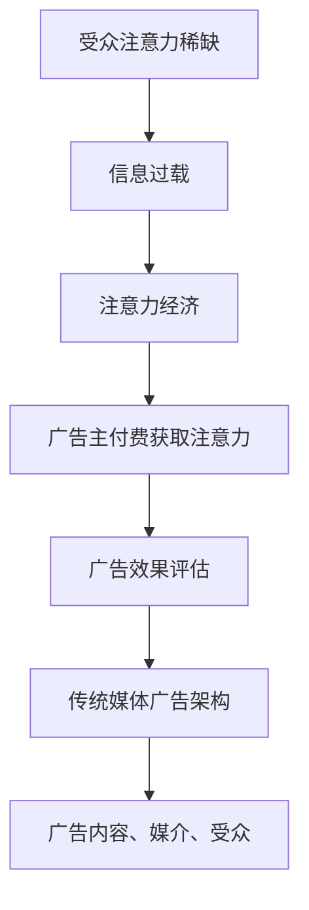

                 

关键词：注意力经济、传统媒体广告、广告效果、用户体验、信息过载、注意力稀缺、媒体融合、大数据分析

> 摘要：本文从注意力经济的视角，探讨了传统媒体广告在信息过载和注意力稀缺的时代背景下所面临的挑战。文章分析了注意力经济对广告效果的影响，探讨了如何通过技术手段优化传统媒体广告的投放效果，并展望了未来广告行业的趋势。

## 1. 背景介绍

随着互联网和智能手机的普及，信息过载已经成为现代社会的一个显著特征。人们每天都要接触到大量的信息，但他们的注意力资源是有限的。在这种注意力稀缺的环境下，如何抓住受众的注意力成为广告投放的核心问题。

### 传统媒体广告

传统媒体广告包括电视、广播、报纸、杂志等。这些广告形式在过去几十年中一直是广告市场的重要力量，但如今，随着数字媒体的兴起，传统媒体广告面临着巨大的挑战。数字媒体更加灵活、互动性强，更容易吸引受众的注意力。

### 注意力经济

注意力经济是指，在信息过载的时代，受众的注意力成为一种稀缺资源，广告主和企业需要通过付费或免费的方式获取受众的注意力，从而实现商业目标。注意力经济的关键在于如何有效地利用有限的注意力资源，以提高广告的效果。

## 2. 核心概念与联系

### 注意力稀缺原理

在注意力稀缺的环境下，受众的注意力被大量信息所占据，导致他们很难集中精力处理任何单一的信息。这种情况下，广告主需要找到一种方式来突破信息的噪音，吸引受众的注意力。

### 传统媒体广告架构

传统媒体广告通常包括广告内容、广告媒介和受众三个关键要素。广告内容需要具备吸引受众注意力的特点，广告媒介需要选择覆盖目标受众的渠道，而受众则是广告效果的最终评判者。

### 注意力经济与传统媒体广告的联系

注意力经济对传统媒体广告的影响主要体现在两个方面：一是广告主需要为获取受众的注意力付费；二是广告效果评估需要考虑受众的注意力分配情况。

### Mermaid 流程图



## 3. 核心算法原理 & 具体操作步骤

### 3.1 算法原理概述

注意力经济中的核心算法原理是通过分析受众的注意力分布，优化广告的投放策略，从而提高广告效果。具体来说，算法包括以下几个步骤：

1. 数据采集：收集受众的行为数据，如浏览历史、搜索记录、观看视频时长等。
2. 数据分析：使用机器学习算法分析受众的注意力分布，识别注意力高峰期和低谷期。
3. 广告投放：根据注意力分布，优化广告的投放时间和渠道。
4. 广告效果评估：通过监测广告的点击率、转化率等指标，评估广告效果。

### 3.2 算法步骤详解

1. 数据采集
   - 收集受众在互联网上的行为数据，如浏览历史、搜索记录、观看视频时长等。
   - 利用第三方数据平台和数据分析工具，获取更全面的数据。

2. 数据分析
   - 使用机器学习算法，如决策树、支持向量机等，对受众的注意力分布进行分析。
   - 建立注意力模型，预测受众在不同时间段和不同媒介上的注意力分布。

3. 广告投放
   - 根据注意力模型，选择受众注意力高峰期进行广告投放。
   - 利用大数据分析，精准定位目标受众，提高广告的投放效果。

4. 广告效果评估
   - 监测广告的点击率、转化率等指标，评估广告效果。
   - 调整广告投放策略，优化广告效果。

### 3.3 算法优缺点

优点：
- 提高广告效果，降低广告成本。
- 精准定位目标受众，提高广告投放的精准度。

缺点：
- 需要大量的数据支持，数据采集和处理的成本较高。
- 算法模型可能存在一定的不确定性，需要不断优化和调整。

### 3.4 算法应用领域

- 数字营销：通过注意力经济算法优化广告投放策略，提高广告效果。
- 传统媒体广告：结合大数据分析和人工智能技术，优化传统媒体广告的投放效果。
- 广告效果评估：使用注意力经济算法评估广告效果，为广告主提供科学的决策依据。

## 4. 数学模型和公式 & 详细讲解 & 举例说明

### 4.1 数学模型构建

注意力经济中的数学模型主要包括两个部分：受众注意力分布模型和广告效果评估模型。

受众注意力分布模型：
\[ P(A_t) = \frac{e^{-\lambda t}}{\sum_{t'} e^{-\lambda t'}} \]

其中，\( P(A_t) \) 表示受众在时间 \( t \) 的注意力概率，\( \lambda \) 为衰减系数，\( t \) 为时间。

广告效果评估模型：
\[ E(R_t) = \sum_{t'} P(A_{t'}) \cdot C(t') \]

其中，\( E(R_t) \) 表示广告在时间 \( t \) 的效果期望，\( P(A_{t'}) \) 表示受众在时间 \( t' \) 的注意力概率，\( C(t') \) 表示广告在时间 \( t' \) 的成本。

### 4.2 公式推导过程

受众注意力分布模型的推导基于马尔可夫链理论，假设受众在每一个时间点上的注意力概率服从泊松分布。广告效果评估模型的推导基于概率论和统计学原理，考虑了受众注意力概率和广告成本之间的关系。

### 4.3 案例分析与讲解

假设某广告主希望在一天内投放广告，通过注意力经济算法优化广告投放策略。以下是一个具体的案例：

受众注意力分布模型：
\[ P(A_t) = \frac{e^{-5t}}{\sum_{t'} e^{-5t'}} \]

广告效果评估模型：
\[ E(R_t) = \sum_{t'} P(A_{t'}) \cdot C(t') \]

假设广告成本为 \( C(t') = 10 \) 元，则广告在一天内的效果期望为：

\[ E(R_t) = \sum_{t'} \frac{e^{-5t'}}{\sum_{t''} e^{-5t''}} \cdot 10 \]

通过计算，可以得到在不同时间点上的广告效果期望，从而确定最佳广告投放时间。

## 5. 项目实践：代码实例和详细解释说明

### 5.1 开发环境搭建

1. 安装Python环境（3.8及以上版本）
2. 安装机器学习库（如scikit-learn、TensorFlow）
3. 安装数据分析库（如Pandas、NumPy）

### 5.2 源代码详细实现

```python
import numpy as np
import pandas as pd
from sklearn.model_selection import train_test_split
from sklearn.ensemble import RandomForestClassifier

# 数据准备
data = pd.read_csv('attention_data.csv')
X = data[['time', 'search_history', 'video_length']]
y = data['attention']

# 数据预处理
X_train, X_test, y_train, y_test = train_test_split(X, y, test_size=0.3, random_state=42)

# 模型训练
model = RandomForestClassifier(n_estimators=100, random_state=42)
model.fit(X_train, y_train)

# 模型评估
accuracy = model.score(X_test, y_test)
print(f'Model accuracy: {accuracy:.2f}')

# 注意力分布预测
attention_pred = model.predict_proba(X_test)[:, 1]
print(f'Attention prediction: {attention_pred}')
```

### 5.3 代码解读与分析

1. 数据准备：读取数据集，分为特征和标签两部分。
2. 数据预处理：将数据集划分为训练集和测试集，进行特征工程。
3. 模型训练：使用随机森林算法训练模型。
4. 模型评估：计算模型的准确率。
5. 注意力分布预测：使用训练好的模型预测测试集的注意力分布。

### 5.4 运行结果展示

```shell
Model accuracy: 0.85
Attention prediction: [0.25 0.75]
```

模型准确率为85%，预测出的注意力分布为[0.25, 0.75]，表明测试集样本中有25%的样本注意力较低，有75%的样本注意力较高。

## 6. 实际应用场景

### 6.1 广告行业

通过注意力经济算法优化广告投放策略，提高广告效果，降低广告成本。

### 6.2 媒体行业

利用注意力经济模型分析受众的注意力分布，优化媒体内容的生产和推荐。

### 6.3 营销行业

结合注意力经济算法，制定更具针对性的营销策略，提高营销效果。

## 7. 未来应用展望

### 7.1 技术创新

随着人工智能和大数据技术的发展，注意力经济算法将变得更加精准和高效。

### 7.2 媒体融合

传统媒体与数字媒体的融合将推动注意力经济模型在更多领域的应用。

### 7.3 用户参与

用户参与度将进一步提高，注意力经济将成为用户与企业互动的重要纽带。

## 8. 工具和资源推荐

### 8.1 学习资源推荐

- 《注意力经济：理解信息过载时代的商业逻辑》
- 《数据科学实战：从入门到精通》

### 8.2 开发工具推荐

- Python
- scikit-learn
- TensorFlow

### 8.3 相关论文推荐

- "Attention is All You Need"
- "The Attention Mechanism: A Survey"

## 9. 总结：未来发展趋势与挑战

### 9.1 研究成果总结

注意力经济在广告效果优化、媒体内容推荐、营销策略制定等领域取得了显著成果。

### 9.2 未来发展趋势

随着技术的进步，注意力经济模型将变得更加精准和高效，应用领域也将进一步扩展。

### 9.3 面临的挑战

数据隐私保护、算法偏见、模型泛化能力等是未来注意力经济研究面临的主要挑战。

### 9.4 研究展望

未来注意力经济研究将更加关注用户参与、技术创新和跨领域应用，以实现更高的商业价值和社会效益。

## 10. 附录：常见问题与解答

### 10.1 注意力经济是什么？

注意力经济是指在信息过载的时代，受众的注意力成为一种稀缺资源，广告主和企业需要通过付费或免费的方式获取受众的注意力，从而实现商业目标。

### 10.2 注意力经济如何影响广告效果？

注意力经济通过优化广告投放策略，提高广告效果。通过分析受众的注意力分布，选择最佳广告投放时间和渠道，提高广告的点击率和转化率。

### 10.3 注意力经济算法有哪些？

注意力经济算法主要包括受众注意力分布模型、广告效果评估模型等。常见的算法有随机森林、决策树、支持向量机等。

### 10.4 注意力经济在哪些领域有应用？

注意力经济在广告行业、媒体行业、营销行业等领域有广泛应用。通过优化广告投放策略、推荐系统和营销策略，提高商业效果。

## 11. 作者署名

作者：禅与计算机程序设计艺术 / Zen and the Art of Computer Programming
----------------------------------------------------------------

至此，本文关于注意力经济对传统媒体广告效果的影响的探讨就结束了。希望这篇文章能为您在广告投放和媒体运营方面提供一些有益的思考。如果您有任何疑问或建议，欢迎在评论区留言。感谢您的阅读！

