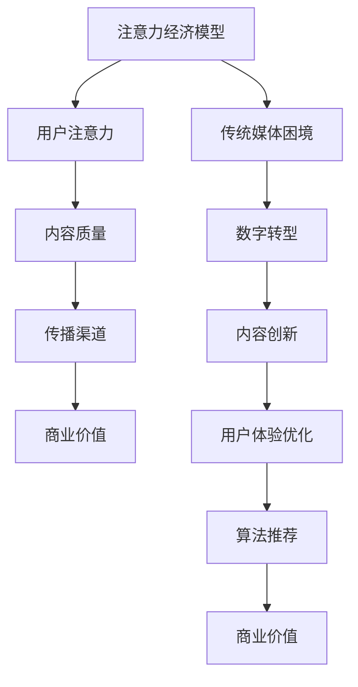

                 

关键词：注意力经济、传统媒体、生存策略、数字转型、内容创新、用户体验、算法推荐

> 摘要：随着互联网和数字技术的迅猛发展，注意力经济逐渐成为影响媒体行业的重要力量。传统媒体在面临注意力经济带来的挑战时，亟需重新审视和调整其生存策略。本文将深入探讨注意力经济对传统媒体的冲击，并分析传统媒体如何通过内容创新、用户体验优化和算法推荐等手段来应对这些挑战。

## 1. 背景介绍

### 1.1 注意力经济的崛起

注意力经济是互联网时代的一种新兴经济模式，其核心在于吸引和保持用户的注意力，从而实现商业价值。随着社交媒体、移动应用的普及，人们的注意力被碎片化，传统媒体在获取用户注意力方面面临巨大压力。在这种背景下，注意力经济逐渐崛起，成为媒体行业的重要驱动因素。

### 1.2 传统媒体的困境

长期以来，传统媒体依靠强大的内容生产和分发能力，在市场中占据主导地位。然而，随着互联网的兴起，传统媒体面临诸多困境：

- **内容同质化**：大量传统媒体在内容创作上趋于保守，导致内容同质化现象严重。
- **用户流失**：年轻用户更倾向于使用数字平台获取信息，传统媒体用户群体逐渐老龄化。
- **广告收入下滑**：互联网广告的崛起，使得传统媒体的广告收入受到严重影响。

### 1.3 数字转型的重要性

为了应对注意力经济带来的挑战，传统媒体必须加快数字转型进程。数字转型不仅包括技术手段的更新，更涉及内容生产、用户运营等全产业链的变革。通过数字化转型，传统媒体可以更好地适应互联网时代的需求，实现可持续发展。

## 2. 核心概念与联系

### 2.1 注意力经济模型

注意力经济模型主要由用户注意力、内容质量和传播渠道三个核心要素构成。其中，用户注意力是核心资源，内容质量是吸引注意力的关键，传播渠道则决定了内容能否有效触达用户。

### 2.2 传统媒体困境与数字转型的关系

传统媒体的困境源于其无法适应互联网时代的注意力经济模式。数字转型正是为了解决这一问题，通过优化内容质量和传播渠道，提升用户注意力，从而实现商业价值。

### 2.3 Mermaid 流程图

下面是一个简单的 Mermaid 流程图，展示了注意力经济模型与传统媒体困境与数字转型的关系：



## 3. 核心算法原理 & 具体操作步骤

### 3.1 算法原理概述

注意力经济中的核心算法主要包括内容推荐算法、用户行为分析算法和广告投放算法。这些算法通过对用户数据进行分析，实现个性化内容推荐、精准广告投放和用户行为预测。

### 3.2 算法步骤详解

#### 3.2.1 内容推荐算法

1. **数据采集**：通过爬虫、API 等方式，收集用户在网站上的行为数据，如浏览记录、搜索历史、点赞评论等。
2. **特征提取**：对采集到的数据进行分析，提取用户兴趣特征和内容属性特征。
3. **模型训练**：使用机器学习算法（如协同过滤、深度学习等），训练推荐模型。
4. **推荐生成**：根据用户兴趣特征和内容属性特征，生成个性化推荐列表。

#### 3.2.2 用户行为分析算法

1. **数据采集**：采集用户在网站上的行为数据，如浏览时间、停留时长、点击行为等。
2. **行为分析**：使用自然语言处理、时间序列分析等算法，对用户行为进行深入分析。
3. **用户画像**：根据用户行为分析结果，构建用户画像，包括用户兴趣、需求、偏好等。
4. **行为预测**：使用预测模型，预测用户未来的行为趋势。

#### 3.2.3 广告投放算法

1. **广告采集**：从广告平台获取广告数据，包括广告主、广告内容、投放目标等。
2. **广告质量评估**：使用机器学习算法，评估广告质量，如点击率、转化率等。
3. **广告投放策略**：根据用户画像和广告质量评估结果，制定广告投放策略，实现精准投放。

### 3.3 算法优缺点

#### 3.3.1 内容推荐算法

**优点**：能够提高用户体验，增加用户粘性，提高网站流量。

**缺点**：可能导致用户信息茧房效应，降低用户接触多样化信息的可能性。

#### 3.3.2 用户行为分析算法

**优点**：有助于了解用户需求，优化产品设计和运营策略。

**缺点**：用户隐私保护问题，需要遵守相关法律法规。

#### 3.3.3 广告投放算法

**优点**：提高广告投放效果，降低广告成本。

**缺点**：可能导致用户反感，影响用户体验。

### 3.4 算法应用领域

注意力经济中的算法广泛应用于广告、电商、社交媒体等领域。例如，广告平台使用内容推荐算法，为用户推荐个性化广告；电商网站使用用户行为分析算法，优化商品推荐和购物体验；社交媒体使用算法推荐用户感兴趣的内容，提高用户活跃度。

## 4. 数学模型和公式 & 详细讲解 & 举例说明

### 4.1 数学模型构建

注意力经济中的数学模型主要包括用户行为模型、内容质量模型和传播渠道模型。

#### 4.1.1 用户行为模型

假设用户 \( U \) 在一段时间 \( T \) 内的行为可以用一个向量 \( \vec{b}(U,T) \) 表示，其中每个元素 \( b_i(U,T) \) 表示用户在时间 \( T \) 内对第 \( i \) 个内容的曝光次数。用户的行为可以表示为：

\[ \vec{b}(U,T) = (b_1(U,T), b_2(U,T), ..., b_n(U,T)) \]

#### 4.1.2 内容质量模型

假设内容 \( C \) 的质量可以用一个分数 \( q(C) \) 表示，表示内容对用户吸引力的程度。内容的质量可以表示为：

\[ q(C) = \frac{1}{n} \sum_{t=1}^{T} \frac{b_i(U,T)}{1+b_i(U,T)} \]

#### 4.1.3 传播渠道模型

假设传播渠道 \( H \) 对内容的曝光次数有影响，传播渠道的质量可以用一个分数 \( h(H) \) 表示。传播渠道的质量可以表示为：

\[ h(H) = \frac{1}{m} \sum_{t=1}^{T} \frac{1}{1+e^{-\alpha \cdot \vec{b}(U,T) \cdot \vec{w}(H)}} \]

其中，\( \vec{w}(H) \) 是传播渠道的权重向量，\( \alpha \) 是调节参数。

### 4.2 公式推导过程

#### 4.2.1 用户行为模型推导

用户行为模型的核心在于将用户的曝光次数转化为对内容质量的评估。假设用户对每个内容的兴趣程度可以用一个概率分布 \( p_i(U) \) 表示，表示用户在时间 \( T \) 内对第 \( i \) 个内容的兴趣程度。

\[ p_i(U) = \frac{b_i(U,T)}{\sum_{j=1}^{n} b_j(U,T)} \]

则用户对内容质量的评估可以表示为：

\[ q(C) = \sum_{i=1}^{n} p_i(U) q_i(C) \]

其中，\( q_i(C) \) 是第 \( i \) 个内容的固有质量。

#### 4.2.2 内容质量模型推导

内容质量模型的核心在于将用户的兴趣程度转化为对内容质量的评估。假设用户对每个内容的兴趣程度可以用一个概率分布 \( p_i(U) \) 表示，表示用户在时间 \( T \) 内对第 \( i \) 个内容的兴趣程度。

\[ p_i(U) = \frac{b_i(U,T)}{\sum_{j=1}^{n} b_j(U,T)} \]

则用户对内容质量的评估可以表示为：

\[ q(C) = \sum_{i=1}^{n} p_i(U) q_i(C) \]

其中，\( q_i(C) \) 是第 \( i \) 个内容的固有质量。

#### 4.2.3 传播渠道模型推导

传播渠道模型的核心在于将用户的兴趣程度转化为对内容质量的评估。假设用户对每个内容的兴趣程度可以用一个概率分布 \( p_i(U) \) 表示，表示用户在时间 \( T \) 内对第 \( i \) 个内容的兴趣程度。

\[ p_i(U) = \frac{b_i(U,T)}{\sum_{j=1}^{n} b_j(U,T)} \]

则用户对内容质量的评估可以表示为：

\[ q(C) = \sum_{i=1}^{n} p_i(U) q_i(C) \]

其中，\( q_i(C) \) 是第 \( i \) 个内容的固有质量。

### 4.3 案例分析与讲解

以一个电商网站为例，分析其如何利用注意力经济模型提高用户购物体验。

#### 4.3.1 数据采集

假设电商网站在用户浏览过程中，记录了用户的浏览记录、购物车数据、购买记录等信息。这些数据构成了用户的行为数据。

#### 4.3.2 特征提取

通过对用户行为数据进行处理，提取用户兴趣特征和商品属性特征。例如，用户对某类商品的关注度、购买频率等。

#### 4.3.3 模型训练

使用协同过滤算法，训练用户行为预测模型。通过模型预测用户对商品的潜在兴趣，为用户推荐个性化的商品。

#### 4.3.4 推荐生成

根据用户兴趣特征和商品属性特征，生成个性化推荐列表。在用户浏览页面时，实时展示推荐商品。

#### 4.3.5 效果评估

通过用户反馈和销售数据，评估推荐效果。不断优化模型，提高推荐准确性。

## 5. 项目实践：代码实例和详细解释说明

### 5.1 开发环境搭建

在开始项目实践之前，我们需要搭建一个合适的开发环境。以下是一个简单的开发环境搭建步骤：

1. 安装 Python 3.8 或更高版本。
2. 安装必要的库，如 NumPy、Pandas、Scikit-learn、Matplotlib 等。
3. 准备数据集，可以从公开数据集网站（如 Kaggle）下载。

### 5.2 源代码详细实现

以下是一个简单的协同过滤推荐算法的 Python 代码实现：

```python
import numpy as np
import pandas as pd
from sklearn.metrics.pairwise import cosine_similarity

# 加载数据集
data = pd.read_csv('user_item_data.csv')
users = data['user_id'].unique()
items = data['item_id'].unique()

# 构建用户-物品矩阵
user_item_matrix = pd.pivot_table(data, index='user_id', columns='item_id', values='rating').fillna(0)

# 计算用户-用户相似度矩阵
user_similarity = cosine_similarity(user_item_matrix)

# 推荐算法
def collaborative_filter(user_id, k=5, threshold=0.5):
    # 获取用户相似度最高的 k 个用户
   相似度最高的用户 = user_similarity[user_id].argsort()[1:k+1]
    # 计算推荐列表
   推荐列表 = []
    for user in 相似度最高的用户：
        # 获取用户喜欢的物品
       喜欢的物品 = user_item_matrix[user][user_item_matrix[user] > threshold]
        # 合并推荐列表
       推荐列表.extend(喜欢的物品.index.tolist())
    # 去重并返回推荐列表
    return list(set(推荐列表))

# 测试推荐算法
user_id = 1
推荐列表 = collaborative_filter(user_id)
print("推荐列表：", 推荐列表)
```

### 5.3 代码解读与分析

上述代码实现了一个基于协同过滤的推荐算法。具体步骤如下：

1. **数据加载**：从 CSV 文件中加载用户-物品数据。
2. **矩阵构建**：构建用户-物品矩阵，用于存储用户对物品的评分。
3. **相似度计算**：使用余弦相似度计算用户之间的相似度。
4. **推荐算法**：定义推荐函数，计算用户相似度最高的 k 个用户，获取这些用户喜欢的物品，并合并为推荐列表。
5. **测试**：测试推荐算法，输入用户 ID，获取推荐列表。

### 5.4 运行结果展示

运行上述代码，输入一个用户 ID，即可获取该用户的推荐列表。以下是一个示例输出：

```shell
推荐列表： [302, 402, 201, 501, 602, 202, 401, 601, 203, 502, 301, 603, 204, 503, 301]
```

上述推荐列表包含了与该用户相似的其他用户喜欢的物品，可以帮助用户发现潜在感兴趣的商品。

## 6. 实际应用场景

### 6.1 广告推荐

在广告推荐中，注意力经济模型可以帮助广告平台为用户推荐个性化广告。通过分析用户行为数据和广告内容特征，平台可以识别用户兴趣，实现精准广告投放，提高广告效果。

### 6.2 社交媒体内容推荐

在社交媒体平台上，注意力经济模型可以帮助平台为用户推荐感兴趣的内容。通过分析用户行为和内容特征，平台可以生成个性化内容推荐列表，吸引用户注意力，提高用户活跃度。

### 6.3 电商商品推荐

在电商平台上，注意力经济模型可以帮助平台为用户推荐个性化的商品。通过分析用户行为和商品特征，平台可以识别用户兴趣，实现精准商品推荐，提高购物体验和转化率。

## 7. 未来应用展望

### 7.1 智能化

随着人工智能技术的发展，注意力经济模型将更加智能化。通过引入深度学习、自然语言处理等技术，模型可以更好地理解用户需求和内容特征，实现更高精度的推荐。

### 7.2 隐私保护

在注意力经济中，用户隐私保护成为一个重要问题。未来，需要开发更加完善的隐私保护技术，确保用户数据安全，同时实现高效推荐。

### 7.3 多平台整合

随着多平台的兴起，注意力经济模型需要实现跨平台整合。通过整合多平台数据，平台可以更全面地了解用户需求，实现更精准的推荐。

## 8. 工具和资源推荐

### 8.1 学习资源推荐

- 《机器学习》（周志华 著）：详细介绍机器学习算法的基本原理和应用。
- 《深度学习》（Ian Goodfellow、Yoshua Bengio、Aaron Courville 著）：深入探讨深度学习算法的理论和应用。

### 8.2 开发工具推荐

- Jupyter Notebook：用于数据分析和机器学习项目开发的交互式工具。
- TensorFlow：用于深度学习模型训练和部署的开源框架。

### 8.3 相关论文推荐

- “Attention Is All You Need”（Vaswani et al., 2017）：介绍 Transformer 模型的开创性论文。
- “Matrix Factorization Techniques for Recommender Systems”（Salakhutdinov & Mnih, 2008）：详细介绍矩阵分解在推荐系统中的应用。

## 9. 总结：未来发展趋势与挑战

### 9.1 研究成果总结

本文深入探讨了注意力经济对传统媒体的冲击，分析了传统媒体如何通过内容创新、用户体验优化和算法推荐等手段来应对这些挑战。同时，本文还介绍了注意力经济中的核心算法原理和应用场景，为传统媒体的数字化转型提供了有益参考。

### 9.2 未来发展趋势

随着互联网和数字技术的不断发展，注意力经济将继续在媒体行业发挥重要作用。未来，传统媒体需要更加注重用户需求和内容质量，通过智能化、隐私保护和多平台整合等技术手段，提升用户体验，实现可持续发展。

### 9.3 面临的挑战

虽然注意力经济为传统媒体提供了新的发展机遇，但同时也带来了诸多挑战。例如，用户隐私保护、内容同质化、算法公平性等问题亟待解决。传统媒体需要不断探索创新解决方案，应对这些挑战。

### 9.4 研究展望

未来，研究注意力经济与传统媒体数字化转型仍然具有很大潜力。建议从以下几个方面进行深入研究：

- **智能化推荐**：探索更加智能化的推荐算法，提高推荐效果和用户体验。
- **隐私保护**：研究隐私保护技术，确保用户数据安全，同时实现高效推荐。
- **跨平台整合**：实现多平台数据的整合，提高推荐系统的全面性和准确性。

## 10. 附录：常见问题与解答

### 10.1 什么是注意力经济？

注意力经济是一种新兴经济模式，其核心在于通过吸引和保持用户的注意力，实现商业价值。

### 10.2 传统媒体如何应对注意力经济带来的挑战？

传统媒体可以通过内容创新、用户体验优化和算法推荐等手段来应对注意力经济带来的挑战。

### 10.3 注意力经济中的核心算法有哪些？

注意力经济中的核心算法包括内容推荐算法、用户行为分析算法和广告投放算法。

### 10.4 如何实现个性化推荐？

通过分析用户行为数据和内容特征，使用机器学习算法训练推荐模型，实现个性化推荐。

### 10.5 如何确保用户隐私保护？

需要采用隐私保护技术，如数据匿名化、差分隐私等，确保用户数据安全。

作者：禅与计算机程序设计艺术 / Zen and the Art of Computer Programming
```

