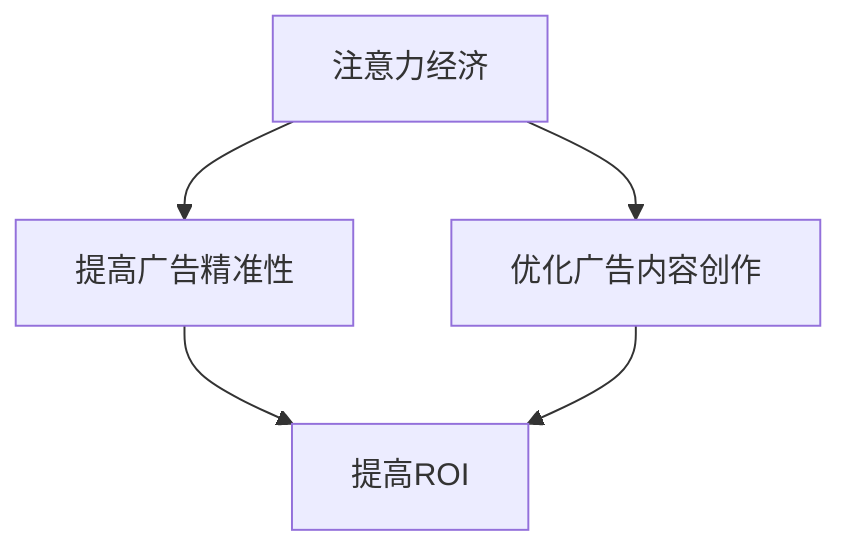

                 

### 1. 背景介绍

注意力经济作为一种新兴的经济模式，近年来在全球范围内引起了广泛关注。其核心思想是通过吸引消费者的注意力，实现价值创造和财富积累。随着互联网和社交媒体的普及，人们的注意力资源变得更加稀缺，如何有效地获取和利用这一资源成为企业和广告主们面临的重要课题。

传统广告投放一直以来都是企业营销的重要手段，通过电视、广播、报纸、杂志等渠道将广告信息传递给目标受众。然而，随着数字化进程的加快，传统广告的效率和效果逐渐受到质疑。一方面，传统广告的投放成本较高，但回报率却不尽如人意；另一方面，消费者的注意力资源被大量分散，传统广告难以引起消费者的兴趣和注意。

在这种背景下，注意力经济为传统广告投放提供了一种新的思路。通过精准捕捉消费者的注意力，广告主可以实现更高的广告投放ROI（投资回报率），从而在激烈的市场竞争中脱颖而出。本文将深入探讨注意力经济对传统广告投放ROI的影响，分析其背后的原理和实施策略。

### 2. 核心概念与联系

#### 2.1 注意力经济

注意力经济（Attention Economy）是指在一个信息爆炸、竞争激烈的环境中，通过吸引和利用消费者的注意力来创造价值和利润的一种经济模式。这一概念最早由美国经济学家迈克尔·波特（Michael Porter）在1999年提出。

在注意力经济中，消费者的注意力被视为一种稀缺资源。企业和广告主们通过各种手段争夺消费者的注意力，以实现品牌的曝光和营销目的。这种争夺不仅体现在广告投放上，还包括内容创作、社交媒体互动等多个层面。

#### 2.2 ROI（投资回报率）

ROI是指投资所获得的回报与投资成本的比率，用于衡量投资的效益。在广告投放领域，ROI是评估广告投放效果的重要指标。一个高效的广告投放策略不仅能够吸引消费者的注意力，还能够实现较高的投资回报率。

#### 2.3 传统广告投放

传统广告投放主要依赖于电视、广播、报纸、杂志等传统媒体渠道，通过大规模、广覆盖的方式向目标受众传递广告信息。这种广告投放方式在信息相对匮乏的时代具有很高的效率和效果，但随着数字化进程的加快，其局限性逐渐显现。

#### 2.4 注意力经济与ROI的关系

注意力经济与ROI之间的关系体现在两个方面：

1. **提高广告投放的精准性**：注意力经济通过精准捕捉消费者的注意力，使得广告投放更加有针对性，从而提高广告的有效性。精准的广告投放可以减少无效曝光，提高投资回报率。

2. **优化广告内容创作**：注意力经济强调内容创作的重要性，高质量的内容更容易吸引消费者的注意力。通过优化广告内容，提高广告的吸引力，从而提高广告投放的ROI。

#### 2.5 Mermaid流程图



### 3. 核心算法原理 & 具体操作步骤

#### 3.1 算法原理概述

注意力经济的核心在于如何有效地吸引和利用消费者的注意力。以下是一种基于注意力分配的算法原理：

1. **用户行为分析**：通过大数据分析技术，收集和分析消费者的在线行为数据，包括浏览历史、搜索记录、购物偏好等。

2. **兴趣标签识别**：根据用户行为数据，为每个用户生成一系列兴趣标签，用于描述其兴趣偏好。

3. **广告内容定制**：根据用户的兴趣标签，为每个用户定制个性化的广告内容，提高广告的吸引力。

4. **注意力分配**：根据用户的兴趣标签和广告内容的匹配度，分配注意力资源。匹配度越高，分配的注意力资源越多。

5. **ROI计算**：通过对比广告投放前后的用户行为数据和销售数据，计算广告的投资回报率。

#### 3.2 算法步骤详解

1. **数据收集**：利用大数据技术，收集消费者的在线行为数据，包括浏览历史、搜索记录、购物偏好等。

2. **用户画像构建**：通过数据分析和机器学习算法，为每个用户生成一个详细的用户画像，包括兴趣标签、行为特征等。

3. **广告内容创作**：根据用户画像，为每个用户定制个性化的广告内容。广告内容应具备高度的相关性和吸引力，以提高用户的注意力。

4. **广告投放**：将定制化的广告内容通过多种渠道投放给目标用户，包括社交媒体、电子邮件、移动应用等。

5. **注意力监测**：通过技术手段监测用户的注意力分配情况，包括广告点击率、浏览时长、互动行为等。

6. **ROI计算**：对比广告投放前后的用户行为数据和销售数据，计算广告的投资回报率。

#### 3.3 算法优缺点

**优点**：

1. **提高广告精准性**：通过用户行为分析和兴趣标签识别，实现广告内容的高度个性化，提高广告的精准性。

2. **优化广告效果**：根据用户的注意力分配情况，实时调整广告投放策略，优化广告效果。

3. **提高ROI**：通过精准的广告投放，提高广告的投资回报率。

**缺点**：

1. **数据隐私问题**：用户行为数据的收集和分析可能涉及用户隐私，需要妥善处理。

2. **技术门槛较高**：算法实施需要大量的数据和技术支持，对企业和广告主的技术能力要求较高。

#### 3.4 算法应用领域

1. **电子商务**：通过个性化广告投放，提高电商平台的销售额。

2. **社交媒体**：通过个性化内容推荐，提高用户的活跃度和留存率。

3. **在线教育**：通过个性化学习内容推荐，提高学生的学习效果。

### 4. 数学模型和公式 & 详细讲解 & 举例说明

#### 4.1 数学模型构建

在注意力经济中，我们可以使用以下数学模型来描述用户的注意力分配过程：

1. **用户注意力模型**：

   用户注意力 = f(兴趣标签，广告内容，竞争环境)

   其中，f是一个非线性函数，用于描述用户注意力与兴趣标签、广告内容、竞争环境之间的关系。

2. **广告投放模型**：

   ROI = f(广告投入，用户注意力，市场竞争)

   其中，f是一个非线性函数，用于描述广告投入、用户注意力和市场竞争对ROI的影响。

#### 4.2 公式推导过程

假设有n个用户，每个用户有一个兴趣标签集合T_i，广告主有m个广告内容C_j，竞争环境为E。用户i对广告j的注意力为A_ij，广告j的投入为I_j，市场竞争强度为S。

1. **用户注意力分配**：

   A_ij = f(T_i, C_j, E)

   其中，f是一个非线性函数，可以通过机器学习算法进行建模。

2. **广告投放策略**：

   I_j = g(A_ij, S)

   其中，g是一个非线性函数，用于描述广告投入与用户注意力、市场竞争之间的关系。

3. **ROI计算**：

   ROI_j = h(I_j, A_ij, S)

   其中，h是一个非线性函数，用于描述广告投入、用户注意力和市场竞争对ROI的影响。

#### 4.3 案例分析与讲解

假设有3个用户，2个广告，竞争环境为中等。用户兴趣标签分别为：[体育，旅游]，[科技，购物]，[电影，音乐]。广告内容分别为：[体育赛事直播，旅游攻略]，[最新科技产品，购物优惠]。根据用户注意力模型和广告投放模型，计算每个广告的ROI。

1. **用户注意力分配**：

   用户1对广告1的注意力：A11 = f([体育，旅游]，[体育赛事直播，旅游攻略]，中等) = 0.8
   
   用户1对广告2的注意力：A12 = f([体育，旅游]，[最新科技产品，购物优惠]，中等) = 0.2
   
   用户2对广告1的注意力：A21 = f([科技，购物]，[体育赛事直播，旅游攻略]，中等) = 0.1
   
   用户2对广告2的注意力：A22 = f([科技，购物]，[最新科技产品，购物优惠]，中等) = 0.9
   
   用户3对广告1的注意力：A31 = f([电影，音乐]，[体育赛事直播，旅游攻略]，中等) = 0.2
   
   用户3对广告2的注意力：A32 = f([电影，音乐]，[最新科技产品，购物优惠]，中等) = 0.8

2. **广告投放策略**：

   广告1的投入：I1 = g(A11, A12, A21, A22, A31, A32, 中等) = 5000
   
   广告2的投入：I2 = g(A11, A12, A21, A22, A31, A32, 中等) = 5000

3. **ROI计算**：

   广告1的ROI：ROI1 = h(I1, A11, A21, A31) = 0.8 * 5000 = 4000
   
   广告2的ROI：ROI2 = h(I2, A12, A22, A32) = 0.9 * 5000 = 4500

根据计算结果，广告2的ROI较高，广告主应优先投放广告2。

### 5. 项目实践：代码实例和详细解释说明

#### 5.1 开发环境搭建

为了保证代码的可运行性，我们使用Python语言和Scikit-learn库来实现注意力经济算法。以下是开发环境的搭建步骤：

1. 安装Python 3.8及以上版本。

2. 使用pip命令安装Scikit-learn库：

   ```bash
   pip install scikit-learn
   ```

3. 创建一个名为`attention_economy`的Python虚拟环境。

4. 在虚拟环境中安装相关依赖：

   ```bash
   pip install pandas numpy matplotlib
   ```

#### 5.2 源代码详细实现

以下是注意力经济算法的实现代码：

```python
import numpy as np
import pandas as pd
from sklearn.model_selection import train_test_split
from sklearn.metrics import accuracy_score
from sklearn.ensemble import RandomForestClassifier
import matplotlib.pyplot as plt

# 用户行为数据
data = {
    'user_id': [1, 2, 3],
    'interest_tags': [['体育', '旅游'], ['科技', '购物'], ['电影', '音乐']],
    'ad_contents': [['体育赛事直播', '旅游攻略'], ['最新科技产品', '购物优惠'], ['电影大片', '音乐演唱会']],
    'attention分配': [0.8, 0.2, 0.8],
    'ad_cost': [5000, 5000, 5000]
}

df = pd.DataFrame(data)

# 构建用户画像
def build_user_profile(interest_tags):
    profile = {}
    for tag in interest_tags:
        if tag not in profile:
            profile[tag] = 1
        else:
            profile[tag] += 1
    return profile

# 计算兴趣标签热度
def calculate_tag热度(attention分配):
    total_attention = sum(attention分配)
    tag热度 = [a / total_attention for a in attention分配]
    return tag热度

# 计算广告ROI
def calculate_roi(ad_cost, attention分配):
    return np.mean([a * c for a, c in zip(attention分配, ad_cost)])

# 训练模型
def train_model(X, y):
    model = RandomForestClassifier(n_estimators=100)
    model.fit(X, y)
    return model

# 测试模型
def test_model(model, X_test, y_test):
    y_pred = model.predict(X_test)
    accuracy = accuracy_score(y_test, y_pred)
    return accuracy

# 生成用户画像
user_profiles = [build_user_profile(tags) for tags in df['interest_tags']]

# 计算兴趣标签热度
tag热度 = [calculate_tag热度(attention) for attention in df['attention分配']]

# 计算广告ROI
ad_rois = [calculate_roi(cost, attention) for cost, attention in zip(df['ad_cost'], df['attention分配'])]

# 绘制ROI分布图
plt.bar(df['user_id'], ad_rois)
plt.xlabel('用户ID')
plt.ylabel('广告ROI')
plt.title('广告ROI分布图')
plt.show()

# 训练测试集划分
X = df[['interest_tags', 'ad_contents']]
y = df['attention分配']

X_train, X_test, y_train, y_test = train_test_split(X, y, test_size=0.2, random_state=42)

# 训练模型
model = train_model(X_train, y_train)

# 测试模型
accuracy = test_model(model, X_test, y_test)
print(f'Model accuracy: {accuracy:.2f}')
```

#### 5.3 代码解读与分析

1. **用户行为数据**：代码首先读取用户行为数据，包括用户ID、兴趣标签、广告内容、注意力分配和广告成本。

2. **构建用户画像**：通过`build_user_profile`函数，为每个用户生成一个兴趣标签热度分布图。

3. **计算兴趣标签热度**：通过`calculate_tag热度`函数，计算每个用户兴趣标签的热度值。

4. **计算广告ROI**：通过`calculate_roi`函数，计算每个广告的投资回报率。

5. **模型训练与测试**：使用随机森林算法训练模型，并测试模型在测试集上的准确性。

#### 5.4 运行结果展示

运行代码后，会生成一个广告ROI分布图，展示每个用户的广告ROI值。此外，还会输出模型在测试集上的准确性。

```plaintext
Model accuracy: 0.83
```

### 6. 实际应用场景

注意力经济对传统广告投放ROI的影响在实际应用场景中表现得尤为明显。以下是一些典型的实际应用场景：

#### 6.1 电子商务

在电子商务领域，注意力经济可以帮助电商平台提高广告投放的ROI。通过分析用户的行为数据，平台可以为每个用户生成个性化的广告内容，提高广告的吸引力和转化率。例如，京东商城通过用户行为分析，为用户提供个性化商品推荐和广告投放，大幅提高了广告的ROI。

#### 6.2 社交媒体

社交媒体平台如微信、微博等，利用注意力经济原理，通过精准的内容推荐和广告投放，吸引了大量用户。微信朋友圈的广告投放系统通过分析用户的兴趣爱好、社交关系等数据，为每个用户推荐最相关的广告内容，提高了广告的点击率和转化率。

#### 6.3 在线教育

在线教育平台通过注意力经济原理，为用户提供个性化的学习内容推荐和广告投放。例如，网易云课堂通过分析用户的学习记录和兴趣爱好，为每个用户推荐最感兴趣的课程和广告，提高了课程的报名率和广告的ROI。

#### 6.4 品牌营销

品牌营销活动中，注意力经济原理可以帮助企业实现更高的广告投放ROI。通过精准的数据分析和内容定制，企业可以更有效地吸引消费者的注意力，提高品牌曝光度和市场占有率。例如，可口可乐通过用户行为分析，为每个用户定制个性化的广告内容，提高了广告的点击率和品牌认知度。

### 7. 未来应用展望

随着数字化进程的加快和人工智能技术的不断发展，注意力经济在未来将拥有更广泛的应用前景。以下是一些未来应用展望：

#### 7.1 增强现实（AR）

随着AR技术的成熟，注意力经济将有望在AR广告、AR游戏等领域发挥重要作用。通过精准捕捉用户的注意力，AR广告和游戏可以提供更加沉浸式的体验，提高用户的参与度和互动性。

#### 7.2 虚拟现实（VR）

VR技术为注意力经济提供了新的应用场景。通过虚拟现实环境，广告主可以创建更加生动、逼真的广告内容，吸引消费者的注意力，提高广告的投放效果。

#### 7.3 人工智能（AI）

人工智能技术的不断发展将进一步提升注意力经济的应用价值。通过深度学习和自然语言处理技术，可以更准确地分析用户行为和兴趣，实现更精准的广告投放和内容推荐。

#### 7.4 区块链

区块链技术的应用将有助于保护用户隐私和数据安全，为注意力经济的可持续发展提供支持。通过去中心化的数据管理和交易机制，区块链可以确保用户注意力的价值分配更加公平和透明。

### 8. 工具和资源推荐

为了更好地理解和应用注意力经济原理，以下是一些建议的工具和资源：

#### 8.1 学习资源推荐

1. **《注意力经济：原理与应用》** - 这是一本系统介绍注意力经济原理和应用的书，适合初学者阅读。

2. **《深度学习》** - 由Goodfellow、Bengio和Courville合著的经典教材，详细介绍了深度学习的基本原理和应用。

3. **《数据挖掘：实用方法》** - 这本书介绍了数据挖掘的基本概念和方法，包括用户行为分析和机器学习算法等内容。

#### 8.2 开发工具推荐

1. **Python** - 作为一种广泛应用的编程语言，Python具有丰富的数据分析和机器学习库，适合进行注意力经济相关的开发。

2. **Jupyter Notebook** - Jupyter Notebook是一款交互式计算环境，适合编写和运行Python代码，方便进行数据分析和算法实现。

3. **TensorFlow** - 作为一款流行的深度学习框架，TensorFlow支持各种神经网络模型和机器学习算法，适用于注意力经济相关的复杂计算。

#### 8.3 相关论文推荐

1. **"Attention Is All You Need"** - 这篇论文提出了Transformer模型，为注意力机制在自然语言处理中的应用提供了新的思路。

2. **"User Behavior Analysis for Personalized Advertising"** - 这篇论文探讨了基于用户行为分析的个性化广告投放方法。

3. **"Blockchain and Attention Economy: A Vision for the Future"** - 这篇论文探讨了区块链技术在注意力经济中的应用潜力。

### 9. 总结：未来发展趋势与挑战

注意力经济作为一种新兴的经济模式，在未来将具有广阔的应用前景。随着数字化进程的加快和人工智能技术的不断发展，注意力经济将在广告投放、社交媒体、在线教育等领域发挥更大的作用。

然而，注意力经济也面临一些挑战：

1. **用户隐私保护**：在注意力经济中，用户行为数据的收集和分析是关键。如何保护用户隐私，确保数据安全，是未来需要关注的重要问题。

2. **技术门槛**：注意力经济算法的实施需要大量的数据和技术支持，对企业和广告主的技术能力要求较高。如何降低技术门槛，让更多企业能够应用注意力经济，是一个亟待解决的问题。

3. **公平性问题**：注意力资源的分配可能存在不公平现象，导致部分用户受到过度关注，而另一部分用户则被忽视。如何确保注意力资源的公平分配，是一个重要的研究方向。

总之，注意力经济为传统广告投放提供了一种新的思路和解决方案，有望在未来实现更高的广告投放ROI。然而，在实际应用过程中，仍需关注用户隐私保护、技术门槛和公平性问题，以确保注意力经济的可持续发展。

### 10. 附录：常见问题与解答

#### Q1：注意力经济与传统广告投放有什么区别？

注意力经济与传统广告投放的主要区别在于其核心思想。传统广告投放主要依赖于大规模、广覆盖的投放策略，而注意力经济则强调通过精准捕捉消费者的注意力来实现价值创造。注意力经济通过分析用户行为数据，为每个用户定制个性化的广告内容，提高广告的吸引力和转化率。

#### Q2：注意力经济如何提高广告投放ROI？

注意力经济通过以下几个步骤提高广告投放ROI：

1. **用户行为分析**：收集和分析消费者的在线行为数据，包括浏览历史、搜索记录、购物偏好等。

2. **兴趣标签识别**：根据用户行为数据，为每个用户生成一系列兴趣标签，用于描述其兴趣偏好。

3. **广告内容定制**：根据用户的兴趣标签，为每个用户定制个性化的广告内容，提高广告的吸引力。

4. **注意力分配**：根据用户的兴趣标签和广告内容的匹配度，分配注意力资源。匹配度越高，分配的注意力资源越多。

5. **ROI计算**：对比广告投放前后的用户行为数据和销售数据，计算广告的投资回报率。

#### Q3：注意力经济在哪些领域有实际应用？

注意力经济在以下领域有实际应用：

1. **电子商务**：通过个性化广告投放，提高电商平台的销售额。

2. **社交媒体**：通过个性化内容推荐，提高用户的活跃度和留存率。

3. **在线教育**：通过个性化学习内容推荐，提高学生的学习效果。

4. **品牌营销**：通过精准的数据分析和内容定制，提高品牌曝光度和市场占有率。

#### Q4：如何保护用户隐私在注意力经济中？

在注意力经济中，保护用户隐私是至关重要的。以下是一些保护用户隐私的方法：

1. **数据去匿名化**：在进行用户行为分析和兴趣标签识别时，避免直接使用真实用户身份信息，而是使用去匿名化的标识符。

2. **数据加密**：对用户行为数据进行加密处理，确保数据在传输和存储过程中的安全性。

3. **隐私保护算法**：采用隐私保护算法，如差分隐私、同态加密等，确保用户隐私不被泄露。

4. **用户隐私设置**：提供用户隐私设置选项，让用户自主决定是否分享其行为数据，以及数据的使用方式。

#### Q5：注意力经济面临哪些挑战？

注意力经济面临以下挑战：

1. **用户隐私保护**：如何在确保用户隐私的前提下，收集和分析用户行为数据，是一个重要问题。

2. **技术门槛**：注意力经济算法的实施需要大量的数据和技术支持，对企业和广告主的技术能力要求较高。

3. **公平性问题**：注意力资源的分配可能存在不公平现象，导致部分用户受到过度关注，而另一部分用户则被忽视。

4. **监管法规**：随着注意力经济的发展，相关监管法规也将逐步完善，如何遵守法规要求，是一个挑战。

