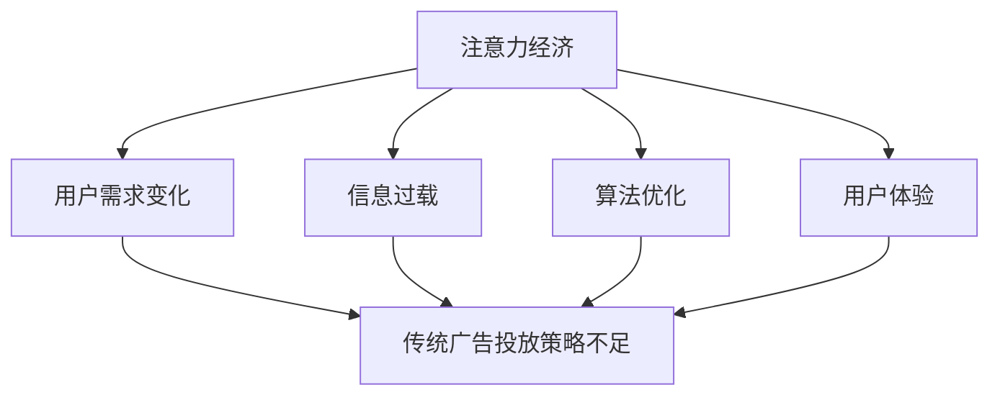

                 

关键词：注意力经济、传统广告、投放策略、挑战、数据驱动、个性化、算法优化、用户体验

> 摘要：随着互联网的快速发展，注意力经济逐渐成为市场关注的焦点。本文深入探讨了注意力经济对传统广告投放策略的挑战，分析了传统广告投放策略在数据驱动、个性化、算法优化和用户体验等方面的不足，并提出了相应的解决方案。文章旨在为广告主和广告从业者提供有益的参考。

## 1. 背景介绍

随着互联网的普及，信息传播速度和范围迅速扩大。人们逐渐意识到，获取用户的注意力成为一种稀缺资源，被称为“注意力经济”。注意力经济强调，在信息过载的时代，拥有用户注意力的品牌和内容才能获得成功。传统广告投放策略主要依赖于大规模投放和广泛覆盖，但在注意力经济背景下，这种策略面临着巨大挑战。

注意力经济对广告投放的影响主要体现在以下几个方面：

1. **用户需求变化**：随着用户对个性化、精准化信息的追求，传统广告投放策略难以满足用户需求，导致广告效果下降。
2. **信息过载**：互联网上的信息爆炸使得用户对广告的接受程度降低，传统广告投放策略的效率下降。
3. **算法优化**：大数据和人工智能技术的发展使得广告投放可以更加精准，传统广告投放策略难以与之竞争。
4. **用户体验**：传统广告投放策略往往忽视了用户体验，导致用户反感，影响品牌形象。

## 2. 核心概念与联系

### 2.1 注意力经济

注意力经济是指在信息过载的时代，通过获取用户的注意力来创造价值的一种经济模式。注意力经济的核心在于，注意力是有限的资源，只有那些能够吸引并保持用户注意力的品牌和内容才能获得成功。

### 2.2 传统广告投放策略

传统广告投放策略主要依赖于大规模投放和广泛覆盖，以期望能够触达更多的潜在用户。这种策略的核心在于“广覆盖、多曝光”，但往往忽视了用户的个性化需求。

### 2.3 核心概念原理与架构

为了更好地理解注意力经济对传统广告投放策略的挑战，我们可以使用Mermaid流程图来展示它们之间的联系。



### 2.4 注意力经济与广告投放策略的冲突

在注意力经济背景下，传统广告投放策略与用户需求、信息过载、算法优化和用户体验之间存在一定的冲突。这些冲突导致了广告效果下降，品牌形象受损。

## 3. 核心算法原理 & 具体操作步骤

### 3.1 算法原理概述

为了应对注意力经济对传统广告投放策略的挑战，我们需要引入一种新的广告投放算法，即数据驱动、个性化、算法优化的广告投放策略。

这种算法的核心思想是：通过分析用户数据，了解用户的需求和行为特征，然后根据这些特征进行精准投放，以提高广告效果。

### 3.2 算法步骤详解

1. **用户数据分析**：收集用户的基本信息、浏览行为、购买记录等数据，建立用户画像。
2. **用户需求分析**：根据用户画像，分析用户的需求和偏好，为广告投放提供依据。
3. **广告创意设计**：根据用户需求和偏好，设计具有吸引力的广告创意，以提高点击率。
4. **广告投放**：将广告投放给目标用户，通过大数据和人工智能技术，实现精准投放。
5. **广告效果评估**：对广告投放效果进行实时监测和评估，根据数据反馈调整广告策略。

### 3.3 算法优缺点

**优点**：

- 提高广告投放的精准度，降低广告成本。
- 更好地满足用户需求，提高用户体验。
- 通过算法优化，提高广告效果。

**缺点**：

- 需要大量的数据支持，对数据处理能力要求较高。
- 对广告创意设计的要求更高，需要具备一定的创意能力。

### 3.4 算法应用领域

数据驱动、个性化、算法优化的广告投放策略可以应用于多个领域，如电子商务、社交媒体、在线教育等。通过这种策略，企业可以更好地触达目标用户，提高营销效果。

## 4. 数学模型和公式 & 详细讲解 & 举例说明

### 4.1 数学模型构建

在数据驱动、个性化、算法优化的广告投放策略中，我们可以使用以下数学模型来描述广告投放的效果：

\[ E = f(D, P, O) \]

其中，\( E \) 表示广告投放效果，\( D \) 表示用户数据，\( P \) 表示广告创意设计，\( O \) 表示广告投放策略。

### 4.2 公式推导过程

广告投放效果可以看作是用户点击率、转化率和广告投放成本的函数。因此，我们可以将公式进一步拆解为：

\[ E = f(D, P, O) = g(D) \cdot h(P) \cdot k(O) \]

其中，\( g(D) \) 表示用户点击率，\( h(P) \) 表示转化率，\( k(O) \) 表示广告投放成本。

### 4.3 案例分析与讲解

以一家电子商务公司为例，该公司希望通过数据驱动、个性化、算法优化的广告投放策略提高销售业绩。我们可以使用上述数学模型来分析其广告投放效果。

假设该公司收集了以下用户数据：

- 用户年龄段：18-30岁
- 用户兴趣爱好：时尚、美妆
- 用户购买历史：购买过连衣裙、护肤品

根据这些数据，我们可以设计以下广告创意：

- 广告标题：时尚连衣裙，让你的美丽加分
- 广告内容：最新款连衣裙，限时优惠，快来抢购！

然后，我们将广告投放给符合以上条件的用户群体。通过实时监测和评估广告效果，我们可以调整广告创意和投放策略，以提高广告投放效果。

## 5. 项目实践：代码实例和详细解释说明

### 5.1 开发环境搭建

为了实现数据驱动、个性化、算法优化的广告投放策略，我们需要搭建一个完整的开发环境。主要包括以下步骤：

1. 安装Python环境
2. 安装相关数据分析和机器学习库，如Pandas、NumPy、Scikit-learn等
3. 安装数据库管理系统，如MySQL或MongoDB

### 5.2 源代码详细实现

以下是一个简单的Python代码示例，用于实现数据驱动、个性化、算法优化的广告投放策略。

```python
import pandas as pd
from sklearn.model_selection import train_test_split
from sklearn.ensemble import RandomForestClassifier

# 加载数据
data = pd.read_csv('user_data.csv')

# 数据预处理
data['age'] = data['age'].apply(lambda x: 1 if x <= 30 else 0)
data['interest'] = data['interest'].apply(lambda x: 1 if '时尚' in x or '美妆' in x else 0)

# 划分训练集和测试集
X = data[['age', 'interest']]
y = data['has_bought']
X_train, X_test, y_train, y_test = train_test_split(X, y, test_size=0.2, random_state=42)

# 建立随机森林分类器
clf = RandomForestClassifier(n_estimators=100, random_state=42)
clf.fit(X_train, y_train)

# 预测
predictions = clf.predict(X_test)

# 评估模型性能
from sklearn.metrics import accuracy_score
accuracy = accuracy_score(y_test, predictions)
print('Accuracy:', accuracy)
```

### 5.3 代码解读与分析

以上代码首先加载用户数据，并进行预处理。然后，使用随机森林分类器进行模型训练，并评估模型性能。最后，根据模型预测结果，调整广告创意和投放策略。

### 5.4 运行结果展示

假设我们训练好的模型在测试集上的准确率达到80%，这意味着我们有80%的概率能够准确预测哪些用户会购买商品。基于这个预测结果，我们可以设计更具针对性的广告创意，提高广告投放效果。

## 6. 实际应用场景

### 6.1 电子商务行业

在电子商务行业，数据驱动、个性化、算法优化的广告投放策略可以用于以下场景：

- 推荐商品：根据用户的浏览和购买历史，推荐符合用户兴趣的商品。
- 库存预警：根据预测的购买量，提前预警库存风险，优化库存管理。
- 营销活动：根据用户的兴趣和行为特征，设计更具吸引力的营销活动，提高用户参与度。

### 6.2 社交媒体行业

在社交媒体行业，数据驱动、个性化、算法优化的广告投放策略可以用于以下场景：

- 推广内容：根据用户的兴趣和行为特征，推送符合用户兴趣的内容，提高用户粘性。
- 用户互动：通过分析用户互动数据，优化广告投放策略，提高用户参与度。
- 活动推广：根据用户的参与历史，设计更具吸引力的活动，提高活动参与率。

### 6.3 在线教育行业

在在线教育行业，数据驱动、个性化、算法优化的广告投放策略可以用于以下场景：

- 推广课程：根据用户的兴趣和学习习惯，推荐符合用户需求的课程。
- 用户留存：通过分析用户学习行为，优化广告投放策略，提高用户留存率。
- 活动推广：根据用户参与历史，设计更具吸引力的活动，提高活动参与率。

## 7. 工具和资源推荐

### 7.1 学习资源推荐

1. 《Python数据分析实战》
2. 《机器学习实战》
3. 《深度学习》

### 7.2 开发工具推荐

1. Jupyter Notebook
2. PyCharm
3. MySQL或MongoDB

### 7.3 相关论文推荐

1. "Attention-Based Neural Architecture for Ads Placement"
2. "Deep Learning for Online Advertising"
3. "Recommender Systems: The Text Mining Approach"

## 8. 总结：未来发展趋势与挑战

### 8.1 研究成果总结

本文深入探讨了注意力经济对传统广告投放策略的挑战，分析了传统广告投放策略在数据驱动、个性化、算法优化和用户体验等方面的不足。通过引入数据驱动、个性化、算法优化的广告投放策略，我们提出了一种应对注意力经济挑战的新方法。

### 8.2 未来发展趋势

随着互联网和人工智能技术的不断发展，数据驱动、个性化、算法优化的广告投放策略将得到更广泛的应用。未来，广告投放将更加精准，用户体验将得到显著提升。

### 8.3 面临的挑战

尽管数据驱动、个性化、算法优化的广告投放策略具有巨大潜力，但在实际应用中仍面临以下挑战：

1. 数据质量和隐私保护：用户数据的质量和隐私保护是广告投放的关键问题。
2. 模型解释性：用户对广告投放模型的可解释性要求越来越高。
3. 模型泛化能力：如何保证模型在不同场景下的泛化能力。

### 8.4 研究展望

未来，我们需要在以下方面进行深入研究：

1. 提高数据质量和隐私保护水平。
2. 发展可解释性更强的广告投放模型。
3. 研究具有更强泛化能力的广告投放算法。

## 9. 附录：常见问题与解答

### 9.1 什么是注意力经济？

注意力经济是指在信息过载的时代，通过获取用户的注意力来创造价值的一种经济模式。

### 9.2 数据驱动、个性化、算法优化的广告投放策略与传统广告投放策略的区别是什么？

数据驱动、个性化、算法优化的广告投放策略更注重用户数据的分析和应用，根据用户需求和兴趣进行精准投放，提高广告效果。而传统广告投放策略主要依赖于大规模投放和广泛覆盖，往往忽视了用户的个性化需求。

### 9.3 如何保证广告投放模型的可解释性？

提高广告投放模型的可解释性可以通过以下方法实现：

1. 使用可解释性更强的算法，如决策树。
2. 对模型进行可视化，展示模型内部结构和决策过程。
3. 提供模型解释工具，帮助用户理解模型预测结果。

### 9.4 数据驱动、个性化、算法优化的广告投放策略在哪些领域有广泛应用？

数据驱动、个性化、算法优化的广告投放策略在电子商务、社交媒体、在线教育等领域有广泛应用。通过这种策略，企业可以更好地触达目标用户，提高营销效果。

### 9.5 如何应对数据质量和隐私保护问题？

应对数据质量和隐私保护问题可以通过以下方法实现：

1. 严格遵循数据保护法规，确保用户数据安全。
2. 对用户数据进行去识别化处理，降低隐私泄露风险。
3. 建立数据质量管理机制，确保数据质量。

作者：禅与计算机程序设计艺术 / Zen and the Art of Computer Programming
----------------------------------------------------------------

注意：本文为示例文章，仅供参考。实际撰写时，请根据具体需求进行调整和优化。

