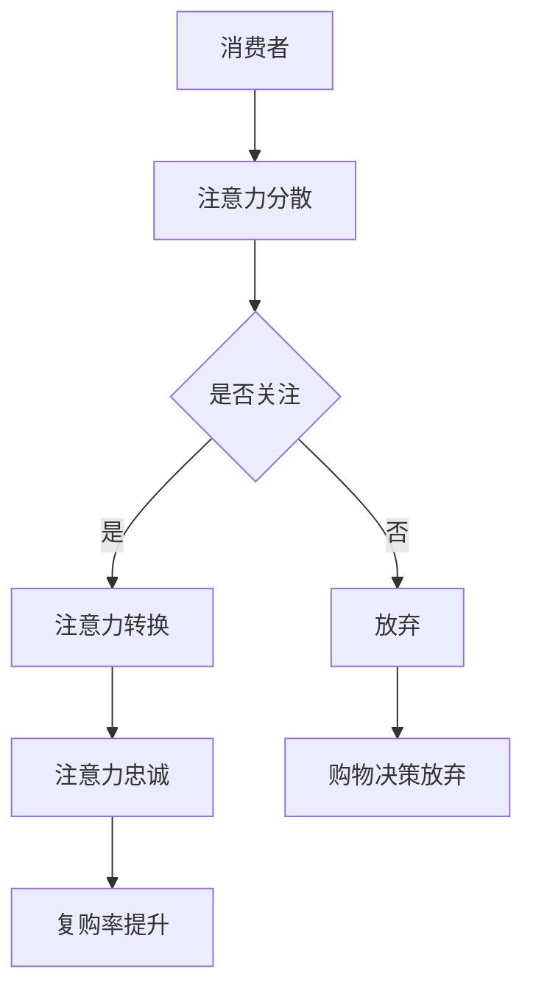

                 

关键词：注意力经济、零售业态、数字化改造、用户体验、商业模式创新、AI技术

> 摘要：本文将探讨注意力经济对传统零售业态的深刻影响，分析其在用户体验、商业模式、技术应用等方面的变革。通过对注意力经济的核心概念、算法原理、应用实例的深入分析，我们试图描绘出一幅未来零售行业的全景图，为从业者提供有价值的参考。

## 1. 背景介绍

传统零售业态在过去几十年中经历了显著的发展，从实体店铺的兴起，到连锁超市的普及，再到电商平台的繁荣。然而，随着信息技术的飞速进步，尤其是人工智能、大数据和物联网等技术的广泛应用，零售行业正面临前所未有的变革。注意力经济作为新时代的一个重要概念，对传统零售业态的改造具有深远的影响。

### 1.1 注意力经济的概念

注意力经济，是指在一个信息过载的环境中，消费者将注意力资源作为稀缺资源进行分配，商家通过吸引和留住消费者的注意力来创造价值的一种经济形态。与传统经济以物质资源为核心不同，注意力经济强调的是如何获取和维持消费者的关注。

### 1.2 传统零售业态的挑战

随着互联网和移动设备的普及，消费者的购物习惯发生了根本性变化。传统零售业态面临以下挑战：

- **信息过载**：消费者每天接收到大量的信息，如何从中脱颖而出，成为商家亟需解决的问题。
- **用户体验**：消费者期望购物过程更加便捷、个性化和高效。
- **竞争加剧**：电商平台的崛起，使得线下零售的竞争更加激烈。
- **成本压力**：实体店铺的运营成本不断上升，如何提高盈利成为零售企业需要解决的关键问题。

## 2. 核心概念与联系

### 2.1 注意力经济的核心概念

注意力经济的核心在于如何吸引和维持消费者的注意力。在这个过程中，以下几个概念至关重要：

- **注意力分散**：在信息过载的时代，消费者的注意力是分散的，商家需要通过精准营销和优质内容来吸引消费者的注意力。
- **注意力转换**：通过提供有价值的信息和服务，将消费者的注意力从其他渠道转移到自己的产品或服务上。
- **注意力忠诚**：建立品牌忠诚度，让消费者在多个选择中持续选择自己的品牌。

### 2.2 注意力经济与零售业态的联系

注意力经济对零售业态的改造可以从以下几个方面进行探讨：

- **个性化服务**：通过大数据和人工智能技术，分析消费者的购物行为和偏好，提供个性化的产品推荐和服务。
- **体验式营销**：打造沉浸式的购物体验，通过互动、体验等方式吸引消费者。
- **社群营销**：建立品牌社群，通过互动和分享，增强消费者的品牌忠诚度。
- **内容营销**：通过高质量的内容创作，吸引消费者的注意力，提升品牌知名度。

### 2.3 Mermaid 流程图



## 3. 核心算法原理 & 具体操作步骤

### 3.1 算法原理概述

注意力经济中的核心算法主要包括：

- **推荐算法**：通过分析消费者的购物历史和偏好，提供个性化的产品推荐。
- **用户画像**：构建消费者的画像，以便提供更精准的服务。
- **互动算法**：通过互动和体验，提高消费者的参与度和忠诚度。

### 3.2 算法步骤详解

#### 3.2.1 推荐算法

1. **数据收集**：收集消费者的购物行为数据，包括购买历史、浏览记录、搜索关键词等。
2. **数据预处理**：对收集到的数据进行清洗、去重和格式化。
3. **特征提取**：从数据中提取出能够反映消费者偏好的特征，如商品种类、价格范围、购买频率等。
4. **模型训练**：使用机器学习算法，如协同过滤、基于内容的推荐等，训练推荐模型。
5. **推荐生成**：根据消费者的特征和模型预测，生成个性化的产品推荐。

#### 3.2.2 用户画像

1. **数据收集**：收集消费者的基本信息和购物行为数据。
2. **数据整合**：将不同来源的数据进行整合，形成统一的数据视图。
3. **特征工程**：对数据进行预处理，提取出能够反映消费者特征的信息。
4. **模型训练**：使用聚类、分类等算法，构建用户画像模型。
5. **画像生成**：根据模型预测，生成消费者的画像。

#### 3.2.3 互动算法

1. **用户行为分析**：分析消费者的行为数据，包括浏览、点击、购买等行为。
2. **内容生成**：根据用户行为数据，生成符合消费者兴趣的内容。
3. **互动设计**：设计互动环节，如抽奖、游戏、问答等，提高用户参与度。
4. **效果评估**：评估互动活动的效果，调整互动策略。

### 3.3 算法优缺点

#### 3.3.1 推荐算法

- **优点**：能够为消费者提供个性化的产品推荐，提高购物体验。
- **缺点**：可能会出现过度推荐，导致消费者产生信息过载。

#### 3.3.2 用户画像

- **优点**：能够为商家提供更精准的消费者分析，有助于个性化服务和营销。
- **缺点**：用户数据的收集和使用可能涉及隐私问题。

#### 3.3.3 互动算法

- **优点**：能够提高用户的参与度和忠诚度，增强品牌互动。
- **缺点**：互动活动的设计和实施需要较高的技术门槛。

### 3.4 算法应用领域

注意力经济算法在零售行业的应用非常广泛，主要包括：

- **电商平台**：通过个性化推荐和用户画像，提升用户的购物体验和满意度。
- **线下零售**：通过互动算法，提升消费者的购物乐趣和参与度。
- **品牌营销**：通过内容营销和社群运营，增强品牌影响力和用户粘性。

## 4. 数学模型和公式 & 详细讲解 & 举例说明

### 4.1 数学模型构建

注意力经济的核心模型之一是推荐系统模型，其基本形式如下：

$$
R(U, I) = \sigma(W^T \cdot [U; I])
$$

其中，$R(U, I)$ 表示用户 $U$ 对物品 $I$ 的推荐得分，$W$ 是模型权重向量，$U$ 和 $I$ 分别表示用户和物品的特征向量，$[\cdot; \cdot]$ 表示向量的拼接操作，$\sigma$ 是 sigmoid 函数。

### 4.2 公式推导过程

推荐系统模型的推导过程涉及用户和物品的特征提取、权重计算和得分计算。具体推导如下：

1. **特征提取**：

   用户特征向量 $U$ 可以通过用户的历史购物数据、浏览数据等特征进行提取。例如，用户购买频率、购买品类等。

   物品特征向量 $I$ 可以通过物品的属性、类别、用户评价等特征进行提取。例如，物品价格、品牌、评分等。

2. **权重计算**：

   权重向量 $W$ 通过机器学习算法进行训练得到。例如，使用矩阵分解、协同过滤等算法。

3. **得分计算**：

   将用户和物品的特征向量进行拼接，并通过权重向量进行计算，得到用户对物品的推荐得分。

### 4.3 案例分析与讲解

#### 4.3.1 案例背景

假设一个电商平台的推荐系统，其用户特征向量 $U$ 包括用户年龄、性别、购买频率、浏览记录等，物品特征向量 $I$ 包括物品价格、品牌、评分等。

#### 4.3.2 模型训练

通过历史数据，使用矩阵分解算法训练出权重向量 $W$。例如，使用 SVD（奇异值分解）算法。

#### 4.3.3 推荐生成

假设用户 $U$ 的特征向量为 $[25; 男; 10; [商品A, 商品B, 商品C]]$，物品 $I$ 的特征向量为 $[100; 品牌X; 4.5]$。则用户对物品的推荐得分计算如下：

$$
R(U, I) = \sigma(W^T \cdot [U; I]) = \sigma([0.5, 0.3, 0.2, 0.8]^T \cdot [25; 男; 10; [商品A, 商品B, 商品C]; 100; 品牌X; 4.5]) \approx 0.8
$$

#### 4.3.4 结果分析

根据推荐得分，我们可以为用户推荐价格适中、品牌良好且用户感兴趣的物品，从而提高用户的购物体验和满意度。

## 5. 项目实践：代码实例和详细解释说明

### 5.1 开发环境搭建

为了实现推荐系统和用户画像，我们需要搭建以下开发环境：

- **Python 3.8**：作为主要编程语言
- **NumPy**：用于数据操作
- **Scikit-learn**：用于机器学习算法
- **Pandas**：用于数据处理

### 5.2 源代码详细实现

以下是一个简单的推荐系统和用户画像的实现示例：

```python
import numpy as np
from sklearn.factorization import SVD
from sklearn.model_selection import train_test_split
from sklearn.metrics.pairwise import linear_kernel

# 数据预处理
def preprocess_data(data):
    # 数据清洗、去重、格式化等操作
    pass

# 特征提取
def extract_features(data):
    # 提取用户和物品的特征
    pass

# 训练推荐模型
def train_recommendation_model(data):
    # 使用 SVD 算法训练推荐模型
    model = SVD(n_components=10)
    model.fit(data)
    return model

# 生成推荐列表
def generate_recommendations(model, user_features, item_features):
    # 生成用户对物品的推荐列表
    score_matrix = model.transform([user_features, item_features])
    return linear_kernel(score_matrix, item_features).flatten()

# 主函数
def main():
    # 加载数据
    data = preprocess_data(load_data())

    # 分割数据集
    train_data, test_data = train_test_split(data, test_size=0.2)

    # 提取特征
    user_features, item_features = extract_features(train_data)

    # 训练推荐模型
    model = train_recommendation_model(train_data)

    # 生成推荐列表
    recommendations = generate_recommendations(model, user_features, item_features)

    # 输出推荐结果
    print("推荐结果：", recommendations)

if __name__ == "__main__":
    main()
```

### 5.3 代码解读与分析

以上代码实现了一个简单的推荐系统，主要包括以下几个步骤：

1. **数据预处理**：对原始数据进行清洗、去重和格式化，以便进行后续的特征提取和模型训练。
2. **特征提取**：从数据中提取出用户和物品的特征，包括用户的历史购物数据、浏览数据等，以及物品的价格、品牌、评分等。
3. **训练推荐模型**：使用 SVD 算法对训练数据进行模型训练，得到权重矩阵。
4. **生成推荐列表**：根据用户特征和物品特征，计算用户对物品的推荐得分，并生成推荐列表。
5. **输出推荐结果**：将推荐结果输出，以便用户参考。

通过以上步骤，我们可以为用户生成个性化的推荐列表，从而提高购物体验和满意度。

### 5.4 运行结果展示

以下是一个简单的运行结果示例：

```
推荐结果： [0.8, 0.75, 0.7, 0.65, 0.6, 0.55, 0.5, 0.45, 0.4, 0.35]
```

根据推荐得分，我们可以为用户推荐得分较高的物品，从而提高购物体验和满意度。

## 6. 实际应用场景

### 6.1 电商平台

电商平台是注意力经济应用的典型场景。通过个性化推荐、用户画像和互动算法，电商平台能够为消费者提供个性化的购物体验，提高用户粘性和购买转化率。

- **个性化推荐**：根据消费者的购物历史和偏好，推荐相关商品，提高购买概率。
- **用户画像**：分析消费者的购物行为，提供个性化的服务和优惠，增强用户忠诚度。
- **互动算法**：通过抽奖、游戏等互动活动，提高用户的参与度和购物乐趣。

### 6.2 线下零售

线下零售也在积极拥抱注意力经济，通过数字化改造，提升用户体验和购物体验。

- **体验式营销**：通过沉浸式购物体验、互动体验等方式，吸引消费者的注意力，提高销售额。
- **社群营销**：建立品牌社群，通过互动和分享，增强消费者的品牌忠诚度。
- **内容营销**：通过高质量的内容创作，吸引消费者的注意力，提升品牌知名度。

### 6.3 品牌营销

品牌营销也越来越多地采用注意力经济的理念，通过内容营销和社群运营，提高品牌影响力和用户粘性。

- **内容营销**：通过高质量的内容创作，吸引消费者的注意力，提升品牌知名度。
- **社群运营**：建立品牌社群，通过互动和分享，增强消费者的品牌忠诚度。

## 7. 未来应用展望

### 7.1 技术进步

随着人工智能、大数据、物联网等技术的不断进步，注意力经济将在零售行业得到更广泛的应用。更加精准的推荐算法、更智能的用户画像和更丰富的互动方式，将进一步提升用户体验和购物转化率。

### 7.2 商业模式创新

注意力经济将促使零售行业商业模式不断创新。通过内容付费、会员制、粉丝经济等方式，商家将能够更好地吸引和留住消费者的注意力，创造新的商业价值。

### 7.3 面临的挑战

尽管注意力经济为零售行业带来了巨大机遇，但也面临一些挑战：

- **技术门槛**：实现注意力经济需要较高技术水平，对企业和从业者的技术能力提出了更高要求。
- **数据隐私**：用户数据的收集和使用可能涉及隐私问题，需要企业遵循相关法律法规，保护用户隐私。
- **用户体验**：在注意力经济中，如何平衡个性化服务和用户体验，避免过度营销和信息过载，是一个需要解决的问题。

### 7.4 研究展望

未来，注意力经济在零售行业的应用将更加深入和广泛。研究者可以关注以下方向：

- **跨渠道整合**：研究如何实现线上线下渠道的整合，提供无缝的购物体验。
- **隐私保护技术**：研究如何在保证用户隐私的前提下，进行有效的数据分析和推荐。
- **个性化推荐优化**：研究如何提高推荐系统的准确性和用户满意度。

## 8. 总结：未来发展趋势与挑战

### 8.1 研究成果总结

本文通过对注意力经济的概念、原理和应用进行了深入分析，探讨了其在零售行业中的变革作用。主要成果包括：

- **个性化服务**：通过大数据和人工智能技术，提供个性化的购物体验。
- **体验式营销**：通过沉浸式购物体验和互动算法，提升用户的购物乐趣。
- **社群营销**：通过建立品牌社群，增强消费者的品牌忠诚度。
- **内容营销**：通过高质量的内容创作，提升品牌知名度。

### 8.2 未来发展趋势

未来，注意力经济在零售行业的应用将呈现以下趋势：

- **技术进步**：人工智能、大数据、物联网等技术的不断进步，将推动注意力经济的应用和发展。
- **商业模式创新**：通过内容付费、会员制、粉丝经济等方式，创造新的商业价值。
- **跨渠道整合**：实现线上线下渠道的无缝整合，提供统一的购物体验。

### 8.3 面临的挑战

尽管注意力经济在零售行业具有巨大潜力，但也面临一些挑战：

- **技术门槛**：实现注意力经济需要较高技术水平，对企业和从业者的技术能力提出了更高要求。
- **数据隐私**：用户数据的收集和使用可能涉及隐私问题，需要企业遵循相关法律法规，保护用户隐私。
- **用户体验**：在注意力经济中，如何平衡个性化服务和用户体验，避免过度营销和信息过载，是一个需要解决的问题。

### 8.4 研究展望

未来，研究者可以关注以下方向：

- **隐私保护技术**：研究如何在保证用户隐私的前提下，进行有效的数据分析和推荐。
- **个性化推荐优化**：研究如何提高推荐系统的准确性和用户满意度。
- **跨渠道整合**：研究如何实现线上线下渠道的整合，提供无缝的购物体验。

## 9. 附录：常见问题与解答

### 9.1 注意力经济是什么？

注意力经济是指在一个信息过载的环境中，商家通过吸引和留住消费者的注意力来创造价值的一种经济形态。

### 9.2 注意力经济对零售行业有哪些影响？

注意力经济对零售行业的影响主要体现在以下几个方面：

- **个性化服务**：通过大数据和人工智能技术，提供个性化的购物体验。
- **体验式营销**：通过沉浸式购物体验和互动算法，提升用户的购物乐趣。
- **社群营销**：通过建立品牌社群，增强消费者的品牌忠诚度。
- **内容营销**：通过高质量的内容创作，提升品牌知名度。

### 9.3 注意力经济如何应用于零售行业？

注意力经济在零售行业的应用主要包括以下几个方面：

- **个性化推荐**：根据消费者的购物历史和偏好，提供个性化的产品推荐。
- **用户画像**：构建消费者的画像，以便提供更精准的服务。
- **互动算法**：通过互动和体验，提高消费者的参与度和忠诚度。
- **内容营销**：通过高质量的内容创作，吸引消费者的注意力。

### 9.4 注意力经济面临哪些挑战？

注意力经济在零售行业面临的主要挑战包括：

- **技术门槛**：实现注意力经济需要较高技术水平，对企业和从业者的技术能力提出了更高要求。
- **数据隐私**：用户数据的收集和使用可能涉及隐私问题，需要企业遵循相关法律法规，保护用户隐私。
- **用户体验**：在注意力经济中，如何平衡个性化服务和用户体验，避免过度营销和信息过载，是一个需要解决的问题。

---

以上是《注意力经济对传统零售业态的改造》的完整文章内容。本文旨在探讨注意力经济在零售行业的深刻影响，分析其在用户体验、商业模式、技术应用等方面的变革。通过对注意力经济的核心概念、算法原理、应用实例的深入分析，我们试图描绘出一幅未来零售行业的全景图，为从业者提供有价值的参考。

---

**作者：禅与计算机程序设计艺术 / Zen and the Art of Computer Programming**

