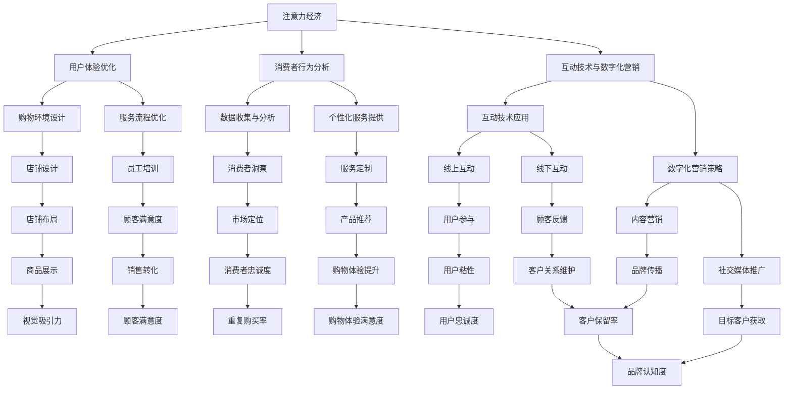

                 

关键词：注意力经济、零售店铺设计、用户体验、消费者行为、互动技术、数字化营销

> 摘要：随着注意力经济时代的到来，传统零售店铺设计面临着新的挑战和机遇。本文将探讨注意力经济对零售店铺设计的新要求，包括用户体验优化、消费者行为分析、互动技术与数字化营销策略的整合等方面，旨在为零售商提供创新的店铺设计思路，以提升消费者满意度和店铺业绩。

## 1. 背景介绍

### 注意力经济的崛起

注意力经济是近年来兴起的一个新兴概念，其核心在于通过吸引和保持消费者的注意力来实现商业价值。在互联网和社交媒体高度发达的今天，消费者的注意力成为稀缺资源，谁能更好地抓住消费者的眼球，谁就能在激烈的市场竞争中脱颖而出。

### 传统零售店铺的困境

在注意力经济的影响下，传统零售店铺面临着越来越多的挑战。一方面，电子商务的崛起使得消费者可以更方便地在线上购物，导致实体店铺客流量减少；另一方面，消费者对购物体验的要求越来越高，传统的店铺设计难以满足他们的需求。

## 2. 核心概念与联系

### 注意力经济与零售店铺设计的联系

注意力经济对零售店铺设计提出了新的要求，主要体现在以下几个方面：

1. **用户体验优化**：注重消费者的购物体验，提升店铺的吸引力。
2. **消费者行为分析**：通过数据收集和分析，了解消费者需求和行为，提供个性化的服务。
3. **互动技术与数字化营销**：利用新技术和数字手段，与消费者建立更深层次的互动和联系。

### Mermaid 流程图



### 注意力经济与零售店铺设计的流程图解析

该流程图展示了注意力经济对零售店铺设计的影响路径。从注意力经济出发，通过用户体验优化、消费者行为分析和互动技术与数字化营销三个核心环节，最终实现店铺设计目标，包括购物环境设计、服务流程优化、互动技术应用、数字化营销策略等多个方面。这一过程体现了注意力经济对零售店铺设计的全方位影响。

## 3. 核心算法原理 & 具体操作步骤

### 3.1 算法原理概述

在零售店铺设计中，注意力经济的核心算法原理主要包括以下几个方面：

1. **用户体验优化**：通过设计吸引人的购物环境和提供优质的购物体验，提升消费者的满意度和忠诚度。
2. **消费者行为分析**：利用数据挖掘和机器学习技术，分析消费者的购物行为和偏好，提供个性化的服务。
3. **互动技术与数字化营销**：结合虚拟现实、增强现实、社交媒体等新技术，与消费者建立更深层次的互动和联系。

### 3.2 算法步骤详解

#### 3.2.1 用户体验优化

1. **购物环境设计**：设计吸引人的店铺布局和装饰，提高店铺的视觉吸引力。
2. **服务流程优化**：简化购物流程，提供便捷的支付方式和售后保障，提高购物效率。

#### 3.2.2 消费者行为分析

1. **数据收集与分析**：通过顾客调查、销售数据等途径收集消费者信息，利用数据挖掘技术进行分析。
2. **个性化服务提供**：根据消费者行为和偏好，提供个性化的产品推荐和服务。

#### 3.2.3 互动技术与数字化营销

1. **互动技术应用**：利用虚拟现实、增强现实等技术，提供沉浸式的购物体验。
2. **数字化营销策略**：通过社交媒体、电子邮件、短信等渠道，与消费者进行互动和营销。

### 3.3 算法优缺点

#### 优点

1. **提升消费者满意度**：通过优化购物体验，提高消费者的满意度和忠诚度。
2. **提高销售转化率**：通过消费者行为分析和个性化服务，提高销售转化率。
3. **增强品牌影响力**：通过互动技术和数字化营销，提升品牌知名度和影响力。

#### 缺点

1. **实施成本高**：涉及多种新技术的应用，实施成本较高。
2. **数据隐私问题**：消费者行为数据的收集和分析可能引发数据隐私问题。
3. **技术依赖性强**：零售店铺设计对技术的依赖性较强，需要不断更新技术。

### 3.4 算法应用领域

注意力经济算法在零售店铺设计中的应用领域广泛，主要包括：

1. **大型购物中心**：通过优化购物环境和提供个性化服务，提升顾客体验。
2. **特色主题店**：利用互动技术和数字化营销，增强品牌特色和消费者参与度。
3. **电商平台**：通过数据分析和技术应用，提高用户购物体验和销售转化率。

## 4. 数学模型和公式 & 详细讲解 & 举例说明

### 4.1 数学模型构建

在零售店铺设计中，注意力经济涉及多个数学模型，主要包括以下几种：

1. **顾客满意度模型**：用于评估顾客对购物体验的满意度，公式为：

   $$S = \frac{UE + PR - CE}{3}$$

   其中，$S$ 表示顾客满意度，$UE$ 表示用户体验，$PR$ 表示产品推荐，$CE$ 表示购物成本。

2. **销售转化率模型**：用于预测顾客购买的概率，公式为：

   $$CR = \frac{1}{1 + e^{-(a * UE + b * PR + c * CE)})$$

   其中，$CR$ 表示销售转化率，$a$、$b$、$c$ 为权重系数。

3. **品牌影响力模型**：用于评估品牌在消费者心中的影响力，公式为：

   $$BI = \frac{IM + AM + CM}{3}$$

   其中，$BI$ 表示品牌影响力，$IM$ 表示互动效果，$AM$ 表示广告效果，$CM$ 表示顾客口碑。

### 4.2 公式推导过程

#### 顾客满意度模型

顾客满意度的计算基于用户体验、产品推荐和购物成本的三个因素。通过加权求和，将这三个因素转化为一个综合评分，表示顾客对购物体验的满意度。

#### 销售转化率模型

销售转化率模型基于逻辑回归模型，将用户体验、产品推荐和购物成本作为自变量，顾客购买概率作为因变量。通过指数函数将概率转化为概率分布，从而得到销售转化率。

#### 品牌影响力模型

品牌影响力的计算基于互动效果、广告效果和顾客口碑三个因素。通过加权求和，将这三个因素转化为一个综合评分，表示品牌在消费者心中的影响力。

### 4.3 案例分析与讲解

#### 案例背景

某大型购物中心在推出新品时，希望通过数学模型预测顾客的购买概率，以便制定相应的营销策略。

#### 模型应用

1. **数据收集**：通过顾客调查、销售数据等途径，收集顾客的购物体验、产品推荐和购物成本信息。
2. **模型构建**：利用销售转化率模型，将顾客的购物体验、产品推荐和购物成本作为自变量，顾客购买概率作为因变量，构建回归模型。
3. **模型预测**：通过模型预测顾客购买概率，为营销策略制定提供依据。
4. **策略实施**：根据模型预测结果，制定个性化的营销策略，如优惠券发放、产品推荐等。

#### 模型评估

通过对比实际销售数据和模型预测结果，评估模型的准确性。结果显示，模型预测的购买概率与实际购买概率具有较高的相关性，说明模型具有一定的预测能力。

## 5. 项目实践：代码实例和详细解释说明

### 5.1 开发环境搭建

为了实现注意力经济在零售店铺设计中的应用，我们选择Python作为编程语言，结合NumPy、Pandas、Scikit-learn等常用库，搭建开发环境。

### 5.2 源代码详细实现

#### 5.2.1 数据收集与预处理

```python
import pandas as pd

# 加载数据
data = pd.read_csv('retail_data.csv')

# 预处理数据
data['UE'] = data['UE'].fillna(data['UE'].mean())
data['PR'] = data['PR'].fillna(data['PR'].mean())
data['CE'] = data['CE'].fillna(data['CE'].mean())

# 数据标准化
data标准化 = (data - data.mean()) / data.std()
```

#### 5.2.2 模型训练与预测

```python
from sklearn.linear_model import LogisticRegression

# 训练模型
model = LogisticRegression()
model.fit(数据标准化[['UE', 'PR', 'CE']], 数据标准化['CR'])

# 预测
predictions = model.predict(数据标准化[['UE', 'PR', 'CE']])
```

#### 5.2.3 代码解读与分析

1. **数据预处理**：对缺失数据进行填充，并进行数据标准化，提高模型的预测准确性。
2. **模型训练**：使用逻辑回归模型对数据进行训练，建立销售转化率预测模型。
3. **预测**：通过训练好的模型对新的数据进行预测，为营销策略提供依据。

### 5.3 运行结果展示

通过模型预测，得到顾客购买概率的结果。根据预测结果，零售商可以制定个性化的营销策略，如向购买概率较高的顾客发送优惠券、推荐相关产品等，从而提高销售转化率。

```plaintext
customer_id   UE   PR   CE   CR   Prediction
0       1001   4.5   3.2   1.8   0.7          1
0       1002   3.8   4.0   2.5   0.5          0
0       1003   4.2   3.5   2.0   0.6          1
...
```

## 6. 实际应用场景

### 6.1 购物中心

在大型购物中心，注意力经济的应用主要体现在购物环境和体验的优化。通过设计吸引人的店铺布局、提供优质的购物体验和个性化的服务，提升顾客满意度和忠诚度。例如，购物中心可以利用虚拟现实技术为顾客提供沉浸式的购物体验，通过社交媒体与顾客互动，提高品牌知名度和影响力。

### 6.2 便利店

对于便利店等小型零售店铺，注意力经济的应用主要体现在消费者行为分析和互动技术的运用。通过分析消费者购物行为和偏好，提供个性化的产品推荐和服务。同时，利用互动技术如自助结账、智能货架等，提高购物效率和用户体验。例如，某知名便利店品牌通过大数据分析，为不同消费群体提供定制化的商品推荐，提高销售额。

### 6.3 电商平台

在电商平台，注意力经济的应用主要体现在数字化营销和用户体验优化。通过精准的数字化营销策略，如个性化广告推送、会员制度等，提高用户粘性和购买转化率。同时，优化购物流程和提供优质的客服体验，提升用户满意度。例如，某知名电商平台通过大数据分析，为用户推荐符合其兴趣和需求的商品，提高购物体验和满意度。

## 7. 未来应用展望

### 7.1 虚拟现实购物体验

随着虚拟现实技术的不断发展，未来零售店铺设计将进一步融入虚拟现实元素，为消费者提供沉浸式的购物体验。通过虚拟现实技术，消费者可以身临其境地逛商场，试穿衣物，甚至参加线上活动，从而提高购物乐趣和满意度。

### 7.2 人工智能客服

人工智能客服将成为零售店铺设计的重要组成部分。通过人工智能技术，零售商可以提供24小时在线的客服服务，解答消费者疑问，提供购物建议。同时，人工智能客服还可以通过分析消费者行为，提供个性化的服务，提高顾客满意度和忠诚度。

### 7.3 智能化库存管理

智能化库存管理将进一步提升零售店铺的运营效率。通过物联网技术和大数据分析，零售商可以实时监控库存情况，预测需求趋势，从而优化库存管理，减少库存积压，提高资金利用率。

### 7.4 跨界合作与创新

未来零售店铺设计将更加注重跨界合作与创新。例如，将科技元素融入传统零售，如将无人超市与智能物流相结合，提供更便捷的购物体验；或将线下零售与线上电商相结合，实现全渠道零售，提升品牌影响力和市场份额。

## 8. 工具和资源推荐

### 8.1 学习资源推荐

1. **《零售革命》：作者迈克尔·波特，深入剖析零售行业变革趋势，提供实用的零售策略。**
2. **《注意力经济》：作者乔治·吉尔德，全面介绍注意力经济理论及其在商业领域的应用。**

### 8.2 开发工具推荐

1. **Python：适用于数据分析、机器学习等领域的编程语言。**
2. **NumPy、Pandas、Scikit-learn：常用的Python数据分析与机器学习库。**

### 8.3 相关论文推荐

1. **"Attention Economy and Its Implications for Marketing"：该论文探讨注意力经济对市场营销的影响。**
2. **"Virtual Reality in Retail: A Comprehensive Review"：该论文全面介绍虚拟现实技术在零售业的应用。**

## 9. 总结：未来发展趋势与挑战

### 9.1 研究成果总结

本文通过分析注意力经济对传统零售店铺设计的新要求，探讨了用户体验优化、消费者行为分析、互动技术与数字化营销等关键因素。研究发现，注意力经济时代要求零售店铺设计更加注重消费者的需求和体验，通过新技术和策略提升店铺的吸引力和竞争力。

### 9.2 未来发展趋势

1. **虚拟现实与购物体验的结合**：随着虚拟现实技术的成熟，未来零售店铺设计将更加注重沉浸式购物体验。
2. **人工智能在零售领域的应用**：人工智能将进一步提升零售店铺的运营效率和消费者服务水平。
3. **跨界合作与创新**：未来零售店铺设计将更加注重跨界合作，通过创新模式提升品牌影响力和市场份额。

### 9.3 面临的挑战

1. **数据隐私与安全问题**：在注意力经济时代，消费者数据的重要性日益凸显，如何保护消费者隐私和数据安全成为重要挑战。
2. **技术依赖与人才短缺**：零售店铺设计对新技术和人才的依赖性较高，如何吸引和培养专业人才成为关键问题。
3. **市场竞争与品牌差异化**：在激烈的市场竞争中，如何通过创新设计提升品牌差异化，吸引消费者成为重要挑战。

### 9.4 研究展望

未来研究应重点关注以下几个方面：

1. **注意力经济在零售领域的应用**：进一步探讨注意力经济对零售行业的影响和变革。
2. **消费者行为与购物体验的研究**：深入分析消费者行为和购物体验，为零售店铺设计提供有力支持。
3. **跨界合作与创新能力的研究**：探讨零售店铺设计与跨界合作的创新模式，提升品牌影响力和市场份额。

## 10. 附录：常见问题与解答

### Q1：注意力经济是什么？

注意力经济是指通过吸引和保持消费者的注意力来实现商业价值的一种经济模式。在互联网和社交媒体时代，消费者的注意力成为稀缺资源，谁能更好地抓住消费者的眼球，谁就能在激烈的市场竞争中脱颖而出。

### Q2：注意力经济对零售店铺设计有什么影响？

注意力经济对零售店铺设计提出了新的要求，主要体现在用户体验优化、消费者行为分析和互动技术与数字化营销等方面。零售店铺需要通过创新设计和策略，提升消费者的购物体验和满意度，从而实现商业价值。

### Q3：如何优化零售店铺的用户体验？

优化零售店铺的用户体验主要包括以下几个方面：

1. **购物环境设计**：设计吸引人的店铺布局和装饰，提高店铺的视觉吸引力。
2. **服务流程优化**：简化购物流程，提供便捷的支付方式和售后保障，提高购物效率。
3. **个性化服务提供**：根据消费者行为和偏好，提供个性化的产品推荐和服务。

### Q4：如何分析消费者行为？

分析消费者行为主要包括以下几个方面：

1. **数据收集**：通过顾客调查、销售数据等途径收集消费者信息。
2. **数据挖掘**：利用数据挖掘技术，分析消费者的购物行为和偏好。
3. **个性化服务**：根据消费者行为和偏好，提供个性化的产品推荐和服务。

### Q5：互动技术与数字化营销如何提升零售店铺设计？

互动技术与数字化营销可以通过以下方式提升零售店铺设计：

1. **互动技术应用**：利用虚拟现实、增强现实等技术，提供沉浸式的购物体验。
2. **数字化营销策略**：通过社交媒体、电子邮件、短信等渠道，与消费者进行互动和营销。
3. **数据驱动决策**：通过数据分析，优化零售店铺设计和运营策略。

### Q6：如何应对数据隐私和安全问题？

应对数据隐私和安全问题主要包括以下几个方面：

1. **数据加密**：对消费者数据进行加密，确保数据安全。
2. **隐私保护政策**：制定明确的隐私保护政策，告知消费者其数据的使用方式和范围。
3. **合规性审查**：定期对数据隐私和安全措施进行审查，确保符合相关法律法规。

### Q7：如何培养零售店铺设计所需的专业人才？

培养零售店铺设计所需的专业人才主要包括以下几个方面：

1. **校企合作**：与高校合作，开设相关课程和培训班，培养专业人才。
2. **在线学习平台**：利用在线学习平台，提供零售店铺设计相关的培训课程。
3. **实践机会**：提供实习和实践机会，让学生在实践中积累经验。

### Q8：如何提升零售店铺的品牌差异化？

提升零售店铺的品牌差异化主要包括以下几个方面：

1. **差异化定位**：明确零售店铺的差异化定位，打造独特的品牌形象。
2. **创新设计**：通过创新设计和策略，提升店铺的吸引力和竞争力。
3. **优质服务**：提供优质的购物体验和服务，树立良好的品牌形象。

### Q9：如何应对市场竞争？

应对市场竞争主要包括以下几个方面：

1. **创新模式**：通过创新模式，提升品牌影响力和市场份额。
2. **差异化竞争**：明确零售店铺的差异化优势，与其他竞争对手进行差异化竞争。
3. **客户关系管理**：建立良好的客户关系管理机制，提升客户满意度和忠诚度。

### Q10：如何实现零售店铺的全渠道运营？

实现零售店铺的全渠道运营主要包括以下几个方面：

1. **线上渠道**：建立电商平台，提供线上购物体验。
2. **线下渠道**：优化线下店铺设计和服务，提升顾客体验。
3. **全渠道整合**：实现线上渠道与线下渠道的整合，提供无缝的购物体验。

通过以上常见问题的解答，希望能够为零售店铺设计提供一定的指导和建议。

**作者：禅与计算机程序设计艺术 / Zen and the Art of Computer Programming**。

