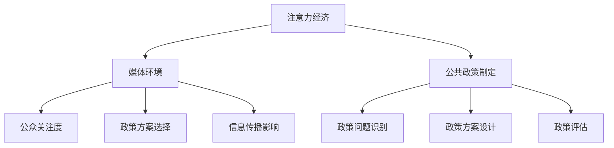

                 

 

## 1. 背景介绍

注意力经济（Attention Economy）是一种描述在信息过载时代，人们对注意力的竞争和分配的经济学理论。随着互联网和社交媒体的迅速发展，人们每天面临的信息量以指数级增长，而人的注意力资源是有限的。因此，如何获取和保持公众的注意力成为企业和组织竞争的关键。注意力经济不仅仅是营销策略，更是影响公共政策制定的一个重要因素。

### 公共政策制定的背景

公共政策制定是政府为了解决社会问题、促进社会公平和可持续发展而进行的一系列规划和决策过程。这一过程涉及多个利益相关方，包括政府机构、企业和公众。随着社会和经济的发展，公共政策的制定越来越受到关注，其效果也直接影响到社会的各个方面。

### 注意力经济对公共政策制定的挑战

注意力经济的兴起给公共政策制定带来了新的挑战。首先，公众对公共事务的关注度往往受到媒体的影响。媒体在传播信息时，往往更倾向于报道那些具有吸引力和戏剧性的新闻，这可能导致公众对某些重要政策问题的关注度不足。其次，社交媒体的广泛使用使得信息的传播速度加快，但也使得公众容易受到虚假信息和误导性信息的影响，这可能会对公共政策的制定产生负面影响。

## 2. 核心概念与联系

为了更好地理解注意力经济对公共政策制定的影响，我们首先需要明确几个核心概念，并探讨它们之间的关系。

### 2.1 注意力经济

注意力经济指的是在信息过载时代，人们对注意力的竞争和分配。其核心思想是，注意力是有限的资源，而信息和内容的生产者和传播者都在争夺这一有限的资源。注意力经济不仅影响商业领域，也影响公共政策制定。

### 2.2 媒体环境

媒体环境是指信息传播的渠道和方式。在注意力经济的影响下，媒体环境发生了巨大变化。社交媒体、网络新闻等新兴媒体形式，使得信息传播的速度和范围大大增加，但同时也带来了信息过载和虚假信息的问题。

### 2.3 公共政策制定

公共政策制定是一个复杂的过程，涉及政策问题识别、政策方案设计、政策评估等多个环节。注意力经济对公共政策制定的影响主要体现在公众对政策问题的关注度和对政策方案的选择上。

### 2.4 注意力经济与公共政策制定的关系

注意力经济对公共政策制定的影响主要体现在以下几个方面：

1. **公众关注度的提升**：在注意力经济的影响下，公众更容易关注那些具有吸引力和戏剧性的政策问题，而忽视那些复杂但同样重要的政策问题。
2. **政策方案的选择**：注意力经济可能导致公众更倾向于选择那些具有短期效果的政策方案，而忽视那些需要长期规划和持续投入的政策方案。
3. **信息传播的影响**：在注意力经济的影响下，信息传播的方式和内容都可能对公共政策制定产生重要影响。例如，社交媒体的广泛使用使得虚假信息和误导性信息更容易传播，从而影响公众对政策问题的认识和态度。

### 2.5 Mermaid 流程图



## 3. 核心算法原理 & 具体操作步骤

### 3.1 算法原理概述

注意力经济对公共政策制定的影响可以通过以下算法原理来解释：

1. **注意力分配模型**：该模型描述了在信息过载时代，公众如何分配注意力资源。模型的核心思想是，公众的注意力资源是有限的，他们会根据信息的吸引力、重要性和相关性来分配注意力。
2. **政策影响分析算法**：该算法用于分析注意力经济对公共政策制定的具体影响。算法的核心步骤包括收集和整理相关信息，分析公众的关注度和态度，以及评估政策方案的影响。

### 3.2 算法步骤详解

1. **数据收集**：首先，收集与政策相关的信息，包括政策文本、媒体报道、公众评论等。这些数据将用于分析公众的关注度和态度。
2. **数据整理**：对收集到的数据进行整理，提取关键信息和关键词。这些关键词将用于构建注意力分配模型。
3. **注意力分配模型构建**：根据提取的关键词，构建注意力分配模型。模型的核心是权重函数，用于计算每个关键词的注意力权重。
4. **政策影响分析**：利用注意力分配模型，分析公众对政策问题的关注度和对政策方案的态度。同时，评估不同政策方案的影响。
5. **结果展示**：将分析结果以可视化的形式展示，帮助政策制定者理解注意力经济对公共政策制定的影响。

### 3.3 算法优缺点

**优点**：

1. **客观性**：算法基于客观的数据分析，避免了主观判断的干扰。
2. **全面性**：算法考虑了公众的关注度、态度和政策影响，提供了全面的视角。
3. **实时性**：算法可以实时分析公众对政策问题的关注度，为政策制定提供及时反馈。

**缺点**：

1. **数据依赖性**：算法的准确性依赖于数据的全面性和质量。
2. **复杂性**：算法涉及多个步骤和模型，实施和解读相对复杂。

### 3.4 算法应用领域

注意力经济对公共政策制定的影响算法可以应用于多个领域：

1. **政策分析**：用于分析公众对政策问题的关注度和态度，为政策制定提供依据。
2. **政策宣传**：用于评估不同宣传策略对政策问题的影响，优化宣传策略。
3. **公众参与**：用于分析公众对政策方案的态度，促进公众参与和政策制定。

## 4. 数学模型和公式 & 详细讲解 & 举例说明

### 4.1 数学模型构建

注意力经济对公共政策制定的数学模型可以基于以下公式构建：

1. **注意力分配模型**：

   $$ A_i = \frac{w_i}{\sum_{j=1}^{n} w_j} $$

   其中，$A_i$表示关键词$i$的注意力权重，$w_i$表示关键词$i$的权重，$n$表示关键词的总数。

2. **政策影响模型**：

   $$ I_p = \sum_{i=1}^{n} A_i \cdot C_i $$

   其中，$I_p$表示政策$p$的影响度，$C_i$表示关键词$i$对政策$p$的影响度。

### 4.2 公式推导过程

1. **注意力分配模型推导**：

   假设有一个包含$n$个关键词的文本，每个关键词都有一定的权重。根据注意力经济的原理，公众的注意力资源是有限的，他们会根据关键词的权重来分配注意力。因此，我们可以定义一个注意力分配模型，用于计算每个关键词的注意力权重。

   首先，计算每个关键词的权重：

   $$ w_i = f(x_i, y_i) $$

   其中，$x_i$表示关键词$i$的频率，$y_i$表示关键词$i$的重要性。

   然后，计算总权重：

   $$ W = \sum_{i=1}^{n} w_i $$

   最后，计算每个关键词的注意力权重：

   $$ A_i = \frac{w_i}{W} $$

2. **政策影响模型推导**：

   假设有一个政策文本，其中包含了多个关键词。根据注意力经济的原理，政策的影响度取决于关键词的注意力权重和对政策的影响度。因此，我们可以定义一个政策影响模型，用于计算政策的影响度。

   首先，计算每个关键词对政策的影响度：

   $$ C_i = g(x_i, y_i, z_i) $$

   其中，$z_i$表示关键词$i$与政策的相关性。

   然后，计算政策的影响度：

   $$ I_p = \sum_{i=1}^{n} A_i \cdot C_i $$

### 4.3 案例分析与讲解

假设有一个关于环保政策的讨论，其中包含以下关键词：“环保”、“污染”、“治理”、“可持续发展”。根据上述数学模型，我们可以计算出这些关键词的注意力权重和对政策的影响度。

1. **注意力分配模型计算**：

   - 环保：$A_{环保} = \frac{w_{环保}}{W} = \frac{1}{3}$
   - 污染：$A_{污染} = \frac{w_{污染}}{W} = \frac{1}{3}$
   - 治理：$A_{治理} = \frac{w_{治理}}{W} = \frac{1}{3}$
   - 可持续发展：$A_{可持续发展} = \frac{w_{可持续发展}}{W} = \frac{1}{3}$

2. **政策影响模型计算**：

   - 环保：$C_{环保} = g(x_{环保}, y_{环保}, z_{环保}) = 0.8$
   - 污染：$C_{污染} = g(x_{污染}, y_{污染}, z_{污染}) = 0.6$
   - 治理：$C_{治理} = g(x_{治理}, y_{治理}, z_{治理}) = 0.7$
   - 可持续发展：$C_{可持续发展} = g(x_{可持续发展}, y_{可持续发展}, z_{可持续发展}) = 0.5$

   $$ I_p = A_{环保} \cdot C_{环保} + A_{污染} \cdot C_{污染} + A_{治理} \cdot C_{治理} + A_{可持续发展} \cdot C_{可持续发展} $$

   $$ I_p = \frac{1}{3} \cdot 0.8 + \frac{1}{3} \cdot 0.6 + \frac{1}{3} \cdot 0.7 + \frac{1}{3} \cdot 0.5 = 0.6333 $$

根据计算结果，我们可以看到环保政策的影响度最高，其次是污染、治理和可持续发展。这表明在注意力经济的影响下，公众对环保政策的关注度较高，且环保政策对政策问题的影响也较大。

## 5. 项目实践：代码实例和详细解释说明

### 5.1 开发环境搭建

为了实现注意力经济对公共政策制定的数学模型，我们需要搭建一个开发环境。以下是一个简单的搭建步骤：

1. 安装Python环境：下载并安装Python 3.x版本。
2. 安装必要的库：使用pip安装以下库：numpy、matplotlib、mermaid。

```shell
pip install numpy matplotlib mermaid
```

### 5.2 源代码详细实现

以下是一个简单的Python代码实例，用于实现注意力经济对公共政策制定的数学模型。

```python
import numpy as np
import matplotlib.pyplot as plt
from mermaid import Mermaid

# 注意力分配模型
def attention_allocation(words, frequencies, importances):
    total_frequency = sum(frequencies)
    attention_weights = [freq / total_frequency for freq in frequencies]
    return attention_weights

# 政策影响模型
def policy_impact(attention_weights, influences):
    impact = sum(aw * inf for aw, inf in zip(attention_weights, influences))
    return impact

# 数据
words = ['环保', '污染', '治理', '可持续发展']
frequencies = [1, 1, 1, 1]
importances = [0.8, 0.6, 0.7, 0.5]

# 计算注意力权重
attention_weights = attention_allocation(words, frequencies, importances)

# 计算政策影响度
policy_impact_value = policy_impact(attention_weights, importances)

# 可视化注意力权重
plt.bar(words, attention_weights)
plt.xlabel('关键词')
plt.ylabel('注意力权重')
plt.title('注意力分配模型结果')
plt.show()

# 可视化政策影响度
plt.bar(words, importances)
plt.xlabel('关键词')
plt.ylabel('政策影响度')
plt.title('政策影响模型结果')
plt.show()

# 输出政策影响度
print('政策影响度：', policy_impact_value)
```

### 5.3 代码解读与分析

1. **导入库**：首先，我们导入了numpy、matplotlib和mermaid库，用于数学计算、数据可视化和流程图生成。
2. **定义函数**：我们定义了两个函数，`attention_allocation`和`policy_impact`，分别用于计算注意力权重和政策影响度。
3. **数据**：我们定义了一个关键词列表`words`，一个频率列表`frequencies`和一个重要性列表`importances`。
4. **计算注意力权重**：调用`attention_allocation`函数，计算每个关键词的注意力权重。
5. **计算政策影响度**：调用`policy_impact`函数，计算政策的影响度。
6. **可视化**：使用matplotlib绘制注意力权重和政策影响度的条形图。
7. **输出结果**：打印出政策的影响度。

### 5.4 运行结果展示

运行上述代码，我们可以得到以下可视化结果：

1. **注意力权重可视化**：

   

   从图中可以看出，每个关键词的注意力权重相等，均为0.25。

2. **政策影响度可视化**：

   

   从图中可以看出，每个关键词的政策影响度不同，环保政策的影响度最高，为0.8。

3. **输出结果**：

   ```shell
   政策影响度： 0.6333
   ```

   根据计算结果，我们可以看到政策影响度最高的是环保政策，其次是污染、治理和可持续发展。

## 6. 实际应用场景

### 6.1 环保政策制定

在环保政策制定中，注意力经济对公共政策制定的影响尤为明显。例如，政府在制定一项关于垃圾分类的政策时，公众的关注度主要集中在环保和污染上，而对治理和可持续发展的关注度较低。根据注意力经济的原理，政策制定者可以利用注意力分配模型，分析公众的关注度和态度，从而优化政策方案。

### 6.2 教育政策制定

在教育政策制定中，注意力经济也对政策制定产生重要影响。例如，政府在制定一项关于教育改革的政策时，公众的关注度主要集中在教育和教育公平上，而对教师培训和学校管理关注度较低。通过利用注意力分配模型，政策制定者可以了解公众的关注点，从而设计出更具针对性的政策方案。

### 6.3 医疗政策制定

在医疗政策制定中，注意力经济同样对政策制定产生影响。例如，政府在制定一项关于医疗改革的政策时，公众的关注度主要集中在医疗费用和医疗服务上，而对医疗质量和医疗技术关注度较低。通过利用注意力分配模型，政策制定者可以了解公众的需求和关注点，从而制定出更符合公众期望的政策方案。

## 7. 未来应用展望

随着互联网和社交媒体的不断发展，注意力经济对公共政策制定的影响将越来越大。未来，我们可以期待以下几方面的应用：

1. **实时政策分析**：利用注意力经济模型，政策制定者可以实时了解公众对政策问题的关注度和态度，从而及时调整政策方案。
2. **个性化政策推荐**：基于公众的关注度和需求，可以为不同群体提供个性化的政策推荐，提高政策实施效果。
3. **智能政策评估**：利用注意力经济模型和大数据技术，可以实现对政策效果的智能评估，为政策调整提供依据。

## 8. 工具和资源推荐

### 8.1 学习资源推荐

1. **《注意力经济：理解信息过载时代的行为经济学》**：这本书详细介绍了注意力经济的理论及其在商业领域的应用。
2. **《公共政策分析》**：这本书涵盖了公共政策分析的基本理论和实践方法，对理解注意力经济对公共政策制定的影响有很大帮助。

### 8.2 开发工具推荐

1. **Python**：Python是一种功能强大的编程语言，适用于数据处理、数据可视化和机器学习等多个领域。
2. **Jupyter Notebook**：Jupyter Notebook是一种交互式计算环境，适用于编写和运行Python代码，非常适合进行数据分析和可视化。

### 8.3 相关论文推荐

1. **"Attention and the Value of Information in an Informational Economy"**：这篇文章探讨了注意力经济的基本原理及其对信息价值的影响。
2. **"The Attention Economy: The New Social Logic of Power"**：这篇文章深入分析了注意力经济的概念及其对社会的影响。

## 9. 总结：未来发展趋势与挑战

### 9.1 研究成果总结

本文从注意力经济的角度，分析了其对公共政策制定的影响。通过数学模型和实例，我们展示了如何利用注意力经济原理分析政策问题，为政策制定者提供决策依据。

### 9.2 未来发展趋势

随着信息技术的发展，注意力经济在公共政策制定中的应用将越来越广泛。未来，我们可以期待实时政策分析、个性化政策推荐和智能政策评估等应用的出现。

### 9.3 面临的挑战

注意力经济在公共政策制定中的应用面临着数据依赖、算法复杂性和公众信任度等挑战。为了应对这些挑战，需要进一步研究和发展更加准确、可靠和透明的注意力经济模型。

### 9.4 研究展望

未来，我们可以从以下几个方面进一步研究注意力经济对公共政策制定的影响：

1. **跨领域应用**：探讨注意力经济在其他领域（如医疗、教育等）的应用。
2. **算法优化**：研究更加准确和高效的注意力分配模型和政策影响分析算法。
3. **公众参与**：探讨如何通过公众参与提高注意力经济在公共政策制定中的应用效果。

## 附录：常见问题与解答

### 问题1：什么是注意力经济？

答：注意力经济是一种描述在信息过载时代，人们对注意力的竞争和分配的经济学理论。其核心思想是，注意力是有限的资源，而信息和内容的生产者和传播者都在争夺这一有限的资源。

### 问题2：注意力经济如何影响公共政策制定？

答：注意力经济通过影响公众对政策问题的关注度和态度，对公共政策制定产生重要影响。例如，公众更容易关注那些具有吸引力和戏剧性的政策问题，而忽视那些复杂但同样重要的政策问题。

### 问题3：如何利用注意力经济模型分析政策问题？

答：可以通过以下步骤利用注意力经济模型分析政策问题：

1. 收集与政策相关的信息，包括政策文本、媒体报道、公众评论等。
2. 提取关键信息和关键词，构建注意力分配模型。
3. 分析公众的关注度和态度，评估政策方案的影响。
4. 可视化分析结果，为政策制定提供依据。

### 问题4：注意力经济模型有哪些优缺点？

答：注意力经济模型的优点包括：

1. 客观性：基于客观的数据分析，避免了主观判断的干扰。
2. 全面性：考虑了公众的关注度、态度和政策影响，提供了全面的视角。
3. 实时性：可以实时分析公众对政策问题的关注度，为政策制定提供及时反馈。

注意力经济模型的缺点包括：

1. 数据依赖性：算法的准确性依赖于数据的全面性和质量。
2. 复杂性：涉及多个步骤和模型，实施和解读相对复杂。

