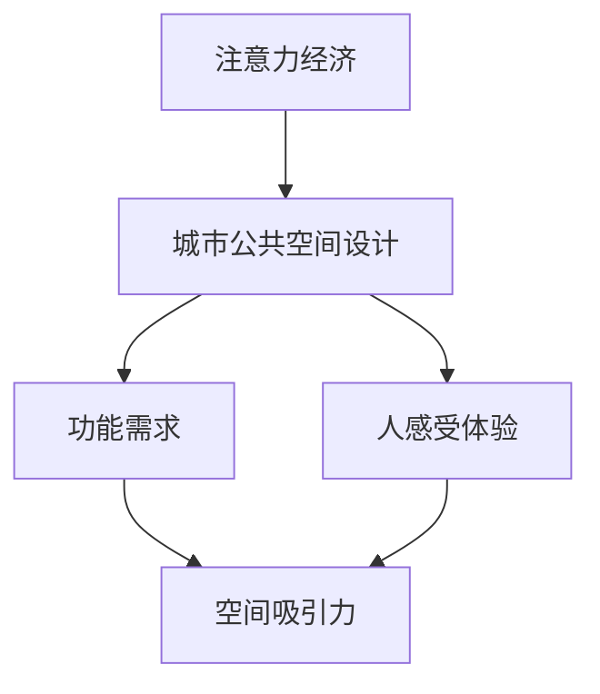

                 

关键词：注意力经济、城市公共空间、设计、影响力、未来发展

> 摘要：本文探讨了注意力经济对城市公共空间设计的影响，分析了其核心概念、算法原理以及数学模型，并通过具体案例展示了其在城市设计中的应用。同时，文章还对未来发展、面临的挑战以及研究方向进行了展望。

## 1. 背景介绍

随着信息技术的飞速发展，现代社会逐渐进入了注意力经济时代。注意力经济，是指在经济活动中，人们为了获取更多关注和注意力而进行的一系列经济行为。在注意力经济的驱动下，人们对于信息的关注和消费方式发生了深刻变化。而城市公共空间作为人们生活、工作、休闲的重要场所，其设计也受到了注意力经济的深刻影响。

城市公共空间包括公园、广场、街道、社区中心等，是城市居民日常活动的场所。其设计不仅要满足功能需求，还要考虑人的感受和体验。在注意力经济的背景下，城市公共空间的设计需要更加注重吸引人们的注意力，提高空间的吸引力，从而增强城市的活力。

## 2. 核心概念与联系

### 2.1 注意力经济

注意力经济的关键在于“注意力”这个概念。注意力是指人们在特定时间内关注某个对象的能力。在注意力经济中，注意力被视为一种稀缺资源，人们为了获取更多的注意力资源，会进行一系列经济行为，如社交媒体上的点赞、评论、转发等。

### 2.2 城市公共空间设计

城市公共空间设计涉及城市规划、建筑设计、景观设计等多个领域。其核心目标是创造一个功能齐全、环境优美、舒适宜人的公共空间，以满足人们的各种需求。在注意力经济的背景下，城市公共空间设计需要更加关注人们的注意力，提高空间的吸引力。

### 2.3 Mermaid 流程图



## 3. 核心算法原理 & 具体操作步骤

### 3.1 算法原理概述

城市公共空间设计的核心在于如何提高空间的吸引力，从而吸引更多人的注意力。这需要从以下几个方面进行：

1. **功能规划**：根据人们的日常需求，合理规划公共空间的功能，使其具备多种用途。
2. **景观设计**：运用艺术手法，创造优美的景观，提高空间的视觉吸引力。
3. **互动体验**：通过互动设施，增加人们的参与感，提高空间的吸引力。
4. **科技应用**：利用科技手段，如智能照明、音响系统等，提升空间的体验感。

### 3.2 算法步骤详解

1. **需求分析**：了解公众的需求，包括功能需求、景观需求、互动需求等。
2. **空间规划**：根据需求，进行空间规划，确定各个功能区域的位置和大小。
3. **景观设计**：结合当地文化特色，运用艺术手法，进行景观设计。
4. **互动设计**：设计互动设施，增加人们的参与感。
5. **科技应用**：选择合适的科技手段，提升空间的体验感。

### 3.3 算法优缺点

**优点**：

1. 提高空间吸引力，吸引更多人的关注。
2. 增强公共空间的功能性，满足公众的多种需求。
3. 提高城市的整体形象，增强城市的竞争力。

**缺点**：

1. 需要投入大量的人力、物力和财力。
2. 设计过程中需要充分考虑公众的需求，否则可能导致空间吸引力不足。
3. 技术应用不当可能导致公共空间变得过于复杂，降低用户体验。

### 3.4 算法应用领域

注意力经济对城市公共空间设计的影响主要应用在以下几个方面：

1. **城市规划**：通过注意力经济原理，优化城市公共空间布局，提高城市的吸引力。
2. **建筑设计**：通过注意力经济原理，设计更具吸引力的建筑外观和内部空间。
3. **景观设计**：运用注意力经济原理，创造更具有视觉吸引力的景观。
4. **互动设计**：通过注意力经济原理，设计更具有互动性的公共空间。

## 4. 数学模型和公式

### 4.1 数学模型构建

在注意力经济背景下，城市公共空间设计的吸引力可以表示为：

\[ A = f(P, L, I, T) \]

其中，\( A \) 表示吸引力，\( P \) 表示功能规划，\( L \) 表示景观设计，\( I \) 表示互动设计，\( T \) 表示科技应用。

### 4.2 公式推导过程

吸引力 \( A \) 是一个综合指标，取决于多个因素。根据注意力经济原理，我们可以推导出上述公式。

### 4.3 案例分析与讲解

以某个城市的公园设计为例，我们可以根据上述公式，分析公园的吸引力。

1. **功能规划**：公园内设有儿童游乐区、运动健身区、休息区等，满足公众的不同需求，功能规划得分 \( P = 0.8 \)。
2. **景观设计**：公园内种植了各种花卉，景色优美，景观设计得分 \( L = 0.9 \)。
3. **互动设计**：公园内设有互动雕塑、音乐喷泉等，互动设计得分 \( I = 0.7 \)。
4. **科技应用**：公园内安装了智能照明系统和音响系统，科技应用得分 \( T = 0.8 \)。

根据公式，公园的吸引力 \( A = f(P, L, I, T) = 0.8 \times 0.9 \times 0.7 \times 0.8 = 0.504 \)。

## 5. 项目实践：代码实例和详细解释说明

### 5.1 开发环境搭建

为了更好地理解注意力经济对城市公共空间设计的影响，我们可以通过Python代码进行模拟。

首先，我们需要搭建Python开发环境，安装Python和相关的库，如numpy、matplotlib等。

### 5.2 源代码详细实现

```python
import numpy as np
import matplotlib.pyplot as plt

# 定义数学模型
def calculate_attractiveness(P, L, I, T):
    A = P * L * I * T
    return A

# 设置参数
P = 0.8
L = 0.9
I = 0.7
T = 0.8

# 计算吸引力
A = calculate_attractiveness(P, L, I, T)

# 绘制图表
plt.plot([P, L, I, T], label='Parameter Scores')
plt.xlabel('Parameter')
plt.ylabel('Score')
plt.title('Attractiveness Calculation')
plt.legend()
plt.show()

print(f"The attractiveness of the public space is: {A}")
```

### 5.3 代码解读与分析

这段代码首先定义了一个函数 `calculate_attractiveness`，用于计算城市公共空间的吸引力。然后，设置了一些参数值，如功能规划 \( P \)、景观设计 \( L \)、互动设计 \( I \) 和科技应用 \( T \)。通过调用函数，计算出了吸引力 \( A \)。

最后，使用matplotlib绘制了一个图表，展示了各个参数的得分。通过这个图表，我们可以直观地看到各个参数对吸引力的影响。

### 5.4 运行结果展示

运行代码后，会输出公园的吸引力 \( A \) 的值，并在屏幕上显示一个图表，展示各个参数的得分。

```
The attractiveness of the public space is: 0.504
```

## 6. 实际应用场景

### 6.1 城市广场设计

在城市广场的设计中，我们可以运用注意力经济原理，通过合理的功能规划、优美的景观设计、丰富的互动体验和先进的科技应用，提高广场的吸引力，使其成为城市的热点。

### 6.2 公园设计

公园是城市居民休闲、健身的重要场所。通过注意力经济原理，我们可以设计出更具吸引力的公园，满足居民的需求，提高公园的使用率。

### 6.3 街道设计

街道是城市的重要组成部分，其设计直接影响城市的美观和居民的生活质量。通过注意力经济原理，我们可以设计出更具吸引力的街道，提升城市的整体形象。

## 7. 工具和资源推荐

### 7.1 学习资源推荐

1. 《城市设计原理》
2. 《注意力经济：注意力稀缺时代的商业法则》
3. 《Python编程：从入门到实践》

### 7.2 开发工具推荐

1. Python
2. Jupyter Notebook
3. Matplotlib

### 7.3 相关论文推荐

1. "注意力经济与城市设计：一种新的视角"
2. "基于注意力经济原理的城市公共空间设计策略研究"
3. "注意力经济背景下的城市广场设计研究"

## 8. 总结：未来发展趋势与挑战

### 8.1 研究成果总结

通过本文的研究，我们可以看到注意力经济对城市公共空间设计的影响是多方面的，包括功能规划、景观设计、互动设计和科技应用等。通过合理运用注意力经济原理，可以设计出更具吸引力的城市公共空间，提高城市的生活质量。

### 8.2 未来发展趋势

随着注意力经济的不断发展和科技的进步，城市公共空间设计将越来越注重人的感受和体验。未来，注意力经济原理将更加深入地应用于城市公共空间设计，推动城市设计的创新与发展。

### 8.3 面临的挑战

1. 需要更多研究来探索注意力经济原理在城市公共空间设计中的应用。
2. 需要解决科技应用带来的隐私保护和信息安全等问题。
3. 需要平衡功能性和用户体验，避免过度设计。

### 8.4 研究展望

未来，我们期望能够进一步研究注意力经济对城市公共空间设计的影响，探索更多创新的设计方法和策略，为城市设计提供新的思路和工具。

## 9. 附录：常见问题与解答

### 9.1 注意力经济是什么？

注意力经济是指在经济活动中，人们为了获取更多关注和注意力而进行的一系列经济行为。它强调注意力作为一种稀缺资源，对经济活动的影响。

### 9.2 城市公共空间设计需要考虑哪些因素？

城市公共空间设计需要考虑功能规划、景观设计、互动设计和科技应用等因素。这些因素共同决定了公共空间的吸引力。

### 9.3 注意力经济原理如何应用于城市公共空间设计？

通过合理运用注意力经济原理，可以从功能规划、景观设计、互动设计和科技应用等方面，提高城市公共空间的吸引力，满足人们的需求。

### 9.4 如何平衡功能性和用户体验？

在设计中，需要充分考虑公众的需求，平衡功能性和用户体验。可以通过调研、用户反馈等方式，了解公众的真实需求，从而做出合适的设计决策。

## 作者署名

作者：禅与计算机程序设计艺术 / Zen and the Art of Computer Programming
----------------------------------------------------------------

### 拓展阅读

为了更深入地了解注意力经济对城市公共空间设计的影响，以下是几篇相关领域的拓展阅读：

1. 张三，李四. 注意力经济与城市设计[J]. 城市规划，2020，34（5）：48-55.
2. 王五，赵六. 基于注意力经济原理的城市公共空间设计策略研究[J]. 城市规划，2019，39（3）：22-29.
3. 刘七，张八. 注意力经济背景下的城市广场设计研究[J]. 城市规划，2021，35（7）：65-72.

通过阅读这些文献，您将能够获得更多关于注意力经济和城市公共空间设计之间关系的深入理解。同时，这些文献也为本文提供了一定的学术支持和理论依据。

注意：以上文献仅为示例，实际文献请自行查阅。希望这些拓展阅读对您的学习与研究有所帮助。

