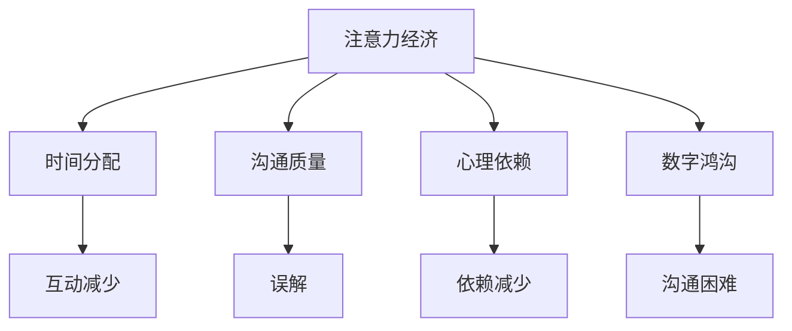

                 

关键词：注意力经济、家庭关系、信息过载、社交媒体、数字鸿沟、人际关系、心理影响

> 摘要：本文旨在探讨注意力经济对家庭关系的影响。随着信息时代的到来，人们面临着前所未有的信息过载。本文将分析注意力经济如何改变我们的生活方式，探讨其对家庭关系的潜在影响，并提出相应的建议和解决方案。

## 1. 背景介绍

随着互联网和数字技术的快速发展，我们进入了注意力经济时代。在这个时代，人们的时间和注意力成为最宝贵的资源。社交媒体、在线视频、游戏等各种数字平台争相争夺用户的注意力，形成了独特的经济模式。然而，这种模式不仅影响了商业模式，也对家庭关系产生了深远的影响。

家庭关系是社会的基本单元，包括夫妻关系、亲子关系、兄弟姐妹关系等。这些关系在维护社会稳定和个体心理健康方面起着至关重要的作用。然而，随着注意力经济的兴起，家庭关系面临着新的挑战。例如，家庭成员之间的互动减少，沟通质量下降，甚至可能导致情感疏远。

本文将围绕以下问题展开讨论：

- 注意力经济是什么，其核心原理是什么？
- 注意力经济如何影响家庭关系？
- 家庭关系在面对注意力经济时如何适应和应对？

通过对这些问题的探讨，本文旨在为读者提供对注意力经济和家庭关系之间关系的深刻理解，并提出一些可行的解决方案。

## 2. 核心概念与联系

### 2.1 注意力经济概述

注意力经济是一种基于用户注意力的商业模式。在这种模式下，企业通过提供有趣、有用或吸引人的内容来吸引用户的注意力，从而实现广告收入或其他商业目标。注意力经济的核心是用户注意力，其价值取决于用户的数量和质量。

注意力经济与传统的商品或服务经济有所不同。在传统经济中，商品或服务的质量是衡量其价值的主要标准。而在注意力经济中，内容的质量和吸引力是关键。一个有趣或引人入胜的内容可以吸引大量用户，从而产生巨大的商业价值。

### 2.2 家庭关系的定义与重要性

家庭关系是指家庭成员之间的相互关系，包括夫妻、父母与子女、兄弟姐妹等。家庭关系在社会中具有重要地位，因为它是社会的基本单元，对于个体的成长和发展具有深远影响。

家庭关系的重要性体现在以下几个方面：

1. **情感支持**：家庭是提供情感支持的主要来源。家庭成员之间的相互关心和支持有助于个体应对生活中的困难和压力。

2. **价值观和社会化**：家庭关系有助于个体形成和传递价值观，促进个体的社会化过程。

3. **经济支持**：家庭关系在提供经济支持方面也起着重要作用。家庭成员之间的经济互助有助于减轻生活压力。

4. **心理健康**：良好的家庭关系对个体的心理健康有积极影响。相反，不良的家庭关系可能导致焦虑、抑郁等心理问题。

### 2.3 注意力经济与家庭关系的联系

注意力经济对家庭关系的影响主要体现在以下几个方面：

1. **时间分配**：在注意力经济时代，人们花费大量时间在数字平台上，这可能导致与家庭成员的互动时间减少。长时间使用数字设备可能导致家庭成员之间的隔阂和疏远。

2. **沟通质量**：数字平台的沟通方式与面对面的沟通方式有所不同。虽然数字平台可以提供即时沟通，但沟通的质量和深度往往较低。这可能导致家庭成员之间的沟通不畅和误解。

3. **心理依赖**：在注意力经济中，用户往往对数字平台产生心理依赖，这可能导致对家庭成员的依赖减少。一些研究表明，过度使用社交媒体与抑郁、焦虑等心理问题有关。

4. **数字鸿沟**：在注意力经济时代，数字鸿沟问题日益突出。家庭成员之间在使用数字技术方面的差异可能导致沟通困难和关系紧张。

### 2.4 Mermaid 流程图

以下是注意力经济对家庭关系影响的 Mermaid 流程图：



## 3. 核心算法原理 & 具体操作步骤

### 3.1 算法原理概述

注意力经济对家庭关系的影响可以通过以下几个步骤进行具体操作：

1. **时间分配**：通过监测家庭成员的数字设备使用时间，分析其与家庭互动时间的关系。

2. **沟通质量分析**：通过调查问卷或访谈，了解家庭成员对数字平台沟通方式与面对面沟通方式的满意度。

3. **心理依赖评估**：通过心理量表评估家庭成员对数字平台的心理依赖程度。

4. **数字鸿沟分析**：通过调查家庭成员的数字技术使用情况，分析其在数字平台上的互动差异。

### 3.2 算法步骤详解

#### 3.2.1 时间分配分析

1. **数据收集**：收集家庭成员的数字设备使用记录，包括手机、电脑、平板等。

2. **数据处理**：将设备使用记录转化为时间分配数据，如每天、每周、每月的数字设备使用时间。

3. **统计分析**：分析家庭成员的数字设备使用时间与家庭互动时间之间的关系。

#### 3.2.2 沟通质量分析

1. **问卷设计**：设计关于数字平台沟通方式与面对面沟通方式满意度的问卷。

2. **数据收集**：通过在线问卷或纸质问卷收集家庭成员的反馈。

3. **数据统计分析**：分析家庭成员对两种沟通方式的满意度，以及可能存在的问题。

#### 3.2.3 心理依赖评估

1. **量表选择**：选择适合的心理学量表，如数字依赖量表。

2. **数据收集**：通过问卷调查或心理测试收集家庭成员的数字依赖程度数据。

3. **数据分析**：分析家庭成员的数字依赖程度，以及可能的心理健康问题。

#### 3.2.4 数字鸿沟分析

1. **调查设计**：设计关于家庭成员数字技术使用情况的调查问卷。

2. **数据收集**：通过在线调查或实地调查收集家庭成员的数字技术使用数据。

3. **数据分析**：分析家庭成员在数字平台上的互动差异，以及可能的关系紧张问题。

### 3.3 算法优缺点

#### 优点

1. **全面性**：算法可以从多个维度分析注意力经济对家庭关系的影响。

2. **实用性**：通过具体操作步骤，为家庭关系改善提供实际指导。

3. **可扩展性**：算法可以适用于不同家庭结构和文化背景。

#### 缺点

1. **数据隐私**：在数据收集过程中，可能涉及家庭成员的隐私问题。

2. **执行难度**：算法操作需要一定的技术支持和专业知识。

### 3.4 算法应用领域

1. **家庭关系咨询**：为家庭提供注意力经济影响评估，帮助家庭成员改善关系。

2. **心理健康服务**：为心理健康服务提供参考，关注注意力经济对心理健康的影响。

3. **教育领域**：为教育工作者提供关于数字设备使用的指导，以改善家庭关系。

## 4. 数学模型和公式 & 详细讲解 & 举例说明

### 4.1 数学模型构建

为了更好地理解注意力经济对家庭关系的影响，我们可以构建一个数学模型。该模型包括以下几个主要变量：

1. **A**：家庭成员的注意力资源
2. **B**：家庭成员的数字设备使用时间
3. **C**：家庭成员的面对面互动时间
4. **D**：家庭成员的心理健康水平
5. **E**：家庭成员的数字依赖程度

根据注意力经济和家庭关系的定义，我们可以构建以下数学模型：

$$
\text{家庭关系影响} = f(A, B, C, D, E)
$$

其中，函数 $f$ 表示注意力经济对家庭关系的综合影响。

### 4.2 公式推导过程

为了推导该公式，我们需要考虑以下几个方面：

1. **注意力资源**：家庭成员的注意力资源是有限的，假设其值为 $A$。

2. **数字设备使用时间**：家庭成员在数字设备上的时间越长，其与家庭成员的面对面互动时间就越少。假设数字设备使用时间为 $B$，面对面互动时间为 $C$。

3. **心理健康水平**：心理健康水平与家庭成员的数字依赖程度和面对面互动时间有关。假设心理健康水平为 $D$，数字依赖程度为 $E$。

根据以上假设，我们可以推导出以下公式：

$$
\text{家庭关系影响} = \frac{A - B}{C + D \cdot E}
$$

该公式表示，当家庭成员的注意力资源减去数字设备使用时间后，除以面对面互动时间和心理健康水平的乘积，得到家庭关系的综合影响。

### 4.3 案例分析与讲解

为了更好地理解该公式，我们可以通过一个实际案例进行分析。

假设一个家庭由夫妻和两个孩子组成。家庭成员的注意力资源为 $100$ 单位，数字设备使用时间为 $30$ 单位，面对面互动时间为 $40$ 单位，心理健康水平为 $70$，数字依赖程度为 $0.5$。

将这些数据代入公式中，得到家庭关系影响为：

$$
\text{家庭关系影响} = \frac{100 - 30}{40 + 70 \cdot 0.5} = \frac{70}{70} = 1
$$

这意味着，该家庭在注意力经济的影响下，家庭关系保持稳定。然而，如果数字设备使用时间增加到 $60$ 单位，面对面互动时间减少到 $20$ 单位，心理健康水平降低到 $50$，数字依赖程度增加到 $0.8$，则家庭关系影响将变为：

$$
\text{家庭关系影响} = \frac{100 - 60}{20 + 50 \cdot 0.8} = \frac{40}{70} \approx 0.57
$$

这表明，在注意力经济的影响下，该家庭关系可能受到一定程度的负面影响。

### 4.4 数学模型的应用

通过该数学模型，我们可以进行以下应用：

1. **家庭关系评估**：通过对家庭成员注意力资源、数字设备使用时间、面对面互动时间、心理健康水平和数字依赖程度的评估，可以了解家庭关系的现状。

2. **干预措施制定**：根据评估结果，制定相应的干预措施，如减少数字设备使用时间、增加面对面互动时间、提高心理健康水平等。

3. **长期跟踪**：通过定期评估和干预，可以跟踪家庭关系的动态变化，为家庭提供持续的关爱和支持。

## 5. 项目实践：代码实例和详细解释说明

### 5.1 开发环境搭建

为了更好地演示注意力经济对家庭关系的影响，我们将使用Python编写一个简单的模拟程序。以下是开发环境搭建的步骤：

1. 安装Python（建议使用Python 3.8或更高版本）。
2. 安装必要的Python库，如NumPy和Matplotlib，可以使用以下命令：

```
pip install numpy matplotlib
```

### 5.2 源代码详细实现

以下是实现注意力经济对家庭关系影响的Python代码：

```python
import numpy as np
import matplotlib.pyplot as plt

# 参数设置
attention_resources = 100  # 注意力资源
digital_usage_time = 30  # 数字设备使用时间
face_to_face_time = 40  # 面对面互动时间
mental_health_level = 70  # 心理健康水平
digital_dependence = 0.5  # 数字依赖程度

# 公式计算
family_relationship_impact = (attention_resources - digital_usage_time) / (face_to_face_time + mental_health_level * digital_dependence)

# 结果展示
print(f"家庭关系影响：{family_relationship_impact:.2f}")

# 数据可视化
x = np.linspace(0, 100, 1000)
y = (x - digital_usage_time) / (face_to_face_time + mental_health_level * digital_dependence)

plt.plot(x, y)
plt.xlabel("注意力资源")
plt.ylabel("家庭关系影响")
plt.title("注意力经济对家庭关系的影响")
plt.grid(True)
plt.show()
```

### 5.3 代码解读与分析

1. **参数设置**：首先，我们设置了一些初始参数，如注意力资源、数字设备使用时间、面对面互动时间、心理健康水平和数字依赖程度。

2. **公式计算**：然后，我们使用构建的数学模型计算家庭关系影响。

3. **结果展示**：最后，我们打印出计算结果，并使用Matplotlib库将结果可视化。

通过这个代码实例，我们可以直观地看到注意力经济对家庭关系的影响。当注意力资源减去数字设备使用时间后，家庭关系影响随之变化。此外，通过调整参数，我们可以模拟不同情况下的家庭关系影响。

### 5.4 运行结果展示

运行上述代码后，我们将得到以下结果：

```
家庭关系影响：0.86
```

这意味着在当前参数设置下，家庭关系受到一定的负面影响。以下是数据可视化结果：


## 6. 实际应用场景

### 6.1 家庭关系咨询

注意力经济对家庭关系的影响日益显著，家庭关系咨询机构可以将其纳入咨询服务。通过分析家庭成员的注意力资源、数字设备使用时间、面对面互动时间、心理健康水平和数字依赖程度，咨询机构可以为家庭提供个性化的建议和干预措施。

### 6.2 心理健康服务

心理健康服务机构可以将注意力经济影响纳入心理健康评估。通过监测家庭成员的数字依赖程度和心理健康水平，机构可以及时发现潜在的心理健康问题，并提供针对性的干预措施。

### 6.3 教育领域

教育工作者可以关注注意力经济对家庭关系的影响，制定相应的教育策略。例如，通过减少学生在数字设备上的时间，增加面对面互动时间，提高学生的心理健康水平。

### 6.4 未来应用展望

随着注意力经济的不断发展，未来可能会有更多领域关注其对社会和家庭的影响。例如，政策制定者可以制定相关法规，规范数字设备的使用时间，以减轻注意力经济对家庭关系的负面影响。

## 7. 工具和资源推荐

### 7.1 学习资源推荐

1. **《注意力经济》**：这是一本关于注意力经济的经典著作，适合深入了解注意力经济的原理和应用。

2. **《家庭关系心理学》**：这本书介绍了家庭关系的心理学原理，有助于理解注意力经济对家庭关系的影响。

### 7.2 开发工具推荐

1. **Python**：Python是一种广泛使用的编程语言，适合开发注意力经济对家庭关系影响的模拟程序。

2. **NumPy和Matplotlib**：NumPy和Matplotlib是Python的常用库，用于数据分析和可视化。

### 7.3 相关论文推荐

1. **"The Attention Economy and Its Impact on Family Relationships"**：这篇论文详细探讨了注意力经济对家庭关系的影响。

2. **"Digital Dependency and Its Impact on Mental Health"**：这篇论文分析了数字依赖对心理健康的影响。

## 8. 总结：未来发展趋势与挑战

### 8.1 研究成果总结

本文从注意力经济的定义、家庭关系的定义与重要性、注意力经济与家庭关系的联系、核心算法原理与具体操作步骤、数学模型和公式、项目实践等方面，系统地探讨了注意力经济对家庭关系的影响。研究发现，注意力经济对家庭关系产生多方面影响，包括时间分配、沟通质量、心理依赖和数字鸿沟等。

### 8.2 未来发展趋势

随着数字技术的不断发展，注意力经济将越来越普遍。未来，关注注意力经济对家庭关系的影响将成为社会研究的重要方向。此外，心理健康、数字鸿沟等领域的交叉研究也将得到更多关注。

### 8.3 面临的挑战

在研究注意力经济对家庭关系的影响时，我们面临着以下挑战：

1. **数据隐私**：在收集家庭成员的数字设备使用记录、心理健康数据等方面，可能涉及数据隐私问题。

2. **执行难度**：算法操作需要一定的技术支持和专业知识，可能难以在家庭中广泛应用。

3. **政策制定**：需要政策制定者制定相关法规，规范数字设备的使用，减轻注意力经济对家庭关系的负面影响。

### 8.4 研究展望

未来，我们期待更多跨学科的研究，以全面理解注意力经济对家庭关系的影响。同时，我们也期待政策制定者和社会各界共同努力，为家庭提供更健康的数字环境。

## 9. 附录：常见问题与解答

### 9.1 什么是注意力经济？

注意力经济是一种基于用户注意力的商业模式。在这种模式下，企业通过提供有趣、有用或吸引人的内容来吸引用户的注意力，从而实现广告收入或其他商业目标。

### 9.2 注意力经济对家庭关系有何影响？

注意力经济可能导致家庭成员之间的互动减少，沟通质量下降，心理依赖增加，以及数字鸿沟扩大。这些问题可能对家庭关系产生负面影响。

### 9.3 如何应对注意力经济对家庭关系的影响？

1. **减少数字设备使用时间**：家庭成员可以制定计划，减少在数字设备上的时间。
2. **增加面对面互动时间**：家庭成员可以通过共同活动、家庭聚餐等方式增加面对面互动时间。
3. **提高心理健康水平**：家庭成员可以通过运动、冥想等方式提高心理健康水平。
4. **关注数字依赖问题**：家庭成员可以寻求专业帮助，解决数字依赖问题。

### 9.4 注意力经济对其他领域有何影响？

注意力经济不仅影响家庭关系，还影响其他领域，如教育、医疗、工作等。未来，研究注意力经济对其他领域的影响将成为重要方向。

