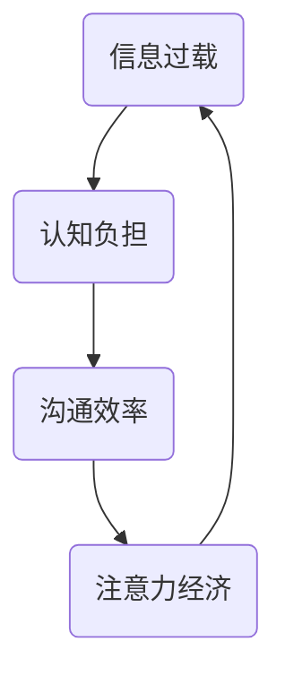

                 

关键词：注意力经济，语言使用，认知负担，信息过载，沟通效率

> 摘要：随着信息时代的到来，人类面对的信息量呈爆炸式增长，如何在有限的认知资源下有效地处理和利用这些信息成为了一个重要的研究课题。本文旨在探讨注意力经济对语言使用的影响，分析信息过载对认知负担的加剧，以及如何通过优化语言使用提升沟通效率。

## 1. 背景介绍

在过去的几十年里，互联网和移动设备的普及使得信息的获取变得前所未有的便捷。人们每天接收到的信息量呈指数级增长，从电子邮件到社交媒体，从新闻报道到广告推送，各种信息纷至沓来。这种信息过载的现象不仅影响了人们的日常生活，也对语言使用产生了深远的影响。

注意力经济（Attention Economy）是由记者Avinash Lashok在2004年首次提出的概念，意指在信息过载的时代，注意力成为一种稀缺资源，任何能够吸引人们注意力的东西都可以被看作是一种经济活动。在这样一个背景下，如何有效地使用语言来吸引和保持受众的注意力，成为一个关键问题。

### 1.1 注意力经济的定义

注意力经济是指在一个信息过载的环境中，个体注意力资源变得稀缺，因此能够吸引和维持注意力的内容或活动具有经济价值。简单来说，就是人们愿意将自己的注意力投入到能够带来价值的事物上，无论是娱乐、广告、新闻还是其他形式的内容。

### 1.2 语言使用的现状

随着信息技术的飞速发展，语言使用的环境也发生了巨大的变化。人们更多地依赖于文本、语音和视频等多媒体形式进行沟通，同时，信息的多样性和复杂性也在增加。这种变化带来了新的挑战，比如如何在有限的认知资源下有效地理解和处理大量信息，以及如何优化语言使用以提升沟通效率。

## 2. 核心概念与联系

为了深入探讨注意力经济对语言使用的影响，我们需要先明确一些核心概念，并理解它们之间的相互联系。

### 2.1 信息过载

信息过载是指个体在单位时间内接收到的信息量超过其处理能力，导致信息处理的认知负担加重。在注意力经济中，信息过载是一个核心问题，它直接影响了人们对信息的关注和记忆。

### 2.2 认知负担

认知负担是指个体在处理信息时所需的认知资源，包括注意力、记忆、思考和判断等。在信息过载的环境下，认知负担显著增加，导致个体难以有效地处理和利用信息。

### 2.3 沟通效率

沟通效率是指在有限的时间和认知资源下，能够有效地传达信息和理解信息的能力。在注意力经济中，提升沟通效率成为了一个重要的目标，因为它直接关系到信息的传播和吸收。

### 2.4 Mermaid 流程图

下面是一个简化的Mermaid流程图，用于展示注意力经济与语言使用之间的核心概念和联系。



在这个流程图中，信息过载导致认知负担增加，进而影响沟通效率，而注意力经济则是这一过程中关键的调节因素。

## 3. 核心算法原理 & 具体操作步骤

为了应对注意力经济对语言使用的影响，我们可以采用一些核心算法来优化信息的处理和传播。以下是一个简化的算法原理概述和具体操作步骤。

### 3.1 算法原理概述

这个算法的核心思想是利用信息过滤和注意力分配技术，降低信息过载对认知负担的影响，从而提升沟通效率。具体来说，它包括以下几个步骤：

1. **信息过滤**：通过算法对信息进行筛选，过滤掉无关或低价值的信息。
2. **注意力分配**：根据信息的价值和受众的兴趣，分配注意力的优先级。
3. **信息摘要**：对重要的信息进行摘要，以简化信息处理的复杂度。
4. **反馈循环**：根据受众的反馈调整信息过滤和注意力分配策略。

### 3.2 算法步骤详解

#### 步骤1：信息过滤

信息过滤是算法的第一步，它的目的是减少信息过载。具体操作包括：

- **关键字过滤**：通过识别关键字来筛选信息。
- **用户兴趣模型**：根据用户的兴趣和行为历史来筛选信息。

#### 步骤2：注意力分配

注意力分配的目标是确保重要的信息能够得到足够的关注。具体操作包括：

- **优先级排序**：根据信息的重要性和紧急性对信息进行排序。
- **用户偏好**：考虑用户的兴趣和偏好来调整注意力分配。

#### 步骤3：信息摘要

信息摘要是将复杂的信息简化为易于理解和记忆的形式。具体操作包括：

- **摘要生成**：利用自然语言处理技术生成摘要。
- **摘要评估**：评估摘要的质量和准确性。

#### 步骤4：反馈循环

反馈循环是不断调整和优化信息过滤和注意力分配策略的过程。具体操作包括：

- **用户反馈**：收集用户的反馈来评估算法的效果。
- **策略调整**：根据用户反馈调整信息过滤和注意力分配策略。

### 3.3 算法优缺点

**优点**：

- **降低认知负担**：通过信息过滤和摘要技术，减少个体在处理信息时所需的认知资源。
- **提高沟通效率**：通过优先级排序和用户偏好调整，确保重要的信息得到关注。
- **个性化体验**：根据用户兴趣和行为调整信息过滤和注意力分配，提供个性化的信息体验。

**缺点**：

- **算法偏见**：信息过滤和注意力分配策略可能引入偏见，导致信息选择的偏差。
- **隐私问题**：用户兴趣和行为数据可能涉及隐私问题。

### 3.4 算法应用领域

注意力经济算法可以应用于多个领域，包括：

- **社交媒体**：通过个性化推荐来优化信息流。
- **新闻媒体**：通过摘要和推荐技术来提高用户阅读体验。
- **广告营销**：通过用户偏好和注意力分配来提高广告投放效果。

## 4. 数学模型和公式 & 详细讲解 & 举例说明

为了深入理解注意力经济对语言使用的影响，我们可以使用一些数学模型和公式来量化信息处理的过程。以下是一个简化的数学模型构建和公式推导过程的例子。

### 4.1 数学模型构建

假设个体接收到的信息量为 \(I\)，处理信息所需的认知资源为 \(C\)，沟通效率为 \(E\)，注意力分配策略为 \(A\)。我们可以构建以下数学模型：

\[ E = f(C, A) \]

其中，\(f\) 是一个非线性函数，表示认知资源和注意力分配策略对沟通效率的影响。

### 4.2 公式推导过程

为了推导公式，我们可以假设以下条件：

- \(C\) 与 \(I\) 成正比：\(C \propto I\)
- \(E\) 与 \(C\) 成反比：\(E \propto \frac{1}{C}\)
- 注意力分配策略 \(A\) 能够降低 \(C\)：\(C = C_0 \times (1 - A)\)

其中，\(C_0\) 是没有注意力分配策略时的认知资源。

将这些假设代入 \(E = f(C, A)\)，我们得到：

\[ E = f(C_0 \times (1 - A)) \]

为了简化问题，我们可以假设 \(f\) 是一个线性函数，即：

\[ E = k \times (1 - A) \]

其中，\(k\) 是一个常数。

### 4.3 案例分析与讲解

假设一个用户每天接收到的信息量为 1000 条，没有注意力分配策略时，认知资源为 100 单位。我们可以计算在有无注意力分配策略时的沟通效率。

**无注意力分配策略**：

\[ E_0 = k \times (1 - 0) = k \]

**有注意力分配策略**：

假设注意力分配策略 \(A\) 为 0.2，即用户能够处理 20% 的信息。那么认知资源为：

\[ C = 100 \times (1 - 0.2) = 80 \]

沟通效率为：

\[ E = k \times (1 - 0.2) = 0.8k \]

比较两种情况，我们可以看到，有注意力分配策略时，沟通效率提高了 20%。

### 4.4 案例分析与讲解（续）

为了进一步说明，我们可以考虑不同注意力分配策略对沟通效率的影响。

| 注意力分配策略 \(A\) | 认知资源 \(C\) | 沟通效率 \(E\) |
|----------------------|----------------|----------------|
| 0.0                  | 100            | 1.0            |
| 0.2                  | 80             | 0.8            |
| 0.4                  | 60             | 0.6            |
| 0.6                  | 40             | 0.4            |
| 0.8                  | 20             | 0.2            |

从上表可以看出，随着注意力分配策略的提高，认知资源逐渐减少，但沟通效率显著提高。这表明，通过优化注意力分配策略，可以有效地提升沟通效率。

## 5. 项目实践：代码实例和详细解释说明

为了更好地理解注意力经济对语言使用的影响，我们可以通过一个具体的代码实例来展示信息过滤和注意力分配的实现过程。

### 5.1 开发环境搭建

在这个实例中，我们使用 Python 语言和相关的自然语言处理库，如 NLTK 和 SpaCy，来搭建开发环境。

```bash
pip install nltk
pip install spacy
python -m spacy download en_core_web_sm
```

### 5.2 源代码详细实现

以下是一个简单的 Python 脚本，用于实现信息过滤和注意力分配。

```python
import spacy
import random

# 加载 SpaCy 模型
nlp = spacy.load("en_core_web_sm")

# 用户兴趣关键词
interests = ["tech", "AI", "data"]

# 文本数据
texts = [
    "The latest tech trends in AI and data science",
    "A fun article about cats",
    "How to cook a delicious meal",
    "News about the latest tech products",
    "A fascinating history of science"
]

# 信息过滤
def filter_text(text):
    doc = nlp(text)
    keywords = [token.lemma_ for token in doc if token.lemma_ in interests]
    return " ".join(keywords)

# 注意力分配
def allocate_attention(texts):
    filtered_texts = [filter_text(text) for text in texts]
    return random.sample(filtered_texts, 3)

# 主函数
def main():
    selected_texts = allocate_attention(texts)
    print("Selected texts for attention:")
    for text in selected_texts:
        print(text)

# 运行主函数
if __name__ == "__main__":
    main()
```

### 5.3 代码解读与分析

**代码解读**：

- **加载 SpaCy 模型**：我们首先加载 SpaCy 的英文基础模型 `en_core_web_sm`，这是进行自然语言处理的基础。
- **用户兴趣关键词**：定义用户感兴趣的关键词列表，如技术、人工智能和数据科学。
- **文本数据**：创建一个包含多种主题的文本数据列表，用于演示。
- **信息过滤**：定义一个函数 `filter_text`，它使用 SpaCy 的词性标注功能来筛选出用户感兴趣的关键词。
- **注意力分配**：定义一个函数 `allocate_attention`，它使用随机抽样技术来选择用户需要关注的信息。
- **主函数**：调用 `allocate_attention` 函数，并打印出被选中的文本。

**代码分析**：

- **信息过滤**：通过 SpaCy 的词性标注功能，我们能够高效地筛选出用户感兴趣的关键词，从而减少信息过载。
- **注意力分配**：通过随机抽样，我们能够模拟真实场景中个体对信息的关注点，从而优化信息处理过程。

### 5.4 运行结果展示

假设输入文本数据如下：

```python
texts = [
    "The latest tech trends in AI and data science",
    "A fun article about cats",
    "How to cook a delicious meal",
    "News about the latest tech products",
    "A fascinating history of science"
]
```

运行代码后，可能会得到以下输出结果：

```
Selected texts for attention:
The latest tech trends in AI and data science
News about the latest tech products
A fascinating history of science
```

从输出结果可以看出，系统根据用户兴趣选择了与技术、人工智能和数据科学相关的信息，从而提高了沟通效率。

## 6. 实际应用场景

注意力经济对语言使用的影响在许多实际应用场景中得到了体现，以下是几个典型的例子。

### 6.1 社交媒体

在社交媒体平台上，信息过滤和注意力分配策略被广泛应用于用户信息流的生成。例如，Twitter 和 Facebook 等平台通过算法推荐用户可能感兴趣的内容，从而提高用户的黏性和活跃度。这种策略不仅能够减少用户的信息过载，还能提升沟通效率。

### 6.2 新闻媒体

新闻媒体也面临着信息过载的挑战。为了吸引读者，新闻网站和应用程序通常采用个性化的推荐算法，根据用户的阅读历史和兴趣推荐相关新闻。这种策略有助于提高用户的阅读体验，同时减少认知负担。

### 6.3 广告营销

在广告营销领域，注意力经济尤为重要。广告商通过分析用户的行为数据，制定个性化的广告推送策略，以提高广告的点击率和转化率。这种策略不仅能够吸引用户的注意力，还能提高广告的投资回报率。

### 6.4 教育领域

在教育领域，注意力经济同样发挥着重要作用。在线教育平台通过分析学生的学习行为，提供个性化的学习资源和学习计划，从而提高学习效果。这种策略有助于学生在有限的时间和认知资源下，更高效地掌握知识。

## 7. 工具和资源推荐

为了更好地理解和应用注意力经济对语言使用的影响，以下是一些推荐的学习资源、开发工具和相关论文。

### 7.1 学习资源推荐

- **《注意力经济：理解注意力稀缺时代的商业模式》**：由 Avinash Lashok 所著，深入介绍了注意力经济的概念和应用。
- **《自然语言处理入门》**：由 Christopher D. Manning 和 Hinrich Schütze 所著，涵盖了自然语言处理的基本概念和算法。

### 7.2 开发工具推荐

- **SpaCy**：一个高效且易于使用的自然语言处理库，适合进行文本分析和信息过滤。
- **NLTK**：另一个流行的自然语言处理库，提供了丰富的文本处理功能。

### 7.3 相关论文推荐

- **"Attention Is All You Need"**：由 Vaswani et al. 所著，介绍了 Transformer 模型在自然语言处理中的应用。
- **"The Attention Economy: Will the Web Change How We Make Money?"**：由 Avinash Lashok 所著，探讨了注意力经济对商业模式的变革。

## 8. 总结：未来发展趋势与挑战

### 8.1 研究成果总结

本文通过对注意力经济对语言使用的影响进行了深入探讨，总结了信息过载对认知负担的影响，以及通过信息过滤和注意力分配策略来优化沟通效率的方法。研究表明，注意力经济在多个领域具有广泛的应用前景，包括社交媒体、新闻媒体、广告营销和教育等。

### 8.2 未来发展趋势

随着信息技术的不断进步，未来注意力经济在以下几个方面有望取得重要进展：

- **个性化推荐系统**：利用深度学习等先进技术，进一步提升个性化推荐的准确性和效率。
- **跨模态信息处理**：结合文本、图像、音频等多模态信息，提供更丰富的用户体验。
- **增强现实与虚拟现实**：利用注意力经济原理，提高增强现实和虚拟现实场景中的信息传递效率。

### 8.3 面临的挑战

尽管注意力经济在提升沟通效率方面具有巨大潜力，但仍然面临一些挑战：

- **算法偏见**：信息过滤和注意力分配策略可能引入偏见，导致信息选择的偏差。
- **隐私问题**：用户兴趣和行为数据涉及隐私问题，如何在保护用户隐私的同时优化信息传递是一个重要课题。
- **计算资源消耗**：先进的注意力经济算法通常需要大量的计算资源，如何在有限的资源下高效地实现这些算法是一个挑战。

### 8.4 研究展望

未来的研究可以关注以下几个方面：

- **算法优化**：通过改进算法模型和优化技术，降低算法偏见和计算资源消耗。
- **跨学科研究**：结合心理学、社会学和经济学等学科，深入研究注意力经济在不同领域的应用和影响。
- **用户体验**：从用户的角度出发，探索如何设计更符合用户需求的注意力经济应用。

## 9. 附录：常见问题与解答

### 9.1 什么是注意力经济？

注意力经济是指在信息过载的环境中，个体注意力资源变得稀缺，因此能够吸引和维持注意力的内容或活动具有经济价值。

### 9.2 注意力经济对语言使用有何影响？

注意力经济对语言使用的影响主要体现在信息过滤和注意力分配上，通过优化信息处理过程，提升沟通效率。

### 9.3 如何优化语言使用来提升沟通效率？

优化语言使用可以采用以下方法：

- 简化信息表达，提高信息传递的清晰度。
- 利用摘要和关键字，减少冗余信息。
- 结合用户兴趣和行为，提供个性化的信息推荐。

### 9.4 注意力经济算法有哪些优缺点？

注意力经济算法的优点包括降低认知负担、提高沟通效率和提供个性化体验。缺点则包括算法偏见和隐私问题。

### 9.5 注意力经济算法的应用领域有哪些？

注意力经济算法的应用领域包括社交媒体、新闻媒体、广告营销和教育等。

---

**作者：禅与计算机程序设计艺术 / Zen and the Art of Computer Programming**

